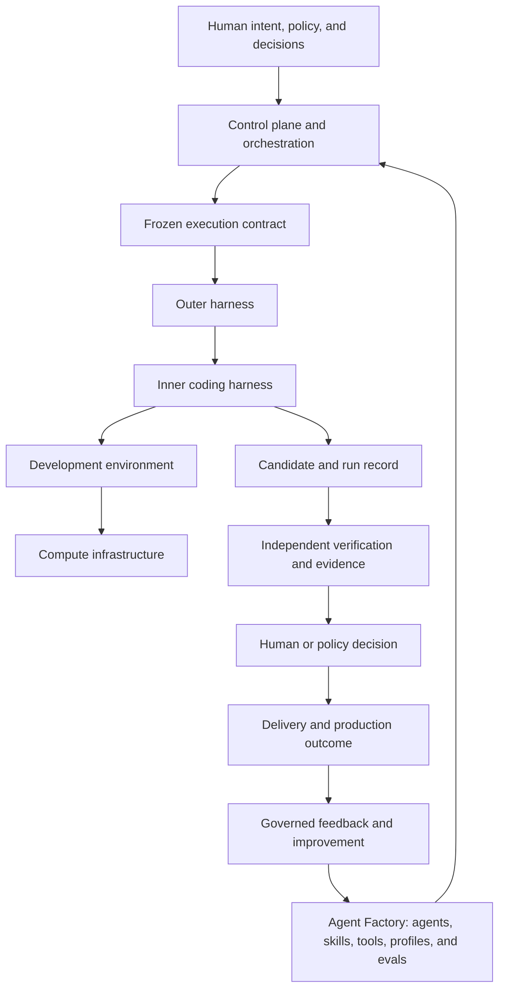

# AI Software Factory Mastery

## Build the system around the agent

AI Software Factory Mastery is a technical curriculum and architecture
reference for turning human intent into validated software through bounded
agents, durable execution, independent evidence, and explicit authority.

It is designed for leaders and builders who need to move beyond isolated AI
coding tools into a software-delivery system they can explain, operate, and
trust.

> **Intent → Plan → Define Agent → Execute through Harness → Apply Skills →
> Evaluate → Improve → Deliver Software**

## Choose your starting point

| You are | Your goal | Start here |
| --- | --- | --- |
| Executive | Understand value, risk, accountability, and adoption in 20 minutes | [Executive path](./guide/00-overview/06-reading-paths.md#executive-path--20-minutes) |
| Architect | Whiteboard the complete system and its authority boundaries | [Architect path](./guide/00-overview/06-reading-paths.md#architect-path--2-hours) |
| Builder | Implement a governed path from issue to validated pull request | [Builder path](./guide/00-overview/06-reading-paths.md#builder-path--hands-on) |
| Deep-study reader | Master the full curriculum, labs, and interview material | [Deep Study path](./guide/00-overview/06-reading-paths.md#deep-study-path--complete-curriculum) |

[Compare all reading paths](./guide/00-overview/06-reading-paths.md) or use the
[topic index](./guide/00-overview/07-topic-index.md) when you already know the
question you need to answer.

## The system in one view



The downward path delegates bounded capability. The upward path reports
observations, evidence, and outcomes. An executor cannot grant itself authority
or certify its own material work.

## Three definitions to retain

**Agent Factory** creates, versions, evaluates, publishes, and governs reusable
capabilities such as agents, skills, tools, model profiles, and configurations.

**AI Software Factory** composes people, policy, capabilities, execution,
verification, delivery, and feedback from intent through validated production
value.

**Mission Control** is the living implementation and case study for the
control-plane responsibilities required to govern execution, evidence, and
human authority. It is not the definition of the complete factory.

Read [Software Factory Stack Boundaries](./guide/00-overview/05-software-factory-stack-boundaries.md)
for the complete separation among the control plane, orchestrator, inner and
outer harnesses, development environment, compute, Agent Factory, and software
factory.

## What the curriculum covers

- factory architecture, operating models, economics, and adoption;
- business intent, executable specifications, and delivery records;
- AI coding agents, agent orchestration, workflows, and loop engineering;
- coding harnesses, adapters, lifecycle hooks, MCP, ACP, AG-UI, and A2A;
- data, knowledge, semantic, context, and model engineering;
- development environments, compute fleets, sandboxes, and composable
  infrastructure;
- evaluation datasets, trials, graders, trace replay, and run comparison;
- independent verification, proof packages, provenance, and quality gates;
- production feedback, reproduction, automated review, and merge maintenance;
- multi-repository delivery, dependency coordination, submodules, and subtrees;
- security, identity, policy, progressive autonomy, and human decision rights;
- compounding engineering, controlled improvement, and human-attention
  economics; and
- case studies, labs, whiteboard exercises, and interview practice.

## How to use the repository

1. Start with the [high-level guide](./guide/00-overview/README.md).
2. Choose a [reading path](./guide/00-overview/06-reading-paths.md).
3. Use each chapter's **Quick Read** before deciding whether to continue into
   the full treatment.
4. Use the [canonical glossary](./guide/00-overview/02-canonical-glossary.md)
   for precise terminology.
5. Use the [curriculum map](./guide/README.md) for the complete sequence.
6. Use the [Mission Control capability and admission map](./guide/09-mission-control-case-studies/03-capability-workflow-and-admission-map.md)
   for current, versioned implementation claims.
7. Complete the [golden-path lab](./guide/10-labs/01-governed-issue-to-validated-pull-request.md)
   before claiming practical mastery.

## Repository layout

| Path | What it holds |
| --- | --- |
| `guide/` | The curriculum. Markdown here is the authoritative source. |
| `site/` | A Next.js application that publishes `guide/` as a reading experience. |
| `source-material/` | Raw inputs the chapters were written from. |
| `docs/` | Working records for the repository itself. |

The curriculum is written in Markdown, but the repository is not documentation
only. `site/` is a deployable Next.js 16 application with its own dependencies,
lint configuration, test suite, and build — and it is what readers actually see.
Editing a chapter changes the site, because `site/scripts/generate-content.mjs`
indexes `guide/` into the site's content and search data before every
development server start, lint run, and build.

Requires Node.js 22.13 or newer.

```bash
cd site
npm install
npm run dev     # http://localhost:3000
```

Before publishing a change, run the full sequence from `site/`:

```bash
npm run links   # relative Markdown links in README.md and guide/ resolve
npm run lint    # ESLint, including the React, hooks, and jsx-a11y rules
npm run build   # production build
npm test        # renders the built worker and asserts on the HTML
```

`npm test` renders pages from `site/dist/`, so run `npm run build` first — the
suite has no dev server and will fail against a missing or stale build.
See [the site README](./site/README.md) for the content flow in detail.

## Governing principles

1. Humans own intent, judgment, material risk, and irreversible decisions.
2. Agents operate only inside explicitly granted authority.
3. Independent evidence—not an agent saying “done”—determines readiness.
4. Simple deterministic work should remain deterministic.
5. Failure must be detectable, bounded, recoverable, and attributable.
6. Autonomy increases only when measured outcomes justify it.
7. Learning may be automated; promotion remains governed.

## What mastery looks like

You can explain the system at executive and engineering depth, redraw its
authority boundaries, identify its authoritative records, design failure and
recovery paths, evaluate complete agent configurations, distinguish current
evidence from future vision, and implement a governed path from intent to a
reviewable software candidate.

The repository remains active research and development. Full chapters are
`draft-for-study` until their labs, teach-backs, and independent review are
complete.
