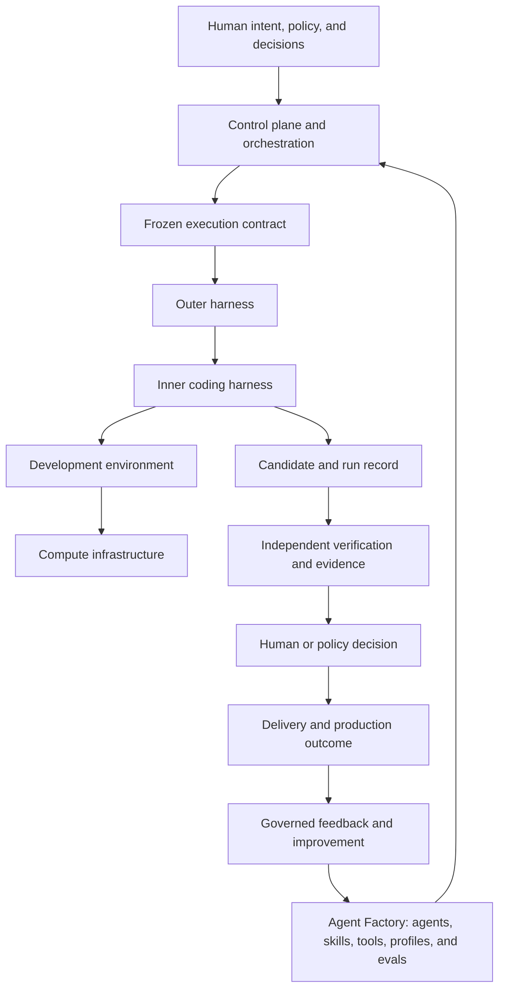

# The AI Software Factory Guide

## Build the system around the agent

A field guide to designing, building, proving, operating, and improving an
**AI Software Factory**: an engineering system in which humans define intent
and accept risk, bounded agents plan, implement, validate, and recover, and
independent evidence — not an agent saying "done" — decides what advances.

> **Intent → Plan → Define Agent → Execute through Harness → Apply Skills →
> Evaluate → Improve → Deliver Software**

Read it front to back, or enter at the part that matches your question.

## The six parts

| Part | Question it answers | Chapters |
| --- | --- | --- |
| I. Understand | What is an AI Software Factory, what are its parts, and what principles hold it together? | 1–3 |
| II. Design | What records, decisions, authority, and economics must exist before any agent runs? | 4–9 |
| III. Build | How do you assemble capabilities, runtime, harnesses, environments, AI layers, and workflows? | 10–20 |
| IV. Prove | How do you know the factory's output is correct, safe, and releasable? | 21–26 |
| V. Operate | How do you run it as a production platform? | 27–31 |
| VI. Improve | How does it get better without authorizing itself? | 32–36 |

Start with [How to read this guide](./guide/00-front-matter/00-how-to-read-this-guide.md),
then [Chapter 1](./guide/01-understand/01-why-software-engineering-is-changing.md).
The [book map](./guide/README.md) lists every chapter and appendix.

## The system in one view



The downward path delegates bounded capability. The upward path reports
observations, evidence, and outcomes. An executor cannot grant itself authority
or certify its own material work. [Chapter 2](./guide/01-understand/02-the-factory-in-one-view.md)
draws the whole system.

## Three definitions to retain

**Agent Factory** creates, versions, evaluates, publishes, and governs reusable
capabilities such as agents, skills, tools, model profiles, and configurations.

**AI Software Factory** composes people, policy, capabilities, execution,
verification, delivery, and feedback from intent through validated production
value.

**Mission Control** is the living implementation and case study for the
control-plane responsibilities required to govern execution, evidence, and
human authority. It is not the definition of the complete factory.

## Governing principles

1. Humans own intent, judgment, material risk, and irreversible decisions.
2. Agents operate only inside explicitly granted authority.
3. Independent evidence—not an agent saying "done"—determines readiness.
4. Simple deterministic work should remain deterministic.
5. Failure must be detectable, bounded, recoverable, and attributable.
6. Autonomy increases only when measured outcomes justify it.
7. Learning may be automated; promotion remains governed.

## Repository layout

- `guide/` — the book: front matter, six parts (36 chapters), appendices
  (glossary, Mission Control case studies, research canon, coverage and
  maturity, changelog, reviewer guide, architecture communication).
- `archive/guide-v1/` — the previous curriculum, preserved unchanged for
  provenance. `docs/plans/coverage-map.md` records where every v1 chapter went.
- `source-material/` — Jay's original mission, study guide, and capability
  taxonomy, preserved verbatim.
- `site/` — the documentation site (Guide · Atlas · Reference · Glossary).
- `docs/` — plans, reviews, usability notes, and the nightly backlog.

## Conventions

Each chapter follows the same shape: the problem, how it works, how to build
it, failure modes, an honest "In Mission Control" note pinned to a studied
commit, "Retain this", and "Go deeper". Terms are bolded on first use. Diagrams
are Mermaid. Marked **infographic slots** hold the place for Jay's own graphics;
a first-party diagram carries the concept until then.

Every "In Mission Control" section separates implemented, partial, and future
capability. Documentation breadth is not proof of an operational
implementation; see [Coverage and maturity](./guide/appendix/coverage-and-maturity.md).

## Site

```bash
cd site && npm install && npm run dev
```

`npm run build`, `npm test`, `npm run lint`, and `npm run links` must pass
before publishing.
