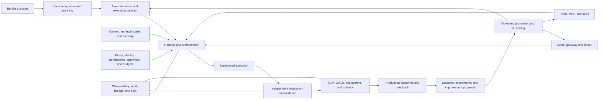
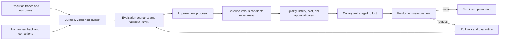

# Platform Blueprint and Operating Playbook

This overview connects the factory's product thesis, capability model,
reference architecture, reliability and security posture, learning system,
adoption model, and success measures. It is a scope map, not a claim that every
capability is implemented. The detailed chapters distinguish enduring
principles, current Mission Control evidence, and future vision.

## Factory in one line

> **Intent → Plan → Define Agent → Execute through Harness → Apply Skills →
> Evaluate → Improve → Deliver Software**

This is a value-stream mnemonic, not a claim that the factory is eight serial
services. Skills are selected and frozen before execution, then applied inside
the harnessed loop. Improvement consumes evaluation and production evidence to
create governed candidates for future runs. It cannot self-promote or silently
mutate the active Attempt. The
[Intent-to-Delivery Lifecycle](./04-intent-to-delivery-lifecycle.md) defines the
precise stage contracts.

The AI Software Factory is not merely an AI coding assistant. It is the
platform and control system that makes agentic software engineering
repeatable, governed, measurable, and scalable across thousands of engineers.

## Five platform commitments

### 1. Builder intent becomes the interface

The factory should begin with the outcome a builder wants, not with its agent
topology. Developers are the first users, followed by product managers, quality
engineers, designers, security engineers, and other builders. Each persona
should be able to express intent, constraints, acceptance criteria, and risk
through a surface appropriate to their work without understanding the
underlying model, agent, tool, or orchestration architecture.

### 2. Models become interchangeable execution resources

Models sit behind a governed gateway. Routing is model-independent and based
on the task's required capability, measured quality, cost, latency, context
window, security and data policy, availability, historical task performance,
and defined fallback behavior. A provider name is never the architecture.

### 3. The harness—not the model—creates production reliability

Models reason and propose actions. The harness owns tools, state, permissions,
recovery, stop conditions, sandboxing, execution control, observability, time,
and budget. Reliable autonomy comes from this surrounding system and its
operational controls, not from assuming that a model is infallible.

### 4. Agents do not certify their own work

Completion requires evidence from independent verification, deterministic
checks, trajectory evaluation, and baseline comparison. Human authority
remains mandatory for consequential actions and risk acceptance. The system
evaluates both the artifact and the path that produced it.

### 5. Learning is automated; promotion is governed

Production signals may construct datasets, cluster failures, and propose
changes to prompts, skills, tools, routes, or policies. A candidate becomes the
new default only after evaluation, comparison with the current baseline,
approval at the appropriate risk level, controlled rollout, and retained
rollback capability.

> **Learning can be autonomous. Promotion should be governed.**

Together, these commitments connect builder experience, model independence,
model recommendations, token economics, evaluation, feedback and learning,
security, fast release cycles, and Mission Control.

## Builder experience and personas

The primary product is a trustworthy path from intent to evidence-backed
software, not a collection of agent settings.

| Persona | Intent they express | Evidence they need back |
| --- | --- | --- |
| Developer | Implement, debug, refactor, test, or review a bounded change | Diff, tests, diagnostics, decisions, unresolved risk, and a review-ready PR |
| Product manager | Deliver an outcome within scope, policy, and time constraints | Criteria coverage, product behavior, tradeoffs, release state, and outcome measures |
| Quality engineer | Prove behavior, failure handling, and regression safety | Independent test results, coverage of risks and criteria, and reproducible evidence |
| Designer | Change an experience while preserving system and accessibility constraints | Visual/interaction evidence, state coverage, accessibility checks, and implementation fidelity |
| Security or platform engineer | Enforce a control, integration, or paved path | Policy decisions, identity and provenance, denial evidence, adoption, and reliability |

Every builder surface should expose clear lifecycle state, approvals, failures,
recovery actions, costs, and evidence. It should not expose internal agent
complexity unless that information helps the builder make a decision.

## End-to-end capability model

### 1. Intent and planning

Purpose: understand what the builder actually wants and determine a bounded,
verifiable way to accomplish it.

| Capability | Responsibility |
| --- | --- |
| Intent recognition and goal interpretation | Translate the request into the actual outcome to be achieved. |
| Task decomposition and definition | Break complex work into explicit units that an agent or deterministic system can execute. |
| Planning and dependency mapping | Order work and make dependencies, parallelism, and blockers visible. |
| Acceptance criteria | Define observable conditions for done before execution. |
| Constraint identification | Capture technical, security, policy, time, cost, and resource boundaries. |
| Agent routing | Select an eligible agent or capability for each unit of work. |
| Dynamic replanning | Revise the plan when evidence or execution invalidates an assumption. |

### 2. Agent definitions

Purpose: define what an agent is, what it may do, and how its behavior is
versioned and governed.

An Agent Definition contains its role, instructions, capabilities, policies,
goals, permissions, tool access, eligible model configuration, autonomy level,
escalation rules, and success criteria. It is configuration and provenance—not
a credential and not permission to expand its own authority.

### 3. Agent harness

Purpose: provide the runtime infrastructure that allows bounded agents to
perform useful work reliably.

The harness includes the runtime, execution loop, model abstraction and
routing, context and context-window management, tools and MCP connections,
state, memory, sandboxes, guardrails, human checkpoints, observability, error
recovery, and orchestration.

The canonical execution loop is:

```text
Understand → Plan → Act → Observe → Evaluate → Adjust
```

It repeats until the goal is verified, a stop condition is reached, the budget
is exhausted, policy blocks progress, or a human decision is required.

### 4. Skills framework

Purpose: give agents reusable, standardized, versioned ways to perform work.

The framework covers coding, testing, debugging, deployment, security,
repository, organization-specific, and workflow skills. It supports skill
discovery, tool composition, versioning, evaluation, staged rollout, and
retirement. A skill teaches a method; the harness still enforces authority.

### 5. Evaluation

Purpose: determine whether the work is correct, useful, safe, reliable,
complete, and aligned with the original intent.

Evaluation covers task completion, intent alignment, correctness, code quality,
functional behavior, security, policy compliance, regression safety, and
quality trends. It combines deterministic evaluations—tests, compilers,
linters, scanners, and policy checks—with bounded model-based review. Standard
datasets benchmark candidates; production evaluations measure real workflows.

### 6. Feedback and self-improvement

Purpose: turn execution outcomes into measured improvements without allowing
the runtime to silently rewrite its own controls.

This layer performs failure and root-cause analysis, learns from both successful
and failed trajectories, and proposes improvements to strategy, skills,
context, prompts, tools, routing, or policy. Eval-driven experiments and A/B or
baseline-versus-candidate tests detect regression before promotion.

### 7. Software delivery

Purpose: connect agent execution to the governed engineering lifecycle.

Delivery includes repositories, isolated branches, pull requests, human and
automated code review, CI/CD, unit/integration/end-to-end testing, static
analysis, build verification, evidence gates, artifacts, deployment, rollback,
release management, production validation, and production observability. A
passing agent run is not a release decision.

## Reference architecture



| Component | Owned responsibility | Critical evidence or control |
| --- | --- | --- |
| Builder surfaces | Capture intent and present state, exceptions, evidence, and decisions | Authenticated intent, actor, version, and acceptance criteria |
| Intent and planning | Interpret goals, decompose work, map dependencies, and define done | Versioned plan, assumptions, constraints, risk, and criteria |
| Agent definitions | Declare role, behavior, capabilities, tools, permissions, models, and escalation | Versioned definition digest and approval state |
| Model gateway/router | Select an eligible execution resource without provider coupling | Catalog/policy version, alternatives, decision reason, route outcome |
| Context and memory | Provide the right trusted, scoped, fresh information at the right time | Source, classification, tenant, freshness, retrieval reason, and snapshot |
| Tools and MCP | Expose narrow actions and standardized integrations | Identity, schema, authorization, input/output digest, and revocation state |
| Skills | Package reusable task methods and tool composition | Version, owner, eval results, approved scope, and rollout state |
| Harness/runtime | Orchestrate the execution loop and enforce budgets and stop conditions | Execution manifest, state transitions, tool calls, checkpoints, and receipts |
| Execution sandbox | Isolate filesystem, network, processes, credentials, and resources | Environment attestation, grants, resource limits, and teardown proof |
| State and recovery | Preserve durable progress and safely resume or compensate | Idempotency keys, leases, checkpoints, retry lineage, and terminal state |
| Evaluation | Independently test the artifact and trajectory against criteria | Criterion-linked results, exact artifact identity, validator identity, and freshness |
| Feedback and learning | Convert outcomes into datasets and proposed changes | Dataset lineage, cohort, failure cluster, candidate, and experiment result |
| Policy engine | Decide whether an action or transition is allowed | Principal, capability, scope, policy version, decision, and reason |
| Observability | Explain behavior, reliability, cost, and failure without becoming authority | Correlation IDs, traces, events, SLOs, cost, and redacted audit records |
| Human approvals | Preserve accountable judgment for consequential actions and exceptions | Approver, subject version, evidence reviewed, decision, and expiry |
| Deployment | Govern artifact promotion, progressive release, verification, and rollback | Artifact provenance, environment, gates, rollout health, and outcome |
| Multi-tenancy | Prevent identity, data, memory, secrets, policy, and execution leakage | Tenant-scoped authorization and isolation tests |
| Adoption and versioning | Move teams to paved paths and evolve contracts without surprise | Usage, compatibility, migrations, deprecations, releases, and rollback plans |

## Model gateway and routing policy

The router evaluates:

- task type and required capability;
- quality floor and historical performance on comparable tasks;
- latency objective and availability;
- estimated token and total execution cost;
- context-window requirement;
- security, privacy, residency, and data policy;
- tool-use and structured-output support; and
- fallback behavior when the preferred route is unavailable or degrades.

Selection follows two stages: first remove candidates that violate capability,
security, availability, or quality requirements; then rank the eligible set by
measured task performance, latency, and total cost. Fallback may relax cost or
latency but never required capability, security, or policy. The routing unit is
the complete agent configuration—model, instructions, context, tools, harness,
and validators—not the model in isolation.

## Harness reliability and production controls

The harness turns nondeterministic reasoning into bounded execution through:

- retries with classified, capped, and observable policies;
- durable checkpoints and resumable state;
- idempotency keys, leases, and duplicate-effect prevention;
- least-privilege permission and tenant boundaries;
- time, token, tool, compute, concurrency, and monetary budgets;
- explicit stop conditions and runaway-loop detection;
- per-provider, model, agent, tool, workflow, repository, and global kill
  switches;
- risk-based human approval gates;
- isolated execution and publication identities;
- state reconciliation after partial or ambiguous failure; and
- immutable evidence, provenance, and audit history.

These controls must cover production-agent failure, security incidents,
reliability regression, model degradation, tool misuse, cost explosion, prompt
injection, unauthorized repository or data access, failed deployments,
evaluation regression, and model-provider outages.

## Reliability and security incident playbook

Use one response sequence for agent, model, tool, policy, data, and delivery
incidents:

> **Clarify → Contain → Observe → Isolate → Restore → Correct → Prevent →
> Measure**

1. **Clarify** affected builders, workflows, tenants, repositories, data, and
   business impact.
2. **Contain** by stopping or limiting unsafe execution, revoking credentials,
   reducing autonomy, or activating a scoped kill switch.
3. **Observe** and preserve traces, events, model decisions, tool calls,
   artifacts, policy results, and evidence without leaking secrets.
4. **Isolate** the failed layer: intent, context, model, tool, state, policy, or
   evaluation.
5. **Restore** the last known-safe version of the route, agent, skill, tool,
   policy, runtime, artifact, or deployment.
6. **Correct** the immediate defect and reconcile ambiguous external effects.
7. **Prevent** recurrence with a regression evaluation, narrower authority,
   improved isolation, or a stronger control.
8. **Measure** the fix through the affected cohort, SLO, cost, and outcome until
   confidence is restored.

Prepare this playbook for prompt injection, malicious repository content,
secret exfiltration, MCP or tool poisoning, privilege escalation, unauthorized
file changes, sandbox escape, human-approval bypass, supply-chain compromise,
cross-tenant or cross-product data leakage, and runaway loops or token spend.

The governing security thesis is:

> **An agent should receive the minimum context, tools, permissions, time, and
> budget required for the task—and every consequential action should produce
> evidence.**

## Feedback and learning system

The learning system is an evidence pipeline with a governed release process.



### Inputs and records

Capture execution traces, tool results, deterministic checks, outcome signals,
human acceptance and correction, incidents, cost, latency, route decisions,
and production results. Convert them into consented, redacted, representative,
versioned datasets. Preserve tenant boundaries and provenance.

The core records are:

- `ExecutionOutcome`: normalized task, artifact, validation, human, production,
  cost, latency, and failure result;
- `DatasetVersion`: immutable membership, inclusion/exclusion rules,
  provenance, classification, consent, and retention;
- `FailureCluster`: recurring symptom, suspected layer, severity, examples, and
  owner;
- `ImprovementProposal`: target component, hypothesis, candidate version,
  expected benefit, risks, and rollback;
- `EvaluationRun`: baseline and candidate, scenarios, cohort, metrics,
  confidence, regressions, and artifacts;
- `PromotionDecision`: approver or policy authority, evidence, scope, staged
  rollout, effective version, and reason; and
- `RollbackRecord`: trigger, affected scope, restored version, effects, and
  follow-up work.

### Interfaces and promotion gates

APIs should ingest normalized outcomes and human feedback, build datasets,
register scenarios, submit proposals, run comparable experiments, request
promotion, activate versions, stop rollouts, and roll back. Interfaces with
reward-modeling or preference-learning specialists exchange governed dataset
versions, experiment manifests, model or policy candidates, aggregate results,
and risk constraints—not unrestricted production traces.

Promotion requires a representative sample, no critical security or policy
regression, task-quality floors, acceptable human correction, bounded cost and
latency, an approved rollback, and authority proportional to the change.
Retain the complete audit history. Never let the candidate that produced a
change be its only judge.

## Design review checklist

Use this checklist for both the factory platform and its feedback/learning
system:

1. **Requirements:** Which builder outcome, risk boundary, success condition,
   and non-goal does the design serve?
2. **Scale:** How many builders, teams, tenants, repositories, runs, tools,
   events, artifacts, and model providers must it support?
3. **APIs:** Which commands request work, which events report facts, and which
   service owns each authoritative mutation?
4. **Data model:** What are the identities, versions, scopes, state machines,
   lineage, retention rules, and idempotency keys?
5. **Reliability:** How does it retry, resume, reconcile, degrade, stop, and
   recover without duplicate or unauthorized effects?
6. **Security:** How are identity, least privilege, secrets, untrusted context,
   tenant isolation, provenance, audit, and human authority enforced?
7. **Tradeoffs:** What complexity, latency, cost, lock-in, and operator burden
   does the choice introduce?
8. **Build, adopt, or partner:** Which capability is differentiating control
   logic, which is a commodity platform, and which requires a specialist?
9. **Rollout:** What is the narrow first corridor, baseline, shadow period,
   canary, promotion gate, migration path, and rollback?
10. **Metrics:** Which outcome, quality, reliability, adoption, and economics
    measures prove the design works?

Apply a product review to both designs as well:

1. **Customer discovery and builder personas:** Which developers, PMs, QA,
   designers, security engineers, or platform teams have the problem, and what
   has been learned from their current workflow?
2. **Product requirements:** Which complete flow and loading, empty, error,
   success, approval, and recovery states must be supported?
3. **Roadmap and prioritization:** Which smallest sequenced capability closes
   the highest-value or highest-risk gap, and what can wait?
4. **Adoption and internal go-to-market:** Which design partners, champions,
   onboarding, enablement, migration support, and paved paths will create
   repeat use?
5. **Feedback:** How will qualitative builder feedback and measured production
   outcomes become traceable product or improvement proposals?
6. **Success measures:** Which baseline, target, cohort, observation window,
   quality floor, economics threshold, and rollback trigger determine success?

## Product and adoption operating model

Start with developers and one valuable, repeatable, reversible workflow. Expand
to PM, QA, design, security, and other builders only after the common intent,
evidence, and authority contracts are stable. Product requirements and the
roadmap should be driven by builder problems and measured workflow gaps, not by
the desire to expose every new model capability.

The operating model includes:

- product-line design partners and recurring builder interviews;
- forward-deployed engineers who help teams adopt the paved path and return
  implementation evidence to the platform team;
- internal champions with explicit feedback and escalation channels;
- weekly usage, reliability, cost, and failure reviews;
- controlled release experiments with baseline and candidate cohorts;
- paved paths for common workflows with migration support for existing teams;
- versioned contracts, compatibility windows, and a published deprecation
  strategy;
- internal go-to-market through documentation, onboarding, office hours,
  reference implementations, and evidence-backed success stories; and
- adoption and reliability dashboards segmented by product organization,
  persona, workflow, risk tier, and version.

Prioritization should favor the smallest capability that removes a measured
builder constraint or closes a reliability, security, or evidence gap. Bespoke
capabilities should be retired only after the paved path meets the use case and
the team has a supported migration.

## Metrics

Measure outcomes and total system behavior, not agent activity alone:

- time to first successful workflow;
- task and acceptance-criterion success;
- PR acceptance rate;
- human correction and override rate;
- model-routing eligibility, selection, fallback, and outcome quality;
- token and total cost per accepted outcome;
- runtime and workflow reliability, including SLOs and recovery;
- repeat usage and retained adoption;
- time to onboard a new team;
- number of bespoke capabilities safely retired;
- builder satisfaction and review burden;
- adoption across product organizations; and
- lead time to validated customer value, change failure, rollback, and
  production outcome.

Always segment these measures by workflow, risk, repository, product group,
agent/skill/model version, and cohort. A cheaper or faster run is not a success
when acceptance, safety, or reliability declines.

## Platform workstreams

Building the factory requires coordinated ownership across:

- agent harness, Agent Definitions, and the execution loop;
- skills and tool/MCP integrations;
- context, retrieval, state, and memory;
- evaluation, feedback, learning, and self-improvement;
- infrastructure, sandboxes, runtime orchestration, and observability;
- deployment, release, rollback, and production operations;
- model independence, recommendations, and token economics;
- security, governance, tool authorization, and human oversight;
- principal machine-learning engineering for evaluations, routing, reward or
  preference interfaces, and nondeterministic failure analysis;
- forward-deployed engineering, builder experience, and enterprise adoption;
  and
- engineering leadership for build-versus-buy decisions, agentic standards,
  company-wide leverage, and progressive autonomous delivery.

The objective is not to maximize the number of agents or platform components.
It is to deliver a simple, trustworthy builder experience backed by explicit
execution control, independent evidence, and governed improvement.

## Canonical terms

- **AI Software Factory:** The platform and operating model for building,
  running, evaluating, improving, and governing agents that deliver software.
- **Agentic Builders Experience:** The developer and cross-functional
  experience for expressing intent and reviewing agent-planned, executed, and
  validated engineering work.
- **Model-independent:** Able to use multiple models or providers through
  capability- and evidence-based routing.
- **Agent Harness:** The runtime and infrastructure that provides models with
  context, tools, state, controls, memory, recovery, and execution.
- **Agent Definition:** Versioned configuration for an agent's purpose,
  instructions, tools, permissions, policies, model eligibility, escalation,
  and behavior.
- **Execution Loop:** The repeating understand, plan, act, observe, evaluate,
  and adjust cycle that ends at verified completion or a governed stop.
- **Tool Integration:** An API, MCP server, service, CLI, or system an agent may
  call through explicit authorization.
- **Context Management:** Supplying the right code, documents, history, state,
  and information at the right time, with source and scope controls.
- **Control Mechanism:** A permission, approval, policy, budget, stop condition,
  or human checkpoint that bounds execution.
- **Execution Environment:** The isolated sandbox, container, or workspace in
  which an Attempt runs commands and changes code.
- **Evaluation System / Evals:** Deterministic and probabilistic checks of
  correctness, usefulness, safety, reliability, completeness, and trajectory.
- **Feedback System:** The governed capture of outcomes and signals used to
  measure and improve factory performance.
- **Self-improvement:** Evidence-driven changes to prompts, context, routes,
  tools, skills, workflows, or policies, promoted through evaluation and
  governance.
- **Skills Framework:** Reusable, discoverable, versioned, and evaluated
  instructions and tool compositions for consistent tasks.
- **Autonomous Agent:** An agent able to plan and execute multi-step work with
  limited human intervention inside explicit authority.
- **Builder Intent:** The outcome a builder is actually trying to accomplish,
  not merely the literal wording of a prompt.
- **Task Decomposition:** Breaking a complex goal into smaller, dependency-aware,
  executable, and verifiable units.
- **Build vs. Buy:** Deciding which differentiating control-plane capabilities
  to build and which tools, infrastructure, models, or services to adopt or
  source through partners.
- **Agentic Standards:** Protocols such as MCP and other conventions that
  standardize how agents access tools, context, and systems; standards improve
  interoperability but do not replace governance.

## Related chapters

- [Intent-to-Delivery Lifecycle](./04-intent-to-delivery-lifecycle.md)
- [AI Software Factory Reference Architecture](../05-runtime-architecture/06-ai-software-factory-reference-architecture.md)
- [Agent Architecture, MCP, Tools, Context, and Memory](../06-ai-engineering/01-agent-architecture-mcp-tools-context-and-memory.md)
- [Model Routing, Evaluations, and Capability Selection](../06-ai-engineering/02-model-routing-evaluations-and-capability-selection.md)
- [Governed Continuous Learning and Recursive Improvement](../03-operating-model/03-governed-continuous-learning-and-recursive-improvement.md)
- [Factory Economics and Operating Metrics](../03-operating-model/02-factory-economics-and-operating-metrics.md)
- [Enterprise Adoption and Factory Maturity Model](../03-operating-model/04-enterprise-adoption-and-factory-maturity-model.md)
- [Release, Production Feedback, and Factory SRE](../07-quality-engineering/02-release-production-feedback-and-factory-sre.md)
- [Security and Identity Architecture](../08-security-and-governance/02-security-and-identity-architecture.md)
- [Software Supply Chain Security, Provenance, and Attestation](../08-security-and-governance/03-software-supply-chain-security-provenance-and-attestation.md)
- [Executive Explanation and Architecture Defense](../11-interview-mastery/01-executive-and-interview-mastery.md)
