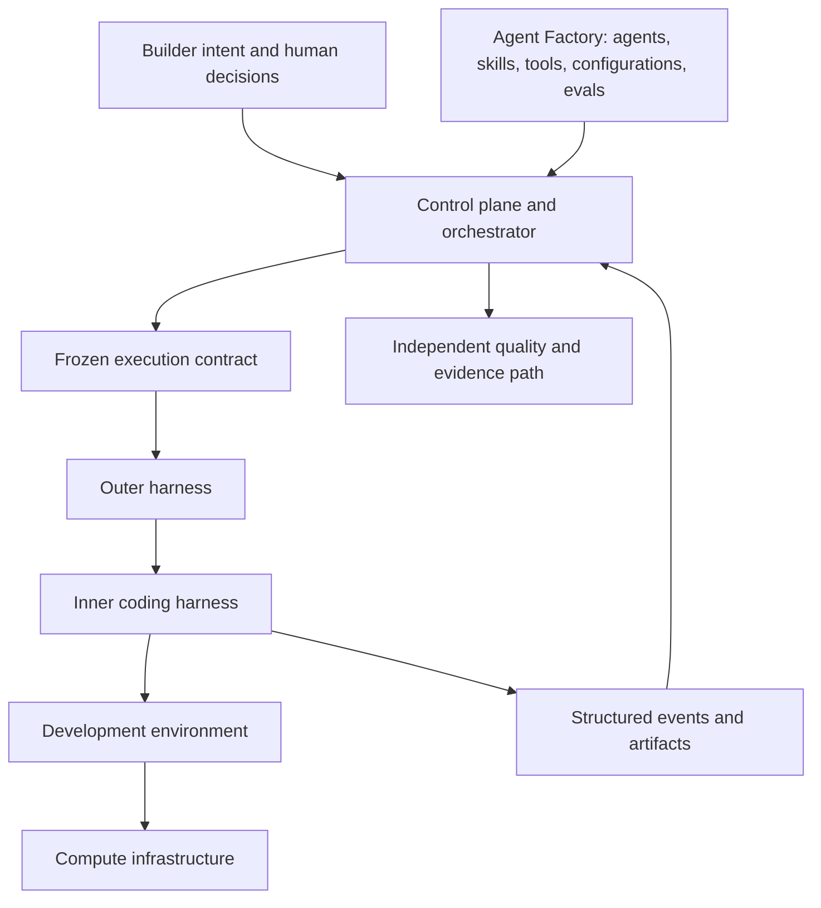

# Software Factory Stack Boundaries

## Quick Read

- **Purpose:** Give every component one clear responsibility and replacement
  boundary.
- **Best for:** Executives, architects, platform teams, and anyone comparing
  agent products.
- **Prerequisites:** [AI Software Factory and Mission Control](./01-ai-software-factory-and-mission-control.md).
- **Reading time:** 14 minutes.
- **You will learn:** How Agent Factory, control plane, orchestrator, outer
  harness, inner harness, development environment, and compute fit together.

Keep three ideas: commercial product boundaries are not authority boundaries;
interfaces require versioned contracts; and composability is proven through
behavioral compatibility rather than a generic adapter label.

## 1. The problem

Terms such as agent, harness, runtime, platform, orchestration, and software
factory are often used as if they describe the same system. They do not. When
their responsibilities are collapsed, teams cannot tell which component owns
authority, which part may be replaced, where reliability controls belong, or
what a vendor is actually providing.

A coding agent can produce a patch without being a software factory. A harness
can run an agent without owning business intent. A remote sandbox can supply
compute without deciding whether an Attempt is authorized. A control plane can
govern work without implementing the model loop itself.

## 2. Why the problem exists

The stack evolved from interactive coding tools rather than from one shared
architecture. Products expanded vertically: a model acquired tools, a CLI
acquired session state, a cloud runner acquired orchestration, and a web UI
acquired scheduling. The resulting products are useful, but their commercial
boundaries do not necessarily match durable engineering boundaries.

The word **harness** is especially overloaded. It may mean only the model-tool
loop, the wrapper that schedules and supervises that loop, or the entire
execution platform. A composable factory needs a more precise vocabulary.

## 3. Enduring Principle

### Name a layer by the responsibility it owns

Use the following canonical boundaries:

| Concept | Owned responsibility | Does not prove or own |
| --- | --- | --- |
| AI Coding Agent | Pursue a bounded repository outcome through reasoning and tools | Business authority, acceptance, merge, or release |
| Inner Harness | Run the model-tool-observation loop and manage one coding session | Durable cross-run workflow state or organizational approval |
| Outer Harness | Adapt, supervise, and operationalize an inner harness through lifecycle events, skills, budgets, retries, and completion contracts | Mission authority or acceptance of its own output |
| Development Environment | Supply the checkout, toolchains, dependencies, services, identity bindings, and previews required to build and test | Permission to widen scope or publish |
| Compute Infrastructure | Supply machines, containers, VMs, storage, network, and capacity | A trustworthy environment or authorized execution |
| Orchestrator | Sequence authorized work, dispatch Attempts, react to events, and reconcile state | Approval of its own plan or evidence |
| Control Plane | Own intent, policy, authority, durable state, approvals, evidence requirements, and governance decisions | The implementation work performed by executors |
| Agent Platform | Provide reusable runtime services for agents, including tools, context, identity, routing, memory, and telemetry | End-to-end software-delivery governance |
| Agent Factory | Create, package, version, evaluate, publish, discover, admit, deprecate, and revoke reusable agent capabilities | Delivery of a particular business outcome |
| AI Software Factory | Compose people, policies, capabilities, execution, assurance, delivery, and learning from intent through validated production value | A single agent, model, harness, or control-plane product |

Mission Control is the guide's concrete control-plane implementation and case
study. It is not the definition of the AI Software Factory and should not absorb
every execution or delivery responsibility into one service.

### Separate the control path from the execution stack

The downward path delegates capability. The upward path reports observations.
Neither path permits an executor to mint new authority.

### Treat the interfaces as products

Each boundary requires a versioned contract:

- control plane to outer harness: Attempt identity, manifest, scope, budgets,
  cancellation, completion schema, and event contract;
- outer to inner harness: session lifecycle, instructions, tools, approvals,
  environment, structured output, and stop behavior;
- harness to development environment: filesystem, command, process, preview,
  service, secret, and network interfaces;
- development environment to compute: provision, start, suspend, snapshot,
  measure, terminate, and reconcile; and
- Agent Factory to consumers: capability identity, version, provenance,
  compatibility, evaluation, policy, ownership, and lifecycle status.

Composition is valuable only when these contracts preserve the capabilities
and controls the factory needs. A lowest-common-denominator adapter that drops
hooks, cancellation, provenance, or tool events creates apparent portability
and real operational blindness.

### Distinguish build, buy, and bring-your-own boundaries

Build-versus-buy is not one decision for the whole stack. A team may buy an
inner harness, build its control plane, bring its own development environment,
and use managed compute. Evaluate each layer by differentiation, security,
integration depth, operability, portability, cost, and exit difficulty.

## 4. Tradeoffs and alternatives

A vertically integrated stack reduces integration work and can deliver a
better initial experience. It also concentrates policy, telemetry, execution,
and environment assumptions in one provider. A composed stack preserves choice
but moves compatibility testing and failure ownership to the adopter.

The inner/outer harness split is a conceptual boundary, not a requirement for
two deployable services. A small system may implement both in one process while
retaining separate contracts. Conversely, calling every wrapper an outer
harness can create abstraction for its own sake. Introduce the boundary only
when it clarifies replacement, authority, testing, or operations.

## 5. Current Mission Control Implementation

At study commit
[`d902fae`](https://github.com/jaydubya818/MissionControl/tree/d902fae7032c0696b531c44ae88829c652516fc6),
Mission Control has a clear control-plane and execution-plane doctrine. Convex
owns durable authority and state, the Hono service hosts orchestration and
provider boundaries, and provider-neutral harness lifecycle contracts describe
execution through capability manifests and structured results.

The implementation has versioned agent records, skill discovery and linting,
model routes, context packages, sandbox profiles, and evaluation mechanisms.
Those capabilities resemble parts of an Agent Factory, but the studied product
does not establish one canonical Agent Factory boundary with a unified
capability publication, admission, compatibility, deprecation, and revocation
lifecycle. Exact skill-version binding in the execution manifest also remained
incomplete.

The production execution path remained blocked by operator configuration at
the studied commit. The architecture and local qualification therefore support
the boundary model; they do not prove a live, fleet-scale composed stack.

## 6. Future Vision

Mission Control should consume Agent Factory capabilities through stable,
versioned manifests and admit complete combinations of outer harness, inner
harness, development environment, compute backend, model route, and policy.
Compatibility should be proven through contract tests rather than inferred from
matching product names.

The operator should be able to inspect why a stack was selected, which layer
failed, which substitutions remain eligible, and whether a fallback changes
security, quality, cost, or evidence. Production promotion requires live
canaries for cancellation, restart, tool events, environment identity,
teardown, publication separation, and independent verification.

## 7. Versioned references

- [Mission Control capability, workflow, and admission map](../09-mission-control-case-studies/03-capability-workflow-and-admission-map.md), assessed at `d902fae`
- [Control Plane and Execution Plane](../05-runtime-architecture/01-control-plane-and-execution-plane.md)
- [OpenAI: Unrolling the Codex Agent Loop](https://openai.com/index/unrolling-the-codex-agent-loop/), accessed 2026-08-30
- [OpenAI: Harness Engineering](https://openai.com/index/harness-engineering/), accessed 2026-08-30
- [Anthropic: Building Effective Agents](https://www.anthropic.com/engineering/building-effective-agents), accessed 2026-08-30

## 8. Notes and lessons learned

- A product boundary is a commercial choice; an authority boundary is a safety
  and operability choice.
- The Agent Factory supplies reusable capabilities. The AI Software Factory
  turns governed intent into validated value using those capabilities.
- Swappability must be proven at the contract level. A generic adapter name is
  not evidence of behavioral parity.

## 9. Design review questions

1. What is the difference between an AI coding agent and an AI Software Factory?
2. Which responsibilities belong in the inner and outer harnesses?
3. Why is the development environment separate from compute infrastructure?
4. When is a vertically integrated stack the better choice?
5. What evidence would demonstrate that two harnesses are safely replaceable?
6. Why must an Agent Factory remain distinct from delivery authority?

## 10. Whiteboard exercise

Draw a composed stack in which the organization owns the control plane and
development environment, buys an inner harness, and uses managed compute. Mark
every identity, contract, event stream, credential, policy decision, fallback,
and failure owner. Then replace the inner harness without changing acceptance
authority.

## 11. Hands-on lab

Using a read-only checkout of Mission Control commit `d902fae`, trace one
Factory Version and Attempt through control-plane state, harness capability
manifest, Sandbox Profile, worker attestation, structured result, and
verification path. Produce a responsibility matrix showing which current
component realizes each canonical layer and where responsibilities remain
combined or absent.

Required evidence: exact source paths, contract fields, one unsupported
capability example, one failed substitution scenario, and a five-minute
architecture teach-back. Cleanup is limited to deleting local notes.
