# Operational Autonomy and Trust Calibration

## Quick Read

- **Purpose:** Replace vague autonomy labels with scoped, revocable operating
  authority.
- **Best for:** Executives, security, platform, and governance leaders.
- **Prerequisites:** [What Is an AI Software Factory?](../01-vision/01-what-is-an-ai-software-factory.md).
- **Reading time:** 24 minutes.
- **You will learn:** How capability, trust evidence, risk, promotion,
  demotion, and quarantine determine eligible autonomy.

Keep three ideas: model capability is not authority; autonomy belongs to a
specific workflow and risk scope; and trust must fall faster than it rises when
evidence deteriorates.

Autonomy is not a personality trait of a model. It is a revocable grant of
authority from an accountable organization to a governed system. The grant has
a scope, a ceiling, evidence requirements, and conditions under which it must
be reduced.

This chapter defines Factory Operational Autonomy Levels. The name keeps the
doctrine within the AI Software Factory domain. The same principles may later
generalize to other enterprise agents, but that broader category is not the
subject of this repository.

## 1. The problem

Organizations often describe AI systems as assisted, semi-autonomous, or fully
autonomous. These labels sound useful while leaving the important questions
unanswered. Who initiates work? Who defines the authorized outcome? May the
system plan? May it modify a repository? Who validates the result? May it
deploy? Who accepts material risk? What evidence can increase authority, and
which failures take that authority away?

The ambiguity becomes dangerous when model capability is mistaken for
operational authority. A stronger model may complete a benchmark or a coding
task more reliably. That does not authorize it to access customer data, change
identity controls, approve a migration, deploy to production, or promote its
own policies.

Static autonomy settings create a second failure. A factory may be trustworthy
for documentation changes and unproven for payment logic. A Mission may be low
risk while one WorkOrder contains an irreversible migration. One organization-
wide switch cannot express these differences.

## 2. Why the problem exists

Model vendors naturally describe capability. Enterprises must govern
authority. When those concerns are collapsed, teams assume that better
reasoning should produce greater autonomy. This skips the evidence connecting
model behavior to a specific repository, workflow, policy, environment, and
business risk.

Approval systems also decay. When every action requires review, operators
learn to click approve without examining the decision. When approvals show raw
logs instead of the outcome, evidence, risk, and exception, human attention is
wasted reconstructing the work. Governance remains present in form and absent
in substance.

Finally, most autonomy programs are designed only to move upward. They define
pilots and promotions but not demotion. A system that can gain authority but
cannot lose it is not continuously governed.

## 3. Enduring Principle

### Operational law

> Trust is earned through evidence, governed by policy, and continuously
> calibrated by outcomes—not by model capability.

A model upgrade does not automatically change authority. Sustained,
observable, evidence-backed performance may justify promotion. Regressions,
policy violations, weak evidence, or incidents must reduce the permitted
autonomy.

### Factory Operational Autonomy Levels

| Level | Name | Human responsibility | Factory authority | Typical examples |
| --- | --- | --- | --- | --- |
| 0 | Human Execution | Human performs and accepts the work | AI suggests only | Chat and inline code suggestions |
| 1 | Assisted Execution | Human initiates every action and reviews the result | AI performs small, bounded, deterministic tasks | Generate tests, write documentation, explain code, summarize a pull request |
| 2 | Delegated Execution | Human defines the WorkOrder and reviews every material output | Factory implements within the WorkOrder and prepares evidence and a pull request | Bounded implementation ending in human review |
| 3 | Governed Autonomy | Human approves material risk and final accountable decisions | Factory may plan and execute; independent validators enforce quality | Enterprise default for mature, governed workflows |
| 4 | Conditional Autonomy | Human defines policy and approves exceptions or material risk | Factory may deploy automatically when current evidence and policy allow | Documentation, internal tools, low-risk services, canary releases |
| 5 | Trusted Factory | Humans govern policy, risk appetite, and system performance | Factory operates continuously within policy across the lifecycle | Aspirational for most organizations today |

Level 5 does not remove humans. It moves them from individual routine decisions
to policy, exceptions, and system governance. It should be rare until long-term
evidence supports it.

### Autonomy is scoped

Autonomy must be configurable per Factory, Mission, and WorkOrder. The effective
level is the lowest applicable ceiling:

`effective autonomy = min(factory, mission, work order, policy, trust)`

The Factory ceiling describes the maximum authority of a configured factory.
The Mission and WorkOrder ceilings reflect local intent and risk. Policy applies
organizational constraints. The trust ceiling reflects current performance.
No lower-level object may silently exceed its parent or policy ceiling.

The level is an upper bound, not an entitlement. A Level 4 factory may use one
agent at Level 1 for a simple task. Greater capability does not require greater
complexity or authority.

### Promotion and demotion

Promotion requires explicit human approval based on sustained evidence.
Demotion may occur automatically when policy or trust thresholds are breached.
This asymmetry is deliberate. The system may fail safe without waiting for
permission, but it may not grant itself more power.

A promotion policy must define a configurable evidence window. The initial
Level 2-to-Level 3 standard requires at least 100 successful WorkOrders across
at least 30 days of stable operation, at least 99 percent independent validation
success, zero critical security or policy violations, zero unauthorized
actions, and explicit human promotion. Both volume and elapsed time are
required. Promotion must never rest on one successful run or a short streak.
The retained decision must identify the evaluated scope, window, policy
version, source records, and approver.

```mermaid
stateDiagram-v2
    direction LR
    state "L0 Human" as L0
    state "L1 Assisted" as L1
    state "L2 Delegated" as L2
    state "L3 Governed" as L3
    state "L4 Conditional" as L4
    state "L5 Trusted" as L5

    L0 --> L1: human promotion after evidence
    L1 --> L2: human promotion after evidence
    L2 --> L3: human promotion after evidence
    L3 --> L4: human promotion after evidence
    L4 --> L5: human promotion after sustained outcomes

    L5 --> L4: trust or policy degrades
    L4 --> L3: trust or policy degrades
    L3 --> L2: trust or policy degrades
    L2 --> L1: material failure
    L1 --> L0: critical safety condition
```

The exact demotion need not be one level at a time. A critical incident may
reduce a scope from Level 4 to Level 1 immediately. Quarantine may reduce it to
Level 0. Recovery requires corrected controls and a new record of sustained
performance.

### Factory Trust Score

The Factory Trust Score is a transparent control signal, not an opaque grade.
The system should maintain an internal numeric score from 0 to 100 for
calculation and trend analysis. Operators should normally see an interpretable
trust band: Very Low, Low, Moderate, High, or Trusted. The numeric score is a
measurement input; the band is the governance abstraction.

The initial trust bands are:

| Score | Band | Eligibility ceiling |
| --- | --- | --- |
| 0–39 | Very Low | Quarantined or advisory only |
| 40–59 | Low | Human review required for every action |
| 60–79 | Moderate | Eligible for limited supervised autonomy |
| 80–94 | High | Eligible for governed autonomy within policy |
| 95–100 | Trusted | Eligible for the highest authority current policy allows |

These thresholds must remain simple, stable, and versioned. An operator surface
should explain the current band, its trend, the events that contributed to it,
any hard override, and the evidence needed for review or future promotion. The
score never overrides policy. It determines only the highest autonomy level the
system is eligible to request.

Its components should include:

- production failures and rollbacks;
- security escapes;
- customer defects;
- validator disagreement;
- human overrides;
- policy violations;
- evaluated hallucination or unsupported-claim rate;
- recovery time; and
- evidence completeness, freshness, provenance, and quality.

The initial score uses five normalized dimensions:

| Dimension | Weight |
| --- | ---: |
| Authorization and policy compliance | 30% |
| Independent-validation performance | 25% |
| Evidence integrity and completeness | 20% |
| Production and customer outcomes | 15% |
| Operational reliability and recovery | 10% |

Critical violations remain hard overrides rather than ordinary weighted
deductions. This prevents a strong test history from averaging away evidence
tampering, unauthorized action, or a serious security failure.

The initial score is calculated for a tuple of Factory Configuration version,
repository, and workflow risk class. Executor and model are retained as
diagnostic dimensions so a degraded component can be isolated without granting
or removing authority at the wrong scope. A global average can hide an unsafe
workflow behind many routine successes. Hard policy violations and critical
incidents override the numerical score.

The score determines a trust ceiling. It never grants authority above policy,
risk, Mission, or WorkOrder limits. Its inputs, weights, thresholds, source
records, and changes must be inspectable and versioned.

### Failure decay and retained accountability

Failures decay in scoring influence but never disappear from the audit record.
The initial policy uses a rolling weighted window, with 90 days as the default.
Recent behavior has greater influence than older behavior. Older failures lose
weight gradually when sustained good performance follows, while critical
failures remain permanent history. A repeated failure pattern resets the decay
for that pattern. This permits earned recovery without rewriting history.

### Trust-loss events

Immediate demotion or quarantine is justified by evidence that the system has
lost trust, not merely by the existence of an ordinary execution failure.
Qualifying events include:

- a security or policy violation;
- an unauthorized action or permission bypass;
- evidence tampering or required evidence that cannot be accounted for;
- hallucinated or fabricated results presented as fact;
- independent validation failure on a high-risk change;
- a customer-impacting production regression;
- repeated execution outside approved constraints; and
- unexpected behavior consistent with model drift or compromised tooling.

Permission bypass, evidence tampering, suspected compromise, and repeated
constraint violations should quarantine the affected scope by default. Other
qualifying events should demote it at least one level, with critical severity
permitted to trigger quarantine. The system must retain the triggering event,
previous and new ceilings, affected scope, policy decision, and required human
review. A failed test, timeout, or bounded implementation error does not by
itself prove loss of trust; severity, containment, truthfulness, and compliance
with the authorized process matter.

### Governance matrix

AI may prepare the decision packet and recommendation. It does not own these
decisions:

| Decision | Accountable human owner |
| --- | --- |
| Business Mission | Product or Business Owner |
| WorkOrder acceptance | Engineering Lead |
| Architecture exception | Principal Engineer |
| Security exception | Security Owner |
| Compliance exception | Compliance Owner |
| Production deployment | Human Approver defined by policy |
| Risk exception | Designated Risk Owner |
| Learning promotion | Factory Governance Board |

The titles may vary by organization. The accountability cannot be assigned to
an agent. Delegation of preparation or execution does not delegate the decision.

In a small organization, one person may combine Product Owner, Technical Lead,
Mission Approver, Release Approver, and Factory Administrator. Implementation
and independent validation must still remain logically separate through
different execution contexts, evidence paths, or systems. Separation of duties
should become stronger as organizational scale and risk increase.

Independent validation is technical, not merely organizational. Validators run
through an execution path separate from implementation, do not reuse the
implementer's claimed results, generate their own evidence against predefined
acceptance criteria, and write immutable audit records. Human acceptance must
review that independent evidence rather than trust the implementation agent's
self-report.

The initial Level 2-to-Level 3 promotion requires approval from the Engineering
Lead and designated Risk Owner. The Security Owner joins when the scope includes
security-sensitive permissions or systems. In a small company, one person may
hold more than one of these titles, but the decision must still rely on
independently generated evidence and an immutable promotion record.

### Validator disagreement increases governance

Validator results are evidence, not votes. Two passes and one failure do not
produce a pass by majority. The factory must inspect the failed domain, method,
severity, evidence, freshness, and independence. A security failure is not
outvoted by two style checks.

Conflicting valid results create a Risk Review. The system preserves every
receipt, identifies the conflict, blocks any action prohibited by policy, and
presents the human owner with the evidence and safe options. It does not erase
the disagreement through random retries.

The governing rule is simple:

> Validator disagreement increases governance. It never decreases it.

### Prevent approval theater

Humans should approve evidence and risk, not reconstruct routine execution from
logs. A decision packet should show the governed requirement, acceptance
criteria, test and quality results, security findings, performance change,
regression status, coverage where relevant, risk, exceptions, recommendation,
and uncertainty.

Routine evidence should remain inspectable without demanding deep attention.
The factory escalates surprises: missing, stale, failed, contradictory, unusual,
or high-risk evidence. High-risk work may still require code or architecture
review. Evidence-focused approval does not eliminate professional judgment; it
directs judgment to the parts that matter.

### First proof workflow

The first workflow that should prove governed autonomy is `Governed Issue ->
Validated Pull Request`:

1. A human creates a Mission.
2. An agent investigates the codebase.
3. The agent produces a versioned Plan.
4. A human approves that Plan version.
5. The factory executes the authorized WorkOrder.
6. Independent validators produce evidence.
7. Mission Control creates a review-ready pull request.
8. A human approves the merge.

This is first a Level 2 proof: the human defines and approves the work and
reviews the material output. It approaches Level 3 only after sustained
evidence shows that the factory can plan and execute reliably while humans
intervene for material risk and accountable decisions. The proof deliberately
ends before autonomous deployment. It exercises planning, authorization,
execution, validation, evidence, governance, and oversight without expanding
the initial safety boundary unnecessarily.

The first scenario adds a required Business Justification field to Mission
creation. It touches the React UI, authoritative schema, validation, existing
tests, browser testing, evidence generation, and pull-request lineage while
remaining small enough to understand completely. See the
[Governed Issue to Validated Pull Request lab](../10-labs/01-governed-issue-to-validated-pull-request.md).

## 4. Tradeoffs and alternatives

Six levels create clarity, but they can create false precision. Two workflows
at Level 3 may have very different tools, blast radii, and evidence. The level
must summarize a versioned policy envelope rather than replace it.

A Trust Score can be gamed. Teams may optimize the number instead of safety.
Transparent components, hard policy overrides, severity-aware events, and
human review of promotion reduce that risk. The component history matters more
than a single current number.

Exception-first approval can hide gradual degradation if “routine” is defined
too broadly. Sampling, trend review, audits, and periodic deep inspections must
remain part of governance.

A Factory Governance Board can become a bottleneck. It should govern policy and
promotion standards, not approve routine WorkOrders. Decision ownership should
remain as close as possible to the accountable domain.

## 5. Current Mission Control Implementation

### Verification baseline

This study inspected Mission Control commit
[`8014d5af427b43ff5c5a63cfdf82ec92742c208c`](https://github.com/jaydubya818/MissionControl/tree/8014d5af427b43ff5c5a63cfdf82ec92742c208c)
on 2026-08-03. The working tree was clean.

Thirty focused tests passed. They covered Factory Configuration, Mission
governance, WorkOrder governance, and WorkOrder revision. These tests support
the mechanisms described below. They do not prove a complete autonomy ladder
or trust-calibration system.

### Capability assessment

| Doctrine capability | Status at studied commit | Evidence and interpretation |
| --- | --- | --- |
| Risk-proportional autonomy | Product doctrine with implemented guards | The [North Star](https://github.com/jaydubya818/MissionControl/blob/8014d5af427b43ff5c5a63cfdf82ec92742c208c/docs/product/mission-control-north-star.md) defines Green, Yellow, and Red risk behavior. WorkOrder governance evaluates approvals and evidence before acceptance. |
| Versioned Factory authority | Implemented mechanism and unit-tested | [`convex/factory/configuration.ts`](https://github.com/jaydubya818/MissionControl/blob/8014d5af427b43ff5c5a63cfdf82ec92742c208c/convex/factory/configuration.ts) versions repository, workflow, executor, policy, environment, budget, verifiers, risk boundary, and recovery controls. The Factory Configuration tests passed. |
| Evidence-based acceptance | Implemented mechanism and unit-tested | [`workOrderGovernance.ts`](https://github.com/jaydubya818/MissionControl/blob/8014d5af427b43ff5c5a63cfdf82ec92742c208c/convex/lib/workOrderGovernance.ts) blocks acceptance for missing, failed, stale, expired, revoked, or unapproved evidence. Ten focused tests passed. |
| Evidence-focused operator attention | Active product doctrine; partial implementation | The North Star defines an exception-first attention contract. Current UI surfaces approvals and required actions, but this study did not verify one complete decision packet or approval-fatigue outcome. |
| Factory Operational Autonomy Levels 0–5 | Not implemented as a canonical factory control | No versioned OAL field, inheritance rule, or effective-level calculation was verified. An unrelated L1–L3 field exists in a hiring surface and must not be treated as this doctrine. |
| Governance matrix | Partial and fragmented | Approval permissions and risk roles exist in several records. The complete accountable-owner matrix is not represented or enforced as one canonical contract. |
| Validator-conflict Risk Review | Not verified | Mission Control can retain failed and conflicting evidence concepts, but this study did not verify a first-class disagreement record, policy escalation, and operator recovery flow. |
| Factory Trust Score | Not implemented | No canonical transparent trust score, scoped trust ceiling, component history, or hard-override contract was verified. |
| Automatic autonomy demotion | Not implemented | Recovery, retry, quarantine, and risk controls exist in parts of the system. No evidence showed outcome-driven recalculation and enforcement of a lower operational autonomy ceiling. |
| Human-only promotion | Future doctrine | Mission Control requires approvals for several actions, but no canonical workflow promotes an autonomy scope after sustained evidence and governance review. |

### Browser evidence status

No fresh browser journey was performed for this chapter. Source paths and unit
tests are not proof that operators can inspect, promote, demote, or recover an
autonomy scope through the product.

## 6. Future Vision

Mission Control should calculate effective autonomy for each execution from
versioned Factory, Mission, WorkOrder, policy, and trust ceilings. The dispatch
record should retain every input and the resulting decision.

Trust changes should be event-driven and explainable. A qualifying incident or
policy violation should lower the affected ceiling and create an operator
decision packet. Promotion should require sustained evidence, an explicit human
decision, a new version, and a rollback condition.

Validator conflicts should create governed Risk Reviews. Approval surfaces
should prioritize exceptions, evidence, uncertainty, and the decision required.
Routine history should remain available without competing for attention.

Mission Control should prove the governed-issue-to-validated-PR path at Level 2
before claiming Level 3. Level 3 must be earned through the configured evidence
window and human promotion. Level 4 deployment authority remains outside this
first proof.

This is target architecture. It is not a current Mission Control capability
claim.

## 7. Versioned references

- [Mission Control North Star at the studied commit](https://github.com/jaydubya818/MissionControl/blob/8014d5af427b43ff5c5a63cfdf82ec92742c208c/docs/product/mission-control-north-star.md)
- [Mission Control V1 strategy at the studied commit](https://github.com/jaydubya818/MissionControl/blob/8014d5af427b43ff5c5a63cfdf82ec92742c208c/docs/product/mission-control-v1-product-strategy.md)
- [Factory Configuration implementation](https://github.com/jaydubya818/MissionControl/blob/8014d5af427b43ff5c5a63cfdf82ec92742c208c/convex/factory/configuration.ts)
- [WorkOrder governance implementation](https://github.com/jaydubya818/MissionControl/blob/8014d5af427b43ff5c5a63cfdf82ec92742c208c/convex/lib/workOrderGovernance.ts)

## 8. Notes and lessons learned

My current conclusions are:

- Autonomy belongs to a governed scope, not to a model.
- Model capability is evidence to evaluate, not authority to act.
- The effective level is always the lowest applicable ceiling.
- Promotion is a human decision. Demotion may be automatic.
- The factory computes a numeric Trust Score but communicates governance through
  explainable trust bands.
- Ordinary failure is not identical to loss of trust. Violating authority,
  truth, evidence, policy, or containment is categorically different.
- Promotion requires sustained scoped evidence, never one successful run.
- The initial Level 2-to-Level 3 bar is 100 successful WorkOrders across 30
  stable days with at least 99 percent independent-validation success, no
  critical violations, no unauthorized actions, and human approval.
- Failure influence decays over a rolling weighted window, but audit history
  does not disappear.
- Validator disagreement is evidence of higher uncertainty and higher required
  governance.
- Humans should review the decision, evidence, risk, and surprise rather than
  reconstruct routine agent activity.
- A Trust Score must be transparent and subordinate to hard policy.
- Small organizations may combine accountable roles, but implementation and
  validation must remain logically separate.
- A factory that cannot reduce autonomy is not continuously governed.

Open questions:

1. Which event schema should represent trust changes, decay resets, and hard
   overrides?
2. How should confidence and sample sufficiency be shown beside the score?
3. Which controls prevent correlated implementation and validator failures?
4. How should a trust scope be reset after a material Factory Configuration
   change?

## 9. Design review questions

1. Why is autonomy an operational property rather than a model property?
2. Explain each Factory Operational Autonomy Level in one sentence.
3. Why should levels be scoped per Factory, Mission, and WorkOrder?
4. Why is the effective level the minimum of several ceilings?
5. Why may demotion be automatic while promotion remains human?
6. How would you keep a Trust Score explainable and resistant to gaming?
7. Why does majority voting fail for heterogeneous validators?
8. What should a Risk Review contain after validator disagreement?
9. How do evidence-focused approvals reduce approval fatigue?
10. Which decisions can an agent prepare but never own?
11. What evidence would justify moving a workload from Level 3 to Level 4?
12. Which Mission Control mechanisms exist today, and which remain future
    doctrine?
13. Why compute trust numerically while presenting operators with bands?
14. How does an ordinary execution failure differ from a trust-loss event?
15. Why is `Governed Issue -> Validated Pull Request` the correct first proof?
16. Why must failure influence decay while the audit record remains permanent?
17. Which controls make validation technically independent in a small company?

## 10. Whiteboard exercise

Draw the six levels from memory. Then add:

- Factory, Mission, WorkOrder, policy, and trust ceilings;
- the effective-level calculation;
- human promotion and automatic demotion paths;
- the governance matrix;
- validator disagreement and Risk Review;
- the Trust Score inputs and hard overrides; and
- the evidence-focused human decision packet.

Explain one Level 4 documentation deployment and one Level 2 database migration.
Identify every human decision, agent action, evidence record, and demotion
trigger. The exercise fails if a model upgrade silently increases authority.

## 11. Hands-on lab

### Objective

Assess Mission Control against the autonomy doctrine and design the smallest
versioned contract that would make autonomy explicit and revocable.

### Starting version

- Repository: `jaydubya818/MissionControl`
- Commit: `8014d5af427b43ff5c5a63cfdf82ec92742c208c`
- Study date: 2026-08-03

### Tasks

1. Reproduce the thirty focused tests recorded in this chapter.
2. Trace Factory Configuration, Mission risk, WorkOrder approval, verifier,
   evidence, and recovery records.
3. Prove that no canonical OAL 0–5 contract or Trust Score exists at the
   starting commit.
4. Design an effective-autonomy projection using the five ceilings. Do not add
   a single organization-wide autonomy switch.
5. Model one validator disagreement that creates a Risk Review instead of a
   majority decision or random retry.
6. Model a Level 4 scope falling to Level 2 after repeated failures and to Level
   1 after a critical incident.
7. Draft the human promotion evidence required to regain Level 3.
8. Design an evidence-focused decision packet that highlights surprises while
   retaining drill-down lineage.
9. Run or model the full `Governed Issue -> Validated Pull Request` workflow at
   Level 2. Identify the additional sustained evidence and reduced human review
   that would be required before claiming Level 3.

### Required evidence

- exact commit and traced code paths;
- focused test output;
- current-versus-future capability matrix;
- autonomy inheritance and effective-level diagram;
- governance matrix;
- validator-conflict record;
- Trust Score component proposal;
- numeric-score and operator-band policy;
- promotion and demotion state transitions; and
- Level 2 workflow proof with an explicit Level 3 gap analysis;
- five-minute unscripted teach-back.

### Cleanup

Use a disposable worktree for any implementation experiment. Do not add the
doctrine directly to Mission Control until its product contract is approved.

## Mastery standard

The chapter is mastered only when I can define the six levels, calculate the
effective level, explain the governance matrix, resolve validator disagreement,
design an evidence-focused approval, and defend automatic demotion with human
promotion. I must distinguish the enduring doctrine from Mission Control's
current implementation without notes.
