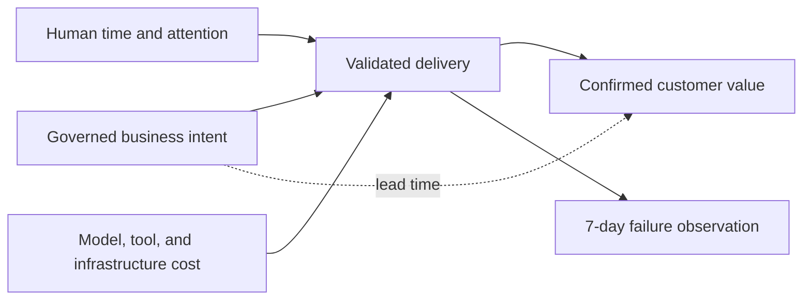

# Factory Economics and Operating Metrics

## 1. The problem

Agent activity is easy to measure and easy to mistake for value. Tokens,
sessions, generated lines, tool calls, and pull-request volume can all rise while
customer outcomes slow, defects increase, and engineers spend more time
recovering or reviewing low-quality work.

An AI Software Factory succeeds only when it improves speed, quality, and
engineering leverage together. Its measurement system must connect business
intent to validated outcomes and make the costs of attention, rework, delay,
and failure visible.

## 2. Why the problem exists

Local optimization fragments the lifecycle. Coding tools report generation
speed. CI reports test duration. finance sees model spend. product sees feature
delivery. incident systems see failure. Without shared lineage, nobody can
calculate the economics of one governed Mission.

Automation can also shift rather than remove work. Faster implementation may
create slower review. More parallelism may create merge conflicts. Cheaper
models may increase validation and recovery cost. Metrics must expose the whole
system rather than reward one stage.

## 3. Enduring Principle

### Measure validated customer value, not activity

The primary lead-time clock starts when business intent becomes a governed
Mission. It stops when the change is deployed, independently validated in
production or a production-equivalent environment, and the expected customer
outcome is confirmed. Merge time is an intermediate measure, not the outcome.

The first three executive measures are:

1. **Lead Time to Validated Customer Value** — elapsed time from governed intent
   to confirmed outcome.
2. **Change Failure Rate** — the proportion of deployments that cause rollback,
   hotfix, emergency intervention, customer regression, reliability or security
   incident, or SLA/SLO violation within a default seven-day observation window.
3. **Engineering Leverage** — valuable outcomes per unit of scarce engineering
   capacity without increasing cognitive load or coordination cost.

These form a constraint system. Speed without quality is rework. Quality without
speed is delay. Throughput without human sustainability is hidden debt.

### Build a metric hierarchy

**Business outcomes:** adoption, revenue, retention, risk reduction, or customer
problem solved.

**Delivery outcomes:** lead time, deployment frequency, change failure,
recovery time, accepted WorkOrders, and outcome confirmation.

**Factory effectiveness:** autonomous completion, first-pass validation,
recovery success, evidence completeness, approval latency, review time, and cost
per accepted outcome.

**Operational diagnostics:** tokens, tool calls, model latency, queue depth,
lease expiry, retries, provider errors, and context size.

Diagnostic metrics explain outcomes. They are not the outcomes.

### Define engineering leverage carefully

No single number proves leverage. Use a balanced evidence set:

- reduced lead time with stable or improved change failure rate;
- increased throughput of accepted, validated work;
- reduced human implementation hours per work item;
- reduced waiting and coordination time;
- more time spent on architecture, product, and customer problems;
- stable or lower review and recovery burden; and
- improved developer satisfaction and perceived control.

The objective is more customer value per engineer, not more commits per
engineer.

### Measure flow and attention

Break lead time into queue, planning, approval, execution, validation, review,
deployment, and outcome-observation time. This reveals whether the factory
accelerates work or moves the bottleneck.

Human attention is a constrained resource. Track number of interventions,
decision latency, time per approval, evidence inspection time, false alarms,
and repeated requests. An autonomy system that consumes more senior attention
than it returns has negative leverage.

### Attribute full cost

Cost per accepted WorkOrder should include model and token spend, tools,
infrastructure, CI, storage, human implementation, review, recovery, rework,
incidents, and allocated platform operation. Estimate uncertainty explicitly.

Compare marginal cost and marginal value. A more expensive model can be cheaper
overall if it reduces retries and review. A cheaper run that fails validation is
inventory, not value.

### Use cohorts and baselines

Compare similar repositories, risk bands, change types, and autonomy levels.
Establish a stable pre-factory baseline and use medians and percentiles rather
than averages alone. Avoid causal claims from simultaneous organizational,
tooling, and product changes without an experimental design.

## 4. Tradeoffs and alternatives

Comprehensive measurement can become surveillance. Measure workflows and
systems, not individual developer productivity. Lines of code, commits, hours
online, and prompt volume are especially harmful as performance targets.

Business outcomes can take weeks to observe, while teams need fast feedback.
Use leading indicators, but label them as proxies. Do not quietly substitute
“PR merged” for customer value.

Cost attribution will be imperfect. A transparent range is better than a precise
but incomplete number. The measurement system itself has operational cost and
should remain proportional to the decisions it supports.

## 5. Current Mission Control Implementation

At commit
[`af414acfaa7ea793cb43de8ab2617f343d922f23`](https://github.com/jaydubya818/MissionControl/tree/af414acfaa7ea793cb43de8ab2617f343d922f23),
Mission Control implements the metric-lineage foundation and operator reporting
surfaces. This is current product architecture, not a hypothetical future
capability.

Convex retains canonical Task events plus Mission, Plan, WorkOrder, Attempt,
candidate, evidence, quality-gate, pull-request, audit, run, workflow, and cost
records. Its effectiveness projection reports verified completion, autonomous
completion, and cost per verified outcome while labeling provenance as observed,
projected, or insufficient. The operator product exposes portfolio, Factory
Health, analytics, trace inspection, WorkOrder, and evidence views over those
records.

The current implementation already supports durable lineage, duration and cost
observations, verification state, human interventions, policy denials, retries,
blocked work, and pending decisions. Factory Configuration versions bound
maximum cost, runtime, and attempts. These capabilities make flow and operating
diagnostics inspectable today.

## 6. Current Metric Lineage and Remaining Evidence Gaps

Mission Control now preserves the governed chain from Mission and approved Plan
through WorkOrder, Task, Attempt, candidate, independent evidence, quality-gate
decision, and pull-request lineage. Deployment, activation, and production
verification are separate lifecycle states in the current domain model. Metric
rollups must continue to reference those immutable records rather than replace
them with an optimistic summary.

The executive measurement model is implemented in parts. Current projections
distinguish observed, projected, and insufficient provenance, and the product
provides portfolio and effectiveness views. Several executive claims remain
promotion gates rather than proven facts:

- cost per verified outcome is projected, and complete model, provider,
  compute, sandbox, and human-attention attribution is still partial;
- release and production feedback are partial, so end-to-end lead time to a
  confirmed customer outcome is not yet proven across sustained real work;
- change-failure measurement still needs complete production incident,
  rollback, hotfix, and observation-window correlation;
- engineering leverage requires a comparable team baseline and human-attention
  evidence rather than activity or token proxies; and
- cohort reporting by risk, repository, workflow, autonomy level, and time
  window must preserve sample size, coverage, and confidence.

The correct product statement is therefore: **the immutable lineage and metric
surfaces exist now; complete outcome economics and sustained production proof
remain incomplete.** This keeps current implementation visible without turning
partial telemetry into a claim of validated customer value.

## 7. Versioned references

- [Canonical Task timeline and metric schemas](https://github.com/jaydubya818/MissionControl/blob/af414acfaa7ea793cb43de8ab2617f343d922f23/convex/schema.ts)
- [Effectiveness and friction projections](https://github.com/jaydubya818/MissionControl/blob/af414acfaa7ea793cb43de8ab2617f343d922f23/convex/eos/projections.ts)
- [Analytics](https://github.com/jaydubya818/MissionControl/blob/af414acfaa7ea793cb43de8ab2617f343d922f23/convex/analytics.ts)
- [Workflow metrics](https://github.com/jaydubya818/MissionControl/blob/af414acfaa7ea793cb43de8ab2617f343d922f23/convex/workflowMetrics.ts)
- [Cost events](https://github.com/jaydubya818/MissionControl/blob/af414acfaa7ea793cb43de8ab2617f343d922f23/convex/costEvents.ts)
- [Current capability maturity ledger](https://github.com/jaydubya818/MissionControl/blob/af414acfaa7ea793cb43de8ab2617f343d922f23/docs/product/software-factory-capability-maturity.md)
- [Production Factory Pilot V3 evidence](https://github.com/jaydubya818/MissionControl/blob/af414acfaa7ea793cb43de8ab2617f343d922f23/docs/testing/evidence/production-factory-pilot-v3/README.md)

## 8. Notes and lessons learned

Mission Control now has materially more than activity counters: it retains
governed lineage and exposes provenance-aware effectiveness projections. The
mastery challenge is to preserve that distinction. Current operational records
support flow and diagnostic decisions; complete factory ROI still requires
sustained intent-to-production outcome evidence and full cost attribution.

## 9. Design review questions

1. When exactly does lead time start and stop?
2. Why is time to merge insufficient?
3. How do you define a change failure?
4. What proves engineering leverage without surveilling developers?
5. How would you calculate cost per accepted WorkOrder?
6. Which current Mission Control metrics are proxies?
7. How would you establish causal confidence in a factory rollout?

## 10. Whiteboard exercise

Draw a metric tree from customer outcome down to delivery, factory, and runtime
diagnostics. Add a team that doubles PR throughput while review time and change
failure rise. Explain why the factory has not improved and which bottleneck to
address.

## 11. Hands-on lab

Select ten comparable changes. Define the start, stop, seven-day failure window,
human time, total cost, and accepted outcome for each. Map which data Mission
Control can currently supply and which requires GitHub or manual evidence.

Required evidence: metric dictionary, lineage map, missing-data register,
baseline and target, confidence limits, and an executive readout that does not
use commits, tokens, or lines of code as value.
