# Compounding Engineering and Human Attention

## 1. The problem

Teams repeatedly correct agents for the same repository convention, testing
requirement, architectural boundary, review preference, or failure mode. If
those corrections remain inside individual conversations, the organization
pays for the same lesson again. If every correction is automatically turned
into a shared rule, local preferences and mistaken feedback can become
institutional defects.

The scarce resource is not tokens alone. It is qualified human attention:
understanding intent, resolving ambiguity, evaluating tradeoffs, reviewing
consequential changes, and accepting risk. A factory should reduce repetitive
attention without hiding the decisions that still require people.

## 2. Why the problem exists

Agent use is partly personal and tacit. Engineers develop intuition about when
to plan deeply, when to iterate, how much context to provide, which model and
harness fit a task, and how to recognize weak output. Switching models or
harnesses can temporarily reduce productivity even if benchmarks improve.

Corrections also occur at different scopes. “Use this tone in my draft” may be
a personal preference. “Run this repository's generated-code check” is a local
procedure. “Never let an executor hold publication credentials” is an
organizational control. Treating them as one kind of memory creates conflict
and unsafe promotion.

## 3. Enduring Principle

### Convert repeated friction into evaluated reusable capability

**Compounding Engineering** is the practice of turning recurring, attributable
human corrections and production outcomes into reviewed improvements to
instructions, skills, tools, tests, context policies, workflows, documentation,
or deterministic software.

```mermaid
flowchart LR
    Work["Agent and human work"] --> Friction["Corrections, overrides, delays, failures"]
    Friction --> Cluster["Normalize and cluster recurring patterns"]
    Cluster --> Scope["Classify personal, repository, team, or organization scope"]
    Scope --> Proposal["Versioned improvement proposal"]
    Proposal --> Eval["Baseline and candidate evaluation"]
    Eval --> Review["Owner and risk review"]
    Review --> Canary["Scoped canary"]
    Canary --> Promote["Promote, revise, or roll back"]
```

The compounding loop operates below the broader continual-learning governance
loop. It supplies concrete improvement candidates; it does not change active
behavior by itself.

### Harvest corrections with provenance and scope

A **Correction Record** should contain:

- source Attempt, artifact, and exact before/after behavior;
- human actor and role;
- reason, affected criterion, and confidence;
- correction type: factual, procedural, stylistic, architectural, policy,
  safety, or outcome;
- proposed scope: personal, repository, team, workflow, or organization;
- sensitivity, retention, and consent;
- recurrence evidence and related incidents; and
- candidate destination such as test, instruction, skill, tool, or code.

Do not learn from acceptance alone. A reviewer may accept under deadline, fix
the result silently, or miss a defect. Capture explicit corrections and
downstream outcomes.

### Promote to the narrowest durable mechanism

Use the least probabilistic mechanism that solves the recurring problem:

| Repeated problem | Preferred durable mechanism |
| --- | --- |
| Formatting or syntax rule | Formatter, linter, schema, or deterministic test |
| Repository command or sequence | Versioned repository instruction or skill |
| Missing domain fact | Correct authoritative source and retrieval path |
| Repeated implementation mistake | Regression test, invariant, or library API |
| Review preference | Scoped review rule with precision measurement |
| Task-routing mismatch | Evaluated model or capability profile |
| Ambiguous product decision | Specification template or required human decision |
| Unsafe action | Policy, permission, or architectural boundary |

An instruction is not automatically the best answer. Repeatedly telling an
agent not to violate a structural invariant is weaker than making the invalid
state impossible or testable.

### Separate personal fit from organizational truth

A **Human Workflow Profile** may describe interaction preferences such as
planning depth, increment size, review cadence, explanation style, preferred
surface, notification channel, and accessibility needs. It must not grant tools,
change policy, lower quality gates, or alter business authority.

Model and harness selection should consider human workflow fit in addition to
task quality, cost, latency, security, and availability. Migration between
models or harnesses should include training, paired use, opt-in canaries,
workflow documentation, and measurement of correction and attention—not only a
new default announced by benchmark score.

### Name human control modes precisely

- **Human-in-the-loop:** a person performs a required decision or correction
  inside the workflow.
- **Human-on-the-loop:** the workflow operates within policy while a person
  supervises outcomes and handles exceptions.
- **Human-out-of-the-loop:** no human decision is required for that bounded
  workflow instance; prior human policy and accountability still apply.

These modes describe intervention frequency, not the removal of human
accountability. A workflow can be out-of-the-loop for execution and still
require human policy ownership, promotion, incident response, or risk review.

### Budget human attention explicitly

Measure:

- time to first required human decision;
- decision and approval latency;
- correction and override rate;
- review minutes per accepted outcome;
- avoidable notification and false-escalation rate;
- exception age and ownership;
- time spent reconstructing missing context;
- repeated correction clusters; and
- cognitive load reported by users.

An **Attention Budget** defines the expected human effort for a workflow and
which decisions justify interruption. An escalation should arrive as a decision
packet with the affected outcome, risk, evidence, uncertainty, options,
recommendation, deadline, and resume behavior.

### Optimize small feedback increments when judgment is dense

For writing, design, architecture, or ambiguous product work, short iterative
increments may create better calibration than one large generated artifact.
The human supplies examples through edits; the agent applies the emerging
pattern to the next bounded section. Once a pattern repeats, extract it into a
reviewable style guide, anti-pattern catalog, example set, or skill.

For mechanical work with strong specifications and tests, larger autonomous
increments may be appropriate. Interaction granularity is a workflow design
choice, not a universal preference.

## 4. Tradeoffs and alternatives

Capturing every correction creates surveillance, privacy, and noise. Capture
only what serves a defined improvement purpose, minimize content, preserve
consent and retention, and let users inspect or challenge derived preferences.

Personalization improves fit and can fragment team practice. Organizational
standards improve consistency and can suppress legitimate variation. Keep
scope explicit and allow local preferences only inside organizational policy
and quality boundaries.

Reducing human time is not always the correct objective. High-consequence
decisions deserve deliberate attention. Optimize away polling, repetitive
repair, and context reconstruction—not accountability.

## 5. Current Mission Control Implementation

At study commit
[`d902fae`](https://github.com/jaydubya818/MissionControl/tree/d902fae7032c0696b531c44ae88829c652516fc6),
Mission Control has human decision rights, risk-proportional approvals,
exception-first operator doctrine, decision packets, deterministic learning
signals, failure clusters, improvement candidates, datasets, experiments,
skills, context evaluations, canaries, and human promotion boundaries.

The studied evidence does not establish a production correction-harvesting
pipeline, scoped Human Workflow Profiles, anti-pattern extraction, automatic
suggestion of deterministic replacements, cross-team correction recurrence,
or end-to-end attention accounting. Existing learning and telemetry mechanisms
are suitable foundations but do not prove compounding engineering in operation.

## 6. Future Vision

Mission Control should capture consented correction records and attention events
as structured learning signals, cluster recurring friction, recommend the
narrowest improvement mechanism, and convert accepted proposals into governed
Missions. Personal preferences should be isolated from team and organizational
policy.

The operator should see which corrections recur, how much human time they cost,
which improvement reduced them, and whether the change harmed quality or
created new friction. Promotion requires baseline/candidate evaluation, privacy
review, scope approval, canary use, rollback, and an observation window.

## 7. Versioned references

- [The Human-Agent Operating Model](./01-human-agent-operating-model.md)
- [Factory Economics and Operating Metrics](./02-factory-economics-and-operating-metrics.md)
- [Governed Continuous Learning and Recursive Improvement](./03-governed-continuous-learning-and-recursive-improvement.md)
- [Team Topologies](https://teamtopologies.com/book), edition referenced in the research canon
- [The DevOps Handbook](https://itrevolution.com/books/), edition referenced in the research canon
- [Toyota Production System](https://global.toyota/en/company/vision-and-philosophy/production-system/), accessed 2026-08-30
- [Mission Control capability, workflow, and admission map](../09-mission-control-case-studies/03-capability-workflow-and-admission-map.md), assessed at `d902fae`

## 8. Notes and lessons learned

- The best reusable prompt improvement may be a test, tool, schema, or policy
  rather than more prompt text.
- Model-switching cost includes rebuilding human intuition and workflow habits.
- Attention is saved when the system presents a decision, not when it sends
  more activity notifications.
- Compounding should make the next correction less likely, not merely make the
  next generation longer.

## 9. Design review questions

1. What distinguishes compounding engineering from uncontrolled self-learning?
2. How should a personal preference become—or not become—a team rule?
3. When should a repeated correction become deterministic software?
4. How do human-in-, on-, and out-of-the-loop modes differ?
5. What would you measure to prove the factory reduces cognitive load?
6. How would you migrate a team between harnesses without losing productivity?

## 10. Whiteboard exercise

Draw ten engineers repeatedly correcting the same repository mistake across
three harnesses. Show correction capture, privacy and scope classification,
clustering, deterministic-versus-skill decision, evaluation, promotion, canary,
attention measurement, and rollback. Add one personal style preference that
must not become an organizational rule.

## 11. Hands-on lab

Collect a synthetic set of twenty agent corrections across personal, repository,
team, and policy scopes. Normalize and cluster them. For the three largest
clusters, propose one deterministic control, one skill or instruction change,
and one context or knowledge correction. Evaluate baseline and candidate on a
held-out set.

Required evidence: correction schema, consent and retention policy, cluster
rationale, scope decisions, improvement proposals, evaluation results, human
attention comparison, promotion packet, and rollback triggers. Cleanup must
remove synthetic personal-profile and correction data.
