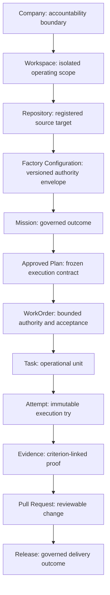

# The Authoritative Delivery Hierarchy

## Quick Read

- **Purpose:** Preserve intent, authority, causality, evidence, and acceptance
  across every delivery record.
- **Best for:** Architects, platform engineers, product leaders, and reviewers.
- **Prerequisites:** [The Human-Agent Operating Model](../03-operating-model/01-human-agent-operating-model.md).
- **Reading time:** 22 minutes.
- **You will learn:** Why Mission, Plan, WorkOrder, Task, Attempt, Evidence,
  Pull Request, and Release must remain distinct.

Keep three ideas: “done” is not one state; retries create new Attempts rather
than rewriting history; and evidence must remain bound to the exact candidate
and governing requirement.

## 1. The problem

Agentic engineering systems produce many forms of activity: conversations,
plans, tasks, tool calls, commits, tests, pull requests, and deployments. If the
system treats these records as interchangeable, it cannot answer basic
governance questions. What outcome was authorized? Which code change belongs to
it? Who approved the plan? Which execution produced the artifact? Which
validator checked it? Does a passing test still apply to the current commit?
Who accepted the business outcome?

Conventional task trackers often compress work into a small status vocabulary:
to do, in progress, and done. That is inadequate for autonomous execution.
“Done” may mean an agent stopped running, a Task completed, tests passed, a pull
request opened, a reviewer approved, a deployment succeeded, or customer value
was confirmed. These are different claims with different owners and evidence.

The AI Software Factory therefore needs an authoritative domain hierarchy. Its
purpose is not administrative neatness. It is to preserve intent, authority,
causality, evidence, and accountability as work moves through the system.

## 2. Why the problem exists

Most engineering tools were designed around human coordination. A person reads
the issue, remembers the conversation, interprets a status, recognizes the
branch, and fills gaps with organizational context. Agents cannot safely depend
on that unwritten continuity. They cross model, process, tool, and session
boundaries. They retry. They operate concurrently. They may emit duplicated or
late events. Their output must remain understandable after their context is
gone.

The problem becomes worse when one record owns too much. If a Task also acts as
the business outcome, authorization contract, runtime, evidence store, and
release state, every update carries ambiguous meaning. A runtime process can
accidentally mark business work accepted. A new commit can leave old test
results appearing current. A revised requirement can overwrite the authority
under which earlier work was performed.

The hierarchy exists to stop lower-level execution facts from silently changing
higher-level governance facts.

## 3. Enduring Principle

### One record, one governing responsibility

Each important record should own one kind of decision. It may summarize child
state, but it must not borrow the child's meaning. The full conceptual hierarchy
is:

`Company -> Workspace -> Repository -> Factory Configuration -> Mission ->
Approved Plan -> WorkOrder -> Task -> Attempt -> Evidence -> Pull Request ->
Release`

This hierarchy contains three connected structures:

1. **Organizational scope** establishes who and what the factory may govern:
   Company, Workspace, Repository, and Factory Configuration.
2. **Intent and authority** translate an outcome into approved work: Mission,
   Plan, and WorkOrder.
3. **Execution and proof** preserve what happened and whether it is acceptable:
   Task, Attempt, Evidence, Pull Request, and Release.

The arrows show lineage, not automatic completion. Child progress may inform a
parent decision. It cannot make that decision by implication.

### Company

The Company is the highest accountability and data-isolation boundary. It owns
organizational identity, membership, broad policy, and ultimate risk ownership.
It does not describe a particular product outcome or authorize repository work.

Without this boundary, users, credentials, policies, costs, and evidence can
leak across organizations.

### Workspace

A Workspace is an isolated operating scope within a Company. It groups the
people, repositories, configurations, Missions, and permissions needed for a
product, team, or bounded initiative. It does not itself prove access to a
specific repository or environment.

Without a Workspace boundary, every policy becomes organization-wide and teams
cannot reason about local authority, ownership, or cost.

### Repository

The Repository record identifies an exact source-control target and its
connection status. It owns provider identity, canonical repository name,
default branch, installation linkage, readiness, and repository-specific policy
overrides. Registration is not authorization to mutate it.

Without a first-class Repository, the system may confuse repositories with
similar names, act against stale credentials, or lose the relationship between
work and source lineage.

### Factory Configuration

The Factory Configuration is a versioned authority envelope for operating on a
Repository. It binds an approved workflow, executor and version, policy,
environment, budget, verifiers, risk boundary, and recovery controls. A digest
identifies the exact configuration evaluated at dispatch.

It does not define the business outcome. It answers, “Under which operating
rules may this factory perform work here?”

Without versioning, a run cannot prove which tools, policy, budget, or validator
set governed it. Editing configuration in place destroys reproducibility.

### Mission

A Mission is one durable governed outcome. It owns the objective, business
reason, context, constraints, sources of truth, owner, risk, stop condition,
budget, and measurable acceptance criteria. It coordinates work without
becoming the runtime that performs it.

Without a Mission, agents optimize Tasks while the original business outcome
drifts or disappears.

### Plan

A Plan is a versioned proposal for achieving the Mission. It records research,
unknowns, sequencing, WorkOrder blueprints, validation assertions, cost, and
rollback approach. Approval freezes one exact version and permits its authorized
WorkOrders to be materialized.

Plan approval does not dispatch an agent, satisfy WorkOrder risk approval,
accept evidence, merge code, or deploy software. Without versioned approval,
the system cannot prove that execution followed what the human reviewed.

### WorkOrder

A WorkOrder is the primary unit of engineering authority and acceptance. It
defines a bounded desired outcome, repository and branch strategy, permitted
scope, constraints, dependencies, risk, model limits, required approvals,
acceptance criteria, and human escalation conditions.

The WorkOrder is more than a ticket. It is the contract between human intent and
agent execution. Without it, tool access and work scope are inferred from
conversation.

### Task

A Task is a bounded operational unit within authorized work. It provides useful
decomposition, assignment, dependency, and progress information. It does not own
business acceptance or expand the WorkOrder's authority.

Without Tasks, execution may become too coarse to schedule, recover, or assign.
When Tasks replace WorkOrders, operational completion is easily mistaken for
accepted value.

### Attempt

An Attempt is one immutable execution try. It owns runtime identity, exact input
versions, worker, tools, worktree, timeline, status, artifacts, cost, errors, and
termination reason. A retry creates a new Attempt rather than rewriting the
failed one.

Without immutable Attempts, the factory cannot reconstruct causality, detect
duplicate execution, compare recovery hypotheses, or audit what actually ran.

### Evidence

Evidence is criterion-linked proof produced by a known verifier against an exact
artifact and environment. It records method, result, provenance, freshness,
artifact hashes, source commit, and validity. Evidence may pass, fail, become
stale, conflict, or require an authorized waiver.

Evidence is not an agent's narrative. Without criterion linkage and provenance,
the factory can present confidence without proof.

### Pull Request

A Pull Request is the source-control review boundary for the proposed change. It
owns the repository comparison, branch, head SHA, checks, review state, and merge
result. The review package links it back to the Mission, Plan, WorkOrder,
Attempts, and Evidence.

A pull request is not the WorkOrder and does not prove customer value. A new
head SHA can make earlier evidence stale.

### Release

A Release is the governed progression of an accepted change through merge,
deployment, activation, observation, rollback readiness, and production
verification. These stages remain separate because each introduces new risk and
requires different evidence.

Without a Release boundary, “merged,” “deployed,” “enabled,” “healthy,” and
“valuable” collapse into one misleading status.

### Invariants that protect the hierarchy

Five invariants make the model trustworthy:

1. Every material action traces upward to human-governed intent.
2. Every run records the exact versions of its WorkOrder, workflow, factory
   configuration, repository, and policy.
3. No child record silently completes or accepts its parent.
4. Material change creates a new version and invalidates affected authority or
   evidence.
5. Every acceptance decision can trace downward to fresh evidence and exact
   artifacts.

## 4. Tradeoffs and alternatives

The hierarchy creates more records and transitions than a task tracker. That is
real cost. Small, low-risk work may feel slower when every concept becomes a
form or approval. The correct response is not to collapse the model. It is to
automate routine record creation, inherit safe defaults, and scale required
human attention with risk.

Some systems may combine Task and WorkOrder when a unit is both operationally
atomic and independently acceptable. That choice is safe only if the combined
record still preserves authority, acceptance, revision, and evidence boundaries.

Attempt may also be called ExecutionRun. The name matters less than the
invariant: each try is immutable and distinguishable from the logical Task.

Pull Request and Release may remain external system objects rather than copied
records. The factory still needs durable references, exact versions, provider
events, and its own governed interpretation of their state.

## 5. Current Mission Control Implementation

This assessment uses Mission Control commit
[`8014d5af427b43ff5c5a63cfdf82ec92742c208c`](https://github.com/jaydubya818/MissionControl/tree/8014d5af427b43ff5c5a63cfdf82ec92742c208c),
studied on 2026-08-07.

| Concept | Current representation | Assessment |
| --- | --- | --- |
| Company | `tenants` | Implemented as the multi-tenant boundary. Product language uses Company while the schema retains `tenant`. |
| Workspace | `projects` | Implemented with Company linkage, identity, repository compatibility fields, and policy defaults. Product language uses Workspace while the schema retains `project`. |
| Repository | `workspaceRepositories` | Implemented as a one-to-many Workspace relationship with GitHub identity, status, branch, webhook state, and policy overrides. |
| Factory Configuration | `factoryDefinitions` and immutable `factoryDefinitionVersions` | Implemented with configuration digests, workflow, executor, policy, environment, budget, verifiers, risk, recovery, readiness assessment, and controlled activation. |
| Mission | `missions` | Implemented with an explicit lifecycle, serial mutation policy, budget, corrective limits, stop condition, plan linkage, and human-attention fields. |
| Plan | `missionPlans` | Implemented as revisions containing assertions and WorkOrder blueprints. Submission, approval, rejection, and idempotent release are represented. |
| WorkOrder | `workOrders` plus governance tables | Implemented as the unit of desired outcome, risk, scope, acceptance, approval, revision, reopen, supersession, and audit. |
| Task | `tasks` and WorkOrder/task linkage | Present, with legacy and operational responsibilities still coexisting. The target model positions Task beneath WorkOrder. |
| Attempt | `workflowRuns`, `runEvents`, and `runArtifacts` | Implemented under the name ExecutionRun or WorkflowRun. The records retain version, runtime, isolation, steps, events, artifacts, and failure detail. |
| Evidence | `validationAssertions` and `verificationReceipts` | Implemented with criterion status, verifier run linkage, methods, artifacts, validity, waiver, and invalidation. |
| Pull Request | `harnessPrChecks`, GitHub webhook records, run artifacts, and related commands | Implemented across integration and evaluation records rather than one canonical `pullRequests` table. Head-SHA-specific evidence and merge data exist. |
| Release | deployment and release-gate records | Partial for the software-delivery hierarchy. Deployment governance exists, but the complete Mission-to-production-value path remains a V1 target. |

Mission Control's current naming reveals an important migration reality. Product
terms and schema terms do not always match. Company maps to `tenant`, Workspace
maps to `project`, and Attempt maps most closely to `workflowRun`. The guide uses
the conceptual vocabulary while citing the implementation vocabulary explicitly.

The current schema includes many required records, but schema presence is not
proof of one coherent product journey. A complete browser-operated demonstration
must still show that the records are created through supported paths, governed
server-side, recoverable, and understandable to an operator.

## 6. Future Vision

Mission Control should expose the hierarchy as one navigable lineage rather than
forcing the operator to reconstruct it across pages. Every object should answer:

- What parent authorized me?
- Which version governed me?
- What state am I in, and who may change it?
- Which children or artifacts support my current state?
- What evidence is missing, failed, stale, or conflicting?
- Which human decision is required next?

The product should converge implementation names toward the canonical language
or provide one explicit translation layer. It should make Pull Request and
Release lineage first-class without duplicating GitHub or deployment-provider
authority. The complete hierarchy becomes a current capability only after the
browser golden path proves creation, execution, failure, recovery, validation,
review, and exact source lineage without direct database intervention.

## 7. Versioned references

- [Mission Control North Star](https://github.com/jaydubya818/MissionControl/blob/8014d5af427b43ff5c5a63cfdf82ec92742c208c/docs/product/mission-control-north-star.md)
- [Mission Control V1 Product Strategy](https://github.com/jaydubya818/MissionControl/blob/8014d5af427b43ff5c5a63cfdf82ec92742c208c/docs/product/mission-control-v1-product-strategy.md)
- [Governed Missions Contract](https://github.com/jaydubya818/MissionControl/blob/8014d5af427b43ff5c5a63cfdf82ec92742c208c/docs/software-factory/governed-missions-contract.md)
- [Software Factory Domain Contracts](https://github.com/jaydubya818/MissionControl/blob/8014d5af427b43ff5c5a63cfdf82ec92742c208c/docs/software-factory/domain-contracts.md)
- [Software Factory Information Architecture](https://github.com/jaydubya818/MissionControl/blob/8014d5af427b43ff5c5a63cfdf82ec92742c208c/docs/software-factory/information-architecture.md)
- [Convex schema](https://github.com/jaydubya818/MissionControl/blob/8014d5af427b43ff5c5a63cfdf82ec92742c208c/convex/schema.ts)
- [Factory Configuration implementation](https://github.com/jaydubya818/MissionControl/blob/8014d5af427b43ff5c5a63cfdf82ec92742c208c/convex/factory/configuration.ts)
- [Pull-request checks and governed merge](https://github.com/jaydubya818/MissionControl/blob/8014d5af427b43ff5c5a63cfdf82ec92742c208c/convex/factory/prChecks.ts)

## 8. Notes and lessons learned

My current conclusions are:

- The hierarchy is a chain of claims, not merely a database relationship.
- WorkOrder is the central contract between human intent and agent execution.
- Attempt history must be immutable because retries are new facts.
- Evidence belongs to criteria and exact artifacts, not generic completion.
- Plan approval, dispatch, completion, acceptance, merge, deployment, and value
  confirmation are different decisions.
- Product vocabulary must be stable even while implementation names migrate.
- A schema can represent the right model while the supported product journey
  remains incomplete.

## 9. Design review questions

1. Why is a WorkOrder not simply a Task?
2. What does Plan approval authorize, and what does it not authorize?
3. Why must an Attempt be immutable?
4. When does evidence become stale?
5. Why can a passing pull request still fail Mission acceptance?
6. Which entity owns business intent?
7. Which entity owns execution authority?
8. How should a material WorkOrder revision affect approvals and evidence?
9. Why should Pull Request and Release remain distinct?
10. How do Mission Control's implementation names map to the conceptual model?
11. Which parts of the hierarchy are implemented, partial, or unproven?
12. How would you simplify the operator experience without collapsing the
    domain model?

## 10. Whiteboard exercise

Draw the complete hierarchy from memory. For every object, write one phrase for
what it owns and one phrase for what it cannot authorize. Then trace these three
paths:

1. a normal change from Company to production verification;
2. a failed validator result that creates corrective work and fresh Evidence;
3. a material Plan or WorkOrder revision that invalidates prior authority.

The exercise fails if any lower-level status automatically accepts a parent or
if evidence cannot be traced to an exact Attempt and artifact.

## 11. Hands-on lab

### Objective

Trace one Mission Control Mission through every currently implemented domain
record and identify every conceptual-to-implementation name translation.

### Starting version

- Repository: `jaydubya818/MissionControl`
- Commit: `8014d5af427b43ff5c5a63cfdf82ec92742c208c`
- Study date: 2026-08-07

### Tasks

1. Select one Company, Workspace, Repository, and active Factory Configuration.
2. Trace the corresponding `tenants`, `projects`, `workspaceRepositories`,
   `factoryDefinitions`, and `factoryDefinitionVersions` records.
3. Create or select a Mission and trace its Plan, assertions, and released
   WorkOrders.
4. Trace a WorkOrder into its Tasks, WorkflowRuns, events, and artifacts.
5. Map each verification receipt to its criterion, validator run, artifact, and
   WorkOrder revision.
6. Trace any pull-request evidence to the exact repository, branch, and head SHA.
7. Identify where the Release chain becomes partial or leaves the current
   supported path.
8. Produce a current, partial, absent, and future capability matrix.

### Required evidence

- exact commit and record identifiers;
- one lineage diagram;
- conceptual-to-implementation terminology map;
- source paths and relevant tests;
- screenshots from supported operator surfaces;
- gaps where direct database inspection was required; and
- a five-minute unscripted explanation.

### Cleanup

Use read-only tracing or a disposable seeded environment. Do not alter
production records or retrofit the conceptual terms into Mission Control during
this lab.

## Mastery standard

The chapter is mastered when I can reconstruct the hierarchy, define every
record by its responsibility, explain every authority boundary, trace Mission
Control's implementation at a specific commit, diagnose a collapsed-state
design, and teach the model to a developer, CTO, and CEO without notes.
