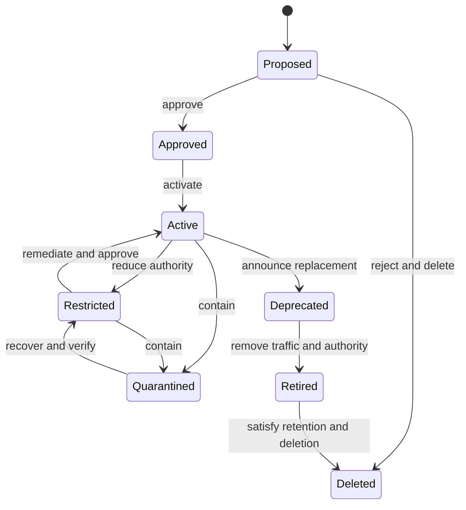

# Factory System Inventory, Classification, and Lifecycle

## Quick Read

- **Purpose:** Maintain one accountability record for each material autonomous
  delivery system without copying its subordinate registries.
- **Owner:** The named system owner; governance owns the schema and review
  policy, while registry owners remain authoritative for their objects.
- **Invariant:** No active system lacks an accepted purpose, accountable owner,
  risk tier, autonomy ceiling, lifecycle state, and current review evidence.
- **Evidence boundary:** A complete record proves inventory discipline, not
  control effectiveness.

## 1. The problem

Capabilities, models, repositories, policies, evidence, environments, and
deployments live in different registries. Without a governed system record,
no one can reliably answer what an autonomous delivery system is allowed to
do, who accepts its risk, which data and downstream systems it touches, or
whether it should still be operating.

## 2. Enduring Principle

### Inventory the governed system; reference its parts

`FactorySystemRecord` is the accountability and classification spine. It
references immutable versions or registry identifiers. It does not become a
second service catalog, capability registry, model registry, policy store, or
evidence store.

## 3. Reference schema

```yaml
factory_system:
  id: fsys_payments_api_delivery
  version: 7
  purpose: "Produce validated changes for the payments API"
  accepted_outcomes: ["release-candidate-with-proof-package"]
  prohibited_purposes: ["change-production-data-directly"]
  owners:
    business: role:product-owner
    engineering: role:system-engineering-owner
    security: role:security-control-owner
    operations: role:service-operations-owner
    assurance: role:independent-quality-owner
  scope:
    repositories: [repo:payments-api]
    workflows: [workflow:bounded-change@3]
    environments: [env:ephemeral-test, env:staging]
    deployment_targets: [service:payments-api]
    tenants: [tenant:internal-engineering]
  configuration_refs:
    agents: [agent:builder@12]
    models: [model-profile:code-primary@8]
    prompts: [prompt:change-plan@5]
    tools: [tool:repository-read@4, tool:pull-request-publish@6]
    skills: [skill:test-triage@9]
    evaluators: [eval:quality-contract@11]
  data:
    sources: [source:repository, source:issue]
    highest_classification: confidential
    residency: [us]
    retention_policy: retention:engineering-runs@2
  authority:
    criticality: high
    risk_tier: 3
    autonomy_ceiling: bounded-change-with-human-release
    approval_policy: policy:risk-tier-3@6
    prohibited_actions: [production-write, secret-export]
  operations:
    lifecycle_state: active
    evidence_status: current
    last_reviewed_at: 2026-08-30T18:00:00Z
    next_review_due_at: 2026-11-30T18:00:00Z
    exception_refs: []
    incident_refs: []
    performance_ref: dashboard:fsys-payments
    cost_center: engineering-platform
```

Required references include integrations, identities, credential brokers,
trust boundaries, external providers, downstream side effects, drift status,
cost, outcome measures, open incidents, and unresolved exceptions. References
must resolve to an exact version or a documented moving alias with change
notification.

## 4. State model and commands



| Command | Authorized decision owner | Required evidence | Invalid when |
|---|---|---|---|
| Approve | Business, engineering, security, and assurance owners by risk | Purpose, architecture, risk, tests, controls | Critical fields or owner acceptance missing |
| Activate | System owner plus release policy | Qualified version and current proof package | Review expired or dependency revoked |
| Restrict | Control owner or incident authority | Reason, reduced ceiling, affected scope | Requested ceiling is broader than current |
| Quarantine | Emergency authority | Incident or credible control failure | Never blocked by ordinary change windows |
| Deprecate | System and capability owners | Replacement or exit plan, notice | Active dependents have no disposition |
| Retire | System owner and operations | Traffic stopped, grants revoked, records retained | Active work or unresolved downstream effect exists |
| Delete | Data owner | Retention satisfied, deletion receipt | Legal, incident, or audit hold exists |

Every command carries actor identity, expected record version, reason,
idempotency key, policy decision, and resulting event. Compare-and-set updates
prevent stale approval from overwriting a containment action.

## 5. Classification and review policy

Classification combines business impact, data sensitivity, side-effect class,
deployment reach, reversibility, user impact, dependency criticality, and
evidence strength. The highest material risk controls the autonomy ceiling;
averaging several low risks cannot cancel one catastrophic action.

Review cadence is both periodic and event-driven. Reassess after a new data
class, model family, privileged tool, deployment target, supplier, critical
incident, material drift, control failure, ownership change, or autonomy
promotion. Expired review evidence moves the system to restricted operation or
blocks new high-risk work according to policy.

## 6. Failure, recovery, and observability

| Failure | Detection | Containment | Recovery proof |
|---|---|---|---|
| Orphaned owner | Identity directory reconciliation | Block promotion and new grants | Accepted replacement owner |
| Stale registry reference | Version-resolution check | Freeze affected workflow | Re-resolved manifest and regression tests |
| Hidden downstream action | Egress and tool-call comparison | Quarantine capability and affected systems | Updated boundary map and side-effect test |
| Expired review | Due-date monitor | Restrict autonomy | Completed review with decision record |
| Deletion mismatch | Registry and storage reconciliation | Hold closure and notify data owner | Deletion receipts across all governed stores |

Emit state-change events with correlation identifiers. Measure inventory
completeness, overdue review, unresolved owner, stale reference, exception age,
time to containment, and time to verified retirement. Inventory data is
classified and access-controlled; it often reveals sensitive architecture.

## 7. Compatibility, performance, and cost

The schema is versioned. Additive optional fields may be backward compatible;
changed meanings, required fields, and lifecycle semantics require migration
and consumer testing. Inventory reads should remain available during incidents;
writes use durable storage and an auditable outbox. Cache only non-authoritative
views. Track operating cost by system and accepted outcome, not only raw model
usage.

## 8. Tradeoffs and alternatives

A spreadsheet can start a small inventory but weakens referential integrity,
event handling, and policy enforcement. A graph improves dependency and blast-
radius analysis but does not replace authoritative registry ownership. Begin
with one record API and explicit references; add graph projections only when
measured review or incident needs justify them.

## 9. Explicit nonclaims and maturity

This review-ready specification does not prove inventory completeness, control
operation, or organization-wide adoption. The example is synthetic. Local
systems must define risk tiers, retention, residency, and decision owners.

## 10. Review exercise and lab

Inventory one synthetic factory system. Revoke one tool version, change one
owner, and expire its review. Demonstrate reference reconciliation, autonomy
restriction, notification, recovery, and an audit trail that another reviewer
can reconstruct without access to hidden model reasoning.
