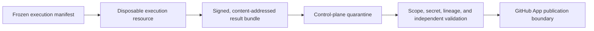

# Sandboxed Execution, Isolation, and Publication Boundaries

## 1. The problem

An implementation agent executes untrusted generated actions against valuable
source code. A worktree prevents branch collision, but it does not contain
process, credential, network, resource, or host risk. Conversely, a disposable
virtual machine reduces persistence but does not make its output trustworthy or
authorize publication.

## 2. Why the problem exists

Agentic execution combines repository content, package managers, build scripts,
model credentials, tools, and external networks. Any can be malicious or
compromised. The worker may also outlive its lease, exceed budget, modify files
outside scope, expose a preview port, or leave remote resources running after
failure.

## 3. Enduring Principle

### Isolation is layered containment

Use several independent boundaries:

- Attempt-specific branch and worktree;
- unprivileged process or user;
- filesystem and path allowlist;
- network and egress policy;
- short-lived WorkOrder-scoped credentials;
- CPU, memory, runtime, and spend limits;
- lease, heartbeat, cancellation, and teardown;
- quarantined result bundle; and
- independent validation before publication.

No single sandbox property proves the others.

### The sandbox is a resource, not an authority record

A local process, container, VM, or remote environment is attached to one
Attempt. Mission Control still owns policy, claim, lifecycle, evidence,
acceptance, and publication. The sandbox may execute the frozen manifest and
report facts; it may not change scope, validate itself, merge, deploy, or retain
credentials after termination.

### Separate execution identity from publication identity

The agent runtime should not hold GitHub write or deployment credentials.
After validation, a trusted outer control-plane component mints the shortest
lived repository-scoped credential required to push and open one PR. Human
merge remains a separate decision.

### Make teardown and orphan recovery first-class

Record allocation identity before creating an external resource. Lifecycle
states should include provisioning, ready, running, result-ready, teardown,
terminated, failed, and orphaned. Reconciliation finds resources that exist in
the provider but lack active factory authority. Cleanup uses exact provider IDs,
never broad patterns.

### Treat sandbox output as untrusted

Receipt spools, logs, diffs, test results, and bundles require integrity checks,
redaction, scope validation, and independent verification. A compromised
sandbox must not be able to forge acceptance by controlling both artifact and
evidence.

## 4. Tradeoffs and alternatives

Local worktrees are fast and observable but share the host. Containers improve
process and filesystem isolation but may share a kernel. Remote VMs strengthen
host separation at higher latency, cost, provider risk, and orphan complexity.
Risk-proportional policy should choose the boundary.

Giving the sandbox publication credentials simplifies the architecture and
destroys separation of duties. The outer publication step is more work but
keeps untrusted code away from the durable repository write identity.

## 5. Current Mission Control Implementation

GitHub `main` includes the `codex/v1` adapter contract and Factory host
readiness, but not the complete production worker.

Study commit
[`9d5f8e3`](https://github.com/jaydubya818/MissionControl/tree/9d5f8e36aff45a001a8848cc0516b3dc800e29b8)
on draft PR #64 implements an attempt-specific local worktree worker. It claims
a durable lease, renews heartbeats, validates the frozen worktree and code
scope, runs Codex, blocks out-of-scope changes, commits, mints an ephemeral
repository-restricted GitHub App token, pushes, and creates or reuses an exact
PR. Terminal reporting requires the active matching lease.

Todo 024 records a real GitHub App proof: branch and commit were created, and
PR #61 opened with passing checks. The proof required direct control-plane
mutations because the browser Mission path could not yet carry all policy and
receipt data. The browser-only golden path and complete UI state matrix remain
open.

Remote sandbox documents in the local Mission Control folder are uncommitted
proposals, not product capability. They define a strong authority and threat
model, but the provider proof is blocked because the selected exe.dev plan has
zero VM capacity and the Product Owner declined an upgrade. No repository,
model, or production credential was sent to a VM.

## 6. Future Vision

Remote execution should use a root-owned supervisor and unprivileged agent,
hash-chained receipts, bounded egress, no publication credential, durable
allocation journal, signed result bundle, quarantine, deterministic teardown,
and cost reconciliation. Best-of-N cohorts should publish only one
human-selected candidate through the outer GitHub boundary.

## 7. Versioned references

- [Factory Attempt worker](https://github.com/jaydubya818/MissionControl/blob/9d5f8e36aff45a001a8848cc0516b3dc800e29b8/apps/orchestration-server/src/factoryAttemptWorker.ts)
- [Git worktree runtime](https://github.com/jaydubya818/MissionControl/blob/9d5f8e36aff45a001a8848cc0516b3dc800e29b8/apps/orchestration-server/src/factoryGitRuntime.ts)
- [Path-scope enforcement](https://github.com/jaydubya818/MissionControl/blob/9d5f8e36aff45a001a8848cc0516b3dc800e29b8/apps/orchestration-server/src/factoryPathScope.ts)
- [GitHub App runtime](https://github.com/jaydubya818/MissionControl/blob/9d5f8e36aff45a001a8848cc0516b3dc800e29b8/apps/orchestration-server/src/githubAppRuntime.ts)
- [Factory Attempt lease](https://github.com/jaydubya818/MissionControl/blob/9d5f8e36aff45a001a8848cc0516b3dc800e29b8/convex/factory/attempts.ts)
- [Todo 024](https://github.com/jaydubya818/MissionControl/blob/9d5f8e36aff45a001a8848cc0516b3dc800e29b8/todos/024-ready-p1-real-codex-github-pr-golden-path.md)
- [Real proof PR #61](https://github.com/jaydubya818/MissionControl/pull/61)

Local uncommitted sources studied on 2026-08-11:

- `docs/architecture/remote-sandbox-execution.md`, SHA-256 `ba4891aca66bac58a17309d7204953365fcf29490455a2cee9732e867cf36f7c`;
- `docs/security/remote-sandbox-threat-model.md`, SHA-256 `9facf5d57462bd8db9a1a58f446ab4ee70bd89c8c70b1c1b6a6ee58827470c8c`;
- `docs/validation/2026-08-10-remote-sandbox-provider-proof.md`, SHA-256 `6ab6a560799526b7d0a25313f9ca08e08c44fb28c8b657b5994f95d2af950053`.

## 8. Notes and lessons learned

Disposable is not synonymous with safe. The decisive boundary is that the
untrusted executor cannot publish its own result or certify its own evidence.

## 9. Design review questions

1. What does a worktree isolate, and what does it not isolate?
2. Why should the sandbox lack GitHub write credentials?
3. How do you recover an orphaned remote VM?
4. What makes a result bundle trustworthy enough to inspect—but not accept?
5. When would a container be sufficient instead of a VM?

## 10. Whiteboard exercise

Draw local worktree, container, and remote-VM variants. Mark credentials,
network, lease, receipts, quarantine, independent validation, publication, and
teardown. Add a worker crash after VM allocation and before journal update.

## 11. Hands-on lab

**Prerequisite:** a disposable checkout of Mission Control study commit
`9d5f8e3` and test-only credentials or mocks. Do not use a production repository
or purchase provider capacity.

Trace the local Attempt worker. In focused tests, trigger path deviation,
expired lease, token expiry, duplicate PR creation, and cancellation. Then
threat-model a remote version without provisioning it.

Retain exact test output and distinguish deterministic proof, live PR proof,
blocked provider evidence, and future design. Remove test worktrees and branches,
revoke any temporary credential, and verify that no provider resource remains.
