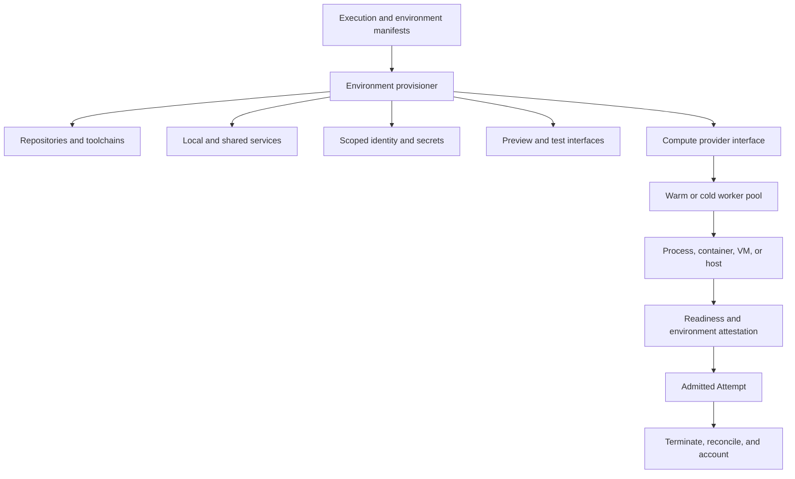

# Development Environments, Compute, and Composable Infrastructure

## 1. The problem

An agent cannot build or test software merely because a model and repository are
available. It needs the correct compilers, dependencies, services, identities,
network paths, test data, browser or device capabilities, and preview surfaces.
If that environment is slow to create, inconsistent, overprivileged, or
impossible to inspect, the factory becomes unreliable regardless of model
quality.

Sandboxing answers how execution is contained. Development-environment
engineering answers whether the work can be performed and evaluated correctly.
Compute infrastructure answers where and at what capacity the environment runs.

## 2. Why the problem exists

Human workstations accumulate state gradually. Engineers repair missing tools,
refresh credentials, remember service addresses, and interpret local failures.
Autonomous workers cannot depend on that invisible maintenance. They may start
hundreds of times, run concurrently, outlive an API request, or be destroyed
after one Attempt.

Large products also depend on shared services that cannot be cloned into every
worker. A development environment may need private network access, service
virtualization, stable test identities, seeded data, and a preview URL. Moving
compute to a managed provider without reconstructing those dependencies can
turn infrastructure convenience into integration friction.

## 3. Enduring Principle

### Treat the environment as a versioned execution dependency

A **Development Environment Contract** should identify:

- repository set, baseline commits, checkout layout, and writable paths;
- operating system, architecture, image, language runtimes, package managers,
  compilers, browsers, and tool versions;
- build, test, lint, migration, startup, readiness, and cleanup commands;
- required local and shared services, endpoints, test data, and feature flags;
- human, service, worker, and repository identities;
- secret references and credential-minting policy;
- filesystem, process, network, egress, and resource boundaries;
- preview ports, URLs, access policy, and evidence capture;
- cache inputs and invalidation rules;
- lifecycle, timeout, suspend, teardown, and orphan-recovery behavior; and
- environment attestation and qualification evidence.

The Execution Manifest binds an exact environment version to an Attempt. A
floating “latest” image or mutable workstation state prevents meaningful
reproduction.

### Separate environment orchestration from compute allocation

The compute provider exposes allocation, start, stop, snapshot, measure, and
termination. The environment provisioner makes that resource useful for a
specific software system. Keeping the boundary explicit permits managed
compute, bring-your-own compute, or an internal fleet without rewriting factory
authority.

### Choose persistence deliberately

**Ephemeral environments** are created from a declared state and destroyed
after work. They reduce drift and cross-run contamination but incur cold-start,
clone, dependency, and authentication cost.

**Persistent environments** retain checkouts, caches, and credentials across
runs. They start faster and require drift detection, cleanup, credential
rotation, capacity reservation, and stronger reconciliation.

The pets-versus-cattle analogy describes operational replaceability. A
replaceable worker can be rebuilt from automation; a pet requires individual
repair. Small teams may begin with a few persistent workers, but should still
automate bootstrap and prove that a replacement can be created from declared
state.

### Make startup and preview part of the product contract

Measure queue wait, allocation, checkout, dependency restore, service startup,
readiness, and first useful tool call separately. Use golden images, content
addressed caches, partial clones, warm pools, and preflight only when their
invalidation rules are explicit.

For user-facing software, a reviewable preview is part of the result. It should
have a stable Attempt identity, authenticated access, bounded lifetime,
environment and commit labels, health state, logs, and deterministic teardown.
A preview URL is not evidence of correctness; it is an interface through which
humans and validators can gather evidence.

### Design the worker fleet as a production service

Fleet controls include:

- typed queues and priority classes;
- concurrency and tenant quotas;
- admission based on required architecture, tools, network, and capacity;
- autoscaling and warm-capacity policy;
- backpressure and load shedding;
- lease, heartbeat, fencing, cancellation, and drain;
- timeout budgets and classified retry;
- exponential backoff with jitter for transient dependencies;
- circuit breakers and provider failover;
- dead-letter or quarantine handling for poison work;
- capacity, cost, utilization, and orphan accounting; and
- service-level objectives for readiness, dispatch, teardown, and recovery.

Backoff and retry do not authorize another external effect. Idempotency and
reconciliation remain required whenever allocation, publication, or teardown
may have succeeded before the response was lost.

### Compose the stack one layer at a time

Evaluate build, buy, or bring-your-own choices independently:

| Layer | Reasons to own | Reasons to adopt or buy |
| --- | --- | --- |
| Control and orchestration | Differentiating policy, workflow, evidence, and integrations | Commodity workflows with acceptable contracts |
| Harness | Required hooks, tools, model choice, or custom agent behavior | Mature coding loop and rapid capability improvements |
| Development environment | Complex private services, identity, data, or toolchains | Standard application stack and acceptable templates |
| Compute | Residency, utilization, accelerator, or network requirements | Elasticity, fleet operations, and reduced infrastructure burden |

For enterprise use, compare identity federation, tenant isolation, data
residency, private networking, egress controls, key management, audit
retention, quotas, chargeback, support, and exit procedures. For open-source or
open-core components, also examine license, release cadence, maintainer health,
dependency provenance, vulnerability response, upgrade compatibility, and the
ability to operate without a hosted control service.

## 4. Tradeoffs and alternatives

Prebuilt images reduce startup time and can become stale or oversized. Building
from source improves transparency and consumes time. Persistent workers reduce
cold starts and increase cross-run state risk. Remote environments improve
central control and can complicate local debugging, high-bandwidth tools,
device access, or internal-service connectivity.

Owning the environment usually creates more product leverage than owning raw
compute because it captures organization-specific toolchains and services.
Owning both may still be premature for a small workload. Start with the
simplest operable arrangement, measure startup and failure, and preserve an
exit contract before scaling.

## 5. Current Mission Control Implementation

At study commit
[`d902fae`](https://github.com/jaydubya818/MissionControl/tree/d902fae7032c0696b531c44ae88829c652516fc6),
Mission Control defines Sandbox Profiles, provider identity, image and
toolchain digests, resource ceilings, network and secret boundaries,
qualification evidence, local and remote backends, worker capability
attestations, leases, budgets, cancellation, teardown, and compatibility
checks. The architecture correctly keeps sandbox capability separate from
execution authority.

The studied production admission packet remained blocked by operator
configuration. The evidence does not establish a fleet-scale development
environment service with reproducible multi-repository bootstrap, shared
service connectivity, authenticated previews, warm-pool policy, autoscaling,
cross-tenant load tests, or cost allocation. Remote backend contracts and local
qualification are not equivalent to sustained production operation.

## 6. Future Vision

Mission Control should compile repository manifests and environment contracts
into attested, policy-qualified environments. It should select eligible compute
only after checking workload requirements, tenant, network, data residency,
capacity, cost, and sandbox qualification.

The operator should see queue age, provisioning stages, cache decisions,
readiness, preview state, resource usage, cost, teardown, and orphan recovery
for every Attempt. Promotion requires cold-start and warm-start benchmarks,
clean rebuilds, dependency-outage tests, cancellation races, credential
revocation, cross-tenant isolation, provider reconciliation, and controlled
failover.

## 7. Versioned references

- [Sandboxed Execution, Isolation, and Publication Boundaries](./04-sandboxed-execution-isolation-and-publication.md)
- [Tasks, Attempts, Leases, Idempotency, and Recovery](./03-tasks-attempts-leases-idempotency-and-recovery.md)
- [Factory Observability and Agent Runtime Telemetry](./05-factory-observability-and-agent-runtime-telemetry.md)
- [Devfile schema 2.3.0](https://devfile.io/docs/2.3.0/devfile-schema), accessed 2026-08-30
- [Google Site Reliability Engineering books](https://sre.google/books/), accessed 2026-08-30
- [Mission Control capability, workflow, and admission map](../09-mission-control-case-studies/03-capability-workflow-and-admission-map.md), assessed at `d902fae`

## 8. Notes and lessons learned

- A sandbox can be safe and unusable; a development environment can be usable
  and unsafe. The factory needs both properties.
- Cold-start time is a product metric because it directly affects validated
  lead time and human trust.
- Bring-your-own compute does not remove integration responsibility; it changes
  who owns the resource boundary.
- A preview is a temporary review surface, not an acceptance decision.

## 9. Design review questions

1. How does a development environment differ from a sandbox and from compute?
2. When should agent workers be persistent instead of ephemeral?
3. Which environment fields must be frozen for reproducibility?
4. How would you connect a remote worker to shared internal services safely?
5. What does an enterprise build-versus-buy review need beyond price?
6. Which fleet signals should pause autonomous execution?

## 10. Whiteboard exercise

Design a worker fleet for 500 concurrent coding Attempts across three risk
classes. Show queueing, admission, golden images, warm pools, private services,
identity, secret minting, previews, backpressure, failover, teardown, and cost
allocation. Add a provider timeout after a VM is allocated but before its ID is
recorded.

## 11. Hands-on lab

Define an environment manifest for the controlled golden-path repository. From
a clean machine or disposable VM, provision the toolchain, checkout the exact
commit, start required services, run preflight, expose an authenticated preview,
execute tests, and tear everything down. Repeat from a warm cache and compare
the stages.

Required evidence: manifest and digests, readiness receipts, startup timeline,
identity and network map, preview identity, resource and cost measurements,
cold/warm comparison, cancellation test, and teardown proof. Cleanup must
verify that no worker, credential, preview, or external resource remains.
