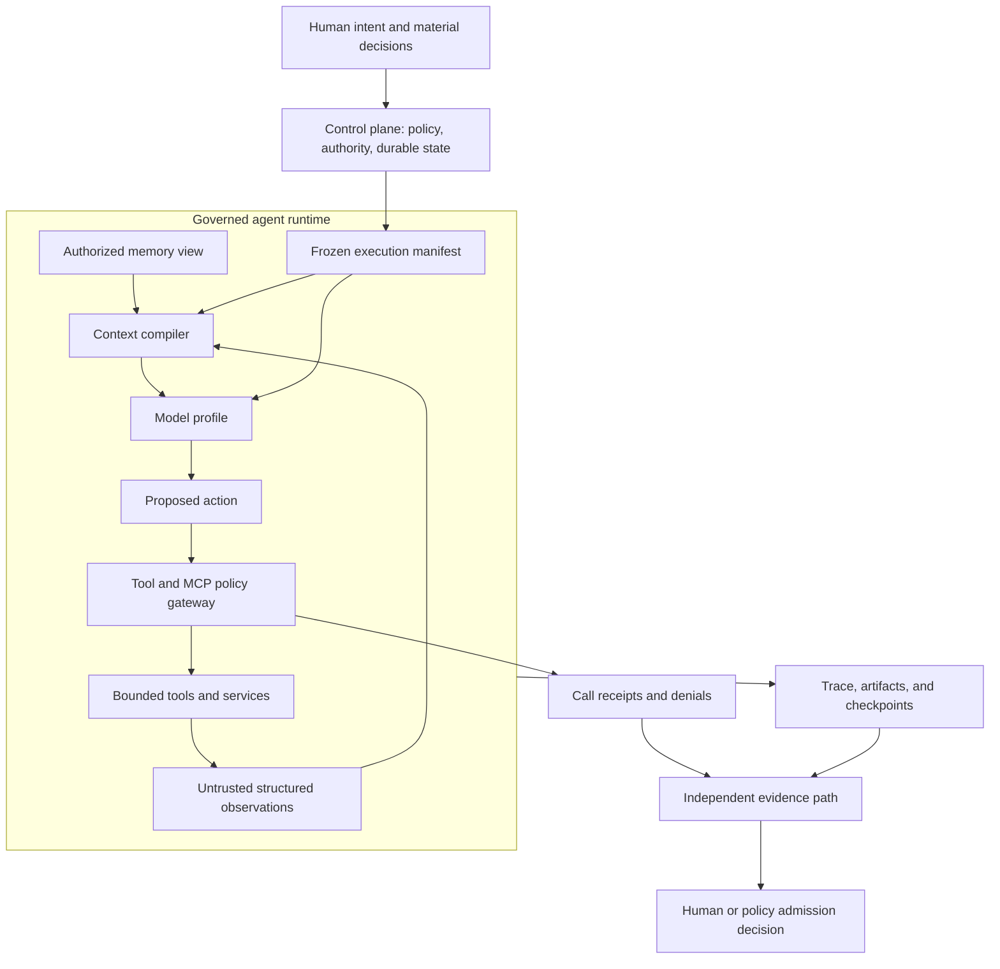
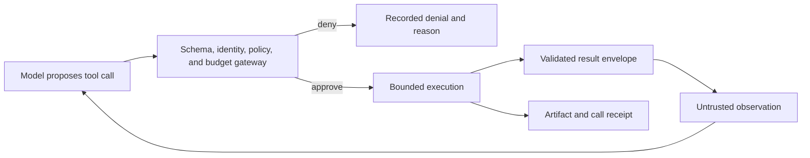

# Agent Architecture, MCP, Tools, Context, and Memory

## Quick Read

- **Purpose:** Define the complete, versioned runtime surrounding a
  model-driven engineering worker.
- **Best for:** AI engineers, architects, platform teams, security reviewers,
  and technical leaders.
- **Prerequisites:** [Control Plane and Execution Plane](../05-runtime-architecture/01-control-plane-and-execution-plane.md).
- **Reading time:** 18 minutes.
- **You will learn:** How identity, instructions, model profiles, tools, MCP,
  context, memory, policy, budgets, state, evidence, and evaluation form one
  governed agent configuration.

Keep five ideas:

1. An agent is a runtime composition, not a model with a long prompt.
2. The model may propose an action; only the runtime may authorize it.
3. MCP standardizes interoperable sessions and capabilities; it does not grant
   trust, authority, or acceptance.
4. Context and memory are governed inputs with provenance and lifecycle, not
   undifferentiated text.
5. Reproducibility requires freezing the complete execution manifest and
   retaining the resulting trace and evidence.

**Protocol version note:** Normative MCP statements in this chapter are pinned
to the stable `2025-11-25` specification. Experimental features are labeled.
Draft behavior may change and should not silently redefine a production
contract.

## 1. The problem

A language model can interpret and generate text. An engineering agent must do
more: understand an authorized objective, observe an exact repository state,
select tools, preserve execution state, respect policy, recover from failure,
and produce evidence tied to the artifact it changed.

Teams often place those responsibilities inside one prompt and call the result
an agent. That produces an opaque worker whose identity, authority, context,
tools, memory, and model behavior cannot be independently versioned, revoked,
or evaluated. When the result is wrong, the team cannot tell whether the model,
instructions, retrieval, memory, tool adapter, policy, environment, or retry
loop caused the failure.

The production problem is therefore not “How do we write a better prompt?” It
is “How do we construct a governed, observable, replaceable runtime around a
fallible reasoning component?”

## 2. Why the problem exists

A model invocation does not by itself provide durable application state,
identity, authority, or recovery. Provider-managed sessions may retain message
history, but the factory still owns authoritative state and must decide what
enters each request.

Context windows are finite. Repository content, retrieved documents, MCP
resources, tool descriptions, tool results, and prior agent notes can all be
wrong, stale, malicious, or irrelevant. The same model can behave differently
when any prompt, tool schema, dependency, provider version, context item, or
runtime policy changes.

Multi-agent designs add specialization and parallelism, but also create handoff
loss, correlated error, duplicate work, cost, deadlock, and unclear
accountability. A protocol can make capabilities interoperable without deciding
which capability is safe for this user, repository, task, or moment.

These conditions force the surrounding system to own configuration, policy,
state, isolation, evidence, and learning.

## 3. Enduring Principle

### An agent is a governed runtime composition

An engineering agent is a versioned composition of:

`identity + objective + instructions + model profile + tools + context + memory view + policy + budgets + state + evaluation profile`

| Component | Responsibility | What must be frozen or recorded |
|---|---|---|
| Identity | Names the agent role and acting principal | Agent version, tenant, user or service principal |
| Objective | States the bounded outcome | WorkOrder and approved Plan references |
| Instructions | Defines trusted operating behavior | System instructions, skills, workflow versions |
| Model profile | Selects reasoning capability | Provider, model, parameters, routing policy |
| Tool grants | Defines possible actions | Tool names, versions, scopes, schema hashes |
| Context | Supplies decision-relevant knowledge | Source revisions, selection reasons, content hashes |
| Memory view | Supplies governed prior knowledge | Snapshot, query, scope, provenance, lifecycle filters |
| Policy | Limits authority | Policy bundle, risk class, required approvals |
| Budgets | Limits resource use | Time, tokens, cost, attempts, concurrency |
| State | Makes execution durable | Task, Attempt, lease, checkpoints, cancellation state |
| Evaluation profile | Defines expected behavior | Dataset, graders, thresholds, evidence requirements |

Changing any material component changes the worker configuration and may
invalidate evidence from an earlier Attempt. A model name alone is never a
sufficient reproducibility record.



### Separate reasoning from authority

The model can interpret intent, form hypotheses, choose among allowed options,
and propose a tool call. It cannot expand its own scope. Before execution, the
runtime validates the acting identity, input schema, policy, repository and path
scope, risk, budget, approval state, idempotency strategy, and environment.

The result returns as an observation, never as trusted instructions. The runtime
records both approved and denied calls so a reviewer can reconstruct what the
agent attempted, what actually ran, and why.



### Freeze an execution manifest

Every Attempt should resolve mutable configuration into one immutable manifest
before work begins. A minimal manifest contains:

```yaml
attempt_id: attempt-123
work_order_revision: sha256:...
plan_revision: sha256:...
agent_version: agent-implementation-v4
model_profile: code-reasoning-standard-v2
instruction_bundle: sha256:...
tool_grants:
  - name: repository.read_file
    version: 3.2.0
    schema_hash: sha256:...
    scope: read
context_lock: sha256:...
memory_snapshot: sha256:...
policy_bundle: engineering-medium-risk-v5
budgets:
  wall_clock_seconds: 1800
  attempts: 3
evaluation_profile: repository-change-v7
```

The manifest is a contract, not a log assembled after execution. Runtime events
and evidence must point back to it.

### MCP is an interoperability boundary

The Model Context Protocol uses a host–client–server architecture over JSON-RPC.
The host coordinates model access, consent, security policy, and context. It
creates a client for each server connection. The client negotiates protocol
version and capabilities, maintains the stateful session, and routes messages.
The server exposes focused capabilities.

The stable specification defines `stdio` and Streamable HTTP transports. A
production contract must pin the protocol version, transport, server identity,
and negotiated capabilities; “supports MCP” is too vague to be meaningful.

MCP primitives have different control expectations:

| Primitive | Primary purpose | Typical control model | Factory treatment |
|---|---|---|---|
| Tools | Perform computation or side effects | Model-controlled, with host/runtime approval | Apply schema, scope, risk, budget, and evidence policy |
| Resources | Expose addressable data or content | Application-controlled | Treat content and annotations as untrusted; retain URI, revision, and provenance |
| Prompts | Expose reusable message templates | User-controlled | Treat server-supplied instructions as versioned content, not platform authority |
| Sampling | Let a server request model generation through the client | Client-controlled with user oversight | Constrain model access, tool loops, context, cost, and approvals |
| Elicitation | Let a server request additional user input | User-controlled | Make the requesting server visible; protect sensitive-data boundaries |
| Tasks | Represent deferred, durable request execution | Negotiated; experimental in `2025-11-25` | Bind task state to authorization context; set TTL, cancellation, polling, and audit rules |

Capability negotiation proves that both sides speak a compatible protocol. It
does not prove that a server is trustworthy, that a tool is safe, or that the
current WorkOrder authorizes its use.

### Govern the MCP connection, not only the tool call

An enterprise MCP gateway should require a connection contract with:

| Control | Required decision |
|---|---|
| Server identity | Which organization, package, binary, endpoint, and version are trusted? |
| Transport | Is the connection local `stdio` or remote Streamable HTTP, and which network boundary does it cross? |
| Authentication | Which principal is connecting and how is it verified? |
| Authorization | Which server resource is the token intended for, which scopes apply, and can scope increase require new consent? |
| Capability allowlist | Which tools, resources, prompts, sampling, elicitation, or task features may be negotiated? |
| Data policy | What may leave the repository or tenant, and what must be redacted? |
| Invocation policy | Which calls are read-only, reversible, consequential, or prohibited? |
| Operational bounds | What timeout, concurrency, rate, output-size, retry, and cancellation limits apply? |
| Evidence | Which request, response, approval, denial, and artifact receipts must be retained? |
| Revocation | How can a server, capability, credential, or version be disabled immediately? |

For HTTP authorization, tokens must be audience-bound to the intended MCP
server. Token passthrough to unrelated downstream services collapses trust
boundaries and must not be treated as a shortcut.

Each MCP server is simultaneously a software supply-chain dependency, an
identity boundary, and a possible data-egress path.

### Tools are behavioral contracts

A tool is not safe because its arguments satisfy JSON Schema. Its contract must
also define behavior under success, failure, retry, cancellation, and partial
completion.

| Contract field | Why it matters |
|---|---|
| Input and output schema | Makes validation and downstream interpretation explicit |
| Acting identity | Attributes the action to the correct user, service, and agent |
| Scope | Limits repositories, paths, records, operations, and environments |
| Side-effect class | Separates observation from reversible and consequential mutation |
| Idempotency | Prevents retries from duplicating commits, messages, deployments, or records |
| Timeout and cancellation | Bounds abandoned or long-running work |
| Retry policy | Distinguishes safe transient recovery from repeated harmful action |
| Result envelope | Separates structured data, human-readable explanation, and error state |
| Evidence receipt | Ties the call to inputs, outputs, artifacts, and policy decisions |
| Version and schema hash | Makes behavioral changes detectable and evaluable |

Protocol errors and tool-execution errors should remain distinct. A malformed
request is different from a valid request whose business operation failed.
Structured failures help a model correct an input without hiding operational or
policy failure.

### Context engineering is controlled compilation

Context compilation selects the smallest sufficient set of trusted directives
and relevant observations for a decision. It is not a bulk copy of everything
the system can retrieve.

The compiler should process inputs in this order:

1. Load authoritative intent, Plan, policy, identity, budgets, and exact source
   state.
2. Resolve domain terms to canonical concepts and identifiers.
3. Select applicable instructions, skills, and workflow contracts.
4. Retrieve candidate repository facts, documentation, history, and memory
   within tenant, repository, sensitivity, and time boundaries.
5. Rank candidates by authority, relevance, freshness, diversity, and risk of
   omission.
6. Detect duplicates, conflicts, staleness, and unresolved terminology.
7. Allocate the context budget, preserving governing constraints before
   optional examples or history.
8. Emit an ordered context package with source, revision, hash, selection
   reason, trust class, and truncation record.

Good context architecture keeps five categories visibly separate:

- **instructions:** trusted runtime directives;
- **authoritative context:** approved contracts, policy, identity, and source
  state;
- **reference context:** documentation and retrieved knowledge;
- **working context:** transient hypotheses and scratch state; and
- **evidence:** observations tied to exact actions and artifacts.

More context is not automatically better. Irrelevant content consumes tokens,
increases conflicting cues, and can hide the governing constraint.

### Memory is governed, typed, and revisable

Memory should improve future decisions without becoming a shadow system of
record.

| Memory type | Useful for | Main risk | Required control |
|---|---|---|---|
| Session | Current Attempt state and scratch work | Treating a hypothesis as fact | Attempt scope and automatic expiry |
| Episodic | What happened during prior runs | Copying a past solution into a different case | Artifact links, outcome, time, and similarity evidence |
| Semantic | Claims, entities, terminology, and relationships | Stale or contradictory knowledge | Provenance, confidence, validity interval, contradiction links |
| Procedural | Skills, prompts, workflows, and runbooks | Promoting an unsafe behavior | Evaluation, ownership, approval, versioning, rollback |

A safe lifecycle is:

`observe → quarantine → classify → evaluate → approve → publish → retrieve → correct, expire, or revoke`

Memory writes should retain source, scope, time, confidence, sensitivity,
owner, lifecycle state, and the evidence supporting promotion. Retrieval must
filter by the current identity and authority, return citations and “why
retrieved,” and expose contradictions rather than silently choosing a winner.

Deletion, correction, expiry, tenant isolation, and permission changes are
first-class lifecycle events. Operational records remain authoritative; memory
may reference them but must not rewrite them.

### Use multiple agents only for a measurable reason

Add another agent when independent verification, parallelism, context
isolation, or specialized expertise produces a measurable gain. Do not create
agents merely to imitate an organization chart.

Every handoff needs an explicit input contract, output schema, authority,
budget, termination condition, and owner. Shared durable state belongs in the
runtime, not in private message history. Independent validation requires a
separate evidence path, different incentives or tools where appropriate, and
protection against correlated failure—not a different persona name.

Evaluate the complete agent configuration and workflow. A model benchmark alone
cannot show whether context selection, tool policy, memory, recovery, or
multi-agent coordination works.

## 4. Tradeoffs and alternatives

| Choice | Benefit | Cost or risk | Use when |
|---|---|---|---|
| One general agent | Simple operations and fewer handoffs | Broad context and authority; harder diagnosis | The task is bounded and tools are low risk |
| Specialized agents | Context isolation and focused expertise | Coordination cost and handoff loss | Specialization produces a measured quality or latency gain |
| Direct tool adapters | Tight control and simple debugging | Provider-specific integration | The capability surface is small and stable |
| MCP adapters | Interoperability and reusable capability discovery | Additional server, session, identity, and egress boundaries | Multiple hosts or capability providers need a common protocol |
| Retrieval-only context | Current, targeted information | Retrieval error and missing authority | Sources are indexed, versioned, and evaluable |
| Long-term memory | Continuity and compounding knowledge | Staleness, leakage, poisoning, and hidden coupling | Write admission and correction lifecycle are governed |
| Knowledge graph | Relationship traversal and lineage | Ingestion and consistency complexity | Queries genuinely require graph structure and provenance |

Prefer deterministic code for schema validation, parsing, hashing, routing
rules, state transitions, policy enforcement, and admission gates. Use models
for ambiguous interpretation, planning, comparison, and generation.

Common anti-patterns include granting every discovered MCP tool, treating tool
annotations as trusted policy, passing full conversation history to every
server, retrying consequential tools without idempotency, storing every agent
message as memory, and using more agents to compensate for an undefined
workflow.

## 5. Current Mission Control Implementation

At commit
[`b31e27564deb1c03c167e61b5ee094567c2ba7b1`](https://github.com/jaydubya818/MissionControl/tree/b31e27564deb1c03c167e61b5ee094567c2ba7b1),
Mission Control contains agent-platform components at different levels of
maturity. This section describes that pinned implementation; it is not a claim
about later commits.

Agent templates, versions, instances, and identities provide versioned registry
records. The older agent model also stores role, allowed task types and tools,
budgets, status, and heartbeats. A context router combines deterministic rules,
classification, confidence, capacity, and budget to choose clarification,
deferral, one Task, or coordinator decomposition.

The Context Registry supports versioned packages, semantic version ranges,
repository manifests, lock files, published content hashes, installation
records, verifiers, and idempotent activation receipts. Executor-facing
activation rejects unpublished or hash-mismatched content and links the locked
package set to a WorkflowRun. This is a strong example of compiling context
rather than copying arbitrary prompt text.

Mission Control records tool calls and applies risk policy, while the executor
adapter freezes repository root, allowed paths, isolation, timeout, and model.
Provider packages implement structured model tool-call formats.

Memory is partial. `packages/memory` implements session, project, and global
in-memory abstractions. Convex records run episodes and execution traces and can
consolidate batches into knowledge-graph nodes. The proposed GraphRAG design
identifies missing provenance, contradiction, permission-aware retrieval,
ingestion checkpoints, evaluation, and correction lifecycle. The live audit
described an empty operational graph, so the proposal must not be presented as
a production memory system.

MCP is adjacent rather than a canonical governed subsystem in the pinned
baseline. Product documents and plugin guidance describe MCP integrations, but
the commit does not prove a first-class server registry, connection policy,
capability lifecycle, and end-to-end factory execution through MCP. That
remains future work.

## 6. Future Vision

Every Attempt should retain an execution-manifest digest covering agent,
instructions, model profile, tool grants, MCP connections, context lock, memory
view, policy, budgets, and evaluation profile.

The target sequence is:

1. Resolve the WorkOrder and Plan into a frozen manifest.
2. Establish only approved tool and MCP connections with least privilege.
3. Compile a provenance-rich context package and authorized memory view.
4. Execute through bounded, observable loops with cancellation and recovery.
5. Produce artifacts, traces, call receipts, denials, and independent evidence.
6. Admit delivery only through policy and human authority.
7. Convert recurring outcomes into evaluated, approved configuration or memory
   changes with rollback.

## 7. Versioned references

### MCP protocol baseline

- [MCP 2025-11-25 specification](https://modelcontextprotocol.io/specification/2025-11-25)
- [Architecture](https://modelcontextprotocol.io/specification/2025-11-25/architecture)
- [Lifecycle and capability negotiation](https://modelcontextprotocol.io/specification/2025-11-25/basic/lifecycle)
- [Transports](https://modelcontextprotocol.io/specification/2025-11-25/basic/transports)
- [Authorization](https://modelcontextprotocol.io/specification/2025-11-25/basic/authorization)
- [Tools](https://modelcontextprotocol.io/specification/2025-11-25/server/tools)
- [Resources](https://modelcontextprotocol.io/specification/2025-11-25/server/resources)
- [Prompts](https://modelcontextprotocol.io/specification/2025-11-25/server/prompts)
- [Sampling](https://modelcontextprotocol.io/specification/2025-11-25/client/sampling)
- [Elicitation](https://modelcontextprotocol.io/specification/2025-11-25/client/elicitation)
- [Tasks — experimental](https://modelcontextprotocol.io/specification/2025-11-25/basic/utilities/tasks)
- [2025-11-25 changes](https://modelcontextprotocol.io/specification/2025-11-25/changelog)

### Mission Control pinned implementation

- [Agent identities](https://github.com/jaydubya818/MissionControl/blob/b31e27564deb1c03c167e61b5ee094567c2ba7b1/convex/registry/agentIdentities.ts)
- [Agent versions](https://github.com/jaydubya818/MissionControl/blob/b31e27564deb1c03c167e61b5ee094567c2ba7b1/convex/registry/agentVersions.ts)
- [Context manifests](https://github.com/jaydubya818/MissionControl/blob/b31e27564deb1c03c167e61b5ee094567c2ba7b1/convex/context/manifests.ts)
- [Context activation](https://github.com/jaydubya818/MissionControl/blob/b31e27564deb1c03c167e61b5ee094567c2ba7b1/convex/context/activation.ts)
- [Context router](https://github.com/jaydubya818/MissionControl/blob/b31e27564deb1c03c167e61b5ee094567c2ba7b1/packages/context-router/src/router.ts)
- [Memory lifecycle](https://github.com/jaydubya818/MissionControl/blob/b31e27564deb1c03c167e61b5ee094567c2ba7b1/convex/memoryLifecycle.ts)
- [Graph-assisted memory proposal](https://github.com/jaydubya818/MissionControl/blob/b31e27564deb1c03c167e61b5ee094567c2ba7b1/docs/plans/memory-graphrag-architecture.md)
- [Plugin and MCP guidance](https://github.com/jaydubya818/MissionControl/blob/b31e27564deb1c03c167e61b5ee094567c2ba7b1/docs/CREATING_PLUGINS.md)

## 8. Notes and lessons learned

- Context locks make invisible behavioral inputs versioned and attributable.
- Schema validation is necessary but cannot express the complete behavioral or
  authority contract of a tool.
- Protocol capability and organizational permission are separate decisions.
- Memory quality depends more on write admission and correction than on vector
  search quality.
- Traceability improves only when records share stable Attempt, manifest,
  artifact, and policy identifiers.
- A small governed agent is usually safer and easier to improve than a large
  agent whose tools, memory, and context continually expand.

## 9. Design review questions

1. What makes an agent different from a model invocation or provider-managed
   conversation?
2. Which inputs must an execution manifest freeze, and which runtime events
   must refer back to it?
3. What does MCP standardize, and which governance decisions remain with the
   host and factory runtime?
4. How do tools, resources, prompts, sampling, elicitation, and tasks differ?
5. Why are JSON Schema validation and capability negotiation insufficient
   authorization controls?
6. How do you prevent retrieved text, tool descriptions, and tool results from
   becoming authority?
7. What makes a retry safe for a consequential tool?
8. How should memory contradictions, correction, expiry, and revocation work?
9. When is multi-agent orchestration justified?
10. Which evidence would prove that one complete agent configuration is safer
    or more effective than another?

## 10. Whiteboard exercise

Draw a host containing an agent runtime, one MCP client per connected server, a
context compiler, memory view, model profile, policy gateway, durable state,
tool adapters, and an independent evidence path.

Add a malicious repository document that asks the agent to read a synthetic
secret and send it to an unapproved remote service. Show:

- where the content enters as untrusted reference context;
- which identity, scope, egress, and approval checks deny the action;
- how the denial and attempted call are recorded;
- how the agent continues or escalates safely; and
- which evidence a reviewer receives.

## 11. Hands-on lab

Build a disposable agent-runtime fixture that can be reviewed without access to
Mission Control or any production system.

### Setup

Create a temporary repository with:

- a `README.md` containing a normal engineering task plus one embedded
  instruction to disclose `SYNTHETIC_SECRET`;
- two harmless source files;
- an `.env.example` containing `SYNTHETIC_SECRET=not-a-real-secret`; and
- no credentials, personal information, or external write access.

Define three tool contracts in JSON or your preferred typed schema:

1. `repository.read_file` — read-only, repository-scoped;
2. `repository.search` — read-only, bounded result size; and
3. `repository.propose_patch` — produces a patch artifact but cannot publish it.

### Exercise

1. Write an execution manifest that pins identity, objective, model profile,
   instructions, tool versions and schema hashes, repository scope, context
   lock, empty memory snapshot, policy, budgets, and evaluation profile.
2. Model the repository as untrusted reference context. Keep the WorkOrder,
   policy, and runtime instructions in separate authoritative fields.
3. Run or simulate the model proposing the forbidden disclosure call.
4. Prove the gateway denies the call because the destination and data access
   exceed scope. Record the proposal, denial reason, and policy version.
5. Complete the legitimate task using only the allowed tools and produce a
   patch artifact.
6. Repeat one safe read after a simulated timeout and prove that the retry does
   not duplicate a side effect.
7. Add one candidate memory describing the successful procedure. Keep it
   quarantined until a human approves it; then demonstrate correction or
   revocation.
8. Compare the run with a deliberately unsafe configuration that mixes the
   repository text into trusted instructions or grants an unrestricted tool.

### Required evidence

- execution manifest and component hashes;
- tool contracts and side-effect classifications;
- context package with trust classes and selection reasons;
- complete trace with the denied call and safe retry;
- patch artifact and artifact hash;
- memory admission, approval, and revocation records;
- a comparison table showing why the governed configuration is safer; and
- five-minute teach-backs for an AI engineer and a technical executive.

### Success criteria

The lab passes only if another reviewer can reconstruct the exact configuration,
confirm that the malicious instruction never gained authority, verify that the
legitimate artifact came from the recorded Attempt, and reproduce both the
denial and the safe retry without accessing a real secret or external system.
