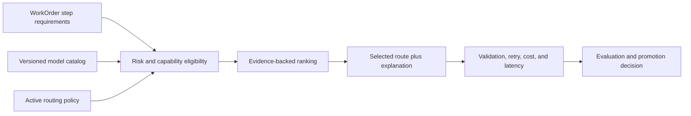

# Model Routing, Evaluations, and Capability Selection

## 1. The problem

No model is best for every factory operation. Strong models cost more and may
be slower. Fast models may lack tool use, context, reliability, or risk approval.
Provider outages and rate limits make a single route fragile. Choosing solely by
price or benchmark rank can lower total system performance.

## 2. Why the problem exists

Model capability changes rapidly and varies by task, tool, prompt, context, and
evaluation. Provider names do not describe operational fitness. A route that is
good for planning may be poor for long-running implementation or independent
review. Raw success also hides retries, human intervention, and validation cost.

## 3. Enduring Principle

### Route by required capability and governed evidence

Resolve the lowest-cost approved route that satisfies risk, complexity,
capabilities, context, tool support, availability, latency, budget, and quality
floor. Cost breaks ties only among eligible routes.

### Keep model catalog, policy, and decision separate

The catalog records provider identity, version, tier, capabilities,
availability, deprecation, risk approval, and cost estimate. Policy defines
lane pools, minimum quality, fallback, budget, canary, and kill switch. A routing
decision freezes inputs, alternatives considered, rejection reasons, selected
model, source, and policy version for one run.

### Evaluate the complete agent configuration

A model evaluation is not portable without its prompt, tools, context,
temperature, runtime, and verifier. Use representative WorkOrder cohorts and
measure criterion-level validation, retry-free completion, human acceptance,
latency, cost, policy compliance, and failure severity.

Benchmark scores are useful priors, not production promotion evidence.

### Use canaries and rollback

New routes begin with a small comparable cohort. Promotion requires minimum
sample size, stable quality, no critical policy escapes, and human approval.
Suspend on defined failure patterns and retain the prior policy for rollback.

### Preserve validator independence

Routing implementer and validator through the same model, prompt family, and
context can create correlated failure. Independence may require different
providers, methods, tools, or deterministic verification depending on risk.

### Fail closed when no eligible route exists

Fallback may relax cost or latency, but not required capability, risk approval,
or policy. “No eligible model” is an actionable blocked state, not permission to
use an arbitrary default.

## 4. Tradeoffs and alternatives

Static routing is predictable but ages quickly. Dynamic routing adapts to
availability and cost but requires trustworthy catalog data and explanations.
Learned routing may outperform rules after enough comparable outcomes; before
then, it can amplify sparse or biased data.

Multi-provider resilience improves continuity and independence while increasing
integration, privacy, and procurement burden. Not every operating lane needs
the same provider diversity.

## 5. Current Mission Control Implementation

At commit
[`b31e275`](https://github.com/jaydubya818/MissionControl/tree/b31e27564deb1c03c167e61b5ee094567c2ba7b1),
Mission Control has model catalog records, versioned routing policies, lane
pools, rules, fallback chains, per-agent and per-run overrides, canaries,
budgets, kill switch, routing decisions, and selection explanations.

The pure resolver filters deprecated, unavailable, rate-limited, unapproved,
incapable, and over-budget models. High-risk or large work requires the
POWERFUL tier. Candidate precedence includes authorized run override, matching
policy rule, lane pool, workflow tier, agent override, workspace defaults, and
safe fallback.

Context evaluations compare candidates and baselines, while the operational
guide recommends the first 25 comparable runs and seven days after activation,
canary suspension, fallback-rate rollback, and provider-diversity stops.

The implementation is not yet a complete outcome-trained router. Provider
identities and prices include generic routes, automatic canary suspension is a
roadmap item, normalized outcome feedback is incomplete, and some health and
cost signals remain proxy data.

## 6. Future Vision

Routing should use normalized validation receipts and production outcomes to
estimate quality-adjusted cost with confidence intervals. It should detect
drift, suspend canaries automatically under approved rules, model provider
capacity, and expose policy diffs and rollback. Human promotion remains
required.

## 7. Versioned references

- [Routing resolver](https://github.com/jaydubya818/MissionControl/blob/b31e27564deb1c03c167e61b5ee094567c2ba7b1/convex/lib/modelRouting.ts)
- [Routing policies](https://github.com/jaydubya818/MissionControl/blob/b31e27564deb1c03c167e61b5ee094567c2ba7b1/convex/modelRoutingPolicies.ts)
- [Routing decisions](https://github.com/jaydubya818/MissionControl/blob/b31e27564deb1c03c167e61b5ee094567c2ba7b1/convex/modelRoutingDecisions.ts)
- [Context evaluations](https://github.com/jaydubya818/MissionControl/blob/b31e27564deb1c03c167e61b5ee094567c2ba7b1/convex/context/evals.ts)
- [Operating standard](https://github.com/jaydubya818/MissionControl/blob/b31e27564deb1c03c167e61b5ee094567c2ba7b1/docs/software-factory/MODEL_ROUTING_OPERATIONS.md)

## 8. Notes and lessons learned

Model capability does not grant autonomy. Routing selects an eligible component
inside the operating system; policy, evidence, and human accountability still
govern the result.

## 9. Design review questions

1. Why should cost break ties only after quality eligibility?
2. What must a routing decision retain?
3. How do you evaluate a model route fairly?
4. When is provider diversity a safety requirement?
5. Why can same-model validation be correlated?

## 10. Whiteboard exercise

Design routing for PLAN, EXECUTE, REVIEW, LOCAL, and LONG_RUNNING lanes. Add
budget exhaustion, provider rate limit, a weak canary, high-risk work, and a kill
switch. Explain every fallback that remains forbidden.

## 11. Hands-on lab

**Prerequisite:** a read-only or disposable checkout of Mission Control main
commit `b31e275`. Use fixtures only; do not modify an active routing policy.

Construct low-, medium-, and high-risk routing inputs. Trace every candidate and
rejection reason. Simulate provider failure and budget exhaustion, then produce
a canary promotion packet from 25 hypothetical comparable receipts.

Pass only if the recommendation includes sample size, uncertainty, quality,
retry, cost, latency, and policy results. Retain the inputs, decision traces,
packet, and test output. Restore any edited fixture or discard the checkout.
