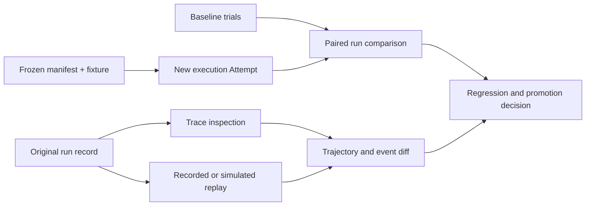

# Evaluation Engineering, Trace Replay, and Run Comparison

## 1. The problem

Agent behavior changes when the model, prompt, tools, harness, context,
environment, repository, or evaluator changes. A handful of successful demos
cannot show whether a configuration is reliable, whether a new version is
better, or whether a production failure will recur.

Evaluation must convert representative work into comparable evidence without
pretending that probabilistic execution is deterministic. Trace capture and
replay are essential for diagnosis, but rerunning “the same prompt” does not by
itself reproduce the same system.

## 2. Why the problem exists

Software agents produce both an artifact and a trajectory. The artifact may be
correct even though the agent used unauthorized tools, exceeded budget, or
relied on stale context. Conversely, a safe trajectory may end without a useful
artifact because a provider or environment failed.

Evaluation also creates a second probabilistic system: the grader. Model-based
graders can be biased by style, verbosity, model family, or access to the
candidate's explanation. Human graders can disagree. Deterministic tests can be
precise while measuring the wrong requirement. A production evaluation program
therefore needs explicit units, calibration, lineage, and uncertainty.

## 3. Enduring Principle

### Evaluate the complete governed configuration

The evaluation subject is not a model name. It is a versioned combination of:

`agent definition + model route + prompt + tools + skills + context policy + harness + environment + workflow + verifier`

Changing any behaviorally relevant component creates a new candidate. The
evaluation record should preserve the exact subject digest and distinguish it
from the repository artifact being produced.

### Use explicit evaluation records

| Record | Responsibility |
| --- | --- |
| Eval Task | One representative objective, initial state, constraints, criteria, and expected evidence |
| Fixture | Reproducible repository, data, dependency, and environment state required by a task |
| Dataset Version | Immutable membership, provenance, slices, inclusion rules, exclusions, and contamination controls |
| Trial | One execution of one candidate on one task with a unique Attempt and run record |
| Grader | A versioned deterministic, model-based, or human method that emits criterion-level findings |
| Evaluation Run | A comparable set of trials with candidate, baseline, metrics, uncertainty, failures, cost, and artifacts |
| Promotion Decision | The governed conclusion to promote, revise, reject, canary, or roll back a candidate |

An **evaluation assertion** should identify the claim, method, pass condition,
required evidence, independence, and failure severity. Aggregate scores must
not erase failed hard gates.

### Build datasets from a task taxonomy

A dataset should represent the workflow's real distribution and important
failure boundaries. Useful slices include task type, repository, language,
risk, change size, environment, tool dependency, context size, ambiguity,
failure mode, and required human intervention.

Include:

- normal cases that represent production frequency;
- boundary and adversarial cases that represent consequence;
- historical incidents and human corrections;
- negative cases in which the right result is to stop or escalate;
- recovery cases involving timeouts, unavailable tools, stale state, or
  partial effects; and
- held-out cases that were not used to tune the candidate.

Deduplicate semantically, not only by text hash. Track whether tasks or expected
answers may have appeared in model training, prompts, examples, or prior
optimization. Dataset growth should follow observed gaps rather than accumulate
unreviewed production exhaust.

### Combine graders without converting them into voters

Use deterministic graders for compilers, tests, schemas, paths, budgets,
permissions, security scanners, artifact identity, and state invariants. Use
model graders for bounded judgments such as plan completeness or explanation
quality when deterministic methods are insufficient. Use humans for meaning,
risk, unresolved disagreement, and grader calibration.

Calibrate a model grader against a human-reviewed set. Measure false positives,
false negatives, disagreement by slice, sensitivity to presentation, and
stability across repeated grading. Blind the grader to irrelevant candidate
identity and self-justification. A grader produced by the same configuration as
the candidate is not automatically independent.

### Measure success, consistency, cost, and intervention together

Useful measures include:

- criterion and task success rate;
- retry-free success;
- failure and escalation correctness;
- policy compliance and unauthorized-attempt rate;
- human correction, override, and acceptance;
- latency, tokens, compute, and total cost per accepted outcome;
- severity-weighted regression rate;
- pass-at-k when several attempts are permitted; and
- consistency-oriented probability that all required attempts succeed.

Report confidence intervals and sample size. Prefer paired comparisons in which
baseline and candidate run against the same task versions and comparable
conditions. Segment before aggregating; a gain on easy documentation tasks must
not hide a regression on high-risk migrations.

### Distinguish inspection, replay, and re-execution

**Trace inspection** reads a retained event history without causing new
effects. **Recorded replay** re-emits stored events into an inspector or test
consumer. **Simulation replay** reruns control logic against recorded or mocked
model and tool responses. **Execution replay** creates a new Attempt using a
reconstructed manifest, fixture, environment, and external dependencies.

Execution replay is a new observation, not a rewriting of the original run. It
may diverge because models, services, time, randomness, or network state differ.
The system should record those differences rather than claim exact
reproducibility.

### Compare trajectories as well as outcomes

A run comparison should identify changes in context, prompts, tools, route,
permissions, environment, tool-call sequence, retries, files touched, tests,
latency, cost, policy decisions, human intervention, artifact, and evidence.

Trajectory diffs are diagnostic. They do not imply that one sequence is better
merely because it is shorter. Tie findings to criteria: fewer tool calls may be
efficient, or may indicate skipped investigation.

### Connect offline, shadow, canary, and production evaluations

Offline evaluation is reproducible and safe but incomplete. Shadow evaluation
uses production-shaped inputs without granting authoritative effects. A canary
exposes a bounded cohort to the candidate. Production evaluation measures real
outcomes, failures, interventions, cost, and drift.

Promotion should require a defined sample, quality floors, no critical policy
regression, bounded uncertainty, rollback readiness, and human authority.
Production incidents should create new test cases only after normalization,
deduplication, privacy review, and expected-behavior approval.

## 4. Tradeoffs and alternatives

Large evaluation suites improve coverage and increase cost, latency, and
maintenance. Run fast deterministic gates on every change, representative agent
cohorts on candidate changes, and expensive adversarial or long-running suites
at risk-proportional intervals.

Golden answers simplify grading but can overconstrain valid solutions. Outcome
and invariant-based grading allows implementation diversity but requires more
careful fixtures and assertions. Live external dependencies improve realism and
reduce repeatability; recorded dependencies improve comparison and may hide
integration drift. Use both for different claims.

## 5. Current Mission Control Implementation

At study commit
[`d902fae`](https://github.com/jaydubya818/MissionControl/tree/d902fae7032c0696b531c44ae88829c652516fc6),
Mission Control has context evaluations, deterministic learning signals,
dataset and experiment records, baseline/candidate comparison, independent
Verification Subjects and Plans, verifier Attempts, criterion-linked evidence,
exact-currentness checks, and Quality Gate Decisions. Run events, traces,
artifacts, model/token/cost fields, and inspector views provide material for
trajectory analysis.

The studied evidence does not establish a single end-to-end evaluation harness
that reconstructs exact fixtures and environments, calibrates model graders,
performs trace or simulation replay, computes paired statistical comparisons,
and gates promotion across a representative production dataset. Production
catalogs also lacked qualified execution routes, so repository mechanisms are
not proof of an operating evaluation service.

## 6. Future Vision

Mission Control should compile versioned Eval Tasks and fixtures into isolated
Evaluation Runs, execute baseline and candidate cohorts, retain complete run
records, and produce criterion, trajectory, cost, and intervention comparisons.
The UI should expose slice regressions, uncertainty, grader disagreement,
missing artifacts, and the exact promotion decision required.

Replay support should begin with read-only trace inspection and deterministic
control-logic simulation. Full execution replay should be added only after
environment, dependency, model-route, tool, and context identities can be
reconstructed honestly. Promotion requires a canary and production observation
window in addition to offline results.

## 7. Versioned references

- [Model Routing, Evaluations, and Capability Selection](./02-model-routing-evaluations-and-capability-selection.md)
- [Quality and Evidence Architecture](../07-quality-engineering/01-quality-and-evidence-architecture.md)
- [Anthropic: Demystifying Evals for AI Agents](https://www.anthropic.com/engineering/demystifying-evals-for-ai-agents), accessed 2026-08-30
- [SWE-bench paper](https://arxiv.org/abs/2310.06770), version accessed 2026-08-30
- [SWE-bench repository](https://github.com/SWE-bench/SWE-bench), accessed 2026-08-30
- [NIST AI Risk Management Framework](https://airc.nist.gov/airmf-resources/airmf/), accessed 2026-08-30
- [Mission Control capability, workflow, and admission map](../09-mission-control-case-studies/03-capability-workflow-and-admission-map.md), assessed at `d902fae`

## 8. Notes and lessons learned

- Reproducible inputs improve comparison; they do not make model output
  deterministic.
- A dataset is a governed product with owners, versions, privacy, and
  maintenance—not a folder of old prompts.
- Replay is most useful when its type and limitations are named explicitly.
- The most dangerous aggregate metric is one that hides the slice where
  consequence is highest.

## 9. Design review questions

1. What is the correct evaluation subject for an engineering agent?
2. How do a trial, grader, Evaluation Run, and Verification Run differ?
3. When is a model-based grader appropriate, and how would you calibrate it?
4. Why is execution replay a new Attempt rather than a replayed truth?
5. What should block promotion even when average success improves?
6. How do offline and production evaluations complement each other?

## 10. Whiteboard exercise

Design an evaluation program for an agent that repairs repository issues. Show
task taxonomy, fixtures, dataset splits, baseline and candidate, repeated
trials, deterministic and model graders, human calibration, trajectory capture,
paired comparison, canary, rollback, and production feedback. Add one task with
a flaky external dependency and explain how it is graded.

## 11. Hands-on lab

Build a synthetic evaluation set containing ten repository tasks across three
risk slices, including two correct-escalation cases and one recovery case. Run
two agent configurations with at least two trials per task. Retain manifests,
traces, artifacts, grader versions, and cost. Perform a blind human review of a
sample and compare it with the model grader.

Required evidence: dataset manifest, fixture hashes, trial records, criterion
results, grader calibration table, trajectory diffs, confidence or uncertainty
statement, slice-level recommendation, and rollback trigger. Cleanup must
remove disposable repositories and execution environments.
