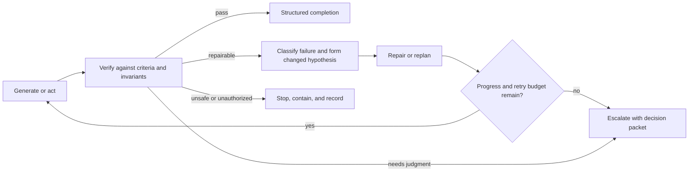

# Agent and Loop Engineering Patterns

## 1. The problem

An agent can reason, act, observe, and continue, but production work needs more
than an open-ended loop. The system must decide which tasks deserve agents,
which agent configuration is eligible, when to use one agent or several, what
happens after a failed attempt, and when continuing is wasteful or unsafe.

Without explicit patterns, multi-agent systems become role-play, retries repeat
the same mistake, validators repair the work they are supposed to judge, and
the factory optimizes activity instead of convergence.

## 2. Why the problem exists

Models are good at ambiguous interpretation and generation. Deterministic code
is better at schema validation, state transitions, policy, arithmetic, hashing,
and repeatable routing rules. Agent engineering fails when those responsibilities
are assigned according to novelty rather than fitness.

Loop failures are also difficult to recognize from one turn. The agent may
oscillate between two fixes, regenerate the same output, consume budget without
reducing uncertainty, or declare completion after a tool failure. A production
loop therefore needs state, progress measures, retry classification, and an
external stop authority.

## 3. Enduring Principle

### Use the least agentic mechanism that solves the problem

Choose among:

- a deterministic function for known transformations and policy;
- a deterministic workflow for stable ordered work;
- one agent loop for bounded ambiguous reasoning and tool use;
- a routed set of specialized agents when task classes differ materially; and
- a multi-agent workflow when independence, parallelism, context isolation, or
  distinct expertise creates measurable value.

The objective is not to maximize agent count. It is to minimize total error,
human attention, cost, and lead time while preserving authority and evidence.

### Define a task-specific agent profile

A **Task-Specific Agent Profile** records the capabilities required for a class
of work: reasoning depth, context window, tool use, structured output,
repository scale, environment, latency, cost, security, privacy, availability,
and historical evaluation. It binds an eligible model route, instructions,
skills, tools, context policy, harness capabilities, budgets, and verifier
requirements.

Profiles should reflect task roles such as classification, planning,
implementation, review, recovery, or summarization. They are eligibility
templates, not permanent assignments to one model provider.

### Route conditionally under policy

Conditional routing uses observable state to select a permitted next node:

- task type, risk, complexity, repository, and required capability;
- confidence or ambiguity calibrated on representative cases;
- tool, provider, environment, and capacity availability;
- cost, latency, retry, and attention budgets;
- prior failures and changed hypotheses; and
- required independence or human authority.

Deterministic routing should handle known rules. Model classification may
propose a route for ambiguous inputs, but the orchestrator filters it through
eligibility and records alternatives, reason, uncertainty, and fallback.

### Use named orchestration patterns

| Pattern | Use when | Principal risk |
| --- | --- | --- |
| Single agent with tools | One bounded context and authority set is sufficient | Broad context and self-confirmation |
| Router to specialist | Task classes need materially different profiles | Misclassification and hidden fallback |
| Planner then executor | Upfront decomposition reduces implementation ambiguity | Plan becomes stale or invents requirements |
| Generator then independent verifier | Output needs separate assurance | Correlated model, context, or tool failure |
| Parallel fan-out/fan-in | Independent research or candidate generation benefits from parallelism | Cost, duplication, synthesis error |
| Map-reduce | Work divides into uniform independent units | Lost global invariant |
| Supervisor-worker | Dynamic delegation is required | Supervisor becomes unbounded authority bottleneck |
| Debate or adversarial review | Competing hypotheses improve a consequential judgment | Confident argument without external evidence |
| Human escalation | Meaning, risk, authority, or unresolved ambiguity exceeds automation | Poor decision packet and approval fatigue |

Every handoff should use a typed contract containing objective, source lineage,
scope, inputs, outputs, unresolved questions, evidence, budget, and completion
state. Conversational memory is not a reliable handoff contract.

### Engineer the attempt loop explicitly

The canonical loop is **Generate → Verify → Diagnose → Repair or Replan →
Retry → Escalate or Stop**. Verification should produce structured findings
linked to criteria. Retry requires a changed hypothesis, input, tool,
configuration, or recovery action. Repeating the same conditions is not a
strategy.

### Define convergence and stop conditions

Track progress through resolved criteria, failing tests, finding count and
severity, changed uncertainty, artifact distance, policy state, and consumed
budgets. Stop or escalate when:

- the required outcome is independently verified;
- a hard gate fails;
- work requires authority the Attempt does not possess;
- the retry, token, time, tool, compute, or monetary budget is exhausted;
- consecutive iterations produce no material progress;
- the loop oscillates between prior states;
- new work expands the approved scope;
- the environment or dependency is not trustworthy;
- evidence becomes stale or contradictory; or
- a human decision is required.

An iteration limit is a final containment boundary, not the only convergence
mechanism.

### Separate retry, fallback, replan, and escalation

- **Retry** repeats a logical operation after a transient or corrected failure.
- **Repair** changes the artifact or local implementation hypothesis.
- **Replan** changes the authorized sequence while preserving approved intent
  and scope; material changes require a new Plan revision.
- **Fallback** selects a different eligible route, tool, or environment under
  policy.
- **Escalation** asks a human or higher authority to resolve a bounded decision.
- **Stop** contains unsafe, unauthorized, or non-converging work.

Each action creates new history. It must not overwrite the failed Attempt or
hide why the strategy changed.

### Preserve verifier independence inside multi-agent workflows

Different role prompts on the same model and context may produce correlated
errors. Choose independence according to consequence: separate execution,
different tools or methods, deterministic checks, blinded context, different
model families, or human review. The verifier must not silently edit the
candidate it is certifying.

## 4. Tradeoffs and alternatives

Planning reduces ambiguity and delays feedback when the problem is exploratory.
Parallel candidate generation improves search and increases cost and review
load. A supervisor simplifies coordination and can become a single point of
failure or excessive authority.

Strict iteration caps bound cost and may stop just before convergence. Adaptive
budgets can allocate more effort to high-value work and require calibrated
progress signals. Human escalation protects judgment and can become a queue
bottleneck when decision packets are poor or trivial uncertainty is escalated.

## 5. Current Mission Control Implementation

At study commit
[`d902fae`](https://github.com/jaydubya818/MissionControl/tree/d902fae7032c0696b531c44ae88829c652516fc6),
Mission Control has graph workflows, dependency validation, bounded concurrency,
versioned agent records, model routing, Attempts, retry budgets, leases,
reasoned retry, human-intervention events, separate verifier Attempts, learning
signals, and explicit terminal completion states. The factory lifecycle also
preserves plan approval and WorkOrder scope outside the agent loop.

The studied evidence does not establish a canonical library of orchestration
patterns, a production-qualified Task-Specific Agent Profile registry,
cross-pattern benchmark, general no-progress or oscillation detector, or
automated conditional-routing calibration across production workflows.
Implemented mechanisms support these patterns but do not prove them as a
complete operating system.

## 6. Future Vision

Mission Control should represent each orchestration pattern as a versioned
Workflow Contract with typed handoffs, eligible profiles, independent
verification, progress measures, failure policy, stop conditions, and evaluation
suite. Routing should select only qualified patterns and complete agent
configurations for the exact task and risk.

Operators should see the current hypothesis, progress, retries, strategy
changes, correlated-verifier risks, remaining budgets, and why the loop stopped
or escalated. Promotion requires representative evaluations of success,
consistency, cost, human attention, policy compliance, and recovery.

## 7. Versioned references

- [Runtime Orchestration and State Machines](../05-runtime-architecture/02-runtime-orchestration-and-state-machines.md)
- [Tasks, Attempts, Leases, Idempotency, and Recovery](../05-runtime-architecture/03-tasks-attempts-leases-idempotency-and-recovery.md)
- [Agent Architecture, MCP, Tools, Context, and Memory](./01-agent-architecture-mcp-tools-context-and-memory.md)
- [Anthropic: Building Effective Agents](https://www.anthropic.com/engineering/building-effective-agents), accessed 2026-08-30
- [OpenAI: A Practical Guide to Building Agents](https://openai.com/business/guides-and-resources/a-practical-guide-to-building-ai-agents/), accessed 2026-08-30
- [LangGraph documentation](https://docs.langchain.com/oss/python/langgraph/overview), accessed 2026-08-30
- [Mission Control capability, workflow, and admission map](../09-mission-control-case-studies/03-capability-workflow-and-admission-map.md), assessed at `d902fae`

## 8. Notes and lessons learned

- A retry without a changed hypothesis is usually repeated cost, not recovery.
- Multi-agent architecture is justified by measurable independence,
  parallelism, specialization, or context isolation.
- Convergence belongs to the runtime contract, not to a model's confidence.
- The best router often filters with deterministic policy before asking a model
  to rank eligible choices.

## 9. Design review questions

1. When should a deterministic workflow replace an agent?
2. What belongs in a Task-Specific Agent Profile?
3. How do retry, repair, replan, fallback, and escalation differ?
4. Which signals show that an agent loop is not converging?
5. When is a multi-agent system worth its coordination cost?
6. How would you establish verifier independence for a high-risk migration?

## 10. Whiteboard exercise

Design a workflow that classifies an issue, routes it to a specialist profile,
plans, implements, verifies, repairs twice, detects oscillation, and escalates.
Show deterministic and model decisions, typed handoffs, budgets, stop
conditions, separate Attempts, and the human decision packet.

## 11. Hands-on lab

Implement a small local Workflow Contract with a router, planner, implementer,
and independent verifier over synthetic repository tasks. Add one transient
tool failure, one repairable test failure, one scope-expansion request, and one
oscillating candidate. Compare it with a single-agent baseline.

Required evidence: profiles, route decisions, handoff schemas, manifests,
Attempt history, verification findings, changed retry hypotheses, convergence
signals, escalation packet, success/cost/attention comparison, and cleanup of
disposable repositories and processes.
