# Knowledge, Context, and Retrieval Pipeline Specification

## Quick Read

- **Purpose:** Specify the governed path from registered source to immutable,
  attributable context package.
- **Critical ordering:** Authenticate requester and apply permission and tenant
  filters before ranking or model exposure.
- **Reproducibility:** Retain exact source, transformation, index, query,
  ranking, policy, and context-package versions.
- **Revocation:** Corrections, deletion, reclassification, and compromise must
  propagate to indexes, caches, packages, evidence, and active work.

## 1. Responsibility and boundary

The knowledge pipeline registers approved sources, ingests and transforms
their content, maintains searchable representations, retrieves eligible
candidates, and compiles the smallest sufficient context for one attempt. It
does not grant tool authority, redefine business intent, or make untrusted
source instructions governing.

The knowledge owner is accountable for source, connector, transformation,
index, retrieval, and revocation contracts. Source owners retain authority for
the underlying facts. Security owns access policy; workflow owners define task
relevance; quality owns independent evaluation.

## 2. Pipeline and state

```mermaid
flowchart LR
  R["Register"] --> D["Discover"] --> X["Extract"] --> P["Parse and sanitize"]
  P --> N["Normalize and enrich"] --> S["Segment"] --> I["Embed and index"]
  I --> Q["Understand query"] --> F["Permission filter"] --> C["Generate candidates"]
  C --> K["Rerank and diversify"] --> A["Assemble context"] --> Z["Freeze package"]
  Z --> E["Evaluate outcomes"]
  U["Correct, delete, or revoke"] --> R
  U --> I
  U --> Z
```



Source states are `proposed`, `approved`, `active`, `degraded`, `suspended`,
`revoked`, `retiring`, and `deleted`. Artifact states are `processing`,
`indexed`, `stale`, `invalid`, `quarantined`, and `deleted`. Checkpoints bind
connector version, source cursor, schema, transformation, and content digest.
Reprocessing is idempotent for the same source version and pipeline version.

## 3. Reference schemas

### `SourceRegistration`

```yaml
id: source:engineering-policy
owner: role:policy-owner
authority_class: governing
connector_identity: workload://connector/policy
location: system://policy-service
classification: confidential
tenant_scope: [tenant-a]
allowed_purposes: [software-delivery]
freshness_slo: PT1H
retention_policy: retention:policy@2
correction_and_deletion: source-authoritative
state: active
```

### `KnowledgeArtifact`

```yaml
id: ka:8f73
source_id: source:engineering-policy
source_version: 31
observed_at: 2026-08-30T18:00:00Z
pipeline_version: ingest@8
content_digest: sha256:...
segment_locator: section:release-controls
semantic_ids: [concept:consequential-release]
classification: confidential
permissions_ref: acl:policy-31
lineage: [extract:90, sanitize:22, segment:15]
state: indexed
```

### Retrieval and context records

| Record | Required fields |
|---|---|
| `RetrievalRequest` | Requester and workload identity, tenant, purpose, query, task type, repositories, required authority classes, time boundary, classification ceiling, token budget, retrieval policy version |
| `RetrievalCandidate` | Artifact and source versions, candidate method, raw and normalized scores, permission decision, freshness, authority, contradiction group, exclusion reason, lineage |
| `ContextSelection` | Request, selected and excluded candidates, reranker version, diversity and contradiction decisions, token allocation, selection rationale, evaluator signals |
| `ContextPackage` | Immutable digest, attempt and manifest, instruction hierarchy, exact excerpts, citations, source and policy versions, classification, expiry, cache key, unresolved missing or conflicting facts |

## 4. Retrieval contract

1. Resolve requester, workload, tenant, purpose, and data ceiling.
2. Parse entities, exact identifiers, constraints, time, and required facts.
3. Apply source eligibility, permission, tenant, lifecycle, and freshness
   filters before content reaches ranking or generation.
4. Generate lexical, vector, graph, and metadata candidates under pinned
   index versions.
5. Fuse and rerank using a versioned strategy appropriate to the task.
6. Enforce diversity and group contradictions; do not discard governing
   counterevidence because it scores lower.
7. Compile context by authority and token allocation, preserving citations and
   why each item was included or excluded.
8. Freeze the package and bind it to the attempt.

Exact identifiers and code symbols often favor lexical search. Conceptual
questions may favor embeddings. Relationship and blast-radius questions may
need a graph. Hybrid retrieval is justified by measured improvement, not by
default complexity.

## 5. Context allocation and cache safety

Allocate separate budgets for governing contracts, task facts, repository
content, tool results, history, examples, and optional reference material.
Governing material cannot be compressed below required clauses. Summaries
retain source links and uncertainty. Cache keys include tenant, requester
authorization class, purpose, query normalization, source/index/policy
versions, compiler version, and model profile. Never share a context cache
across permission boundaries.

## 6. Poisoning, correction, deletion, and revocation

Treat external content as untrusted. Sanitize active content, distinguish data
from instructions, validate provenance and signing where available, detect
unexpected authority changes and embedding/index drift, and monitor retrieval
for abnormal source dominance. A suspected source or connector is suspended;
its artifacts and caches are quarantined; affected packages, attempts,
evidence, and releases are found through reverse lineage.

Deletion removes active copies and derived representations, emits receipts,
and preserves only policy-approved tombstones and restricted audit evidence.
Revocation blocks new selection immediately. Historical reproducibility is
balanced with privacy, legal hold, and deletion policy by storing protected
digests and minimal lineage when content cannot be retained.

## 7. Failure and recovery

| Failure | Detection | Runtime behavior | Recovery proof |
|---|---|---|---|
| Connector lag | Freshness SLO | Mark degraded; block freshness-critical tasks | Checkpoint catches up and gap scan passes |
| Schema change | Parser/contract error | Stop affected partition, preserve checkpoint | New parser version and reprocessing comparison |
| Permission mismatch | Negative authorization test | Deny candidate before ranking | ACL reconciliation and tenant isolation suite |
| Stale governing source | Authority/freshness rule | Exclude and block if required | Current source retrieved and package regenerated |
| Contradictory authorities | Contradiction group | Surface uncertainty and escalate | Named owner resolves or workflow records exception |
| Poisoning signal | Provenance, dominance, behavior anomaly | Suspend source and affected packages | Root cause, clean rebuild, red-team and regression tests |
| Index unavailable | Health/circuit state | Approved fallback or explicit unavailable state | Index restored and missed-change reconciliation |

## 8. Evaluation and operating objectives

Offline evaluation covers source completeness, permission correctness,
freshness, exact-match recall, candidate recall, ranking quality, citation
accuracy, contradiction coverage, diversity, latency, and cost. Runtime
evaluation connects packages to task completion, policy denials, corrections,
incidents, and accepted outcomes. Slice by workflow, repository, language,
persona, tenant, risk, and source class.

Define SLOs for ingestion lag, retrieval availability and latency, permission
false allow (target zero), deletion propagation, revocation propagation, and
package reproducibility. Track storage, embedding, indexing, retrieval,
reranking, and context-token cost per accepted outcome.

## 9. Versioning and compatibility

Version schemas, connectors, parsers, semantic mappings, embedding models,
indexes, rankers, context policies, and package format. Use shadow indexes and
representative comparisons for migrations. Semantic or permission changes
invalidate prior compatibility assumptions. Maintain decoders for retained
packages and explicit deprecation and revocation events.

## 10. Tradeoffs and nonclaims

Live source access maximizes freshness but increases dependency risk. Indexed
copies improve latency and evaluation but add revocation and staleness work.
Use live resolution for consequential facts and indexes for discovery where
appropriate. This review-ready specification does not claim a production
source registry, benchmarked ranker, deletion guarantee, or poisoning defense.

## 11. References and lab

- [Retrieval-Augmented Generation](https://arxiv.org/abs/2005.11401)
- [NIST AI RMF 1.0](https://nvlpubs.nist.gov/nistpubs/ai/NIST.AI.100-1.pdf), published
- [OWASP Agentic AI Threats and Mitigations](https://genai.owasp.org/resource/agentic-ai-threats-and-mitigations/), current guidance
- [Knowledge Poisoning, Revocation, and Retrieval Lab](../10-labs/12-knowledge-poisoning-revocation-and-retrieval-lab.md)

A successful lab proves permission denial before ranking, detects a poisoned
source, traces affected context packages, propagates revocation, rebuilds a
clean index, and reproduces the corrected package with retained evidence.
