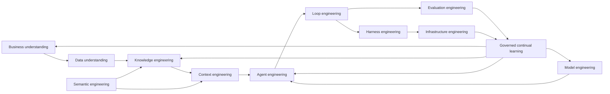

# Production AI Agent Engineering Stack

## Quick Read

- **Purpose:** Explain the twelve engineering disciplines required to turn a
  capable agent into a dependable production system.
- **Core idea:** Building the agent is one layer. Production reliability comes
  from the system that defines its problem, prepares its inputs, limits its
  actions, checks its work, survives failure, and governs improvement.
- **Durable lesson:** Models, frameworks, databases, and orchestration products
  will change. These system responsibilities remain.

## 1. Why production agents fail

A demo usually starts with a prompt, a model, and a few tools. Production starts
with a business decision, incomplete data, conflicting terminology, changing
knowledge, real permissions, costly side effects, uncertain outputs, unreliable
dependencies, and accountable owners. The distance between those two settings
is the engineering stack around the agent.

Typical failures are systemic:

- the request is underspecified before the model receives it;
- the system retrieves information that is stale, unauthorized, or irrelevant;
- the model is poorly matched to the task or risk;
- domain terms resolve to different meanings across sources;
- orchestration loses state or routes work to an ineligible capability;
- retry loops repeat the same failure without changing the conditions;
- evaluations cover happy paths but miss critical slices;
- an apparently successful run cannot be reproduced;
- provider, tool, queue, or environment failures are handled as model errors;
- feedback changes production behavior without a controlled promotion decision.

No single framework fixes these failures because no single framework owns all
of the decisions that produce them.

## 2. The twelve disciplines

| Discipline | Decision it owns | Primary outputs | Failure it prevents |
| --- | --- | --- | --- |
| Business Understanding | What decision or outcome is required, for whom, under which constraints? | Problem statement, owner, acceptance criteria, risk, non-goals, escalation path | Solving the wrong problem or optimizing a proxy |
| Data Understanding | Is the available data complete, current, authoritative, sensitive, and usable? | Data profile, quality findings, lineage, access rules, missing-data policy | Invalid inputs reaching the agent as fact |
| Knowledge Engineering | How does raw information become retrievable, attributable, and revocable knowledge? | Source registry, ingestion, normalization, chunks, indexes, citations, freshness and deletion controls | Weak retrieval, unattributed claims, stale or poisoned knowledge |
| Model Engineering | Which qualified model profile is appropriate for this task and risk? | Versioned profiles, task benchmarks, routing eligibility, cost/latency envelope, fallback | Treating one model as best for every job |
| Context Engineering | What is the smallest sufficient context for this attempt? | Context manifest, selected instructions, code, state, retrieved knowledge, token budget, digest | Omission, overload, leakage, and irreproducible prompts |
| Semantic Engineering | What do the domain terms, identifiers, relationships, and schemas mean? | Canonical vocabulary, ontology or schema mappings, entity resolution, validation rules | Acting on ambiguous strings or incompatible meanings |
| Agent Engineering | Which role, objective, skills, tools, state, and authority form an eligible agent? | Versioned agent specification, capability dependencies, permissions, budgets, handoff contract | Confusing capability with permission or identity |
| Loop Engineering | What happens after an attempt succeeds, fails, or remains uncertain? | Verification, repair, retry, stop, and escalation policy | Infinite, expensive, repetitive, or unsafe iteration |
| Evaluation Engineering | How will expected behavior be measured across representative cases? | Datasets, scenario slices, graders, trials, baselines, thresholds, regression gates | Promoting a demo based on anecdotes |
| Harness Engineering | How is execution captured, controlled, replayed, and compared? | Run record, checkpoints, event trace, tool receipts, artifacts, replay and comparison | Irreproducible behavior and unverifiable completion |
| Infrastructure Engineering | How does execution survive dependency and platform failure? | Environments, compute, queues, leases, timeouts, backoff, circuit breakers, reconciliation, recovery | Mistaking operational failure for model failure |
| Continual Learning | How does feedback become an evaluated and reversible system change? | Feedback cases, change proposal, candidate version, evaluation evidence, approval, rollout, rollback | Uncontrolled self-modification and regression |

These disciplines are not twelve independent teams. A small system may combine
roles. The responsibilities and evidence boundaries still need to remain
explicit.

## 3. How the disciplines hand off work



The arrows are contracts, not a waterfall. For example, evaluation findings may
show that context selection is weak, that a semantic mapping is wrong, or that
the underlying business success criterion is not measurable. The correction
returns to the discipline that owns the failed decision.

## 4. Design each layer as a contract

Each discipline should publish six things:

1. **Input contract:** records, versions, classifications, and freshness it
   accepts.
2. **Decision contract:** the decision it alone is authorized to make.
3. **Output contract:** the record or artifact it produces for the next layer.
4. **Evidence contract:** how another component can verify its claim.
5. **Failure contract:** detectable failure classes, retry eligibility, and
   escalation owner.
6. **Change contract:** versioning, compatibility, rollout, rollback, and
   recertification triggers.

Without these contracts, “the agent” becomes an unbounded container for policy,
retrieval, state, inference, tool use, validation, and recovery. That design is
difficult to test and almost impossible to govern.

## 5. Build sequence

### Step 1 — Define the bounded outcome

Name the user or event, business decision, material consequences, owner,
acceptance criteria, prohibited outcomes, deadline, cost ceiling, and human
authority. Keep deterministic work deterministic.

### Step 2 — Establish data and semantic readiness

Profile missingness, quality, freshness, provenance, sensitivity, access, and
retention. Normalize the concepts the workflow must distinguish. Specify how
unknown, conflicting, or missing facts are represented; do not silently replace
them with model inference.

### Step 3 — Build the knowledge and context path

Register sources, ingest safely, preserve lineage, filter permissions before
ranking, retrieve, rerank, cite, and support correction or deletion. Compile an
attempt-specific context package and retain its exact digest.

### Step 4 — Qualify models and capabilities

Benchmark candidate models on the actual task distribution. Version the chosen
model profile with decoding parameters, cost and latency envelope, tool
compatibility, safety constraints, and fallback. Bind eligible tools and skills
through explicit schemas and permissions.

### Step 5 — Define the agent and loop

Freeze the agent version, objective, context, model, tools, policy, budget, and
stop conditions for each attempt. Decide which failures are correctable, which
are infrastructure failures, and which require escalation or reduced autonomy.

### Step 6 — Build evaluations before promotion

Use representative normal, boundary, adversarial, missing-data, permission,
dependency-failure, and recovery cases. Compare a baseline with the candidate.
Measure both average performance and critical slices.

### Step 7 — Instrument the harness and infrastructure

Persist the run graph, tool calls, decisions, artifacts, evidence, time, cost,
and failure class. Prove cancellation, timeout, retry, idempotency,
reconciliation, provider fallback, and recovery from an interrupted run.

### Step 8 — Close the learning loop

Turn recurring failures and feedback into cases, not direct production edits.
Create a candidate change, rerun the relevant evaluation suite, request the
required human decision, deploy progressively, observe, and retain rollback.

## 6. The operating loop

A production run should make the following sequence observable:

```text
admit → assemble context → select qualified capability → attempt
      → observe → independently evaluate → decide
      → accept | correct | retry | reduce autonomy | escalate | fail
      → deliver → observe outcome → propose evaluated improvement
```

Every retry is a new immutable attempt. A retry must name what changed—context,
model, tool availability, code, repair instruction, or dependency state. Repeating
the same inputs and expecting a different result is not recovery engineering.

## 7. Diagnose failures by owner

| Symptom | Likely owning discipline | First question |
| --- | --- | --- |
| Correct answer to the wrong business question | Business Understanding | Was the decision and acceptance criterion explicit? |
| Confident answer from incomplete input | Data Understanding | Which required fact was missing and how was missingness represented? |
| Unsupported or stale answer | Knowledge Engineering | Which source, version, citation, and freshness rule were used? |
| High cost or weak performance on one task type | Model Engineering | Was this model profile qualified for that slice? |
| Important repository or policy detail omitted | Context Engineering | Why was this item selected out of the context manifest? |
| Two systems use the same term differently | Semantic Engineering | Which canonical concept and mapping should govern? |
| Tool action exceeded intended scope | Agent Engineering | Did the capability specification include resource and side-effect limits? |
| Repeated retries without convergence | Loop Engineering | Did feedback change the next attempt, and was no-improvement detected? |
| Candidate passed but fails in production | Evaluation Engineering | Which production slice was absent or underweighted? |
| Team cannot reproduce a failure | Harness Engineering | Is the complete attempt configuration and event trace retained? |
| Duplicate action after timeout | Infrastructure Engineering | Are idempotency and reconciliation contracts implemented? |
| Feedback creates a regression | Continual Learning | Was the change evaluated, approved, progressively released, and reversible? |

## 8. Relationship to the AI Software Factory

The stack engineers the intelligence and execution behavior used by a factory.
The factory adds the broader delivery system: organizational intent, planning,
repository and workflow records, capability supply, development environments,
independent verification, approval, CI/CD, deployment governance, production
observation, outcome confirmation, portfolio economics, and human authority.

An agent can be well engineered and still not constitute a software factory.
Likewise, a factory can use several agent architectures and model providers
without changing its core accountability model.

## 9. Design review checklist

- Is the business decision and accountable owner explicit?
- Are missing, conflicting, stale, sensitive, and unauthorized data handled?
- Can every retrieved claim be traced, corrected, and revoked?
- Are domain meanings normalized before routing or action?
- Is the model profile qualified for the exact task and risk slice?
- Is the context package minimal, attributable, versioned, and reproducible?
- Are agent identity, capability, permission, and autonomy separate concepts?
- Do loops have independent evaluation, hard stops, and escalation packets?
- Do evaluations cover boundaries, attacks, dependencies, and recovery?
- Can an exact run be replayed and compared without hidden session state?
- Are timeout, retry, idempotency, fallback, reconciliation, and recovery proven?
- Can a learning change be evaluated, approved, deployed gradually, and rolled
  back?

## 10. Boundaries and nonclaims

- The twelve disciplines are a responsibility model, not a required product
  stack or organization chart.
- More agents do not automatically improve quality. Coordination adds correlated
  failure, cost, state, and authority risk.
- Retrieval does not prove truth. It improves access to selected sources.
- Evaluation scores do not grant production authority. Policy and accountable
  decisions do.
- Observability records what happened; it does not independently certify that
  the outcome was correct.
- Continual learning is not unrestricted self-improvement. Production changes
  remain versioned, evaluated, approved, monitored, and reversible.

## 11. Related guide chapters

- [Model Routing, Evaluations, and Capability Selection](./02-model-routing-evaluations-and-capability-selection.md)
- [Data, Knowledge, Context, and Semantic Engineering](./03-data-knowledge-context-and-semantic-engineering.md)
- [Agent and Loop Engineering Patterns](./05-agent-and-loop-engineering-patterns.md)
- [Evaluation Science and Controlled Experimentation](./06-evaluation-science-and-controlled-experimentation.md)
- [Capability Learning, Optimization, and Regression Control](./07-capability-learning-optimization-and-regression-control.md)
- [Agentic Architecture Patterns and Autonomy Selection](./10-agentic-architecture-patterns-and-autonomy-selection.md)
- [Orchestration Component Model and Runtime Contracts](../05-runtime-architecture/09-orchestration-component-model-and-runtime-contracts.md)
