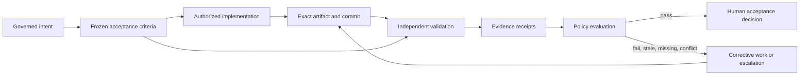

# Quality and Evidence Architecture

## Quick Read

- **Purpose:** Define how the factory proves that an exact candidate satisfies
  exact requirements under known conditions.
- **Best for:** Quality, security, platform, product, and engineering leaders.
- **Prerequisites:** [The Authoritative Delivery Hierarchy](../04-domain-model/01-authoritative-delivery-hierarchy.md).
- **Reading time:** 22 minutes.
- **You will learn:** How verification, evidence freshness, independence,
  quality gates, and human acceptance make autonomy trustworthy.

Keep three ideas: confidence is not evidence; a green check is meaningful only
when its subject and method are known; and agents must not be the sole
certifiers of their own work.

## 1. The problem

Agentic systems can produce convincing completion reports even when the work is
wrong, incomplete, stale, or outside its authorized scope. More capable models
reduce some errors but cannot remove the need to prove that a specific change
satisfies a specific requirement in a specific environment.

Traditional pipelines often report a green build without preserving the full
meaning of that result. Which acceptance criterion did the test verify? Which
commit ran? Which environment and dependency versions were used? Was the test
independent from the implementation process? Did the branch change afterward?
Was a failure waived, and by whom?

An AI Software Factory cannot base autonomy on confident language or a generic
success status. It needs a quality and evidence architecture that turns every
material completion claim into a traceable, challengeable, time-bound proof.

## 2. Why the problem exists

Software quality is multidimensional. Functional correctness, security,
performance, reliability, accessibility, architecture, data integrity, and
operability require different methods and expertise. A single test suite or
reviewer cannot establish every claim.

Evidence also ages. A passing result for one commit may be invalid after the
branch changes. A security approval may expire. A browser recording can prove
visible behavior while saying nothing about authorization enforcement. A unit
test can prove deterministic logic while missing integration failure.

Agentic execution increases the rate of change and the number of artifacts.
Without structured evidence, reviewers spend more time reconstructing work and
autonomy produces negative leverage. The factory must make proof easier to
consume than raw activity.

## 3. Enduring Principle

### Quality enables autonomy

Autonomy is safe only to the extent that the system can detect, contain, and
explain failure. Quality engineering is therefore not a final gate after agent
work. It is the control system that makes greater execution authority possible.

The factory should trust a claim only when it can connect the claim to frozen
criteria, an exact artifact, an independent method, a known verifier, and a
current result.

### Separate criteria, artifacts, receipts, and decisions

These concepts must not be collapsed:

**Acceptance criterion** states what must be true. It includes an identifier,
outcome, method, pass condition, required evidence, independence requirement,
and waiver policy.

**Artifact** is something produced or examined: source diff, commit, binary,
test output, screenshot, trace, coverage report, security finding, or deployment
record. An artifact is not automatically evidence of a criterion.

**Verification receipt** records that a known verifier applied a defined method
to an exact artifact in a defined environment and observed a result.

**Quality gate** evaluates whether the current set of receipts satisfies policy.
It does not create the underlying evidence.

**Acceptance decision** is the accountable judgment that the governed outcome
is acceptable. A passing gate can make the work eligible; it does not eliminate
the decision owner.

### Evidence envelope

A useful evidence receipt should contain:

- Mission, Plan, WorkOrder, criterion, Task, and Attempt identity;
- WorkOrder and Plan revision;
- repository, base commit, head SHA, branch, and artifact hash;
- verifier identity, role, method, command, and tool version;
- execution environment and relevant configuration digest;
- observed result and machine-readable status;
- creation time, validity window, and retention classification;
- source artifacts and stable locations;
- confidence or uncertainty when the method is probabilistic;
- waiver or exception linkage; and
- invalidation and supersession history.

The receipt should be immutable. A later result supersedes it rather than
rewriting what happened.

### Evidence states have precise meaning

**Pass** means the verifier observed the defined pass condition for the exact
artifact and context.

**Fail** means the pass condition was not met.

**Pending or unknown** means the factory lacks a conclusive result. Unknown must
never be converted to pass for convenience.

**Stale** means the result was once usable but no longer applies because its
artifact, environment, workflow, policy, or validity window changed.

**Waived** means an accountable human accepted a scoped exception with a reason,
expiry, and compensating control. Waived does not mean passed.

**Not applicable** means policy determined that a criterion does not apply to
the current scope. It should remain distinguishable from missing evidence.

### Evidence must be fresh and artifact-specific

Freshness is not only time. Evidence becomes stale when any relevant assumption
changes:

- source or head SHA changes;
- affected files or dependencies change;
- WorkOrder or Plan revision changes;
- validation method or workflow changes;
- environment or configuration changes;
- approval or receipt validity expires;
- a reopen decision invalidates the criterion; or
- a newer contradictory result appears.

Selective invalidation is preferable to discarding everything. The system must
prove which criteria are unaffected. When it cannot, it should invalidate
conservatively.

### Validation must be independent

The implementation worker cannot be the sole authority that declares its own
success. Independent validation requires:

- a separate execution identity and path;
- frozen acceptance criteria defined before the result;
- a clean or controlled validation environment;
- exact artifact identity;
- independently executed commands or checks;
- immutable receipts; and
- no permission to modify the artifact under evaluation.

Using a different model can reduce correlated reasoning error, but model
diversity alone does not establish independence. Two agents sharing the same
state, commands, and assumptions can reproduce the same mistake.

### Validators are not voters

Security, performance, correctness, and accessibility validators answer
different questions. Two passes do not outvote a security failure. When valid
receipts conflict, the conflict itself becomes evidence and governance
increases.

The factory should create a Risk Review that identifies the conflicting claims,
methods, artifacts, severity, freshness, and safe options. Random retry is not a
resolution unless a new hypothesis explains why another run is meaningful.

### Continuous validation

Validation should occur throughout the lifecycle:

1. intent validation checks that the outcome and criteria are testable;
2. plan validation checks scope, dependencies, risk, and rollback;
3. preflight checks authority and execution readiness;
4. implementation feedback runs fast local checks;
5. independent validation evaluates the completed artifact;
6. pull-request validation binds CI and review to the current head SHA;
7. release validation checks deployment readiness and rollback;
8. production validation confirms health and the expected customer outcome.

Later evidence may invalidate an earlier conclusion. The factory must support
correction without erasing history.

### Review packages convert evidence into judgment

The operator should not reconstruct work from logs. A review package should
show:

- original outcome and business reason;
- approved Plan and WorkOrder scope;
- files and systems changed;
- material decisions and deviations;
- criterion-by-criterion result with direct evidence links;
- verifier independence and artifact identity;
- failed, stale, waived, conflicting, or missing evidence;
- risk, uncertainty, reviewer focus, and rollback strategy;
- pull-request URL, branch, head SHA, CI, and merge state; and
- a recommendation with approve, reject, revise, and escalate actions.

The package summarizes. The underlying evidence remains available for audit and
deep inspection.

## 4. Tradeoffs and alternatives

Comprehensive evidence costs time, compute, storage, and reviewer attention.
Requiring every possible check for every change is wasteful. Risk-proportional
policy should select the required validators and depth.

Reusing evidence can reduce cost but creates staleness risk. Reuse is safe only
when artifact, environment, method, inputs, and policy remain equivalent and the
receipt has not expired.

Highly structured receipts improve automation and auditability but may omit
important narrative context. The solution is a stable envelope with linked raw
artifacts and concise human interpretation.

Manual validation remains necessary for some product and business judgments.
It should produce the same attributable receipt structure rather than exist as
an undocumented conversation.

Waivers prevent the factory from becoming unusably rigid. Poorly governed
waivers become a permanent bypass. They need scope, reason, owner, expiry,
compensating control, and review.

## 5. Current Mission Control Implementation

This assessment uses Mission Control commit
[`8014d5af427b43ff5c5a63cfdf82ec92742c208c`](https://github.com/jaydubya818/MissionControl/tree/8014d5af427b43ff5c5a63cfdf82ec92742c208c),
studied on 2026-08-08.

### Evidence model

Mission Plans define validation assertions with ID, outcome, verification
method, pass condition, required evidence, independence requirement, and waiver
policy. Approved Plans materialize those assertions and link them to WorkOrders.

Verification receipts bind a WorkOrder criterion to a WorkflowRun. They retain
method, command or check, result, evidence location, artifact references,
verifier, status, waiver decision, revision, validity window, and invalidation
lineage. Run artifacts can link to receipts and criteria and may include a
content hash, producer, retention policy, and sensitivity.

### Acceptance gates

Mission Control derives acceptance from the latest usable approval and receipt
for each requirement. Missing, failed, stale, expired, or revoked records block
acceptance. A waived criterion without an ApprovalDecision also blocks.

Run completion does not auto-accept a WorkOrder. WorkOrder acceptance requires
no active run, a completed latest run, satisfied approvals, current receipts,
and no failed criteria. Mission acceptance additionally requires accepted
WorkOrders, complete handoffs, and independent validator linkage where required.

### Revision and freshness

WorkOrder revisions append snapshots and identify affected criteria, approvals,
and receipts. Reopen decisions preserve lineage while invalidating impacted
evidence. Approval and verification validity windows allow records to expire.
Newer execution can make prior receipts stale.

### Pull-request evidence

GitHub ingestion records the pull-request URL, repository, branch, head SHA, CI
status, provider run, source event, and merge facts. Head-SHA changes can require
fresh evaluation. This is the correct direction: repository recency is not
evidence lineage.

### Capability assessment

| Quality capability | Status at studied commit | Interpretation |
| --- | --- | --- |
| Criterion-level validation contract | Implemented | Plans and WorkOrders define traceable criteria and methods. |
| First-class verification receipts | Implemented | Receipts link criteria, runs, artifacts, verifier, status, and validity. |
| Independent validator linkage | Implemented mechanism | Required Mission assertions need a Validator run and receipt. |
| Evidence freshness and invalidation | Implemented | Expiry, revision, reopen, and newer execution can make evidence stale. |
| Governed waivers | Implemented mechanism | Waived receipts require linked ApprovalDecisions. |
| Explicit WorkOrder and Mission acceptance | Implemented | Completion and acceptance remain distinct commands and states. |
| Run evidence drill-down | Implemented | Ordered events, artifacts, and receipt-focused inspection exist. |
| GitHub head-SHA lineage | Implemented in PR evidence paths | CI and merge information can bind to an exact head SHA. |
| Heterogeneous validator conflict Risk Review | Not verified as one canonical workflow | Failed and conflicting evidence can be retained, but a complete first-class conflict-review journey was not proven here. |
| Complete review package | Partial | Relevant data and surfaces exist; one concise end-to-end decision packet was not freshly demonstrated. |
| Production outcome validation | Partial or future depending workflow | Release-gate mechanisms exist, but business-outcome confirmation is not proven across the V1 golden path. |

Existing verification documentation reports focused tests and local lifecycle
evidence for missing, failed, waived, stale, expired, reopened, and superseded
records. This chapter did not rerun those historical demonstrations or perform
a new browser journey. It therefore treats them as versioned project evidence,
not newly observed proof.

## 6. Future Vision

Mission Control should provide one canonical evidence envelope across tests,
browser runs, security tools, performance checks, accessibility, architecture,
CI, deployment, and production telemetry. Verifiers should emit the same core
provenance fields regardless of tool.

Policy should compile each WorkOrder into a required evidence plan before
execution. The operator should be able to see why each validator is required,
what it costs, what risk it controls, and which action a failure blocks.

Validator disagreement should create a first-class Risk Review. Evidence
quality should measure completeness, independence, freshness, provenance, and
reproducibility rather than only pass rate.

Production validation should connect technical health to the original Mission
outcome. The lead-time clock stops only when the change is deployed,
independently verified, and the expected customer value is confirmed.

The architecture becomes proven when the browser golden path shows failed
validation, corrective work, fresh independent pass, exact pull-request lineage,
a complete review package, and human acceptance without direct database repair.

## 7. Versioned references

- [Mission Control North Star](https://github.com/jaydubya818/MissionControl/blob/8014d5af427b43ff5c5a63cfdf82ec92742c208c/docs/product/mission-control-north-star.md)
- [Mission Control V1 Product Strategy](https://github.com/jaydubya818/MissionControl/blob/8014d5af427b43ff5c5a63cfdf82ec92742c208c/docs/product/mission-control-v1-product-strategy.md)
- [Governed Missions Contract](https://github.com/jaydubya818/MissionControl/blob/8014d5af427b43ff5c5a63cfdf82ec92742c208c/docs/software-factory/governed-missions-contract.md)
- [Software Factory Domain Contracts](https://github.com/jaydubya818/MissionControl/blob/8014d5af427b43ff5c5a63cfdf82ec92742c208c/docs/software-factory/domain-contracts.md)
- [Verification Receipt project evidence](https://github.com/jaydubya818/MissionControl/blob/8014d5af427b43ff5c5a63cfdf82ec92742c208c/docs/software-factory/verification-receipt.md)
- [Convex evidence schema](https://github.com/jaydubya818/MissionControl/blob/8014d5af427b43ff5c5a63cfdf82ec92742c208c/convex/schema.ts)
- [WorkOrder governance evaluation](https://github.com/jaydubya818/MissionControl/blob/8014d5af427b43ff5c5a63cfdf82ec92742c208c/convex/lib/workOrderGovernance.ts)
- [WorkOrder evidence and acceptance commands](https://github.com/jaydubya818/MissionControl/blob/8014d5af427b43ff5c5a63cfdf82ec92742c208c/convex/workOrders.ts)
- [Mission acceptance evaluation](https://github.com/jaydubya818/MissionControl/blob/8014d5af427b43ff5c5a63cfdf82ec92742c208c/convex/lib/missionGovernance.ts)
- [GitHub CI evidence ingestion](https://github.com/jaydubya818/MissionControl/blob/8014d5af427b43ff5c5a63cfdf82ec92742c208c/convex/factory/githubCi.ts)
- [Execution Run Inspector](https://github.com/jaydubya818/MissionControl/blob/8014d5af427b43ff5c5a63cfdf82ec92742c208c/apps/mission-control-ui/src/controlPlane/ExecutionRunInspector.tsx)

## 8. Notes and lessons learned

My current conclusions are:

- Evidence is a product primitive, not a test log attached afterward.
- A criterion states a claim; a receipt records an observation; policy evaluates
  sufficiency; a human owns acceptance.
- Pass, stale, waived, unknown, and not applicable must remain distinct.
- Evidence belongs to an exact artifact and revision.
- Independence is established through systems and execution paths, not titles
  alone.
- Validator disagreement increases governance.
- Quality gates should fail closed while making remediation obvious.
- A review package should reduce human reconstruction work, not hide uncertainty.
- Production health and customer value are later evidence layers, not implied by
  merge.
- Strong quality systems create the conditions for greater autonomy.

## 9. Design review questions

1. Why is an artifact not automatically evidence?
2. What fields make a verification receipt trustworthy?
3. What is the difference between pass, stale, waived, and unknown?
4. Which changes should invalidate evidence?
5. How do you prove validator independence?
6. Why is a second model not sufficient by itself?
7. How should the factory handle conflicting validators?
8. When is evidence reuse safe?
9. What belongs in a review package?
10. Why should run completion not accept a WorkOrder?
11. How do waivers preserve flexibility without becoming bypasses?
12. How does quality engineering enable greater autonomy?
13. Which evidence should be required for a database migration?
14. What evidence proves validated customer value rather than deployment?

## 10. Whiteboard exercise

Draw the lineage from acceptance criterion to validation assertion, Worker
Attempt, artifact, Validator Attempt, verification receipt, quality gate,
review package, and human acceptance.

Then introduce these events:

1. the pull-request head SHA changes;
2. a security validator fails while two other validators pass;
3. an approval expires;
4. a criterion is waived;
5. the WorkOrder is reopened after a customer defect.

Show which records remain historical, which become stale, which decisions are
required, and what must be rerun.

## 11. Hands-on lab

### Objective

Build and inspect the evidence chain for one acceptance criterion through
failure, correction, fresh validation, and acceptance.

### Starting version

- Repository: `jaydubya818/MissionControl`
- Commit: `8014d5af427b43ff5c5a63cfdf82ec92742c208c`
- Study date: 2026-08-08

### Tasks

1. Select one Mission assertion requiring independent validation.
2. Trace it into the WorkOrder criterion and Validator WorkOrder.
3. Record the exact Worker commit and artifacts.
4. Produce a failed Validator receipt against that commit.
5. Verify acceptance remains blocked and the failure remains visible.
6. Create bounded corrective work and a new Worker Attempt.
7. Record the new head SHA and demonstrate why the old receipt is stale.
8. Run validation independently and produce a fresh passing receipt.
9. Inspect the review package and evidence drill-down.
10. Perform explicit human acceptance and preserve the decision record.

### Required evidence

- criterion and assertion identifiers;
- Worker and Validator Attempt identities;
- exact commits and artifact hashes;
- failed, stale, and passing receipt records;
- corrective-work lineage;
- approval or waiver records, if used;
- review-package screenshot;
- explicit acceptance event; and
- developer, CTO, and executive teach-backs.

### Cleanup

Use the controlled lab repository and private evidence storage. Remove temporary
credentials and worktrees while retaining manifests, checksums, and references.

## Mastery standard

The chapter is mastered when I can design the evidence envelope, explain every
status and invalidation rule, defend validator independence, resolve conflicting
evidence, trace Mission Control's implementation, and distinguish execution,
validation, acceptance, deployment, and customer value without notes.
