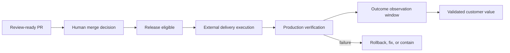

# Release, Production Feedback, and Factory SRE

## 1. The problem

A review-ready pull request is not customer value. Merge, deployment, runtime
health, rollback, and outcome confirmation remain separate claims. A factory
that stops at code generation can accelerate inventory while ignoring whether
the change works safely in production.

The factory itself is also a production system. If its queues, policies,
workers, evidence, or provider integrations fail, autonomous work can stall,
duplicate, or escape control.

## 2. Why the problem exists

Software delivery crosses multiple systems with independent state. GitHub may
merge while the deployment platform is unavailable. A deployment may be
healthy technically but fail the intended product outcome. Delayed incidents
can invalidate earlier acceptance. Factory components have their own SLOs,
capacity, cost, and recovery behavior.

## 3. Enduring Principle

### Govern deployment without requiring the factory to perform it

Mission Control may delegate execution to GitHub Actions, Argo CD, Jenkins,
Azure DevOps, or another platform. It retains the decision, policy, evidence,
approval, lineage, and reconciliation connecting the release to the governed
Mission.

### Keep release states explicit

Merge, deployed, technically verified, and outcome confirmed must have distinct
owners, timestamps, artifacts, and evidence.

### Use progressive delivery and reversible control

Risk-proportional release may use feature flags, canaries, limited cohorts,
health gates, kill switches, and automated rollback. Irreversible migrations,
security boundaries, customer data, and material business impact require human
risk acceptance even when automation executes the steps.

### Close the loop with production evidence

Observe SLOs, errors, security findings, support signals, usage, and the Mission’s
expected customer measure. A default seven-day change-failure window should be
configurable by workload. Production facts can invalidate earlier evidence and
create corrective WorkOrders.

### Operate the factory with SRE discipline

Define SLOs for dispatch availability, claim latency, lease health, event
ingestion, evidence freshness, approval latency, provider reconciliation,
orphan cleanup, and recovery. Use error budgets to decide whether to increase
autonomy or pause feature expansion.

Operator attention is also a budget. Alerts should identify a required decision,
risk, affected scope, evidence, safe actions, and what resumes afterward.

## 4. Tradeoffs and alternatives

Long observation windows increase confidence and delay final outcome accounting.
Short windows provide faster feedback and miss slow failures. Use workload
policy and distinguish preliminary from final outcome.

Automatic rollback reduces impact but can hide repeated defects or worsen data
consistency. Rollback is an engineered capability with its own evidence, not a
universal undo button.

Centralizing all deployment inside the factory creates coupling. Delegation
preserves existing delivery investments but requires strong correlation and
reconciliation.

## 5. Current Mission Control Implementation

At commit
[`b31e275`](https://github.com/jaydubya818/MissionControl/tree/b31e27564deb1c03c167e61b5ee094567c2ba7b1),
Mission Control has deployment records, release gates, approval and evidence
linkage, GitHub PR/check ingestion, alerts, health queries, run events, and a
retention policy. V1 decisions keep merge human-owned and select governed
GitHub Issues linked to exact repository and commit as the source for production
defects, incidents, and rollbacks.

These mechanisms do not prove a complete Mission-to-production golden path.
Deployment execution and customer-outcome confirmation are partial. Some
Factory Health metrics are inferred from Task, run, approval, and verifier
proxies rather than accepted WorkOrders and production outcomes. The current
golden path still ends at a review-ready PR.

Study branch `9d5f8e3` improves the real PR publication boundary, but PR #64 is
open and the browser-only proof remains incomplete. PR #61 proves one real
GitHub App PR with passing CI, not deployment or customer value.

## 6. Future Vision

Mission Control should reconcile deployment-provider events into an explicit
Release record, attach production verification receipts, monitor the configured
failure window, and confirm the expected customer outcome. Failures should
create governed corrective work without silently editing the original Mission.

A Factory SRE view should show SLOs, error budgets, queue age, stale leases,
evidence freshness, provider degradation, orphan resources, attention load, and
autonomy reductions driven by reliability.

## 7. Versioned references

- [Deployments](https://github.com/jaydubya818/MissionControl/blob/b31e27564deb1c03c167e61b5ee094567c2ba7b1/convex/governance/deployments.ts)
- [Release gate automation](https://github.com/jaydubya818/MissionControl/blob/b31e27564deb1c03c167e61b5ee094567c2ba7b1/convex/governance/releaseGateAutomation.ts)
- [Factory health](https://github.com/jaydubya818/MissionControl/blob/b31e27564deb1c03c167e61b5ee094567c2ba7b1/convex/factory/health.ts)
- [Evidence retention and production outcome policy](https://github.com/jaydubya818/MissionControl/blob/b31e27564deb1c03c167e61b5ee094567c2ba7b1/docs/security/evidence-retention-policy.md)
- [V1 decisions](https://github.com/jaydubya818/MissionControl/blob/b31e27564deb1c03c167e61b5ee094567c2ba7b1/docs/decisions/ai-software-factory-v1-decisions.md)

## 8. Notes and lessons learned

“Factory manages the entire lifecycle” must remain an architectural definition,
not a claim that Mission Control currently automates every stage. Today’s proven
boundary and tomorrow’s operating model must be spoken in different tenses.

## 9. Design review questions

1. Why is merge not customer value?
2. How can the factory govern an external deployment platform?
3. Which production decisions must remain human?
4. What SLOs should the factory itself have?
5. When can production evidence invalidate acceptance?

## 10. Whiteboard exercise

Draw PR through outcome confirmation using an external CI/CD system. Add a stale
head SHA, failed canary, irreversible migration, delayed incident, provider
webhook replay, and rollback. Name each authoritative record and owner.

## 11. Hands-on lab

**Prerequisite:** a read-only checkout of Mission Control main commit
`b31e275` and the controlled laboratory scenario. Do not deploy software or
modify production state.

Trace the deployment and release-gate records. Design a
production-verification receipt and a seven-day observation workflow for the
laboratory change. Identify which events come from GitHub, delivery,
observability, product analytics, and a human outcome owner.

The lab passes only if it distinguishes PR, merge, deployment, technical
verification, change failure, and validated customer value. Retain the record
map, receipt schema, observation policy, and teach-back. Cleanup consists only
of removing disposable local notes; no runtime state should have changed.
