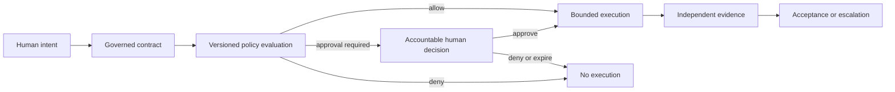
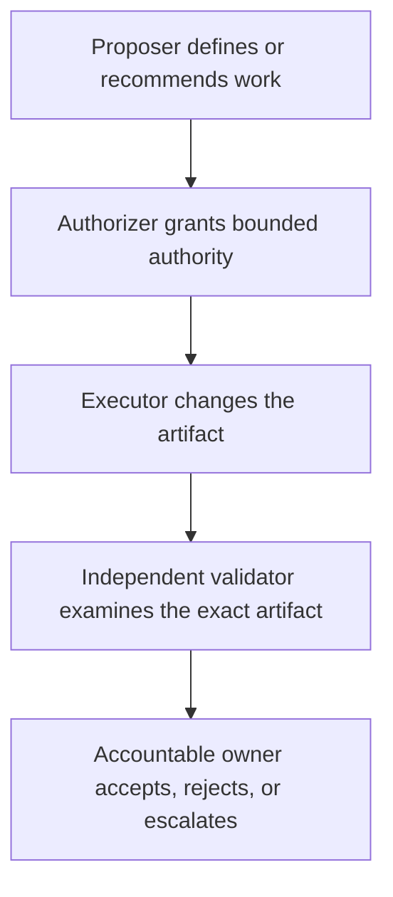
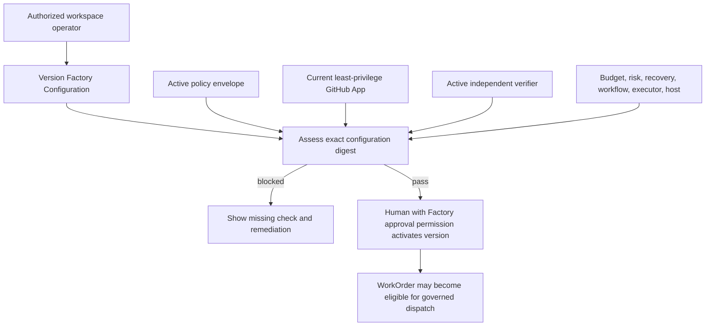

# Governance, Policy, and Risk-Proportional Approval

## 1. The problem

An autonomous agent can possess the technical capability to modify a repository,
call an API, or trigger a delivery system without possessing the organizational
authority to do so. That distinction is the beginning of governance.

Conventional delivery systems often hide authority inside repository settings,
CI configuration, cloud roles, informal reviewer norms, and the judgment of the
engineer operating the tools. An AI Software Factory makes this ambiguity
dangerous. Agents operate faster, can continue unattended, and can combine tools
in ways that exceed the intent of any single permission grant. A credential that
allows a push says nothing about whether this WorkOrder may push this change at
this time.

The factory therefore needs to answer five questions before material execution:

1. Who owns the decision?
2. What action is being authorized?
3. Which policy governs it?
4. What evidence makes it eligible?
5. What happens when policy, evidence, or validators disagree?

Without durable answers, approval becomes either a bottleneck or theater. Too
many gates train people to click through. Too few gates silently transfer risk
ownership to software that cannot accept accountability.

## 2. Why the problem exists

### Technical permission is not business authority

Identity systems answer whether a principal can invoke a capability. Governance
answers whether that principal should invoke it for this governed purpose.
Those questions overlap but are not interchangeable.

A GitHub App may have permission to write repository contents. A policy may
still prohibit a WorkOrder from changing authentication code, exceeding a cost
budget, modifying files outside its path scope, or creating a pull request
without independent validation. The permission enables an action. The policy
bounds when the action is legitimate.

### Risk is contextual

The same operation can carry radically different consequences. Updating a
sentence in internal documentation and changing an authorization rule may both
produce a pull request, but they do not deserve the same controls. Risk depends
on impact, reversibility, data sensitivity, customer exposure, blast radius,
uncertainty, and the quality of available detection and recovery.

This is why a static rule such as “all agent changes require approval” is not a
governance model. It is a queue. A useful system spends human attention where
judgment changes the outcome.

### Organizations distribute accountability

Business owners accept the value proposition of a Mission. Engineering leads
accept implementation boundaries. Security and compliance owners accept
exceptions in their domains. Release approvers accept production risk. These
decisions cannot be collapsed into a single generic approval without losing
their meaning.

Small companies may assign several roles to one person. The decision types must
remain distinct even when the names on the records are the same.

### Probabilistic execution creates correlated confidence

Implementation agents and validators can share models, context, tools, or
assumptions. Multiple confident outputs are not necessarily independent. When
validators disagree, majority voting can suppress the one signal that matters
most. A security failure is not outvoted by two formatting passes.

### Policies evolve while work is in flight

If a policy can change after authorization without preserving the evaluated
version, nobody can later explain why execution was allowed. Governance requires
versioned policy, deterministic evaluation inputs, durable decision records, and
clear rules for re-evaluation when relevant facts change.

## 3. Enduring Principle

### Humans own accountability; policy bounds execution

Humans define intent, acceptable risk, and the rules under which agents may act.
Agents may propose decisions, gather evidence, execute authorized work, and
recommend an outcome. They do not become the owner of business, legal,
security, or operational risk.

The governing chain is:

Policy is executable organizational intent. Approval is a durable decision
required by policy. Neither replaces the other.

### Keep the authority concepts separate

**Capability** is what a system or agent is technically able to do.

**Permission** is what an identity is allowed to invoke at a resource boundary.

**Policy** is the contextual rule that determines whether an action is allowed,
denied, or requires a decision.

**Authorization** is the resolved grant to perform a bounded action under a
specific contract and policy version.

**Approval** is an accountable decision that satisfies a named gate. It is not
general permission for future work.

**Acceptance** is the judgment that an outcome satisfies its governed contract.
It occurs after evidence exists and is distinct from approval to begin work.

**Exception** is a time-bound, scoped departure from policy accepted by the
appropriate risk owner. It is not a permanent policy edit or a precedent.

Confusing these terms creates hidden authority. For example, approving a Plan
does not accept a WorkOrder result, and possessing repository write permission
does not authorize an agent to use it outside the WorkOrder.

### Resolve authority before execution

Every material action should trace to an authorization envelope that freezes:

- the Mission, approved Plan version, WorkOrder, and responsible owner;
- actor and execution identity;
- repository, environment, resource, and path scope;
- permitted tools and operations;
- risk classification and applicable policy version;
- required approvals and their validity periods;
- budget, runtime, retry, and concurrency limits;
- validation and evidence requirements;
- recovery, cancellation, and escalation rules; and
- the exact facts used in the policy decision.

If the factory cannot compute this envelope, the safe answer is not “best
effort.” Material execution should stop with a specific remediation.

### Risk determines the control depth

A practical first model uses three bands:

| Risk band | Typical characteristics | Default governance |
| --- | --- | --- |
| Green | Bounded, reversible, low exposure, strong automated detection | Policy may allow implementation and PR preparation without an action-by-action human gate |
| Yellow | Business logic, shared APIs, authentication-adjacent work, migrations with safe rollback, meaningful customer impact | Human Plan approval, bounded execution, independent validation, and human merge or release decision |
| Red | Destructive, financial, security-sensitive, privacy, regulatory, irreversible data, or broad architectural change | Restricted execution, additional domain review, explicit risk owner, stronger evidence, and multi-party approval where appropriate |

The label should be policy-derived and explainable. A useful classifier considers:

`risk = impact × likelihood × exposure × irreversibility × uncertainty`

Detection strength and recovery quality reduce residual risk; they do not erase
the underlying hazard. The system should retain the factors, not only the color.

### Decision rights must be explicit

The following matrix is a defensible starting point. Organizations can change
the titles, but they must preserve accountable ownership.

| Decision | Accountable owner |
| --- | --- |
| Business Mission authorization | Product or Business Owner |
| Plan approval | Mission owner with required technical reviewers |
| WorkOrder execution authorization | Engineering Lead or policy-designated authority |
| WorkOrder acceptance | Engineering Lead |
| Architecture exception | Principal Engineer or Architecture Owner |
| Security exception | Security Owner |
| Compliance exception | Compliance Owner |
| Production deployment | Designated human Release Approver when material risk requires it |
| Risk exception | Named Risk Owner |
| Prompt, policy, evaluation, or autonomy promotion | Factory Governance Board or delegated human authority |

The factory should govern deployment but need not perform it. GitHub Actions,
Jenkins, Argo CD, Spinnaker, Azure DevOps, or another delivery system may
execute the release. The factory owns the policy decision, evidence contract,
approval state, and lineage connecting the decision to the external execution.

### Separate proposal, execution, validation, approval, and acceptance

Separation of duties reduces correlated error and prevents self-authorization.
A robust flow distinguishes five responsibilities:

One person may hold several roles in a small company, but implementation and
validation must remain technically distinct. Validation should run through a
separate identity and execution path, use predefined criteria, generate its own
evidence, and lack permission to modify the artifact under evaluation.

### Escalate disagreement; do not vote it away

Validator disagreement increases governance. It never decreases it.

When credible validators conflict, the factory should create a Risk Review that
contains the competing claims, methods, artifact identities, severity,
freshness, independence, likely causes, and safe options. The next action may be
targeted revalidation, corrective work, a domain-owner decision, or rejection.
An unexplained retry is not resolution.

### Review evidence, not agent activity

Approval fatigue appears when reviewers repeatedly receive low-information
requests. The remedy is not merely fewer approvals; it is higher-quality
decisions and better policy.

An evidence-centered review should show:

- the decision required and its accountable owner;
- the business intent and approved scope;
- why policy raised the gate;
- the exact artifact, commit, environment, and proposed action;
- criterion-level evidence, failures, conflicts, staleness, and waivers;
- material deviations and surprises;
- residual risk and rollback strategy;
- a recommendation and its uncertainty; and
- what resumes automatically after the decision.

Routine work that remains inside policy should proceed without repeatedly
asking a human to reaffirm the same boundary. Escalate surprises: new risk,
missing authority, conflicting evidence, exhausted recovery, or policy breach.

### Exceptions are governed objects

An exception must identify the rule being bypassed, scope, owner, reason,
expiry, affected artifact, compensating controls, and review requirement. It
must be auditable and revocable. Expiry should return the system to the normal
rule automatically.

Changing a label from “confidential” to “public,” marking a failed test as
passed, or broadening an authorization envelope is not an exception mechanism.
It is evidence or policy tampering.

### Trust determines eligibility, never authority by itself

Operational autonomy and trust calibration are developed in
[Operational Autonomy and Trust Calibration](../02-first-principles/01-operational-autonomy-and-trust-calibration.md).
The critical governance rule is that Trust Score is a ceiling. It may reduce
the maximum autonomy a factory can request, but it cannot override policy,
create permission, or approve a decision.

The internal score may use 0–100 for trend computation while operators see
stable bands:

| Band | Score | Governance meaning |
| --- | ---: | --- |
| Very Low | 0–39 | Quarantined or advisory-only |
| Low | 40–59 | Human review for every material action |
| Moderate | 60–79 | Eligible for limited supervised autonomy |
| High | 80–94 | Eligible for governed autonomy within policy |
| Trusted | 95–100 | Eligible for the highest authority current policy permits |

Promotion requires sustained evidence and an explicit human decision. A
defensible Level 2 to Level 3 default is at least 100 successful WorkOrders,
30 days of stable operation, at least 99 percent independent-validation
success, zero critical security or policy violations, zero unauthorized
actions, and human promotion approval.

Demotion can be automatic. Security or policy violations, unauthorized action,
evidence tampering, fabricated results, high-risk validation failure,
customer-impacting regression, repeated boundary violations, or suspected tool
compromise should immediately lower authority or quarantine execution pending
review. Older failures may lose scoring weight in a rolling window, but they
never disappear from audit history.

### Govern learning as a change to the factory

The factory may automatically collect outcomes, failures, metrics, and proposed
improvements. Changes to prompts, policies, workflows, evaluation criteria,
model routing, or authority alter system behavior and therefore require explicit
human review and promotion. Continuous observation is compatible with governed
learning. Unreviewed self-modification is not.

## 4. Tradeoffs and alternatives

### Central policy versus local autonomy

Central policy improves consistency and auditability but can ignore repository
context. Local policy improves relevance but can fragment controls. A layered
model can resolve organization, workspace, repository, Factory version,
Mission, and WorkOrder rules with explicit precedence. More-specific policy
should not silently weaken a higher-level prohibition.

### Fail closed versus operational continuity

Failing closed protects authority boundaries but can halt delivery when policy
infrastructure is unavailable. Failing open preserves throughput but converts a
governance outage into unauthorized execution. For irreversible, external,
security-sensitive, or customer-impacting actions, the factory should fail
closed. Low-risk advisory behavior can degrade safely if policy explicitly
allows that mode.

### Human gates versus automated policy

Human review brings context and accountability but is slow, inconsistent, and
scarce. Automated policy is fast and repeatable but only as good as its inputs
and rules. The useful boundary is not human versus automation. It is automated
eligibility followed by human judgment only where policy identifies material
risk or uncertainty.

### Dual control versus small-team practicality

Two-person approval reduces unilateral risk for red actions. It may be
impossible in a very small company. If roles must combine, the organization
should narrow allowed actions, strengthen independent technical validation,
retain immutable evidence, and require later review. Combining people does not
justify combining records or allowing an executor to certify itself.

### Numeric risk and trust versus explainable bands

Numeric values support computation, thresholds, and trends. They invite false
precision when shown as authoritative judgments. Operators should see bands,
drivers, recent changes, and the maximum authority policy permits. A score
without reasons is not actionable governance.

### Approval sampling

Sampling routine green work can detect drift while avoiding approval fatigue.
Sampling is appropriate only after policy has established bounded scope,
complete evidence, and a safe rollback path. It must not replace mandatory
approval for material risk.

## 5. Current Mission Control Implementation

This assessment uses Mission Control commit
[`8014d5af427b43ff5c5a63cfdf82ec92742c208c`](https://github.com/jaydubya818/MissionControl/tree/8014d5af427b43ff5c5a63cfdf82ec92742c208c),
studied on 2026-08-08. Browser observations came from a dirty worktree at this
HEAD and are therefore retained as run evidence, not reproducible proof of the
commit alone.

### What is implemented

Mission Control has concrete governance primitives:

- workspace permissions protect Factory viewing, automation management, and
  activation;
- roles and scoped role assignments provide tenant, project, and environment
  authorization structure;
- policy envelopes can be version-, project-, or tenant-scoped, prioritized,
  activated, and evaluated for a tool and Green, Yellow, or Red risk;
- policy decisions use `ALLOW`, `DENY`, or `NEEDS_APPROVAL`;
- approval records preserve action type, risk, rollback, justification,
  escalation, status, and decision metadata;
- the active approval path auto-approves low or Green actions, expires pending
  requests, and requires two distinct approvers for Red actions;
- a Factory Configuration version freezes repository, workflow, executor,
  policy envelope, environment, budget, verifier set, risk boundary, recovery
  controls, and a configuration digest;
- Factory readiness checks require an active Governance Policy, bounded budget,
  independent verifier, clean host binding, recovery controls, active workflow,
  approved executor, repository readiness, and a current least-privilege GitHub
  App connection; and
- Factory activation requires a current passing assessment for the exact
  configuration digest and an actor with Factory approval permission.

These mechanisms support the principle that policy and readiness precede
execution. The configuration digest is particularly important: it binds the
activation decision to one immutable set of operational boundaries.

### What is partial or fragmented

The current implementation should not yet be described as a complete governance
system.

The general policy-envelope evaluation query returns an `ALLOW` fallback when
no applicable envelope produces a decision. That behavior is weaker than the
North Star doctrine that missing authority should fail closed. The Factory
readiness path independently blocks activation when an active policy is absent,
but the stronger default has not been proven across every tool and execution
boundary.

Approval data exists in both the operational approvals path and a newer
approval-record model. The relationship is partially mirrored rather than
demonstrated as one fully consolidated lifecycle. The operational path records
deciders and implements distinct Red approvers, but the reviewed code does not
prove that every material decision is restricted to a human identity.

Roles, permissions, policy envelopes, approval records, readiness checks, and
evidence gates exist, but the complete decision-rights matrix described in this
chapter is not yet one canonical, enforced model. Validator disagreement does
not yet have a verified first-class Risk Review workflow.

Operational Autonomy Levels, the numeric Trust Score, trust bands, automatic
demotion and quarantine, sustained-evidence promotion, and a Factory Governance
Board workflow remain doctrine or future design. They must not be presented as
current Mission Control capability.

### Why the golden-path run stopped without a Governance Policy

The retained
[Golden Path 01 execution assessment](../10-labs/evidence/2026-08-08-golden-path/README.md)
proved Mission creation, versioned Plan approval, WorkOrder release, and the
requirement for a separate Validator WorkOrder. It stopped before Task or
Attempt creation.

The Factory Configuration form had workflows but no Governance Policy available
for selection. As a result, Mission Control could not create and activate the
immutable Factory boundary that combines workflow, executor, policy, budget,
verifiers, risk boundary, and recovery controls. Dispatch remained unavailable.

This was not a cosmetic configuration omission. Without an active policy
version, the control plane cannot establish which actions the executor may take
or which approvals and evidence are required. Proceeding would have turned
technical capability into accidental authority.

The run had two additional independent blockers. The Mission Control GitHub App
was not configured or installed for the laboratory repository, so the system
could not prove least-privilege repository authority, token issuance, branch and
pull-request writes, or exact GitHub lineage. Mission Control todo 024—the real
Codex-to-GitHub pull-request golden path—also remained incomplete. Its durable
worker, leased Attempt, isolated worktree, bounded execution, path scope,
idempotent PR creation, lineage, restart reconciliation, and browser proof must
be completed before the lab is rerun.

The correct sequence is therefore:

1. complete and verify Mission Control todo 024;
2. configure and install the least-privilege GitHub App for the controlled lab
   repository;
3. create an active Governance Policy;
4. create, assess, and activate the exact Factory Configuration version;
5. rerun the unchanged golden-path acceptance contract from a clean, pinned
   Mission Control commit and target-repository baseline.

Documentation can continue while those implementation prerequisites are being
completed. The lab result must remain partial until the runtime evidence exists.

### Current authority flow

Passing readiness establishes configuration eligibility. It does not prove that
todo 024's execution path can yet complete a real pull request.

## 6. Future Vision

Mission Control should converge on one explainable policy decision service and
one authoritative approval lifecycle. Each decision should retain the policy
version, normalized inputs, matched rules, precedence trace, result, reason,
required approver roles, expiry, and invalidation events.

Material actions should fail closed when no applicable policy exists. The UI
should explain the missing rule and identify the smallest safe remediation.
Advisory-only behavior may use an explicit degraded policy; it should never
inherit permission from an implementation fallback.

A first-class Risk Review should reconcile validator disagreement. It should
prevent completion, preserve all conflicting evidence, route the issue to the
correct domain owner, and resume only after a durable decision or new evidence.

Trust calibration should be computed from versioned outcome data and exposed as
bands with drivers, not a mysterious score. Demotion and quarantine may occur
automatically after defined trust-loss events. Promotion must require sustained
evidence and an explicit human decision. Policy must always remain the upper
bound.

The operator experience should center on decision packets rather than approval
queues. Routine compliant execution should remain quiet. Exceptions, stale or
conflicting evidence, new risk, policy changes, and irreversible actions should
receive focused attention.

These capabilities should move from vision to current implementation only when
they have one authoritative state model, enforced authorization, immutable
audit, deterministic tests, restart-safe behavior, and browser evidence from a
clean pinned commit.

## 7. Versioned references

Mission Control commit studied:
[`8014d5af427b43ff5c5a63cfdf82ec92742c208c`](https://github.com/jaydubya818/MissionControl/tree/8014d5af427b43ff5c5a63cfdf82ec92742c208c).
Accessed 2026-08-08.

Product doctrine:

- [Mission Control North Star](https://github.com/jaydubya818/MissionControl/blob/8014d5af427b43ff5c5a63cfdf82ec92742c208c/docs/product/mission-control-north-star.md)
- [Mission Control V1 Product Strategy](https://github.com/jaydubya818/MissionControl/blob/8014d5af427b43ff5c5a63cfdf82ec92742c208c/docs/product/mission-control-v1-product-strategy.md)

Implementation paths:

- [Factory Configuration and readiness](https://github.com/jaydubya818/MissionControl/blob/8014d5af427b43ff5c5a63cfdf82ec92742c208c/convex/factory/configuration.ts)
- [Policy envelopes](https://github.com/jaydubya818/MissionControl/blob/8014d5af427b43ff5c5a63cfdf82ec92742c208c/convex/governance/policyEnvelopes.ts)
- [Policy evaluation](https://github.com/jaydubya818/MissionControl/blob/8014d5af427b43ff5c5a63cfdf82ec92742c208c/convex/lib/armPolicy.ts)
- [Approval records](https://github.com/jaydubya818/MissionControl/blob/8014d5af427b43ff5c5a63cfdf82ec92742c208c/convex/governance/approvalRecords.ts)
- [Operational approvals](https://github.com/jaydubya818/MissionControl/blob/8014d5af427b43ff5c5a63cfdf82ec92742c208c/convex/approvals.ts)
- [Permissions](https://github.com/jaydubya818/MissionControl/blob/8014d5af427b43ff5c5a63cfdf82ec92742c208c/convex/governance/permissions.ts)
- [Roles](https://github.com/jaydubya818/MissionControl/blob/8014d5af427b43ff5c5a63cfdf82ec92742c208c/convex/governance/roles.ts)
- [Role assignments](https://github.com/jaydubya818/MissionControl/blob/8014d5af427b43ff5c5a63cfdf82ec92742c208c/convex/governance/roleAssignments.ts)
- [GitHub App readiness](https://github.com/jaydubya818/MissionControl/blob/8014d5af427b43ff5c5a63cfdf82ec92742c208c/convex/lib/githubAppReadiness.ts)
- [GitHub App connection lifecycle](https://github.com/jaydubya818/MissionControl/blob/8014d5af427b43ff5c5a63cfdf82ec92742c208c/convex/githubAppConnections.ts)
- [Approval operator UI](https://github.com/jaydubya818/MissionControl/blob/8014d5af427b43ff5c5a63cfdf82ec92742c208c/apps/mission-control-ui/src/ApprovalsModal.tsx)

Browser evidence:

- [Golden Path 01 execution assessment](../10-labs/evidence/2026-08-08-golden-path/README.md)
- [Golden Path 01 manifest](../10-labs/evidence/2026-08-08-golden-path/manifest.yaml)

## 8. Notes and lessons learned

The most important lesson is that governance is not an approval screen. It is
the architecture that turns organizational intent into bounded machine
authority.

The failed golden-path run made this concrete. A Plan and WorkOrders existed,
but execution correctly remained unavailable because the operational boundary
was incomplete. The missing policy was a missing answer to “under what rules may
this executor act?” The missing GitHub App was a missing answer to “with which
identity and least-privilege authority may it cross the repository boundary?”

The Mission Control implementation also demonstrates why evidence-backed
writing matters. Policy envelopes, approvals, Factory readiness, and scoped
roles are real. A universal fail-closed policy service, canonical decision
rights, Risk Review, Trust Score, and automatic quarantine are not yet proven.
The architecture can be respected without converting its roadmap into a
current-capability claim.

Questions to revisit after todo 024 and the next lab run:

- Does every executor and tool call use the same policy decision path?
- Can an agent identity satisfy any material human approval?
- What is the precedence rule when tenant, workspace, Factory, and WorkOrder
  policies disagree?
- Which changes invalidate an existing approval?
- Can late or duplicate events reopen authority after expiry or cancellation?
- Is the policy decision trace understandable to an operator without reading
  source code?

## 9. Design review questions

1. What is the difference between permission, policy, authorization, approval,
   acceptance, and exception?
2. Why should an AI Software Factory govern deployment even when an external
   CI/CD system performs it?
3. How would you design policy precedence across company, workspace,
   repository, Factory version, Mission, and WorkOrder scopes?
4. When should a system fail closed, and when is degraded advisory operation
   acceptable?
5. How do risk-proportional gates reduce approval fatigue without weakening
   accountability?
6. Why is validator majority voting unsafe?
7. How can one person in a startup hold multiple roles while preserving
   independent validation?
8. What evidence should be retained with a policy decision?
9. Why must Trust Score remain subordinate to policy?
10. Which events should cause immediate autonomy demotion or quarantine?
11. How would you explain Mission Control's current policy fallback to a CTO
    without overstating either the defect or the product capability?
12. Why did the golden-path run stop after Plan approval, and why was stopping
    the correct outcome?

### Teach-back prompts

**Developer:** Explain how a WorkOrder becomes authorized without treating a
GitHub permission as sufficient authority.

**CTO:** Defend the cost of policy evaluation, independent validation, and
risk-proportional approval in terms of speed, quality, and organizational risk.

**CEO or board:** Explain why “trust the system, not the model” permits useful
autonomy without claiming that AI is reliable by itself.

## 10. Whiteboard exercise

Without notes, draw a governed path from Mission creation through an externally
executed deployment. Include:

- business, engineering, security, and release decision owners;
- identity, permission, policy, authorization, approval, and acceptance;
- Green, Yellow, and Red paths;
- a versioned Factory Configuration and policy decision trace;
- implementation and independent validation separation;
- conflicting validator evidence and Risk Review;
- exception scope and expiry;
- Trust Score as an autonomy ceiling;
- automatic demotion and human promotion; and
- the external CI/CD boundary.

Then explain three failures: no applicable policy, expired approval, and a
security validator disagreeing with two passing validators. The diagram passes
only if none of those conditions can silently become authorization.

## 11. Hands-on lab

### Policy decision and readiness trace

**Objective:** Explain why a real WorkOrder is or is not eligible for dispatch
without relying on an agent's summary.

**Prerequisites:** Read-only access to Mission Control and the retained Golden
Path 01 evidence. Do not rerun the golden path until todo 024, the GitHub App,
and the active Governance Policy and Factory Configuration are complete.

**Starting version:** Mission Control commit
`8014d5af427b43ff5c5a63cfdf82ec92742c208c`. Record a newer clean commit if the
implementation prerequisites are completed before the exercise.

**Exercise:**

1. Trace Factory Configuration creation, readiness assessment, and activation
   from UI action to Convex mutation and persistent record.
2. Identify the permission required to manage automation and the permission
   required to activate a Factory version.
3. Create a table of every readiness check, its authoritative source, expiry,
   and remediation.
4. Trace a Green, Yellow, and Red approval request. Record auto-approval,
   expiry, denial, escalation, and Red dual-control behavior.
5. Demonstrate what the generic policy evaluator returns when no envelope
   matches. Contrast it with Factory readiness when no active policy is
   selected.
6. Design one validator disagreement case and the Risk Review record Mission
   Control would need, clearly labeling it as future design.
7. Produce a decision packet for the blocked Golden Path 01 implementation
   WorkOrder. Recommend stop, list the independent blockers, and state exactly
   what evidence would permit reconsideration.

**Required evidence:** Exact commit, code paths and relevant symbols, Factory
Configuration digest or absence, policy-envelope identity or absence, GitHub
readiness result, approval records examined, screenshots of the operator
decision state, and a five-minute teach-back for a developer and CTO.

**Failure condition:** The lab fails if missing policy is described only as a UI
problem, if repository permission is treated as WorkOrder authority, if an
agent's completion statement is accepted as evidence, or if future Trust Score
behavior is presented as implemented.

**Cleanup:** This is read-only until the implementation prerequisites are met.
If a later run creates disposable policies or approval requests, archive or
expire them through supported product actions and retain the audit history. Do
not delete authoritative records to make the environment appear clean.
