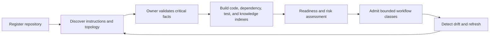

# Repository Onboarding and Codebase Intelligence

## Quick Read

- **Purpose:** Establish the evidence required before an autonomous workflow may operate on a repository.
- **Best for:** Platform teams, repository owners, security engineers, and agent engineers.
- **Prerequisites:** [Authoritative Delivery Hierarchy](../04-domain-model/01-authoritative-delivery-hierarchy.md) and [Development Environments](../05-runtime-architecture/07-development-environments-compute-and-composable-infrastructure.md).
- **Reading time:** 15 minutes.
- **You will learn:** How to discover repository structure, ownership, instructions, dependencies, tests, data sensitivity, environments, and risk before admission.
- **Keep three ideas:** registration is not readiness; indexes are derived and expiring; and uncertainty must narrow authority.

## 1. The problem

An agent can clone a repository and still lack the information needed to change it safely. It may not know the authoritative build command, code owners, generated files, service dependencies, migration rules, test data boundaries, deployment path, or local instructions. Repository discovery performed independently during every run is slow and inconsistent. Stale discovery is worse: it creates confidence from facts that no longer match the target commit.

## 2. Why the problem exists

Repository knowledge is scattered across source, configuration, documentation, CI, deployment systems, package registries, ownership systems, and human memory. Monorepos contain several products with different rules. Multi-repository systems hide contracts and release order outside any single checkout. Some facts are safe to infer; others require an accountable owner.

## 3. Enduring Principle

### Admit repositories through a readiness process

Onboarding creates a versioned **Repository Readiness Record** rather than a permanent “connected” flag. The record covers:

| Dimension | Required understanding |
|---|---|
| Identity and ownership | Canonical repository, default branch, accountable owner, code owners, support contacts |
| Instructions | Governing repository instructions, precedence, exceptions, generated-code rules |
| Architecture | Components, boundaries, entry points, data flows, external services, critical invariants |
| Dependencies | Packages, services, schemas, repositories, runtime and release order |
| Build and test | Toolchains, setup, commands, test topology, fixtures, flaky suites, expected duration |
| Delivery | CI, artifacts, environments, deployment, feature flags, migrations, rollback |
| Security and data | Classification, secrets, network needs, licenses, sensitive paths, threat boundaries |
| Factory fit | Eligible workflows, tools, sandboxes, agents, budgets, verification, approval levels |

### Separate authoritative declarations from derived intelligence

Owner, data classification, permitted workflows, and release authority require declared sources. Symbols, call graphs, ownership suggestions, test impact, and architecture summaries may be derived. Every derived view records source commit, method, coverage, confidence, and expiry.

### Build a codebase intelligence pipeline

Useful indexes include lexical and symbol search, dependency and ownership graphs, build targets, test-to-code mapping, API and schema inventories, historical change hotspots, incidents, architecture decisions, and documentation. Retrieval must preserve source and commit lineage.

### Let uncertainty reduce scope

Missing owners, nonreproducible builds, unknown deployment paths, unclassified data, or absent tests should block high-risk autonomous change. The repository may still be eligible for read-only analysis or documentation proposals. Readiness is granular by workflow and risk class.

## 4. Tradeoffs and alternatives

Deep onboarding costs time and becomes stale. Incremental discovery tied to changed areas reduces cost but must not skip critical global controls. Human-authored architecture is more intentional; generated maps are more current. Preserve both and surface conflicts.

Embedding every repository can improve semantic search and create privacy, cost, and freshness problems. Use hybrid retrieval only where evaluations show it improves target tasks.

## 5. Current Mission Control Implementation

The current domain includes repository registration, configuration, workspace manifests, multi-repository coordination, environments, preflight, policy, and context packages. These establish important authority and runtime boundaries.

The published guide does not yet demonstrate a complete repository onboarding pipeline, readiness record, codebase indexing lifecycle, owner attestation, drift detection, or workflow-specific admission based on discovered capabilities. This chapter defines that missing front door.

## 6. Future Vision

Adding a repository should launch a read-only discovery workflow that produces an explainable readiness packet. Owners approve material facts and choose eligible workflows. Subsequent commits trigger targeted refresh. Before each WorkOrder, preflight verifies that required readiness evidence remains fresh for the affected scope.

## 7. Versioned references

- [Multi-Repository Development and Coordinated Delivery](../04-domain-model/04-multi-repository-development-and-coordinated-delivery.md)
- [Data, Knowledge, Context, and Semantic Engineering](../06-ai-engineering/03-data-knowledge-context-and-semantic-engineering.md)
- [Backstage Software Catalog](https://backstage.io/docs/features/software-catalog/), accessed 2026-08-30
- [Development Containers specification](https://github.com/devcontainers/spec), accessed 2026-08-30

## 8. Notes and lessons learned

Repository onboarding is not administrative setup. It is the first assurance case: evidence that the factory understands enough of the target to grant a particular kind of execution authority.

## 9. Design review questions

1. Which repository facts may be inferred, and which require an owner?
2. How should readiness expire?
3. What blocks code modification but permits read-only analysis?
4. How should conflicting instructions be resolved?
5. What changes when one product spans several repositories?

## 10. Whiteboard exercise

Onboard a service with a shared schema repository, a generated client, an undocumented deployment job, and sensitive test data. Mark authoritative sources, derived indexes, owner decisions, blockers, and the first workflow you would safely admit.

## 11. Hands-on lab

Run read-only discovery against a disposable repository. Produce a readiness record, instruction hierarchy, component map, dependency graph, build/test inventory, data classification questions, and eligible-workflow recommendation. Invalidate one source commit and prove the readiness status becomes stale rather than silently remaining approved.
