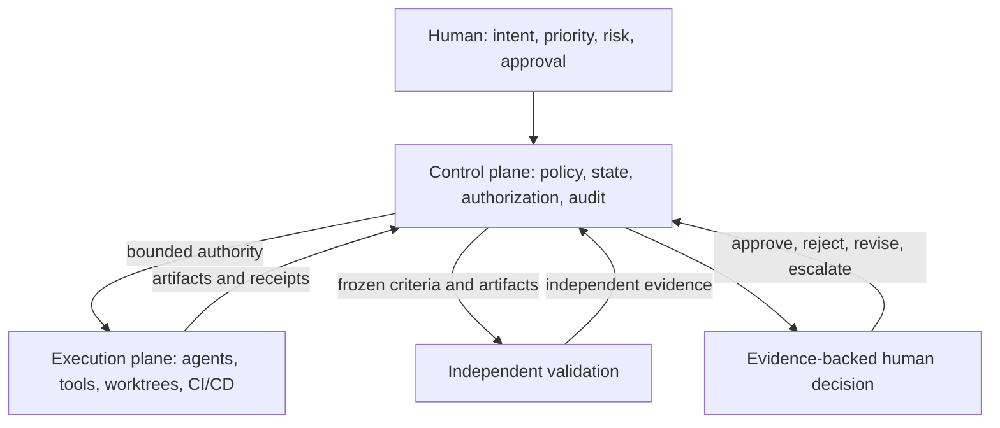

# AI Software Factory and Mission Control

## 1. The problem

Coding assistants can generate code quickly, but software delivery is not only
code generation. Organizations must turn ambiguous business intent into a safe,
validated change. That path includes research, planning, authorization,
implementation, testing, review, recovery, release, and confirmation that the
expected outcome occurred.

An agent that can edit a repository solves only part of this problem. Without a
governed operating model, faster code generation can increase review burden,
coordination cost, security exposure, and change failure. The organization gains
activity without gaining trustworthy delivery.

## 2. Enduring Principle

An AI Software Factory treats autonomous execution as a controlled production
system. Humans provide intent and accountability. Agents provide bounded
execution. Policy determines authority. Independent validation produces
evidence. Durable state connects every decision and artifact from intent to
outcome.

A real factory therefore differs from adjacent tools:

| System | Primary capability | What remains outside its boundary |
| --- | --- | --- |
| Coding assistant | Suggests or generates code | Governed lifecycle and outcome ownership |
| Coding agent | Executes a bounded engineering task | Portfolio control, durable governance, and complete delivery lineage |
| Agent platform | Provides agent runtimes, tools, memory, and orchestration | A software-delivery operating model may still need to be designed |
| AI Software Factory | Governs the path from business intent to validated customer value | Humans retain accountability and material risk decisions |

Multi-agent orchestration must be available, but it is not mandatory for every
WorkOrder. A simple job should use the simplest executor that can satisfy its
contract. Specialization becomes useful when implementation, validation,
security, architecture, or recovery require independent responsibilities.

## 3. Operating model

The factory separates the lifecycle into explicit authority and evidence
boundaries:

The control plane decides whether work is allowed, records authoritative state,
and evaluates the evidence required for progression. The execution plane
performs work through agents and tools. An external system such as GitHub
Actions or Argo CD may execute deployment, but the factory should govern the
decision, policy, evidence, and approval.

## 4. Canonical domain model

The complete conceptual hierarchy is:

`Company -> Workspace -> Repository -> Factory Configuration -> Mission ->
Approved Plan -> WorkOrder -> Task -> Attempt -> Evidence -> Pull Request ->
Release`

The central delivery chain is shorter:

`Mission -> WorkOrder -> Task -> Attempt -> Evidence -> Pull Request -> Release`

A Mission states the governed outcome. A Plan translates intent into a versioned
execution contract. Plan approval authorizes exact work; it does not dispatch an
agent or approve a merge. A WorkOrder defines a bounded unit of authority and
acceptance. Tasks organize execution. Attempts preserve each immutable try.
Evidence supports or refutes acceptance criteria. Pull requests and releases
remain distinct governed outcomes.

This separation prevents optimistic state propagation. A successful Attempt
does not make a Task accepted. A completed Task does not accept a WorkOrder. A
merged pull request does not prove production value.

## 5. Current Mission Control Implementation

This assessment is grounded at Mission Control commit
[`8014d5af427b43ff5c5a63cfdf82ec92742c208c`](https://github.com/jaydubya818/MissionControl/tree/8014d5af427b43ff5c5a63cfdf82ec92742c208c).

Mission Control describes itself as the operating system for human-directed,
agent-executed software development. Its V1 product promise is deliberately
narrow: a human defines an outcome, approves a plan, permits governed execution,
and receives a validated, review-ready pull request.

The current architecture uses:

| Layer | Mission Control choice | Responsibility |
| --- | --- | --- |
| Operator interface | React, TypeScript, Vite | Intent capture, approvals, exceptions, evidence, and review |
| Authoritative control plane | Convex | Durable domain state, queries, mutations, actions, authorization, and audit records |
| Orchestration service | Hono on Node.js | Long-running coordination, runtime integration, and external control boundaries |
| Execution runtime | Workflow executor and adapters | Bounded Tasks, Attempts, tools, worktrees, and receipts |
| Repository boundary | Git worktrees and GitHub integration | Isolated changes, commits, pull requests, and source lineage |

Convex remains the source of truth. The Hono service must not create a competing
state store. The React UI is an operator surface, not the authority boundary;
server-owned commands must enforce policy and lifecycle rules regardless of the
caller.

The schema and product contracts include Missions, versioned plans, WorkOrders,
workflow runs, approval decisions, verification receipts, immutable lifecycle
history, and explicit acceptance rules. Mission Control also defines separate
worker and validator responsibilities. Missing, failed, stale, or unknown
evidence blocks acceptance.

These mechanisms do not by themselves prove the complete V1 promise. The
strongest proof remains a browser-operated golden path against a real controlled
repository, including failure, recovery, independent validation, exact GitHub
lineage, and a complete review package.

## 6. How the golden path should behave

1. A human records the outcome, business reason, constraints, risk, and
   measurable acceptance criteria.
2. An agent researches the selected repository and identifies uncertainty.
3. The factory creates a versioned Plan with WorkOrder boundaries and validation
   assertions.
4. A human approves the exact Plan version.
5. Mission Control performs policy and capability preflight.
6. Authorized Tasks execute through immutable Attempts in isolated worktrees.
7. Failures are classified. Retries require a new hypothesis and remain bounded.
8. Independent validators evaluate the frozen criteria against exact artifacts.
9. Mission Control assembles changes, decisions, risks, evidence, and lineage.
10. A human approves, rejects, or requests revision. Merge remains a separate
    decision.

The first demonstration is a small change: add a required Business Justification
field to Mission creation. Its purpose is to exercise the system, not showcase a
large feature.

## 7. Governance and autonomy

Operational autonomy is scoped. A factory, Mission, WorkOrder, policy, and trust
assessment may each impose a ceiling. The effective authority is the lowest of
those ceilings. A more capable model cannot raise that authority automatically.

Promotion requires sustained evidence and an explicit human decision. Demotion
may be automatic. Mission Control should first prove Level 2 Delegated Execution:
a human authorizes bounded work and reviews every material output. Level 3
Governed Autonomy is earned only after consistent independent validation and
stable operation.

The Trust Score is an eligibility signal, never an authorization grant. Policy
always wins. Trust is computed numerically for trends and communicated to
operators through understandable bands.

## 8. Measures of success

The first three measures are coupled:

1. **Lead Time to Validated Customer Value** begins when business intent becomes
   a governed Mission. It ends after deployment, independent production or
   production-equivalent validation, and confirmation of the expected outcome.
2. **Change Failure Rate** counts deployments that cause rollback, hotfix,
   emergency intervention, customer regression, reliability or security
   incident, or an SLO violation. Seven days is the default observation window.
3. **Engineering Leverage** measures more validated customer value per engineer
   without increased cognitive load or coordination cost.

Commits, lines of code, prompts, tokens, and agent activity are not business
outcomes.

## 9. Future Vision

A mature factory may govern deployment, production verification, incident
response, and learning. It may allow low-risk changes to progress automatically
when policy and evidence permit. Humans should still promote changes to prompts,
policies, evaluations, workflows, or autonomy levels.

Mission Control has not earned every part of that claim at the studied commit.
The V1 priority remains one trustworthy, browser-operable path from governed
Mission to validated pull request. Breadth should follow proof.

## 10. Versioned references

- [Mission Control North Star](https://github.com/jaydubya818/MissionControl/blob/8014d5af427b43ff5c5a63cfdf82ec92742c208c/docs/product/mission-control-north-star.md)
- [Mission Control V1 Product Strategy](https://github.com/jaydubya818/MissionControl/blob/8014d5af427b43ff5c5a63cfdf82ec92742c208c/docs/product/mission-control-v1-product-strategy.md)
- [Governed Missions Contract](https://github.com/jaydubya818/MissionControl/blob/8014d5af427b43ff5c5a63cfdf82ec92742c208c/docs/software-factory/governed-missions-contract.md)
- [Software Factory Domain Contracts](https://github.com/jaydubya818/MissionControl/blob/8014d5af427b43ff5c5a63cfdf82ec92742c208c/docs/software-factory/domain-contracts.md)
- [Orchestration Architecture Decision](https://github.com/jaydubya818/MissionControl/blob/8014d5af427b43ff5c5a63cfdf82ec92742c208c/docs/decisions/001-orchestration-architecture.md)
- [React application entry point](https://github.com/jaydubya818/MissionControl/blob/8014d5af427b43ff5c5a63cfdf82ec92742c208c/apps/mission-control-ui/src/main.tsx)
- [Convex schema](https://github.com/jaydubya818/MissionControl/blob/8014d5af427b43ff5c5a63cfdf82ec92742c208c/convex/schema.ts)
- [Hono orchestration service](https://github.com/jaydubya818/MissionControl/blob/8014d5af427b43ff5c5a63cfdf82ec92742c208c/apps/orchestration-server/src/index.ts)
