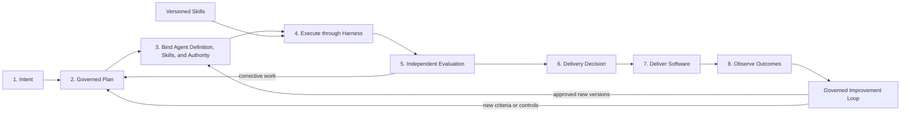

# Intent-to-Delivery Lifecycle

## 1. The problem

The factory needs a simple explanation that builders and leaders can remember:

> **Intent → Plan → Define Agent → Execute through Harness → Apply Skills →
> Evaluate → Improve → Deliver Software**

That line is a useful value-stream mnemonic, but it becomes misleading if read
as eight isolated services or a strictly linear runtime sequence. Skills are
selected before execution and applied inside the harnessed loop. Improvement is
a governed feedback loop over evaluated outcomes; it must not silently rewrite
the agent that is still producing or certifying a change. Delivery includes the
decision, release, observation, and outcome—not merely opening a pull request.

The factory therefore needs both the memorable line and a precise operating
contract behind it.

## 2. Why the problem exists

Agentic software engineering mixes several different concerns:

- product intent and engineering requirements;
- model-driven judgment and deterministic control;
- configuration, identity, credentials, and authority;
- reusable skills and executable tools;
- runtime progress and governed acceptance;
- software change and factory change; and
- pre-release evidence and production outcomes.

Collapsing these concerns creates dangerous ambiguity. “The agent is defined”
may mean a prompt was written, a versioned configuration was selected, or a
credential was granted. “Done” may mean the model stopped, tests passed, a PR
opened, a human accepted the WorkOrder, or production value was observed. Each
claim has a different owner and evidence requirement.

## 3. Enduring Principle

### Use the line as a value stream, not a literal call graph

The operational lifecycle is:



This diagram does not replace the mnemonic. It explains it:

- **Define Agent** means bind an approved, versioned Agent Definition to the
  work. It does not mean invent a new agent for every task.
- **Apply Skills** is a visible factory capability, but operationally skills are
  selected, frozen, and used during execution.
- **Improve** consumes evaluation and production evidence. It proposes future
  versions through promotion gates rather than self-modifying the active run.
- **Deliver Software** begins with an authorized delivery decision and ends
  with observed technical and customer outcomes.

### Define a contract for every stage

| Stage | Primary question | Required input | Authoritative output and exit condition |
| --- | --- | --- | --- |
| Intent | What outcome does the builder need, and why? | Builder request, product context, constraints, accountable owner | Governed objective with scope, risk, success measures, and unresolved questions |
| Plan | How can the outcome be achieved and proven? | Approved intent and repository/system facts | Versioned Plan with tasks, dependencies, acceptance criteria, verification, recovery, and estimates |
| Define Agent | Which governed executor configuration may perform each task? | Approved Plan, Factory Configuration, policy, capability catalog | Frozen agent/skill/model/tool/context bindings and escalation contract |
| Execute through Harness | How is authorized work performed safely and durably? | Execution manifest and preflight approval | Artifacts, events, checkpoints, tool receipts, completion report, and unresolved findings |
| Apply Skills | Which reusable method should shape execution? | Task type, approved skill catalog, agent definition | Versioned skill bindings whose instructions and required tools are included in the manifest |
| Evaluate | Did the exact artifact satisfy intent and criteria through an acceptable trajectory? | Frozen criteria, exact artifact, execution lineage | Independent evidence, failures, uncertainty, and an eligibility recommendation |
| Improve | What should change for future runs based on evidence? | Evaluation, human feedback, incidents, cost, and production outcomes | Versioned proposal, experiment, promotion or rejection decision, and rollback record |
| Deliver Software | May this artifact advance, and did it create the intended outcome? | Accepted change, evidence, approvals, provenance, release policy | Review, merge, deployment, observation, rollback readiness, and validated outcome |

“Primary” does not mean exclusive. A product owner may refine intent with an
agent; a deterministic planner may handle a known workflow; a human may perform
execution. The contract matters more than which actor fills the role.

### Stage 1: Intent

Intent is the interface between builders and the factory. Capture the outcome,
not merely the literal prompt. A usable intent record includes:

- problem and desired builder or customer outcome;
- accountable owner and affected personas;
- repository, service, environment, and tenant scope;
- functional and non-functional constraints;
- risk, reversibility, deadline, and budget;
- success measures and observation window; and
- assumptions, ambiguity, and questions requiring human judgment.

The intent stage exits only when the factory can state what success means and
which uncertainty is acceptable. When consequential ambiguity remains, the
correct result is clarification—not confident decomposition.

### Stage 2: Plan

The Plan translates intent into an executable and verifiable approach. It
contains tasks, dependencies, ordering, parallelism, expected artifacts,
acceptance criteria, validation methods, rollout, rollback, and recovery.

Planning is not authority to execute. Material revisions create a new version,
invalidate affected downstream bindings, and require impact analysis. Dynamic
replanning is legitimate only within granted bounds; it cannot silently widen
scope, weaken criteria, or add authority.

Prefer deterministic workflows for stable, well-specified work. Use model-led
planning when the path requires interpretation, exploration, or adaptation.
More agentic complexity is justified by uncertainty, not novelty.

### Stage 3: Define Agent

An Agent Definition is a versioned configuration, not a model name. At minimum
it declares:

```text
role + objective + instructions + capabilities + eligible models
+ tools + skills + context policy + permissions + budgets
+ stop conditions + escalation + success criteria + evaluation policy
```

The factory binds an approved definition to a Task or WorkOrder and compiles an
immutable execution manifest. The binding identifies exact versions of the
agent, prompt/instructions, skills, model-routing policy, tool grants, MCP
servers, context package, memory snapshot, policy, budget, and sandbox profile.

Keep four concepts separate:

- **Agent Definition:** what behavior and capabilities are configured;
- **agent identity:** which versioned worker behavior produced an action;
- **runtime principal:** which authenticated process is making the call; and
- **credential/authority:** which scoped action that principal may perform.

An Agent Definition must never become a reusable bearer of broad credentials.
If a task is better served by deterministic automation, the correct binding is
no model-driven agent at all.

### Stage 4: Execute through Harness

The harness turns the frozen manifest into bounded work. It owns:

- preflight policy, readiness, and capability checks;
- model routing and fallback within approved eligibility;
- sandbox lifecycle, filesystem and network boundaries, and secret brokering;
- context assembly, compaction, and refresh;
- atomic tool execution and schema validation;
- durable Tasks, Attempts, leases, heartbeats, and checkpoints;
- time, token, cost, concurrency, retry, and action budgets;
- pause, cancel, quarantine, kill switch, and human escalation;
- structured events, traces, artifacts, and audit receipts; and
- reconciliation after partial or ambiguous external effects.

The inner reasoning loop remains simple:

```text
Understand → Plan → Act → Observe → Evaluate → Adjust
```

The loop ends through an explicit completion contract, not through a guess that
the model appears finished. A completion report states `succeeded`, `partial`,
`blocked`, `failed`, or `cancelled`; summarizes work; identifies exact
artifacts; maps results to criteria; records unresolved findings; and names any
required human action. Runtime completion still does not accept the WorkOrder.

Tools should be narrow, composable primitives. The model may choose how to use
them, but deterministic code enforces identity, policy, validation, state
transitions, and irreversible boundaries. Any builder outcome supported in the
product should be reachable through an authorized API or tool path, without
granting agents every human permission.

### Stage 5: Apply Skills

A skill is a reusable, versioned method for a class of tasks. It can package
instructions, decision criteria, examples, required context, and tool-use
patterns. It is not a tool, credential, policy exception, or proof of quality.

Skill application has its own lifecycle:

1. discover eligible skills from task intent and Agent Definition;
2. filter by owner, version, scope, security classification, and evaluation;
3. bind exact versions into the execution manifest;
4. load only the relevant skill content and dependencies;
5. observe usage and outcomes; and
6. evaluate a candidate before promotion or retirement.

A skill may teach an agent how to deploy, but the deployment tool and policy
gate still own the authority. Skill text and tool or MCP output are untrusted
inputs unless their provenance and trust level say otherwise.

### Stage 6: Evaluate

Evaluation asks two different questions:

1. **Artifact evaluation:** Is the exact change correct, secure, useful,
   maintainable, and aligned with the criteria?
2. **Trajectory evaluation:** Did the run use permitted context, tools,
   authority, budgets, and recovery behavior without hiding material failure?

Use deterministic checks wherever possible: compilation, tests, linters,
scanners, policy engines, schema validation, provenance verification, and
reproducible environment checks. Use model-based evaluators for criteria that
require judgment, with calibrated rubrics and representative datasets.

The builder and validator must not share a correlated path that defeats
independence. A different persona label on the same configuration is not enough.
Evidence binds a verifier and method to exact criteria, artifact digest,
environment, time, and result. Missing, stale, contradictory, or failed
evidence remains visible. The agent that produced the work cannot accept it.

### Stage 7: Improve

Improvement is a separate change-management loop for the factory itself. It may
propose changes to Agent Definitions, prompts, skills, tools, context policies,
routes, evaluators, budgets, or workflow controls.

```text
Observe → Curate Dataset → Cluster Failure → Propose Candidate
→ Compare with Baseline → Review → Canary → Promote or Roll Back
```

Learning can automate observation, clustering, proposal, and experimentation.
Promotion remains governed. The candidate must be evaluated on representative
tasks, critical safety and policy floors, human correction, cost, latency, and
regression. The previous version remains recoverable.

Improvement need not block delivery of the current artifact unless evaluation
found a defect or control gap that makes delivery unsafe. Otherwise, it updates
future factory versions asynchronously.

### Stage 8: Deliver Software

Delivery turns an accepted artifact into measured value. Keep these states
separate:

```text
Review-ready → Approved → Merged → Release eligible → Deployed
→ Technically verified → Outcome observed → Accepted or Corrective Work
```

The factory may delegate build and deployment mechanics to existing CI/CD, but
it retains the policy, evidence, approval, lineage, and reconciliation that
connect delivery to intent. Progressive rollout, feature flags, canaries,
health gates, kill switches, rollback, and post-deployment observation are part
of the delivery contract.

A pull request is a review artifact. A deployment is a technical event. Neither
alone proves the intended customer outcome.

### Preserve cross-stage invariants

1. Every Task and artifact traces back to approved intent and criteria.
2. Every Attempt freezes its agent, skill, model-routing, context, tool,
   policy, budget, and environment versions.
3. Authority is explicit, least-privilege, time-bounded, and revocable.
4. Agent, runtime principal, credential, and accountable human remain distinct.
5. Runtime completion, independent evidence, acceptance, and delivery are
   separate state transitions.
6. Retries create attributable Attempts; idempotency and reconciliation prevent
   duplicate external effects.
7. Consequential actions produce evidence and remain subject to human authority
   proportional to risk.
8. Factory improvements follow the same specification, evaluation, promotion,
   versioning, and rollback discipline as customer software.

### Use explicit lifecycle records

The minimum record spine is:

```text
Mission → PlanVersion → WorkOrder → Task → AgentBinding
→ ExecutionManifest → Attempt → CompletionReport
→ EvaluationRun → Evidence → AcceptanceDecision
→ PullRequest → Release → ProductionOutcome → ImprovementProposal
```

Names may vary by implementation. The invariant is that authority, work,
evidence, decisions, delivery, outcomes, and learning are not reconstructed
from chat transcripts or telemetry.

### Measure the lifecycle stage by stage

| Stage | Leading measures | Failure signal |
| --- | --- | --- |
| Intent | clarification rate, criterion completeness, time to accepted intent | downstream rework caused by misunderstood goals |
| Plan | plan assurance pass rate, dependency accuracy, estimate calibration | material replan after execution begins |
| Define Agent | eligible-binding rate, policy denials, configuration drift | execution with stale or unauthorized components |
| Execute | retry-free completion, blocked/partial rate, recovery time, cost | duplicate effects, runaway loops, silent stalls |
| Apply Skills | skill selection precision, outcome lift, version adoption | skill adds cost or failure without quality gain |
| Evaluate | criterion coverage, escape rate, validator disagreement, freshness | accepted artifact later contradicted by known evidence |
| Improve | experiment cycle time, promotion quality, rollback frequency | candidate regression or unauthorized self-promotion |
| Deliver | PR acceptance, lead time, change failure, rollback, outcome attainment | technically healthy release with failed customer outcome |

Optimize the whole value stream. Improving token cost while raising human
correction or change failure is not factory progress.

## 4. Tradeoffs and alternatives

A single linear slogan is easy to communicate but hides feedback and
concurrency. A complete state machine is precise but too complex as an entry
point. Use both: the mnemonic for orientation and the lifecycle contract for
design and operations.

Atomic tools increase composability but can increase the number of policy
decisions and calls. Domain tools reduce cost and error for mature workflows
but should not hide authority or combine implementation, approval, and
certification. Add specialization only after repeated evidence shows the
primitive path is too costly or inconsistent.

Long-running agent loops improve adaptability while increasing latency, cost,
and failure surface. For known deterministic transformations, conventional
software is simpler and more reliable.

## 5. Current Mission Control Implementation

The repository's Mission Control case studies show records and mechanisms for
Missions, versioned Plans, WorkOrders, Tasks, Attempts, agent/context bindings,
execution manifests, policy, approvals, evidence, pull requests, and emerging
release controls. They also preserve an important limitation: the cited
assessments do not prove the complete browser-originated intent-to-production
outcome path as one accepted run.

Use the
[implementation maturity map](../09-mission-control-case-studies/01-implementation-maturity-and-evidence-map.md)
for the historical boundary and the
[verification-first case study](../09-mission-control-case-studies/02-verification-first-software-factory.md)
for the merged assurance architecture. Do not infer current product capability
from this lifecycle target model.

## 6. Future Vision

The factory should render this lifecycle as one decision-oriented experience.
Builders should see the current stage, authoritative record, evidence state,
cost, risk, owner, available recovery, and next required decision without
learning the internal agent topology.

The first proof remains one narrow corridor from governed intent to a
review-ready, independently validated pull request with human merge authority.
Expand toward deployment and outcome-based improvement only after that corridor
is reliable, observable, secure, and accepted by builders.

## 7. Versioned references

- [Anthropic: Building Effective Agents](https://www.anthropic.com/engineering/building-effective-agents), accessed 2026-08-25 — simple, composable agent patterns and the workflow/agent distinction.
- [Anthropic: Trustworthy Agents in Practice](https://www.anthropic.com/research/trustworthy-agents), accessed 2026-08-25 — the agent loop, meaningful human control, transparency, and security.
- [OpenAI: A Practical Guide to Building Agents](https://openai.com/business/guides-and-resources/a-practical-guide-to-building-ai-agents/), accessed 2026-08-25 — models, tools, instructions, layered guardrails, evaluation baselines, and human intervention.
- [Model Context Protocol specification, 2026-07-28](https://modelcontextprotocol.io/specification/2026-07-28), accessed 2026-08-25 — protocol roles, capability negotiation, tasks, skills, consent, and tool safety.
- [NIST AI Risk Management Framework](https://www.nist.gov/itl/ai-risk-management-framework), accessed 2026-08-25 — lifecycle governance through govern, map, measure, and manage.
- [NIST Secure Software Development Framework](https://csrc.nist.gov/projects/ssdf), accessed 2026-08-25 — outcome-based secure software-development practices and the SP 800-218A AI profile.
- [OWASP Top 10 for Agentic Applications 2026](https://genai.owasp.org/initiatives/agentic-security-initiative/), accessed 2026-08-25 — risks and mitigations for autonomous, tool-using systems.
- [SLSA Provenance 1.2](https://slsa.dev/spec/v1.2/provenance), accessed 2026-08-25 — verifiable artifact lineage.
- [Platform Blueprint and Operating Playbook](./03-platform-blueprint-and-operating-playbook.md)
- [Authoritative Delivery Hierarchy](../04-domain-model/01-authoritative-delivery-hierarchy.md)
- [Factory Configuration, Workflow Contracts, and Execution Manifests](../04-domain-model/02-factory-configuration-workflows-and-execution-manifests.md)
- [AI Software Factory Reference Architecture](../05-runtime-architecture/06-ai-software-factory-reference-architecture.md)

## 8. Notes and lessons learned

- The headline sequence is strongest when paired with a precise explanation of
  which stages are concurrent and which claims remain separate.
- “Define Agent” is safer language when it means versioned binding rather than
  new prompt creation or credential assignment.
- Skills improve consistency only when they are versioned, evaluated, scoped,
  and unable to grant themselves authority.
- The improvement loop is part of the factory, but promotion is a delivery
  decision for factory configuration—not an agent privilege.

## 9. Interview and discussion questions

1. Why are skills shown as a lifecycle stage if they execute inside the harness?
2. Which changes force a new execution manifest and invalidate prior evidence?
3. What is the difference among runtime completion, WorkOrder acceptance, and
   successful delivery?
4. When should a deterministic workflow replace an agent?
5. How can improvement be autonomous without permitting self-promotion?
6. Which stage owns a production incident that contradicts pre-release evidence?

## 10. Whiteboard exercise

Draw the mnemonic first. Then redraw it as the operational lifecycle with
skills inside execution and improvement after observed outcomes. For every
transition, name the authoritative record, actor, policy decision, evidence,
failure state, retry rule, and human authority.

## 11. Hands-on lab

Choose one bounded repository change. Produce an intent record, versioned Plan,
Agent Binding, execution manifest, explicit completion report, independent
evaluation contract, delivery decision, production observation plan, and one
hypothetical Improvement Proposal. The lab passes only if every record has a
different purpose, exact lineage, explicit owner, and a defined failure state.
