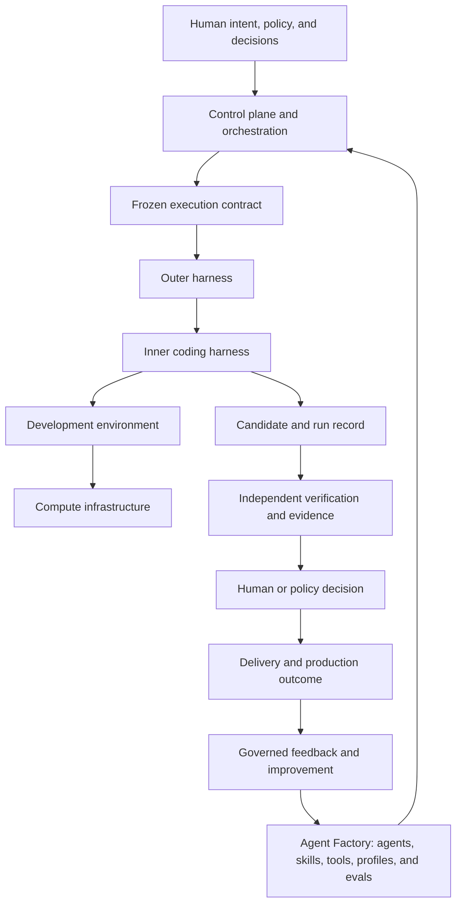

# Reading Paths

The curriculum is a reference system, not a book everyone must read in the
same order. Choose the path that matches the decision you need to make. Every
path uses the same canonical architecture and vocabulary.

## The system you are learning

The control path delegates bounded capability downward. Evidence and outcomes
flow upward. No lower layer can grant itself new authority or certify its own
material result.

## Executive path — 20 minutes

**Outcome:** Explain the business value, risk model, human accountability, and
adoption sequence without needing implementation detail.

Read only the **Quick Read** section in this order:

1. [AI Software Factory and Mission Control](./01-ai-software-factory-and-mission-control.md)
2. [What Is an AI Software Factory?](../01-vision/01-what-is-an-ai-software-factory.md)
3. [The Human-Agent Operating Model](../03-operating-model/01-human-agent-operating-model.md)
4. [Operational Autonomy and Trust Calibration](../02-first-principles/01-operational-autonomy-and-trust-calibration.md)
5. [Quality and Evidence Architecture](../07-quality-engineering/01-quality-and-evidence-architecture.md)

You should be able to answer: Why is this larger than a coding agent? What
remains a human responsibility? What evidence justifies more autonomy? Which
outcome should the organization measure?

## Architect path — 2 hours

**Outcome:** Whiteboard the complete system, name each authority boundary, and
identify the failure owner for execution, evidence, environment, and delivery.

1. [Software Factory Stack Boundaries](./05-software-factory-stack-boundaries.md)
2. [Intent-to-Delivery Lifecycle](./04-intent-to-delivery-lifecycle.md)
3. [The Authoritative Delivery Hierarchy](../04-domain-model/01-authoritative-delivery-hierarchy.md)
4. [Control Plane and Execution Plane](../05-runtime-architecture/01-control-plane-and-execution-plane.md)
5. [Runtime Orchestration and State Machines](../05-runtime-architecture/02-runtime-orchestration-and-state-machines.md)
6. [Development Environments, Compute, and Composable Infrastructure](../05-runtime-architecture/07-development-environments-compute-and-composable-infrastructure.md)
7. [Coding Harnesses, Adapters, and Agent Protocols](../05-runtime-architecture/08-coding-harnesses-adapters-and-agent-protocols.md)
8. [Quality and Evidence Architecture](../07-quality-engineering/01-quality-and-evidence-architecture.md)

Finish by redrawing the canonical map from memory. For every arrow, state the
contract, identity, failure behavior, telemetry, and authority that crosses it.

## Builder path — hands-on

**Outcome:** Implement and debug one governed path from a bounded issue to a
verified pull-request candidate.

1. [Agent Architecture, MCP, Tools, Context, and Memory](../06-ai-engineering/01-agent-architecture-mcp-tools-context-and-memory.md)
2. [Agent and Loop Engineering Patterns](../06-ai-engineering/05-agent-and-loop-engineering-patterns.md)
3. [Data, Knowledge, Context, and Semantic Engineering](../06-ai-engineering/03-data-knowledge-context-and-semantic-engineering.md)
4. [Evaluation Engineering, Trace Replay, and Run Comparison](../06-ai-engineering/04-evaluation-engineering-trace-replay-and-run-comparison.md)
5. [Tasks, Attempts, Leases, Idempotency, and Recovery](../05-runtime-architecture/03-tasks-attempts-leases-idempotency-and-recovery.md)
6. [Sandboxed Execution, Isolation, and Publication](../05-runtime-architecture/04-sandboxed-execution-isolation-and-publication.md)
7. [Production Feedback, Reproduction, Review, and Merge](../07-quality-engineering/05-production-feedback-reproduction-review-and-merge.md)
8. [Governed Issue to Validated Pull Request Lab](../10-labs/01-governed-issue-to-validated-pull-request.md)

Do not stop at a successful agent run. Complete the evidence, failure,
cancellation, cleanup, and human-decision paths required by the lab.

## Deep Study path — complete curriculum

**Outcome:** Design, build, operate, evaluate, and defend an AI Software Factory
from first principles.

Follow the numbered sequence in the [curriculum map](../README.md): Vision,
First Principles, Operating Model, Domain Model, Runtime Architecture, AI
Engineering, Quality Engineering, Security and Governance, Case Studies, Labs,
and Research Journal.

After each area:

1. explain it without notes;
2. redraw its core system or state transition;
3. complete the chapter's interview questions and whiteboard exercise;
4. perform the lab or evidence exercise; and
5. record which current claims are implemented, proposed, or still unproven.

Use the [Topic Index](./07-topic-index.md) when a question cuts across the
curriculum rather than following its chapter order.

## How to know you are ready to advance

Reading is not mastery. Advance when you can explain the boundary, predict its
failure modes, identify the authoritative record, name the required evidence,
and recover from one deliberately introduced failure.
