# Start Here

> **Intent → Plan → Define Agent → Execute through Harness → Apply Skills →
> Evaluate → Improve → Deliver Software**

This section is the shortest path into AI Software Factory mastery. Read it
before the detailed chapters. It establishes the system model, the vocabulary,
and the boundary between enduring principles and Mission Control's current
implementation.

## The idea in one paragraph

An AI Software Factory is a governed engineering operating model. Humans define
intent, constraints, priorities, and acceptable risk. Agents plan and execute
bounded work. Independent validators produce evidence. Policy controls what may
happen next. Humans retain accountability for material decisions. The factory
exists to shorten the path from business intent to validated customer value
without trading away quality, security, or control.

Mission Control is a concrete attempt to implement this operating model. It is
not the definition of the model. The enduring principles should survive a
complete rewrite. React, Convex, Hono, particular executors, and current schemas
are implementation choices that can change.

## The governing flow

```mermaid
flowchart LR
    Intent["Human intent and constraints"] --> Mission["Governed Mission"]
    Mission --> Plan["Versioned Plan"]
    Plan --> Approval["Human approval"]
    Approval --> WorkOrder["Authorized WorkOrder"]
    WorkOrder --> Execution["Tasks and immutable Attempts"]
    Execution --> Validation["Independent validation"]
    Validation --> Evidence["Criterion-linked Evidence"]
    Evidence --> PR["Review-ready pull request"]
    PR --> Decision["Human merge decision"]
    Decision --> Delivery["Governed delivery and outcome validation"]
```

The records are deliberately separate. Completing a Task does not accept its
WorkOrder. Completing a WorkOrder does not accept its Mission. Passing tests
does not authorize a merge or deployment. Each boundary represents a different
claim and therefore requires different evidence and authority.

## Five ideas to retain

### Trust the system, not the model

Models are probabilistic and will fail. Reliable autonomy comes from the
surrounding system: bounded authority, isolation, policy, independent
validation, immutable history, evidence, recovery, and human accountability.

### Intent matters more than activity

Agent sessions, prompts, tokens, and generated code are implementation detail.
The primary object is the governed outcome the organization wants to achieve.

### Evidence matters more than confidence

An agent's statement that work is complete is not proof. Acceptance depends on
fresh, attributable evidence tied to predefined criteria and the exact artifact
being reviewed.

### Quality enables autonomy

Autonomy should increase only when the factory repeatedly demonstrates that it
can operate within policy and produce independently validated outcomes. It must
decrease when evidence shows a loss of trust.

### Humans own risk

Agents may recommend, implement, validate, and explain. Humans remain
accountable for business intent, material exceptions, risk acceptance,
promotion of authority, merge, and consequential production decisions.

## Recommended reading paths

Do not treat the repository as a 32-step checklist. Read in layers and stop to
reconstruct the system after each layer.

### Foundation

1. [AI Software Factory and Mission Control](./01-ai-software-factory-and-mission-control.md)
2. [Intent-to-Delivery Lifecycle](./04-intent-to-delivery-lifecycle.md)
3. [Platform Blueprint and Operating Playbook](./03-platform-blueprint-and-operating-playbook.md)
4. [Canonical Glossary](./02-canonical-glossary.md)
5. [What Is an AI Software Factory?](../01-vision/01-what-is-an-ai-software-factory.md)
6. [Operational Autonomy and Trust Calibration](../02-first-principles/01-operational-autonomy-and-trust-calibration.md)

### Architecture and execution

Read the operating model and domain hierarchy, then the runtime and AI
engineering chapters:

- [The Human-Agent Operating Model](../03-operating-model/01-human-agent-operating-model.md)
- [The Authoritative Delivery Hierarchy](../04-domain-model/01-authoritative-delivery-hierarchy.md)
- [Factory Configuration, Workflow Contracts, and Execution Manifests](../04-domain-model/02-factory-configuration-workflows-and-execution-manifests.md)
- [Specification Engineering, Executable Requirements, and Plan Assurance](../04-domain-model/03-specification-engineering-executable-requirements-and-plan-assurance.md)
- [Runtime architecture](../05-runtime-architecture/01-control-plane-and-execution-plane.md)
- [Agent Architecture, MCP, Tools, Context, and Memory](../06-ai-engineering/01-agent-architecture-mcp-tools-context-and-memory.md)
- [Model Routing, Evaluations, and Capability Selection](../06-ai-engineering/02-model-routing-evaluations-and-capability-selection.md)

Use the [curriculum map](../README.md) to continue through the remaining
runtime chapters without turning this entry page into another full index.

### Assurance and governance

- [Quality and Evidence Architecture](../07-quality-engineering/01-quality-and-evidence-architecture.md)
- [Continuous Quality Contracts, Proof Packages, and Certificates](../07-quality-engineering/03-continuous-quality-contracts-proof-packages-and-certificates.md)
- [Governance, Policy, and Risk-Proportional Approval](../08-security-and-governance/01-governance-policy-and-risk-proportional-approval.md)
- [Security and Identity Architecture](../08-security-and-governance/02-security-and-identity-architecture.md)
- [Software Supply Chain Security, Provenance, and Attestation](../08-security-and-governance/03-software-supply-chain-security-provenance-and-attestation.md)

### Scale, learning, and operation

- [AI Software Factory Reference Architecture](../05-runtime-architecture/06-ai-software-factory-reference-architecture.md)
- [Factory Economics and Operating Metrics](../03-operating-model/02-factory-economics-and-operating-metrics.md)
- [Enterprise Adoption and Factory Maturity Model](../03-operating-model/04-enterprise-adoption-and-factory-maturity-model.md)
- [Governed Continuous Learning and Recursive Improvement](../03-operating-model/03-governed-continuous-learning-and-recursive-improvement.md)
- [Release, Production Feedback, and Factory SRE](../07-quality-engineering/02-release-production-feedback-and-factory-sre.md)

### Evidence and practice

Finish with the [Mission Control case studies](../09-mission-control-case-studies/01-implementation-maturity-and-evidence-map.md)
and [hands-on labs](../10-labs/01-governed-issue-to-validated-pull-request.md).
Use [Executive and Interview Mastery](../11-interview-mastery/01-executive-and-interview-mastery.md)
as optional communication practice after the architecture is understood.

On the second pass, explain the complete flow without notes. Give a 30-second
version for a CEO, a two-minute version for a CTO, and a ten-minute architecture
version for a senior engineer. Any boundary that cannot be explained clearly is
the next study target.

## Evidence boundary

This guide uses three labels deliberately:

- **Enduring Principle** describes doctrine that should survive technology
  changes.
- **Current Mission Control Implementation** describes behavior supported by a
  cited commit, source path, test, or observed browser journey.
- **Future Vision** describes desired behavior that has not met the current
  evidence bar.

The distinction prevents a compelling product vision from being mistaken for
working software.
