# Start Here

> **Intent → Plan → Define Agent → Execute through Harness → Apply Skills →
> Evaluate → Improve → Deliver Software**

This section is the shortest path into AI Software Factory mastery. Read it
before the detailed chapters. It establishes the system model, the vocabulary,
and the boundary between enduring principles and Mission Control's current
implementation.

## The idea in one paragraph

An AI Software Factory is a governed engineering operating model. Humans define
intent, constraints, priorities, and acceptable risk. Agents plan and execute
bounded work. Independent validators produce evidence. Policy controls what may
happen next. Humans retain accountability for material decisions. The factory
exists to shorten the path from business intent to validated customer value
without trading away quality, security, or control.

Mission Control is a concrete attempt to implement this operating model. It is
not the definition of the model. The enduring principles should survive a
complete rewrite. React, Convex, Hono, particular executors, and current schemas
are implementation choices that can change.

## The governing flow

```mermaid
flowchart LR
    Intent["Human intent and constraints"] --> Mission["Governed Mission"]
    Mission --> Plan["Versioned Plan"]
    Plan --> Approval["Human approval"]
    Approval --> WorkOrder["Authorized WorkOrder"]
    WorkOrder --> Execution["Tasks and immutable Attempts"]
    Execution --> Validation["Independent validation"]
    Validation --> Evidence["Criterion-linked Evidence"]
    Evidence --> PR["Review-ready pull request"]
    PR --> Decision["Human merge decision"]
    Decision --> Delivery["Governed delivery and outcome validation"]
```

The records are deliberately separate. Completing a Task does not accept its
WorkOrder. Completing a WorkOrder does not accept its Mission. Passing tests
does not authorize a merge or deployment. Each boundary represents a different
claim and therefore requires different evidence and authority.

## Five ideas to retain

### Trust the system, not the model

Models are probabilistic and will fail. Reliable autonomy comes from the
surrounding system: bounded authority, isolation, policy, independent
validation, immutable history, evidence, recovery, and human accountability.

### Intent matters more than activity

Agent sessions, prompts, tokens, and generated code are implementation detail.
The primary object is the governed outcome the organization wants to achieve.

### Evidence matters more than confidence

An agent's statement that work is complete is not proof. Acceptance depends on
fresh, attributable evidence tied to predefined criteria and the exact artifact
being reviewed.

### Quality enables autonomy

Autonomy should increase only when the factory repeatedly demonstrates that it
can operate within policy and produce independently validated outcomes. It must
decrease when evidence shows a loss of trust.

### Humans own risk

Agents may recommend, implement, validate, and explain. Humans remain
accountable for business intent, material exceptions, risk acceptance,
promotion of authority, merge, and consequential production decisions.

## Choose a reading path

Do not treat the repository as one long checklist. Start at the altitude your
current decision requires:

| Path | Best for | Outcome |
| --- | --- | --- |
| [Executive](./06-reading-paths.md#executive-path--20-minutes) | Leaders evaluating value, risk, and adoption | Explain the operating model in 20 minutes |
| [Architect](./06-reading-paths.md#architect-path--3-hours) | System, platform, security, and quality architects | Whiteboard the full system and its authority boundaries |
| [Builder](./06-reading-paths.md#builder-path--hands-on) | Engineers implementing agent workflows | Build and debug one governed delivery path |
| [Deep Study](./06-reading-paths.md#deep-study-path--complete-curriculum) | Readers seeking complete mastery | Follow every curriculum area, lab, and teach-back |

Use the [Topic Index](./07-topic-index.md) when you already know the concept you
need. Use the [Canonical Glossary](./02-canonical-glossary.md) when a term is
unclear. Use the [complete curriculum map](../README.md) when you want every
chapter in sequence.
Use [Capability Coverage and Maturity](./08-capability-coverage-and-maturity.md)
to see what is documented, review ready, validated, or operationally proven.
Use the [External Reviewer Guide](./09-reviewer-guide.md) when sharing the
curriculum for feedback.

For the shortest foundation pass, read:

1. [AI Software Factory and Mission Control](./01-ai-software-factory-and-mission-control.md)
2. [Software Factory Stack Boundaries](./05-software-factory-stack-boundaries.md)
3. [Intent-to-Delivery Lifecycle](./04-intent-to-delivery-lifecycle.md)

Then explain the system without notes. Any boundary you cannot explain clearly
is the next study target.

## Evidence boundary

This guide uses three labels deliberately:

- **Enduring Principle** describes doctrine that should survive technology
  changes.
- **Current Mission Control Implementation** describes behavior supported by a
  cited commit, source path, test, or observed browser journey.
- **Future Vision** describes desired behavior that has not met the current
  evidence bar.

The distinction prevents a compelling product vision from being mistaken for
working software.
