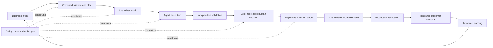
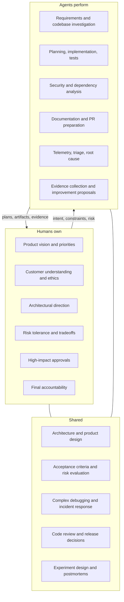
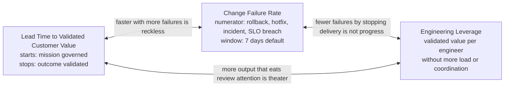

# 1. Why software engineering is changing

Software engineering is moving from a model in which people perform nearly every step to one in which people direct systems that execute continuously. Most organizations are responding by handing developers a coding assistant and leaving everything else unchanged. This chapter explains why that is not enough, what an **AI Software Factory** actually is, and why the thing worth building is an operating model rather than a faster editor. By the end you should be able to state the definition, name the boundary between a coding agent and a factory, and explain the three measures that decide whether a factory is working.

## The problem

Traditional delivery divides work across product definition, architecture, planning, coding, review, testing, security, release, and operations. The divisions buy specialization, but they also create queues, handoffs, context loss, and competing definitions of done. A developer may spend a few hours on a change that then takes days to move through the organization. The delay is rarely typing. It is waiting: for requirements clarification, for technical investigation, for a test environment, for test execution, for review, for approval, for a deployment window, for incident analysis, for documentation. The largest opportunity in most organizations is not faster implementation. It is less waiting and less coordination.

Adding a coding agent to this system makes one step faster without improving the system. The constraint moves downstream into review, validation, integration, release, or incident recovery. Organizations that bolt AI onto an unchanged process report a recognizable pattern: more code without more value, faster implementation but slower review, inconsistent agent behavior, weak accountability, unclear permissions, limited auditability, more security exposure, more generated defects, a new review bottleneck, and no way to measure business impact. Coding agents improve individual tasks; a factory redesigns the flow of engineering work.

This is the central systems problem: local code-generation speed is not business throughput. The measure that matters is elapsed time from a valuable intent to a validated outcome, subject to acceptable quality, risk, cost, and human attention. If faster implementation produces more rework, a longer review queue, weaker evidence, or more escaped defects, the engineering system has not improved.

Agentic execution also changes the control problem. A human developer carries organizational context, professional judgment, and implicit responsibility. An agent operates only from the context, tools, permissions, and objective it is given. It can act quickly and repeatedly, but it cannot assume accountability for consequences. The organization therefore needs explicit records of intent, authority, execution, evidence, and acceptance, because none of those things live inside the agent.

The same problem shows up differently to four audiences. The executive version: engineering organizations need to increase delivery speed and leverage without increasing operational risk, coordination complexity, and headcount at the same rate. The developer version: engineers spend too much time performing repetitive execution and waiting on systems or people instead of solving hard customer and architectural problems. The quality version: an organization cannot safely increase autonomy unless it can continuously prove that agent-generated changes satisfy functional, security, performance, reliability, and policy requirements. The leadership version: leaders lack a control plane that shows what agents are doing, why, what they may access, what evidence they produced, what the work cost, and where a human must approve. Mission Control exists because of that last one.

## How it works

### Why the problem does not go away on its own

Software work is not a deterministic assembly line. Requirements are incomplete. Repositories contain undocumented constraints. Tests are selective models of desired behavior. Production creates conditions development never reproduces. Customer value is often visible only after release. None of these uncertainties disappear when an agent writes the code.

Language-model agents add uncertainty of their own. Their output depends on context selection, model behavior, tool results, environmental state, and the trajectory of previous steps. They can be highly capable without being infallible or consistently calibrated. And a conversation transcript is an inadequate system of record: it is hard to query, govern, resume, reconcile, or audit.

Organizations make this worse when they leave authority implicit. A task description says what to change but not which repository, tools, environments, budgets, credentials, or risks are authorized. A passing test demonstrates one property but not the business outcome. A completed agent run gets mistaken for accepted work. These are category errors. They are tolerable when one person runs one agent and dangerous when many agents execute concurrently.

### The working definition

> An AI Software Factory is a governed engineering operating model where humans define intent, constraints, priorities, and acceptable risk while autonomous agents continuously plan, implement, validate, document, and improve software. Humans retain accountability. Agents provide execution. The goal is to reduce the time from business intent to validated customer value while improving quality, governance, and engineering leverage.

Each word is chosen. **Operating model** means the factory includes technology but also decision rights, responsibilities, workflows, quality standards, escalation paths, measures, and learning mechanisms. Installing an agent does not create a factory any more than installing a build server created DevOps. **Governed** means execution authority is explicit and bounded; governance is not a compliance review after the work but the mechanism that decides who or what may act, on which resources, with which tools, under which limits, subject to which approvals and evidence. **Autonomous** is bounded too: agents choose and execute steps within delegated authority, and they do not acquire unlimited authority, erase human accountability, or approve their own material work just because they finished without asking. **Continuously** describes capability, not permission to mutate every system at all times; research, planning, implementation, validation, documentation, maintenance, and learning can run across the lifecycle, but risk and policy still decide when human judgment is required.

The simplest way to say it: humans define intent and retain accountability; agents perform increasing amounts of repeatable execution; the whole system runs inside governance, validation, observability, and approval controls. The future is not humans versus agents. It is human judgment multiplied by autonomous execution.

### Trust the system, not the model

The strongest objection is also the right starting question: language-model agents are probabilistic, so why should an engineering organization trust them with consequential work?

It should not trust the model as the final authority. The factory assumes agents will misunderstand context, choose weak approaches, produce defects, misread evidence, and fail in unexpected ways. Trust comes instead from the operating system around the agent: explicit authority, policy enforcement, isolated execution, independent validation, evidence, human risk acceptance, immutable history, bounded recovery, progressive autonomy, and continuous measurement.

Trust does not require every component to be infallible. It requires failures to be detectable, contained, recoverable, and attributable. Think of an airline: nobody trusts a flight because the pilot is incapable of error. They trust it because checklists, instruments, a second pilot, air-traffic control, and a black box make individual errors visible and survivable. The factory is credible when it can safely use a fallible worker, not when it pretends the worker has stopped being fallible.

### The operating loop

<!-- infographic: operating-loop -->
> **Infographic — The factory operating loop.**

The loop begins with intent and ends with measured learning. Code is an intermediate artifact. A factory that stops at a generated patch cannot know whether the change was accepted, released, safe in production, or valuable to anyone.

Mission Control's north star describes what the loop feels like day to day. During business hours developers do the work that needs judgment: defining problems, outcomes, and acceptance criteria; reviewing and refining plans; weighing architectural tradeoffs; reviewing changes and test results; approving merges; resolving ambiguity and escalations; improving the tools and guardrails agents use. Agents do the execution: researching the codebase, drafting plans, writing and modifying code, creating tests, running builds and scans, investigating failures, preparing pull requests with evidence, responding to review, and continuing through the day and overnight. A developer approves a plan before leaving; the next morning there is a concise, evidence-based review package showing what was completed, what changed and why, what tests were added, which validations passed or failed, what risks and assumptions surfaced, what decisions the agents made, and whether the acceptance criteria are met. Nobody reconstructs the night's work from logs.

That same source draws a distinction the rest of this book depends on. Work attempted, work completed, work validated, work approved, work merged, work deployed, and work verified in production are seven different states. They are never interchangeable.

### Govern deployment; delegate execution

The factory owns the deployment decision. It determines whether policy, approval, evidence, environment, timing, rollback, and risk conditions are satisfied. It does not need to replace the system that performs the deployment. GitHub Actions, Jenkins, Argo CD, Spinnaker, Azure DevOps, or any other authorized delivery platform may do the mechanical work; the factory supplies the governed decision and keeps the lineage, and the delivery system returns signed or otherwise attributable execution evidence. This keeps authority in the factory without rebuilding mature deployment infrastructure.

Delegation does not transfer accountability. The factory must know which version was authorized, which external system acted, which environment changed, which evidence resulted, and whether production verification passed.

### Who owns what

<!-- infographic: human-agent-split -->
> **Infographic — Humans own, agents perform, shared work.**

Humans own product vision, business priorities, customer understanding, ethical judgment, architectural direction, risk tolerance, tradeoff decisions, final accountability, high-impact approvals, team development, and strategic learning. Agents perform requirements analysis, codebase investigation, implementation planning, code generation and modification, unit, integration, and regression testing, security and dependency analysis, documentation, pull-request preparation, log and telemetry analysis, incident triage, root-cause investigation, release preparation, environment validation, routine operational work, evidence collection, and continuous-improvement proposals. The shared layer, architecture, product design, complex debugging, incident response, acceptance criteria, risk evaluation, experiment design, code review, release decisions, and postmortems, is what makes this model more credible than "agents replace developers." The most important work stays collaborative.

This is not a claim that humans must approve every step. Excessive approval queues destroy leverage and train operators to approve without judgment. The correct principle is **risk-proportional control**: low-risk, reversible work with strong automated evidence gets more autonomy; irreversible, security-sensitive, financial, privacy, regulatory, or architecturally broad work gets stronger controls.

Some decisions are never delegated. Humans must approve anything that materially increases business, customer, financial, legal, or security risk: significant customer-facing production deployments; changes to security, identity, authorization, or compliance; irreversible data migrations; customer-data access or deletion; consequential rollbacks; policy changes; changes to prompts, evaluations, or governance that alter factory behavior; and promotion to a higher autonomy level. The permanent human responsibility is **risk acceptance**. The mechanical action can be delegated after approval; the accountability for choosing the risk cannot.

### What the mission is asking the factory to prove

The purpose is not to remove people from software development. It is to remove unnecessary waiting, coordination overhead, repetitive labor, and manual validation so that people spend their time on the decisions that require human intelligence. A factory should prove three things: that an engineering organization can move dramatically faster without becoming reckless; that automation can expand without eliminating human responsibility; and that AI can improve engineering productivity and product quality at the same time.

The goal is never "more code." It is more validated customer value, faster learning, higher confidence, lower coordination cost, lower operational risk, and better use of human attention.

### Five things you are building at once

A factory is bigger than software. It is a **sociotechnical system**: technology, people, policies, processes, incentives, and accountability working together. Building one means building five things simultaneously. The **technical platform** connects agents, under control, to source control, issue trackers, CI/CD, test frameworks, cloud environments, documentation, observability, security tools, production systems, and enterprise knowledge. The **engineering operating model** defines which work agents may perform, which requires approval, how missions move through lifecycle stages, how failures escalate, how ownership is assigned, how teams review outcomes, and how humans and agents divide responsibility. The **governance system** covers identity, authentication, authorization, tool and repository permissions, environment restrictions, data classification, spending limits, approval policies, audit trails, escalation rules, and compliance controls. The **measurement system** proves whether the factory improves speed, quality, cost, reliability, developer experience, and customer outcomes. The **transformation playbook** is the practical method for changing roles, team structures, workflows, controls, metrics, skills, leadership behaviors, and cultural expectations. Part II of this guide designs the second, third, and fourth; Part V handles the fifth.

### The capability boundary

A real factory coordinates the engineering lifecycle. Twelve capabilities define the threshold:

1. a business-intent-to-production workflow;
2. governance and policy enforcement;
3. human approval based on risk;
4. multi-agent orchestration;
5. persistent, authoritative workflow state;
6. versioned planning;
7. explicit work authorization;
8. independent validation;
9. evidence-based acceptance;
10. a complete audit trail;
11. production feedback and human-promoted learning; and
12. measurable business outcomes.

These need not appear as twelve products or screens, but they must exist as coherent system responsibilities. A platform should not call itself a factory because its roadmap mentions them.

Multi-agent orchestration in particular is an available capability, not a tax on every unit of work. A bounded task may use one agent. Higher complexity, risk, parallelism, or specialization may justify separate research, implementation, security, validation, or recovery agents. The architecture must support that choice without pretending more agents automatically produce a better outcome.

### Coding assistant, agent, platform, factory

| System | Primary unit | Typical scope | Durable authority and acceptance | Outcome boundary |
| --- | --- | --- | --- | --- |
| Coding assistant | Prompt or edit | Helps a person write or understand code | Stays with the user and surrounding tools | Suggested or edited code |
| AI agent | Delegated objective | Uses models and tools to pursue bounded work | May enforce task-level permissions and keep run state | Completed task or proposed change |
| Agent platform | Agent and run | Shared runtime, tools, context, orchestration, observability | May govern agents without owning the engineering lifecycle | Reliable agent execution |
| AI Software Factory | Governed engineering outcome | Coordinates intent, planning, execution, validation, release, feedback, learning | Explicit authority, evidence, audit, human accountability | Validated customer value |

The categories overlap. A sophisticated coding agent may include a sandbox, worktrees, parallel workers, and pull-request creation. Those make it a stronger worker or a better agent platform. They do not establish an organizational authority model, an independent acceptance system, production feedback, or business-outcome measurement. The agent is a worker, not the factory.

### Leverage on your prompt

A useful frame from practitioners building small factories: a factory exists for one reason, to give you more **leverage on your prompt**. The leverage you get is set by the quality of your investment in the factory. At the low end you chain a few agents with a little configuration. At the high end you have a system of agents plus code that runs without you as well as, and sometimes better than, you would. The recurring lesson is that agents plus code beats agents alone, and that the system must be observable, customizable, and reusable: if you cannot measure your agents you cannot improve them. That framing is why later chapters treat prompt quality, context engineering, and harness engineering as engineering disciplines rather than tips.

A second frame, from teams that have run factories for a while: the bottleneck keeps moving. First the agent cannot produce a good pull request, so all the effort goes there. Then the pull request is good but nobody trusts it, so review becomes the bottleneck, which is where much of the industry sits today. Then the outer checks earn trust and the question becomes how large a task can run to completion. The order of work is to raise **autonomy** (how much correction a human must supply), then **automation** (how much can run without human oversight, which is a question of trust, not capability), while holding quality constant. The payoff comes last: once capacity is abundant, the backlog of bug fixes, test improvements, and refactors that every team wishes it could do starts to disappear, and quality goes up rather than down. Everyone is on that journey; nobody unboxes a finished factory.

### Where the bottleneck goes, and where the people go

The moving bottleneck has a predictable route, and naming it now saves surprise later. **Bottleneck migration** runs in four steps. Implementation is scarce, so the factory automates it. Then review is scarce, because the agents produce more than people can read. Then verification, context quality, intent definition, and governance are scarce, because those are the things review was silently doing for free. Then factory engineering itself is scarce, because someone has to build and maintain the loops that now do all of the above. The pattern is that automation moves bottlenecks upstream, toward deciding what correct means, and downstream, toward proving that it was met. [Chapter 8](../02-design/08-economics-metrics-and-human-attention.md) shows how to see each move coming in the stage-level lead-time breakdown.

The people move with the bottleneck. In a factory, engineers stop being the ones who write every line and become **contract designers** (who write the intent, standards, and acceptance criteria an agent and a verifier can both act on), **governance owners** (who decide what may run where, with what authority), **product-intent judges** (who decide what should exist and which trade-offs matter), and **review-gate supervisors** (who watch the gates rather than every change that passes through them). None of those roles is new; every senior engineer already does all four in fragments. What changes is that they become the job rather than the interruptions to it. [Chapter 4](../02-design/04-the-human-agent-operating-model.md) turns the four into an operating model with named roles.

### Success is a three-variable system

<!-- infographic: three-measures -->
> **Infographic — Lead time, change failure rate, and leverage move together.**

A factory succeeds only when speed, quality, and leverage improve together.

**Lead Time to Validated Customer Value** starts when a business intent becomes a governed Mission, not when coding begins, a Task is dispatched, or an agent first responds. It stops only when the change has been deployed, independently validated in production or an explicitly approved production-equivalent environment, and the expected customer outcome has been confirmed. A merged pull request is an intermediate state. Conceptually the timestamps are `missionGovernedAt` and `validatedCustomerValueAt`; an implementation may name them differently but must preserve those meanings and the evidence behind the stop condition.

**Change Failure Rate** takes all deployments in the measurement period as the denominator. A deployment enters the numerator if, within its observation window, it requires a rollback, hotfix, or emergency intervention, or causes a customer-impacting regression, a reliability incident, a security incident, or a defined SLA or SLO violation. The default window is seven days after deployment; policy may lengthen it for workloads with delayed effects. One deployment counts once even if it causes several qualifying events, and the underlying events stay available for severity and causal analysis.

**Engineering Leverage** means more validated customer value per engineer without increased cognitive load or coordination overhead. It shows up as reduced lead time, stable or improved change failure rate, greater throughput of validated work, fewer human implementation hours per work item, more engineering time on architecture, product, and customer problems, less coordination and waiting time, and higher developer satisfaction. Keep those component signals before compressing them into a score. Commits, generated lines, agent runs, tokens, prompts, and completed Tasks are activity measures; they do not prove leverage.

The three constrain each other. Faster lead time with more failures is reckless acceleration. A lower failure rate achieved by stopping delivery is not an improvement. Higher output that consumes more review attention is automation theater. [Chapter 8](../02-design/08-economics-metrics-and-human-attention.md) builds the full metric system on this base.

## How to build it

This chapter is conceptual, so the build steps are the commitments you make before anything else.

1. **Write the definition down and get it agreed.** Intent, constraints, priorities, and acceptable risk are human; execution is agent; accountability stays human. If your organization cannot agree on that sentence, no tooling will help.
2. **Choose the unit of optimization.** Declare that the unit of production is validated customer value, not code, and that the lead-time clock runs from governed Mission to validated outcome.
3. **Make authority explicit.** For every unit of work, be able to answer: which repository, tools, environments, budgets, credentials, and risks are authorized, and who approved them.
4. **Separate the states.** Attempted, completed, validated, approved, merged, deployed, and verified in production are different records with different owners.
5. **Decide what humans always approve.** Use the list above as a starting policy and treat any expansion of agent authority as a governed change.
6. **Pick the first workflow.** Choose one painful, repeatable, measurable workflow (governed issue-to-pull-request is the recommended wedge; see [Chapter 26](../03-build/26-autonomous-engineering-workflows.md)) and prove it before expanding.
7. **Define the three measures with start events, stop events, evidence, exclusions, denominators, qualifying events, and windows** before you have data, so the data cannot be argued into a better story later.
8. **Plan for governance to cost time before it saves time,** and scale controls with risk rather than applying maximum ceremony to every change.

Four questions stay open and are worth revisiting as your factory matures: how engineering leverage should account for cognitive load and coordination cost without relying only on surveys; at which risk level execution-context separation between worker and validator must become service, credential, model, or organizational separation; how human promotion of learning can stay rigorous without becoming a high-volume approval queue; and which production-equivalent environments provide sufficient evidence for workloads that cannot be validated against live customers.

## Failure modes

**Governance that consumes time without saving it.** Structured intent, approvals, evidence, and audit impose overhead, and for small reversible work excessive structure costs more than it prevents. Detect it as approval queues that grow while risk stays flat, and as operators who approve without reading. Fix it by scaling controls with risk and learning where automation is trustworthy enough; the design problem is to spend human judgment only where it changes the risk.

**Multi-agent coordination cost.** Specialized agents can duplicate work, pass incomplete context, reach conflicting conclusions, and multiply cost. Detect it as rising cost per accepted outcome without rising acceptance. Use multiple agents only when specialization, independence, parallelism, or fault isolation creates measurable value; a single agent with deterministic tools is often the better design for a bounded task.

**Validation that is not independent.** Separating producer from validator reduces self-certification risk but costs compute and time, and the independence can be superficial when both share the same execution, evidence, test oracle, or assumptions. The minimum is separate execution, separately retained evidence, explicit acceptance criteria, and an acceptance authority the worker does not control; the validator must run in a different execution context with no way for the worker to manufacture or approve the result. As risk rises, add model diversity, independent data, separate credentials, a separate service, or a human reviewer. A different persona label on the same configuration is not independence.

**Central control that becomes a bottleneck.** A control plane gives consistent policy and lineage; if it owns every local decision it becomes a rigid central queue. Centralize authority, policy, and durable evidence; let execution systems make local decisions inside explicit envelopes.

**Learning that institutionalizes mistakes.** An unreviewed memory, prompt, policy, or workflow derived from one successful run can propagate accidental behavior. Learning must be provenance-rich, evaluated, and reversible. The factory may collect observations, failures, metrics, and recommendations automatically; changes to prompts, policies, workflows, evaluation criteria, or operational behavior require explicit human review and promotion. The factory learns by changing governed artifacts, not by silently rewriting itself.

**Activity mistaken for outcome.** Dashboards full of commits, tokens, and agent runs while lead time and change failure rate stand still. Detect it by insisting every reported number segment by workflow and connect to one of the three measures.

## In Mission Control

The v1 assessment studied Mission Control at commit [`8014d5a`](https://github.com/jaydubya818/MissionControl/tree/8014d5af427b43ff5c5a63cfdf82ec92742c208c) on 2026-08-02 with a clean working tree. Forty-one focused tests passed: thirty-three covering Mission planning, Mission governance, Task projection, WorkOrder revision, and evidence lineage, plus eight workflow-engine tests covering the bounded implementation policy. That is mechanism-level evidence, not proof of a browser-to-production workflow. Later chapters study the more recent commit `d902fae`.

Against the twelve threshold capabilities at `8014d5a`: versioned planning and independent-validation-before-acceptance were **implemented and unit-tested** (`convex/missions.ts`, `missionGovernance.ts`); persistent workflow state for core records, work authorization, and immutable Attempts with bounded retry were **implemented mechanisms** (`convex/schema.ts`, `taskAttemptScheduler.ts`); governance and risk-based approval, multi-agent orchestration, and the audit trail were **partial**, with authenticated identity, authorization, and separation of duties still listed as P0 work and the complete governed multi-agent path undemonstrated; the production executor and GitHub delivery were an **approved direction** with worker scripts classified as prototypes; deployment governance, production feedback, and continuous learning were **future**; and the business-outcome measures were **defined, not proven**. No fresh browser-operated golden path was run for that assessment, so React views for planning, WorkOrders, Attempts, and evidence count as source evidence, not as a working end-to-end journey. Mission Control is a serious implementation in progress with several verified mechanisms, not a proven factory. Its target architecture, which closes the loop from intent through production observation and human-promoted improvement, is direction, not current capability; each piece earns promotion only after its records, authorization, failure behavior, tests, browser operation, and retained evidence are verified at a named version.

## Retain this

- The unit of production is validated customer value, not code; the lead-time clock starts at a governed Mission and stops at validated outcome, not at merge.
- Trust the governed operating system, not the probabilistic model; failures must be detectable, contained, recoverable, and attributable.
- Humans own intent, risk acceptance, and irreversible decisions; agents own bounded execution; the shared layer is where the model is most credible.
- Completion, validation, acceptance, merge, deployment, and production verification are different decisions and must stay different states.
- Lead time, change failure rate, and leverage must improve together; quality does not merely constrain autonomy, reliable validation is what lets autonomy safely increase.
- Automation moves bottlenecks upstream to intent and downstream to verification: implementation, then review, then verification and context and intent and governance, then factory engineering. The people move with it, into contract design, governance, product-intent judgment, and review-gate supervision.

## Go deeper

- Next: [Chapter 2, The factory in one view](./02-the-factory-in-one-view.md) for the whole system on one page, and [Chapter 3, First principles](./03-first-principles-trust-evidence-and-authority.md) for autonomy levels and the trust model.
- [Chapter 4, The human–agent operating model](../02-design/04-the-human-agent-operating-model.md) and [Chapter 7, Governance](../02-design/07-governance-policy-and-risk-proportional-approval.md) develop the ownership split and the always-human decisions.
- [Chapter 8, Economics, metrics, and human attention](../02-design/08-economics-metrics-and-human-attention.md) for the complete measurement system; [Chapter 40](../06-improve/40-governed-learning.md) for governed learning.
- [Chapter 42](../06-improve/42-mission-control-as-a-living-case-study.md) and the [Mission Control implementation maturity map](../appendix/mission-control/01-implementation-maturity-and-evidence-map.md) for the versioned assessment behind "In Mission Control."
- Sources: Jay West, *AI Software Factory Mission* (long-term mission, future operating model, five things you are building); *AI Software Factory Study Guide*, chapters 1–4 (core thesis, the waiting problem, the four problem statements, the sociotechnical framing); *Mission Control North Star* (business-hours/overnight model, the seven work states); "How to get to a software factory," AI Engineer SF conversation and talk (autonomy, automation, quality; the moving bottleneck; the backlog goes away); IndyDevDan, "Software factories give leverage on your prompt"; public practitioner talks, 2026 (bottleneck migration; the human role transformation into contract designers, governance owners, product-intent judges, and review-gate supervisors).
- Primary references carried from v1: [Mission Control North Star at `8014d5a`](https://github.com/jaydubya818/MissionControl/blob/8014d5af427b43ff5c5a63cfdf82ec92742c208c/docs/product/mission-control-north-star.md); [V1 product strategy](https://github.com/jaydubya818/MissionControl/blob/8014d5af427b43ff5c5a63cfdf82ec92742c208c/docs/product/mission-control-v1-product-strategy.md); [V1 decision log](https://github.com/jaydubya818/MissionControl/blob/8014d5af427b43ff5c5a63cfdf82ec92742c208c/docs/decisions/ai-software-factory-v1-decisions.md); the [research canon](../appendix/research/initial-canon.md); [glossary](../appendix/glossary.md).
