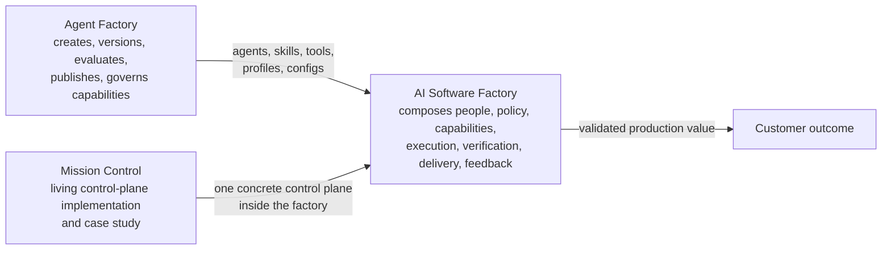
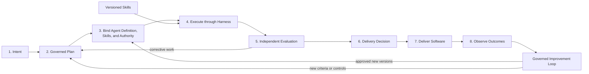
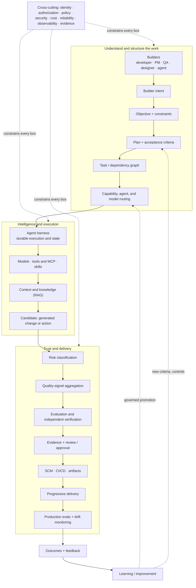
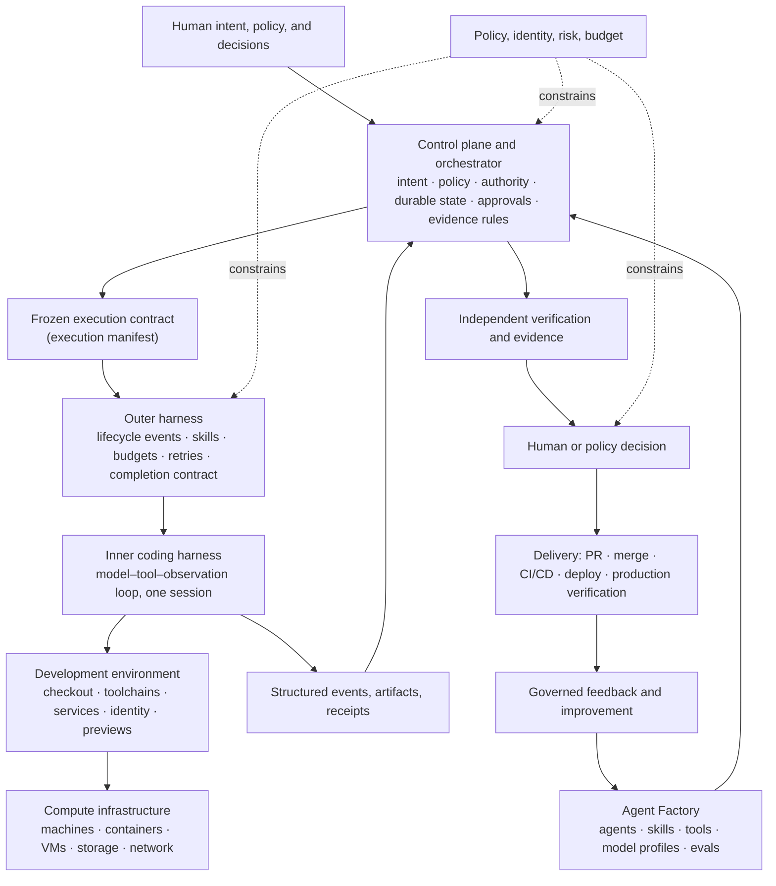
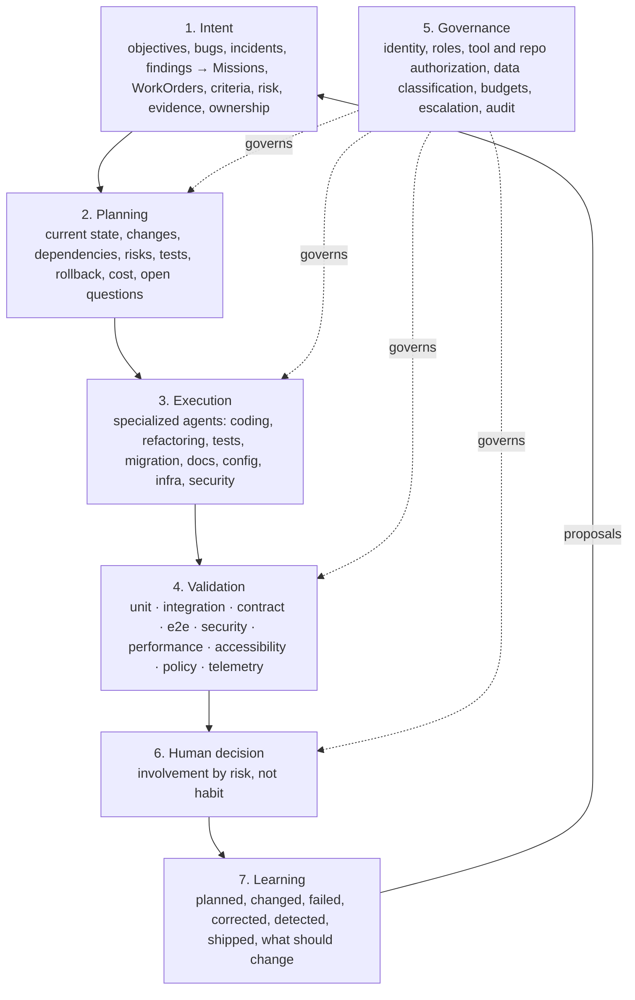
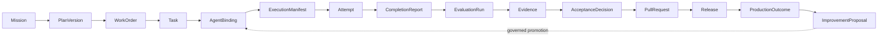

# 2. The factory in one view

Chapter 1 argued that the thing worth building is an operating model. This chapter draws it. You will see the factory three ways that must agree: as a layered stack of components with one responsibility each, as a lifecycle of records and decisions from intent to outcome, and as a set of capabilities the rest of the book fills in. Keep three ideas as you read: the agent is a worker, not the factory; execution never creates its own authority; and validated customer value, not generated code, is the outcome that matters.

## The problem

The words in this field have collapsed into each other. Agent, harness, runtime, platform, orchestration, control plane, and software factory get used as if they name one thing. When responsibilities blur, a team cannot tell which component owns authority, which part may be replaced, where reliability controls belong, or what a vendor is actually selling. A coding agent can produce a patch without being a factory. A harness can run an agent without owning business intent. A remote sandbox can supply compute without deciding whether an Attempt is authorized. A control plane can govern work without implementing the model loop.

The collapse has a history. The stack grew out of interactive coding tools rather than one shared architecture, and products expanded vertically: a model acquired tools, a CLI acquired session state, a cloud runner acquired orchestration, a web UI acquired scheduling. The products are useful, but their commercial boundaries do not match durable engineering boundaries, and **harness** alone can mean the model-tool loop, the wrapper that supervises it, or the entire execution platform.

The words for progress are just as loose. "The agent is defined" may mean a prompt was written, a versioned configuration selected, or a credential granted. "Done" may mean the model stopped, tests passed, a pull request opened, a human accepted the work, or production value was observed. Each claim has a different owner and evidence requirement, and the memorable one-line description of the factory turns misleading the moment someone reads it as eight serial services. This chapter gives every component one responsibility, every stage one contract, and every claim one owner.

## How it works

### Three definitions

<!-- infographic: three-definitions -->
> **Infographic — Agent Factory, AI Software Factory, Mission Control.** *(Jay's graphic goes here.)* Until then, the diagram below carries the same concept.

The **Agent Factory** creates, versions, evaluates, publishes, and governs reusable capabilities such as agents, skills, tools, model profiles, and configurations. The **AI Software Factory** composes people, policy, capabilities, execution, verification, delivery, and feedback from intent through validated production value. **Mission Control** is the living implementation and case study for the control-plane responsibilities required to govern execution, evidence, and human authority; it is not the definition of the complete factory and should not absorb every execution or delivery responsibility into one service. The Agent Factory supplies parts; the software factory uses them to turn governed intent into value; Mission Control is one concrete control plane, studied with its gaps visible. Seen from Mission Control's side, the same three things stack as layers: a coding agent or harness performs bounded engineering work; the Software Factory is the production system around that work (workflow, execution environment, policies, budgets, verification, recovery, delivery contract) that repeatedly produces trusted change; and the control plane above coordinates missions and factories across projects, preserves durable state and authority, and routes scarce human attention. *The harness performs the work. The factory produces trusted change. The control plane governs authority and attention.* Harnesses stay replaceable execution backends; the governed delivery contract is what is not replaceable.

Chapter 1's table separated assistant, agent, platform, and factory: an assistant leaves the governed lifecycle and outcome ownership outside its boundary; a coding agent leaves portfolio control, durable governance, and complete delivery lineage outside; an agent platform may still need a delivery operating model designed around it; a factory governs the path from intent to validated value while humans keep accountability and material risk decisions. Multi-agent orchestration must be available, but a simple job should use the simplest executor that satisfies its contract.

### Five systems, five verbs

Zoom out one step further and the three definitions sit inside five systems that any enterprise ends up running, whatever it calls them. Keeping them apart is the single most useful thing you can do before an architecture review, because each has a different owner, a different release clock, and a different failure signature.

<!-- infographic: five-systems -->
> **Infographic — Creates, executes, grounds, delivers, governs.** *(Jay's graphic goes here.)* Until then, the table below carries the same concept.

| System | One-word job | What it owns | Typical shape |
| --- | --- | --- | --- |
| Agent runtime (execution platform) | Executes | Model invocation, agent lifecycle, context assembly, state, tool discovery and execution, permissions, the loop, budgets, timeouts, checkpoints, recovery, observability, evaluation hooks, human intervention | Harness plus runtime; workflow engine for explicit-state or branching work; sandboxed workers; tracing and evals wired in |
| Enterprise knowledge layer | Grounds | Ingestion and ETL with orchestration, normalise and chunk, hybrid lexical and vector retrieval, reranking, permission filtering, citations and provenance, freshness, retrieval evaluation, tracing | A retrieval service with its own pipeline, evals, and access control |
| Agent Factory | Creates | Agent definitions, skills, tools and their registry, model configurations, context requirements, versioning, ownership, capability registry, publishing and discovery, deprecation, evaluation suites, policy, feedback | A catalogue with a lifecycle, not a folder of prompts |
| Software Factory | Delivers | Builder intent → plan → task graph → capability routing → runtime → models, skills, tools → knowledge → generated change → verification and evaluation → evidence → human review → Git → CI/CD → production → observe → learn | The value stream this chapter draws |
| Control plane (Mission Control) | Governs | Missions, Plans, WorkOrders, execution authority, verification, evidence, acceptance, delivery, and the routing of scarce human attention | The durable authority layer above harnesses and factories |

*The Agent Factory creates. The runtime executes. Knowledge grounds. The Software Factory delivers. The control plane governs.* The Agent Factory can plug into the control plane as a capability source; the control plane never becomes the place where agents are authored, and the runtime never becomes the place where authority is decided. Two design rules follow. Use the lightest orchestration model that satisfies the workflow: a single-agent loop for most bounded work, an explicit-state workflow engine only where branching, waiting, and parallelism make state a first-class problem. And choose implementation language per subsystem, not by ideology: the retrieval pipeline, the runtime, and the control plane have different ecosystems, and a factory that forces one language on all five systems pays for the purity in every one of them.

### The factory in one line

<!-- infographic: factory-in-one-line -->
> **Infographic — Intent → Plan → Define Agent → Execute through Harness → Apply Skills → Evaluate → Improve → Deliver Software.** *(Jay's graphic goes here.)* Until then, the diagram below carries the same concept.

The line is a value-stream mnemonic, not a call graph. Skills are selected and frozen before execution, then applied inside the harnessed loop. Improvement consumes evaluation and production evidence to create governed candidates for future runs; it cannot self-promote or mutate the active Attempt. *Define Agent* means binding an approved, versioned Agent Definition to the work, not inventing an agent per task. *Deliver Software* begins with an authorized delivery decision and ends with observed technical and customer outcomes. A slogan hides feedback and concurrency; a full state machine is too complex as an entry point; so use the mnemonic for orientation and the lifecycle contract below for design and operations. The factory is not an AI coding assistant. It is the platform and control system that makes agentic software engineering repeatable, governed, measurable, and scalable across thousands of engineers.

Each stage has its own page with the full contract, records, and failure modes. Click a stage: [1. Builder intent](../stages/01-builder-intent.md) · [2. Plan](../stages/02-plan.md) · [3. Define agent](../stages/03-define-agent.md) · [4. Execute through harness](../stages/04-execute-through-harness.md) · [5. Apply skills](../stages/05-apply-skills.md) · [6. Evaluate](../stages/06-evaluate.md) · [7. Improve](../stages/07-improve.md) · [8. Deliver software](../stages/08-deliver-software.md).

Two shorter hooks carry the same stream when you need it from memory. The seven-verb form is **Intent → Plan → Route → Execute → Verify → Deliver → Learn**, which adds the routing decision the eight-stage line folds into *Define Agent*. The ten-verb form, **Understand → Plan → Execute → Equip → Ground → Route → Verify → Learn → Protect → Scale**, is organised by capability rather than by sequence: understand intent, plan it, execute through a harness, equip the agent with skills and tools, ground it in governed context, route to the right model, verify with evidence, learn from outcomes, protect the whole thing with security and reliability, and scale it across builders. The whole factory in one sentence: it understands intent, creates a governed plan, executes it through a durable harness using the right models, skills, tools, and context, verifies the outcome with evidence, delivers it according to risk, and learns from production, while keeping authority outside the model.

The same stream reads differently depending on who is looking at it, and it helps to keep both readings. From the builder's chair it is the **Builder loop**: Intent → Plan → Configure agents, harnesses, skills, and tools → Execute → Verify and evaluate → Deliver → Observe → Improve. From the control plane it is the **governed delivery lifecycle**: Mission → approved Plan → WorkOrder → Task → Attempt → candidate → independent evidence → pull request → human decision → release → observed outcome → governed learning. The first is what a person experiences; the second is what the records enforce, and every arrow in either form is a gate, not an optimistic handoff. [Chapter 34](../06-improve/34-mission-control-as-a-living-case-study.md) lays the lifecycle out stage by stage with what each stage does not authorize.

### The master whiteboard

Before the layered stack, here is the version you would draw top to bottom on a whiteboard if someone asked what the factory actually does to a piece of work. It is longer than the one-line mnemonic because it shows where risk, evidence, and delivery sit, and it puts the controls where they belong: alongside everything, not in a box at the end.

<!-- infographic: master-whiteboard -->
> **Infographic — The master whiteboard.** *(Jay's graphic goes here.)* Until then, the diagram below carries the same concept.

Read it in four bands. The top understands and structures the work: a builder's intent becomes an explicit objective with constraints, then a plan with acceptance criteria, then a task graph, then a routing decision about which capability should do each piece. The middle provides intelligence and execution: a harness that owns durable state runs models, tools, and skills against governed context and produces a candidate. The bottom establishes trust and delivers: the candidate is risk-classified, its quality signals are aggregated, it is independently verified, the evidence goes to review or approval, and only then does it flow into the ordinary supply chain of source control, CI/CD, artifacts, and progressive delivery, followed by production evaluation and drift monitoring. The loop at the end improves the next run. Identity, authorization, policy, security, economics, reliability, observability, and evidence are cross-cutting controls; a whiteboard that draws them as the last box has already lost the argument, because a control applied only at the end cannot stop an unauthorised tool call in the middle.

The compact version fits on one line and is worth being able to reproduce: builder intent → specification and plan → agent harness → context, memory, and state → model routing → agents, skills, and tools → isolated execution → verification and evaluation → evidence → human and policy gates → delivery → outcome signals → feedback and improvement, and around again. Two principles fall out of the picture. *The model is a component; the factory is the system.* And *the model does not own the workflow; the platform does.* Models change constantly, and the strategic value is never any one of them; the durable asset is the system around them: harness, context, skills, tools, evaluation, security, observability, execution, and learning. That is also the compounding argument for building a factory at all: when one team discovers a better skill, context strategy, evaluation method, or execution pattern, the factory turns it into a reusable capability for every builder, so the whole engineering organisation gets better with every cycle.

### Six architectural areas and who owns each layer

The whiteboard is a flow. The same system cut by responsibility gives six architectural areas, which is the cut to use when assigning teams, because each area has a distinct kind of expertise and a distinct failure signature.

<!-- infographic: six-areas -->
> **Infographic — The six architectural areas.** *(Jay's graphic goes here.)* Until then, the table below carries the same concept.

| Area | What it covers | Fails as |
| --- | --- | --- |
| Intent layer | Goal understanding; requirements through spec-driven and test-driven development; acceptance criteria; planning; task decomposition | An agent efficiently solving the wrong problem |
| Harness | Execution loop, agent lifecycle, tool orchestration, state, checkpointing, recovery | Work that lives only in model context and cannot resume |
| Capability layer | Agent definitions, skills, tools, MCP, context services | Prompts without contracts; tools without governance |
| Model layer | Model abstraction, capability matching, routing, cost, latency, and quality tradeoffs | Vendor names in the architecture; no re-evaluation on switch |
| Trust layer | Evaluation, verification, policy, security, observability, human oversight | Agents certifying their own work; review that cannot scale |
| Learning layer | Outcome signals, failure taxonomy, experimentation, baseline comparison, controlled improvement | Learning that silently promotes itself |

The thesis under all six is *trust the system, not the model*. The durable value is the harness, context, tools, skills, execution, state, identity, permissions, evaluation, verification, observability, recovery, feedback, and governance; a stronger model improves every one of those without replacing any of them. Zoom in once more and the areas resolve into fourteen layers, each with an owner:

| Layer | Owns |
| --- | --- |
| Experience | CLI, IDE, APIs, developer workflows; every surface converges on one execution contract |
| Intent | Goals, specifications, acceptance criteria |
| Harness | Execution loop, state, orchestration |
| Agents | Definitions, roles, capabilities |
| Context | Retrieval, memory, state, provenance |
| Models | Abstraction and routing |
| Tools | MCP, APIs, Git, engineering systems |
| Skills | Reusable, bounded capabilities |
| Execution | Sandboxing, isolation, checkpoints |
| Governance | Identity, permissions, policies |
| Evaluation | Evals, graders, regression |
| Observability | Traces, telemetry, costs |
| Recovery | Retry, resume, rollback |
| Improvement | Outcome-driven feedback loops |

The ownership rule for the whole table is the one that keeps a platform team from drowning: domain teams own their business workflows, and the platform centralises the expensive, risky, undifferentiated capabilities every team would otherwise rebuild. Identity, the model gateway, the harness, tool governance, the skills framework, evaluation infrastructure, observability, cost attribution, and evidence interfaces are central; domain skills, product knowledge, specialised agents, product-specific acceptance criteria, and differentiated workflows are federated. [Chapter 27](../05-operate/27-the-factory-as-a-platform.md) turns that rule into an operating model.

### The system map

This is the canonical architecture diagram of the book. Everything later is a zoom into one of its boxes.

<!-- infographic: layered-stack -->
> **Infographic — The layered stack: control path and execution stack.** *(Jay's graphic goes here.)* Until then, the diagram below carries the same concept.

Read it both ways. The downward path delegates bounded capability: a human decision becomes a governed record in the control plane, which compiles a frozen contract, which the outer harness turns into a supervised session, which the inner harness runs against a development environment on some compute. The upward path reports observations: structured events, artifacts, and receipts flow back to the control plane, which routes them to independent verification and then to a human or policy decision. Neither path lets an executor mint authority or certify its own material work.

Two planes sit inside the picture. The **control plane** decides whether work is allowed, records authoritative state, and evaluates the evidence required for progression; it hands bounded authority down, receives artifacts and receipts back, sends frozen criteria and artifacts to independent validation, and puts the resulting evidence in front of a human who approves, rejects, revises, or escalates. The **execution plane** performs work through agents and tools. An external system such as GitHub Actions or Argo CD may execute deployment, but the factory governs the decision, policy, evidence, and approval. Think of air-traffic control: the tower never flies the aircraft, but nothing takes off, changes altitude, or lands without a clearance, and every clearance is recorded.

Each layer is named by the responsibility it owns and by what it does not prove.

| Layer | Owns | Does not prove or own |
| --- | --- | --- |
| AI coding agent | Pursues a bounded repository outcome through reasoning and tools | Business authority, acceptance, merge, or release |
| Inner harness | Runs the model-tool-observation loop and manages one coding session | Durable cross-run workflow state or organizational approval |
| Outer harness | Adapts, supervises, and operationalizes an inner harness through lifecycle events, skills, budgets, retries, and completion contracts | Mission authority or acceptance of its own output |
| Development environment | Supplies checkout, toolchains, dependencies, services, identity bindings, and previews needed to build and test | Permission to widen scope or publish |
| Compute infrastructure | Supplies machines, containers, VMs, storage, network, and capacity | A trustworthy environment or authorized execution |
| Orchestrator | Sequences authorized work, dispatches Attempts, reacts to events, reconciles state | Approval of its own plan or evidence |
| Control plane | Owns intent, policy, authority, durable state, approvals, evidence requirements, governance decisions | The implementation work performed by executors |
| Agent platform | Reusable runtime services: tools, context, identity, routing, memory, telemetry | End-to-end software-delivery governance |
| Agent Factory | Creates, packages, versions, evaluates, publishes, discovers, admits, deprecates, and revokes reusable capabilities | Delivery of a particular business outcome |
| AI Software Factory | Composes people, policies, capabilities, execution, assurance, delivery, and learning from intent to validated value | A single agent, model, harness, or control-plane product |

The inner/outer split is a conceptual boundary, not a requirement for two deployable services; a small system may implement both in one process with separate contracts, and calling every wrapper an outer harness is abstraction for its own sake. Introduce the boundary when it clarifies replacement, authority, testing, or operations. [Chapter 11](../03-build/11-control-plane-orchestrator-and-execution-plane.md) and [Chapter 13](../03-build/13-coding-harnesses-and-agent-protocols.md) go deep.

### Build, buy, or bring your own

Practitioners who have built factories in the open describe the same five layers from the bottom: **compute**, **development environment**, **inner harness**, **outer harness**, and **control plane and orchestration**. Every one can be bought or built. Compute is a mature market: your own EC2 or Kubernetes, a rack of spare laptops, a managed sandbox API that provisions into your cloud, or execution sent entirely to a vendor; how much cloud you bring depends on the layers above.

The development environment is the controversial layer and the one teams most often end up owning. It is more than an image with the right runtime: it is the toolchains that compile and test your software, a way to see what the agent built (a preview URL), the shared internal services a real product needs at development time (a team may run four layers locally while the application depends on fifty shared services), and **identity**, the credentials and bindings that let a session reach internal systems. That is why it is its own layer rather than part of the harness or the infrastructure. Once execution moves into a vendor's cloud, "use this base image" is easy, but opening your network to a session in someone else's compute, and debugging a toolchain on an emulated kernel, is friction. The largest companies solved this long ago with on-demand cloud workstations, no local checkouts, and shareable internal URLs pointed at the right services; the industry is rebuilding that golden stack. For small applications a vertical cloud agent may suffice; for real products, expect to own this layer.

The harness splits into an inner harness you buy or build on an open one, and an outer harness of your own skills, loops, hooks, and completion rules; a thin inner harness with a rich outer one, or a batteries-included inner harness with a thin outer layer, are both legitimate. The outer harness is where teams put hard-coded loops such as "fix review-bot findings until mergeable, at most three iterations, then hand to a human," and an **agentic merge queue** that keeps an approved branch current with main until it lands.

The control plane and orchestration layer is, by the same accounts, the most underserved: dispatching work, session traces, the plans and architecture documents being produced, scheduled and webhook-triggered runs, code review that need not live on the hosting provider's page, permissions and audit over who can talk to what, spend and budgets, and **compounding engineering**, the memory that captures what every engineer keeps telling the agent and folds it into the outer harness. No dominant open-source control plane exists yet, partly because every company defines an "issue" differently and would rather write the integration than configure someone else's, the seed of the extensible-software argument in [Chapter 36](../06-improve/36-where-this-is-going.md).

The principle is **composition over inheritance**. Most teams buy the whole stack or build the whole stack, and vertically integrated products (as of mid-2026: cloud coding agents from the major model vendors with their own sandboxes and scheduled automations, and agent companies that bring harness and tooling into compute you run) make buying everything attractive because the first experience is good. The cost is that policy, telemetry, execution, and environment assumptions concentrate in one provider; a composed stack preserves choice but moves compatibility testing and failure ownership to you. So build-versus-buy is not one decision: buy an inner harness, build the control plane, bring your own development environment, use managed compute. Judge each layer on differentiation, security, integration depth, operability, portability, cost, and exit difficulty.

Composition works only when interfaces are products with versioned contracts:

- **Control plane to outer harness:** Attempt identity, manifest, scope, budgets, cancellation, completion schema, event contract.
- **Outer to inner harness:** session lifecycle, instructions, tools, approvals, environment, structured output, stop behavior.
- **Harness to development environment:** filesystem, command, process, preview, service, secret, network.
- **Development environment to compute:** provision, start, suspend, snapshot, measure, terminate, reconcile.
- **Agent Factory to consumers:** capability identity, version, provenance, compatibility, evaluation, policy, ownership, lifecycle status.

A lowest-common-denominator adapter that drops hooks, cancellation, provenance, or tool events buys apparent portability and real operational blindness. Today's candidate protocols between control plane and harness are narrow and carry no lifecycle hooks because every inner harness exposes different ones ([Chapter 13](../03-build/13-coding-harnesses-and-agent-protocols.md) covers ACP, AG-UI, MCP, and hooks). Swappability is proven by behavioral compatibility tests, never by a matching product name.

### Seven layers of Mission Control

Where the stack describes components, Mission Control's own architecture is seven functional layers of a control plane, a different cut of the same system.

<!-- infographic: seven-layers -->
> **Infographic — The seven layers of Mission Control.** *(Jay's graphic goes here.)* Until then, the diagram below carries the same concept.

The **intent layer** turns product objectives, customer problems, bugs, feature requests, incidents, security findings, reliability targets, and technical-debt priorities into Missions, WorkOrders, acceptance criteria, constraints, risk classification, required evidence, and ownership. The **planning layer** has agents investigate and propose current-state understanding, relevant code and architecture, proposed changes, dependencies, risks, test strategy, rollback strategy, estimated cost and complexity, and questions needing human judgment; a human approves when risk warrants. The **execution layer** uses specialized agents rather than one giant general-purpose agent. The **validation layer** requires every material change to produce evidence: no agent merely claims success, it proves it. The **governance layer** controls identity, role-based permissions, tool authorization, repository and environment access, data classification, approval policies, spending and execution limits, escalation rules, and audit trails. The **human decision layer** involves people by risk: a low-risk documentation change is autonomous, a moderate-risk application change needs human pull-request approval, a high-risk production or security change needs architecture and release approval, a critical change touching customer data needs multi-party approval. The **learning layer** captures what plan was proposed, what changed, what failed, what humans modified, which tests caught problems, what reached production, what customer outcome followed, and what should change; it turns the factory from automation into an improving system.

On a whiteboard, use five horizontal bands instead: human intent (product goals, issues, incidents, security findings); Mission Control (missions, work orders, orchestration, policy, approvals); specialized agents (investigation, planning, coding, testing, review, operations); engineering systems (GitHub, Jira, CI/CD, cloud, observability, documentation); and evidence and learning (tests, audit logs, telemetry, cost, outcomes, feedback). Put humans beside it at five decision points: intent, plan, code, release, exceptions. The closing line is the whole argument: separating intent, execution, governance, and evidence is what lets an organization increase autonomy without losing control.

### The lifecycle, stage by stage

<!-- infographic: lifecycle -->
> **Infographic — The intent-to-delivery lifecycle and its record spine.** *(Jay's graphic goes here.)* Until then, the diagram below carries the same concept.

Every stage of the one-line factory has a contract: what it consumes, what it produces, and what it may never imply.

| Stage | Primary question | Required input | Authoritative output and exit condition |
| --- | --- | --- | --- |
| Intent | What outcome does the builder need, and why? | Builder request, product context, constraints, accountable owner | Governed objective with scope, risk, success measures, unresolved questions |
| Plan | How can the outcome be achieved and proven? | Approved intent, repository/system facts | Versioned Plan with tasks, dependencies, acceptance criteria, verification, recovery, estimates |
| Define Agent | Which governed executor configuration may perform each task? | Approved Plan, Factory Configuration, policy, capability catalog | Frozen agent/skill/model/tool/context bindings and escalation contract |
| Execute through Harness | How is authorized work performed safely and durably? | Execution manifest, preflight approval | Artifacts, events, checkpoints, tool receipts, completion report, unresolved findings |
| Apply Skills | Which reusable method should shape execution? | Task type, approved skill catalog, agent definition | Versioned skill bindings whose instructions and tools are in the manifest |
| Evaluate | Did the exact artifact satisfy intent and criteria through an acceptable trajectory? | Frozen criteria, exact artifact, execution lineage | Independent evidence, failures, uncertainty, eligibility recommendation |
| Improve | What should change for future runs? | Evaluation, human feedback, incidents, cost, production outcomes | Versioned proposal, experiment, promotion or rejection, rollback record |
| Deliver Software | May this artifact advance, and did it create the intended outcome? | Accepted change, evidence, approvals, provenance, release policy | Review, merge, deployment, observation, rollback readiness, validated outcome |

"Primary" is not exclusive: a product owner may refine intent with an agent, a deterministic planner may handle a known workflow, a human may execute. The contract matters more than the actor.

**Intent** captures the outcome, not the prompt: problem and desired outcome; accountable owner and affected personas; repository, service, environment, and tenant scope; functional and non-functional constraints; risk, reversibility, deadline, budget; success measures and observation window; assumptions, ambiguity, and questions needing human judgment. It exits only when the factory can say what success means and which uncertainty is acceptable; when consequential ambiguity remains, the right result is clarification, not confident decomposition. **Plan** turns intent into tasks, dependencies, ordering, parallelism, expected artifacts, acceptance criteria, validation methods, rollout, rollback, and recovery. Planning is not authority to execute; material revisions create a new version, invalidate downstream bindings, and need impact analysis; dynamic replanning is legitimate only within granted bounds and cannot widen scope, weaken criteria, or add authority. Prefer deterministic workflows for stable, well-specified work; agentic complexity is justified by uncertainty, not novelty.

**Define Agent** binds an **Agent Definition**, a versioned configuration rather than a model name, declaring at minimum role, objective, instructions, capabilities, eligible models, tools, skills, context policy, permissions, budgets, stop conditions, escalation, success criteria, and evaluation policy, and compiles an immutable **execution manifest** naming exact versions of agent, instructions, skills, model-routing policy, tool grants, MCP servers, context package, memory snapshot, policy, budget, and sandbox profile. Keep four things apart: Agent Definition (configured behavior), agent identity (which versioned behavior produced an action), runtime principal (which authenticated process is calling), and credential or authority (which scoped action it may perform). A definition must never become a reusable bearer of broad credentials, and where deterministic automation serves better, the correct binding is no model-driven agent at all.

**Execute through Harness** turns the manifest into bounded work. The harness owns preflight policy, readiness, and capability checks; model routing and fallback within eligibility; sandbox lifecycle, filesystem and network boundaries, secret brokering; context assembly, compaction, refresh; atomic tool execution and schema validation; durable Tasks, Attempts, leases, heartbeats, checkpoints; time, token, cost, concurrency, retry, and action budgets; pause, cancel, quarantine, kill switch, human escalation; structured events, traces, artifacts, audit receipts; and reconciliation after partial or ambiguous external effects. The inner loop stays simple, **Understand → Plan → Act → Observe → Evaluate → Adjust**, and ends through an explicit completion contract: a report stating `succeeded`, `partial`, `blocked`, `failed`, or `cancelled`, summarizing the work, identifying exact artifacts, mapping results to criteria, recording unresolved findings, and naming any required human action. Runtime completion still does not accept the WorkOrder. Tools are narrow, composable primitives; the model chooses how to use them, deterministic code enforces identity, policy, validation, state transitions, and irreversible boundaries.

**Apply Skills** uses a **skill**, a reusable versioned method for a class of tasks packaging instructions, decision criteria, examples, required context, and tool-use patterns; it is not a tool, credential, policy exception, or proof of quality. Its lifecycle: discover eligible skills from task intent and Agent Definition; filter by owner, version, scope, security classification, and evaluation; bind exact versions into the manifest; load only relevant content; observe usage and outcomes; evaluate before promotion or retirement. A skill may teach an agent how to deploy; the deployment tool and policy gate still own the authority, and skill text and tool or MCP output are untrusted inputs unless provenance says otherwise.

**Evaluate** asks two questions: **artifact evaluation** (is the exact change correct, secure, useful, maintainable, aligned with criteria?) and **trajectory evaluation** (did the run use permitted context, tools, authority, budgets, and recovery behavior without hiding material failure?). Use deterministic checks wherever possible (compilation, tests, linters, scanners, policy engines, schema validation, provenance verification, reproducible environments) and calibrated model-based evaluators where judgment is needed. Evidence binds verifier and method to exact criteria, artifact digest, environment, time, and result; missing, stale, contradictory, or failed evidence stays visible; the agent that produced the work cannot accept it.

**Improve** is a separate change-management loop for the factory: **Observe → Curate Dataset → Cluster Failure → Propose Candidate → Compare with Baseline → Review → Canary → Promote or Roll Back**. Observation, clustering, proposal, and experimentation can be automated; promotion stays governed and the previous version stays recoverable; improvement need not block delivery of the current artifact unless evaluation found a defect or control gap. **Deliver Software** keeps its states apart: **Review-ready → Approved → Merged → Release eligible → Deployed → Technically verified → Outcome observed → Accepted or Corrective Work**. The factory may delegate build and deployment mechanics to existing CI/CD while retaining policy, evidence, approval, lineage, and reconciliation; progressive rollout, feature flags, canaries, health gates, kill switches, rollback, and post-deployment observation are part of the contract. A pull request is a review artifact and a deployment a technical event; neither proves the customer outcome.

Mission Control's own lifecycle uses twelve states, intake, clarification, investigation, planning, plan approval, execution, automated validation, human review, deployment, production verification, observation, and learning and closure, each with entry criteria, exit criteria, owner, required evidence, allowed tools, approval conditions, and failure and escalation paths. That is quality engineering applied to agents: reliable delivery comes from controlled transitions, not from capability alone.

Eight invariants hold across stages: every Task and artifact traces to approved intent and criteria; every Attempt freezes its agent, skill, model-routing, context, tool, policy, budget, and environment versions; authority is explicit, least-privilege, time-bounded, revocable; agent, runtime principal, credential, and accountable human stay distinct; runtime completion, independent evidence, acceptance, and delivery are separate transitions; retries create attributable Attempts and idempotency plus reconciliation prevent duplicate external effects; consequential actions produce evidence under risk-proportional human authority; and factory improvements follow the same specification, evaluation, promotion, versioning, and rollback discipline as customer software.

The record spine in the diagram is the minimum. The full hierarchy is `Company → Workspace → Repository → Factory Configuration → Mission → Approved Plan → WorkOrder → Task → Attempt → Evidence → Pull Request → Release`; the delivery chain is `Mission → WorkOrder → Task → Attempt → Evidence → Pull Request → Release`. A Mission states the governed outcome; a Plan is a versioned execution contract whose approval authorizes exact work but neither dispatches an agent nor approves a merge; a WorkOrder is a bounded unit of authority and acceptance; Tasks organize execution; Attempts preserve each immutable try; Evidence supports or refutes criteria; pull requests and releases stay distinct governed outcomes. This prevents **optimistic state propagation**: a successful Attempt does not accept a Task, a completed Task does not accept a WorkOrder, a merged pull request does not prove production value. Names may vary; the invariant is that authority, work, evidence, decisions, delivery, outcomes, and learning are never reconstructed from chat transcripts or telemetry. [Chapter 5](../02-design/05-authoritative-records.md) defines every record.

| Stage | Leading measures | Failure signal |
| --- | --- | --- |
| Intent | clarification rate, criterion completeness, time to accepted intent | downstream rework from misunderstood goals |
| Plan | plan-assurance pass rate, dependency accuracy, estimate calibration | material replan after execution begins |
| Define Agent | eligible-binding rate, policy denials, configuration drift | execution with stale or unauthorized components |
| Execute | retry-free completion, blocked/partial rate, recovery time, cost | duplicate effects, runaway loops, silent stalls |
| Apply Skills | selection precision, outcome lift, version adoption | skill adds cost or failure without quality gain |
| Evaluate | criterion coverage, escape rate, validator disagreement, freshness | accepted artifact later contradicted by known evidence |
| Improve | experiment cycle time, promotion quality, rollback frequency | candidate regression or unauthorized self-promotion |
| Deliver | PR acceptance, lead time, change failure, rollback, outcome attainment | technically healthy release with failed customer outcome |

Optimize the whole stream; cutting token cost while raising human correction or change failure is not progress.

### Five platform commitments

Five commitments tie stack and lifecycle to a product. **Builder intent becomes the interface**: start with the outcome a builder wants, not the agent topology; developers first, then product managers, quality engineers, designers, security engineers, and other builders, each expressing intent, constraints, criteria, and risk through a surface suited to their work without understanding the model, agent, tool, or orchestration underneath. **Models become interchangeable execution resources**: they sit behind a governed gateway, routing is model-independent and based on required capability, measured quality, cost, latency, context window, security and data policy, availability, historical task performance, and fallback behavior; a provider name is never the architecture. **The harness, not the model, creates production reliability**: models reason and propose; the harness owns tools, state, permissions, recovery, stop conditions, sandboxing, execution control, observability, time, and budget. **Agents do not certify their own work**: completion requires independent verification, deterministic checks, trajectory evaluation, and baseline comparison, with human authority for consequential actions, and both artifact and path are evaluated. **Learning is automated; promotion is governed**: production signals may build datasets, cluster failures, and propose changes to prompts, skills, tools, routes, or policies, but a candidate becomes the default only after evaluation, baseline comparison, risk-appropriate approval, controlled rollout, and retained rollback.

| Persona | Intent they express | Evidence they need back |
| --- | --- | --- |
| Developer | Implement, debug, refactor, test, or review a bounded change | Diff, tests, diagnostics, decisions, unresolved risk, review-ready PR |
| Product manager | Deliver an outcome within scope, policy, and time | Criteria coverage, product behavior, tradeoffs, release state, outcome measures |
| Quality engineer | Prove behavior, failure handling, regression safety | Independent test results, risk and criteria coverage, reproducible evidence |
| Designer | Change an experience within system and accessibility constraints | Visual and interaction evidence, state coverage, accessibility checks, fidelity |
| Security or platform engineer | Enforce a control, integration, or paved path | Policy decisions, identity and provenance, denial evidence, adoption, reliability |

Every builder surface shows lifecycle state, approvals, failures, recovery actions, costs, and evidence, and hides internal agent complexity unless it helps the builder decide.

### The capability model

The capability taxonomy groups what a factory must do into seven areas, and the book's parts map onto them. **Intent and planning** (intent recognition and goal interpretation, task decomposition and definition, planning and dependency mapping, acceptance criteria, constraint identification, agent routing, dynamic replanning) is [Chapter 6](../02-design/06-intent-and-specification-engineering.md). **Agent definitions** (role, instructions, capabilities, policies, goals, permissions, tool access, model configuration, autonomy level, escalation rules, success criteria; configuration and provenance, never a credential) is [Chapter 10](../03-build/10-the-agent-factory.md). The **agent harness** (runtime, execution loop, model abstraction and routing, context and context-window management, tools and MCP, state, memory, sandboxes, guardrails, human-in-the-loop, observability, error recovery, orchestration) spans [Chapters 11–18](../03-build/11-control-plane-orchestrator-and-execution-plane.md). The **skills framework** (coding, testing, debugging, deployment, security, repository, organization-specific, and workflow skills; tool composition, versioning, discovery, evaluation, staged rollout, retirement) is in [Chapters 10](../03-build/10-the-agent-factory.md) and [18](../03-build/18-agent-and-loop-engineering.md). **Evaluation** (task completion, intent alignment, correctness, code quality, functional behavior, security, policy compliance, regression, LLM-as-judge, deterministic evals, quality metrics, evaluation datasets, production evals) is Part IV. **Feedback and self-improvement** (failure and root-cause analysis, feedback loop, strategy, skill, context, prompt, and tool optimization, eval-driven development, learning from success, regression detection, experimentation and A/B testing, continuous improvement) is Part VI. **Software delivery** (repository, branching, pull requests, code review, CI/CD, unit, integration, and end-to-end testing, static analysis, build verification, verification gates, artifact management, deployment, rollback, release management, production validation, observability) is [Chapter 25](../04-prove/25-cicd-progressive-delivery-and-production-verification.md). A passing agent run is not a release decision.

### What the rest of the book expands

The reference architecture behind the system map has eighteen components, each with an owned responsibility and a critical evidence or control: builder surfaces, intent and planning, agent definitions, model gateway and router, context and memory, tools and MCP, skills, harness and runtime, execution sandbox, state and recovery, evaluation, feedback and learning, policy engine, observability (which explains behavior without becoming authority), human approvals, deployment, multi-tenancy, and adoption and versioning. Each later chapter opens with its component's evidence contract; together they are the table of contents for Parts III–V.

Five previews so the shape is visible now. The **model router** removes candidates that violate capability, security, availability, or quality requirements, then ranks the rest by measured task performance, latency, and total cost; fallback may relax cost or latency but never capability, security, or policy; the routing unit is the complete agent configuration, not the model ([Chapter 17](../03-build/17-models-routing-and-capability-selection.md)). **Harness reliability controls** (classified and capped retries, durable checkpoints, idempotency keys and leases, permission and tenant boundaries, budgets across time, tokens, tools, compute, concurrency, and money, stop conditions and runaway-loop detection, kill switches from provider scope to global, risk-based approval gates, separate execution and publication identities, reconciliation, immutable evidence) must cover production-agent failure, security incidents, reliability regression, model degradation, tool misuse, cost explosion, prompt injection, unauthorized access, failed deployments, evaluation regression, and provider outages ([Chapters 11–12](../03-build/12-durable-execution.md)). The **incident playbook** is one sequence for every incident class, **Clarify → Contain → Observe → Isolate → Restore → Correct → Prevent → Measure**, rehearsed for prompt injection, malicious repository content, secret exfiltration, tool poisoning, privilege escalation, unauthorized file changes, sandbox escape, approval bypass, supply-chain compromise, cross-tenant leakage, and runaway spend, under one security thesis: an agent receives the minimum context, tools, permissions, time, and budget the task requires, and every consequential action produces evidence ([Chapters 26](../04-prove/26-security.md) and [29](../05-operate/29-resilience-incidents-and-the-control-tower.md)). The **learning system** is an evidence pipeline with a governed release process whose records are `ExecutionOutcome`, `DatasetVersion`, `FailureCluster`, `ImprovementProposal`, `EvaluationRun`, `PromotionDecision`, and `RollbackRecord`; promotion needs a representative sample, no critical security or policy regression, quality floors, acceptable human correction, bounded cost and latency, an approved rollback, and proportional authority; reward- or preference-learning specialists receive governed dataset versions and experiment manifests, never raw traces ([Chapter 33](../06-improve/33-governed-learning-and-compounding-engineering.md)). The **adoption model** starts with developers and one valuable, repeatable, reversible workflow, expands to other builders once intent, evidence, and authority contracts are stable, and runs on design partners, forward-deployed engineers, internal champions, weekly usage and reliability reviews, controlled release experiments, paved paths with migration support, versioned contracts with deprecation windows, internal go-to-market, and dashboards segmented by organization, persona, workflow, risk tier, and version; its **platform metrics** (time to first successful workflow, task and criterion success, PR acceptance, human correction and override rate, routing quality and fallback, cost per accepted outcome, reliability and SLOs, repeat usage, time to onboard a team, bespoke capabilities retired, builder satisfaction and review burden, adoption across organizations) sit beside Chapter 1's three outcome measures, always segmented by workflow, risk, repository, version, and cohort ([Chapters 8](../02-design/08-economics-metrics-and-human-attention.md), [27](../05-operate/27-the-factory-as-a-platform.md), [31](../05-operate/31-enterprise-adoption-and-the-infrastructure-landscape.md)). Building it needs coordinated ownership across harness and Agent Definitions, skills and tools, context and memory, evaluation and learning, infrastructure and observability, deployment and operations, model independence and token economics, security and human oversight, principal machine-learning engineering, forward-deployed engineering, and leadership for build-versus-buy and progressive autonomy. The objective is never the number of agents or components; it is a simple, trustworthy builder experience backed by explicit execution control, independent evidence, and governed improvement.

## How to build it

Draw your own system map before choosing any product, with every canonical layer assigned to a component you build, buy, or bring and every interface named with its contract. Then run the design review that applies to the platform and to its learning system:

1. **Requirements:** which builder outcome, risk boundary, success condition, and non-goal does the design serve?
2. **Scale:** how many builders, teams, tenants, repositories, runs, tools, events, artifacts, providers?
3. **APIs:** which commands request work, which events report facts, which service owns each authoritative mutation?
4. **Data model:** identities, versions, scopes, state machines, lineage, retention, idempotency keys.
5. **Reliability:** how it retries, resumes, reconciles, degrades, stops, and recovers without duplicate or unauthorized effects.
6. **Security:** identity, least privilege, secrets, untrusted context, tenant isolation, provenance, audit, human authority.
7. **Tradeoffs:** complexity, latency, cost, lock-in, operator burden.
8. **Build, adopt, or partner:** which capability is differentiating control logic, which is commodity, which needs a specialist.
9. **Rollout:** narrow first corridor, baseline, shadow period, canary, promotion gate, migration path, rollback.
10. **Metrics:** which outcome, quality, reliability, adoption, and economics measures prove it works.

Run the product review beside it: customer discovery and builder personas; complete flows with loading, empty, error, success, approval, and recovery states; a roadmap that picks the smallest capability closing the highest-value or highest-risk gap; adoption and internal go-to-market; a path from builder feedback and production outcomes to traceable proposals; and success measures with baseline, target, cohort, window, quality floor, economics threshold, and rollback trigger. Retire bespoke capabilities only after the paved path meets the use case with a supported migration.

Then prove one corridor. The golden path Mission Control was designed around:

1. A human records the outcome, business reason, constraints, risk, and measurable acceptance criteria.
2. An agent researches the selected repository and identifies uncertainty.
3. The factory creates a versioned Plan with WorkOrder boundaries and validation assertions.
4. A human approves the exact Plan version.
5. The control plane performs policy and capability preflight.
6. Authorized Tasks execute through immutable Attempts in isolated worktrees.
7. Failures are classified; retries require a new hypothesis and stay bounded.
8. Independent validators evaluate the frozen criteria against exact artifacts.
9. The control plane assembles changes, decisions, risks, evidence, and lineage.
10. A human approves, rejects, or requests revision. Merge remains a separate decision.

Make the first demonstration small; Mission Control's was adding a required Business Justification field to Mission creation, chosen to exercise the system rather than showcase a feature. Expand toward deployment and outcome-based improvement only after the corridor is reliable, observable, secure, and accepted by builders.

## Failure modes

**Product boundaries mistaken for authority boundaries.** A team buys a vertical stack and assumes its permission model is the factory's governance. Detect it when nobody can say which component decides an Attempt is authorized. Fix it by assigning every canonical layer an owner and keeping authority in the control plane regardless of what executes.

**The mnemonic read as a call graph.** Skills become a service, improvement mutates the running agent, "deliver" means "open a pull request." Detect it as records that cannot say which stage they belong to. Fix it with the stage contracts and record spine.

**Optimistic state propagation.** A successful Attempt is shown as an accepted Task, a merged PR as delivered value. Detect it as dashboards with fewer states than the lifecycle. Fix it by giving each transition its own record, evidence, and owner.

**Lowest-common-denominator adapters.** An abstraction across harnesses that drops hooks, cancellation, provenance, or tool events. Detect it as an operator who cannot see why a session stopped. Fix it by treating each interface as a versioned product proven by behavioral tests.

**Owning nothing, or everything.** Buying the whole stack concentrates assumptions in one vendor; building it all rebuilds commodity compute and harnesses. Detect it as an inability to replace a failing layer, or a platform team drowning in undifferentiated work. Fix it with per-layer decisions and composition over inheritance.

**Specialization by taste.** Atomic tools raise composability but multiply policy decisions; domain tools cut cost for mature workflows but can hide authority or fuse implementation, approval, and certification; long-running loops add adaptability at the price of latency, cost, and failure surface. Add specialization only after repeated evidence shows the primitive path too costly or inconsistent, and use conventional software for known deterministic transformations.

**Multi-agent by default.** Every WorkOrder gets a crew. Detect it as cost per accepted outcome rising faster than acceptance. A simple job should use the simplest executor that satisfies its contract.

## In Mission Control

At commit [`8014d5a`](https://github.com/jaydubya818/MissionControl/tree/8014d5af427b43ff5c5a63cfdf82ec92742c208c) Mission Control's V1 promise was deliberately narrow: a human defines an outcome, approves a plan, permits governed execution, and receives a validated, review-ready pull request. Its layers were a React, TypeScript, and Vite operator interface (intent capture, approvals, exceptions, evidence, review); Convex as the authoritative control plane (durable domain state, queries, mutations, actions, authorization, audit); a Hono on Node.js orchestration service (long-running coordination, runtime integration, external control boundaries); a workflow executor with adapters as the execution runtime (bounded Tasks, Attempts, tools, worktrees, receipts); and Git worktrees with GitHub integration as the repository boundary (isolated changes, commits, pull requests, lineage). Doctrine: Convex is the single source of truth, the Hono service must not create a competing state store, and the React UI is an operator surface rather than the authority boundary, so server-owned commands enforce policy regardless of caller. Contracts covered Missions, versioned plans, WorkOrders, workflow runs, approval decisions, verification receipts, immutable lifecycle history, explicit acceptance rules, and separate worker and validator roles; missing, failed, stale, or unknown evidence blocks acceptance. None of that proves the V1 promise; the strongest proof remains a browser-operated golden path against a real repository with failure, recovery, independent validation, exact GitHub lineage, and a complete review package. Autonomy was scoped: factory, Mission, WorkOrder, policy, and trust assessment may each impose a ceiling, effective authority is the lowest, a more capable model cannot raise it, promotion needs sustained evidence and an explicit human decision, demotion may be automatic, Level 2 Delegated Execution comes before Level 3 Governed Autonomy, and the Trust Score is an eligibility signal shown in bands, never an authorization grant; policy always wins ([Chapter 3](./03-first-principles-trust-evidence-and-authority.md)).

At study commit [`d902fae`](https://github.com/jaydubya818/MissionControl/tree/d902fae7032c0696b531c44ae88829c652516fc6) the control-plane and execution-plane doctrine is clear, provider-neutral harness lifecycle contracts describe execution through capability manifests and structured results, and the implementation carries versioned agent records, skill discovery and linting, model routes, context packages, sandbox profiles, evaluation mechanisms, and exact model-route, harness, sandbox, worker, and Factory Version admission. Those resemble parts of an Agent Factory, but no canonical Agent Factory boundary with unified publication, admission, compatibility, deprecation, and revocation exists yet, and exact skill-version binding in the manifest remained incomplete. The production execution path was blocked by operator configuration, so architecture and local qualification support the boundary model without proving a live, fleet-scale composed stack. The stated direction (consuming Agent Factory capabilities through versioned manifests, admitting complete stack combinations proven by contract tests, showing operators why a stack was selected, which layer failed, which substitutions remain eligible, and whether a fallback changes security, quality, cost, or evidence, and gating production on live canaries for cancellation, restart, tool events, environment identity, teardown, publication separation, and independent verification) is direction, not current capability.

## Retain this

- Three definitions: the Agent Factory supplies reusable capabilities; the AI Software Factory turns governed intent into validated value using them; Mission Control is one control plane and a case study, not the definition.
- The one-line factory is a value stream, not a call graph: skills are frozen before and applied during execution; improvement changes future versions only through governed promotion; delivery ends at observed outcome.
- The system map has a downward path that delegates bounded capability and an upward path that reports observations; neither lets an executor mint authority or certify its own work.
- Name each layer by what it owns and what it does not prove; a product boundary is a commercial choice, an authority boundary is a safety choice.
- The stack is compute, development environment, inner harness, outer harness, control plane; decide build, buy, or bring per layer, prefer composition over inheritance, and treat every interface as a versioned product proven by behavioral tests.
- Mission Control's seven layers are intent, planning, execution, validation, governance, human decision, and learning; the whiteboard version is five bands with humans at five decision points.
- Every stage has a contract, every transition has a record, and lower-level completion never accepts a higher-level outcome.
- The five commitments: builder intent is the interface; models are interchangeable; the harness makes reliability; agents do not certify their own work; learning is automated and promotion is governed.
- Five systems, five verbs: the Agent Factory creates, the runtime executes, knowledge grounds, the Software Factory delivers, the control plane governs. Use the lightest orchestration that satisfies the workflow; choose language per subsystem.
- The master whiteboard has four bands (understand and structure; intelligence and execution; trust and delivery; learn) and its controls are cross-cutting, never a final box.
- The model is a component; the factory is the system. The model does not own the workflow; the platform does. Trust the system, not the model.
- Six architectural areas (intent, harness, capability, model, trust, learning) and fourteen owned layers; the platform centralises undifferentiated, risky capability and domain teams federate their workflows.
- Memory hooks: Intent → Plan → Route → Execute → Verify → Deliver → Learn; Understand → Plan → Execute → Equip → Ground → Route → Verify → Learn → Protect → Scale.

## Go deeper

- [Chapter 3](./03-first-principles-trust-evidence-and-authority.md) for autonomy levels and trust; [Chapter 5](../02-design/05-authoritative-records.md) for the record spine in full; [Chapter 10](../03-build/10-the-agent-factory.md), [Chapter 11](../03-build/11-control-plane-orchestrator-and-execution-plane.md), [Chapter 13](../03-build/13-coding-harnesses-and-agent-protocols.md), and [Chapter 14](../03-build/14-development-environments-sandboxes-and-compute.md) for each layer of the stack; [Chapter 19](../03-build/19-the-12-layer-production-ai-agent-stack.md) for the AI-engineering cut of the same system.
- [Mission Control capability, workflow, and admission map](../appendix/mission-control/03-capability-workflow-and-admission-map.md), [implementation maturity map](../appendix/mission-control/01-implementation-maturity-and-evidence-map.md), and [verification-first case study](../appendix/mission-control/02-verification-first-software-factory.md); [Appendix F](../appendix/architecture-communication.md) for executive versions of this chapter's diagrams; the [glossary](../appendix/glossary.md) for the canonical terms (AI Software Factory, Agentic Builders Experience, model-independent, Agent Harness, Agent Definition, Execution Loop, Tool Integration, Context Management, Control Mechanism, Execution Environment, Evaluation System, Feedback System, Self-improvement, Skills Framework, Autonomous Agent, Builder Intent, Task Decomposition, Build vs. Buy, Agentic Standards).
- Sources: Jay West, *AI Software Factory Mission* (seven layers, twelve-state lifecycle); *AI Software Factory Study Guide*, chapter 24 (five-layer whiteboard); Jay West, "Key terms and definitions" and "Factory in one line" notes (five commitments, capability taxonomy, canonical terms); Jay West, factory architecture notes (master whiteboard, six architectural areas, layer-ownership table, five-system distinction, memory hooks); HumanLayer × BAML livestream, "Software factory design patterns" (five-layer stack, build versus buy, composition over inheritance, the dev-environment argument, the underserved control plane).
- Primary references carried from v1: [Mission Control North Star](https://github.com/jaydubya818/MissionControl/blob/8014d5af427b43ff5c5a63cfdf82ec92742c208c/docs/product/mission-control-north-star.md), [V1 product strategy](https://github.com/jaydubya818/MissionControl/blob/8014d5af427b43ff5c5a63cfdf82ec92742c208c/docs/product/mission-control-v1-product-strategy.md), [Governed Missions contract](https://github.com/jaydubya818/MissionControl/blob/8014d5af427b43ff5c5a63cfdf82ec92742c208c/docs/software-factory/governed-missions-contract.md), [domain contracts](https://github.com/jaydubya818/MissionControl/blob/8014d5af427b43ff5c5a63cfdf82ec92742c208c/docs/software-factory/domain-contracts.md), [orchestration architecture decision](https://github.com/jaydubya818/MissionControl/blob/8014d5af427b43ff5c5a63cfdf82ec92742c208c/docs/decisions/001-orchestration-architecture.md), [React entry point](https://github.com/jaydubya818/MissionControl/blob/8014d5af427b43ff5c5a63cfdf82ec92742c208c/apps/mission-control-ui/src/main.tsx), [Convex schema](https://github.com/jaydubya818/MissionControl/blob/8014d5af427b43ff5c5a63cfdf82ec92742c208c/convex/schema.ts), [Hono orchestration service](https://github.com/jaydubya818/MissionControl/blob/8014d5af427b43ff5c5a63cfdf82ec92742c208c/apps/orchestration-server/src/index.ts); [Anthropic, Building Effective Agents](https://www.anthropic.com/engineering/building-effective-agents); [Anthropic, Trustworthy Agents in Practice](https://www.anthropic.com/research/trustworthy-agents); [OpenAI, A Practical Guide to Building Agents](https://openai.com/business/guides-and-resources/a-practical-guide-to-building-ai-agents/); [OpenAI, Unrolling the Codex Agent Loop](https://openai.com/index/unrolling-the-codex-agent-loop/); [OpenAI, Harness Engineering](https://openai.com/index/harness-engineering/); [MCP specification 2026-07-28](https://modelcontextprotocol.io/specification/2026-07-28); [NIST AI RMF](https://www.nist.gov/itl/ai-risk-management-framework); [NIST SSDF](https://csrc.nist.gov/projects/ssdf); [OWASP Top 10 for Agentic Applications 2026](https://genai.owasp.org/initiatives/agentic-security-initiative/); [SLSA Provenance 1.2](https://slsa.dev/spec/v1.2/provenance).
