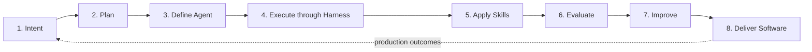
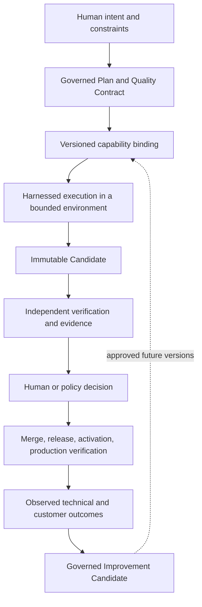

# 2. The factory in one view

An AI software factory is a governed system that turns human intent into validated software outcomes through reusable capabilities and continuously operated loops. Humans define outcomes, standards, exceptions, and consequential decisions. Agents perform bounded work. Deterministic systems preserve state, enforce authority, and assemble evidence.

This guide uses two models throughout:

1. The **eight-stage value stream** explains how work moves from intent to an observed production outcome.
2. The **six-area architecture** explains which part of the system owns each responsibility.

The value stream is the primary reader model. The architecture supports it. Other diagrams in this chapter are explicitly labeled as detail views, implementation views, operating lenses, maturity models, or reference models. They should clarify one of the two models, not compete with them.

Three principles hold across every view: the agent is a worker, not the factory; execution never creates its own authority; and generated code is an intermediate artifact, not the outcome.

## The problem

The vocabulary of agentic software development has collapsed into itself. Agent, harness, runtime, orchestration, control plane, platform, and factory are often used as synonyms. They are not. A coding agent can produce a patch without governing the work. A harness can run an agent without owning business intent. A sandbox can provide compute without deciding whether an Attempt is authorized. A control plane can govern a workflow without implementing the model loop.

The language of progress is equally loose. “The agent is defined” may mean that somebody wrote a prompt, selected a versioned capability, or granted a credential. “Done” may mean that the model stopped, tests passed, a pull request opened, a human accepted the change, or production value was observed. Each claim needs a different owner and different evidence.

Without a shared model, teams make three predictable mistakes. They mistake product boundaries for authority boundaries, so a vendor component quietly becomes the source of policy. They treat a successful run as a correct result, so the producer certifies its own work. And they optimize code generation while leaving planning, evidence, delivery, and learning as informal human cleanup.

The factory model fixes those errors by making the lifecycle, system ownership, and decision rights explicit.

## How it works

### Three definitions

This is a **vocabulary lens**, not another architecture.

- The **Agent Factory** creates, versions, evaluates, publishes, and governs reusable capabilities: Agent Definitions, skills, tools, model profiles, context packages, and configurations.
- The **AI Software Factory** composes people, policy, capabilities, execution, verification, delivery, and feedback to turn governed intent into validated value.
- **Mission Control** is the living control-plane implementation and case study used by this guide. It governs missions, plans, work, evidence, and human decisions; it is not the definition of the entire factory.

The relationship is simple: the Agent Factory supplies approved capabilities; the software factory uses them; Mission Control demonstrates one way to govern their use. The harness performs bounded work. The factory produces trusted change. The control plane governs authority and attention.

An assistant, an agent, and a factory can all be useful. The difference is the outcome boundary. An assistant helps a person. An agent performs delegated work. A factory owns a repeatable path from intent to independently evidenced and delivered outcome while keeping accountability with people and policy.

### Skills → loops → factory

This is a **maturity lens**. A skill packages a reusable way to perform a class of work or judge its quality. A loop repeatedly applies capabilities, observes results, verifies them, and feeds governed improvements into future versions. Connected, governed loops can perform a meaningful portion of the software lifecycle.

Teams usually operate across a continuum: assistance, reusable skills, deterministic automation, bounded agent loops, connected loops, and factory operation. This is not a universal ladder, and the goal is not to put a model in every step. As work becomes understood and stable, conventional automation should replace unnecessary reasoning. [Chapter 38](../05-operate/38-enterprise-adoption-and-the-infrastructure-landscape.md) owns the adoption and maturity treatment.

### Five systems, five verbs

This legacy heading now contains a **responsibility lens**. In practice, six responsibilities must stay distinguishable even when one product implements several of them.

| Responsibility | Verb | Owns | Does not authorize |
| --- | --- | --- | --- |
| Agent Factory | Creates | Versioned agents, skills, tools, profiles, configurations, and their lifecycle | A particular Attempt |
| Runtime | Executes | Workers, capacity, environments, scheduling mechanics, and recovery | Business intent or acceptance |
| Harness | Controls | Model loop, context assembly, tools, budgets, checkpoints, and execution trace | Its own permissions or correctness |
| Knowledge layer | Grounds | Ingestion, retrieval, permissions, provenance, freshness, and retrieval evaluation | Actions based on retrieved content |
| Software Factory | Delivers | The governed value stream from intent through production outcome | Human accountability |
| Control plane | Governs | Durable state, policy, admission, evidence, decisions, and attention | Capability behavior it has not verified |

The names may vary by organization. The ownership must not. Keeping the responsibilities explicit makes components replaceable and failures diagnosable.

### The factory in one line

This is the **primary reader model**:

<!-- infographic: factory-in-one-line -->
> **Infographic — Intent → Plan → Define Agent → Execute through Harness → Apply Skills → Evaluate → Improve → Deliver Software.**

Read the line as a value stream, not as eight serial services. Skills are selected and frozen before execution, then applied inside the harnessed loop. Evaluation can send corrective work back to planning. Improvement changes future capability versions through governed promotion; it cannot mutate the active Attempt. Delivery includes merge, deployment, activation, and production verification. Production outcomes become new signals and intent.

The stages are deliberately verbs because each must transform an input into an output:

1. **Intent** turns a request into an explicit, governed outcome with constraints, criteria, scope, and risk.
2. **Plan** turns that outcome into an approved execution and quality contract.
3. **Define Agent** binds approved capability versions, tools, context policy, budgets, and authority to the work.
4. **Execute through Harness** performs bounded work while deterministic controls own state, permissions, cost, and recovery.
5. **Apply Skills** uses versioned organizational methods without widening the Attempt’s authority.
6. **Evaluate** produces independent, criterion-linked evidence against the exact artifact.
7. **Improve** converts attributed outcomes into evaluated candidates for future factory versions.
8. **Deliver Software** applies the authorized review, merge, rollout, and production-verification path.

The stages separate facts that teams often collapse. Plan approval is not execution dispatch. Execution completion is not verification. Verification is not acceptance. Acceptance is not merge. Merge is not a production outcome. Preserving those distinctions is what makes speed governable.

The eight stage pages are concise orientation briefs. The main chapters own the full mechanisms and tradeoffs: [Intent](../stages/01-builder-intent.md), [Plan](../stages/02-plan.md), [Define Agent](../stages/03-define-agent.md), [Execute through Harness](../stages/04-execute-through-harness.md), [Apply Skills](../stages/05-apply-skills.md), [Evaluate](../stages/06-evaluate.md), [Improve](../stages/07-improve.md), and [Deliver Software](../stages/08-deliver-software.md).

### The master whiteboard

This is a **detail view** of the eight-stage stream. Use it in a design review when the one-line model is too compact.

Identity, authorization, security, policy, cost, reliability, observability, and lineage constrain every box. They are not a final review step. A control that appears only after generation cannot prevent an unauthorized action during execution.

### Six architectural areas and who owns each layer

This is the **supporting architecture model**. It answers a different question from the value stream: where does each responsibility live?

<!-- infographic: six-areas -->
> **Infographic — Intent, Harness, Capability, Model, Trust, and Learning, surrounded by adoption.**

| Area | Core question | Owns | Canonical chapters |
| --- | --- | --- | --- |
| **Intent** | What outcome is authorized, and how will success be recognized? | Mission, specification, Plan, risk, scope, acceptance criteria, task graph | [Chapters 5–8](../02-design/05-authoritative-records.md) |
| **Harness** | How does bounded work run reliably? | Attempts, orchestration, context assembly, tools, environments, budgets, retries, recovery | [Chapters 13–20](../03-build/13-control-plane-orchestrator-and-execution-plane.md) |
| **Capability** | Which reusable behavior performs the work? | Agent Definitions, skills, tool contracts, registries, versions, evaluation status | [Chapter 11](../03-build/11-the-agent-factory.md), [Chapter 18](../03-build/18-agent-architecture.md), and [Chapter 23](../03-build/23-agent-and-loop-engineering.md) |
| **Model** | Which reasoning capability is eligible and economical? | Model profiles, adapters, routing, fallback, token and latency policy | [Chapter 21](../03-build/21-models-and-capability-selection.md) |
| **Trust** | What proves the result, bounds authority, and protects the system? | Identity, policy, independent verification, evidence, security, review, supply-chain controls | [Chapters 27–33](../04-prove/27-quality-and-evidence-architecture.md) |
| **Learning** | How does evidence improve future performance safely? | Outcome signals, datasets, experiments, candidate changes, promotion, rollback, drift | [Chapters 39–41](../06-improve/39-production-feedback-review-and-the-agentic-merge-queue.md) |

The value stream cuts across the areas. Intent dominates stages 1 and 2. Capability and model are bound in stage 3. Harness dominates stages 4 and 5. Trust dominates stages 6 and 8. Learning dominates stage 7 and consumes production outcomes from stage 8. The areas overlap by design; the table assigns primary responsibility so overlap does not become ambiguity.

Human authority runs through all six areas. Humans own the desired outcome, material ambiguity, risk acceptance, policy, capability publication, consequential exceptions, promotion, and delivery decisions. Agents can research, draft, propose, execute, and evaluate within delegated boundaries. Deterministic systems enforce the boundary and preserve a record of what occurred.

### Six areas, one surrounding concern

This is an **operating lens** on the supporting architecture. Adoption surrounds all six areas because a technically complete platform that builders do not trust or use produces no value. The paved road must be easier than the unsafe workaround. Teams should start with one valuable, repeatable, reversible corridor; establish evidence and recovery; then widen the workflow and user population.

Adoption is measured in trusted throughput, time to first successful workflow, repeat use, review burden, reliability, and cost per accepted outcome—not in agents created or tokens consumed. [Chapter 34](../05-operate/34-the-factory-as-a-platform.md) owns the platform operating model, and [Chapter 38](../05-operate/38-enterprise-adoption-and-the-infrastructure-landscape.md) owns enterprise adoption.

### The lifecycle above the six areas

This is a **boundary lens**: signal → intent → factory → outcome → learning → new signal. It prevents the organization from defining the factory as ticket-to-code. A customer need, incident, policy change, or production observation becomes governed intent. The factory produces and delivers change. The organization observes whether the intended result occurred. Learning changes a future version only after evidence and approval.

The inner execution loop may run in seconds or hours. The outer trust loop verifies and decides over hours or days. The improvement loop compares outcomes across runs and releases over days or weeks. Those different clocks are useful design facts, not additional reader models.

### The system map

This is an **implementation view** of authority and evidence. Commands flow downward as progressively narrower grants: Mission → approved Plan → WorkOrder → Task → Attempt → scoped tool call. Observations flow upward as immutable facts: tool receipt → Attempt event → Candidate → verification evidence → acceptance decision → release outcome.

The downward path delegates capability; it does not transfer accountability. The upward path reports facts; it does not let a producer certify itself. Stable identifiers connect the two paths, so an operator can answer who requested the work, which version was approved, what ran, what it touched, what evidence exists, and who authorized progression.

[Chapter 5](../02-design/05-authoritative-records.md) owns the record spine. [Chapter 13](../03-build/13-control-plane-orchestrator-and-execution-plane.md) owns the control-plane and execution-plane boundary.

### Build, buy, or bring your own

This is a **sourcing decision**, not an architecture. Keep the authority model and contracts independent of the product choices. Build differentiating policy, workflow, evidence, and integration logic. Buy commodity compute, model access, and mature infrastructure when it satisfies the contract. Bring an existing harness or developer tool when its behavior can be qualified and governed.

Evaluate each boundary for replaceability, security, behavioral fidelity, data residency, observability, reliability, cost, and operator burden. An abstraction is useful only if it preserves consequential backend behavior such as cancellation, tool events, provenance, and recovery. [Chapter 38](../05-operate/38-enterprise-adoption-and-the-infrastructure-landscape.md) owns the full sourcing treatment.

### Seven layers of Mission Control

This is an **implementation view** of the Mission Control case study: intent, planning, execution, validation, governance, human decision, and learning. It maps to the eight stages but is not a third factory model. Mission Control groups responsibilities according to its control-plane implementation; the guide separates stages according to the reader’s value stream.

Use the implementation view when inspecting Mission Control records and interfaces. Use the eight stages when explaining how factory work progresses. [Chapter 42](../06-improve/42-mission-control-as-a-living-case-study.md) and the [Mission Control appendices](../appendix/mission-control/01-implementation-maturity-and-evidence-map.md) own the version-pinned evidence.

### The lifecycle, stage by stage

The contract below is the detailed form of the primary model.

| Stage | Enters | Leaves | Governing decision | Required evidence |
| --- | --- | --- | --- | --- |
| **1. Intent** | Request, standing constraints, repository facts | Immutable Mission Spec or clarification | Human confirms outcome and material ambiguity | Requirement IDs, criteria, scope, risk, spec-quality result |
| **2. Plan** | Approved intent and capability catalog | Approved Plan, Quality Contract, governed work graph | Human approves one exact Plan revision | Traceability, dependencies, budget, verification strategy |
| **3. Define Agent** | Released work and eligible capabilities | Frozen execution manifest under a Factory Version | Policy admits an eligible binding; humans approve material exceptions | Exact versions, grants, context policy, route rationale, digest |
| **4. Execute through Harness** | Manifest, task, environment, credentials | Immutable Candidate and truthful completion state | Harness permits each action and controls continuation | Attempt events, tool receipts, cost, checkpoints, artifact digest |
| **5. Apply Skills** | Eligible skill bindings | Applied method and skill usage record | Registry and policy permit exact versions | Skill version, owner, evaluation status, use trace |
| **6. Evaluate** | Candidate, frozen criteria, lineage | Quality Gate decision and evidence bundle | Independent checks determine eligibility, not acceptance | Criterion-linked, current, digest-bound evidence |
| **7. Improve** | Evaluation, human edits, production and cost signals | Improvement Candidate and promotion decision | Humans or explicit policy promote only after comparison and gates | Baseline, experiment, segmentation, security result, rollback path |
| **8. Deliver Software** | Eligible Candidate and current evidence | Authorized release and observed outcome | Human or explicit policy authorizes progression by risk | Decision record, exact-current gate, rollout and production receipts |

Each row has one boundary. Lower-level completion cannot imply higher-level success. If the evidence for a transition is missing, stale, or attached to a different artifact, the transition does not occur.

### Five platform commitments

These are **design principles** that keep both canonical models honest:

1. Builder intent is the interface; builders should not need to understand the underlying model or harness.
2. Models are replaceable capabilities, not workflow architecture.
3. The harness creates reliability around probabilistic reasoning.
4. Producers do not certify their own work; trust comes from independent evidence.
5. Learning may be automated, but promotion is governed and reversible.

### The capability model

This is a **reference model** for implementation depth. The detailed stack—compute, environments, inner and outer harnesses, orchestration, tools, context, models, evidence, security, control plane, delivery, and learning—belongs in the owning chapters and [Chapter 25](../03-build/25-the-12-layer-production-ai-agent-stack.md). Use it to inventory components after the orientation models are understood, not to teach a third top-level architecture.

### What the rest of the book expands

The six-part journey follows the work of making the two models real: **Understand** establishes trust and roles; **Design** defines records, intent, governance, and economics; **Build** implements capabilities and execution; **Prove** establishes independent evidence and security; **Operate** makes the factory reliable and adoptable; **Improve** closes the governed learning loop.

### One change through both models

Consider a production authorization defect: some users can view records outside their organization. A developer reports the defect and asks for a fix. The example is deliberately ordinary. A factory proves its value through disciplined handling of consequential work, not through theatrical autonomy.

At **Intent**, the builder states the affected behavior, tenant-isolation requirement, known scope, non-goals, and expected outcome. Security policy sets a high-risk floor. An agent may investigate affected endpoints and propose criteria, but a human confirms the scope and the unacceptable behaviors. The resulting Mission Spec identifies the exact isolation properties the fix must preserve.

At **Plan**, an agent traces authorization checks, data access paths, caches, tests, and deployment dependencies. It proposes bounded WorkOrders for the code change, regression coverage, security review, and rollout. The Quality Contract requires both positive and negative tenant-isolation tests, policy checks, and production monitoring. A security owner approves one exact Plan revision; that approval releases work but does not start a worker.

At **Define Agent**, policy filters the capability catalog. Any route that cannot handle the data classification, required tools, repository scope, or independent security checks is ineligible. The system resolves exact Agent Definition, model, skill, context, sandbox, and verifier versions, then freezes the manifest. A cheaper model is irrelevant if it cannot satisfy the contract.

At **Execute through Harness**, the admitted worker operates in an isolated worktree with scoped credentials and path permissions. The model may reason about the defect and propose edits; the harness controls tool calls, budget, state, retry, and stopping. If a test environment fails, the Attempt records a blocked or failed state. It does not claim success because the diff looks plausible.

At **Apply Skills**, the Attempt loads the approved tenant-isolation and secure-review methods. Those skills supply organization-specific checks and examples but cannot grant access to production data or widen the code scope. Their exact versions become part of the Candidate’s lineage.

At **Evaluate**, an independent verifier checks build and tests, the intended cross-tenant denial behavior, unaffected authorized access, policy compliance, and the exact Candidate digest. A producer-authored summary may help a reviewer navigate the change, but it is not proof. Missing negative tests or stale evidence block eligibility.

At **Improve**, the factory records what this defect revealed. Perhaps a recurring authorization pattern should become a static rule, a missing negative test should enter the golden set, or the security skill needs a candidate revision. Those proposals are evaluated separately and can affect future Factory Versions only after promotion. They do not alter the active fix.

At **Deliver Software**, the security owner receives a decision packet with the requested outcome, diff, risk, evidence, gaps, rollout, and rollback. The exact-current gate closes if the pull-request head changes. After approval, the existing delivery system performs a limited rollout and production verification. Only observed tenant isolation and healthy authorized traffic establish the outcome.

The six areas explain who made this possible. **Intent** owned the isolation contract and Plan. **Capability** and **Model** supplied eligible, versioned behavior. **Harness** bounded execution and preserved its history. **Trust** enforced security policy and independent proof. **Learning** turned the incident into a safer future version. Adoption surrounded the work: the developer used one paved flow instead of assembling these controls manually.

This is how the two models should be used together. Walk the stages to explain what happens next. Use the areas to find the responsible subsystem, owner, and canonical chapter. If a design discussion introduces a third top-level picture, ask which of these two questions it answers and label it as a narrower lens.

## How to build it

Start with one corridor, not a platform catalog. Choose a workflow whose outcome matters, repeats often, has clear acceptance criteria, and can be reversed safely. Then draw the eight stages and write one accountable owner, durable record, governing decision, and required evidence for every transition.

Next, map each required capability into the six areas. Assign an authoritative source of truth and an explicit interface. Mark what is implemented now, what is partial, and what is future. Identify where human authority enters, where policy is enforced, where untrusted content enters, where side effects occur, and how a failed or cancelled Attempt recovers without duplicating them.

For an initial production corridor:

1. Record the outcome, reason, constraints, scope, risk, and measurable criteria.
2. Investigate the actual repository and expose material uncertainty.
3. Produce a versioned Plan with bounded WorkOrders and a verification strategy.
4. Have a human approve that exact Plan revision.
5. Resolve eligible, evaluated capability versions and freeze the manifest.
6. Execute in an isolated environment with scoped credentials, durable state, budgets, and reasoned retry.
7. Verify the exact Candidate independently against every required criterion.
8. Present the decision owner with the change, risks, missing evidence, lineage, and rollback path.
9. Deliver through the existing source-control and CI/CD systems.
10. Observe the production outcome and turn findings into governed improvement proposals.

Review the corridor in three passes. The product pass asks whether the builder can understand status, recover from failure, and make the required decision without learning platform internals. The architecture pass asks whether ownership, state, authorization, idempotency, currentness, and failure behavior are explicit. The operating pass asks whether alerts, evidence, cost, rollback, and human attention scale when volume rises.

Do not expand until the corridor is reliable, observable, secure, and used. More agents, models, or orchestration cannot compensate for an unclear contract.

## Failure modes

**A mnemonic mistaken for a call graph.** A team implements each stage as a service and passes optimistic status between them. Keep the stages as outcome boundaries. Choose component boundaries from ownership, failure isolation, scale, and security.

**Product boundaries mistaken for authority boundaries.** A purchased runtime or harness becomes the policy source because it happens to expose permissions. Keep authority in the governed control plane and broker only scoped grants to execution.

**Optimistic state propagation.** A successful Attempt appears as accepted work, or a merged pull request appears as delivered value. Preserve separate records for execution, verification, acceptance, merge, release, and production outcome.

**Lowest-common-denominator integration.** A shared adapter drops cancellation, provenance, tool events, or recovery semantics. Qualify each backend behaviorally and expose consequential differences to policy and operators.

**Multi-agent by default.** Every task receives a crew, increasing cost and coordination without increasing accepted outcomes. Start with the simplest executor that satisfies the contract; add another agent only at a real permission, context, capability, parallelism, or independence boundary.

**Architecture without adoption.** The six areas are technically complete, but the workflow is slower or less trustworthy than existing practice. Measure trusted throughput and review burden, design every state, and make the paved road the easiest path.

## In Mission Control

Mission Control is evidence for a control-plane boundary, not proof that the whole factory is complete. At commit [`8014d5a`](https://github.com/jaydubya818/MissionControl/tree/8014d5af427b43ff5c5a63cfdf82ec92742c208c), the V1 promise was intentionally narrow: a human defines an outcome, approves a Plan, permits governed execution, and receives a validated, review-ready pull request. React provides the operator surface, Convex owns authoritative domain state and policy-enforced commands, a Hono service coordinates long-running work, execution adapters invoke bounded workers, and Git worktrees plus GitHub preserve repository isolation and lineage.

The important doctrine is implemented in the design: the UI is not the authority boundary; execution, verification, acceptance, publication, and merge are distinct; missing or stale evidence blocks progression; and effective autonomy is the lowest ceiling imposed by factory, Mission, WorkOrder, policy, and trust assessment. A more capable model cannot raise its own authority.

At study commit [`d902fae`](https://github.com/jaydubya818/MissionControl/tree/d902fae7032c0696b531c44ae88829c652516fc6), Mission Control also contains versioned agent records, model routes, context packages, harness manifests, sandbox profiles, evaluation mechanisms, and admission checks for exact stack bindings. Those are substantial pieces of the six-area architecture.

The boundary remains explicit. A unified Agent Factory lifecycle across every capability type is incomplete. Exact skill-version binding is partial. The studied production execution path was blocked by operator configuration, and fleet-scale operation was not demonstrated. The proven golden path ends at a review-ready pull request; complete deployment reconciliation and customer-outcome confirmation remain partial or future. The [implementation maturity map](../appendix/mission-control/01-implementation-maturity-and-evidence-map.md) is the canonical evidence source.

## Retain this

- Use two orientation models: the eight-stage value stream explains how work progresses; the six-area architecture explains where responsibility lives.
- The stages are outcome boundaries, not eight serial services: intent, plan, define agent, execute through harness, apply skills, evaluate, improve, deliver software.
- The six areas are Intent, Harness, Capability, Model, Trust, and Learning, surrounded by adoption. Human authority and deterministic controls cross all six.
- Execution never proves correctness or grants acceptance. Candidate, evidence, decision, release, and observed outcome remain separate, linked records.
- The Agent Factory creates reusable capabilities; the software factory uses them; Mission Control is one control-plane implementation and case study.
- The agent is a worker, not the factory. Optimize for trusted outcomes and human attention, not generated code, agent count, or token volume.

## Go deeper

- [Chapter 5](../02-design/05-authoritative-records.md) owns the record spine; [Chapter 11](../03-build/11-the-agent-factory.md) owns capability lifecycle; [Chapter 13](../03-build/13-control-plane-orchestrator-and-execution-plane.md) owns control versus execution; [Chapter 15](../03-build/15-coding-harnesses-and-agent-protocols.md) owns harness behavior; [Chapter 21](../03-build/21-models-and-capability-selection.md) owns model routing; [Chapter 27](../04-prove/27-quality-and-evidence-architecture.md) owns evidence; and [Chapter 40](../06-improve/40-governed-learning.md) owns promotion.
- [Chapter 42](../06-improve/42-mission-control-as-a-living-case-study.md), the [Mission Control maturity map](../appendix/mission-control/01-implementation-maturity-and-evidence-map.md), and the [verification-first case study](../appendix/mission-control/02-verification-first-software-factory.md) provide version-pinned implementation evidence.
- Primary references: [Mission Control North Star](https://github.com/jaydubya818/MissionControl/blob/8014d5af427b43ff5c5a63cfdf82ec92742c208c/docs/product/mission-control-north-star.md), [Governed Missions contract](https://github.com/jaydubya818/MissionControl/blob/8014d5af427b43ff5c5a63cfdf82ec92742c208c/docs/software-factory/governed-missions-contract.md), [Anthropic, Building Effective Agents](https://www.anthropic.com/engineering/building-effective-agents), [OpenAI, Harness Engineering](https://openai.com/index/harness-engineering/), [NIST AI RMF](https://www.nist.gov/itl/ai-risk-management-framework), and [NIST SSDF](https://csrc.nist.gov/projects/ssdf/).
