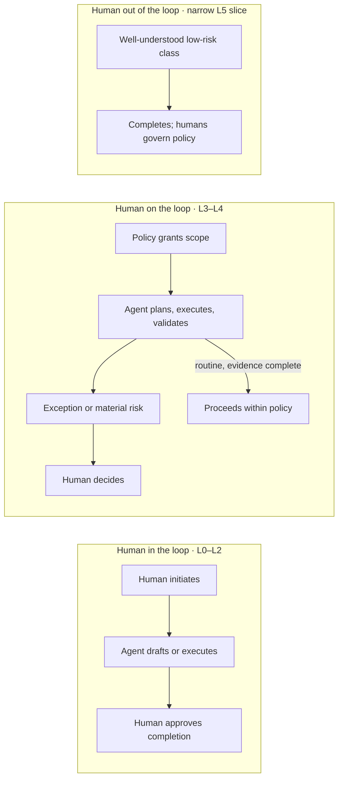
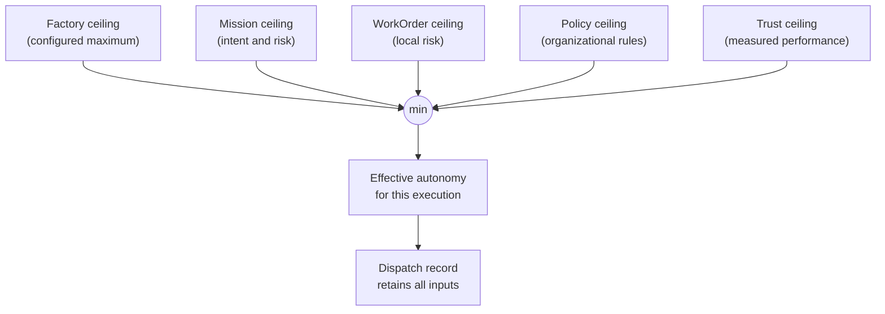
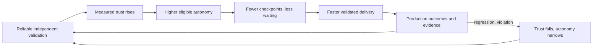

# 3. First principles: trust, evidence, and authority

Everything else in this guide rests on a few rules about who may do what, on what evidence, and who answers for the result. This chapter states those rules, gives the factory a precise vocabulary for autonomy, and shows how trust is measured, raised, and withdrawn. After reading it you should be able to say what a "Level 3" workflow may do, calculate the authority an agent actually holds for a given piece of work, and explain why a stronger model never changes that answer by itself.

## The problem

Ask three organizations what "autonomous" means and you will get three answers, none of which settle the questions that matter. Who initiates the work? Who defines what a good outcome is? May the system plan? May it change a repository? Who validates the result? May it deploy? Who accepts the risk if it is wrong? What evidence would justify giving it more authority, and what failures would take that authority away?

The labels "assisted", "semi-autonomous", and "fully autonomous" sound like answers. They leave every one of those questions open, and the gaps get filled by habit, by whichever engineer is on shift, or by the agent's own inference from a prompt.

The gap becomes dangerous when **model capability** is confused with **operational authority**. A stronger model completes more coding tasks; that is evidence worth having. It does not authorize the model to read customer data, change identity controls, approve a migration, deploy to production, or promote its own configuration. Vendors describe capability because that is what they sell. Enterprises have to govern authority, and when the two are collapsed, teams quietly assume better reasoning should earn more freedom — skipping the evidence that connects a model's behaviour to a specific repository, workflow, policy, environment, and business risk.

A second failure is static settings. A factory may be entirely trustworthy for documentation changes and unproven for payment logic. A Mission may be low risk overall while one WorkOrder inside it contains an irreversible migration. One organization-wide switch cannot express any of that.

A third failure is approval that exists in form but not in substance. When every action needs a human click, humans learn to click. When the approval screen shows raw logs instead of the outcome, evidence, risk, and exceptions, human attention is spent reconstructing what happened rather than deciding anything. This is **approval theater**, and it is the natural end state of any system that cannot tell routine work from surprising work.

The last failure is that most autonomy programmes are designed only to move upward. They define pilots and promotions and never define demotion. A system that can gain authority but cannot lose it is not continuously governed; it is governed once, at launch.

## How it works

### Autonomy is a grant, not a trait

Start from a single sentence and keep it:

> Trust is earned through evidence, governed by policy, and continuously calibrated by outcomes — not by model capability.

Autonomy in a factory is a **revocable grant of authority** from an accountable organization to a governed system. The grant has a scope (which factory, which workflow, which risk class), a ceiling (the most it may do), evidence requirements (what must be true to hold it), and conditions under which it must be reduced. A model upgrade changes none of these. Sustained, observable, evidence-backed performance may justify raising the ceiling; regressions, policy violations, thin evidence, or incidents must lower it.

The analogy that fits is a pilot's licence. A licence is issued to a person for a category of aircraft, with ratings that must be earned separately, medical checks that must be renewed, and an authority that can be suspended after an incident. Nobody argues that a pilot with faster reflexes should be allowed to fly a wide-body jet without the type rating. Capability is a prerequisite for the rating; it is not the rating.

This chapter calls the resulting scale **Factory Operational Autonomy Levels**. The name deliberately keeps the doctrine inside the AI Software Factory domain. The same ideas may generalize to other enterprise agents, but that broader question is not this guide's subject.

### The six levels

<!-- infographic: autonomy-levels -->
> **Infographic — The six Factory Operational Autonomy Levels.** *(Jay's graphic goes here.)* Until then, the table and diagram below carry the same concept.

Two vocabularies for the levels have grown up side by side in this material — one operational (what the human is responsible for), one descriptive (what the agent is doing). They describe the same ladder, so the table shows both names together with the example that makes each level concrete.

| Level | Name (operational / descriptive) | Human responsibility | Factory authority | Typical examples |
| --- | --- | --- | --- | --- |
| 0 | Human Execution / **Advisory** | Human performs and accepts the work | AI researches, explains, and recommends; it changes nothing | Chat and inline suggestions; an agent analyzes an incident and proposes likely causes |
| 1 | Assisted Execution / **Drafting** | Human initiates every action and reviews the result | AI produces small, bounded, deterministic artifacts; a human executes or submits them | Generate tests, write documentation, explain code, summarize a pull request, draft an implementation plan or patch for review |
| 2 | Delegated Execution / **Supervised execution** | Human defines the WorkOrder and reviews every material output | Factory implements inside the WorkOrder in a controlled environment and prepares evidence and a pull request; a human approves completion | Agent changes code and opens a PR but cannot merge |
| 3 | **Governed Autonomy** | Human approves material risk and final accountable decisions | Factory may plan and execute approved categories of low-to-medium-risk work within policy; independent validators enforce quality | Enterprise default for mature workflows: documentation updates, low-risk dependency fixes, added tests |
| 4 | Conditional Autonomy / **Continuous autonomy** | Human defines policy and approves exceptions or material risk | Factory runs ongoing workflows, detects problems, implements approved classes of fixes, validates them, and deploys when current evidence and policy allow | Internal tools, low-risk services, canary releases; an agent finds a broken test, repairs it, validates, and deploys within established controls |
| 5 | Trusted Factory / **Factory autonomy** | Humans govern objectives, policy, risk appetite, exceptions, and system performance | Multiple agents coordinate continuously across the full lifecycle within policy | Aspirational for most organizations today |

Level 5 does not remove humans. It moves them from individual routine decisions to policy, exceptions, and system governance. It should be rare until long-term evidence supports it, and the way to get there is workflow by workflow — proving one governed path, then the next — rather than declaring a whole company "autonomous" overnight.

The level is an upper bound, not an entitlement. A Level 4 factory may run one agent at Level 1 for a simple task, and usually should: greater capability does not require greater complexity or authority. Simple deterministic work should stay deterministic.

### Human in, on, and out of the loop

<!-- infographic: human-loop-modes -->
> **Infographic — Human in, on, and out of the loop.** *(Jay's graphic goes here.)* Until then, the diagram below carries the same concept.

The levels map onto three postures for the person. **Human in the loop** means a person reviews, approves, corrects, or guides work at defined points; Levels 0 to 2 live here. **Human on the loop** means the system runs autonomously within policy while a person supervises performance and handles exceptions; Levels 3 and 4 live here. **Human out of the loop** means a workflow can complete without any human intervention, which is appropriate only for work that is well understood, low risk, and well controlled — a narrow slice even at Level 5.

The future operating model is therefore not "human out of the loop". It is *human at the right points in the loop* — air-traffic control rather than piloting: the controller does not fly the aircraft, but nothing enters controlled airspace or lands without clearance, and the controller's attention goes to conflicts, not to every routine heading change.

### Autonomy is scoped, and the lowest ceiling wins

Autonomy must be configurable per Factory, per Mission, and per WorkOrder, with policy and current trust layered over all three. The effective level is always the lowest applicable ceiling:

`effective autonomy = min(factory, mission, work order, policy, trust)`

The **Factory ceiling** is the maximum authority of a configured factory. The **Mission** and **WorkOrder ceilings** reflect local intent and risk. **Policy** applies organizational constraints. The **trust ceiling** reflects current measured performance. No lower-level object may silently exceed its parent or policy ceiling, and the dispatch record for any execution should retain every input to this calculation along with the result.

### Promotion is human; demotion may be automatic

Promotion requires explicit human approval based on sustained evidence. Demotion may occur automatically when a policy or trust threshold is breached. The asymmetry is deliberate: the system may fail safe without waiting for permission, but it may never grant itself more power.

A promotion policy defines a configurable evidence window. The initial standard for moving a scope from Level 2 to Level 3 is:

- at least 100 successful WorkOrders,
- across at least 30 days of stable operation,
- with at least 99 percent independent-validation success,
- zero critical security or policy violations,
- zero unauthorized actions, and
- an explicit human promotion decision.

Both volume and elapsed time are required. One successful run, or a short streak, is never enough. The retained promotion record identifies the evaluated scope, the window, the policy version, the source records, and the approver, and the promotion itself creates a new configuration version with a rollback condition. The approvers for the initial Level 2-to-3 promotion are the Engineering Lead and the designated Risk Owner; the Security Owner joins whenever the scope includes security-sensitive permissions or systems.

```mermaid
stateDiagram-v2
    direction LR
    state "L0 Human" as L0
    state "L1 Assisted" as L1
    state "L2 Delegated" as L2
    state "L3 Governed" as L3
    state "L4 Conditional" as L4
    state "L5 Trusted" as L5

    L0 --> L1: human promotion after evidence
    L1 --> L2: human promotion after evidence
    L2 --> L3: human promotion after evidence
    L3 --> L4: human promotion after evidence
    L4 --> L5: human promotion after sustained outcomes

    L5 --> L4: trust or policy degrades
    L4 --> L3: trust or policy degrades
    L3 --> L2: trust or policy degrades
    L2 --> L1: material failure
    L1 --> L0: critical safety condition
```

Demotion need not be one level at a time. A critical incident may drop a scope from Level 4 to Level 1 immediately; **quarantine** drops it to Level 0. Recovery requires corrected controls and a fresh record of sustained performance — not the passage of time alone.

### The Factory Trust Score

The **Factory Trust Score** is the measured input to the trust ceiling. It is a transparent control signal, not an opaque grade. The system keeps an internal numeric score from 0 to 100 for calculation and trend analysis, and operators normally see an interpretable **trust band**. The number is the measurement; the band is the governance abstraction people reason about.

| Score | Band | Eligibility ceiling |
| --- | --- | --- |
| 0–39 | Very Low | Quarantined or advisory only |
| 40–59 | Low | Human review required for every action |
| 60–79 | Moderate | Eligible for limited supervised autonomy |
| 80–94 | High | Eligible for governed autonomy within policy |
| 95–100 | Trusted | Eligible for the highest authority current policy allows |

The thresholds must stay simple, stable, and versioned. An operator surface should explain the current band, its trend, the events that moved it, any hard override in effect, and the evidence that would be needed for review or promotion. The score never overrides policy; it only determines the highest level the scope is *eligible to request*.

The score draws on production failures and rollbacks, security escapes, customer defects, validator disagreement, human overrides, policy violations, the evaluated rate of hallucinated or unsupported claims, recovery time, and the completeness, freshness, provenance, and quality of evidence. The initial calculation normalizes these into five weighted dimensions:

| Dimension | Weight |
| --- | ---: |
| Authorization and policy compliance | 30% |
| Independent-validation performance | 25% |
| Evidence integrity and completeness | 20% |
| Production and customer outcomes | 15% |
| Operational reliability and recovery | 10% |

Critical violations are **hard overrides**, not ordinary weighted deductions. A long record of green tests must never average away evidence tampering, an unauthorized action, or a serious security failure.

The score is computed for a tuple of Factory Configuration version, repository, and workflow risk class. Executor and model are retained as diagnostic dimensions so a degraded component can be isolated without granting or removing authority at the wrong scope. This matters because a global average hides an unsafe workflow behind many routine successes. Inputs, weights, thresholds, source records, and every change to them must be inspectable and versioned.

### Failures decay; history does not

Failures lose influence on the score over time but never leave the audit record. The initial policy uses a rolling weighted window with a 90-day default. Recent behaviour weighs more than older behaviour; older failures fade gradually when sustained good performance follows; critical failures remain permanent history; and a repeated failure pattern resets the decay for that pattern. This permits earned recovery without rewriting the past.

### Trust-loss events

An ordinary execution failure is not loss of trust. A failed test, a timeout, or a bounded implementation error is normal feedback. What justifies immediate demotion or quarantine is evidence that the system has violated authority, truth, evidence, policy, or containment. Qualifying **trust-loss events** are:

- a security or policy violation;
- an unauthorized action or permission bypass;
- evidence tampering, or required evidence that cannot be accounted for;
- hallucinated or fabricated results presented as fact;
- independent-validation failure on a high-risk change;
- a customer-impacting production regression;
- repeated execution outside approved constraints; and
- unexpected behaviour consistent with model drift or compromised tooling.

Permission bypass, evidence tampering, suspected compromise, and repeated constraint violations quarantine the affected scope by default. The other events demote it by at least one level, with critical severity permitted to trigger quarantine. The system retains the triggering event, the previous and new ceilings, the affected scope, the policy decision, and the human review it requires. Severity, containment, truthfulness, and compliance with the authorized process are what distinguish a bad day from a broken trust relationship.

### Quality is the acceleration engine

<!-- infographic: trust-equation -->
> **Infographic — The trust equation.** *(Jay's graphic goes here.)* Until then, the diagram below carries the same concept.

Everything above treats trust as something to be defended. It is also something to be *built*, and what builds it is quality engineering. Most teams treat quality as a gate at the end of the line. In a factory it is the engine that lets the line run faster:

> More reliable validation → greater trust → more autonomy → faster delivery.

Without high-confidence automated validation, an organization keeps a human in every loop, and scale stops at the number of humans. With strong validation, humans move from routine inspection to exceptions and consequential decisions, and unnecessary checkpoints can be removed *safely*. Autonomy does not come from model confidence. It comes from evidence.

The quality stack that drives this loop includes test selection based on change impact, deterministic checks, model-based evaluation, cross-agent review, production telemetry, canary releases, feature toggles, automated rollback, evidence capture, failure classification, and learning from historical defects. The target is not "test before release" but *continuous validation* of intent, plan, implementation, deployment, and production behaviour. [Part IV](../04-prove/21-quality-and-evidence-architecture.md) builds this stack in detail; here the point is that it is what makes the autonomy ladder climbable.

### Risk determines control

The depth of human control should match the potential impact of the change, not the habit of the team. A concrete gradient makes this real:

- a low-risk documentation change proceeds autonomously;
- a moderate-risk application change requires human pull-request approval;
- a high-risk production or security change requires architecture and release approval; and
- a critical change touching customer data requires multi-party approval.

Mission Control expresses the same gradient as Green, Yellow, and Red work, which [Chapter 7](../02-design/07-governance-policy-and-risk-proportional-approval.md) develops into a full policy model. The principle here is simply that approval depth is a function of impact.

### Durable accountability: agents perform, humans answer

The factory must never allow responsibility to disappear into the phrase "the AI did it". Delegating execution does not delegate the decision, and delegation of preparation does not delegate accountability. An agent may prepare the decision packet and recommend; it cannot be the accountable owner. The **governance matrix** names who is:

| Decision | Accountable human owner |
| --- | --- |
| Business Mission | Product or Business Owner |
| WorkOrder acceptance | Engineering Lead |
| Architecture exception | Principal Engineer |
| Security exception | Security Owner |
| Compliance exception | Compliance Owner |
| Production deployment | Human Approver defined by policy |
| Risk exception | Designated Risk Owner |
| Learning promotion | Factory Governance Board |

Titles vary by organization; the assignment of accountability to a person does not. At the level of a single Mission, the same rule produces the **human accountability model**: every Mission carries a human business owner, a human technical owner, a named approving authority, an agent execution identity, an immutable record of actions, evidence supporting completion, a clear rollback owner, and a post-production validation owner. If any of those is blank, the Mission is not governed.

In a small organization one person may combine Product Owner, Technical Lead, Mission Approver, Release Approver, and Factory Administrator. That is fine for *decisions*. What must never collapse is the technical separation between implementation and validation, maintained through different execution contexts, evidence paths, or systems. Separation of duties should strengthen as scale and risk increase.

### Independent validation is technical, not organizational

Validators run through an execution path separate from the implementer's. They do not reuse the implementer's claimed results, they generate their own evidence against acceptance criteria that were fixed before the work began, and they write immutable audit records. Human acceptance reviews that independent evidence — never the implementation agent's self-report. This is the operational meaning of "agents don't certify their own work": independent verification, deterministic checks, trajectory evaluation, baseline comparison, and human authority for consequential actions.

### Validator disagreement increases governance

Validator results are evidence, not votes. Two passes and one failure do not produce a pass by majority; a security failure is not outvoted by two style checks. The factory must inspect the failed domain, its method, severity, evidence, freshness, and independence.

Conflicting valid results create a **Risk Review**. The system preserves every receipt, identifies the conflict, blocks any action policy prohibits, and presents the human owner with the evidence and safe options. It does not erase the disagreement through random retries. The governing rule is short: *validator disagreement increases governance; it never decreases it.*

### Approve evidence and risk, not activity

The antidote to approval theater is the **decision packet**. Humans should approve evidence and risk, not reconstruct routine execution from logs. A packet shows the governed requirement, the acceptance criteria, test and quality results, security findings, performance change, regression status, coverage where relevant, risk, exceptions, the recommendation, and the uncertainty around it.

Routine evidence stays inspectable without demanding attention. The factory escalates *surprises*: missing, stale, failed, contradictory, unusual, or high-risk evidence. High-risk work may still warrant full code or architecture review; evidence-focused approval does not abolish professional judgment, it points judgment at the parts that matter.

### The principles, stated once

The rules above compress into ten **core factory principles**, which this guide will keep returning to:

1. **Human intent before agent action.** No work begins without a clear objective, owner, constraints, and success criteria.
2. **Evidence over confidence.** Agents provide proof, not persuasive language.
3. **Autonomy must be earned.** Authority follows demonstrated reliability.
4. **Risk determines control.** Approval depth corresponds to impact.
5. **Every action must be traceable.** Who, what, why, how, and with which evidence.
6. **Quality enables speed.** Testing, observability, toggles, and rollback create the confidence to move quickly.
7. **Humans own outcomes.** Automation does not eliminate accountability.
8. **Small workflows before universal autonomy.** Prove one workflow before expanding.
9. **Optimize customer value, not code volume.** More commits are not automatically progress.
10. **The system must improve from experience.** Every failure and human correction should make future execution better.

Five **platform commitments** sit underneath them and shape how the factory is built rather than how it is governed: builder intent is the interface, so developers first and then product, QA, and design can use the factory without understanding its agent architecture; models are interchangeable execution resources, routed by capability, quality, cost, latency, security, and historical performance; the harness — not the model — creates production reliability, owning tools, state, permissions, recovery, stop conditions, sandboxing, and observability; agents do not certify their own work; and learning can be autonomous while promotion stays governed. The repository's seven governing principles are the same doctrine compressed, adding only that failure must be detectable, bounded, recoverable, and attributable.

All of it serves one aim, and it is worth stating before the mechanics begin. *The goal isn't simply to run more agents. The goal is systems that execute reliably across the 100th or 1,000th run, not just an impressive first demo.* Trust, evidence, and authority are how a factory gets from the demo to the thousandth run without anyone having to hope.

## How to build it

The first workflow that should prove governed autonomy is **Governed Issue → Validated Pull Request**:

1. A human creates a Mission.
2. An agent investigates the codebase.
3. The agent produces a versioned Plan.
4. A human approves that exact Plan version.
5. The factory executes the authorized WorkOrder.
6. Independent validators produce evidence.
7. Mission Control creates a review-ready pull request.
8. A human approves the merge.

This is first a Level 2 proof: the human defines and approves the work and reviews the material output. It approaches Level 3 only after sustained evidence shows the factory can plan and execute reliably while humans intervene for material risk and accountable decisions. The proof deliberately stops before autonomous deployment; it exercises planning, authorization, execution, validation, evidence, governance, and oversight without widening the initial safety boundary.

The recommended first scenario adds a required Business Justification field to Mission creation. It touches the React UI, the authoritative schema, validation, existing tests, browser testing, evidence generation, and pull-request lineage, while staying small enough to understand completely.

To make autonomy explicit and revocable in your own factory, the minimum contract is:

1. **A versioned autonomy field** on Factory Configuration, Mission, and WorkOrder, plus a policy ceiling. Never a single organization-wide switch.
2. **An effective-level calculation** at dispatch that records all five inputs and the result.
3. **A trust-score record** per (configuration version, repository, risk class) with components, weights, thresholds, hard overrides, and a decay policy, all versioned; executor and model kept as diagnostic dimensions.
4. **A trust-event schema** covering trust-loss events, decay resets, hard overrides, previous and new ceilings, affected scope, policy decision, and required human review.
5. **A promotion record** with scope, evidence window, policy version, source records, approver, new configuration version, and rollback condition.
6. **A Risk Review record** created on validator conflict, holding every receipt, the conflict, blocked actions, and the options offered.
7. **A decision packet** that leads with surprises and keeps routine lineage one click away.
8. **A governance matrix** enforced as one canonical contract, with a check that the producer of a consequential artifact is never its only assurance.

Before claiming any level above 2 for a scope, confirm the evidence window is met on both volume and time, independent validation ran through a separate execution path, no hard override is active, the promotion record names a human approver, and the demotion and quarantine paths have been exercised at least once.

## Failure modes

**Capability mistaken for authority.** Signal: a model upgrade is followed by widened permissions with no promotion record. Response: reject the change; authority moves only through the promotion contract.

**Six levels producing false precision.** Two workflows at Level 3 can have very different tools, blast radii, and evidence. Signal: teams cite the level as if it were the policy. Response: treat the level as a summary of a versioned policy envelope, never a replacement for it.

**A gamed Trust Score.** Signal: the number rises while incident and override rates do not fall. Response: transparent components, hard overrides, severity-aware events, and human promotion review; read the component history, not the headline number.

**Exception-first approval hiding slow degradation.** If "routine" is defined too broadly, drift never surfaces. Response: sampling, trend review, audits, and periodic deep inspection remain part of governance.

**A Governance Board that becomes the bottleneck.** Signal: routine WorkOrders queue for the board. Response: the board governs policy and promotion standards; decision ownership stays as close as possible to the accountable domain.

**Majority-vote validation.** Signal: a failed security check is "outvoted". Response: Risk Review, never retry-until-green.

**Trust that only rises.** Signal: no demotion event has ever fired. Response: exercise quarantine and demotion deliberately before trusting the ladder.

Four questions remain open in this doctrine and should be treated as design work, not settled fact: which event schema best represents trust changes, decay resets, and hard overrides; how to display confidence and sample sufficiency beside the score; which controls prevent correlated implementation-and-validator failures; and how a trust scope should reset after a material Factory Configuration change.

## In Mission Control

Pinned to Mission Control commit [`8014d5af`](https://github.com/jaydubya818/MissionControl/tree/8014d5af427b43ff5c5a63cfdf82ec92742c208c), studied 2026-08-03 on a clean tree. Thirty focused tests passed across Factory Configuration, Mission governance, WorkOrder governance, and WorkOrder revision. They support the mechanisms below but do not prove an autonomy ladder or trust calibration, and no browser journey was performed, so nothing here shows an operator promoting, demoting, or recovering a scope through the product.

| Doctrine capability | Status | Evidence |
| --- | --- | --- |
| Risk-proportional autonomy | Doctrine with implemented guards | North Star defines Green/Yellow/Red; WorkOrder governance evaluates approvals and evidence before acceptance |
| Versioned Factory authority | Implemented, unit-tested | `convex/factory/configuration.ts` versions repository, workflow, executor, policy, environment, budget, verifiers, risk boundary, recovery controls |
| Evidence-based acceptance | Implemented, unit-tested | `convex/lib/workOrderGovernance.ts` blocks acceptance for missing, failed, stale, expired, revoked, or unapproved evidence (ten tests) |
| Evidence-focused operator attention | Doctrine, partial | Approvals and required actions surface in UI; no complete decision packet verified |
| Autonomy Levels 0–5 | Not implemented | No versioned level field, inheritance rule, or effective-level calculation; an unrelated L1–L3 field in a hiring surface is not this doctrine |
| Governance matrix | Partial, fragmented | Approval permissions and risk roles exist across several records, not as one enforced contract |
| Validator-conflict Risk Review | Not verified | Failed and conflicting evidence can be retained; no first-class disagreement record or recovery flow verified |
| Factory Trust Score | Not implemented | No transparent score, scoped ceiling, component history, or hard-override contract |
| Automatic demotion | Not implemented | Recovery, retry, quarantine, and risk controls exist in parts; no outcome-driven ceiling recalculation |
| Human-only promotion | Future | Approvals exist for several actions; no promotion workflow after sustained evidence |

The target is for Mission Control to calculate effective autonomy at dispatch from the five ceilings, make trust changes event-driven and explainable, open Risk Reviews on validator conflict, and prove the issue-to-PR path at Level 2 before claiming Level 3. That is target architecture, not a current capability claim.

## Retain this

- Autonomy belongs to a governed scope, never to a model. Capability is evidence to evaluate, not authority to act.
- Six levels, from Advisory (0) to Factory autonomy (5); the level is an upper bound, not an entitlement.
- Effective autonomy is the minimum of the Factory, Mission, WorkOrder, policy, and trust ceilings.
- Promotion is a human decision on sustained, scoped evidence — initially 100 WorkOrders over 30 days at 99 percent independent validation with zero critical violations. Demotion may be automatic, and quarantine is immediate for authority, evidence, or containment breaches.
- The Trust Score is numeric inside and banded outside; hard overrides beat weighted averages; failures decay over 90 days but never leave the record.
- Humans approve evidence and risk through decision packets, not agent activity through logs.
- Quality is the acceleration engine: reliable validation → trust → autonomy → speed.

## Go deeper

- Next: [Chapter 4, The human–agent operating model](../02-design/04-the-human-agent-operating-model.md) turns these principles into roles, decision rights, and a governed lifecycle.
- [Chapter 7, Governance, policy, and risk-proportional approval](../02-design/07-governance-policy-and-risk-proportional-approval.md) develops the Green/Yellow/Red policy model.
- [Chapter 21, Quality and evidence architecture](../04-prove/21-quality-and-evidence-architecture.md) and [Chapter 24, Quality contracts, proof packages, and certificates](../04-prove/24-quality-contracts-proof-packages-and-certificates.md) build the validation stack that earns trust.
- [Chapter 33, Governed learning and compounding engineering](../06-improve/33-governed-learning-and-compounding-engineering.md) covers learning-versus-promotion.
- [Glossary](../appendix/glossary.md) entries: Factory Operational Autonomy Levels, Trust Score, trust band, Risk Review, decision packet, quarantine.
- Sources: Jay West, *AI Software Factory Mission* (risk-based autonomy model, core factory principles, quality as the acceleration engine, human accountability model); Jay West, *AI Software Factory Study Guide* (chapters 6–8: human in/on/out of the loop, level examples, the trust equation); *Factory in one line and five platform commitments* (study-guide preparation notes); Mission Control [North Star](https://github.com/jaydubya818/MissionControl/blob/8014d5af427b43ff5c5a63cfdf82ec92742c208c/docs/product/mission-control-north-star.md), [V1 product strategy](https://github.com/jaydubya818/MissionControl/blob/8014d5af427b43ff5c5a63cfdf82ec92742c208c/docs/product/mission-control-v1-product-strategy.md), [Factory Configuration](https://github.com/jaydubya818/MissionControl/blob/8014d5af427b43ff5c5a63cfdf82ec92742c208c/convex/factory/configuration.ts), and [WorkOrder governance](https://github.com/jaydubya818/MissionControl/blob/8014d5af427b43ff5c5a63cfdf82ec92742c208c/convex/lib/workOrderGovernance.ts) at the studied commit.
