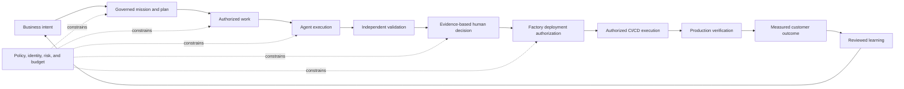

# What Is an AI Software Factory?

## Quick Read

- **Purpose:** Explain the business and engineering case for a factory-level
  operating model.
- **Best for:** Leaders, architects, and first-time readers.
- **Prerequisites:** None; the overview chapter is helpful but not required.
- **Reading time:** 22 minutes.
- **You will learn:** Why local code-generation speed is not business
  throughput and how a factory changes the unit of optimization.

Keep three ideas: code is an intermediate artifact; lead time ends at validated
customer value; and human accountability remains even as execution autonomy
increases.

An AI Software Factory is not a more productive code editor. It is an
engineering operating model designed to convert governed business intent into
validated customer value. Coding agents are important factory workers, but
they are not the factory. The factory also contains the authority model,
durable workflow, quality system, evidence chain, recovery mechanisms, and
feedback loops that make agent execution trustworthy at organizational scale.

This distinction matters because code generation is rapidly becoming cheaper
while engineering accountability remains stubbornly expensive. A system can
produce thousands of lines of plausible code and still fail to create value.
It may solve the wrong problem, exceed its authority, introduce hidden risk,
pass shallow tests, or produce a change that no responsible reviewer can
confidently accept. The factory exists to govern the whole conversion process,
not merely accelerate one production step.

## 1. The problem

Traditional software delivery divides work across product definition,
architecture, planning, coding, review, testing, security, release, and
operations. The boundaries provide useful specialization, but they also create
queues, handoffs, context loss, and conflicting definitions of done. Adding a
coding agent to this system makes implementation faster without necessarily
improving the system as a whole. The constraint often moves downstream into
review, validation, integration, release, or incident recovery.

This is the central systems problem: local code-generation speed is not the
same as business throughput. The relevant measure is elapsed time from a
valuable intent to a validated outcome, subject to acceptable quality, risk,
cost, and human attention. If faster implementation creates more rework,
larger review queues, weaker evidence, or more escaped defects, the engineering
system has not improved.

Agentic execution also changes the control problem. A human developer carries
organizational context, professional judgment, and implicit responsibility.
An agent operates from the context, tools, permissions, and objective provided
to it. It can act quickly and repeatedly, but it cannot assume accountability
for the consequences. The organization therefore needs explicit records of
intent, authority, execution, evidence, and acceptance.

## 2. Why the problem exists

Software work is not a deterministic assembly process. Requirements are
incomplete. Repositories contain undocumented constraints. Tests are selective
models of desired behavior. Production environments create conditions that
development environments do not reproduce. Customer value is often visible
only after release. These uncertainties do not disappear when an agent writes
the code.

Language-model agents add their own uncertainty. Their output depends on
context selection, model behavior, tool results, environmental state, and the
trajectory of previous steps. They can be highly capable without being
infallible or consistently calibrated. Conversation history alone is an
inadequate system of record because it is difficult to query, govern, resume,
reconcile, and audit.

Organizations compound the problem when they leave authority implicit. A task
description may communicate what to change without specifying which
repository, tools, environments, budgets, credentials, or risks are
authorized. A test result may demonstrate one property without proving the
business outcome. A completed agent run may be mistaken for accepted work.
These category errors are tolerable at small scale and dangerous when many
agents execute concurrently.

## 3. Enduring Principle

### Working definition

> An AI Software Factory is a governed engineering operating model where
> humans define intent, constraints, priorities, and acceptable risk while
> autonomous agents continuously plan, implement, validate, document, and
> improve software. Humans retain accountability. Agents provide execution.
> The goal is to reduce the time from business intent to validated customer
> value while improving quality, governance, and engineering leverage.

The phrase **operating model** is deliberate. A factory includes technology,
but it also defines decision rights, responsibilities, workflows, quality
standards, escalation paths, measures, and learning mechanisms. Installing an
agent does not create a factory any more than installing a build server creates
a DevOps operating model.

The word **governed** means that execution authority is explicit and bounded.
Governance is not a final compliance review placed after the work. It is the
mechanism that decides who or what may act, on which resources, with which
tools, under which limits, and subject to which approvals and evidence.

The word **autonomous** is also bounded. Agents may choose and execute steps
within delegated authority. They do not acquire unlimited authority, erase
human accountability, or approve their own material work merely because they
can complete a task without interaction.

The word **continuously** describes the operating capability, not permission
to mutate every system at all times. Research, planning, implementation,
validation, documentation, maintenance, and learning can proceed across the
engineering lifecycle, but risk and policy still determine when human judgment
is required.

### Trust the system, not the model

The strongest objection to an AI Software Factory is also the correct starting
question: language-model agents are probabilistic, so why should an engineering
organization trust them with consequential work?

It should not trust the model as the final authority. The factory assumes that
agents will misunderstand context, choose weak approaches, produce defects,
misread evidence, and fail in unexpected ways. Trust must instead come from the
operating system surrounding the agent: explicit authority, policy enforcement,
isolated execution, independent validation, evidence, human risk acceptance,
immutable history, bounded recovery, progressive autonomy, and continuous
measurement.

Trust does not require every component to be infallible. It requires failures
to be detectable, contained, recoverable, and attributable. The factory is
credible when it can safely use a fallible worker, not when it pretends the
worker has stopped being fallible.

### The operating loop

The loop begins with intent and ends with measured learning. Code is an
intermediate artifact. A factory that stops at a generated patch cannot know
whether the change was accepted, released, safe in production, or valuable to
customers.

### Govern deployment; delegate execution

The factory owns deployment governance. It determines whether the required
policy, approval, evidence, environment, timing, rollback, and risk conditions
have been satisfied. It does not need to replace the delivery system that
executes the deployment.

GitHub Actions, Jenkins, Argo CD, Spinnaker, Azure DevOps, or another authorized
delivery platform may perform the mechanical work. The factory supplies the
governed decision and retains the lineage. The delivery system returns signed
or otherwise attributable execution evidence. This keeps authority in the
factory without rebuilding mature deployment infrastructure.

Delegation does not transfer accountability. The factory must know which
version was authorized, which external system acted, which environment
changed, which evidence resulted, and whether production verification passed.

### Human and agent responsibilities

Humans own intent, priority, acceptable risk, policy, exceptions, and final
accountability. They decide what outcomes deserve investment and which
tradeoffs the organization is willing to accept. Agents own bounded execution:
researching, proposing plans, implementing, testing, collecting evidence,
documenting, and attempting recovery within their authority.

This is not a claim that humans must approve every step. Excessive approval
queues destroy leverage and train operators to approve without judgment. The
correct principle is risk-proportional control. Low-risk, reversible work with
strong automated evidence can receive more autonomy. Irreversible,
security-sensitive, financial, privacy, regulatory, or architecturally broad
work requires stronger controls.

Humans must always approve decisions that materially increase business,
customer, financial, legal, or security risk. This includes significant
customer-facing production deployments; changes to security, identity,
authorization, or compliance; irreversible data migrations; customer-data
access or deletion; consequential rollbacks; policy changes; changes to prompts,
evaluations, or governance that alter factory behavior; and promotion to a
higher autonomy level.

The permanent human responsibility is risk acceptance. The mechanical action
may be delegated after approval, but the factory cannot delegate accountability
for choosing the risk.

### Capability boundary

A real factory coordinates the engineering lifecycle. The following
capabilities define the threshold:

1. a business-intent-to-production workflow;
2. governance and policy enforcement;
3. human approval based on risk;
4. multi-agent orchestration;
5. persistent, authoritative workflow state;
6. versioned planning;
7. explicit work authorization;
8. independent validation;
9. evidence-based acceptance;
10. a complete audit trail;
11. production feedback and human-promoted learning; and
12. measurable business outcomes.

These capabilities need not appear as twelve products or screens. They must,
however, exist as coherent system responsibilities. A platform should not call
itself a factory merely because its roadmap eventually mentions them.

Multi-agent orchestration is an available capability, not a tax imposed on
every unit of work. A bounded task may use one agent. Higher complexity, risk,
parallelism, or specialization may justify separate research, implementation,
security, validation, or recovery agents. The architecture must support that
choice without pretending that more agents automatically produce a better
outcome.

### Success is a three-variable system

An AI Software Factory succeeds only when speed, quality, and leverage improve
together. The first three business measures are:

1. **Lead Time to Validated Customer Value** measures elapsed time from an
   accepted business intent to an independently confirmed customer outcome.
2. **Change Failure Rate** measures the proportion of released changes that
   cause a qualifying failure during a defined observation window. Greater
   autonomy is not progress if this measure worsens.
3. **Engineering Leverage** measures how much accepted, valuable work each
   engineer can direct without increasing cognitive load or coordination
   overhead. Raw agent activity, generated code, and task counts are not
   leverage.

The three measures constrain one another. Faster lead time with more failures
is reckless acceleration. Lower failure rate achieved by stopping delivery is
not a factory improvement. Higher output that consumes more review attention
or coordination is automation theater. A credible factory improves the system,
not one isolated number.

#### Lead Time from Business Intent to Validated Customer Value

The clock starts when a business intent becomes a governed Mission. It does not
start when coding begins, when a Task is dispatched, or when an agent first
responds.

The clock stops only when the change has been deployed, independently validated
in production or an explicitly approved production-equivalent environment, and
the expected customer outcome has been confirmed. A merged pull request is an
intermediate state. It does not stop the clock.

The authoritative timestamps are therefore conceptually `missionGovernedAt`
and `validatedCustomerValueAt`. A real implementation may use different field
names, but it must preserve those meanings and the evidence supporting the stop
condition.

#### Change Failure Rate

The denominator is all deployments observed during the measurement period. A
deployment enters the numerator if, within its observation window, it requires
a rollback, hotfix, or emergency intervention, or causes a customer-impacting
regression, reliability incident, security incident, or defined SLA or SLO
violation.

The default observation window is seven days after deployment. Policy may set
a longer window for workloads with delayed effects. One deployment should be
counted once even when it causes several qualifying events. The underlying
events remain available for severity and causal analysis.

#### Engineering Leverage

Engineering leverage means more validated customer value per engineer without
increasing cognitive load or coordination overhead. It is demonstrated through
a set of observable signals:

- reduced lead time;
- stable or improved change failure rate;
- greater throughput of validated work;
- fewer human implementation hours per work item;
- more engineering time spent on architecture, product, and customer problems;
- less coordination and waiting time; and
- higher developer satisfaction.

The factory should retain these component measures before compressing them into
a composite score. Commits, generated lines, agent runs, and completed Tasks
are activity measures. They do not prove leverage.

### Coding assistant, agent, platform, and factory

| System | Primary unit | Typical scope | Durable authority and acceptance | Outcome boundary |
| --- | --- | --- | --- | --- |
| Coding assistant | Prompt or edit | Helps a person write or understand code | Usually remains with the user and surrounding tools | Suggested or edited code |
| AI agent | Delegated objective | Uses models and tools to pursue bounded work | May enforce task-level permissions and retain run state | Completed task or proposed change |
| Agent platform | Agent and run | Provides shared runtime, tools, context, orchestration, and observability | May govern agents without owning the engineering lifecycle | Reliable agent execution |
| AI Software Factory | Governed engineering outcome | Coordinates intent, planning, execution, validation, release, feedback, and learning | Explicit authority, evidence, audit, and human accountability | Validated customer value |

The categories can overlap. A sophisticated coding agent may include a sandbox,
worktrees, parallel workers, and pull-request creation. Those capabilities make
it a stronger worker or agent platform. They do not alone establish the
organizational authority model, independent acceptance system, production
feedback, or business outcome measurement required of a factory.

## 4. Tradeoffs and alternatives

### Governance consumes time before it saves time

Structured intent, approvals, evidence, and audit records impose overhead. For
small, reversible work, excessive structure may cost more than it prevents. A
factory must therefore scale its controls with risk and learn where automation
is sufficiently trustworthy. The alternative is not governance or speed. The
design problem is to spend human judgment only where it changes the risk.

### Multi-agent systems create coordination cost

Specialized agents can separate research, implementation, testing, security,
and validation. They can also duplicate work, pass incomplete context, produce
conflicting conclusions, and increase cost. Multi-agent orchestration is
justified when specialization, independence, parallelism, or fault isolation
creates measurable value. A single agent with deterministic tools is often the
better design for a bounded task.

### Independent validation is not free

Separation between producer and validator reduces self-certification risk, but
it consumes compute and time. Independence can also be superficial if both
agents share the same execution, evidence, test oracle, or assumptions.

The minimum is separate execution, separately retained evidence, explicit
acceptance criteria, and an acceptance authority that is not controlled by the
worker. A different service is preferable for material risk. At minimum, the
validator must run in a different execution context with no ability for the
worker to manufacture or approve the validation result. Model diversity,
independent data, separate credentials, or a human reviewer may be added as
risk increases.

### Central control can become a bottleneck

A control plane creates consistent policy and lineage. If it owns every local
decision, it can become a rigid central queue. The factory should centralize
authority, policy, and durable evidence while allowing execution systems to
make local decisions within explicit envelopes.

### Learning can institutionalize mistakes

Continuous learning sounds unconditionally beneficial. It is not. An
unreviewed memory, prompt, policy, or workflow derived from one successful run
can propagate accidental behavior. Learning should be provenance-rich,
evaluated, and reversible. The factory may collect observations, failures,
metrics, and recommendations automatically. Changes to prompts, policies,
workflows, evaluation criteria, or operational behavior require explicit human
review and promotion. The factory learns by changing governed artifacts, not
by silently rewriting itself.

## 5. Current Mission Control Implementation

### Verification baseline

This study inspected Mission Control commit
[`8014d5af427b43ff5c5a63cfdf82ec92742c208c`](https://github.com/jaydubya818/MissionControl/tree/8014d5af427b43ff5c5a63cfdf82ec92742c208c)
on 2026-08-02. The working tree was clean.

Forty-one focused tests passed: 33 tests covering Mission planning, Mission
governance, Task projection, WorkOrder revision, and evidence lineage, plus
eight workflow-engine tests covering the bounded implementation policy. This
is meaningful mechanism-level evidence. It is not evidence that the complete
browser-to-production workflow works.

### Capability assessment

| Factory capability | Status at studied commit | Evidence and interpretation |
| --- | --- | --- |
| Business intent to production | Partial; end-to-end promise unproven | The [North Star](https://github.com/jaydubya818/MissionControl/blob/8014d5af427b43ff5c5a63cfdf82ec92742c208c/docs/product/mission-control-north-star.md) and [V1 strategy](https://github.com/jaydubya818/MissionControl/blob/8014d5af427b43ff5c5a63cfdf82ec92742c208c/docs/product/mission-control-v1-product-strategy.md) define the path and explicitly retain it as a ship gate. |
| Governance and risk-based approval | Implemented mechanisms; full authority model remains incomplete | Server mutations contain dispatch and acceptance guards in [`convex/workOrders.ts`](https://github.com/jaydubya818/MissionControl/blob/8014d5af427b43ff5c5a63cfdf82ec92742c208c/convex/workOrders.ts). The V1 strategy still lists authenticated identity, authorization, and separation of duties as P0 completion work. |
| Multi-agent orchestration | Partial | Workflow and role concepts exist, including Worker and Validator roles, but the complete governed multi-agent golden path has not been demonstrated at this commit. |
| Persistent workflow state | Implemented for core records | [`convex/schema.ts`](https://github.com/jaydubya818/MissionControl/blob/8014d5af427b43ff5c5a63cfdf82ec92742c208c/convex/schema.ts) defines Missions, Mission Plans, WorkOrders, Tasks, WorkflowRuns, approvals, assertions, and evidence-related records. Restart durability of the entire journey still requires browser and process evidence. |
| Versioned planning | Implemented and unit-tested at the contract level | [`convex/missions.ts`](https://github.com/jaydubya818/MissionControl/blob/8014d5af427b43ff5c5a63cfdf82ec92742c208c/convex/missions.ts) creates, revises, approves, and releases Mission Plans. [`missionPlan.test.ts`](https://github.com/jaydubya818/MissionControl/blob/8014d5af427b43ff5c5a63cfdf82ec92742c208c/convex/__tests__/missionPlan.test.ts) passed four focused tests. |
| Work authorization and immutable Attempts | Implemented mechanisms | Dispatch runs through governed WorkOrders. The [Task Attempt scheduler record](https://github.com/jaydubya818/MissionControl/blob/8014d5af427b43ff5c5a63cfdf82ec92742c208c/docs/architecture/task-attempt-scheduler-pr2.md), [`taskAttemptScheduler.ts`](https://github.com/jaydubya818/MissionControl/blob/8014d5af427b43ff5c5a63cfdf82ec92742c208c/convex/lib/taskAttemptScheduler.ts), and passing Task projection tests show bounded retry and retained Attempt history. |
| Independent validation and evidence-based acceptance | Implemented mechanisms and unit-tested | [`missionGovernance.ts`](https://github.com/jaydubya818/MissionControl/blob/8014d5af427b43ff5c5a63cfdf82ec92742c208c/convex/lib/missionGovernance.ts) blocks acceptance without required validation. Mission and WorkOrder mutations link evidence to assertions and criteria. Focused governance and revision tests passed. |
| Complete audit trail | Partial | Durable events, approvals, revisions, receipts, and execution records exist. Completeness across every sensitive action and external GitHub transition has not been demonstrated here. |
| Production executor and GitHub delivery | Approved direction; production path unproven | The [V1 decision log](https://github.com/jaydubya818/MissionControl/blob/8014d5af427b43ff5c5a63cfdf82ec92742c208c/docs/decisions/ai-software-factory-v1-decisions.md) selects GitHub and a Codex-based executor while explicitly classifying current worker scripts as prototypes rather than the approved production adapter. |
| Deployment governance | Future or incomplete | The V1 strategy defines deployment approval, flags, rollback, and production verification as a required governed release capability. This study did not verify an implemented authorization-to-external-CI/CD contract. |
| Production feedback | Future or incomplete | The product decision identifies governed GitHub Issues as a future source of production outcomes. This chapter did not find evidence of a complete production feedback loop. |
| Continuous learning | Future vision | The V1 strategy places governed context, memory, and learning promotion beyond the initial golden path. No current factory-wide continuous-learning claim is made. |
| Measurable business outcomes | Defined, not proven | The North Star defines outcome, trust, attention, cost, and recovery measures. This study did not verify production data or a causal measurement system behind them. |

### Browser evidence status

No fresh browser-operated golden-path demonstration was performed for this
chapter. The existence of React views for Mission planning, WorkOrder
governance, Task Attempts, and evidence is source evidence, not proof of a
working end-to-end journey. Mission Control should therefore be described as a
serious implementation in progress with several verified factory mechanisms,
not yet as a fully proven AI Software Factory.

## 6. Future Vision

The target system closes the loop from intent through production observation.
It can accept a governed objective, produce and revise a versioned plan, release
authorized work, coordinate specialized workers and independent validators,
recover within policy, prepare a review-ready pull request, preserve exact
lineage, authorize an external delivery system, reconcile deployment evidence,
measure production behavior, and propose human-promoted improvements to future
context, policy, workflows, and evaluation.

This is the direction, not a current-capability claim. Each capability earns
promotion only after its authoritative records, authorization, failure
behavior, tests, browser operation, and retained evidence have been verified at
a named version.

## 7. Versioned references

The versioned Mission Control sources are linked directly in the capability
assessment. The chapter-level reference list appears at the end of this
document. External sources are maintained in the version-reviewed research
canon so that vendor and protocol changes can be tracked without silently
changing the historical Mission Control assessment.

## 8. Notes and lessons learned

My current conclusions are:

- The unit of production is not code. It is validated customer value.
- The central scarce resource is accountable human judgment, not generated
  tokens or lines of code.
- Governance is part of the execution architecture. It is not a compliance
  report added after execution.
- The factory owns the deployment decision and lineage. It does not need to
  replace the delivery platform.
- The lead-time clock starts at a governed Mission and stops at independently
  validated customer value, not at merge.
- Multi-agent orchestration is an architectural capability, not a default
  workflow shape.
- Quality does not merely constrain autonomy. Reliable validation creates the
  conditions under which autonomy can safely increase.
- Validation is not independent merely because the same worker runs another
  prompt. Execution, evidence, and acceptance authority must be separated.
- Automatic observation is valuable. Automatic self-modification of governed
  behavior is not acceptable.
- Lead time, failure rate, and leverage must improve together.
- The correct trust target is the governed operating system, not the
  probabilistic model.
- Completion, validation, acceptance, merge, deployment, and production
  verification are different decisions and must remain different states.
- Mission Control is a valuable case study precisely because its gaps are
  visible. Its target architecture must never be presented as current fact.
- I should not call Mission Control a proven factory until I can operate and
  recover the golden path through the browser and inspect its complete lineage.

Questions to revisit after the capstone:

1. How should engineering leverage incorporate cognitive load and coordination
   cost without relying only on surveys?
2. At which risk level must execution-context separation become service,
   credential, model, or organizational separation?
3. How can human promotion of learning remain rigorous without becoming a
   high-volume approval queue?
4. Which production-equivalent environments provide sufficient evidence for
   workloads that cannot safely be validated against live customers?

## 9. Interview and discussion questions

1. Why is an AI Software Factory an operating model rather than a tool?
2. What bottleneck appears when code generation becomes dramatically faster?
3. How does a factory differ from a coding assistant, an AI agent, and an agent
   platform?
4. Why must work authorization be distinct from task assignment?
5. Why does a completed agent run not prove that a WorkOrder should be
   accepted?
6. What should be durable when an agent, model, process, or host fails?
7. How would you define risk-proportional autonomy for a financial system?
8. What makes validation independent in practice?
9. How can governance improve speed instead of merely slowing execution?
10. What are the strongest and weakest parts of the factory analogy?
11. Which metrics demonstrate customer value without rewarding agent activity?
12. Which Mission Control capabilities are implemented today, and which remain
    target architecture?
13. Why should the factory govern deployment while delegating its execution?
14. Why is multi-agent support required even though many workflows should use
    one agent?
15. Why should a CTO trust autonomous execution if the underlying models are
    probabilistic?
16. Why is time to merge an inadequate primary factory metric?

### CTO-level follow-ups

- Where is the authoritative state, and how do you reconcile late or duplicate
  executor events?
- How do you prevent a worker from expanding its own authority?
- How does evidence remain tied to the exact source commit and environment?
- What happens when the validator and worker disagree?
- How do retries avoid reproducing the same failed action?
- What would you centralize in the control plane, and what would remain inside
  execution adapters?
- What contract would you require from an external deployment system?
- How would you measure engineering leverage without rewarding low-value
  output?
- How would you correlate a production incident to its originating deployment
  without double-counting the change failure?
- Which risks remain human-owned even after the factory demonstrates a strong
  operating history?
- How would you prove that the factory improves business outcomes rather than
  simply increasing change volume?

## 10. Whiteboard exercise

From memory, draw the complete operating loop in fifteen minutes. The diagram
must include:

- business intent and measurable outcome;
- human decision boundaries;
- versioned planning and work authorization;
- Worker and Validator responsibilities;
- control-plane and execution-plane separation;
- durable state and immutable Attempts;
- evidence tied to acceptance criteria;
- the boundary between deployment authorization and delegated deployment
  execution;
- pull request, release, and production verification as separate states;
- failure classification, bounded retry, and escalation;
- production feedback, human-promoted learning, and the three success
  measures; and
- the controls that make a fallible agent safe enough for bounded execution.

After drawing it, mark each boundary where authority changes and each record
that must remain durable. Then explain the diagram in three forms:

1. thirty seconds: definition, human-agent split, and business purpose;
2. two minutes: definition, lifecycle, governance, evidence, and distinction
   from a coding agent; and
3. ten minutes: full architecture, tradeoffs, Mission Control implementation,
   gaps, and business measures.

The exercise fails if the explanation treats code generation as the final
outcome, merges execution with acceptance, or describes future Mission Control
capabilities as implemented.

## 11. Hands-on lab

### Objective

Trace how Mission Control converts intent into governed, evidence-bearing work
and identify exactly where the current implementation stops short of the full
factory definition.

### Starting version

- Repository: `jaydubya818/MissionControl`
- Commit: `8014d5af427b43ff5c5a63cfdf82ec92742c208c`
- Study date: 2026-08-02

### Tasks

1. Without using an agent, write the working definition from memory and list
   the twelve threshold capabilities.
2. Trace Mission creation, plan creation, revision, approval, and WorkOrder
   release through `MissionDetailView`, `MissionPlanWorkspace`,
   `convex/missions.ts`, and the relevant schema tables.
3. Trace Task selection, dispatch, Attempt creation, failure, and retry through
   `WorkOrdersView`, `TaskDrawerTabs`, `convex/workOrders.ts`, and
   `convex/lib/taskAttemptScheduler.ts`.
4. Trace independent validation and acceptance through Mission assertions,
   verification receipts, `missionGovernance.ts`, and the acceptance
   mutations.
5. Run the focused tests recorded in this chapter. Explain what each suite
   proves and what it cannot prove.
6. Operate the supported browser path using the documented local demo command.
   Capture which parts use real scoped Convex data and which use demo or
   preview data. Do not infer capability from the presence of a screen.
7. Trigger one safe failure, such as an invalid dispatch or ineligible retry.
   Record the authoritative rejection and the operator-visible recovery path.
8. Produce a capability assessment using the statuses implemented, partial,
   future, and unverified.
9. For deployment, multi-agent orchestration, validation, learning, and
   measurement, identify the policy owner, execution owner, authoritative
   record, required evidence, and human decision.
10. Define the start event, stop event, evidence, and exclusions for lead time;
    the denominator, qualifying events, and observation window for change
    failure rate; and the component signals for engineering leverage.

### Required evidence

- exact commit and local configuration;
- traced UI, mutation, helper, schema, and test paths;
- focused test output;
- browser screenshots or recording with provenance;
- one rejected action and recovery explanation;
- the completed capability assessment;
- a metric definition sheet for lead time, change failure rate, and engineering
  leverage;
- an unscripted answer to the probabilistic-agent trust objection;
- a whiteboard image; and
- three teach-backs for a developer, engineering executive, and CEO.

### Cleanup

Use a disposable worktree for any intentional code or test modification.
Remove temporary branches and local evidence only after retained artifacts are
checksummed and indexed. Do not change Mission Control data directly to make
the demonstration appear successful.

## Mastery standard

The chapter is mastered only when I can:

- explain an AI Software Factory in thirty seconds, two minutes, and ten
  minutes;
- whiteboard the complete operating model from memory;
- distinguish a coding assistant, agent, agent platform, and factory;
- defend governance, evidence, and quality as enabling architecture;
- answer CTO-level follow-up questions without notes;
- teach the concept to a developer, executive, and CEO;
- connect each concept to a verified Mission Control implementation or an
  explicitly named gap; and
- defend my position with both technical and business reasoning; and
- explain why trustworthy controls matter more than confidence in a model.

Agent assistance may accelerate study and code discovery. It cannot supply the
final no-notes explanation, whiteboard, or defense. Mastery belongs to the
learner, not to the generated artifact.

## Primary references

- [Operational Autonomy and Trust Calibration](../02-first-principles/01-operational-autonomy-and-trust-calibration.md)
- [Initial AI Software Factory research canon](../12-research-journal/initial-canon.md)
- [Mission Control North Star at the studied commit](https://github.com/jaydubya818/MissionControl/blob/8014d5af427b43ff5c5a63cfdf82ec92742c208c/docs/product/mission-control-north-star.md)
- [Mission Control V1 strategy at the studied commit](https://github.com/jaydubya818/MissionControl/blob/8014d5af427b43ff5c5a63cfdf82ec92742c208c/docs/product/mission-control-v1-product-strategy.md)
- [Mission Control V1 decision log at the studied commit](https://github.com/jaydubya818/MissionControl/blob/8014d5af427b43ff5c5a63cfdf82ec92742c208c/docs/decisions/ai-software-factory-v1-decisions.md)
