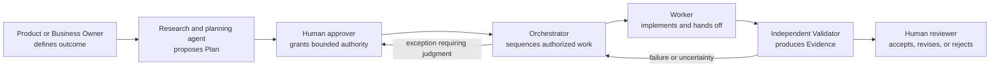
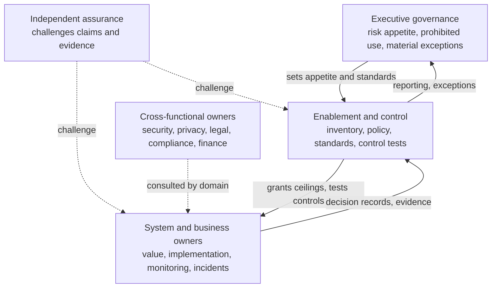

# 4. The human–agent operating model

Adding agents to an engineering organization does not tell the organization how to work. Someone still has to decide who defines the outcome, who may plan, who may change a repository, who validates, who accepts, and who is on the hook when it goes wrong. This chapter is the answer to those questions, written as a design: the responsibility split between people and agents, the roles on each side, the decision rights that never move, the governed lifecycle every Mission passes through, and the handoff and escalation contracts that let work continue when the person who started it has gone home. After reading it you should be able to assign every decision and every action in a factory to the right owner, and redraw the same model for a five-person startup and a regulated enterprise.

## The problem

Without an explicit operating model, organizations fall into one of two failures. In the first, humans inspect every action. Operators become the bottleneck, learn to approve routine work without understanding it, and governance survives in form only — the **approval theater** described in [Chapter 3](../01-understand/03-first-principles-trust-evidence-and-authority.md). In the second, humans surrender control to systems that cannot own business risk. Agents infer authority from prompts, validate their own output, and convert "the task finished" into "the business accepted it" — **unsafe autonomy**.

The reason both happen is that traditional organizations keep authority in job titles, meetings, and tacit knowledge. A senior engineer knows which change needs security review. A product manager knows when scope has drifted. A release manager knows which deployment needs an executive decision. Almost none of that is written into the delivery system. Agents cannot safely inherit ambiguity. They act through tools at machine speed, across shifts, and may continue when the initiating person is unavailable. Their reasoning is probabilistic, their context is bounded, and their output sounds more certain than the evidence allows.

Agent governance then fails in predictable ways: a policy with no decision owner, a system owner who does not know their autonomy ceiling, reviewers who approve without independent evidence, incident authority that depends on finding an executive. The fix is not more committees. It is a small, explicit authority system with durable inputs and outputs, escalation paths, and independent assurance — organizational design expressed in software.

## How it works

### Human-led, agent-executed

<!-- infographic: responsibility-split -->
> **Infographic — What humans own, what agents perform, what they do together.** *(Jay's graphic goes here.)* Until then, the diagram below carries the same concept.

The traditional model runs humans plan → humans implement → humans test → humans review → humans deploy → humans investigate → humans document. The target model runs: humans establish intent, constraints, priorities, and risk tolerance → agents investigate and plan → humans review consequential decisions → agents execute → automated systems validate → humans approve according to risk → agents deploy, observe, and continue learning. Human-led does not mean human-performed; agent-executed does not mean agent-authorized. Delegating execution never delegates accountability, and human leadership moves upward — from supervising activity to designing the system in which activity is safe and valuable.

**Humans own** product vision, business priorities, customer understanding, ethical judgment, architectural direction, risk tolerance, tradeoff decisions, high-impact approvals, exception handling, team development, strategic learning, and final accountability.

**Agents perform** requirements analysis, codebase investigation, dependency analysis, implementation planning, code generation and modification, refactoring, unit, integration, and regression testing, security and dependency analysis, documentation, pull-request preparation, log and telemetry analysis, incident triage, root-cause investigation, release preparation, environment validation, routine operational work, evidence collection, and continuous-improvement proposals.

**Shared human–agent work** is where the model earns its credibility against "agents replace developers" stories: architecture, product design, complex debugging, incident response, acceptance criteria, risk evaluation, experiment design, code review, release decisions, postmortems, and strategic prioritization. The future is not humans versus agents; it is human judgment multiplied by autonomous execution.

### The daily rhythm: business hours and overnight

The model has a clock. During business hours developers do the work that needs judgment: defining problems, outcomes, and acceptance criteria; reviewing and refining plans; weighing architectural and technical tradeoffs; reviewing code changes and test results; approving pull requests; resolving ambiguity, risk, and escalations; and improving the tools, workflows, and guardrails agents use. Agents do the execution: researching the codebase, drafting plans, writing and modifying code, creating and updating tests, running builds, tests, lint, security scans, and validations, investigating failures and correcting defects, preparing pull requests with evidence, responding to review feedback — and continuing through the day and overnight.

A developer may approve a plan before leaving. The next morning the review should answer, without reconstruction from logs or chat: what was completed, what code changed and why, what tests were added or modified, which validations passed or failed, what risks and assumptions surfaced, what decisions the agents made, whether the work meets the acceptance criteria, and whether the pull request is ready to merge. The developer experience should feel like leading a high-performing team: describe the outcome, review the plan, approve execution, let the team work, be interrupted only for judgment or authorization, return to an organized review package, approve with confidence.

### Agent roles describe authority, not personality

A role is a bundle of permissions and prohibitions. Five logical roles cover the factory; a simple workflow may run several in one runtime, but the boundaries stay explicit.

The **Researcher or Planner** investigates the repository and context, identifies unknowns, proposes a versioned Plan, and states its assumptions. It cannot approve its own Plan.

The **Orchestrator** sequences eligible WorkOrders, checks dependencies, dispatches within policy, tracks progress, requests corrective work, and escalates. It cannot widen scope, alter policy, or mark assertions passed.

The **Worker** performs one authorized WorkOrder: implement, test, document, produce artifacts. It cannot self-certify acceptance or start unrelated repository mutation.

The **Validator** evaluates frozen criteria against exact artifacts through an independent execution path and reports pass, fail, stale, unknown, or waiver-required. It cannot edit the implementation it certifies or approve its own waiver.

The **Recovery worker** forms a new hypothesis from retained failure evidence and performs bounded corrective work. It does not erase the failed Attempt.

### Human decision rights

Humans retain the decisions that define value or accept material consequences. An agent may prepare the packet and recommend; it is never the accountable owner.

| Decision | Accountable human owner |
| --- | --- |
| Mission outcome and priority | Product or Business Owner |
| Plan approval | Authorized Mission Approver |
| WorkOrder acceptance | Engineering Lead |
| Architecture exception | Principal Engineer or Architecture Owner |
| Security exception | Security Owner |
| Compliance exception | Compliance Owner |
| Material risk exception | Designated Risk Owner |
| Merge | Authorized code owner or Engineering Lead |
| Consequential production deployment | Release Approver defined by policy |
| Autonomy or learning promotion | Factory Governance Owner or Board |

### Three levels of governance and the decision-rights matrix

<!-- infographic: decision-rights -->
> **Infographic — Decision rights from enterprise risk appetite to a single release.** *(Jay's graphic goes here.)* Until then, the diagram below carries the same concept.

The table above names owners inside a delivery organization. Around it sits an enterprise authority system with three levels. **Executive governance** sets strategy, values, risk appetite, prohibited uses, enterprise standards, material exceptions, investment, and final accountability. **Enablement and control** maintains the inventory, policy, architecture standards, assessments, training, lifecycle reviews, control tests, measurement, and reporting. **Accountable system and business owners** own use-case value, implementation, local controls, monitoring, incident response, evidence, and retirement. **Independent assurance** challenges claims and evidence, and data, architecture, security, privacy, legal, compliance, finance, people, and operations join whenever their domain is affected.

The matrix assigns decisions, not vague oversight. `A` is accountable, `R` performs the work, `C` must be consulted, `I` is informed. Local names may change; the technical separation may not.

| Decision | Executive | Enablement/control | System/business owner | Independent assurance | Cross-functional owners |
|---|---|---|---|---|---|
| Enterprise strategy, risk appetite, prohibited use | A | R | C | C | C |
| System intake and risk classification | I | C | A/R | C | C |
| Architecture and control baseline | I | A/R | R | C | C |
| Capability or model approval | I | A | R | C | C |
| Low-risk release inside policy | I | C | A/R | I | I |
| High-risk release or autonomy promotion | I | A | R | C | C |
| Material policy exception | A | R | C | C | C |
| Emergency containment | I | A/R | R | I | C |
| Incident severity and external notification | I or A by severity | R | R | C | A/C by domain |
| Verified recovery and closure | I | A | R | C | C |
| Retirement and deletion | I | C | A/R | C | C |

Two rules hold the matrix together. The person who produces a consequential artifact cannot be its only assurance source. And **approval** authorizes a bounded action while **acceptance** confirms the outcome; the two decisions must not be collapsed. A RACI table is a design artifact — decision records and control tests are what prove the model actually operates.

### The governed lifecycle

<!-- infographic: governed-lifecycle -->
> **Infographic — The twelve-state Mission lifecycle.** *(Jay's graphic goes here.)* Until then, the diagram below carries the same concept.

Every Mission passes through the same governed lifecycle. Each state has entry criteria, exit criteria, an owner, required evidence, allowed tools, approval conditions, and failure and escalation paths. This is where quality-engineering discipline becomes the advantage: most teams focus on agent capability, while reliable delivery actually comes from controlled transitions, evidence, validation, and accountability.

| # | State | Owner | Exit criteria and evidence | Approvals and escalation |
| --- | --- | --- | --- | --- |
| 1 | Intake | Business Owner | Outcome, business reason, constraints, risk, sources of truth, acceptance criteria recorded | Missing owner or criteria blocks entry to Clarification |
| 2 | Clarification | Business Owner with agent | Ambiguities resolved or explicitly listed as unknowns | Conflicting requirements escalate to Owner |
| 3 | Investigation | Researcher agent | Citations, assumptions, unknowns recorded; read-only tools | Unexpected repository state escalates |
| 4 | Planning | Planner agent | Versioned Plan: current state, relevant code, proposed changes, dependencies, risks, test and rollback strategy, cost, questions for humans | Cannot self-approve |
| 5 | Plan approval | Mission Approver | Exact Plan version approved, rejected, or sent back; WorkOrders and assertions materialized | Scope or architecture change reopens Planning |
| 6 | Execution | Worker via Orchestrator | Immutable Attempts; structured handoff per WorkOrder; authorized tools only | Budget, iteration limit, policy denial, or irreversible action escalates |
| 7 | Automated validation | Validator | Independent evidence against frozen criteria; pass/fail/stale/unknown/waiver-required | Failure returns to bounded recovery; disagreement opens Risk Review |
| 8 | Human review | Engineering Lead / code owner | Decision packet reviewed; WorkOrder accepted; merge approved | Failed, stale, or missing evidence blocks acceptance |
| 9 | Deployment | Release Approver | Separate approval; progressive delivery, flags, rollback ready | Consequential deployment requires named approver |
| 10 | Production verification | Post-production validation owner | Telemetry, smoke, and health checks against expected outcome | Threshold breach triggers rollback and escalation |
| 11 | Observation | System owner with agents | Outcome and incident signals collected over the observation window | Regression reopens as defect Mission |
| 12 | Learning and closure | Factory Governance Owner | Proposals recorded; lessons captured; Mission closed with lineage | Promotion of any learning is a governed decision |

The twelve verbs of the operating cycle — define, research, plan, decide, authorize, execute, hand off, validate, recover, accept, release, learn — are these states seen from the participants' side: a human defines; an agent researches; the factory proposes a versioned execution-and-validation contract; a human decides on the exact Plan; the factory materializes bounded WorkOrders and runs policy and capability preflight; Workers execute Tasks through immutable Attempts; every role hands off; independent validators validate; failures produce new hypotheses and bounded corrective work; a human accepts on evidence, risk, deviations, and uncertainty; governed delivery proceeds through separate approval and production-verification states; and the factory proposes reusable improvements that humans promote.

```mermaid
stateDiagram-v2
    direction LR
    Intake --> Clarification
    Clarification --> Investigation
    Investigation --> Planning
    Planning --> PlanApproval: versioned Plan
    PlanApproval --> Execution: exact version approved
    PlanApproval --> Planning: revise
    Execution --> Validation: handoff
    Validation --> Execution: fail → bounded recovery
    Validation --> HumanReview: independent evidence
    HumanReview --> Execution: revise
    HumanReview --> Deployment: accepted, merge approved
    Deployment --> ProductionVerification
    ProductionVerification --> Observation
    ProductionVerification --> Deployment: rollback
    Observation --> Learning
    Learning --> [*]: closed with lineage
```

Every agent action inside this lifecycle runs within a **governed work order** that defines the problem, expected business outcome, scope and constraints, acceptance criteria, required tests and quality gates, authorized tools and repositories, risk level, approval requirements, execution budget, escalation conditions, and definition of done. And the lifecycle distinguishes states that are often conflated: work attempted, completed, validated, approved, merged, deployed, and verified in production are different things and are never treated as interchangeable.

### Handoffs replace conversational memory

Hospitals learned long ago that a shift change is where patients get hurt, and they replaced "let me tell you about bed 4" with a structured handover. The factory needs the same thing. A **handoff** is a durable contract, not a chat summary. It records the producing and consuming roles; the Mission, WorkOrder, and Attempt identities; completed, incomplete, and unknown criteria; commands, exit codes, artifacts, and changed files; known risks, blockers, assumptions, and uncertainty; the next action and accountable owner; and whether the outcome is complete, incomplete, or needs human input.

Unknown is a valid state. Inventing continuity is not. The next role does not begin while the predecessor's handoff is structurally incomplete.

### Escalate judgment, not routine activity

The factory interrupts a human when it lacks authority, evidence, a safe recovery path, or an unambiguous decision. The triggers are: conflicting or missing requirements; policy denial or expired approval; material scope or architecture change; validator disagreement; failed, stale, or missing evidence; a security, privacy, legal, or compliance concern; an exhausted budget or corrective-iteration limit; unexpected repository state or dependency; an irreversible action; and uncertainty above the policy threshold.

An **attention item** states the decision required, why autonomy stopped, the affected scope, risk and urgency, available evidence, safe options, expected consequences, a recommendation, the uncertainty, and what resumes afterwards. That is the difference between a decision and a transcript.

### The decision contract

Whatever the level — portfolio, system, release, incident, or autonomy — every consequential decision leaves the same record: subject, exact version, purpose, risk, and requested authority; the accountable owner and participating roles; policy baseline, evidence, counterevidence, uncertainty, and exceptions; alternatives, always including a lower-autonomy option; the decision, its conditions, expiry, review trigger, and reason; dissent or unresolved concern; downstream grants or restrictions; and correlation to later outcomes, incidents, and learning proposals. Hidden model reasoning is neither required nor a valid authority artifact; what is retained is observable inputs, decisions, actions, outputs, and evidence.

A reviewer may approve, reject, request revision, restrict, or escalate. A disagreement never defaults to broader authority: the existing ceiling stands until the designated tie-break owner decides. Security and privacy owners may contain within their delegated emergency scope, but material business acceptance stays with the business owner. Deadlines, escalation paths, and substitutes are preassigned for every critical decision, so authority never depends on locating a particular person.

### Cadence follows risk and events

Reviews exist to produce decisions, control changes, or evidence. Meetings that produce none of those are ceremony and should be removed.

| Review | Minimum inputs | Required outputs | Trigger |
|---|---|---|---|
| Portfolio | Inventory, value, risk, incidents, spend, exceptions | Investment, prohibited use, policy changes | Periodic and material external change |
| System | Purpose, owners, architecture, controls, outcomes, drift | Continue, restrict, promote, remediate, retire | Risk cadence or material configuration change |
| Release | Exact artifact, proof package, migration and rollback | Approve, reject, conditions | Each consequential release |
| Incident | Scope, timeline, affected authority and data, evidence | Severity, containment, notification, ownership | Detection or credible report |
| Autonomy promotion | Baseline/candidate results, failure recovery, cost | Ceiling decision, limits, expiry, rollback | Requested promotion |

### Avoiding more review work

The obvious objection to all of this is that it manufactures review. It does the opposite when built correctly. Approval volume should *fall* as evidence quality and bounded autonomy improve, because the factory stops asking humans to approve agent activity and starts asking them to decide about intent, exceptions, risk, and acceptance. Routine low-risk work proceeds within policy; surprises receive attention; high-risk work receives deeper review; and the reviewer sees an evidence-backed packet, not a pile of generated code.

Concretely: produce structured evidence rather than larger volumes of output, decompose work into smaller changes, validate automatically, summarize clearly, and route by risk. Review burden is itself a metric — if agent output increases human review time, the workflow is not yet delivering leverage. Each pull request should therefore arrive with a structured summary: original objective, approved plan, files and systems changed, key technical decisions, important code changes, acceptance-criteria results, test and validation evidence, known risks, unresolved questions, rollback strategy, agent confidence and uncertainty, and recommended reviewer focus areas.

### Autonomy changes the frequency of decisions, not their ownership

At Level 1, humans initiate and review nearly every action. At Level 2, humans define WorkOrders and review all material outputs. At Level 3, agents plan and execute while humans handle material risk and final accountability. At Level 4, policy may permit deployment for bounded low-risk classes. At Level 5, humans govern the factory and its policies rather than routine work. Human accountability is present at every level; greater autonomy changes which decisions require individual intervention, not who owns the risk.

### How the organization changes

The transformation is a set of shifts rather than a reorganization chart: from human execution to human supervision; from static roles to human–agent teams; from manual testing to continuous validation; from individual tools to orchestrated workflows; from activity measurement to outcome measurement; and from centralized decisions to policy-based autonomy. Engineers become more focused on intent, architecture, judgment, and review. Managers shift from coordinating task execution toward designing systems, managing risk, developing talent, and improving decision quality. Quality moves from a downstream testing function to a continuous validation capability embedded through the lifecycle.

## How to build it

1. **Write the responsibility split down.** Publish the humans-own / agents-perform / shared lists for your organization and treat them as policy.
2. **Define the five agent roles as permission sets**, with explicit prohibitions (no self-approval, no scope widening, no self-certification, no editing what you validate, no erasing failed Attempts). Check role compatibility before assignment: a Worker must not be the Validator for the same material artifact.
3. **Populate both decision-rights tables** with named people and named backups. Block activation or promotion of any scope without an owner.
4. **Implement the twelve states as a state machine** with the seven attributes per state (entry, exit, owner, evidence, tools, approvals, escalation). Make attempted, completed, validated, approved, merged, deployed, and verified distinct states.
5. **Make the handoff a schema**, validated on write: reject overlapping assertion outcomes, false completeness, missing commands, or incomplete work without a stated risk.
6. **Make the attention item and decision packet the only way a human is interrupted.** Lead with surprises; keep routine lineage one click away.
7. **Record every consequential decision in the decision contract**, including dissent and the lower-autonomy alternative.
8. **Preassign tie-break owners, deadlines, and substitutes** for every critical decision.
9. **Configure the overnight shift**: allowed Missions, risk boundaries, budgets, concurrency, notification rules, stop conditions. Design the morning briefing to separate completed outcomes, review-ready changes, recovered failures, exhausted budgets, and decisions needing judgment.
10. **Instrument the model**: decision latency, overdue reviews, exception age, self-approval attempts, control-test failures, time to contain, time to verified recovery, outcomes by approved autonomy tier, and human review time per accepted change.

For a small team, combine titles freely but preserve critical separation by technical means: independent CI evaluation, protected approvals, two-person control for irreversible actions, immutable evidence, and an outside reviewer for material exceptions. Document conflicts of interest. Limited headcount changes the mechanism, not the need for a credible challenge. Separation of duties should strengthen as scale and consequence grow.

Proportional control answers the cost objections. Strong role separation adds handoffs, so low-risk work may use lightweight automated handoffs that keep the same lineage and evidence semantics. Separate validators repeat work, and that cost buys independence; risk-based verifier selection, focused tests, artifact reuse with provenance, and sampling control the expense without letting the Worker certify itself. When human approval is the throughput constraint, removing approval is rarely the answer — better intent, smaller WorkOrders, stronger evidence, clear recommendations, and exception-only routing usually create more leverage with less risk.

## Failure modes

| Failure | Signal | Immediate action | Recovery |
|---|---|---|---|
| No named owner | Inventory check fails | Block activation or promotion | Accept named owner and backup |
| Self-approval | Producer and approver identity match | Deny decision | Re-run with independent reviewer |
| Expired exception | Expiry monitor | Restore baseline restriction | Reassess or close exception |
| Slow emergency response | Containment SLO breach | Invoke delegated backup authority | Exercise and revise on-call chain |
| Assurance conflict ignored | Dissent absent from decision record | Pause material action | Record, resolve, or explicitly escalate dissent |
| Approval theater | Approval latency near zero; rejection rate near zero; reviewers cannot describe what they approved | Route by risk; lead packets with surprises | Measure review burden; shrink WorkOrders; raise evidence quality |
| Unsafe autonomy | Agent acts outside granted scope or converts execution success into acceptance | Quarantine the scope | Restore role prohibitions; re-earn the level |
| Structurally incomplete handoff accepted | Next role starts with unknowns silently filled | Reject the handoff | Return to producer; unknown stays unknown |
| Disagreement widens authority | Ceiling rises while dispute is open | Hold existing ceiling | Tie-break owner decides on record |

Failed validation is not one of these. It is a normal feedback path, and a model in which validators never fail is more suspicious than one in which they sometimes do.

Central governance improves consistency but can become a bottleneck; federated ownership improves speed but fragments standards. The workable shape is centrally governed minimum controls with locally accountable implementation and risk-based escalation. This chapter prescribes neither job titles nor legal conclusions nor a universal committee structure.

## In Mission Control

Pinned to commit [`8014d5af`](https://github.com/jaydubya818/MissionControl/tree/8014d5af427b43ff5c5a63cfdf82ec92742c208c), studied 2026-08-08. Mission Control's North Star assigns intent, judgment, governance, and approval to humans and bounded execution, iteration, validation, and evidence collection to agents. The governed Mission contract defines four runtime roles: Orchestrator, Worker, Validator, and Operator.

Implemented: Mission records retain state, owner, budget, stop condition, corrective limits, current Plan, active WorkOrder, blockers, and required human action. Plan submission freezes a proposed revision; approval materializes linked assertions and WorkOrders idempotently while leaving dispatch as a separate decision. Dispatch checks approved Plan authority, released WorkOrder state, predecessor handoff, budget, corrective limits, and serial mutation — exactly one repository-mutating WorkOrder may be active per Mission, with read-only work concurrent when the Plan permits. Worker and Validator handoffs record role, WorkOrder, WorkflowRun, assertion outcomes, commands, artifacts, risks, next action, and next owner, and the handoff validator rejects overlapping outcomes, false completeness, missing commands, or incomplete work without a stated risk. Acceptance fails on missing, failed, stale, unvalidated, receipt-less, or improperly waived assertions, or on incomplete WorkOrders or handoffs; failed validation blocks the Mission and directs the operator toward bounded corrective work.

| Capability | Status |
| --- | --- |
| Human-defined Mission; versioned Plan approval; Orchestrator/Worker/Validator/Operator roles; structured handoffs; independent-validation requirement; corrective iteration | Implemented (contracts, source, tests) |
| Exception-first operator experience | Doctrine with partial UI; approval-fatigue reduction not measured |
| Complete governance-role matrix | Partial; business, security, compliance, architecture, and release owners not one enforced matrix |
| Risk-proportional approval automation | Partial; cross-lifecycle policy proof incomplete |
| Overnight autonomous shift; morning briefing | Product target; durable state exists, unattended end-to-end shift not demonstrated |
| Decision contract, cadence reviews, enterprise three-level governance | Design doctrine; not evidence that any organization operates it |

No fresh browser journey was performed. The operating model becomes proven only when repeated browser and runtime evidence shows work surviving process restart, handoff, validation failure, corrective execution, and delayed human review without bypassing authority.

## Retain this

- Humans own intent, judgment, material risk, and accountability; agents own bounded execution, iteration, validation, and evidence collection; the most valuable work is shared.
- Human-led is not human-performed; agent-executed is not agent-authorized.
- Five agent roles — Planner, Orchestrator, Worker, Validator, Recovery worker — are permission sets, and no role certifies its own work.
- Twelve lifecycle states, each with entry, exit, owner, evidence, tools, approvals, and escalation; attempted, completed, validated, approved, merged, deployed, and verified are different states.
- A handoff is a durable contract; unknown is a valid value, invented continuity is not.
- Interrupt humans for judgment, with an attention item, never for routine activity with a transcript.
- Approval authorizes; acceptance confirms. Disagreement never widens authority.
- Review burden is a metric. If agents add review time, there is no leverage yet.
- Autonomy changes how often a human decides, never who owns the outcome.

## Go deeper

- Previous: [Chapter 3, First principles](../01-understand/03-first-principles-trust-evidence-and-authority.md). Next: [Chapter 5, Authoritative records](./05-authoritative-records.md) defines the Mission, Plan, WorkOrder, Attempt, and Evidence records this model runs on.
- [Chapter 7, Governance, policy, and risk-proportional approval](./07-governance-policy-and-risk-proportional-approval.md); [Chapter 8, Economics, metrics, and human attention](./08-economics-metrics-and-human-attention.md); [Chapter 12, Durable execution](../03-build/12-durable-execution.md); [Chapter 29, Resilience, incidents, and the control tower](../05-operate/29-resilience-incidents-and-the-control-tower.md); [Chapter 31, Enterprise adoption](../05-operate/31-enterprise-adoption-and-the-infrastructure-landscape.md).
- Labs: [Governed Issue to Validated Pull Request](../appendix/labs/01-governed-issue-to-validated-pull-request.md); [Authority containment and decision replay](../appendix/labs/10-authority-containment-and-decision-replay-lab.md); [Incident remediation and postmortem](../appendix/labs/07-incident-remediation-and-postmortem-lab.md) for the high-risk-release-then-incident tabletop.
- [Glossary](../appendix/glossary.md): handoff, attention item, decision packet, Orchestrator, Worker, Validator, governed work order.
- Sources: Jay West, *Mission Control North Star* (business-hours/overnight model, review package, governed work order); Jay West, *AI Software Factory Mission* (humans own / agents perform / shared, governed lifecycle, transformation shifts); Jay West, *AI Software Factory Interview Study Guide* chapters 3 and 16; NIST [AI Risk Management Framework 1.0](https://nvlpubs.nist.gov/nistpubs/ai/NIST.AI.100-1.pdf) and [Generative AI Profile](https://nvlpubs.nist.gov/nistpubs/ai/NIST.AI.600-1.pdf); Mission Control at the studied commit: [North Star](https://github.com/jaydubya818/MissionControl/blob/8014d5af427b43ff5c5a63cfdf82ec92742c208c/docs/product/mission-control-north-star.md), [V1 product strategy](https://github.com/jaydubya818/MissionControl/blob/8014d5af427b43ff5c5a63cfdf82ec92742c208c/docs/product/mission-control-v1-product-strategy.md), [Governed Missions contract](https://github.com/jaydubya818/MissionControl/blob/8014d5af427b43ff5c5a63cfdf82ec92742c208c/docs/software-factory/governed-missions-contract.md), [`convex/missions.ts`](https://github.com/jaydubya818/MissionControl/blob/8014d5af427b43ff5c5a63cfdf82ec92742c208c/convex/missions.ts), [`missionGovernance.ts`](https://github.com/jaydubya818/MissionControl/blob/8014d5af427b43ff5c5a63cfdf82ec92742c208c/convex/lib/missionGovernance.ts), [`missionExecution.ts`](https://github.com/jaydubya818/MissionControl/blob/8014d5af427b43ff5c5a63cfdf82ec92742c208c/convex/lib/missionExecution.ts), [MissionDetailView](https://github.com/jaydubya818/MissionControl/blob/8014d5af427b43ff5c5a63cfdf82ec92742c208c/apps/mission-control-ui/src/eos/views/MissionDetailView.tsx), [MissionPlanWorkspace](https://github.com/jaydubya818/MissionControl/blob/8014d5af427b43ff5c5a63cfdf82ec92742c208c/apps/mission-control-ui/src/eos/views/MissionPlanWorkspace.tsx).
