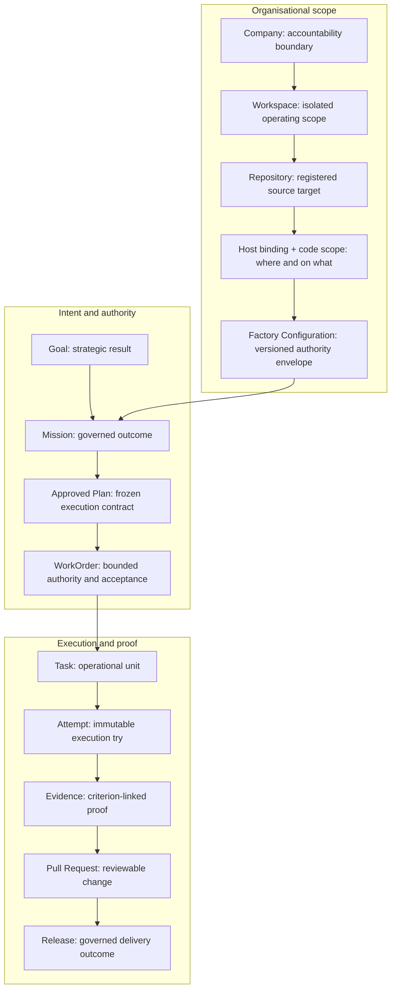
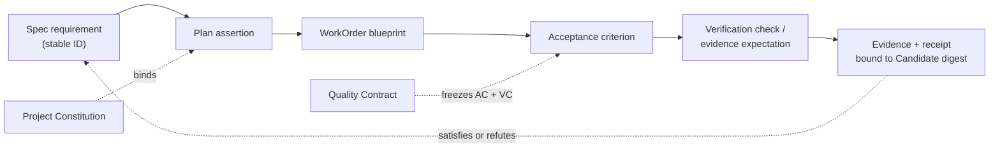
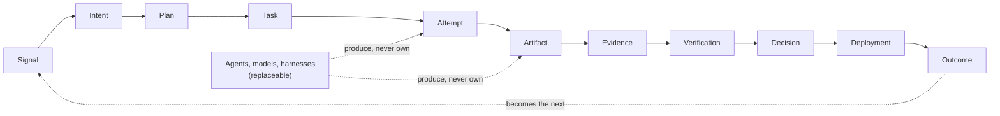
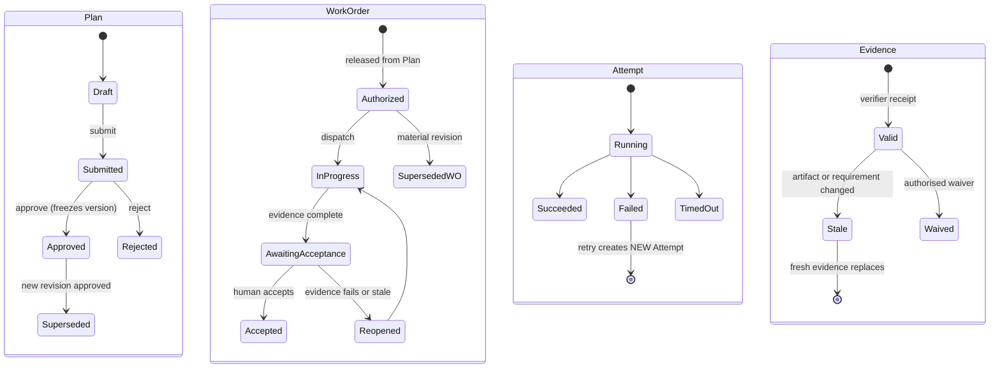
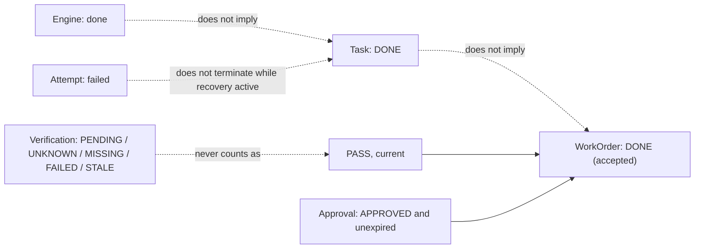
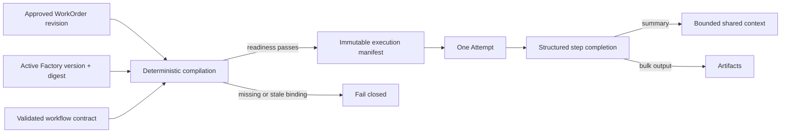
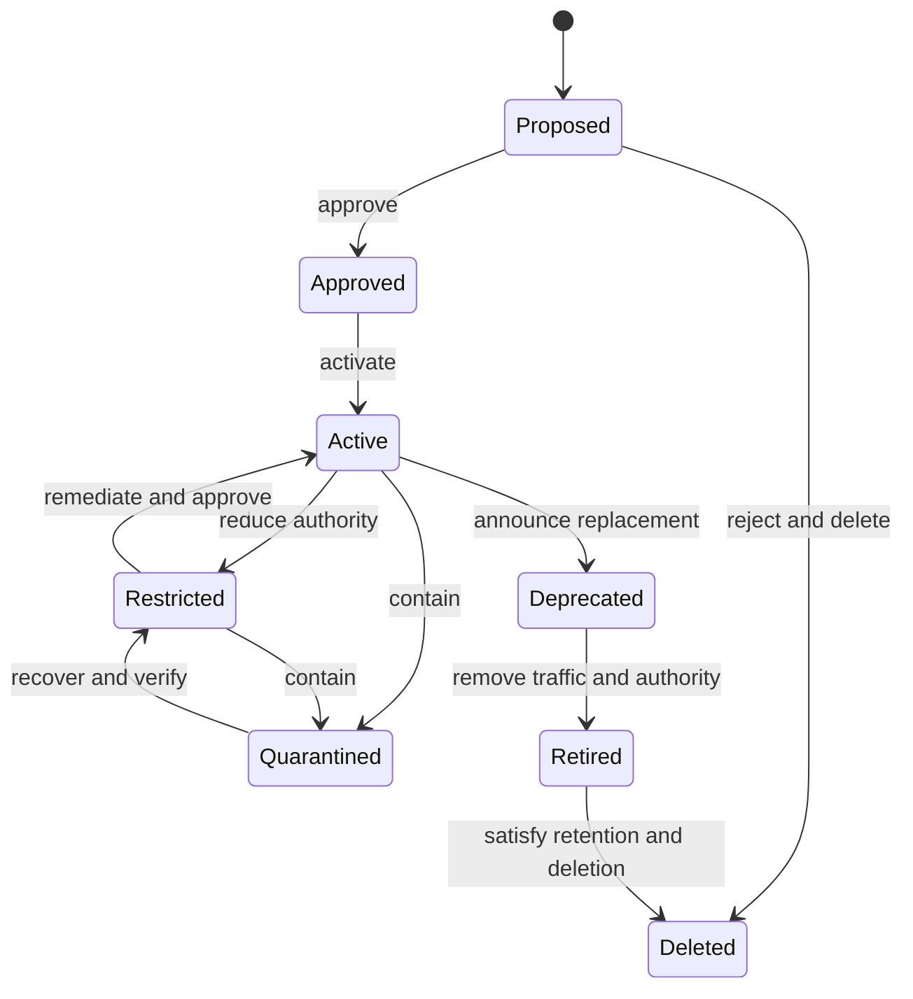

# 5. Authoritative records: from company to release

An AI Software Factory produces an enormous amount of activity: conversations, plans, tasks, tool calls, commits, test runs, pull requests, deployments. If those things are stored as interchangeable "items with a status", the factory cannot answer the questions a governed system must answer. This chapter lays out the twelve records that hold the answers, the companion records a control plane grows around them once it has been operated for a while, the decision each one owns, and why the boundaries between them are the thing that makes the factory trustworthy. After reading it you should be able to draw the hierarchy from memory, defend every split in it, and diagnose a design in which two records have quietly collapsed into one.

## The problem

Ask a conventional task tracker whether a piece of work is done and it will show you one of three states: to do, in progress, done. That vocabulary was enough when a person was reading the issue, remembering the conversation, recognising the branch, and filling every gap with organisational context. It is not enough when the work is being done by agents.

"Done" in an agentic system can mean at least seven different things, each with a different owner and different proof. An agent stopped running. A Task completed. The tests passed. A pull request was opened. A reviewer approved. A deployment succeeded. A customer got the value the work was meant to deliver. Collapse those into one word and you lose the ability to say which of them actually happened.

The people who feel this are the ones who have to answer governance questions after the fact. What outcome was authorised? Which code change belongs to it? Who approved the plan? Which execution produced this artifact? Which validator checked it, and does its passing result still apply to the current commit? Who accepted the business outcome? None of these can be answered from a status field.

The failure gets worse when one record owns too much. If a Task also acts as the business outcome, the authorisation contract, the runtime, the evidence store, and the release state, every update to it carries ambiguous meaning. A runtime process can accidentally mark business work as accepted. A new commit can leave old test results looking current. A revised requirement can overwrite the authority under which earlier work was performed. Agents make this worse than humans do: they cross model, process, tool, and session boundaries, they retry, they run concurrently, and they emit duplicated or late events, and their output must still make sense after their context is gone.

The hierarchy in this chapter exists for one reason: to stop lower-level execution facts from silently changing higher-level governance facts.

## How it works

### One record, one governing responsibility

The organising rule is simple. Each important record owns exactly one kind of decision. It may summarise the state of its children, but it must never borrow their meaning. A Mission can display that four of its five WorkOrders are accepted; it cannot become accepted because they are.

A useful analogy is a hospital chart. Admission, diagnosis, treatment orders, the nurse's administration record, lab results, discharge, and follow-up are all separate entries made by different people with different authority. Nobody would accept a chart in which "the lab ran a test" automatically wrote "patient discharged". The factory's records work the same way: every entry says who decided what, on the basis of which earlier entries, and nothing downstream can retroactively promote itself.

The full conceptual hierarchy is:

`Company → Workspace → Repository → Factory Configuration → Mission → Approved Plan → WorkOrder → Task → Attempt → Evidence → Pull Request → Release`

Two records sit around that spine once a control plane has been operated for a while, and they are drawn in the diagram because they change where authority begins and where it may act. A **Goal** sits above the Mission and holds the strategic result the Mission serves; it owns an outcome, never execution state. Beneath the Repository, a **host binding** and a **code scope** say where and on what the factory may act at all. Both are introduced in full a few sections down.

<!-- infographic: delivery-hierarchy -->
> **Infographic — The authoritative delivery hierarchy.** *(Jay's graphic goes here.)* Until then, the diagram below carries the same concept.

The arrows show lineage, not automatic completion. Child progress may inform a parent decision; it cannot make that decision by implication.

The hierarchy contains three connected structures. **Organisational scope** establishes who and what the factory may govern: Company, Workspace, Repository, and Factory Configuration. **Intent and authority** translate an outcome into approved work: Mission, Plan, and WorkOrder. **Execution and proof** preserve what happened and whether it is acceptable: Task, Attempt, Evidence, Pull Request, and Release.

### The "why" questions

The boundaries in the hierarchy are the ones people push back on, so it is worth answering the pushback directly.

**Why a Mission instead of an Epic?** An epic is a container for tickets; it groups work but owns nothing. A **Mission** is one durable, governed outcome. It owns the objective, the business reason, the context, the constraints, the sources of truth, the owner, the risk class, the stop condition, the budget, and the measurable acceptance criteria. It coordinates work without becoming the runtime that performs it. The difference matters because agents optimise whatever they are pointed at. Point them at Tasks and they will complete Tasks while the original business outcome drifts or disappears. The Mission is the record that keeps "why" attached to "what".

**Why a WorkOrder instead of a Task?** A ticket describes work. A **WorkOrder** is a contract between human intent and agent execution. It defines a bounded desired outcome, the repository and branch strategy, the permitted scope, constraints, dependencies, risk, model limits, required approvals, acceptance criteria, and the conditions under which the agent must escalate to a human. It is the primary unit of engineering authority and of acceptance. Without it, tool access and work scope are inferred from conversation, which means nobody actually decided them. A **Task**, by contrast, is a bounded operational unit inside authorised work. It gives you decomposition, assignment, dependency, and progress. It does not own business acceptance and it cannot expand the WorkOrder's authority. When Tasks replace WorkOrders, operational completion is mistaken for accepted value. When WorkOrders are used without Tasks, execution becomes too coarse to schedule, recover, or assign.

**Why immutable Attempts?** An **Attempt** is one execution try. It owns its runtime identity, the exact input versions it received, the worker, the tools, the worktree, the timeline, the status, the artifacts, the cost, the errors, and the reason it terminated. A retry creates a new Attempt; it never rewrites the failed one. The reason is that each try is a fact, and facts are not edited. If the second try overwrote the first, the factory could not reconstruct causality, could not detect duplicate execution, could not compare two recovery hypotheses side by side, and could not audit what actually ran. The name is negotiable (ExecutionRun and WorkflowRun are common); the invariant is not.

**Why server-owned state transitions?** Every record above has a lifecycle, and the question is who is allowed to move it. The answer is deterministic control-plane code, never the agent. An agent may recommend that a pull request be opened or a deployment proceed; it may not open, approve, merge, or deploy. If the agent's narrative could advance state, then a fluent sentence such as `STATUS: done` would be indistinguishable from proof. Server-owned transitions also make retries safe: every command carries actor identity, the expected record version, a reason, an idempotency key, the policy decision, and the resulting event, so a stale approval cannot overwrite a later containment action.

**Why evidence instead of status?** A status is a claim. **Evidence** is criterion-linked proof produced by a known verifier against an exact artifact in a known environment. It records method, result, provenance, freshness, artifact hashes, source commit, and validity. Evidence may pass, fail, become stale, conflict with other evidence, or require an authorised waiver. It is never an agent's narrative. A status field says "tests passed"; evidence says which tests, run by which verifier, against which commit, and whether that commit is still the one under review. Without criterion linkage and provenance, a factory can present confidence without proof.

**Why does Plan approval not dispatch anything?** A **Plan** is a versioned proposal for achieving a Mission. It records research, unknowns, sequencing, WorkOrder blueprints, validation assertions, cost, and rollback approach. Approval freezes exactly one version and permits its authorised WorkOrders to be materialised. That is all it does. It does not dispatch an agent, satisfy a WorkOrder's own risk approval, accept evidence, merge code, or deploy software. Keeping these separate is what lets the factory prove that execution followed what the human actually reviewed.

**Why keep Pull Request and Release apart?** A **Pull Request** is the source-control review boundary. It owns the repository comparison, the branch, the head SHA, the checks, the review state, and the merge result, and its review package links back to the Mission, Plan, WorkOrder, Attempts, and Evidence. It is not the WorkOrder and it does not prove customer value. A **Release** is the governed progression of an accepted change through merge, deployment, activation, observation, rollback readiness, and production verification. Each stage introduces new risk and needs different evidence. Collapse them and "merged", "deployed", "enabled", "healthy", and "valuable" become one misleading word. Both records may live in external systems; the factory still needs durable references, exact versions, provider events, and its own governed interpretation of their state.

### The organisational records

The top of the hierarchy is easy to skip because it looks like plumbing. It is not.

The **Company** is the highest accountability and data-isolation boundary. It owns organisational identity, membership, broad policy, and ultimate risk ownership. It does not describe a product outcome or authorise repository work. Without it, users, credentials, policies, costs, and evidence leak across organisations.

A **Workspace** is an isolated operating scope within a Company. It groups the people, repositories, configurations, Missions, and permissions for a product, a team, or a bounded initiative. It does not itself prove access to a specific repository or environment. Without it, every policy becomes organisation-wide and teams cannot reason about local authority, ownership, or cost.

The **Repository** record identifies an exact source-control target and its connection status: provider identity, canonical name, default branch, installation linkage, readiness, and repository-specific policy overrides. Registration is not authorisation to mutate. Without a first-class Repository, the system confuses similarly named repositories, acts on stale credentials, or loses the link between work and source lineage.

The **Factory Configuration** is a versioned authority envelope for operating on a Repository. It binds an approved workflow, an executor and its version, policy, environment, budget, verifiers, risk boundary, and recovery controls, and a digest identifies the exact configuration that was evaluated at dispatch. It answers "under which operating rules may this factory work here?", not "what outcome is wanted?". Without versioning, a run cannot prove which tools, policy, budget, or validator set governed it. Editing configuration in place destroys reproducibility. The next section goes deeper on this record because it is where most reproducibility bugs hide.

### Goal, host binding, code scope, and Run

Four records that the twelve-record spine does not name turn out to be needed the first time a factory serves more than one team on more than one machine. Each answers a question the spine leaves implicit.

The **Goal** answers "what strategic result is this Mission for?". A Goal owns an outcome and nothing else: it has no execution state, no budget of its own to spend, and no acceptance criteria that an agent could satisfy. It is the parent of one or more Missions, and it exists so that a Mission can be abandoned, superseded, or split without losing the reason it was started. In product terms the Goal is where an executive's intent lives; the Mission is where an engineering owner's intent lives. Neither becomes done because the other did.

The **host binding** answers "on which runtime host may this Repository's work execute?". A Repository record says which source target is authorised; a host binding says which worker host, sandbox, or execution backend is authorised to touch it, with its own readiness state. The **code scope** answers "on which paths inside that Repository?": a governed allowlist, typically of monorepo paths, that is frozen into the execution manifest and enforced at dispatch and again when changed files are compared with authority before publication. The rule that gives both records teeth is simple and should be enforced in the dispatch preflight rather than in a prompt: *dispatch is blocked until an active host binding and a code scope exist*. A WorkOrder released from an approved Plan with neither is authorised work with nowhere it may lawfully run, and the correct state for it is blocked, not "defaulted to the developer's laptop and the whole tree".

The **Run** answers "what did the agent do in this turn?". Beneath the Attempt, which is one immutable execution try, a Run is one low-level agent turn: a model call, its tool invocations, and its observations, recorded in order with a sequence number. An Attempt usually contains many Runs; a Run never contains an Attempt. The layer exists because an Attempt's timeline is too coarse for forensics (which turn widened the diff? which turn read the injected document?) and a Run is too fine for governance (no Run ever needs approval; the Attempt does). Keep the two names distinct in schema and in conversation. "The run finished" and "the Attempt completed" are different claims, and only the second one is a fact the control plane will act on.

Alongside these sits a naming rule that saves a design from growing a second lifecycle. The **Software Factory** record, where a control plane has one, is a thin versioned configuration: it references the approved repositories, workflows, executors, agents, policies, budgets, and verifiers that a team is allowed to compose, and a version of it is what the Factory Configuration above binds. It is not a second execution lifecycle. A factory has no states of its own beyond the versioning states of any configuration record; Missions, WorkOrders, Tasks, and Attempts carry the lifecycle, and a design in which "the factory is running" is a state that something can be in has quietly created a parallel machine that nothing in the evidence chain references.

### Record cards

The table below compresses each record into the five facts worth memorising: what it owns, what it explicitly does not own, who creates it, where its lifecycle ends, and what evidence hangs off it.

| Record | Owns | Does not own | Created by | Terminal states | Evidence attached |
| --- | --- | --- | --- | --- | --- |
| Company | Identity, membership, broad policy, ultimate risk ownership, data isolation | Product outcomes, repository authority | Platform administration | Archived | Audit trail of policy and membership changes |
| Workspace | Operating scope: people, repos, configs, Missions, permissions, cost | Proof of access to a specific repo or environment | Company admin | Archived | Ownership and permission history |
| Repository | Provider identity, canonical name, default branch, installation link, readiness, policy overrides | Authority to mutate the repo | Workspace admin via provider connection | Disconnected, Removed | Connection and readiness checks |
| Host binding and code scope | Authorised runtime host and its readiness; governed path allowlist | The outcome; the executor's behaviour | Workspace admin; frozen into each manifest | Revoked, Superseded | Host readiness; changed-file comparison against scope |
| Factory Configuration | Versioned envelope: workflow, executor, policy, environment, budget, verifiers, risk, recovery, agent versions, code scopes; digest | The business outcome | Platform or workspace owner; each change is a new version | Retired version | Readiness assessment, promotion evidence |
| Goal | Strategic result; the reason its Missions exist | Execution state, budget spend, acceptance of any Mission | Business or executive owner | Achieved, Abandoned, Superseded | Outcome measures rolled up from Missions, never Mission state itself |
| Mission | Objective, business reason, context, constraints, sources of truth, owner, risk, stop condition, budget, acceptance criteria | Runtime execution | Human owner from intent | Accepted, Abandoned, Stopped | Outcome verification against acceptance criteria |
| Plan | Research, unknowns, sequencing, WorkOrder blueprints, validation assertions, cost, rollback; one frozen approved version | Dispatch, WorkOrder risk approval, acceptance, merge, deploy | Agent or human proposes; human approves | Approved (frozen), Rejected, Superseded | Independent plan review, coverage matrix |
| WorkOrder | Bounded outcome, repo and branch strategy, scope, constraints, dependencies, risk, model limits, approvals, acceptance criteria, escalation conditions | Mission-level outcome, Task progress semantics | Released from an approved Plan | Accepted, Rejected, Superseded, Reopened then closed | Criterion-linked verification receipts, waivers |
| Task | Decomposition, assignment, dependency, progress | Business acceptance, expansion of authority | Orchestrator or agent within a WorkOrder | Completed, Failed, Cancelled | Links to Attempts |
| Attempt | Runtime identity, exact input versions, worker, tools, worktree, timeline, status, artifacts, cost, errors, termination reason | Logical Task identity; any later retry | Dispatcher, one per execution try | Succeeded, Failed, Timed out, Cancelled (immutable) | Run events, artifacts, execution manifest |
| Run | One ordered agent turn under an Attempt: model call, tool invocations, observations | Any approval; the Attempt's outcome | Executor, per turn | Completed, Failed (immutable) | Sequence-numbered events |
| Evidence | Method, result, provenance, freshness, artifact hashes, source commit, validity | The requirement itself | Known verifier against an exact artifact | Valid, Stale, Invalidated, Waived | It is the evidence |
| Pull Request | Comparison, branch, head SHA, checks, review state, merge result, review package links | WorkOrder acceptance, customer value | Control plane on agent recommendation | Merged, Closed | Head-SHA-specific checks and receipts |
| Release | Merge, deployment, activation, observation, rollback readiness, production verification | Review of the change | Release policy and human release authority | Verified in production, Rolled back | Per-stage gate evidence |

### The companion records

The twelve records are the spine. A control plane that has been operated for a while grows a second set of records around them, each created because a specific failure kept happening when the fact it holds was left implicit. In its fullest form the chain reads:

`Company → Workspace → Repository → Project Constitution → Mission → Mission Spec → Plan (versioned) → Plan approval → Quality Contract → WorkOrder → Task → Attempt → Execution Manifest (frozen) → Context Package (frozen) → Worker admission + fenced lease → Execution → Candidate → Verification Subject → Verification Plan (frozen) → Independent verifier → Evidence + receipt + Quality Gate → Pull Request (exact-current) → Human acceptance → Merge → Deployment → Activation → Production verification → Learning`

None of these companions replaces a spine record; each pins down a fact that a spine record would otherwise be tempted to carry loosely.

The **Project Constitution** holds the durable architecture principles, governance expectations, repository rules, quality expectations, and constraints that agents may not reinterpret. It exists before any planner or agent reasons about a Mission, and it is attached to the Plan rather than recalled by the model. *Intent and policy exist before intelligence is applied*, and important system rules should never depend on model memory.

The **Mission Spec** is the immutable statement of what the Mission means: requirements with stable identifiers, measurable outcomes, explicit non-goals, recorded clarifications, acceptance expectations, and repository scope. It is separate from the Mission record because the Mission's operational state (owner, budget, blockers, active WorkOrder) changes constantly while its meaning must not. Before planning starts, deterministic spec-quality checks run against it: are the requirements identifiable? are the outcomes measurable? are there contradictions? are clarifications unresolved? is the scope explicit? is acceptance testable? A failed check blocks planning; it does not ask the planner to guess. *An agent can help clarify intent. It cannot silently redefine intent.*

The **Quality Contract** is the machine-readable projection of the approved Plan: requirements, assertions, invariants, assurance expectations, evidence requirements, and approval policy. It freezes how success will be determined before any execution starts, which is the only way to prevent the definition of success from drifting toward whatever was produced. *Quality is not inferred after generation; it is part of the execution contract.* [Chapter 24](../04-prove/24-quality-contracts-proof-packages-and-certificates.md) gives it a full treatment.

The **Factory Version** is the reproducible execution configuration of the factory itself: runtime configuration, model configuration, tools, policies, data classification, verification configuration, and execution constraints. It is the same idea as the versioned Factory Configuration described above, named from the runtime's side; every Attempt records the exact Factory Version it ran under, because *if you cannot reconstruct what ran, you cannot reliably explain what failed*.

The **frozen execution manifest** was introduced earlier as the dispatch release for one Attempt. As a record it names repository, revision, harness, capability set, policy, budget, data classification, and verifier, all frozen before execution and never mutated underneath a running worker. Data classification (public, internal, confidential, restricted) is part of the frozen contract rather than a runtime lookup. *Reproducibility requires freezing the execution environment, not saving the prompt.*

The **Context Package** is the minimal, frozen, attributable set of context an Attempt receives. It is distinct from **Factory Memory**, the advisory retrieval store the platform maintains: memory is consulted, the package is what actually reached the model, and every item in it carries provenance. The rule that makes the distinction worth a record is that retrieved context cannot change the approved Mission or Plan; *context should inform execution, not rewrite the contract*. A document that reads like an instruction is still data ([Chapter 16](../03-build/16-data-knowledge-semantic-and-context-engineering.md) and [Chapter 26](../04-prove/26-security.md)).

The **Candidate** is exactly what execution produced, immutably identified by digest. It is not correct, not verified, and not accepted; *a Candidate is an output, not a success declaration*, and the harness saying "I'm done" is an event, not evidence. Separating the Candidate from the Attempt stops a completed run from being read as a completed WorkOrder, and separating it from the Pull Request stops a review artifact from being created before anything has been verified.

The **Verification Subject** binds a Candidate to the frozen Verification Plan that will be applied to it, so that a separate verifier Attempt produces evidence and a receipt tied to that exact artifact. This is the record that makes currentness enforceable: if commit A was verified and the branch has moved to commit B, the Verification Subject for A does not cover B, its evidence is stale, and *passing verification on commit A does not authorise merge of commit B*. Because evidence belongs to the artifact rather than to the agent's confidence, an agent cannot change the Candidate and inherit the old receipt. Evidence comes from the system performing the check, never from the system being checked.

| Record | Owns | Does not own | Created by | Terminal states | Evidence attached |
| --- | --- | --- | --- | --- | --- |
| Project Constitution | Architecture principles, governance expectations, repository rules, quality expectations, non-reinterpretable constraints | The outcome of any Mission | Repository or workspace owners, before any Mission | Superseded by a new version | Version history; Plans bind an exact version |
| Mission Spec | Requirement IDs, measurable outcomes, non-goals, clarifications, acceptance expectations, repository scope | Operational Mission state; the Plan | Human owner with agent clarification; immutable once accepted | Superseded by a new Spec revision | Deterministic spec-quality check results |
| Quality Contract | Requirements, assertions, invariants, assurance and evidence expectations, approval policy, frozen at Plan approval | Execution; the decision to accept | Deterministic projection of the approved Plan | Superseded with the Plan revision | Coverage of every criterion by a check |
| Factory Version | Runtime, model, tool, policy, data-classification, verification, and execution-constraint configuration | The WorkOrder's authority | Platform owner; each change is a new version | Retired | Readiness and promotion evidence |
| Execution manifest | Repository, revision, harness, capability set, policy, budget, data classification, verifier for one Attempt | Anything after execution starts | Deterministic compilation at dispatch | Immutable | Digest recorded on the Attempt |
| Context Package | The exact frozen, attributable context an Attempt received | The Mission or Plan it informs; Factory Memory | Context service at dispatch | Immutable | Provenance per item; package digest |
| Candidate | The immutable output of execution, by digest | Correctness, verification, acceptance | Execution, on Attempt completion | Immutable; may be superseded by a new Candidate | Links to Verification Subject |
| Verification Subject | Binding of Candidate, frozen Verification Plan, verifier Attempt, evidence, receipt, Quality Gate decision | The Candidate's content; acceptance | Control plane when a Candidate is presented | Verified, Failed, Stale | The receipt, bound to the exact digest |

The state-machine principle that all of these serve is easiest to remember as an inequality: *execution completed ≠ verification passed ≠ acceptance ≠ merge ≠ production verified*. Each transition needs its own evidence and its own authority, and after merge the stages of deployment, activation, and production verification remain distinct. Code complete is not factory complete. Verification and acceptance in particular are different questions: verification asks whether the artifact satisfied the machine-checkable contract; acceptance asks whether we are authorising progression. Correctness and authority are separate concerns, and a control plane that lets a passing Quality Gate imply acceptance has quietly merged them.

### The traceability chain

The companion records make one more thing possible: an unbroken chain from a sentence in the Mission Spec to a check that ran against an exact artifact. The chain is a requirement on the design, not a nice-to-have, because it is the only way to answer "which check proves this requirement?" and "which requirement does this failing check threaten?" without a human reconstructing the answer.

<!-- infographic: traceability-chain -->
> **Infographic — From requirement to verification check.** *(Jay's graphic goes here.)* Until then, the diagram below carries the same concept.

Every hop is a reference to a stable identifier, never a copy of text, so that a revised requirement can enumerate exactly which assertions, WorkOrders, criteria, checks, and receipts it invalidates. Plan approval sits on this chain with precise semantics: a human approves one exact Plan revision, bound to an exact Mission Spec and Constitution; a change in intent creates a new revision and never mutates the approved one; and approval does not dispatch execution, it authorises the release of governed WorkOrders. *Intelligence can recommend. Authority is granted separately.* The planner that produced the Plan is replaceable; the Plan, once approved, is governed. [Chapter 6](./06-intent-and-specification-engineering.md) builds the top of this chain; [Chapter 21](../04-prove/21-quality-and-evidence-architecture.md) and [Chapter 24](../04-prove/24-quality-contracts-proof-packages-and-certificates.md) build the bottom.

### The factory data model

Step back from the organisational and companion records and the whole thing has a canonical shape that practitioners building factories in the open have converged on independently. The **factory data model** is the canonical representation of signals, intent, plans, tasks, executions, artifacts, evidence, verification, approvals, deployments, and outcomes, and its object chain reads:

`Signal → Intent → Plan → Task → Attempt → Artifact → Evidence → Verification → Decision → Deployment → Outcome`

It is the same spine as this chapter's hierarchy with the organisational scope folded away and two ends extended. The reconciliation is direct:

| Canonical object | This chapter's record | Note |
| --- | --- | --- |
| Signal | *(new; see below)* | The observable event that precedes intent |
| Intent | Goal, Mission, Mission Spec | Why the work exists and what it means |
| Plan | Approved Plan, Quality Contract | How, and how success will be judged |
| Task | WorkOrder, Task | The canonical chain uses one word for the authority-and-acceptance unit and the operational unit; this chapter keeps them apart |
| Attempt | Attempt, Run, execution manifest, Context Package | One immutable try with its frozen inputs |
| Artifact | Candidate | The output, by digest |
| Evidence | Evidence, receipt | Criterion-linked proof against the exact artifact |
| Verification | Verification Subject, Quality Gate | The binding of artifact to frozen verification plan and its result |
| Decision | Approval, acceptance | Authority granted separately from correctness |
| Deployment | Pull Request, Release | Merge, deploy, activate, observe |
| Outcome | Production verification, observed outcome | What actually happened, which becomes the next signal |

<!-- infographic: factory-data-model -->
> **Infographic — The canonical object chain.** *(Jay's graphic goes here.)* Until then, the diagram below carries the same concept.

The reason to hold the canonical chain beside the detailed hierarchy is the sentence it exists to enforce: *agents and models change; the durable artifacts remain.* Every object in the chain is a record the control plane owns, and none of them is a property of the agent that produced it. Swap the model, replace the harness, retire an agent definition, and the Intent, Plan, Attempt, Artifact, Evidence, and Outcome records are unchanged, still linked, and still answer the governance questions. A factory whose data lives in an agent's memory or a vendor's session log has the opposite property, and it will discover that on the day the vendor changes.

The chain also adds a record this chapter has not yet named. A **Signal** is an observable event indicating a potential need for change: customer feedback, a support case, a bug report, telemetry, an incident, an issue, an analytics shift, a security finding, a performance regression, an engineering discussion. It sits before intent, and it is a record rather than an inbox because the factory's boundary is signal-to-outcome, not ticket-to-code ([Chapter 2](../01-understand/02-the-factory-in-one-view.md#the-lifecycle-above-the-six-areas)). Signals need ingestion, classification, correlation, deduplication, prioritisation, and routing into actionable work, and a Goal or Mission created from one should reference it, so that the Outcome at the far end of the chain can be compared with the Signal that started it. An Outcome that produces new signals closes the loop; a Signal that produced no Intent is a decision not to act, and that decision is worth recording too.

### Record lifecycles

Each record moves through its own states, and the states are deliberately not shared. The diagram shows the four lifecycles that interact most often. Note the shape: a Plan can only be approved once per version; a WorkOrder that changes materially is superseded rather than edited; an Attempt never leaves a terminal state; Evidence can move from valid to stale without anyone touching it, simply because the artifact it was bound to changed.

<!-- infographic: record-lifecycles -->
> **Infographic — Record lifecycles.** *(Jay's graphic goes here.)* Until then, the diagram below carries the same concept.

### The authoritative state machines

The lifecycle diagram above shows the shape. A working control plane needs the exact vocabulary, because operators, dashboards, and adapters all have to agree on what a word means. The table gives the seven state lists a mature control plane keeps, one per record, as they stand in the Mission Control lexicon reviewed for this edition. Your names may differ; the number of machines and the rules beneath the table should not.

<!-- infographic: authoritative-state-machines -->
> **Infographic — Seven state machines, no implied transitions.** *(Jay's graphic goes here.)* Until then, the table and diagram below carry the same concept.

| Record | States | Terminal |
| --- | --- | --- |
| Mission | DRAFT, PLANNING, AWAITING_PLAN_APPROVAL, READY, IN_PROGRESS, BLOCKED, AWAITING_VALIDATION, AWAITING_ACCEPTANCE, DONE, CANCELED, SUPERSEDED | DONE, CANCELED, SUPERSEDED |
| Plan | DRAFT, PROPOSED, APPROVED, REJECTED, SUPERSEDED | REJECTED, SUPERSEDED (APPROVED is frozen, not terminal) |
| WorkOrder | DRAFT, READY, DISPATCHED, IN_PROGRESS, BLOCKED, AWAITING_APPROVAL, AWAITING_VERIFICATION, REOPENED, DONE, CANCELED, SUPERSEDED | DONE, CANCELED, SUPERSEDED |
| Task | INBOX, READY, IN_PROGRESS, REVIEW, NEEDS_APPROVAL, BLOCKED, DONE, FAILED, CANCELED | DONE, CANCELED |
| Attempt | queued, running, paused, completed, failed, canceled, timeout | completed, failed, canceled, timeout (immutable) |
| Verification | PENDING, PASS, FAIL, WAIVED, STALE; a review package additionally shows VERIFIED, UNKNOWN, MISSING | None is final: STALE can follow PASS |
| Approval | NOT_REQUIRED, PENDING, APPROVED, REJECTED, CONDITIONAL, EXPIRED | REJECTED, EXPIRED |

Five rules govern how the seven machines relate, and each one closes a specific hole.

*No state implies the next.* A Mission in AWAITING_ACCEPTANCE is not accepted; a WorkOrder in AWAITING_VERIFICATION has no verdict; an Attempt that completed has produced a Candidate and nothing more. Every forward move is a command with an actor and evidence.

*Task Done ≠ WorkOrder accepted ≠ engine done ≠ Definition of Done.* Four different sentences hide behind the word "done". A Task reaching DONE says the operational unit finished. A WorkOrder reaching DONE says an authorised human accepted it on current evidence. An execution engine reporting that it is done says a process stopped and returned a result. The Definition of Done is the contract all three are measured against and satisfies none of them by itself. Dashboards that show one "done" column have merged four decisions into one word.

*A failed Attempt does not make the Task terminal while recovery is active.* Task FAILED is reached only when the bounded recovery policy is exhausted or a human stops it; until then a failed Attempt leaves the Task in BLOCKED or IN_PROGRESS with a new Attempt pending. This is why Attempt states are lower-case and Task states upper-case in the table: they are different machines, and an adapter that writes the Attempt's failure straight into the Task has collapsed them.

*None of UNKNOWN, MISSING, PENDING, FAILED, or STALE is success.* Only PASS (and VERIFIED, where the review package distinguishes a criterion from its receipt) counts toward acceptance, and only while it is current. A gate that treats "no failing evidence" as passing has inverted the rule; the absence of evidence is a negative state with its own name.

*Approval is its own machine.* NOT_REQUIRED is a recorded policy outcome, not a missing row; CONDITIONAL carries the condition as data the next gate re-checks; EXPIRED means a decision was made and then aged out, which is different from PENDING. Re-using a WorkOrder state to mean "somebody approved something" loses all three distinctions.

### Factory Configuration, workflow contracts, and execution manifests

An approved WorkOrder states what may be achieved. It does not fully describe the machinery that will do it. If the workflow, agents, prompts, tools, models, repository paths, context, budgets, and recovery rules are resolved *after* dispatch, two nominally identical Attempts can run under different authority. Neither is reproducible and neither is auditable.

This happens because agent runtimes assemble many mutable dependencies. A workflow name may point at new YAML tomorrow. An agent alias may resolve to a different prompt or a different model. A context package may be republished. Repository scope may change. Runtime defaults are convenient for experimentation and fatal for governed execution, because they hide causality.

The fix is to separate three things that are usually blurred together. Think of a flight: the airline's operating certificate, the standard procedures for the aircraft type, and the dispatch release for this specific flight with this crew, this fuel, and this weather are three distinct documents, and an investigator needs all three.

The **Factory Configuration** is the operating certificate: an approved, versioned envelope for one repository binding workflow, executor, policy, environment, risk boundary, budget, verifiers, recovery, agent versions, and code scopes. The **workflow contract** is the standard procedure: it defines the graph of roles and steps, their dependencies, inputs, structured outputs, failure policy, handoffs, and concurrency. The **execution manifest** is the dispatch release: an immutable, Attempt-specific compilation of the WorkOrder revision and the active Factory version, recording exactly what the worker received and which authority applied.

<!-- infographic: factory-configuration -->
> **Infographic — From configuration to execution manifest.** *(Jay's graphic goes here.)* Until then, the diagram below carries the same concept.

Four rules make this work.

*Hash the behaviourally relevant inputs.* The Factory digest must change whenever a change could alter execution: workflow version, executor, policy, environment, model route, agent version, prompt or tool hash, context lock, code scope, budget, validators, risk, or recovery. It must not change for cosmetic reasons, so serialisation has to be canonical; object insertion order must never create a false change.

*Compile before dispatch and fail closed.* Readiness verifies that every referenced component exists, is approved, active, compatible, and current. Compilation rejects missing agent bindings, unsafe workflow authority, invalid scope, stale context, or an executor that cannot satisfy the recovery contract. An incomplete manifest is not permission to fall back to runtime defaults.

*Use structured completion.* A substring such as `STATUS: done` cannot prove which assertions completed, what remains unknown, or what evidence exists. Every step should emit a schema-validated status with completed, incomplete, and unknown assertions, evidence references, risks, next action, and owner. Agents may recommend a pull request or a deployment; deterministic control-plane code owns publication and approval.

*Bound the handoffs.* Unbounded step output copied into the next prompt raises cost, injection risk, and context drift. Large outputs become artifacts; compact summaries enter the shared context. Retry resumes from durable checkpoints rather than replaying an entire transcript.

There is a tradeoff. Freezing all inputs reduces flexibility and increases version-management work. That cost is justified whenever the work mutates anything. Read-only exploration may use a lighter manifest, provided policy states explicitly which inputs may float. Similarly, strict output schemas can constrain useful reasoning; the schema should govern handoff claims and evidence, not force every thought into rigid fields, and artifact references preserve the rich detail outside the bounded context.

### The system inventory

The records so far describe one flow of work. Above them sits a different question: across the whole organisation, which autonomous delivery systems exist, what is each allowed to do, who accepts its risk, what data and downstream systems does it touch, and should it still be operating? Capabilities, models, repositories, policies, evidence, environments, and deployments all live in different registries, and no single one of them can answer that.

The **Factory System Record** (written `FactorySystemRecord` in the schema) is the governed accountability and classification record for one material autonomous delivery system: it identifies purpose, owners, scope, registry references, data, integrations, risk, autonomy ceiling, evidence, incidents, and lifecycle without duplicating the authoritative service, capability, model, policy, or evidence registries. Its discipline is to inventory the governed system and *reference* its parts: it points at immutable versions or registry identifiers and never becomes a second service catalogue, capability registry, model registry, policy store, or evidence store. Governance owns the schema and the review policy; registry owners stay authoritative for their own objects.

A record carries: a purpose, the accepted outcomes, and the prohibited purposes; named owners for business, engineering, security, operations, and independent assurance; scope (repositories, workflows, environments, deployment targets, tenants); configuration references (agents, models, prompts, tools, skills, evaluators, each pinned to a version); data facts (sources, highest classification, residency, retention policy); authority (criticality, risk tier, autonomy ceiling, approval policy, prohibited actions); and operations (lifecycle state, evidence status, last and next review, exception and incident references, performance reference, cost centre). Required references also include integrations, identities, credential brokers, trust boundaries, external providers, downstream side effects, drift status, cost, outcome measures, open incidents, and unresolved exceptions. Every reference must resolve to an exact version or a documented moving alias with change notification.

The invariant is that no active system lacks an accepted purpose, an accountable owner, a risk tier, an autonomy ceiling, a lifecycle state, and current review evidence. The evidence boundary is equally important: a complete record proves inventory discipline, not control effectiveness.

Classification combines business impact, data sensitivity, side-effect class, deployment reach, reversibility, user impact, dependency criticality, and evidence strength. The highest material risk sets the autonomy ceiling; averaging several low risks cannot cancel one catastrophic action. Review is both periodic and event-driven: reassess after a new data class, model family, privileged tool, deployment target, or supplier, after a critical incident, material drift, control failure, or ownership change, and before any autonomy promotion. Expired review evidence moves the system to restricted operation or blocks new high-risk work.

Each transition is a command with a named decision owner, required evidence, and conditions under which it is invalid:

| Command | Authorised decision owner | Required evidence | Invalid when |
| --- | --- | --- | --- |
| Approve | Business, engineering, security, and assurance owners by risk | Purpose, architecture, risk, tests, controls | Critical fields or owner acceptance missing |
| Activate | System owner plus release policy | Qualified version and current proof package | Review expired or dependency revoked |
| Restrict | Control owner or incident authority | Reason, reduced ceiling, affected scope | Requested ceiling is broader than current |
| Quarantine | Emergency authority | Incident or credible control failure | Never blocked by ordinary change windows |
| Deprecate | System and capability owners | Replacement or exit plan, notice | Active dependents have no disposition |
| Retire | System owner and operations | Traffic stopped, grants revoked, records retained | Active work or unresolved downstream effect exists |
| Delete | Data owner | Retention satisfied, deletion receipt | Legal, incident, or audit hold exists |

Compare-and-set updates on the record version keep a stale approval from overwriting a containment action. The schema itself is versioned: additive optional fields may be backward compatible, but changed meanings, new required fields, and altered lifecycle semantics require migration and consumer testing. Inventory reads stay available during incidents; writes go to durable storage with an auditable outbox; only non-authoritative views are cached. Operating cost is tracked by system and accepted outcome, not only raw model usage. Because an inventory reveals sensitive architecture, its data is classified and access-controlled.

A spreadsheet can start a small inventory but weakens referential integrity, event handling, and policy enforcement. A graph improves dependency and blast-radius analysis but does not replace authoritative registry ownership. Start with one record API and explicit references; add graph projections only when measured review or incident needs justify them.

### The five invariants

Everything above reduces to five statements. If a design satisfies all five it has the hierarchy, whatever it calls the records.

1. Every material action traces upward to human-governed intent.
2. Every run records the exact versions of its WorkOrder, workflow, Factory Configuration, repository, and policy.
3. No child record silently completes or accepts its parent.
4. Material change creates a new version and invalidates affected authority or evidence.
5. Every acceptance decision can trace downward to fresh evidence and exact artifacts.

## How to build it

The hierarchy costs more records and more transitions than a task tracker. That is a real cost, and small low-risk work will feel slower if every concept becomes a form and an approval. The right response is not to collapse the model but to automate routine record creation, inherit safe defaults, and scale required human attention with risk (Chapter 7 covers the risk-proportional side).

**Step 1 — Establish scope records first.** Create Company, Workspace, and Repository with explicit ownership before any Mission exists. Repository registration must include provider identity, canonical name, default branch, installation linkage, and a readiness status that the control plane, not a person, maintains.

**Step 2 — Version the Factory Configuration.** Every change produces a new immutable version and a new digest. Include in the digest, at minimum:

- workflow version and validated contract;
- executor and executor version;
- policy, environment, and risk boundary;
- budget, validators, and recovery controls;
- model route, agent versions, prompt and tool hashes;
- context lock and repository code scopes.

Activate a version only after readiness passes; retire versions rather than editing them.

**Step 3 — Define the intent records as contracts.** A Mission must carry objective, business reason, context, constraints, sources of truth, owner, risk, stop condition, budget, and acceptance criteria. A Plan must carry research, unknowns, sequencing, WorkOrder blueprints, validation assertions, cost, and rollback approach, and approval must freeze one version. A WorkOrder must carry bounded outcome, repository and branch strategy, scope, constraints, dependencies, risk, model limits, required approvals, acceptance criteria, and escalation conditions.

**Step 4 — Compile an execution manifest at dispatch.** Inputs are the approved WorkOrder revision, the active Factory version and digest, and the validated workflow contract. The manifest records agent version, compiled prompt hash, tools, model, harness, context hash, path authority, and causation. Fail closed on any missing or stale binding. Redact prompt content in public run inspection while exposing hashes and bindings.

**Step 5 — Make every Attempt immutable and every step structured.** Each try gets a new Attempt with exact input versions. Each step emits schema-validated status, completed/incomplete/unknown assertions, evidence references, risks, next action, and owner. Cap shared context (the study implementation used 32 KB per step and 128 KB per run) and push everything else to artifacts.

**Step 6 — Bind Evidence to criteria and artifacts.** Every receipt names the criterion, the verifier, the method, the artifact hash, the source commit, the environment, and the freshness window. Implement staleness as a computed property of "does the bound artifact still match the candidate under review?", not as a manual flag.

**Step 7 — Own transitions server-side.** Every command carries actor identity, expected record version, reason, idempotency key, policy decision, and resulting event. Reject agent-originated publication, review, merge, or deployment authority at the API boundary, not in a prompt.

**Step 8 — Keep Pull Request and Release as governed references.** Store durable references, exact versions, and provider events; interpret their state through factory policy; ensure each PR artifact retains the WorkOrder revision, Factory digest, workflow snapshot, execution-manifest digest, and context-lock digest that caused it.

**Step 9 — Inventory the system.** Create a FactorySystemRecord for each material autonomous delivery system with all owners, risk tier, autonomy ceiling, lifecycle state, and review dates. Wire event-driven review triggers. Emit state-change events with correlation identifiers, and measure inventory completeness, overdue reviews, unresolved owners, stale references, exception age, time to containment, and time to verified retirement.

A design passes review when no lower-level status ever accepts a parent, every piece of evidence traces to an exact Attempt and artifact, a changed prompt visibly changes the digest and stales the affected records, and every object can answer six questions: what parent authorised me, which version governed me, what state am I in and who may change it, which children support my state, what evidence is missing, failed, stale, or conflicting, and which human decision is required next.

## Failure modes

**Collapsed records.** The commonest failure is a Task that is also the WorkOrder, the runtime, and the evidence store. Detect it by asking who can mark the record accepted; if the answer includes a process rather than a person, the collapse has happened. Some systems legitimately merge Task and WorkOrder when a unit is both operationally atomic and independently acceptable; that is safe only if the merged record still preserves authority, acceptance, revision, and evidence boundaries.

**Stale evidence presented as current.** A new head SHA, a republished context package, or a revised requirement leaves earlier evidence looking valid. Detect it by binding evidence to artifact hashes and recomputing validity on every candidate change. Correct it by invalidating and re-running, never by carrying the old receipt forward.

**Configuration edited in place.** A run cannot prove which tools, policy, or validators governed it. Detect it with digest checks at dispatch; correct it by making every configuration change a new version.

**Runtime defaults filling gaps in the manifest.** An incomplete compilation silently resolves to whatever the runtime has today. Fail closed at compile time.

**Heuristic completion.** A workflow gate accepts `STATUS: done` in free text. Reject it: completion must be schema-validated, with explicit unknowns.

**Unbounded context.** Whole transcripts copied between steps raise cost and injection exposure. Cap step and run context and move bulk to artifacts.

**Inventory-level failures.** An orphaned owner (detected by identity-directory reconciliation; block promotion and new grants until a replacement owner accepts). A stale registry reference (detected by version resolution; freeze the affected workflow until the manifest re-resolves and regression tests pass). A hidden downstream action (detected by comparing egress and tool calls with the declared boundary; quarantine the capability and affected systems until the boundary map and side-effect tests are updated). An expired review (detected by a due-date monitor; restrict autonomy until the review is completed with a decision record). A deletion mismatch (detected by reconciling registries with storage; hold closure and notify the data owner until deletion receipts exist across all governed stores).

**Vocabulary drift.** Product terms and schema terms diverge, and operators stop being able to translate. Keep the conceptual vocabulary stable and provide one explicit translation layer.

**Candidate read as success.** The harness reports completion and a dashboard, a notification, or a pull request treats the output as done. Detect it wherever a Candidate exists without a Verification Subject; correct it by making "I'm done" an event that creates a Verification Subject and nothing else.

**Retrieved context rewrote the contract.** A document in the Context Package restated the objective, and the agent followed the document. Detect it by diffing what the Attempt optimised for against the frozen Quality Contract; correct it by keeping Mission and Plan outside the context path and treating retrieved content as data.

**Spec that cannot be checked.** Planning begins on a Mission Spec with unmeasurable outcomes or unresolved clarifications, and the planner fills the gaps. Run the deterministic spec-quality checks before planning and block on failure.

**Dispatch without a host binding or code scope.** A released WorkOrder runs on whatever machine the operator happens to be on, against the whole repository tree, because neither record existed and nothing refused. Detect it by asking the dispatch preflight which host binding and code scope it froze into the manifest; if the answer is a default, the gate is missing. Correct it by blocking dispatch until both exist and are active.

**Engine done written as Task done.** An adapter maps the execution engine's terminal phase directly onto the Task, and a Task reaches DONE with no Candidate, no verification, and sometimes no commit. Detect it wherever a Task is DONE and its Attempt has no Candidate SHA; correct it by mapping engine phases to WorkOrder tendencies only, and by letting the Task advance only through the control plane's own transition with evidence attached.

**A second lifecycle on the factory record.** The Software Factory grows states of its own ("running", "paused", "complete") and operators start reading them as the state of the work. Detect it by asking what evidence a factory state is derived from; correct it by keeping the factory a thin versioned configuration and leaving lifecycle to Mission, WorkOrder, Task, and Attempt.

## In Mission Control

Assessed at commit [`8014d5af`](https://github.com/jaydubya818/MissionControl/tree/8014d5af427b43ff5c5a63cfdf82ec92742c208c) (studied 2026-08-07), with the configuration work assessed at `main` [`b31e275`](https://github.com/jaydubya818/MissionControl/tree/b31e27564deb1c03c167e61b5ee094567c2ba7b1) and study commit [`9d5f8e3`](https://github.com/jaydubya818/MissionControl/tree/9d5f8e36aff45a001a8848cc0516b3dc800e29b8) on draft PR #64 (2026-08-11).

| Concept | Representation | Status |
| --- | --- | --- |
| Company | `tenants` | Implemented as the multi-tenant boundary; product says Company, schema says tenant |
| Workspace | `projects` | Implemented with Company linkage, identity, repository compatibility, policy defaults |
| Repository | `workspaceRepositories` | Implemented: one-to-many with Workspace, GitHub identity, status, branch, webhook state, overrides |
| Factory Configuration | `factoryDefinitions` + immutable `factoryDefinitionVersions` | Implemented with digests, workflow, executor, policy, environment, budget, verifiers, risk, recovery, readiness, controlled activation |
| Mission | `missions` | Implemented with lifecycle, serial mutation policy, budget, corrective limits, stop condition, plan linkage, human-attention fields |
| Plan | `missionPlans` | Implemented as revisions with assertions and WorkOrder blueprints; submit, approve, reject, idempotent release |
| WorkOrder | `workOrders` + governance tables | Implemented: outcome, risk, scope, acceptance, approval, revision, reopen, supersession, audit |
| Task | `tasks` + linkage | Present; legacy and operational responsibilities coexist; target model places Task beneath WorkOrder |
| Attempt | `workflowRuns`, `runEvents`, `runArtifacts` | Implemented as ExecutionRun/WorkflowRun with version, runtime, isolation, steps, events, artifacts, failure detail |
| Evidence | `validationAssertions`, `verificationReceipts` | Implemented with criterion status, verifier run linkage, methods, artifacts, validity, waiver, invalidation |
| Pull Request | `harnessPrChecks`, webhook records, artifacts | Implemented across integration records, not one canonical table; head-SHA evidence and merge data exist |
| Release | deployment and release-gate records | Partial; deployment governance exists, full Mission-to-production-value path is a V1 target |

On `main` at `b31e275`, Factory Configuration is versioned and readiness checks workflow, executor, policy, budget, verifiers, host, recovery, repository, and GitHub. The study branch at `9d5f8e3` additionally freezes agent versions and code scopes into the digest, validates workflow contracts, compiles a per-step execution manifest (agent version, prompt hash, tools, model, harness, context hash, path authority, causation), redacts prompt content in public inspection, rejects heuristic completion and agent-owned PR/review/merge/deploy authority, and caps step context at 32 KB and run context at 128 KB across six workflows. Those are implemented and tested on the branch but are not on `main` while PR #64 is unmerged.

The FactorySystemRecord inventory is a review-ready specification with a synthetic example; it is not implemented in Mission Control and does not claim to prove inventory completeness or control effectiveness anywhere.

The repository's glossary and lexicon, reviewed 2026-09-02, carry the additions in this chapter's "Goal, host binding, code scope, and Run" section and the seven state lists in "The authoritative state machines": readiness already checks a clean host binding at `8014d5af`, code scopes are frozen into the digest on the study branch, and the dispatch rule that blocks work until an active host binding and code scope exist is stated as contract. The Goal record and the Run layer are lexicon vocabulary at that review date; treat them as design direction until a pinned commit shows them in schema and the table above is updated.

Jay's own walkthrough of the current design describes the fuller chain from the companion-records section (Project Constitution, immutable Mission Spec with deterministic spec-quality checks, Quality Contract, Factory Version, frozen execution manifest and Context Package, worker admission with fenced leases, immutable Candidate, Verification Subject with a frozen Verification Plan and a separate verifier Attempt, exact-current pull request, and distinct merge, deployment, activation, and production-verification stages) on a TypeScript and Node stack with Convex as durable state, Git worktrees, and sandboxed execution, with data classification frozen into the execution contract and fail-closed gates. That walkthrough is the author's account of the design at the time of writing and positions the project as an active personal control plane with substantial deterministic qualification, not a fleet-scale production system. The pinned commits above remain the evidence boundary for what this chapter asserts as implemented; where the walkthrough names a record the table does not, treat it as design direction until a pinned commit shows it.

Schema presence is not proof of a coherent product journey. The complete hierarchy becomes a demonstrated capability only when the browser golden path shows creation, execution, failure, recovery, validation, review, and exact source lineage without direct database intervention. Future direction: expose the hierarchy as one navigable lineage, converge implementation names on the canonical vocabulary or ship one translation layer, make PR and Release lineage first-class without duplicating provider authority, and require policy diff, compatibility evaluation, canary evidence, and rollback for Factory promotion.

## Retain this

- The hierarchy is a chain of claims, not a database diagram: `Company → Workspace → Repository → Factory Configuration → Mission → Plan → WorkOrder → Task → Attempt → Evidence → Pull Request → Release`.
- The WorkOrder is the contract between human intent and agent execution; a Task is decomposition inside it. Attempts are immutable because retries are new facts, and Evidence is bound to a criterion, a verifier, and an exact artifact — going stale the moment that artifact changes.
- Plan approval freezes one version and authorises WorkOrders; it does not dispatch, accept, merge, or deploy. All state transitions are owned by deterministic control-plane code with actor, expected version, reason, idempotency key, and policy decision — agents recommend, they never advance.
- The five invariants: upward traceability, exact versions per run, no silent parent completion, new version on material change, and downward traceability from every acceptance to fresh evidence.
- The companion records each pin a fact the spine would otherwise carry loosely: Constitution (rules before intelligence), Mission Spec (immutable meaning, checked before planning), Quality Contract (success frozen before execution), Factory Version (what ran), execution manifest and Context Package (frozen inputs), Candidate (an output, not a success), Verification Subject (evidence belongs to the artifact, not the agent's confidence).
- Execution completed ≠ verification passed ≠ acceptance ≠ merge ≠ production verified. Verification on commit A does not authorise merge of commit B.

## Go deeper

- Previous: [4. The human–agent operating model](./04-the-human-agent-operating-model.md). Next: [6. Intent and specification engineering](./06-intent-and-specification-engineering.md) turns a Mission into an executable specification.
- [7. Governance, policy, and risk-proportional approval](./07-governance-policy-and-risk-proportional-approval.md) for how required approvals scale with risk tier and autonomy ceiling.
- [12. Durable execution](../03-build/12-durable-execution.md) for Attempts, leases, and checkpointed retry; [11. Control plane, orchestrator, and execution plane](../03-build/11-control-plane-orchestrator-and-execution-plane.md) for where transitions are enforced.
- [24. Quality contracts, proof packages, and certificates](../04-prove/24-quality-contracts-proof-packages-and-certificates.md) for the evidence side; [25. CI/CD, progressive delivery, and production verification](../04-prove/25-cicd-progressive-delivery-and-production-verification.md) for the Release stages.
- [30. Control surfaces, event contracts, and storage](../05-operate/30-control-surfaces-event-contracts-and-storage.md) for the command envelope and outbox.
- [Glossary](../appendix/glossary.md); [Mission Control case study: implementation maturity and evidence map](../appendix/mission-control/01-implementation-maturity-and-evidence-map.md).
- Sources for the factory data model and the Signal record: public practitioner talks, 2026.
- Primary sources at the pinned commits: [Mission Control North Star](https://github.com/jaydubya818/MissionControl/blob/8014d5af427b43ff5c5a63cfdf82ec92742c208c/docs/product/mission-control-north-star.md), [V1 Product Strategy](https://github.com/jaydubya818/MissionControl/blob/8014d5af427b43ff5c5a63cfdf82ec92742c208c/docs/product/mission-control-v1-product-strategy.md), [Governed Missions Contract](https://github.com/jaydubya818/MissionControl/blob/8014d5af427b43ff5c5a63cfdf82ec92742c208c/docs/software-factory/governed-missions-contract.md), [Domain Contracts](https://github.com/jaydubya818/MissionControl/blob/8014d5af427b43ff5c5a63cfdf82ec92742c208c/docs/software-factory/domain-contracts.md), [Information Architecture](https://github.com/jaydubya818/MissionControl/blob/8014d5af427b43ff5c5a63cfdf82ec92742c208c/docs/software-factory/information-architecture.md), [Convex schema](https://github.com/jaydubya818/MissionControl/blob/8014d5af427b43ff5c5a63cfdf82ec92742c208c/convex/schema.ts), [Factory configuration](https://github.com/jaydubya818/MissionControl/blob/9d5f8e36aff45a001a8848cc0516b3dc800e29b8/convex/factory/configuration.ts), [PR checks and governed merge](https://github.com/jaydubya818/MissionControl/blob/8014d5af427b43ff5c5a63cfdf82ec92742c208c/convex/factory/prChecks.ts), [Execution manifest compiler](https://github.com/jaydubya818/MissionControl/blob/9d5f8e36aff45a001a8848cc0516b3dc800e29b8/convex/lib/executionManifest.ts), [Workflow contract gate](https://github.com/jaydubya818/MissionControl/blob/9d5f8e36aff45a001a8848cc0516b3dc800e29b8/convex/lib/factoryWorkflowContract.ts), [Structured handoff](https://github.com/jaydubya818/MissionControl/blob/9d5f8e36aff45a001a8848cc0516b3dc800e29b8/packages/workflow-engine/src/handoff.ts), [Todo 025](https://github.com/jaydubya818/MissionControl/blob/9d5f8e36aff45a001a8848cc0516b3dc800e29b8/todos/025-complete-p1-freeze-agent-execution-manifests.md), [Todo 026](https://github.com/jaydubya818/MissionControl/blob/9d5f8e36aff45a001a8848cc0516b3dc800e29b8/todos/026-complete-p1-structured-workflow-contracts-context.md).
- Source notes: Jay West, "AI Software Factory mission" (Intent layer outputs: Missions, WorkOrders, acceptance criteria, constraints, risk, evidence, ownership); Jay West, factory architecture notes and Mission Control walkthrough (Project Constitution, Mission Spec, Quality Contract, Factory Version, frozen manifest and Context Package, Candidate, Verification Subject, currentness, traceability chain, approval semantics); Mission Control repository glossary and lexicon, reviewed 2026-09-02 (Goal, host binding, code scope, Run, the thin Software Factory configuration, and the seven authoritative state lists with their rules).
