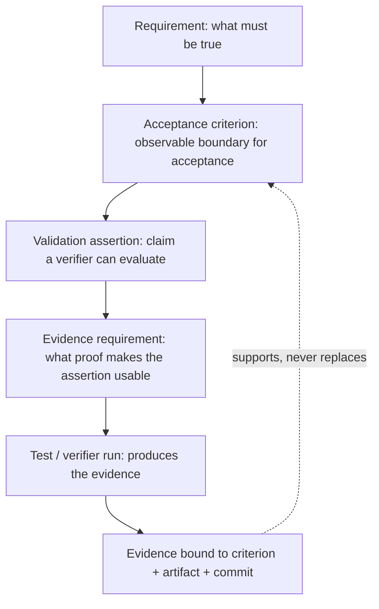
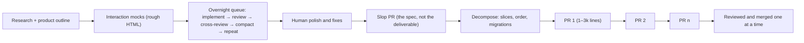

# 6. Intent and specification engineering

The previous chapter described the records that carry work through the factory. This chapter is about the first and most dangerous translation among them: turning what a person wants into something an agent can be held to. Most agent failures that look like coding failures are actually specification failures that happened before any code existed. After reading this chapter you should be able to take an ambiguous request, turn it into a governed Mission with testable criteria, have a plan reviewed against it, and know exactly which downstream records a change to the specification invalidates.

## The problem

"Improve onboarding" is a legitimate business objective. It is also unimplementable. It does not say which users, what behaviour should change, what constraints apply, which outcomes would be unacceptable, or what proof would demonstrate success. When an agent starts from that sentence, the product and risk decisions hidden inside it do not disappear; they are made silently by the executor, one token at a time.

Fluent agents make this failure hard to see. A human engineer handed "improve onboarding" would come back with questions. An agent will produce a confident plan, plausible code, and green tests for whatever interpretation it landed on. The first hallucination in an agentic system usually happens before code: the system invents what "done" means.

The translation fails for predictable reasons. Business language optimises for direction; engineering specifications optimise for decision and verification. Hidden assumptions stay hidden. Quality attributes are omitted because nobody says "and it should still be fast". Examples get mistaken for complete requirements. Acceptance criteria describe activity ("add a retry") rather than observable outcomes ("no duplicate PR is ever created").

Requirements also interact. A latency target can conflict with an audit-retention rule. A data-deletion requirement can conflict with immutable evidence. A plan can cover every functional criterion and still ignore migration, rollback, authorisation, or observability. Completeness is a property of the whole set in its operating context, not of individually polished sentences.

The factory therefore needs an upstream assurance boundary: business intent must become a governed, versioned, testable specification before implementation authority is granted.

## How it works

### Business Understanding is the first layer

In the twelve-layer view of a production agent system (Chapter 19), the bottom layer is not data, models, or infrastructure. It is **Business Understanding**: define the decision, the constraints, the ownership, and the success criteria. Every layer above it selects, retrieves, reasons, loops, and evaluates in service of a decision that was defined here. If this layer is vague, no amount of engineering above it can compensate, because the system will be optimising a target nobody chose.

Think of an architect's brief. A client who says "I want a nicer house" gets whatever the builder feels like building. A client who says "four bedrooms, north-facing living room, under this budget, on this lot, compliant with this code, ready by this date, and here is how we will inspect it" gets a house they can accept or reject on stated grounds. The brief is not the drawings and it is not the building; it is the thing both are judged against.

### The Intent layer: inputs and outputs

Intent arrives from many directions, and a factory should be able to take all of them. Product objectives. Customer problems. Bugs. Feature requests. Operational incidents. Security findings. Reliability targets. Technical-debt priorities. None of these is a specification; each is raw material.

The **Intent layer** turns that raw material into structured engineering work. Its outputs are the records Chapter 5 defined: Missions, WorkOrders, acceptance criteria, constraints, risk classification, required evidence, and ownership. The capabilities involved have names worth knowing because they are what you are actually building or buying:

- **Intent recognition** — understanding the requester's actual goal, which is often not the literal request.
- **Goal interpretation** — translating the request into a concrete outcome.
- **Constraint identification** — recognising the technical, security, policy, and resource boundaries that apply.
- **Acceptance criteria** — defining what "done" means in observable terms.
- **Task decomposition** — breaking complex work into smaller executable units.
- **Planning** — determining the steps and their sequence.
- **Task definition** — creating clear units of work for agents.
- **Dependency mapping** — identifying ordering and dependencies between those units.
- **Agent routing** — selecting the appropriate agent or capability for each unit.
- **Dynamic replanning** — adjusting the plan when execution produces unexpected results, without silently changing the goal.

<!-- infographic: intent-to-plan -->
> **Infographic — From intent to approved plan.** *(Jay's graphic goes here.)* Until then, the diagram below carries the same concept.

```mermaid
flowchart LR
    subgraph Inputs
        Obj["Product objectives"]
        Bug["Bugs and incidents"]
        Sec["Security findings"]
        Debt["Reliability and debt targets"]
    end
    Inputs --> IR["Intent recognition + goal interpretation"]
    IR --> CI["Constraint identification"]
    CI --> M["Mission: outcome, owner, risk, criteria, evidence"]
    M --> Plan["Plan: current state, changes, deps, risks, tests, rollback, cost, open questions"]
    Plan --> Review["Independent plan review"]
    Review -->|approved, version frozen| WO["WorkOrders released"]
    Review -->|revision required| Plan
    Review -->|exception required| Human["Human decision owner"]
```



### From intent to a governed Mission

A Mission is an owned outcome, not a prompt. Converting intent into one means establishing, in writing:

- the business outcome and the affected users;
- scope, exclusions, ownership, priority, and time constraints;
- functional requirements and measurable non-functional requirements;
- architecture, data, security, regulatory, and operational constraints;
- expected failure modes and the recovery behaviour required;
- the risk class and the decision owners it requires; and
- the evidence that will show the outcome was achieved.

Three records share this territory and it is important not to let them merge. The **Mission** is the authority for *why* the work exists. The **Plan** explains *how* the factory proposes to achieve it. The **WorkOrder** authorises a bounded part of that plan. Collapse them and implementation detail starts rewriting business intent, because the record that says "how" has become the record that says "why".

### Requirements, criteria, assertions, and evidence

The heart of specification engineering is a four-way distinction that most teams blur into "the acceptance criteria". Each answers a different question, and a specification that is missing any one of the four cannot be enforced.

<!-- infographic: spec-contract -->
> **Infographic — The specification contract.** *(Jay's graphic goes here.)* Until then, the diagram below carries the same concept.



| Construct | Purpose | Example |
| --- | --- | --- |
| Requirement | What must be true | "A user cannot read another tenant's records." |
| Acceptance criterion | What observable boundary determines acceptance | "Every cross-tenant read returns the policy-defined denial without disclosing record existence." |
| Validation assertion | A specific claim a verifier can evaluate | "Given Tenant A credentials and Tenant B record ID, `GET /records/:id` returns 404 and emits a denied-access audit event." |
| Evidence requirement | What proof makes the assertion usable | Independent integration run, exact build digest, audit-event receipt, tool identity, and freshness window |

Acceptance criteria should be outcome-oriented and implementation-neutral wherever possible; they describe the boundary, not the mechanism. Assertions may be implementation-aware, because they define a method of proof. Tests are evidence-producing mechanisms; they are not the requirement. A test that passes proves the assertion held for that artifact in that environment at that time, nothing more. This is why Chapter 5 insisted that evidence, not status, is what advances work.

### Quality attributes and invariants

Functional behaviour is only part of the contract. A **non-functional requirement** is testable only when it names a measure, an operating condition, a population, a threshold, and an observation window. "p95 latency below 300 ms under the defined load profile over a 24-hour window" can be verified. "Fast" cannot, and an agent asked to make something fast will make it fast by its own definition.

An **invariant** is a condition that must hold across all permitted states and transitions. Tenant isolation. Append-only acceptance history. No deployment without an eligible artifact digest. No completion report from a stale lease. Invariants differ from architecture constraints: constraints say how the solution space is bounded; invariants say what must never become false. Invariants belong at the Mission or Plan level, because a single WorkOrder can be locally complete while violating one.

### Design failure and recovery before the happy path

For each material dependency and each state transition, the specification should say what happens when it fails: timeout, retryability, idempotency, cancellation, partial success, reconciliation, rollback, and the operator-visible state. "GitHub is unavailable" is a failure mode. "The Attempt retains its commit, publication becomes retryable, no duplicate PR may be created, and the operator sees blocked-publication" is a recovery expectation. Only the second one can be implemented and tested. Specifying failure first is not pessimism; it is where most of the unstated decisions live.

### Detecting ambiguity, incompleteness, and contradiction

A **specification assurance pass** reads the specification the way a hostile reviewer would and rejects or flags:

- vague terms such as "appropriate", "quickly", and "secure" without measures;
- compound requirements that contain several independently decidable claims;
- missing actors, conditions, units, thresholds, owners, or evidence methods;
- unbounded words such as "all", "never", and "always" without a domain definition;
- acceptance criteria that merely restate the requirement;
- requirements that cannot be observed or verified;
- conflicting thresholds, states, authorities, retention rules, or dependencies;
- unresolved assumptions presented as facts; and
- orphan requirements with no plan coverage or evidence route.

Automated analysis, including an LLM acting as critic, may propose findings. Business meaning and risk acceptance remain human decisions. A useful finding is itself a small record: severity, the affected requirement IDs, rationale, a proposed resolution, an owner, and a deadline.

LLMs are good ambiguity critics and bad requirement authors, because they invent implied requirements with the same fluency they use to find missing ones. Preserve provenance: distinguish stakeholder statements, policy-derived constraints, agent-proposed assumptions, and human-approved decisions. A specification that cannot say where each line came from cannot say which lines a human actually agreed to.

### The Planning layer and independent review

Once a Mission exists, agents investigate the environment and propose a **Plan**. A plan that is fit for review contains: current-state understanding; the relevant code and architecture; the proposed changes; dependencies; risks; the test strategy; the rollback strategy; estimated cost and complexity; and the questions that require human judgment. That last item is the one most often missing, and it is the most valuable, because a plan that raises no questions is either trivial or hiding its assumptions.

**Plan assurance** happens before any code is mutated. A reviewer separate from the plan's producer evaluates requirement coverage, architecture alignment, dependency and supply-chain impact, threat implications, test strategy, rollout, migration, rollback, observability, cost, and unresolved assumptions. The reviewer may be a human, a differently configured agent, or both, depending on risk; what matters is independence from the producer.

The output is not "looks good". It is a coverage matrix showing which requirements each plan decision addresses, a list of findings, and one of three decisions: approved, revision required, or exception required. Approval freezes the Plan version, as Chapter 5 described. When validators disagree, governance increases, meaning a human decision owner is brought in; disagreement never triggers blind majority voting or random regeneration until something passes.

### Decompose without losing lineage

Each WorkOrder projects a coherent subset of the approved Plan, and the projection must be traceable in both directions:

```text
Mission requirement
  -> approved Plan decision
    -> WorkOrder acceptance boundary
      -> Task execution unit
        -> Attempt and artifact
          -> criterion-linked evidence
```

A WorkOrder must be independently understandable, bounded, authorised, and verifiable. Cross-WorkOrder invariants stay at the Mission or Plan level and require integration evidence, not the sum of unit evidence. A decomposition is invalid if local completion of every WorkOrder can still violate the global outcome. That is the test to apply: could all of these be accepted and the Mission still fail?

### Baseline and change control

Approval creates a **specification baseline**: an immutable version with a canonical digest, author, approver, rationale, and effective time. A material change creates a new revision; it never edits history. When a revision is created, the system must determine which WorkOrders, Attempts, evidence, approvals, and release decisions are invalidated or need re-evaluation. Change a token expiry from fifteen minutes to five and the requirement, its criterion, its assertions, the tests that produced evidence for the old value, the WorkOrder that was accepted against them, and possibly a release gate all need to be reconsidered. If the system cannot enumerate that list, the baseline is decorative.

NASA's systems-engineering guidance is a useful discipline here, because it was written for exactly this class of problem: requirements should be clear, unambiguous, singular, traceable, and individually verifiable; **verification** shows conformance to specified requirements, while **validation** shows that the right product works in its intended environment. A factory needs both, and they are produced by different evidence.

### Prototype as specification

There is a second route to a specification that is worth naming because senior practitioners increasingly use it for large, experimental work. Instead of writing the specification in prose and then implementing it, you build a rough prototype and use the prototype as the specification.

The workflow, as described by Dexter of HumanLayer on a livestream with BAML, runs like this. Research back and forth with a model until there is a product outline. Turn that into a set of interaction mocks, plain HTML mockups that need not be faithful, whose only job is to fix the direction. Then queue an overnight session: implement, review, have a second model review the first, compact, repeat, sometimes fifteen queued prompts letting the models argue it out. In the morning, a human looks at what was built, polishes the parts that matter, and fixes what is broken.

The result may be a twenty-thousand-line pull request. Nobody should review that, and nobody will do so at the same bar of quality; a reviewer handed it will resent it. So the large PR is not the deliverable. It is the **slop PR**, and its role is to be the spec. The next prompt is "treat this as the specification; if you were implementing it from scratch, how would you break it into digestible, incrementally shippable pieces, and where do the migrations go?" Models are good at this decomposition. The output is a sequence of pull requests of one to three thousand lines each, merged one at a time, with migrations ordered so each slice is safe on its own. In the reported case the first five slices shipped at roughly one a day; a colleague picked up the last three, disliked the architecture of one, and rewrote it, which was easy precisely because the slice was digestible.

<!-- infographic: prototype-to-pr -->
> **Infographic — Prototype to sliced pull requests.** *(Jay's graphic goes here.)* Until then, the diagram below carries the same concept.



This is not a replacement for the governed path; it is a way of producing the Plan. The prototype phase is cheap in human time and spends tokens the team has already paid for; the engineering happens in the slicing and the review. Around ninety percent of what a team ships is small enough to do in one pass and does not need it. It earns its cost when the work is large, experimental, and the vision cannot be conveyed by mockups alone. In factory terms the slop PR is design input with agent provenance, the slice plan is the Plan submitted for review, and each slice is a WorkOrder with its own acceptance boundary and evidence. Everything Chapter 5 said about lineage and immutability still applies.

### Risk-proportional depth

More specification reduces rework but delays learning and can create false precision. The answer is not a fixed template but risk-proportional detail: lightweight contracts for reversible, low-risk work; deeper requirements, threat analysis, and formal approval for consequential changes. "Executable specification" does not mean every business judgment becomes code. It means every advancement decision has explicit inputs, a responsible authority, and inspectable proof.

## How to build it

**Step 1 — Standardise intake.** Accept intent from every source (objectives, customer problems, bugs, feature requests, incidents, security findings, reliability targets, debt) into one intake form that captures the requester, the raw statement, and the provenance of every constraint attached to it.

**Step 2 — Draft the Mission contract.** Fill the seven-item Mission list above. Assign stable IDs to every requirement so criteria, assertions, evidence, and findings can reference them. Classify risk and name the decision owners.

**Step 3 — Write the four-layer specification.** For each requirement, write the acceptance criterion, at least one validation assertion, and the evidence requirement (verifier, method, environment, artifact digest, freshness window). For every NFR, record measure, condition, population, threshold, and window. List the invariants separately at Mission level.

**Step 4 — Specify failure first.** For each dependency and transition: timeout, retryability, idempotency, cancellation, partial success, reconciliation, rollback, operator-visible state.

**Step 5 — Run the assurance pass.** Apply the nine-item ambiguity checklist, by hand and with an agent critic. Record findings as `{severity, requirement_ids, rationale, proposed_resolution, owner, deadline}`. A human accepts or rejects each finding; record which and why.

**Step 6 — Produce the Plan.** Require the nine plan contents (current state, relevant code, proposed changes, dependencies, risks, test strategy, rollback, cost and complexity, open questions). For large experimental work, consider the prototype-as-spec route and submit the slice plan as the Plan.

**Step 7 — Review independently.** A reviewer who did not produce the plan delivers a coverage matrix, findings, and one of approved / revision required / exception required. Freeze the approved version with digest, author, approver, rationale, and effective time.

**Step 8 — Release WorkOrders with lineage.** Each WorkOrder references the Plan decisions and requirement IDs it projects, carries only its own acceptance criteria, and inherits cross-cutting invariants by reference.

**Step 9 — Wire invalidation.** On any specification revision, compute and display the set of affected WorkOrders, Attempts, evidence, approvals, and release decisions before the revision is approved.

A minimal specification package for a small feature, the kind used in the lab, includes: stable IDs; UI, API, and schema behaviour; empty and whitespace cases; authorisation; backward compatibility; a browser-level assertion; the evidence method; risk; and rollback.

## Failure modes

**The invented "done".** The agent's plan contains a definition of success nobody wrote. Detect it by requiring every acceptance criterion to trace to a human-approved requirement ID; anything untraceable is an agent-proposed assumption and must be labelled as such.

**Activity criteria.** Criteria that describe work ("add retry logic") instead of outcomes ("no duplicate PR is created under provider failure"). Detect with the "restates the requirement" and "cannot be observed" checks.

**Unmeasured quality attributes.** "Secure", "fast", "scalable" with no measure. Reject at assurance; an agent will satisfy these words by its own definition.

**Local completeness, global failure.** Every WorkOrder accepted, Mission unmet, because a cross-WorkOrder invariant lived nowhere. Keep invariants at Mission level with integration evidence.

**Silent revision.** A requirement edited in place, leaving old evidence looking valid. Enforce baselines; every material change is a new revision with computed invalidation.

**Critic hallucination.** The LLM critic proposes requirements nobody asked for and they are accepted as if they were stakeholder statements. Preserve provenance on every line.

**Validator disagreement resolved by luck.** Two reviewers disagree and the plan is regenerated until one passes. Escalate disagreement to a human decision owner instead.

**The unreviewable prototype.** A large exploratory PR is submitted as the deliverable. Treat it as the spec; require slicing into reviewable PRs with ordered migrations.

**False precision.** A low-risk, reversible change buried under a heavyweight process. Scale depth with risk; the process should be lighter than the change.

## In Mission Control

Assessed at local HEAD [`a490648`](https://github.com/jaydubya818/MissionControl/tree/a49064875d0711253d74029e3066cc74c7c1c2a5) against the `main` evidence boundary [`b31e275`](https://github.com/jaydubya818/MissionControl/tree/b31e27564deb1c03c167e61b5ee094567c2ba7b1) (2026-08-11).

Implemented: draft Missions; versioned `missionPlans`; validation assertions; WorkOrder blueprints; plan submission, approval and rejection; revision forking; and atomic WorkOrder release, all in `convex/missions.ts`. The operator path is `apps/mission-control-ui/src/eos/views/MissionPlanWorkspace.tsx`. WorkOrders carry acceptance criteria and later connect to `verificationReceipts` in `convex/schema.ts`, with the contracts described in `docs/software-factory/domain-contracts.md`.

Not implemented on `main`: a general-purpose contradiction engine, a formal NFR schema, automated invariant analysis, or an independently enforced plan-assurance gate. This is a meaningful specification skeleton, not a specification compiler.

Design input only: a staged, uncommitted continuous-quality plan (SHA-256 `31e3f6fc44824b643ef5bfa3389ba3da1e0e6b1f6827f66fdb63efcbb4c9313b`) proposes treating the approved Plan revision as the top-level Quality Contract with WorkOrder criteria as scoped projections. It is a proposal, not capability.

Future direction: compile an approved Plan and the active Factory Configuration into a deterministic contract projection that emits coverage gaps, ambiguity findings, applicable controls, required evidence, approval owners, invalidation dependencies, and a canonical digest. Begin in observe-only mode, compare its findings with human review, then enforce one narrow WorkOrder-acceptance gate before expanding. The prototype-as-spec workflow is a practitioner pattern from outside Mission Control and is not a Mission Control feature.

## Retain this

- Business Understanding is the bottom layer of the stack: define the decision, constraints, ownership, and success criteria before anything else.
- The first hallucination happens before code: the system invents what "done" means. The cure is a governed, versioned, testable specification before implementation authority.
- Mission owns why; Plan owns how; WorkOrder owns a bounded, delegated part. Never let the "how" record rewrite the "why".
- Requirement, acceptance criterion, validation assertion, evidence requirement: four constructs, four questions. Tests produce evidence; they are not the requirement.
- NFRs need measure, condition, population, threshold, window. Invariants must never become false and live above the WorkOrder.
- Specify failure and recovery first; run the nine-item ambiguity pass; keep provenance on every line; humans decide meaning and risk.
- Plan review is independent and produces a coverage matrix, findings, and approved / revision required / exception required. Approval freezes a baseline; material change creates a revision and computes what it invalidates.
- For large experimental work, a prototype can be the spec: mocks, overnight implement-and-review loop, slop PR as specification, sliced into 1–3k-line PRs with ordered migrations.

## Go deeper

- Previous: [5. Authoritative records](./05-authoritative-records.md) for the records this chapter fills in. Next: [7. Governance, policy, and risk-proportional approval](./07-governance-policy-and-risk-proportional-approval.md) for how much process each risk class deserves.
- [19. The 12-layer production AI agent stack](../03-build/19-the-12-layer-production-ai-agent-stack.md) for Business Understanding in context; [20. Autonomous engineering workflows](../03-build/20-autonomous-engineering-workflows.md) for the issue-to-PR path that consumes these specifications.
- [21. Quality and evidence architecture](../04-prove/21-quality-and-evidence-architecture.md) and [24. Quality contracts, proof packages, and certificates](../04-prove/24-quality-contracts-proof-packages-and-certificates.md) for what happens to assertions and evidence downstream; [22. Testing strategy for agentic change](../04-prove/22-testing-strategy-for-agentic-change.md).
- [32. Production feedback, automated review, and the agentic merge queue](../06-improve/32-production-feedback-review-and-the-agentic-merge-queue.md) for the merge side of the sliced-PR workflow.
- Labs: [1. Governed issue to validated pull request](../appendix/labs/01-governed-issue-to-validated-pull-request.md) (build a specification package for "Add Business Justification to Mission creation" without agent help, then run an agent critique and record accepted and rejected findings); [2. Capstone architecture and executive defence](../appendix/labs/02-capstone-architecture-and-executive-defense.md).
- [Glossary](../appendix/glossary.md).
- External canon: NASA Systems Engineering Handbook, Appendix C and Product Realization; NASA SWE-055 Requirements Validation; NIST SSDF 1.1.
- Mission Control sources at the pinned commits: `convex/missions.ts`, `convex/schema.ts`, `apps/mission-control-ui/src/eos/views/MissionPlanWorkspace.tsx`, `docs/software-factory/domain-contracts.md`, `docs/plans/2026-08-11-feat-continuous-quality-proof-plan.md`.
- Source notes: "The 12-layer production AI agent stack" (Business Understanding layer); Jay West, "Key terms and definitions" capability taxonomy (Intent & Planning); Jay West, "AI Software Factory mission" (Intent layer and Planning layer); HumanLayer × BAML livestream, "Software factory design patterns" (Dexter of HumanLayer on the prototype-to-sliced-PR workflow).
