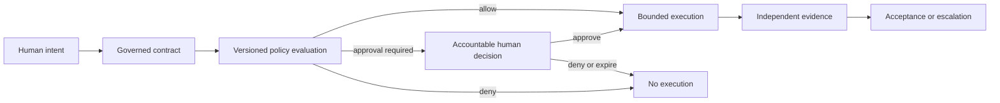
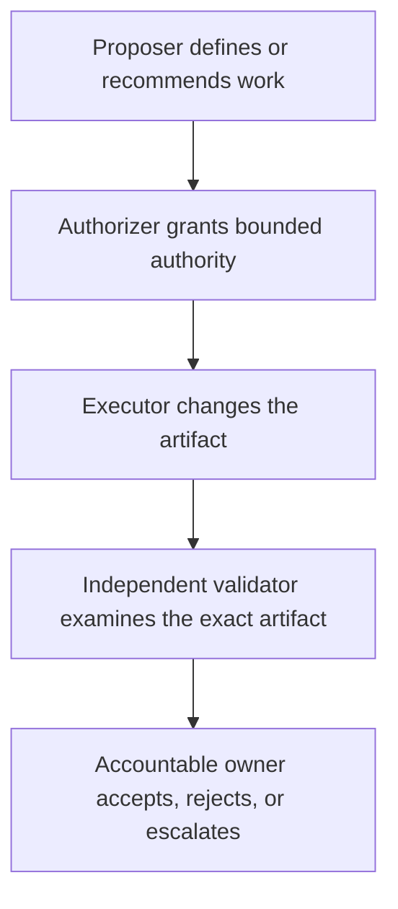
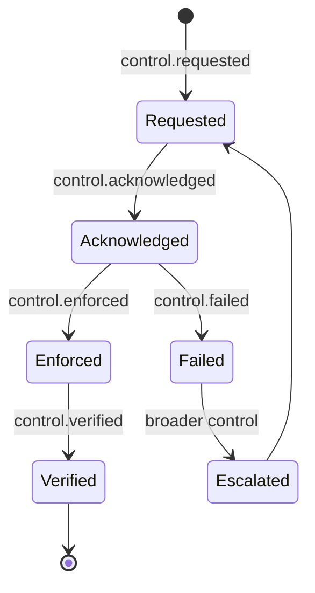
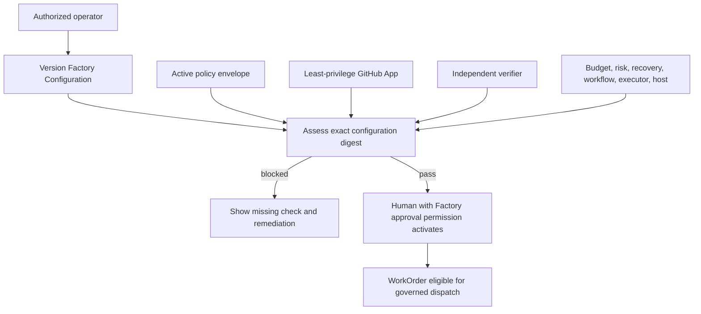

# 7. Governance, policy, and risk-proportional approval

An agent can have the technical ability to push a commit, call an API, or trigger a deployment without having the organizational right to do so. That gap is where governance lives. This chapter explains how a factory turns human intent into bounded machine authority: how policy decides what may run, how approval depth follows risk instead of habit, who owns which decision, how disagreement and exceptions are handled, and how authority is pulled back when a running workflow becomes unsafe. After reading it you should be able to draw the path from a Mission to an externally executed deployment and show that no step on it can silently become authorization.

## The problem

Conventional delivery hides authority in a dozen places: repository settings, CI configuration, cloud roles, informal reviewer norms, and the judgment of whoever is holding the keyboard. That worked, more or less, when a human was at every step. An AI Software Factory makes the ambiguity dangerous. Agents move faster, keep going unattended, and combine tools in ways no single permission grant anticipated. A credential that permits a push says nothing about whether *this* WorkOrder may push *this* change *now*.

So before any material action, the factory must be able to answer five questions durably:

1. Who owns the decision?
2. What action is being authorized?
3. Which policy governs it?
4. What evidence makes it eligible?
5. What happens when policy, evidence, or validators disagree?

Without durable answers, approval collapses into one of two failures. Too many gates and people learn to click through — approval becomes theater. Too few and risk ownership quietly transfers to software, which cannot be held accountable. Governance is the architecture that avoids both. It is not an approval screen.

## How it works

### Permission is not authority

Identity systems answer whether a principal *can* invoke a capability. Governance answers whether it *should*, for this governed purpose. A GitHub App may hold repository write permission; a policy may still forbid a WorkOrder from touching authentication code, exceeding a cost budget, editing files outside its path scope, or opening a pull request without independent validation. Permission enables; policy bounds.

Because the words get blurred in practice, the factory keeps seven authority concepts separate:

- **Capability** — what a system or agent is technically able to do.
- **Permission** — what an identity is allowed to invoke at a resource boundary.
- **Policy** — the contextual rule that says an action is allowed, denied, or needs a decision.
- **Authorization** — the resolved grant to perform one bounded action under a specific contract and policy version.
- **Approval** — an accountable decision that satisfies a named gate. It is not general permission for future work.
- **Acceptance** — the judgment that an outcome satisfies its contract. It comes after evidence exists and is distinct from approval to begin.
- **Exception** — a time-bound, scoped departure from policy accepted by the right risk owner. It is not a policy edit and sets no precedent.

Confusing these creates hidden authority. Approving a Plan does not accept a WorkOrder's result. Holding repository write permission does not authorize using it outside the WorkOrder. Think of a hospital: a surgeon has the skill (capability) and the credentials (permission) to operate, but this operation on this patient today still needs a consent form (approval) under hospital protocol (policy), and the discharge decision (acceptance) is a separate judgment made after the outcome is known.

### The governing chain

Humans define intent, acceptable risk, and the rules under which agents may act. Agents propose, gather evidence, execute authorized work, and recommend outcomes. They never become the owner of business, legal, security, or operational risk. The chain looks like this:

<!-- infographic: policy-decision-flow -->
> **Infographic — Policy decision flow.** *(Jay's graphic goes here.)* Until then, the diagram below carries the same concept.



**Policy** is executable organizational intent. **Approval** is a durable decision that policy requires. Neither replaces the other. Policy evaluation must be deterministic over versioned inputs, because policies change while work is in flight; if the evaluated version is not preserved, nobody can later explain why execution was allowed. That means versioned policy, frozen inputs, durable decision records, and explicit rules for re-evaluation when relevant facts change. The practical form is **policy as code**: versioned, testable policy expressed in machine-executable form. It improves consistency, but it does not replace ownership, rationale, exceptions, evidence, or human risk accountability; a rule that evaluates deterministically still needs someone who can say why it exists and who answers when it is wrong.

Policy is layered. Organization, workspace, repository, Factory version, Mission, and WorkOrder rules resolve with explicit precedence, and a more specific rule may narrow but never silently weaken a higher-level prohibition. Central policy gives consistency and auditability; local enforcement gives latency and fail-safe operation. The workable pattern is versioned policy bundles with one central decision authority, explicit cache expiry, local deny-by-default for critical actions, and reconciliation afterwards.

### The authorization envelope

Every material action should trace to an **authorization envelope** that freezes what was decided. Its contents are listed under "How to build it". The rule that matters here is what happens when the envelope cannot be computed: the safe answer is not "best effort." Material execution stops with a specific remediation. Fail closed protects authority boundaries at the cost of halting delivery when policy infrastructure is unavailable; fail open keeps throughput and turns a governance outage into unauthorized execution. For irreversible, external, security-sensitive, or customer-impacting actions, fail closed. Low-risk advisory behavior may degrade if policy explicitly names that mode — but never by inheriting permission from an implementation fallback.

### Risk determines control depth

The same operation carries wildly different consequences depending on context. A one-line change to internal documentation and a change to an authorization rule both produce a pull request; they do not deserve the same controls. Risk depends on impact, reversibility, data sensitivity, customer exposure, blast radius, uncertainty, and how good detection and recovery are. "All agent changes require approval" is therefore not a governance model — it is a queue. A useful system spends human attention where judgment changes the outcome. This is the mission's principle that humans are involved based on risk, not habit.

A practical first model uses three bands:

| Risk band | Typical characteristics | Default governance |
| --- | --- | --- |
| Green | Bounded, reversible, low exposure, strong automated detection | Policy may allow implementation and PR preparation without an action-by-action human gate |
| Yellow | Business logic, shared APIs, authentication-adjacent work, migrations with safe rollback, meaningful customer impact | Human Plan approval, bounded execution, independent validation, human merge or release decision |
| Red | Destructive, financial, security-sensitive, privacy, regulatory, irreversible data, or broad architectural change | Restricted execution, additional domain review, explicit risk owner, stronger evidence, multi-party approval where appropriate |

The label should be policy-derived and explainable. A useful classifier considers `risk = impact × likelihood × exposure × irreversibility × uncertainty`. Detection strength and recovery quality reduce *residual* risk; they do not erase the hazard. Retain the factors, not only the colour.

### Risk-tiered review

Turning the bands into a review policy starts with the dimensions the classifier actually reads. For a proposed change they are blast radius, reversibility, security sensitivity, data sensitivity, dependency impact, architecture impact, production criticality, novelty, and verification strength. Against those the factory aggregates the evidence it already has: test results, static analysis, security findings, dependency risk, architectural impact, evaluation results, ownership context, and the history of failures in the same area. The classification is then a function of both, and the review path follows from the classification:

<!-- infographic: risk-tier-review -->
> **Infographic — Risk-tiered review.** *(Jay's graphic goes here.)* Until then, the table below carries the same concept.

| Tier | Typical changes | Review path | Band |
| --- | --- | --- | --- |
| Low | Documentation, mechanical configuration, deterministic transformations, generated boilerplate with strong tests | Automated verification; potentially autonomous promotion; sampled after the fact | Green |
| Medium | Known dependency update, bounded feature inside an existing module, test additions with production-code contact | Lightweight human review with summarised evidence, not a line-by-line read | Yellow |
| High | Architecture change, authentication and authorization, sensitive data, large blast radius, novel territory, weak verification | Senior or principal review, stronger controls, additional domain owners | Red |

The principle the table encodes is that *review depth should be proportional to risk, not to the fact that AI generated the change*. Agents produce more pull requests and more quality signals than humans can read, and the answer cannot be "more analysis" or "review everything": human review cannot scale linearly with generated code, so the factory has to *scale trust, not human review*. The classifier is itself a learning system. When a reviewer overrides a tier, or a low-tier change later fails in production, that feedback improves both the classification and the evaluation that fed it; a tier that never moves is a tier nobody is checking. The signal-aggregation side, deciding which of a hundred findings a reviewer should actually see, is in [Chapter 8](./08-economics-metrics-and-human-attention.md); the merge-queue mechanics are in [Chapter 32](../06-improve/32-production-feedback-review-and-the-agentic-merge-queue.md).

Risk bands pair with **autonomy tiers**, which describe how much authority an agent holds at all. Tier assignment follows potential impact, not model confidence:

| Tier | Typical authority | Human decision | Prohibited escalation |
| --- | --- | --- | --- |
| 0 — Observe | Read approved low-sensitivity sources | Policy admission | Any mutation or external communication |
| 1 — Assist | Draft or recommend; no direct effect | Human accepts output | Publication, merge, deployment |
| 2 — Reversible action | Bounded reversible mutation in isolated scope | Review before consequential publication | Privilege grant or irreversible change |
| 3 — Consequential action | Publish, merge, or stage deployment with evidence | Named approval; dual control where required | Broader scope, self-approval, production data mutation |
| 4 — Restricted | Exceptional privileged or destructive action | Explicit exception and two-person control | Autonomous execution by default |

These tiers describe authority for a single grant. The Level 0–5 autonomy ladder in [Chapter 3](../01-understand/03-first-principles-trust-evidence-and-authority.md) describes the maturity of a whole workflow; a Level 3 workflow still issues Tier 2 grants for its individual actions. Every grant is short-lived, resource-scoped, purpose-bound, and no broader than both the system ceiling and the current workflow decision.

### The autonomy matrix

Put the bands, tiers, and decision owners together and you get a one-page **autonomy matrix** — the single most useful governance artifact to hang on the wall, because it lets an engineer, an auditor, and an executive read the same answer. A worked starting point:

<!-- infographic: autonomy-matrix -->
> **Infographic — Autonomy matrix.** *(Jay's graphic goes here.)* Until then, the table below carries the same concept.

| Change type | Risk band | Autonomy tier | Required approval | Required evidence |
| --- | --- | --- | --- | --- |
| Internal documentation or comment update | Green | 2 | None; policy allows autonomous PR; sampled review | Lint, link check, diff within path scope |
| Test addition or flaky-test repair | Green | 2 | Merge by policy after independent validation | Test run on exact commit; no production code touched |
| Dependency patch with passing compatibility tests | Green/Yellow | 2 | Human merge approval | Independent test run, SBOM diff, vulnerability delta |
| Application feature inside an existing module | Yellow | 3 | Plan approval, then human PR approval | Independent validation, acceptance-criteria evidence, rollback plan |
| Database migration with tested rollback | Yellow | 3 | Plan approval, PR approval, Engineering Lead acceptance | Migration dry run, rollback rehearsal, data-volume check |
| Authentication, authorization, or secrets change | Red | 3 | Architecture approval plus Security Owner plus Release Approver | Security validator, threat notes, independent review from a separate identity |
| Production infrastructure or release configuration | Red | 3 | Architecture approval plus Release Approver; dual control | Progressive-delivery plan, canary evidence, verified rollback |
| Change touching customer data or its classification | Red | 4 | Multi-party: Product Owner, Security Owner, Compliance Owner, Release Approver | Data-handling review, exception record if any rule is bypassed, immutable audit |

This is the mission's Human Decision Layer made concrete: low-risk documentation is autonomous, moderate application change needs PR approval, high-risk production or security change needs architecture and release approval, and anything critical involving customer data needs multi-party approval. Organizations will move rows and rename columns. What they must keep is that each row names an accountable owner and a minimum evidence set.

### Decision rights

Business owners accept the value proposition of a Mission. Engineering leads accept implementation boundaries. Security and compliance owners accept exceptions in their domains. Release approvers accept production risk. Collapsing those into one generic "approve" button loses their meaning. The following matrix is a defensible default; titles may change, accountable ownership may not:

| Decision | Accountable owner |
| --- | --- |
| Business Mission authorization | Product or Business Owner |
| Plan approval | Mission owner with required technical reviewers |
| WorkOrder execution authorization | Engineering Lead or policy-designated authority |
| WorkOrder acceptance | Engineering Lead |
| Architecture exception | Principal Engineer or Architecture Owner |
| Security exception | Security Owner |
| Compliance exception | Compliance Owner |
| Production deployment | Designated human Release Approver when material risk requires it |
| Risk exception | Named Risk Owner |
| Prompt, policy, evaluation, or autonomy promotion | Factory Governance Board or delegated human authority |

A small company may put one name in several rows. The decision *types* stay distinct even when the signatures match. And note the deployment row: the factory governs deployment but need not perform it. GitHub Actions, Jenkins, Argo CD, Spinnaker, or Azure DevOps may run the release. The factory owns the policy decision, the evidence contract, the approval state, and the lineage that ties the decision to the external execution.

### Separation of duties

Implementation agents and validators can share models, context, tools, and assumptions, so several confident outputs are not several independent opinions. Separation of duties breaks that correlation and prevents self-authorization. A robust flow distinguishes five responsibilities:



One person may hold several of these roles, but implementation and validation must remain *technically* distinct: validation runs under a separate identity and execution path, uses predefined criteria, generates its own evidence, and has no permission to modify the artifact it is judging. Where two-person control is impossible, narrow the allowed actions, strengthen independent technical validation, retain immutable evidence, and require later review. Combining people never justifies combining records or letting an executor certify itself.

### Disagreement escalates; it is never voted away

When validators conflict, majority voting can suppress the one signal that matters. A security failure is not outvoted by two passing formatting checks. Validator disagreement always *increases* governance. The factory opens a **Risk Review** holding the competing claims, their methods, artifact identities, severity, freshness, independence, likely causes, and safe options. The next action may be targeted revalidation, corrective work, a domain-owner decision, or rejection. An unexplained retry is not a resolution.

### Review evidence, not activity

Approval fatigue is what happens when reviewers keep receiving low-information requests. The fix is not fewer approvals; it is better decisions and better policy. Routine work inside policy proceeds without asking a human to re-affirm the same boundary. Surprises escalate: new risk, missing authority, conflicting evidence, exhausted recovery, or a policy breach. What reaches a human is a **decision packet**, not a notification. Its required contents are under "How to build it". Sampling routine Green work is a legitimate way to detect drift without fatigue — but only after policy has established bounded scope, complete evidence, and a safe rollback path, and never as a substitute for mandatory approval on material risk.

### Human-in-the-loop done right

"Human in the loop" is often implemented as approval after every action, which produces rubber-stamping within a week: the human learns that the answer is always yes and stops reading. Done right, it is **meaningful human control**: a human decides where the decision is consequential, with enough information, time, and authority for the decision to be real rather than ceremonial, and retains **human override and abort** at every point (the standing ability to countermand a decision the system made or to stop a run in flight, without needing anyone's permission to do so). Low-risk, deterministic, reversible work gets high autonomy; the evidence bar and the approval bar rise together with blast radius, uncertainty, and irreversibility. *Autonomy should scale with reversibility, not confidence.* A model's confidence is a property of the model; reversibility is a property of the action, and only the second one tells you what a mistake will cost.

When a human is brought in, what they receive determines whether the decision is real. A reviewer given only an approve button is being asked to lend their name, not their judgment. The decision packet below gives them the Plan, the diff, the risk class, the tests, the evaluation results, the policy decisions that fired, and the evidence, organised so that the surprise is at the top. One more rule keeps the loop honest: the human should never be compensating for missing automation. If reviewers are routinely checking that the diff stayed in scope or that tests ran on the current commit, those checks belong in a deterministic gate, and their presence in the packet is a defect in the platform, not diligence on the reviewer's part.

Where the packets land matters as much as what they contain. An **approval inbox** is the one queue where every pending decision packet waits, sorted by risk and expiry, so a decision owner sees what needs them in one place rather than across chat threads, pull-request tabs, and email. **Escalation UX** is the design of the moment a surprise reaches a person: the packet must state what happened, what the system already did, what it is asking for, and what happens if nobody answers before the deadline. The budget being spent here is **operator cognitive load**, the amount of attention a human must expend to make a sound decision; every packet that arrives without a clear question, or that repeats a check a gate should have made, spends that budget and buys nothing.

### Exceptions are governed objects

An exception names the rule being bypassed, its scope, owner, approver, reason, start, expiry, affected artifact, compensating controls, exit criteria, and review requirement. It is auditable and revocable, cannot silently renew, and returns the system to the normal rule automatically on expiry. Re-labelling data from "confidential" to "public," marking a failed test as passed, or widening an authorization envelope are not exception mechanisms. They are evidence or policy tampering.

Policy will sometimes block legitimate work, and a governance model with no answer for that moment trains people to route around it. The answer is an explicit **waiver**: time-boxed and auditable, with an owner, a reason, a scope, an expiration, and the evidence that justified it. The important design choice is what happens to waivers afterwards. Treat them as product data. The same waiver requested repeatedly is not a stream of special cases; it is a signal that the policy is wrong or that the platform is missing a capability people need, and the fix is a policy change or a feature, not a faster waiver process. And the path to a waiver must be the same for everyone: an exception that depends on knowing which manager to ask is not governance. *Governance cannot become a relationship business.*

### Trust sets a ceiling, never a grant

Autonomy is earned. A **Trust Score** may reduce the maximum autonomy a workflow can request, but it cannot override policy, create permission, or approve a decision. Policy is always the upper bound. Internally the score can be 0–100 for trend computation; operators should see stable bands with their drivers, because a number without reasons is not actionable governance:

| Band | Score | Governance meaning |
| --- | ---: | --- |
| Very Low | 0–39 | Quarantined or advisory-only |
| Low | 40–59 | Human review for every material action |
| Moderate | 60–79 | Eligible for limited supervised autonomy |
| High | 80–94 | Eligible for governed autonomy within policy |
| Trusted | 95–100 | Eligible for the highest authority current policy permits |

Promotion requires sustained evidence and an explicit human decision. A defensible Level 2 to Level 3 default is at least 100 successful WorkOrders, 30 days of stable operation, at least 99 percent independent-validation success, zero critical security or policy violations, zero unauthorized actions, and human approval. Demotion can be automatic: a security or policy violation, unauthorized action, evidence tampering, fabricated results, a high-risk validation failure, a customer-impacting regression, repeated boundary violations, or suspected tool compromise should immediately lower authority or quarantine execution pending review. Old failures may lose weight in a rolling scoring window; they never leave the audit history. Trust calibration is developed further in [Chapter 3](../01-understand/03-first-principles-trust-evidence-and-authority.md).

The same rule applies to the factory learning about itself. Outcomes, failures, and metrics may be collected automatically, but any change to prompts, policies, workflows, evaluation criteria, model routing, or authority changes system behavior and requires human review and promotion. Continuous observation is compatible with governed learning; unreviewed self-modification is not ([Chapter 33](../06-improve/33-governed-learning-and-compounding-engineering.md)).

### Autonomy per action class

The trust ceiling answers how much autonomy a workflow may request. It does not answer the more useful question, which is how much autonomy each *kind of action* should get, because the answer is asymmetric. Autonomy should follow reversibility and blast radius, and those vary far more between actions than between workflows. A bounded prompt refinement, a retrieval parameter, or a routing weight can reasonably auto-promote when it has repeatedly beaten the baseline, is low-risk, and can be reverted instantly. Anything touching permissions, security boundaries, tool authority, destructive operations, or deployment authority is a different risk class no matter how good the evidence looks, because a wrong change there is not instantly reversible and its blast radius is the whole factory.

| Action class | Examples | Autonomy | Why |
| --- | --- | --- | --- |
| Instantly reversible, bounded | Prompt wording, retrieval top-k, routing weight within an approved set, cache policy | May auto-promote after repeated baseline wins | Wrong is cheap and undone in one step |
| Reversible with cost | Skill version, agent definition, evaluator threshold, Factory Configuration version | Governed promotion with canary and rollback | Wrong is recoverable but affects every subsequent run |
| Hard to reverse | Schema migrations, public contracts, data classification changes | Named approval and rehearsed rollback | Undo requires new work and may lose data |
| Authority-changing | Permissions, security boundaries, tool grants, deployment authority, policy | Explicit exception, dual control, never autonomous | Wrong changes what every other control can trust |

So the design instruction is to define autonomy per action class rather than to set one autonomy level for the system, and to ask of every class the question that matters: *what happens if this is wrong, and how easily can we reverse it?* The question the system must not ask is "how confident is the model?" Confidence is not a control.

### Ten control families

Principles become auditable when they are expressed as controls with owners, enforcement points, evidence, and tests. Every control attaches to a transfer of authority — identities, records, grants, state transitions, tool calls, artifacts, evidence, approvals, releases, incidents, learning promotions — and records observable decision lineage, never hidden model reasoning. A policy document or a visible button is not proof that a control prevents, detects, contains, or recovers from anything.

| ID | Control family | Owner | Primary enforcement | Required evidence | Test and cadence |
| --- | --- | --- | --- | --- | --- |
| GOV-01 | Authority-chain mapping | Governance owner | Control plane and policy service | Actor, delegator, grant, scope, expiry, decision chain | Trace one high-risk action quarterly and after authority changes |
| GOV-02 | Unique identity | Identity owner | Identity provider, workload issuer, tool gateway | Human, service, workload, agent, and capability identities; credential events | Deny shared, expired, and wrong-scope credentials each release |
| GOV-03 | Risk and autonomy tiers | System owner | Admission and policy decision points | Classification, ceiling, allowed and prohibited actions, approval rule | Boundary cases and promotion regression each policy change |
| GOV-04 | Emergency control | Incident authority | Orchestrator, scheduler, gateway, credential broker | Pause, cancel, revoke, quarantine, rollback, recovery records | Failure injection at risk-based cadence |
| GOV-05 | Agentic attack resistance | Security owner | Ingestion, context compiler, model and tool gateway, sandbox | Sanitization, provenance, policy denials, alerts, containment | Indirect-instruction, tool, memory, context, and supply-chain attacks each release |
| GOV-06 | Human override and dual control | Decision owner | Approval service and protected operation | Named approvers, decision, reason, counterevidence, timing | Reject self-approval and missing second party quarterly |
| GOV-07 | Decision and delegation lineage | Audit owner | Event and evidence pipeline | Correlated inputs, versions, actions, outputs, decisions, delegations | Reconstruct sampled runs and every material incident |
| GOV-08 | External capability diligence | Capability owner | Intake and registry admission | Ownership, provenance, data use, security, service, exit, incident terms | Intake plus periodic recertification and material supplier change |
| GOV-09 | Incident reporting | Incident owner | Detection and case management | Classification, timeline, scope, notification decisions, postmortem | Tabletop twice yearly and after significant change |
| GOV-10 | Periodic recertification | Governance owner | Registry and system inventory | Current model, evaluator, policy, capability, autonomy, owner, evidence | Risk-based cycle and event-triggered review |

The threat side of this catalog — GOV-05 in particular — is covered in [Chapter 26](../04-prove/26-security.md). The short version: external text, repository content, tool results, memory, and retrieved context are untrusted inputs. Preserve provenance, separate data from instructions, validate tool schemas and destination scopes, broker credentials only after policy, isolate execution, inspect outputs and side effects, and convert only independent results into evidence. Compromising one agent or capability must never grant policy administration, evidence acceptance, or wider credentials.

Incidents record the authority and data affected, containment, preservation, the notification decision, recovery, and lessons. Recertification (GOV-10) rechecks ownership, classification, model and evaluator versions, capability dependencies, policy, evidence freshness, incidents, drift, cost, and actual outcomes. Control telemetry — decisions, denials, grants, exceptions, overrides, tests, incidents, revocations, review freshness — should retain enough lineage to reproduce an authorization without storing unnecessary secrets, personal data, or hidden reasoning. An **audit export** is the packaged, tamper-evident extract of that lineage for a defined scope and period, produced in a format an auditor or regulator can read without access to the factory's internal stores; redaction is deterministic and reviewable, with original sensitive evidence in a restricted store. None of this requires microservices: a modular monolith can implement the whole catalog if enforcement interfaces, identities, and evidence stay explicit.

### Authority is a revocable chain

Autonomy is safe only while current authority, policy, dependencies, and evidence remain valid. A running workflow can become unsafe after credential theft, compromised context, an evaluator failure, cost runaway, a production incident, a policy change, or an operator cancellation. So authority is designed as a chain that can be cut at any link, not a role label:


The chain also settles where the model sits. *The model proposes; policy authorizes.* The moment a model is given a tool, its intelligence becomes authority unless something outside it decides whether each call is allowed, so every link after the policy decision is enforced by deterministic code the model cannot reach. Probabilistic reasoning must never imply probabilistic authorization: a model may reason about authority, recommend an action, and explain its confidence, but it cannot grant itself the permission to act, and nothing it reads, including a document that instructs it to, can widen the grant it holds.

Each link records delegator, recipient, subject, purpose, scope, constraints, policy version, issue and expiry times, and a revocation handle. The narrowest applicable ceiling wins. An agent cannot delegate authority it does not hold, change policy, approve its own high-risk result, or convert telemetry into acceptance evidence. Human login establishes the decision actor; a policy decision creates a purpose-bound grant; a workload identity system delivers short-lived credentials to the exact runtime; tool gateways verify identity, grant, resource, tenant, action, and policy version. Credential exchange never turns a broad service credential into wider agent authority, and revocation propagates to issuers, caches, gateways, active leases, and queued work. The SPIFFE Workload API is one published pattern for delivering workload identity; it does not define the factory's business authorization model.

### Emergency control

A generic kill switch is not enough, because it cannot say which state, effects, grants, or recovery obligations remain. Air-traffic control does not have one red button; it has "hold," "go around," "divert," and "close the runway," each with a different meaning for the aircraft already in the air. The factory needs the same precision:

<!-- infographic: emergency-control -->
> **Infographic — Emergency control.** *(Jay's graphic goes here.)* Until then, the table and diagram below carry the same concept.

| Action | Meaning | State effect | Authority effect | Recovery requirement |
| --- | --- | --- | --- | --- |
| Pause | Stop scheduling new steps; preserve resumable state | Running → paused at a safe checkpoint | Grants remain but cannot be used | Revalidate context, policy, grants, leases, dependencies before resume |
| Cancel | End the requested workflow | Terminal cancelled after compensation decision | Revoke attempt-scoped grants | Reconcile partial side effects; retry is new work |
| Revoke | Invalidate a credential, capability, version, or grant | Affected calls fail closed | Explicit authority removal | New qualified grant only after review |
| Quarantine | Isolate a subject from selection and propagation | Quarantined lifecycle state | Deny new use; constrain investigation access | Root-cause, remediate, re-evaluate, approve restricted return |
| Rollback | Restore a known earlier release or configuration | New controlled transition | Requires release authority | Verify restored artifact, data compatibility, outcomes |
| Failover | Route to an approved alternate dependency or region | Continue under alternate version or scope | Uses a preauthorized contingency grant | Verify equivalence, capacity, later reconciliation |
| Shutdown | Stop a service or control domain | Unavailable until deliberate restart | Revoke or disable broad runtime authority | Rebuild trust, restore state, controlled restart |

Emergency containment must not depend on the component being contained, nor on an ordinary approval path that may itself be unavailable. Commands fan out through independent control paths — scheduler, orchestrator, tool gateway, credential broker, deployment system — and the three stages are kept distinct: **acknowledgement** is not **enforcement**, and enforcement is not **verified safety**. Verification checks scheduling, running work, credentials, queues, network access, side effects, artifacts, and downstream systems.



Every high-impact action has a named override point and an accountable owner. Dual control applies wherever one compromised or mistaken identity could create an irreversible or privileged effect. Containment may use a single delegated incident authority when delay is more dangerous than error, but restoring broad authority afterwards needs the defined approval and independent verification. Emergency paths need reserved capacity, independent credentials, durable state, and regular exercise — and cost controls must never prevent containment. Emergency contracts are versioned across clients and enforcement points; incompatible semantics need staged rollout, compatibility tests, and a rollback path. The operational side — incident framework, control tower, recovery — continues in [Chapter 29](../05-operate/29-resilience-incidents-and-the-control-tower.md).

## How to build it

**Governance layer controls.** The mission's Governance Layer enumerates what the layer must control: identity, role-based permissions, tool authorization, repository access, environment access, data classification, approval policies, spending limits, execution limits, escalation rules, and audit trails. Each of the contracts below implements one or more of these.

**Authorization envelope** (frozen per material action):

- Mission, approved Plan version, WorkOrder, and responsible owner
- actor and execution identity
- repository, environment, resource, and path scope
- permitted tools and operations
- risk classification and applicable policy version
- required approvals and their validity periods
- budget, runtime, retry, and concurrency limits
- validation and evidence requirements
- recovery, cancellation, and escalation rules
- the exact facts used in the policy decision

**Policy decision record** (retained per evaluation): policy version, normalized inputs, matched rules, precedence trace, result (`ALLOW`, `DENY`, `NEEDS_APPROVAL`), reason, required approver roles, expiry, and invalidation events.

**Decision packet** (what a human sees instead of an approval queue):

- the decision required and its accountable owner
- the business intent and approved scope
- why policy raised the gate
- the exact artifact, commit, environment, and proposed action
- criterion-level evidence, failures, conflicts, staleness, and waivers
- material deviations and surprises
- residual risk and rollback strategy
- a recommendation and its uncertainty
- what resumes automatically after the decision

**Control record** (one per control family, versioned):

```yaml
control:
  id: GOV-04
  version: 3
  subject_scope: [factory-system:payments-delivery]
  owner: role:incident-control-owner
  intent: "Bound unsafe or uncontrolled execution"
  enforcement_points: [orchestrator, tool-gateway, credential-broker]
  preventive_actions: [admission-deny, scoped-grant]
  detective_signals: [policy-denial, runaway-loop, anomalous-side-effect]
  response_actions: [pause, cancel, revoke, quarantine]
  evidence_schema: control-evidence@2
  test_suite: emergency-control-suite@4
  exception_policy: policy:material-exception@2
  review_cadence: P90D
  last_result: pass-with-finding
```

Control evidence binds the exact control version, subject, environment, identity, injection, expected result, actual result, timestamps, artifacts, reviewer, and unresolved findings. It expires when a material dependency or enforcement point changes.

**Emergency command contract:** command ID, subject selector, requested action, actor identity, delegated role, reason, severity, expected version, idempotency key, issued time, deadline, and notification policy. The control plane records acceptance or rejection before dispatch; components emit `control.requested`, `control.acknowledged`, `control.enforced`, `control.failed`, and `control.verified` with one correlation key. Set objectives by risk for command acceptance, acknowledgement, enforcement, and verification deadlines; track control latency, failed fan-out, stale grants, orphaned work, unverified states, recovery time, and repeated false activation. Test the no-op, partial, late, duplicate, unauthorized, and dependency-failure cases.

**Control sequence** when something goes wrong:

1. Detect or receive a credible report.
2. Resolve subject and blast radius from inventory and live state.
3. Authorize the narrowest sufficient emergency action.
4. Record the command durably before dispatch where possible.
5. Fan out through independent control paths to scheduler, orchestrator, tool gateway, credential broker, and deployment system.
6. Preserve attempts, events, artifacts, and relevant volatile state.
7. Reconcile acknowledgement with observed enforcement.
8. Escalate on timeout; use a broader control only when justified.
9. Diagnose and choose compensate, rollback, failover, retire, or repair.
10. Independently verify recovery before restoring authority.

**Design-review checklist:**

- Does every executor and tool call use the same policy decision path?
- Can an agent identity satisfy any material human approval? (It must not.)
- What is the precedence rule when tenant, workspace, Factory, and WorkOrder policies disagree?
- Which changes invalidate an existing approval?
- Can late or duplicate events reopen authority after expiry or cancellation?
- Is the policy decision trace understandable without reading source code?

## Failure modes

| Failure | Detection | Containment | Recovery |
| --- | --- | --- | --- |
| No applicable policy is treated as permission | Evaluator returns `ALLOW` on an empty match | Fail closed for material actions; name the missing rule | Add explicit policy; degraded advisory mode only by explicit policy |
| Shared identity obscures the actor | Identity and audit reconciliation | Revoke credential; pause affected work | Issue unique identity; replay the authorization test |
| Control exists only in the UI | API-side negative test succeeds unexpectedly | Block the action at the gateway | Add server-side enforcement; retest every channel |
| Correlated builder and evaluator | Runtime and configuration comparison | Mark evidence ineligible | Run an independent evaluator context |
| Validators disagree and the system retries | Conflicting evidence on the same artifact | Open a Risk Review; block completion | Domain-owner decision or targeted revalidation |
| Expired approval reused | Approval validity checked at action time, not at request | Deny; re-evaluate policy on current facts | Fresh decision packet |
| Supplier capability changes silently | Digest or behavior drift | Quarantine capability | Re-intake, evaluate, recertify the exact version |
| Recertification expires | Inventory due-date alert | Reduce autonomy or block new high-risk work | Complete review; record the decision |
| Orchestrator unavailable during an incident | Control commands time out | Independent scheduler and gateway path denies new effects | Gateway denials and queue freeze as evidence |
| Worker ignores pause | Lease still active after `control.enforced` deadline | Lease expires; gateway denies tool calls; worker isolated | Lease, identity, and network events |
| Duplicate cancel command | Same idempotency key seen twice | Idempotent terminal result; no duplicate compensation | Deduplication record |
| Revocation cache stale | Critical call succeeds after revoke | Critical tools fail closed after bounded cache TTL | Cache version and denial test |
| Partial external side effect | Provider call timed out mid-write | Record uncertainty; stop retrying; reconcile with provider | Provider idempotency key and reconciliation result |
| Control operator unavailable | Escalation unanswered by deadline | Delegated backup assumes authority under policy | On-call transfer and signed decision |
| Recovery resumes into changed context | Context or version differs from the paused manifest | Resume denied; new manifest or explicit replan | Context and version comparison |
| Approval fatigue | Rising click-through speed, falling rejection rate | Move routine Green work to policy; sample instead | Raise packet quality; tighten policy |
| Review depth set by origin, not risk | Every AI-generated change gets full review; human review time scales with PR count | Classify by blast radius, reversibility, sensitivity, novelty, verification strength | Risk-tiered review; reviewer overrides feed the classifier |
| Confidence used as autonomy signal | Grants widen because the model reported high confidence | Deny; autonomy follows reversibility per action class | Define autonomy per action class |
| Repeated waiver | Same exception requested by many teams | Grant time-boxed waivers with owner, reason, scope, expiry, evidence | Fix the policy or add the missing capability |
| Exception by relationship | Waivers depend on knowing which manager to ask | One documented exception path for everyone | Audit exception provenance; remove informal routes |
| Human compensating for missing automation | Reviewers check scope, currentness, or budgets by hand | Move the check into a deterministic gate | Remove the manual step from the packet |

## In Mission Control

Assessed at commit [`8014d5af`](https://github.com/jaydubya818/MissionControl/tree/8014d5af427b43ff5c5a63cfdf82ec92742c208c) (2026-08-08); browser observations came from a dirty worktree at that HEAD and are run evidence, not reproducible proof of the commit alone.

**Implemented.** Workspace permissions protect Factory viewing, automation management, and activation. Roles and scoped role assignments give tenant, project, and environment structure. Policy envelopes can be version-, project-, or tenant-scoped, prioritized, activated, and evaluated for a tool at Green, Yellow, or Red risk, returning `ALLOW`, `DENY`, or `NEEDS_APPROVAL`. Approval records preserve action type, risk, rollback, justification, escalation, status, and decision metadata; the active approval path auto-approves Green actions, expires pending requests, and requires two distinct approvers for Red. A Factory Configuration version freezes repository, workflow, executor, policy envelope, environment, budget, verifier set, risk boundary, recovery controls, and a configuration digest. Readiness requires an active Governance Policy, bounded budget, independent verifier, clean host binding, recovery controls, active workflow, approved executor, repository readiness, and a current least-privilege GitHub App connection; activation requires a passing assessment for the exact digest and an actor with Factory approval permission.



**Partial.** The general policy-envelope evaluator returns an `ALLOW` fallback when no envelope produces a decision — weaker than fail-closed doctrine, even though readiness independently blocks activation without an active policy. Approval data lives in both the operational approvals path and a newer approval-record model, partially mirrored rather than one consolidated lifecycle, and the code does not prove every material decision is restricted to a human identity. The decision-rights matrix is not yet one canonical enforced model. Validator disagreement has no verified first-class Risk Review.

**Future.** Operational Autonomy Levels, the numeric Trust Score and bands, automatic demotion and quarantine, sustained-evidence promotion, the Factory Governance Board, a single explainable policy decision service, and decision-packet-centred operator experience remain doctrine.

**Why the golden-path run stopped.** Golden Path 01 proved Mission creation, versioned Plan approval, WorkOrder release, and the separate Validator WorkOrder, then stopped before Task or Attempt creation because no Governance Policy existed to bind into a Factory Configuration. That was the correct outcome: without an active policy version the control plane cannot say which actions the executor may take. Two independent blockers remained — the GitHub App was not installed for the lab repository, and todo 024 (durable worker, leased Attempt, isolated worktree, bounded path scope, idempotent PR creation, lineage, restart reconciliation) was incomplete. The sequence to rerun is: finish todo 024; install the least-privilege GitHub App; create an active Governance Policy; create, assess, and activate the exact Factory Configuration; rerun the unchanged acceptance contract from a clean pinned commit. See [Appendix C](../appendix/mission-control/01-implementation-maturity-and-evidence-map.md) and the [golden-path evidence](../appendix/mission-control/evidence/2026-08-08-golden-path/README.md).

## Retain this

- Permission enables; policy bounds; approval decides one gate; acceptance judges an outcome; an exception is scoped and expiring. Keep the seven words apart.
- Every material action traces to a frozen authorization envelope. If the envelope cannot be computed, stop — material actions fail closed.
- Approval depth follows risk (Green, Yellow, Red) and impact-based tiers (0–4), never habit. "Approve everything" is a queue, not governance.
- Each decision type has a named accountable human; the factory governs deployment even when Jenkins or Argo performs it.
- Executor and validator are technically distinct. Validator disagreement opens a Risk Review; it is never outvoted or retried away.
- Trust is a ceiling on eligibility; policy is the upper bound. Promotion needs sustained evidence and a human; demotion can be automatic.
- Controls are records with owners, enforcement points, evidence, and tests — ten families, each exercised on a cadence.
- Pause, cancel, revoke, quarantine, rollback, failover, and shutdown mean different things. Acknowledged is not enforced; enforced is not verified.
- Classify by blast radius, reversibility, security and data sensitivity, dependency and architecture impact, production criticality, novelty, and verification strength; Low is automated, Medium is lightweight review with summarised evidence, High is senior review. Review depth follows risk, not the fact that AI wrote it. Scale trust, not human review.
- Human-in-the-loop is risk-based authority with a decision packet (Plan, diff, risk class, tests, evaluations, policy decisions, evidence), never approval after every action. Autonomy scales with reversibility, not confidence. Humans never compensate for missing automation.
- Define autonomy per action class: instantly reversible changes may auto-promote on baseline wins; anything touching permissions, security boundaries, tool authority, destructive operations, or deployment authority never does. Ask "what if this is wrong, and how easily can we reverse it?"
- Waivers carry owner, reason, scope, expiration, and evidence; a repeated waiver is bad policy or a missing capability; governance cannot become a relationship business.
- The model proposes; policy authorizes. Probabilistic reasoning never implies probabilistic authorization, and nothing a model reads can widen its grant.

## Go deeper

- [Chapter 3 — First principles: trust, evidence, and authority](../01-understand/03-first-principles-trust-evidence-and-authority.md), [Chapter 4 — The human–agent operating model](../02-design/04-the-human-agent-operating-model.md), [Chapter 5 — Authoritative records](../02-design/05-authoritative-records.md)
- [Chapter 12 — Durable execution](../03-build/12-durable-execution.md) for leases and attempt manifests; [Chapter 26 — Security](../04-prove/26-security.md); [Chapter 29 — Resilience, incidents, and the control tower](../05-operate/29-resilience-incidents-and-the-control-tower.md); [Chapter 30 — Control surfaces, event contracts, and storage](../05-operate/30-control-surfaces-event-contracts-and-storage.md); [Chapter 33 — Governed learning](../06-improve/33-governed-learning-and-compounding-engineering.md)
- Sources: Jay West, *AI Software Factory Mission* (Governance Layer, Human Decision Layer, Human Accountability Model); *AI Software Factory Study Guide* (weeks 5–6 autonomy matrix); Jay West, factory architecture notes (risk-classification dimensions, risk-tiered review, human-in-the-loop done right, autonomy per action class, waivers as product data, the model proposes and policy authorizes); Mission Control North Star and V1 Product Strategy docs at `8014d5af`
- Mission Control code at `8014d5af`: `convex/factory/configuration.ts`, `convex/governance/policyEnvelopes.ts`, `convex/lib/armPolicy.ts`, `convex/governance/approvalRecords.ts`, `convex/approvals.ts`, `convex/governance/permissions.ts`, `convex/governance/roles.ts`, `convex/governance/roleAssignments.ts`, `convex/lib/githubAppReadiness.ts`, `convex/githubAppConnections.ts`, `apps/mission-control-ui/src/ApprovalsModal.tsx`
- Standards: [NIST AI RMF 1.0](https://doi.org/10.6028/NIST.AI.100-1); [NIST Generative AI Profile](https://doi.org/10.6028/NIST.AI.600-1); [NIST SSDF](https://csrc.nist.gov/projects/ssdf/); [OWASP Agentic AI Threats and Mitigations](https://genai.owasp.org/resource/agentic-ai-threats-and-mitigations/); [SLSA 1.2](https://slsa.dev/spec/v1.2/); [SPIFFE Workload API](https://spiffe.io/docs/latest/spiffe-specs/spiffe_workload_api/)
- [Glossary](../appendix/glossary.md)
