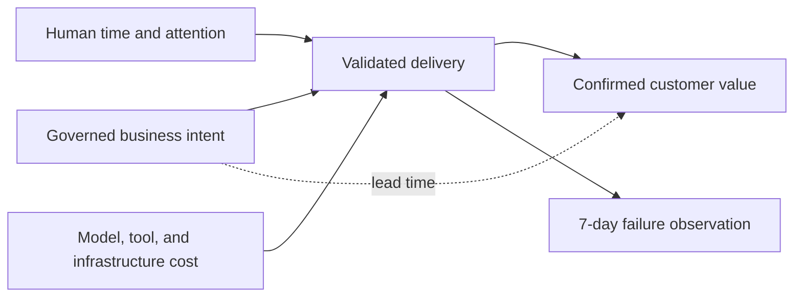
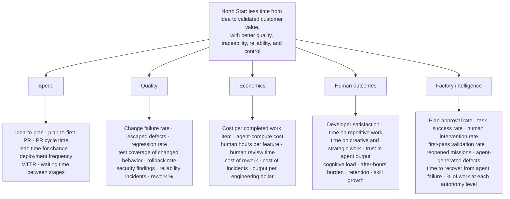
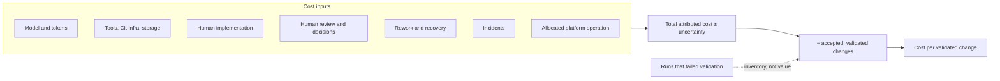
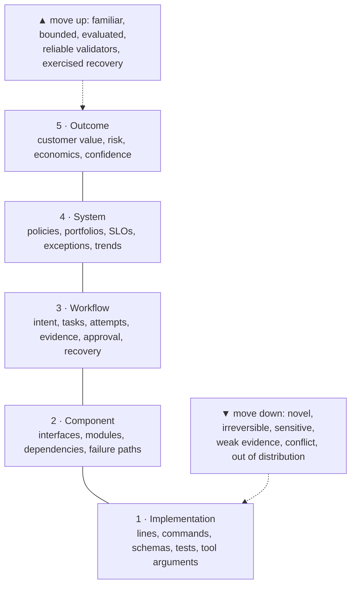

# 8. Economics, metrics, and human attention

A factory that produces more pull requests, more tokens, and more generated lines has proved nothing. This chapter is about the measurement system that decides whether the factory is working: what the clock measures, what a change failure is, how to price a validated change, and how to account for the resource the factory consumes fastest — qualified human attention. It also gives you a framework for the question every engineer now faces daily: at what altitude should I be working with my agents right now? By the end you should be able to build a metric tree from customer outcome to runtime diagnostics, write an attention budget for a workflow, and defend the factory's economics to a CFO without mentioning lines of code.

## The problem

Agent activity is easy to measure and easy to mistake for value. Tokens, sessions, tool calls, and PR volume can all rise while customer outcomes slow, defects climb, and engineers spend more of their week recovering or reviewing low-quality work. The lifecycle is fragmented by local optimization: coding tools report generation speed, CI reports test duration, finance sees model spend, product sees feature delivery, the incident system sees failure. Without shared lineage nobody can compute the economics of one governed Mission.

Automation also *shifts* work rather than removing it. Faster implementation creates slower review. More parallelism creates merge conflicts. Cheaper models increase validation and recovery cost. And the resource that actually limits throughput is not model intelligence. As Luke of Goose and Factory put it, the best engineer with a backlog of fifty features can drive only a few forward per day, because every task needs their attention and every commit needs their review. Today's models can attempt all fifty; there is not enough human bandwidth to supervise them. An autonomy system that consumes more senior attention than it returns has negative leverage — and an honest measurement system has to be able to say so.

## How it works

### Measure validated customer value, not activity

The primary clock starts when business intent becomes a governed Mission and stops when the change is deployed, independently validated in production or a production-equivalent environment, and the expected customer outcome is confirmed. Merge time is an intermediate reading, not the outcome. Three executive measures sit at the top:

1. **Lead Time to Validated Customer Value** — elapsed time from governed intent to confirmed outcome.
2. **Change Failure Rate** — the share of deployments that cause rollback, hotfix, emergency intervention, customer regression, a reliability or security incident, or an SLA/SLO violation within a default seven-day observation window.
3. **Engineering Leverage** — valuable outcomes per unit of scarce engineering capacity, without increasing cognitive load or coordination cost.

They form a constraint system. Speed without quality is rework. Quality without speed is delay. Throughput without human sustainability is hidden debt. Think of a factory floor: units per hour means nothing until you subtract scrap, returns, and overtime.

### The five dimensions

Below the three executive measures, the mission defines five dimensions in which the factory must demonstrate improvement. Every one of these metrics is a legitimate line on a dashboard; the discipline is knowing which are outcomes and which are diagnostics.

<!-- infographic: five-metric-dimensions -->
> **Infographic — Five metric dimensions.** *(Jay's graphic goes here.)* Until then, the diagram below carries the same concept.

**Speed** covers idea-to-plan time, plan-to-first-PR time, PR cycle time, lead time for change, deployment frequency, mean time to resolution, and waiting time between lifecycle stages. **Quality** covers change failure rate, escaped-defect rate, regression rate, test coverage of changed behavior, production rollback rate, security findings, reliability incidents, and rework percentage. **Economics** covers cost per completed work item, agent-compute cost, human hours per feature, human review time, cost of rework, cost of incidents, and output per engineering dollar. **Human outcomes** covers developer satisfaction, time spent on repetitive work, time spent on creative and strategic work, trust in agent output, cognitive load, after-hours burden, employee retention, and skill growth. **Factory intelligence** covers plan-approval rate, agent task-success rate, human intervention rate, first-pass validation rate, reopened-mission rate, agent-generated defect rate, time to recover from agent failure, and the percentage of work completed at each autonomy level. The study guide adds retry rate, review burden, agent cost per mission, cost per validated change, and infrastructure and model cost to the same families.

For a factory offered as an internal platform, adoption has its own metrics: time to first successful workflow, task success, PR acceptance rate, human correction rate, model-routing quality, token cost per accepted outcome, reliability, repeat usage, time to onboard a new team, number of bespoke capabilities retired, builder satisfaction, and adoption across product organizations. Those are developed with the platform operating model in [Chapter 27](../05-operate/27-the-factory-as-a-platform.md) and [Chapter 31](../05-operate/31-enterprise-adoption-and-the-infrastructure-landscape.md).

### The metric hierarchy

Metrics stack in four tiers, and confusing the tiers is the commonest measurement error. **Business outcomes** — adoption, revenue, retention, risk reduction, a customer problem solved. **Delivery outcomes** — lead time, deployment frequency, change failure, recovery time, accepted WorkOrders, outcome confirmation. **Factory effectiveness** — autonomous completion, first-pass validation, recovery success, evidence completeness, approval latency, review time, cost per accepted outcome. **Operational diagnostics** — tokens, tool calls, model latency, queue depth, lease expiry, retries, provider errors, context size. Diagnostics explain outcomes; they are not outcomes.

Engineering leverage in particular cannot be proved by a single number. Use a balanced evidence set: reduced lead time with stable or improved change failure rate; more accepted, validated work; fewer human implementation hours per item; less waiting and coordination time; more time on architecture, product, and customer problems; stable or lower review and recovery burden; and better developer satisfaction and perceived control. The objective is more customer value per engineer, not more commits per engineer.

### Measure flow and attention together

Break lead time into its stages — queue, planning, approval, execution, validation, review, deployment, outcome observation — so you can see whether the factory accelerated work or just moved the bottleneck from implementation to review. Luke's production data on a multi-day mission is instructive: most wall-clock time was spent not generating tokens but waiting for real-world validation to run, and validation almost never succeeded on the first pass. That is where the clock goes; that is what to optimize.

Alongside flow, track attention: number of interventions, decision latency, time per approval, evidence inspection time, false alarms, and repeated requests. Use cohorts and baselines: compare similar repositories, risk bands, change types, and autonomy levels; establish a stable pre-factory baseline; report medians and percentiles, not just averages; and refuse causal claims when organization, tooling, and product changed at the same time without an experimental design.

### Attribute the full cost

Cost per accepted WorkOrder includes model and token spend, tools, infrastructure, CI, storage, human implementation, review, recovery, rework, incidents, and allocated platform operation — with uncertainty stated explicitly. Then compare marginal cost with marginal value. A more expensive model can be cheaper overall if it cuts retries and review. A cheap run that fails validation is inventory, not value.

<!-- infographic: cost-per-validated-change -->
> **Infographic — Cost per validated change.** *(Jay's graphic goes here.)* Until then, the diagram below carries the same concept.

Three cautions. Comprehensive measurement can become surveillance: measure workflows and systems, not individuals, and never use lines of code, commits, hours online, or prompt volume as performance targets. Business outcomes take weeks to observe while teams need fast feedback: use leading indicators, label them as proxies, and never quietly substitute "PR merged" for customer value. Cost attribution will be imperfect: a transparent range beats a precise but incomplete number, and the measurement system itself has a cost that should stay proportional to the decisions it supports.

### Proof, and how to say it

The mission names five proofs the factory must produce. **Proof 1, speed:** a workflow that took five days reaches a validated pull request in one. **Proof 2, quality:** faster execution does not increase escaped defects, and ideally reduces them. **Proof 3, human leverage:** developers spend less time on repetitive execution and more on high-value decisions. **Proof 4, governance:** a complete chain of intent, planning, actions, approvals, evidence, and production outcomes. **Proof 5, financial value:** lower cost per validated change, or more throughput without proportional headcount. Together they are the business case, the executive narrative, and the sales foundation.

The framing matters as much as the number. Do not say "we generated 50 percent more code." Say "we reduced plan-to-validated-PR time by 60 percent, lowered human implementation effort by 40 percent, held or improved change failure rate, and preserved full traceability." The first is activity; the second is an executive outcome, and every clause in it maps to a dimension above.

### Human attention is the scarce resource

The scarce input is not tokens. It is **qualified human attention**: understanding intent, resolving ambiguity, weighing tradeoffs, reviewing consequential changes, and accepting risk. The factory should reduce repetitive attention without hiding the decisions that still need people. Three control modes describe how often a person is needed, not whether they are accountable:

- **Human-in-the-loop** — a person performs a required decision or correction inside the workflow.
- **Human-on-the-loop** — the workflow runs within policy while a person supervises outcomes and handles exceptions.
- **Human-out-of-the-loop** — no human decision is required for that bounded instance; prior human policy and accountability still apply.

A workflow can be out-of-the-loop for execution and still require human policy ownership, promotion, incident response, and risk review. Luke's model is the same shape: a human decides *what* to build and approves the plan; orchestrator, workers, and validators figure out *how*, with a validation contract written before any code and structured handoffs so context survives days of execution; the human returns as a project manager reading handoff summaries and a budget-burn view rather than a chat log. His economics: five engineers who could hold ten work streams now hold thirty, and the codebase ends cleaner because tests and skills accumulate.

An **Attention Budget** states the expected human effort for a workflow and which decisions justify interruption. Its metrics are time to first required human decision; decision and approval latency; correction and override rate; review minutes per accepted outcome; avoidable notification and false-escalation rate; exception age and ownership; time spent reconstructing missing context; repeated correction clusters; and self-reported cognitive load. Attention is saved when the system presents a *decision*, not when it sends more activity notifications. An escalation therefore arrives as a decision packet — affected outcome, risk, evidence, uncertainty, options, recommendation, deadline, and resume behavior — the same object defined in [Chapter 7](./07-governance-policy-and-risk-proportional-approval.md).

Reducing human time is not always the objective. High-consequence decisions deserve deliberate attention. Optimize away polling, repetitive repair, and context reconstruction — not accountability. Interaction granularity is also a design choice: for writing, design, architecture, or ambiguous product work, small iterative increments calibrate better than one large generated artifact, with the human teaching through edits and repeated patterns extracted into a style guide, anti-pattern catalog, or skill; for mechanical work with strong specifications and tests, large autonomous increments are appropriate. A **Human Workflow Profile** may capture personal fit — planning depth, increment size, review cadence, explanation style, surface, notification channel, accessibility needs — but it must never grant tools, change policy, lower quality gates, or alter business authority. Switching models or harnesses has a human cost too: intuition and habits must be rebuilt, so migration should include training, paired use, opt-in canaries, and measurement of correction and attention, not just a new default announced by benchmark.

The other half of that v1 material — turning recurring corrections into evaluated, reusable capability, the correction record, and promotion to the narrowest durable mechanism — is **compounding engineering**, covered in [Chapter 33](../06-improve/33-governed-learning-and-compounding-engineering.md). Its relevance here is one sentence: compounding increases leverage only when the reusable capability is versioned, owned, tested, observable, and revocable, and its goal is to spend attention on the highest-value decisions, not to remove it.

### Attention altitude

Where should that attention go? IndyDevDan's framework of the **agentic operating level** asks a single question: where are you and your agent applying attention right now, from a line of code up to the software factory? His ladder has five bands. **Code primitives** — line, block, function, type, class — give the most direct control. **Code structure** — file, module, directory — trades a little control for leverage. **Data and execution** — database tables and databases (the contracts the rest of the system is built on), then scripts and CLIs (reusable pathways for you and your agents). **Delivery and intent** — application, repository, plan, documentation; the application level is where pure vibe coding lives, able to inspect only the finished product. **Agentic systems** — the agent, the AI developer workflow, and the software factory, where a single plan-build-test-deliver loop is one workflow and a factory is many composed together.

His rules are worth keeping exactly. Moving up buys leverage and speed and costs understanding and direct control; moving down is the inverse. Higher is not better — what you want is a *range* you can move through, because "you cannot scale something you do not understand." Move up when you understand the domain and can tell right from wrong, when the work is familiar and repeated ("three makes a pattern" — the signal to build a skill, then a reusable agent, then a workflow), when the output has many artifacts and steps, when the evidence supports automation, and when you have the agentic engineering skill to operate there. Move down when you have little domain understanding, when the system is unfamiliar (a new codebase, a new company), when the domain is high-risk and high-impact, when debugging evidence is weak and a trace does not look like proof, when performance or details matter, and when the task is **out of distribution** — something the model does not know, cannot do, or was trained to avoid, so that your expertise must extend what it can do. Expertise itself is built from the atoms up; there is no shortcut past the low levels. And beyond the factory he sees further levels — the dark factory and recursive self-improvement — that nobody reaches by skipping the ones below.

The factory version of this ladder is organized by what a reviewer inspects rather than what a coder edits, and it maps cleanly onto Dan's:

<!-- infographic: attention-altitude -->
> **Infographic — Attention altitude.** *(Jay's graphic goes here.)* Until then, the diagram below carries the same concept.

| Level | Human attention | Typical objects | Direct inspection | Appropriate when |
| --- | --- | --- | --- | --- |
| 1. Implementation | Lines, commands, schemas, tests, tool arguments | Code diff, migration, query, shell command, credential scope | Highest | Novel or high-impact change; weak evidence; exact mechanics matter |
| 2. Component | Interfaces, modules, dependencies, failure paths | Service contract, package, API, repository subsystem | High | Local architecture and compatibility are the main risk |
| 3. Workflow | Intent, tasks, attempts, evidence, approval, recovery | Feature workflow, defect repair, dependency update, incident path | Moderate | The workflow is bounded and its validators are trusted |
| 4. System | Policies, portfolios, SLOs, exceptions, trends, incidents | Factory control plane, repository fleet, capability catalog | Low | Repeated workflows are stable and exceptions are visible |
| 5. Outcome | Customer value, risk, economics, confidence | Business outcome, adoption, quality, cost, strategic tradeoff | Lowest | Lower layers have proven controls and the decision is truly outcome-level |

This is not a career ladder and not a one-way progression. A staff engineer operates at outcome level for a mature workflow and drops to a tool argument the moment a new failure appears. Dropping altitude is not a failure of autonomy; it is the normal control response to uncertainty. Move up only when most of these hold: the domain, repository, and workflow are understood; the work is familiar, bounded, and repetitive; inputs and acceptance criteria are explicit; representative evaluations cover normal and critical slices; independent validators are reliable and hard for the executor to game; failures are detected early and classified correctly; rollback, cancellation, and recovery have been exercised; permissions, side effects, time, and cost are bounded; observed outcomes show sustained benefit; and exceptions route to a named human with enough evidence to decide. Recurrence is a signal to *evaluate* automation, not proof it is safe — a frequent task with rare, severe, hard-to-observe failures still does not qualify.

Move down when any of these appears: an unfamiliar domain, repository, dependency, or failure; a hard-to-reverse action or large blast radius; rising data, identity, privacy, financial, legal, or security consequences; evaluation coverage that is weak, stale, or contradicted by production; work where system design, algorithmic complexity, performance, or exact semantics matter; a change to a boundary, migration, policy, permission, or public contract; conflicting tool results, incomplete provenance, or material missing data; retries repeating without improvement; cost, latency, failure rate, or user impact leaving its approved envelope; or a task outside the distribution represented by the qualified models, contexts, tools, skills, and evaluation cases.

### Direct control and governed control

Altitude changes what kind of control you have. **Direct control** means the human performs or inspects the consequential details: strong local understanding, scarce attention, no scaling, and it still misses defects when the reviewer lacks context or is overloaded. **Governed control** means the human defines intent, constraints, acceptance, authority, and escalation, then relies on bounded execution and independent evidence: it scales further, but only if the contracts and validators are credible. Neither is universally better.

| Question | Direct control answers with | Governed control answers with |
| --- | --- | --- |
| What was allowed? | Human instruction and review | Versioned policy and execution grant |
| What ran? | Observed commands or diff | Immutable attempt manifest and event trace |
| Was it correct? | Expert inspection | Independent tests, checks, evidence, accountable decision |
| What failed? | Manual diagnosis | Failure classification, correlated telemetry, replay |
| Can it be stopped? | Human intervention | Scoped cancel, revoke, quarantine, kill controls |
| Can it recover? | Manual repair | Rollback, retry, reconciliation, verified restoration |

Governed control is not hands-off. It moves human effort from performing every step to designing the system, calibrating validators, reviewing exceptions, and owning consequential decisions.

### Evaluated coverage

An agent workflow is **inside evaluated coverage** when its material inputs, state, tools, side effects, failure modes, and expected outcomes are represented by current qualification evidence, and **outside evaluated coverage** when any of those differs materially from what was tested. Typical cases: a familiar change in a new language or framework; a normal migration against an unfamiliar data volume or tenancy model; an approved tool used with a new side effect or permission scope; a known repository after a major architecture or dependency change; a common incident with a novel cause or conflicting telemetry; a task whose acceptance depends on domain knowledge absent from the context and evaluation set. Out-of-distribution detection is not one model score; it combines repository and dependency fingerprints, schema compatibility, task classification, source freshness, tool eligibility, evaluation coverage, uncertainty, novelty, conflict, and production drift. When coverage is unclear, reduce autonomy and ask for closer inspection.

## How to build it

**Metric dictionary.** For each metric record: tier (business, delivery, factory, diagnostic); dimension (speed, quality, economics, human outcomes, factory intelligence); exact start and stop events; the authoritative record it is computed from; whether the value is measured, a proxy, or missing; segmentation keys (risk band, repository, workflow, autonomy level, change type, time window); sample size and confidence.

**Coupled leverage scorecard.** Never report one of these without the others: flow (governed intent to accepted production outcome); quality (escaped defects, rework, rollback, incidents, acceptance stability); leverage (accepted outcome per unit of human attention); cost (model, tool, compute, platform, human review); confidence (evidence freshness, coverage, independence, uncertainty). A faster workflow that raises rework or hides review time has not demonstrated leverage.

**Attention policy per workflow:**

1. **Default altitude** — the normal human review level.
2. **Mandatory inspection points** — migrations, public interfaces, security boundaries, high-impact changes, and other locally material objects, defined by consequence, not habit.
3. **Escalation triggers** — novelty, risk, conflict, missing evidence, budget, drift, repeated failure, authority exceptions.
4. **Evidence package** — the minimum facts needed to decide without recreating the run.
5. **Drill-down path** — direct links from outcome to workflow, task, attempt, tool call, artifact, and source evidence. The interface must never trap a reviewer at a summary; every aggregate claim traces to underlying records without changing their meaning.
6. **Return condition** — what proof lets attention move back up after an incident or regression.

**Attention budget per workflow:** expected human minutes per accepted outcome; which decisions justify interruption; escalation deadline; and the packet format for each decision type.

**Cost attribution model:** per WorkOrder, sum model and token spend, tools, infrastructure, CI, storage, human implementation, review, recovery, rework, incident share, and allocated platform cost; publish the range, not a point.

**Operating checklist:**

- Is the current attention level explicit for each risk tier and workflow?
- Can a reviewer drill from outcome to exact attempt, evidence, and artifact?
- Are mandatory inspection objects defined by consequence rather than habit?
- Does promotion require measured flow, quality, leverage, cost, and confidence?
- Are facts, proxies, uncertainty, and missing data visually distinct?
- Does material novelty reduce autonomy automatically or require re-admission?
- Can humans cancel, restrict, quarantine, reject, and request revision?
- Are human interventions, review time, rework, and exceptions measured?
- After an incident, is the return-to-service evidence explicit?
- Does the system preserve the meaning of underlying records when metrics roll up?

## Failure modes

| Failure | What it looks like | Correction |
| --- | --- | --- |
| Activity mistaken for value | Tokens, PRs, and lines rise while lead time to validated value and change failure worsen | Report only the coupled scorecard; ban volume metrics as targets |
| Bottleneck relocated | Implementation time falls, review queue grows, lead time unchanged | Stage-level lead-time breakdown; budget review attention |
| Proxy optimization | "PR merged" quietly stands in for customer value | Label proxies; keep the outcome clock separate |
| Automation bias | Reviewers accept polished summaries without inspecting evidence | Show counterevidence, uncertainty, and required drill-downs |
| Review theater | Human approval exists but the packet cannot support a decision | Define minimum independent evidence and decision options |
| Detail addiction | Every change receives the same line-by-line review | Risk-tier review; promote only proven workflow slices |
| Altitude lock-in | Leaders cannot reach records; engineers never see outcomes | Bidirectional traceability from metric to event and back |
| Stale trust | Autonomy stays high after model, context, repository, or provider change | Expiring qualification; event-driven recertification |
| Hidden human work | Manual cleanup excluded from automation metrics | Capture total attention, intervention, rework, and exception cost |
| Approval fatigue | Click-through speed rises, rejection rate falls, false escalations climb | Decision packets, sampling of Green work, tighter policy |
| Surveillance drift | Per-developer productivity dashboards appear | Measure workflows and systems only |
| False causality | Factory credited for gains that coincided with reorg or new tooling | Baselines, cohorts, medians and percentiles, experimental design |
| Wrong marginal call | Cheapest model chosen; retries and review erase the saving | Compare marginal cost with marginal value per validated change |

## In Mission Control

Assessed at commit [`af414acf`](https://github.com/jaydubya818/MissionControl/tree/af414acfaa7ea793cb43de8ab2617f343d922f23) for metrics and [`d902fae`](https://github.com/jaydubya818/MissionControl/tree/d902fae7032c0696b531c44ae88829c652516fc6) for attention doctrine.

**Implemented.** Convex retains canonical Task events plus Mission, Plan, WorkOrder, Attempt, candidate, evidence, quality-gate, pull-request, audit, run, workflow, and cost records, preserving the governed chain from Mission and approved Plan through WorkOrder, Task, Attempt, candidate, independent evidence, quality-gate decision, and pull-request lineage. The effectiveness projection reports verified completion, autonomous completion, and cost per verified outcome, labelling provenance as observed, projected, or insufficient. The operator product exposes portfolio, Factory Health, analytics, trace inspection, WorkOrder, and evidence views. Durable lineage, duration and cost observations, verification state, human interventions, policy denials, retries, blocked work, and pending decisions are inspectable today, and Factory Configuration versions bound maximum cost, runtime, and attempts. Human decision rights, risk-proportional approvals, exception-first operator doctrine, and decision packets exist as doctrine and partial surfaces.

**Partial.** Cost per verified outcome is projected; model, provider, compute, sandbox, and human-attention attribution is incomplete. Release and production feedback are partial, so end-to-end lead time to a confirmed customer outcome is not proven across sustained real work. Change-failure measurement still needs complete production incident, rollback, hotfix, and observation-window correlation. Engineering leverage needs a comparable team baseline and human-attention evidence rather than activity or token proxies. Cohort reporting by risk, repository, workflow, autonomy level, and time window must preserve sample size, coverage, and confidence. Deployment, activation, and production verification are separate lifecycle states, and rollups must keep referencing the immutable records rather than an optimistic summary.

**Future.** Scoped Human Workflow Profiles, end-to-end attention accounting, and consented correction and attention events as structured learning signals are not established by the studied evidence.

The honest product statement: the immutable lineage and metric surfaces exist now; complete outcome economics and sustained production proof remain incomplete.

## Retain this

- The clock starts at governed intent and stops at confirmed customer value. Merge is a waypoint.
- Three executive measures — lead time to validated value, change failure rate over a seven-day window, engineering leverage — form a constraint system; report them together.
- Five dimensions (speed, quality, economics, human outcomes, factory intelligence) and four tiers (business, delivery, factory, diagnostic). Diagnostics explain; they are not outcomes.
- Cost per validated change includes human review, rework, incidents, and platform cost, stated as a range. A run that fails validation is inventory.
- Qualified human attention is the bottleneck. Budget it, measure it, and spend it on decisions, not notifications.
- In-, on-, and out-of-the-loop describe intervention frequency, never the end of accountability.
- Altitude is a range, not a ladder. Move up for leverage when work is familiar, bounded, and evaluated; move down for control when it is novel, irreversible, sensitive, weakly evidenced, or out of distribution.
- Governed control replaces inspection with contracts and independent evidence — and is only as good as those contracts.
- Say "plan-to-validated-PR time down 60 percent with change failure rate held," never "50 percent more code."

## Go deeper

- [Chapter 3 — First principles](../01-understand/03-first-principles-trust-evidence-and-authority.md) for autonomy levels and quality as the acceleration engine; [Chapter 4 — The human–agent operating model](../02-design/04-the-human-agent-operating-model.md); [Chapter 7 — Governance](../02-design/07-governance-policy-and-risk-proportional-approval.md) for decision packets and risk bands
- [Chapter 17 — Models: routing, profiles, and capability selection](../03-build/17-models-routing-and-capability-selection.md) for the marginal-cost model decision; [Chapter 18 — Agent and loop engineering](../03-build/18-agent-and-loop-engineering.md) for orchestrator, worker, and validator roles; [Chapter 23 — Evaluation engineering](../04-prove/23-evaluation-engineering.md) for evaluated coverage; [Chapter 28 — Observability](../05-operate/28-observability-telemetry-and-forensics.md); [Chapter 33 — Governed learning and compounding engineering](../06-improve/33-governed-learning-and-compounding-engineering.md); [Chapter 35 — Mastering the factory](../06-improve/35-mastering-the-factory.md) for the five audiences
- Labs: [08 — Continual improvement promotion](../appendix/labs/08-continual-improvement-promotion-lab.md); [11 — Orchestration failure, recovery, and cost](../appendix/labs/11-orchestration-failure-recovery-and-cost-lab.md)
- Sources: Jay West, *AI Software Factory Mission* (Success Metrics; The Proof You Need to Produce; North Star); *AI Software Factory Interview Study Guide* (ch. 10, Success Metrics and the executive framing); IndyDevDan, *Engineering Time, Focus and Attention* (the agentic operating level); Luke (Goose / Factory), *Multi-agent systems and the bottleneck of human attention*; Jay's platform notes on adoption metrics ("Factory in one line")
- Mission Control code at `af414acf`: `convex/schema.ts`, `convex/eos/projections.ts`, `convex/analytics.ts`, `convex/workflowMetrics.ts`, `convex/costEvents.ts`; `docs/product/software-factory-capability-maturity.md`; `docs/testing/evidence/production-factory-pilot-v3/README.md`; [Appendix C capability and admission map](../appendix/mission-control/03-capability-workflow-and-admission-map.md) at `d902fae`
- Background: *Team Topologies*; *The DevOps Handbook*; the Toyota Production System
- [Glossary](../appendix/glossary.md)
