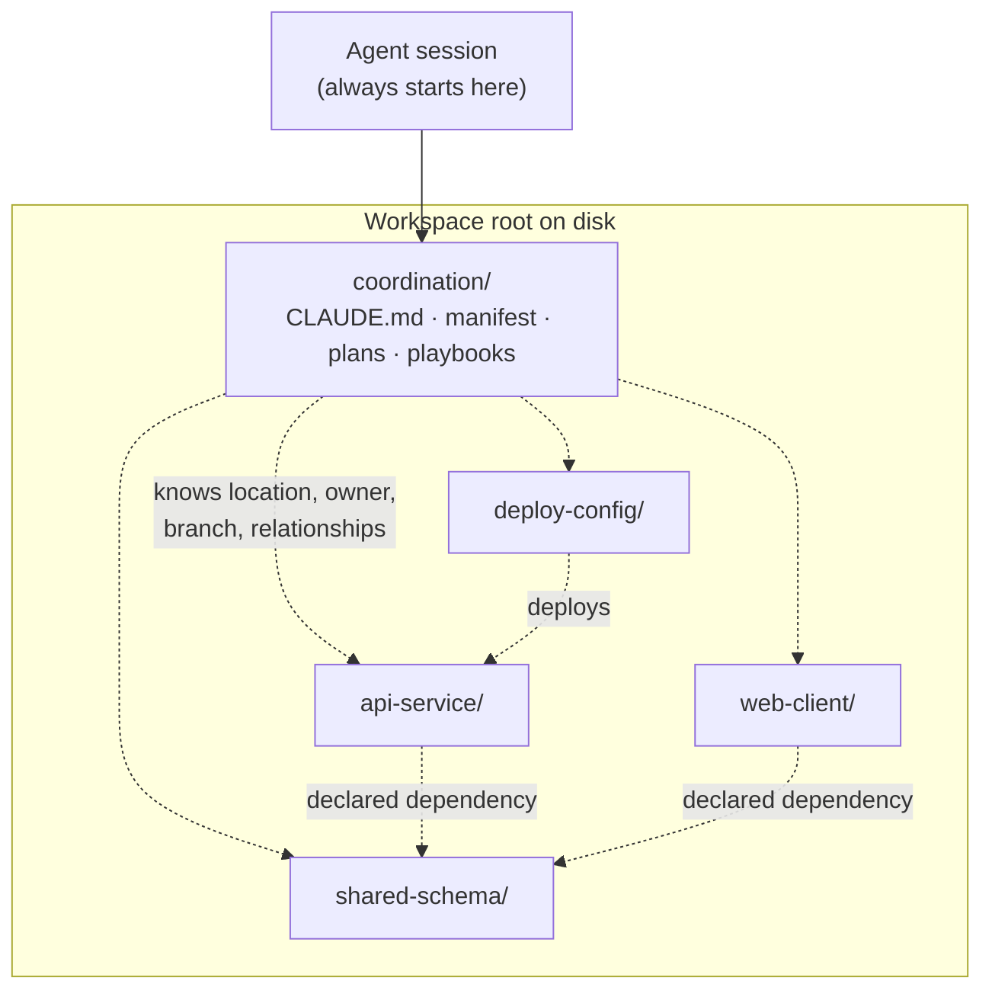
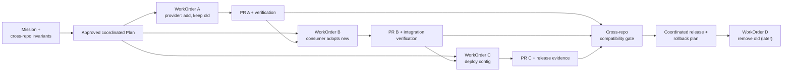

# 9. Multi-repository design and coordinated delivery

Almost every real business outcome touches more than one repository: an API, the client that calls it, a shared schema, the infrastructure that runs it, the deployment configuration, and the documentation. This chapter is about what a factory must know and record before it lets an agent work across those boundaries, how it turns one intent into several dependent pull requests, and why "make it atomic" is the wrong goal. After reading it you should be able to lay out a workspace for agent work across many repositories, choose between the mechanisms Git offers for composing them, and design a coordinated change so that every intermediate state is safe.

## The problem

Ask an engineer who owns a single service to add a field to a response. They will change the API repository, remember to update the shared schema package, know that the mobile client pins an old version, and check with the platform team about the deployment manifest. Most of that knowledge lives in their head. It is not in any file.

Now hand the same task to an agent that has one checkout. It will do a fine job on the API repository and never see the client. Or it will find the client, change both, and open the pull requests in the wrong order so that the consumer deploys before the provider. Or, to be safe, someone clones every repository in the organization into the sandbox, and the agent drowns in irrelevant context while the environment takes ten minutes to start and carries credentials for two hundred repositories it does not need.

Underneath this is a hard fact: a Git commit is atomic inside one repository and nowhere else. There is no cross-repository transaction for branches, pull requests, CI, merges, deployments, or rollbacks. Repository boundaries encode ownership, release cadence, language, build tooling, security posture, and organizational history; they rarely match business capabilities. Dependencies between repositories may be declared in package files, API schemas, deployment manifests, service catalogs, architecture documents, or only in human memory. The factory must model coordination and compatibility explicitly, because Git will not do it.

## How it works

### Monorepo, polyrepo, and the honest answer

When Vaibhav Gupta of BAML was asked on the HumanLayer livestream how a software factory deals with many repositories, his first answer was blunt: you are going to be sad, because you are not using a monorepo. A **monorepo** (one repository holding many projects) gives you atomic source changes, shared tooling, and one place to run agents from. It also gives you repository scale problems, broad CI, and organizational coupling, and it still cannot make *deployment* atomic. A **polyrepo** (many repositories, one per service or team) preserves independent ownership and release cadence at the cost of every coordination problem in this chapter.

Consolidating repositories is an organizational architecture decision. Do not make it because an agent needs context. What you can do, and what Dexter Horthy and Vaibhav both recommended, is **simulate a monorepo**: give the agent one canonical place to start from and enough knowledge of where everything else lives.

### The coordination repository

The practical shape is a **multi-repository workspace**: one directory tree, materialized for a single Attempt, that holds checkouts of every repository the work may touch at recorded commits, plus a small **coordination repository** that sits one level up from the component repositories. On disk it looks like a folder containing `repo-a/`, `repo-b/`, `repo-c/`, and `coordination/`. They do not share a Git history. The coordination repository holds a single instructions file for the agent (a `CLAUDE.md`, `AGENTS.md`, or equivalent), the workspace manifest described below, plans, and shared playbooks. Every agent session starts there.

The analogy is an airport. Each airline maintains its own aircraft, crews, and schedules; the control tower does not own any of them. It owns the map of the airfield and the rules for moving between gates. The coordination repository is the tower: it organizes movement without becoming a superproject that owns the components.

<!-- infographic: coordination-repo-layout -->
> **Infographic — Coordination repository layout.** *(Jay's graphic goes here.)* Until then, the diagram below carries the same concept.

Two design points from the livestream matter. First, the components do not need to reference each other; you do not need every repository to carry a two-way link to every other repository. One control file that describes the organization's layout is enough, as long as the workflow includes a research step where the agent reads it and works out what is in scope. Second, the coordination repository can be a separate, nearly empty repository with just the instructions file in it, or it can be the repository everyone already uses most, with the shared configuration added. Either way there is one canonical place from which agent work starts.

### The workspace manifest

The map inside the coordination repository is the **Repository Workspace Manifest**. It is a versioned record that identifies, for the repositories in organizational scope:

- canonical identities (host, organization, name) and the local checkout name and allowed paths for each;
- default and protected branches;
- owners, approvers, sensitivity classification, and publication policy;
- relationships: source, build, runtime, schema, API, deployment, and documentation dependencies;
- version and compatibility contracts between them;
- required tools, environments, and credentials;
- discovery metadata and exclusion rules; and
- the manifest's own version, owner, provenance, and freshness.

The manifest is a map, not mutation authority. It tells an agent what exists and how things relate. A WorkOrder (see [Chapter 5](./05-authoritative-records.md)) grants exact read and write scope over a selected subset after planning and review. Keeping those two things separate is the single most important design decision in this chapter.

### Discover broadly, authorize narrowly

**Relevant-repository discovery** is the step where the planner works out which repositories a change actually touches. It can draw on service catalogs, dependency files, code search, ownership metadata, incident links, architecture documents, and prior changes to similar areas. The planner should explain why each repository is included or excluded, and name the dependencies it is unsure about.

Discovery runs in two stages:

1. **Read-only investigation** across the eligible repository graph, which produces a proposed repository set and rationale.
2. **Explicit write admission**, approved by a human or by policy, naming the exact repositories, branches, paths, and change types the Plan requires.

This is what lets an engineer use agents in codebases they do not personally know. As Dexter put it, the alternative of having the human pick relevant repositories works to a point, but the moment you want an agent to help you in a codebase you are not an expert in, a missed repository sends you back to finding the person who knows. Broad read discovery and narrow write authority solve different problems and should be designed separately.

**Cross-repository context selection** follows from discovery: once the repository set is known, the context engine (see [Chapter 16](../03-build/16-data-knowledge-semantic-and-context-engineering.md)) assembles the relevant files, schemas, and contracts from each, rather than the whole of each.

### The sandbox cloning tradeoff

Here the multi-repository question collides with the pets-versus-cattle question from [Chapter 14](../03-build/14-development-environments-sandboxes-and-compute.md). If sandboxes are created on demand (cattle), do you really clone two hundred repositories onto every box? Startup slows, disk grows, and every credential rides along. If the human picks the relevant repositories, startup is fast but discovery is only as good as that person's knowledge. If the environment is a long-lived pet with everything checked out and kept current, discovery is easy and the environment is a maintenance burden with a large blast radius.

The workable middle path is a **read-only discovery index** (code search, catalog, and the manifest) that is always available, plus on-demand qualified checkout of exactly the repositories the approved WorkOrder names. Discovery does not require a clone; mutation does.

### Version skew and cross-repository invariants

When several repositories are checked out, they are checked out at particular commits. **Version skew** is the condition where the combination of commits in the workspace is not one that has ever been built, tested, or deployed together: the client at yesterday's head, the schema package at a release from last month, the API at a feature branch. Skew is normal; ignoring it is not. The Attempt must record the baseline commit of every repository it touched so that verification results can be interpreted.

A **cross-repository invariant** is a rule that must hold across the set regardless of which individual pull request merges first: the client never sends a field the API does not accept; the deployment manifest never references an image that does not exist; every schema version in use has a migration path. Invariants live in the Plan, not in any one repository, because no single repository can check them.

### Coordinated pull requests as a dependency graph

A coordinated change is not one pull request. It is a **coordinated PR** set: several repository-scoped WorkOrders, each producing its own pull request with its own candidate, evidence, approvals, and repository policy, joined by explicit dependencies. The parent Plan holds what no single pull request can: global invariants, integration criteria, **merge ordering**, release sequence, compatibility window, and rollback strategy.

<!-- infographic: coordinated-pr-ordering -->
> **Infographic — Coordinated PR ordering.** *(Jay's graphic goes here.)* Until then, the diagram below carries the same concept.

The related vocabulary from the merge-queue discussion in [Chapter 32](../06-improve/32-production-feedback-review-and-the-agentic-merge-queue.md) applies here across repositories: stacked PRs, PR slicing, dependency-aware merge order, migration ordering across PRs, and the human merge gate. Within a single repository these are conveniences. Across repositories they are the only mechanism you have.

### Compatibility instead of simultaneity

The temptation is to look for a way to merge everything at once. Resist it. Design the change so that every intermediate state is valid:

- add before remove;
- support old and new schema or API versions during migration;
- deploy producers before consumers, or consumers before producers, as the contract dictates;
- use feature flags or dual reads and writes where justified;
- separate data migration from destructive cleanup;
- publish versioned artifacts before adopting them; and
- remove compatibility only after measured migration completion.

If a change truly requires simultaneous activation, say so, name the risk, and use a coordinated release mechanism such as a **release train** (a scheduled, named release that carries a known set of repository versions together). What you must never do is claim that several queued pull requests are atomic. Cross-repository atomicity is a compatibility-design problem, not a Git feature waiting to be discovered.

### Identity at every boundary

For every repository it touched, an Attempt should retain:

- canonical repository identity and host;
- baseline commit and branch;
- read/write scope and credential identity;
- checkout path and worktree identity (a **multi-repository worktree** is simply one worktree per repository under one workspace root);
- produced commit, branch, and pull request;
- dependency and invalidation relationships with the other repositories in the set;
- verifier and evidence subject; and
- merge, release, and rollback state.

A change in one repository can stale evidence in another. If the schema package changes, the client's passing tests from an hour ago no longer say what they said. The requirement-to-evidence graph should express those invalidations explicitly rather than relying on a reviewer to remember them.

### Verifying the assembled system

Per-repository CI is necessary and insufficient. Each repository's tests prove that repository is internally consistent; they say nothing about the combination. Add contract tests, schema compatibility checks, package-resolution tests, an integration environment, deployment ordering checks, and end-to-end assertions against the exact candidate set.

The **integration candidate** is a manifest of repository commits and artifacts, not a synthetic "mega commit". Verification receipts bind to the digest of that manifest. This is the same discipline as the proof package in [Chapter 24](../04-prove/24-quality-contracts-proof-packages-and-certificates.md), applied to a set instead of a single head SHA.

### Cross-repository rollback

**Cross-repository rollback** is harder than forward delivery because the dependency graph runs backwards and the compatibility window may have closed. If the provider's old endpoint has already been removed, rolling back the consumer alone breaks it. The Plan's rollback strategy must therefore state, for each stage of the release, which repositories can be reverted independently and which must move together, and it must keep the compatibility window open until the last consumer has migrated. Rollback is planned when the change is designed, not when it fails.

### Ownership and approval across repositories

Each repository keeps its own owners, approvers, and policy. A coordinated change does not get a blanket approval; each pull request is approved under its own repository's rules, and the Plan is approved by whoever owns the cross-repository outcome. The manifest is where ownership is recorded so the planner can route approvals correctly. Where ownership is ambiguous or missing, the planner should flag it rather than guess, because an unowned repository in a coordinated change is a repository nobody will roll back.

## How to build it

### Choosing a workspace mechanism

The goal is to give the agent one traversal root with correct version semantics at the lowest cost. The table lists the mechanisms, what each is for, and what each breaks.

| Strategy | Useful when | Primary cost or risk |
| --- | --- | --- |
| Monorepo | Shared tooling, atomic source changes, and unified ownership are acceptable | Repository scale, broad CI, organizational coupling; deployment is still not atomic |
| Adjacent independent checkouts | Agents need a common filesystem view without changing repository history | The external manifest must preserve versions and layout |
| Coordination repository | One small repository can own the manifest, plans, and shared instructions | Can go stale or become a second source of truth |
| Git submodule | The parent must pin an exact commit of another repository while histories stay separate | Two-level updates, detached HEAD states, recursive operations, gitlink coordination |
| Git subtree | Consumers need vendored content in the parent history with occasional upstream sync | Duplicate history and content; explicit split/pull/push discipline |
| Symlink workspace | Local tools need one traversal root over existing checkouts | Weak version semantics; portability and sandbox complications |
| Sparse or partial clone | One large repository holds more history or paths than the task needs | Discovery misses excluded material if the scope is wrong |

Some detail on each, with the failure mode first, because the failure mode is what you will meet in practice.

**Git submodules** record a pointer (a gitlink) in the parent to an exact commit of a child repository. That pinning is the point and the pain. Every update to the child means a commit in the child and a second commit in the parent to move the pointer; forget one and the parent points at a commit nobody can find or that has been rebased away. Fresh clones arrive with empty submodule directories unless recursively initialized. Agents working inside a submodule are on a detached HEAD by default. Vaibhav's plea on the livestream was simply "please don't use submodules"; they pin specific commits in every repository and you commit in two places every time. Use them only when the product truly needs a parent to pin an exact external revision.

**Git subtrees** copy another repository's content into a subdirectory of the parent, with its history merged in. There is no pointer to keep in sync and a fresh clone has everything, which is why Dexter called them the child of a worktree and a submodule. The cost is duplicate history, and pushing changes back upstream requires `git subtree split` and `push` discipline that most engineers learn by getting it wrong. Mike Hostetler's Ralph-loop setup, mentioned on the livestream, runs autonomous agent loops across a subtree-composed workspace; it works because one person maintains the discipline. In an organization, that discipline is exactly what erodes.

**Symlink workspaces** create a folder of symbolic links to existing checkouts so the agent can traverse everything as if it were one tree. This is cheap and works with local coding harnesses. It carries no version information at all, links break when a path moves, and many sandboxes either refuse to follow symlinks or mount them read-only. Treat it as a convenience for a developer's own machine, not as a workspace definition.

A **sparse clone** (a **partial clone** combined with a sparse checkout) solves the opposite problem: one repository is too big. A sparse checkout limits the paths materialized; a partial clone limits the objects fetched. Both are excellent for large monorepos, with one caveat: if the manifest's scope is wrong, the material that would have told the agent about a dependency is precisely the material that was excluded.

**Adjacent independent checkouts plus a versioned manifest** is the default recommendation. It changes no repository's history, works in any sandbox, and puts version information where it can be reviewed. The manifest can become stale; that is a freshness check, not a structural problem. Do not adopt submodules or subtrees merely to make an agent see several repositories. Use repository-composition features only when their versioning and distribution semantics solve a real product need.

### Building the coordinated change flow

1. **Write the manifest.** Enumerate repositories, identities, branches, owners, relationships, contracts, credentials, exclusions. Version it and give it an owner.
2. **Create the coordination repository.** Put the manifest, the agent instructions file, and shared playbooks in it. Make every agent session start there.
3. **Add a discovery step to the workflow.** Before planning, the agent reads the manifest and investigates read-only. It produces a proposed repository set with inclusion and exclusion rationale and a list of uncertain dependencies.
4. **Admit write scope explicitly.** A human or policy approves exact repositories, branches, paths, and change types. This becomes the WorkOrder set.
5. **Model the dependency graph.** Each WorkOrder names what it depends on. The Plan records invariants, merge order, compatibility window, release sequence, and rollback strategy.
6. **Design for compatibility.** Apply the add-before-remove list above. Where simultaneity is unavoidable, name it and schedule a release train.
7. **Record identity per repository** on every Attempt, as listed under "Identity at every boundary".
8. **Build the integration candidate.** Produce a manifest of commits and artifacts, compute its digest, and run contract, schema, resolution, integration, ordering, and end-to-end checks against it.
9. **Merge in order.** The human merge gate applies per pull request; the agent may keep candidates mergeable but may not reorder or expand scope.
10. **Release and hold the window.** Release per the sequence; keep compatibility until migration is measured complete; then schedule cleanup as its own WorkOrder.
11. **Rehearse rollback.** Before removing compatibility, prove that each stage can be reverted as the Plan says.

### Design checklist

- Is the manifest versioned, owned, and fresh?
- Does every agent session start from one canonical place?
- Can discovery run without cloning?
- Is write scope narrower than discovery scope?
- Does every intermediate merge state satisfy the invariants?
- Does the integration candidate have a digest that evidence binds to?
- Does evidence in one repository invalidate correctly when another changes?
- Is the rollback plan written before the first merge?
- Is there an owner for every repository in the set?

## Failure modes

**The missed dependency.** Discovery scoped to the human's knowledge omits a consumer. Detect it with contract tests against the integration candidate and with code search for the changed symbol across the whole index, not just the selected repositories. Fix it by widening discovery, not by widening write scope.

**The wrong order.** The consumer merges and deploys before the provider. Detect it by making merge order a Plan record that the merge gate enforces rather than a note in a description. Fix by reverting the consumer if the compatibility window allows, otherwise by expediting the provider.

**The false atomic.** A team believes four queued pull requests will land together. One fails CI; three are already merged. Detect it in design review: any Plan that lacks a valid-intermediate-state argument for each merge is a false atomic. Fix by redesigning for compatibility.

**Stale evidence.** The schema package changes after the client's tests passed; the client is merged on stale green. Detect it with invalidation edges in the evidence graph keyed on repository identity and baseline commit. Fix by re-running the affected verification against the new candidate.

**The stale map.** The manifest lists a repository that was archived and omits one created last month. Detect it with a freshness check that compares the manifest to the organization's catalog on a schedule. Fix by making the manifest owner accountable for it as a record, not a document.

**Two sources of truth.** The coordination repository grows its own copies of plans and instructions that drift from the component repositories. Detect it by asking which record is authoritative for any given fact; if the answer is "both", it is neither. Fix by keeping the coordination repository to the map, the shared instructions, and cross-repository Plans only.

**Submodule drift.** The parent points at a commit the child has rebased away, or a fresh sandbox has empty submodule directories. Detect it at environment build. Fix by replacing the submodule with an adjacent checkout and a manifest entry.

**The two-hundred-clone sandbox.** Every task clones everything. Detect it in environment startup time, disk, and credential inventory. Fix by separating the read-only discovery index from on-demand qualified checkout.

**The broken rollback.** The compatibility window closed before the last consumer migrated; rollback of one repository now breaks another. Detect it by keeping the rollback plan as a record with per-stage independence claims that are re-checked before cleanup. Fix by reopening compatibility, which is why cleanup is always its own WorkOrder.

**Unowned repository.** A coordinated change touches a repository whose owner left. Detect it during discovery from the manifest. Fix by assigning ownership before write admission.

## In Mission Control

At study commit [`d902fae`](https://github.com/jaydubya818/MissionControl/tree/d902fae7032c0696b531c44ae88829c652516fc6), Mission Control is itself a TypeScript and pnpm monorepo. Its domain model supports multiple registered repositories under a Workspace, repository-scoped policy, Factory Configuration, WorkOrders, worktrees, GitHub identity, and evidence bound to source and head SHA. That is the substrate this chapter needs: **implemented**.

The studied evidence does not establish a production-qualified multi-repository WorkOrder, a repository dependency graph, a workspace manifest, a cross-repository candidate digest, a coordinated PR state machine, a compatibility gate, or a release-and-rollback proof. Multi-repository registration and single-repository execution exist; coordinated delivery across repositories does not: **future**.

The intended direction is a versioned repository graph, Plans that create a coordinated change set of repository-scoped WorkOrders with explicit dependencies, read-only discovery before write admission, and an operator view showing the repository set, inclusion rationale, version skew, PR dependency graph, invariants, integration candidate, merge and release order, stale evidence, rollback state, and pending human decisions. Promotion to "implemented" requires a real two-repository golden path, a failed compatibility test, a reordered merge, a partial rollback, and recovery without losing lineage.

## Retain this

- Git is atomic inside one repository and nowhere else; cross-repository atomicity is a compatibility-design problem, not a feature to find.
- Simulate a monorepo: one coordination repository one level up, one instructions file, one manifest, every session starts there. Components do not need to link to each other.
- The manifest is a map. A WorkOrder is authority. Discover broadly, authorize narrowly, and design the two separately.
- Prefer a read-only discovery index plus on-demand qualified checkout over cloning everything or trusting the human to pick.
- Adjacent checkouts plus a versioned manifest beat submodules, subtrees, and symlinks unless their versioning semantics solve a real product need. Submodules pin commits and make you commit twice.
- A coordinated change is a dependency graph of pull requests; the Plan owns invariants, merge order, compatibility window, release sequence, and rollback.
- Add before remove; keep the compatibility window open until migration is measured complete; make cleanup its own WorkOrder.
- The integration candidate is a manifest of commits and artifacts with a digest that evidence binds to, and a change in one repository can stale evidence in another.

## Go deeper

- [Chapter 5. Authoritative records](./05-authoritative-records.md) for WorkOrders, Attempts, and the Workspace record.
- [Chapter 6. Intent and specification engineering](./06-intent-and-specification-engineering.md) for how a Plan carries invariants.
- [Chapter 14. Development environments, sandboxes, and compute](../03-build/14-development-environments-sandboxes-and-compute.md) for pets versus cattle and the cloning tradeoff.
- [Chapter 24. Quality contracts, proof packages, and certificates](../04-prove/24-quality-contracts-proof-packages-and-certificates.md) for evidence bound to digests.
- [Chapter 32. Production feedback, automated review, and the agentic merge queue](../06-improve/32-production-feedback-review-and-the-agentic-merge-queue.md) for stacked PRs and dependency-aware merge order.
- To prove you have understood this chapter, walk a two-repository provider/consumer change end to end: manifest, backward-compatible change, dependent PRs, integration-candidate digest, deliberate skew in both directions, rollback.
- [Glossary](../appendix/glossary.md).
- HumanLayer × BAML livestream, "Software factory design patterns" (Dexter Horthy and Vaibhav Gupta): the multi-repository segment on coordination repositories, submodules, subtrees, and the sandbox cloning tradeoff.
- "The 12-layer production AI agent stack" coverage audit, section 10, for the multi-repository term list this chapter defines.
- [Git submodules documentation](https://git-scm.com/docs/gitsubmodules); [Git subtree documentation](https://github.com/git/git/blob/master/contrib/subtree/git-subtree.txt); [Git worktree documentation](https://git-scm.com/docs/git-worktree); [GitHub: About stacked pull requests](https://docs.github.com/en/pull-requests/get-started/about-stacked-prs).
- [Mission Control capability, workflow, and admission map](../appendix/mission-control/03-capability-workflow-and-admission-map.md), assessed at `d902fae`.
