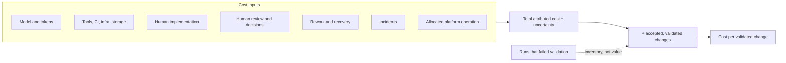
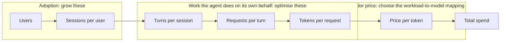
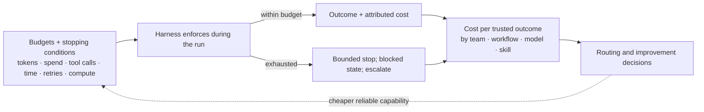
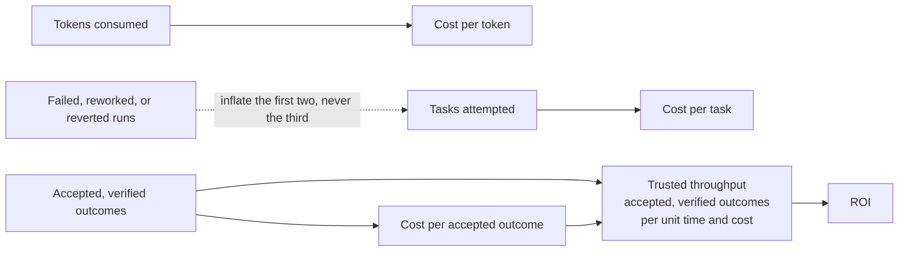

# 9. Tokenomics and factory economics

Token spend is not a procurement footnote. It is the product of architecture choices about sessions, turns, requests, context, routing, retries, and verification. This chapter turns those choices into an operating model for cost per accepted outcome and factory ROI.

## The problem

A cheap model can produce an expensive outcome when it retries, rereads large contexts, or shifts cleanup to senior engineers. A hard cap can also stop useful work without reducing waste. Teams need a cost model that attributes the whole attempt and an execution policy that spends intelligence only where it creates value.

## How it works

### Attribute the full cost

Cost per accepted WorkOrder includes model and token spend, tools, infrastructure, CI, storage, human implementation, review, recovery, rework, incidents, and allocated platform operation — with uncertainty stated explicitly. Then compare marginal cost with marginal value. A more expensive model can be cheaper overall if it cuts retries and review. A cheap run that fails validation is inventory, not value.

<!-- infographic: cost-per-validated-change -->
> **Infographic — Cost per validated change.** *(Jay's graphic goes here.)* Until then, the diagram below carries the same concept.

Three cautions. Comprehensive measurement can become surveillance: measure workflows and systems, not individuals, and never use lines of code, commits, hours online, or prompt volume as performance targets. Business outcomes take weeks to observe while teams need fast feedback: use leading indicators, label them as proxies, and never quietly substitute "PR merged" for customer value. Cost attribution will be imperfect: a transparent range beats a precise but incomplete number, and the measurement system itself has a cost that should stay proportional to the decisions it supports.

### Tokenomics: token economics is an architecture problem

**Token economics** — **tokenomics**, in the shorthand most teams use — is the discipline of optimising the economic efficiency of agentic execution across models, context, tools, workflows, retries, caching, parallelism, and verification, while preserving the quality the work requires. The narrow version, controlling what a factory spends on model inference without shrinking what it delivers, is where most teams start; the wide version matters because the inference bill is only one of the things the levers below move. Tokenomics sits in this chapter rather than in a finance appendix because every lever that moves the bill is a design decision: which model runs which work, what the model is shown, how many turns a loop takes, what is cached, what is automated away, how deep verification goes, and what is stopped. The principle in one line: *spend intelligence where intelligence creates value.* The next five subsections are the tokenomics playbook: the levers, the equation that names them, the controls that enforce them, the visibility that keeps them honest, and the playbook that puts them in one table.

Model spend is usually handed to finance as a bill to be negotiated. It is better treated as an architecture problem, because nearly every lever that moves it is a design decision, and because the cheapest model is not the cheapest system. A cheaper model that takes three attempts and then costs a senior engineer thirty to forty-five minutes of rework has cost more than one successful run on a stronger model, and the difference never appears on the model invoice. *Optimise cost per trusted outcome, not cost per token.*

The structural levers are the ones to reach for before renegotiating a contract. Thirteen of them cover the field — model selection, routing, context size and quality, caching, compaction, tool use, deterministic automation, subagents, parallelisation, verification depth, retry strategy, escalation, and budgets — and they group as follows:

- Use smaller models for simpler work, and strong models only where reasoning creates value; that is model selection and routing ([Chapter 21](../03-build/21-models-and-capability-selection.md)), including the escalation and downgrade decisions taken while a loop runs.
- Replace reasoning with deterministic automation wherever behaviour has become predictable.
- Retrieve narrowly; a targeted context package is cheaper and more accurate than a full one. Context size and context quality are separate levers, and compaction — summarising the window so it stays useful — is a third with a cost of its own.
- Cache what repeats: prompts, retrieval results, compiled context.
- Bound every loop, and give every run explicit budgets and stopping conditions. Retry strategy is a lever, not a constant: a loop that retries the same action after the same error is spending tokens to learn nothing.
- Choose tool use deliberately; a tool call that returns forty kilobytes into the context is re-billed every turn.
- Avoid multi-agent coordination and parallel candidates that do not buy a measured quality gain; every extra agent is tokens, latency, and failure surface, and subagents earn a cheaper default model.
- Set verification depth by risk, so that a documentation change is not verified like a migration and a migration is not verified like a documentation change.
- Measure human rework as a cost line, because it is the largest one the model bill hides.
- Attribute cost by team, workflow, model, and outcome, so that a number can be acted on.

One lever is easy to forget because it does not look like a model decision: for some tasks *the best model is no model at all*. A deterministic service or a mature skill that performs a known transformation costs almost nothing per run, never hallucinates, and needs no evaluation of its trajectory. Routing to it is an economic and a quality decision at once ([Chapter 21](../03-build/21-models-and-capability-selection.md)).

### Tokenomics: the cost equation

The levers above are easier to prioritise once the bill is written as a product rather than a total. One large engineering organisation that runs agents across thousands of engineers published the decomposition it manages against, and it transfers to any factory:

*Total spend = users × sessions per user × turns per session × requests per turn × tokens per request × price per token.*

The six terms fall into three groups, and each group wants a different response. The first two, users and sessions per user, are **adoption**: they measure how much of the organisation's work is flowing through the factory, and the correct response to their growth is to welcome it. The middle three, turns, requests, and tokens, are *the work the agent does on its own behalf, on top of what the engineer actually asked for*: the extra turn spent recovering from an error, the request that searches one more place, the tokens that re-send a tool schema nobody used. This is where almost all optimisation effort belongs: plan faster, cut unwanted turns and errors, cut input tokens. The last term, price per token, is set by the vendor. You do not negotiate it turn by turn; you choose which model runs which workload, which is the routing decision of [Chapter 21](../03-build/21-models-and-capability-selection.md). Measure each term weekly or monthly and forecast it, so that a rising bill can be read as "more adoption" or "more waste" and never as a single undifferentiated number.

<!-- infographic: cost-equation -->
> **Infographic — The cost equation.** *(Jay's graphic goes here.)* Until then, the diagram below carries the same concept.

The runtime defaults that move the middle terms (compaction threshold, reasoning effort, the subagent model default, prompt-cache lifetimes) are the loop defaults of [Chapter 23](../03-build/23-agent-and-loop-engineering.md); the schema and tool-access techniques that shrink tokens per request are in [Chapter 18](../03-build/18-agent-architecture.md). The point of the equation here is the accounting discipline: every lever in this chapter attaches to one term, and a lever that attaches to none is a slogan.

The same organisation's public figures are the clearest available evidence that the middle terms are where the money is. Between February and August 2026 its weekly active users grew about 7× and weekly agentic requests about 9.4×, while total AI spend stayed roughly flat from April; with the model held constant from February to July, cost per thousand model requests fell about 34 percent from its peak and cost per session fell 52 percent from its June peak. Those are one organisation's published measurements, not universal constants, but the shape is the argument: usage multiplied, unit cost fell across every metric, and quality held, without a unit-price cut and without downgrading tools. The conclusion the team drew is the one this chapter has been building toward. *Cost is a tractable engineering problem: eliminate zero-value token consumption rather than rely on unit-price cuts or tool downgrades. Cost per outcome, never cost per token.*

### Tokenomics: the control playbook

Every lever in this chapter and its neighbours acts on one term of the cost equation. Read the table top to bottom when spend is rising and you need to know which knob to turn first; the terms are ordered from the one you want to grow to the one you least control.

| Term | Direction | What moves it | Where |
|---|---|---|---|
| Users | Grow | Paved road that beats the workaround; onboarding; managed agents that work on people's behalf | [Chapter 34](../05-operate/34-the-factory-as-a-platform.md), [Chapter 38](../05-operate/38-enterprise-adoption-and-the-infrastructure-landscape.md) |
| Sessions per user | Grow | Workflows worth starting; triggers that start work without a person | [Chapter 26](../03-build/26-autonomous-engineering-workflows.md) |
| Turns per session | Shrink | Ground first (context graph, semantic layer); a goal-condition stop rule; bounded loops; retry budgets; deterministic skills instead of reasoning | [Chapter 19](../03-build/19-data-knowledge-and-semantic-engineering.md), [Chapter 23](../03-build/23-agent-and-loop-engineering.md), [Chapter 11](../03-build/11-the-agent-factory.md) |
| Requests per turn | Shrink | Code-mode batching; subagents only where they buy measured quality; no polling loops inside the model's context | [Chapter 18](../03-build/18-agent-architecture.md) |
| Tokens per request | Shrink | Tool gateway with CLI resolution and tool search instead of loaded schemas; compaction threshold; reasoning-effort default; prompt-cache TTL matched to idle gaps; narrow retrieval | [Chapter 18](../03-build/18-agent-architecture.md), [Chapter 23](../03-build/23-agent-and-loop-engineering.md) |
| Price per token | Choose | Benchmark-driven, Pareto-optimal model per workload; cheaper default model for subagents; "no model at all" for known transformations | [Chapter 21](../03-build/21-models-and-capability-selection.md) |

Two rules keep the playbook honest. First, the only number you optimise for is **cost per validated outcome**; a change that lowers cost per token and raises human rework has made the factory more expensive. Second, every lever is measured with the model held constant, because a model upgrade moves every term at once and will be mistaken for your own improvement.

### Tokenomics: budgets and stopping conditions are execution controls

Budgets are not accounting after the fact; they are controls the harness enforces while a run is in progress. Each Attempt carries limits on tokens, model spend, tool calls, execution time, retries, and compute, and an objective stopping condition so that an agent which is stuck stops rather than reasoning indefinitely in circles. A budget that is only reported is a bill; a budget that is enforced is a safety boundary, and it is also what makes a failed run cheap enough to be a normal event rather than an incident.

The full shape of an **execution budget** is a policy maximum in seven kinds and at five levels. The seven kinds are tokens, spend, compute, time, tool calls, retries, and model tier — the last one is the kind teams forget, and it is what stops a task classified as Low from escalating itself to the frontier model. The five levels are task, mission, repository, team, and organisation, and they nest: a task cannot exceed its mission's remaining budget, a mission its repository's, and so on up, so that a runaway at the bottom is caught at the smallest level that notices. When a budget is reached the run does one of three things, chosen by policy for that kind and level: it stops, it escalates to the next capability or to a human, or it requests authorisation to continue. That third outcome is the economic boundary of the cost-bounded autonomy in [Chapter 7](./07-governance-policy-and-risk-proportional-approval.md) — "proceed up to this spend, then ask" — and it is how a budget becomes a governance object rather than a fuse.

Budgets are set better when spend can be estimated first. **Cost prediction** estimates the inference, compute, tool, and verification cost of a piece of work before it starts and revises the estimate as it runs, from the workload class, the change size, the repository's history of similar tasks, and the verification the tier demands. Before execution it sizes the budget and flags work whose predicted cost exceeds its value; during execution it is the trend that tells the harness a run is heading for its ceiling long before it hits it, which is the trigger for escalation while there is still budget to escalate with.

Budget data flows back into design. If one skill costs five times another for the same outcome, that fact should change routing and go into the improvement backlog, not sit in a monthly report. *Economics should influence architecture continuously, not arrive as a surprise on the monthly bill.*

<!-- infographic: budget-feedback-loop -->
> **Infographic — Budgets as controls and as signals.** *(Jay's graphic goes here.)* Until then, the diagram below carries the same concept.

### Tokenomics: visibility instead of caps

Attempt budgets bound a *run*. The spend of a *person* or a *team* is a different object, and the instinct to bound it the same way, with a hard cap that stops work when it is reached, is usually wrong. A cap turns the first two terms of the cost equation, the adoption terms, into the thing being suppressed, and it teaches engineers that the governed path is the one that shuts off mid-task. The organisation whose figures appear above chose the opposite design, and it is the pattern to copy: make cost visible everywhere, and steer with nudges.

The visibility starts in the harness. A **live cost counter** sits in the status line of whichever interactive harness the engineer is using, per harness and across all harnesses for that user, so cost is seen while it is being incurred rather than discovered on an invoice (the unified wrapper that hosts it is in [Chapter 15](../03-build/15-coding-harnesses-and-agent-protocols.md)). Above the counter sit **spend tiers** rather than hard caps: one shared tier across all of a person's interactive harnesses, and separate tiers for each managed agent, because a code-review agent and a human's terminal session should never draw on the same pool. The harness nudges in chat at 50, 80, and 100 percent of the expected spend for the tier, and a tier upgrade is one easy manager approval, not a procurement cycle. A cost-check skill or dashboard lets anyone ask "what am I spending, on what?" at any moment.

The second half is education, and it is automated. A **session-analysis dashboard** built into the runtime, with no opt-in, reads every session trace across local and cloud sandboxes and every harness, and flags sixteen anti-patterns, each with its financial impact and a targeted remediation. Four of the named ones show the range:

| Anti-pattern | What it looks like | Remediation |
| --- | --- | --- |
| Suboptimal model routing | Simple multi-turn sessions running on the frontier model when a mid-tier model would do | Route by task; change the default for that session class |
| Context-window bloat | A 40KB tool payload persisting in context and re-billed every turn | Summarise or drop tool results; move the tool behind the shell ([Chapter 18](../03-build/18-agent-architecture.md)) |
| Cache-expiration inefficiency | Resuming after a long break forces a full-price prefix rebuild | Match the cache lifetime to how people actually pause ([Chapter 23](../03-build/23-agent-and-loop-engineering.md)) |
| Prompt-initialisation overhead | 100K tokens of instructions and tool definitions before any user input | Load tools on demand; trim standing instructions |

Each flag attaches to a term in the cost equation, states what it cost, and says what to change. That is what makes it education rather than surveillance: it reports on sessions and patterns, never on a person's productivity, which keeps it on the right side of the caution earlier in this chapter. The same organisation's roadmap moves the dashboard from batch detection to real-time guidance in the session itself; [Chapter 40](../06-improve/40-governed-learning.md) says what that means for the learning loop.

### Tokenomics: three costs, and the measure that unites them

The playbook above uses several cost words, and they are not interchangeable. Getting them straight is what lets a team argue about spend without talking past each other.

**Inference cost** is what the model bill measures: tokens consumed multiplied by price, the last two terms of the cost equation. **Token efficiency** is how much accepted work each token buys, and it improves when the middle terms of the equation shrink: fewer wasted turns, fewer redundant requests, less re-sent context. **Context efficiency** is the narrower question of how much of what the model was shown actually influenced the outcome; a context package that is half tool schemas nobody called has a context efficiency of half, and every re-billed turn pays for the idle half again. The hierarchical context of [Chapter 19](../03-build/19-data-knowledge-and-semantic-engineering.md) is the structural answer to it.

Above those sit three ways of pricing what the factory produces, and they form a ladder from the least useful to the one that matters.

| Measure | What it divides by | What it hides | Who it serves |
|---|---|---|---|
| **Cost per token** | Tokens | Everything: retries, rework, review, whether anything was accepted | Vendor comparison only |
| **Cost per task** | Tasks attempted | Whether the task succeeded, how many attempts it took, what the human did afterwards | Capacity planning |
| **Cost per accepted outcome** | Outcomes accepted and verified, all-in | Nothing that matters; it includes model, tools, CI, human review, rework, and recovery | The factory |

*Don't optimise cost per token; optimise cost per accepted outcome.* Cost per token falls when you downgrade the model; cost per task falls when you stop retrying; only cost per accepted outcome falls when the factory gets better, because it is the one denominator that a failed run cannot inflate. It is the same quantity the cost-per-validated-change diagram above computes, named from the routing side.

Underneath it sits an engineering sub-metric that the factory can compute before the business one is knowable. **Cost per verified outcome** is everything spent to get a change through independent verification — generation, retrieval, tools, subagents, retries, verification runs, and the human effort along the way — divided by outcomes that passed. Cost per accepted outcome is the business metric: it adds the acceptance decision, the observation window, and whatever the outcome cost after it shipped, and it is only known weeks later. The two are read together. Cost per verified outcome is what an engineer can move this week by changing a route or a retry policy; cost per accepted outcome is what tells the organisation whether the change was worth making, and the gap between the two is the cost of the defects verification missed.

The trade-off the measure governs is three-cornered: **cost, latency, and quality**. A stronger model raises quality and cost and often latency; deterministic preprocessing lowers cost and latency at fixed quality for the part of the work it can settle; a cheaper model lowers cost and may lower quality below the floor and then raise cost again through retries. The routing question in [Chapter 21](../03-build/21-models-and-capability-selection.md) is this triangle stated as a policy: the cheapest capability that reliably meets the quality, latency, security, and risk requirements. **Budget-aware escalation** is the same triangle applied at run time: step up to a costlier capability only when the cheaper one has failed the floor and the budget for this workload class allows it, and stop, with a human, when it does not.

That leaves the number the whole chapter has been circling. A factory's output is not tokens, not pull requests, and not tasks attempted. It is **trusted throughput**: accepted, verified outcomes per unit of time and per unit of cost. Read it as two ratios on one dashboard, outcomes per week and outcomes per unit of attributed spend, both counting only work that passed independent verification and stayed accepted through its observation window. Trusted throughput is the factory's throughput measure for the same reason a manufacturing line counts units that passed inspection: a line that ships more and returns more has not sped up. It is what **ROI** is computed against, since a return is only real for outcomes that were trusted enough to deploy; it is what a cheaper model has to move to earn its place; and it is what the human-attention material that follows protects, because attention spent on rework or on findings nobody needed is attention that did not produce a trusted outcome.

### Factory economics and factory ROI

The cost-per-validated-change diagram earlier in this chapter lists the inputs a WorkOrder's cost is built from. **Factory economics** is the same accounting at the level of the whole factory, and it needs ten cost lines to be honest, because the ones a team omits are the ones that make a factory look cheaper than it is:

| Cost line | What it covers |
| --- | --- |
| Inference | Model tokens at their price |
| Compute | The machines the loops and sandboxes run on |
| Tooling | Harnesses, gateways, registries, the control plane |
| Sandbox | Isolated environments provisioned per Attempt |
| Storage | Traces, artifacts, receipts, evidence retained for audit |
| Verification | Every validator run, including the expensive independent ones |
| Retries | Attempts that did not succeed but were paid for |
| Human review | Reviewer and approver minutes, at the rate of the people doing them |
| Failure remediation | Rollbacks, hotfixes, incidents caused by factory output |
| Opportunity cost | What the engineers building and running the factory would otherwise have built |

The sum is total cost per accepted outcome, and the return is not one number but six kinds of it: velocity, quality, human leverage, backlog elimination, risk reduction, and broader participation — the last being work done by people who could not previously do it, which the section after next describes. **Factory ROI** is value created relative to the full cost of operating *and improving* the factory, and the "improving" clause matters: a factory whose meta-loops and factory engineers are left out of the denominator will show a return it does not have. Its benefit lines are the ten that a finance partner can audit:

| Benefit | How it is measured |
| --- | --- |
| Engineering hours avoided | Human implementation hours per item, before and after |
| Cycle time | Lead time to validated customer value, by stage |
| Defects prevented | Escaped-defect rate against a baseline |
| Technical debt eliminated | Debt items closed by maintenance loops that never had a sprint |
| Throughput | Trusted throughput, counted after the observation window |
| Review burden | Reviewer minutes per accepted outcome |
| Reliability | Change failure rate and incident count |
| Incident remediation | Time and cost to resolve, and incidents avoided |
| Expanded contribution | Accepted outcomes from people outside engineering |
| Less context switching | Time engineers spend on the work they were hired for |

Every benefit line maps to a metric already defined in this chapter, which is the test of whether an ROI claim is real: if a benefit cannot be pointed at a dashboard line with a baseline, it is a hope.

## How to build it

1. Attribute model, tool, compute, storage, CI, retry, validation, and human-attention cost to each WorkOrder and accepted outcome.
2. Decompose model spend into users × sessions × turns × requests × tokens × price, then attack the middle terms before negotiating unit price.
3. Define budgets for tokens, spend, time, tools, retries, compute, and model tier at task, mission, repository, team, and organization levels.
4. Route deterministic work to code, qualified judgment to the cheapest eligible model, and high-consequence work to stronger routes with independent verification.
5. Publish trusted throughput, cost per verified outcome, cost per accepted outcome, and the gap between them.
6. Compute ROI against the full operating and improvement cost, including human review and failure remediation.

## Failure modes

| Failure | Detection | Response |
| --- | --- | --- |
| Unit price optimized, waste untouched | Turns, requests, or context grow while price falls | Decompose the full cost equation and remove zero-value work first |
| Cost per task replaces cost per outcome | Cheap failed attempts make the dashboard look better | Divide total cost by accepted, observed outcomes |
| Budget acts only as a bill | Spend appears after the month closes | Enforce predictive and in-run budgets with stop or escalation behavior |
| Caps stop people mid-task | The governed path becomes the path that shuts off | Use visibility and spend tiers for people; reserve hard ceilings for bounded Attempts |
| ROI omits improvement cost | Factory economics exclude review, remediation, and meta-loop work | Use the complete cost model and declare every proxy |

## In Mission Control

Mission Control retains cost, duration, attempt, evidence, and policy records that can support this model. At the studied commits, however, provider, compute, sandbox, and human-attention attribution remain incomplete, so cost per accepted outcome is still a partially projected measure rather than sustained production proof.

## Retain this

- Tokenomics is architecture: users × sessions × turns × requests × tokens × price.
- Optimize cost per accepted outcome, not cost per token or attempt; retries and senior rework belong in the denominator.
- Budgets are execution controls across spend, time, tools, retries, compute, and model tier, with explicit stop and escalation behavior.
- Spend intelligence where judgment creates value; deterministic work should remain deterministic.
- Factory ROI includes operation, verification, review, remediation, and improvement—not inference alone.

## Go deeper

- [8. Economics, metrics, and human attention](./08-economics-metrics-and-human-attention.md) for the foundation this chapter builds on.
- [Canonical glossary](../appendix/glossary.md) for the terms and boundaries used here.
- Return to the [book map](../README.md) for the complete reading sequence.
