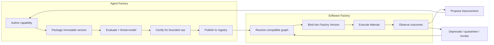
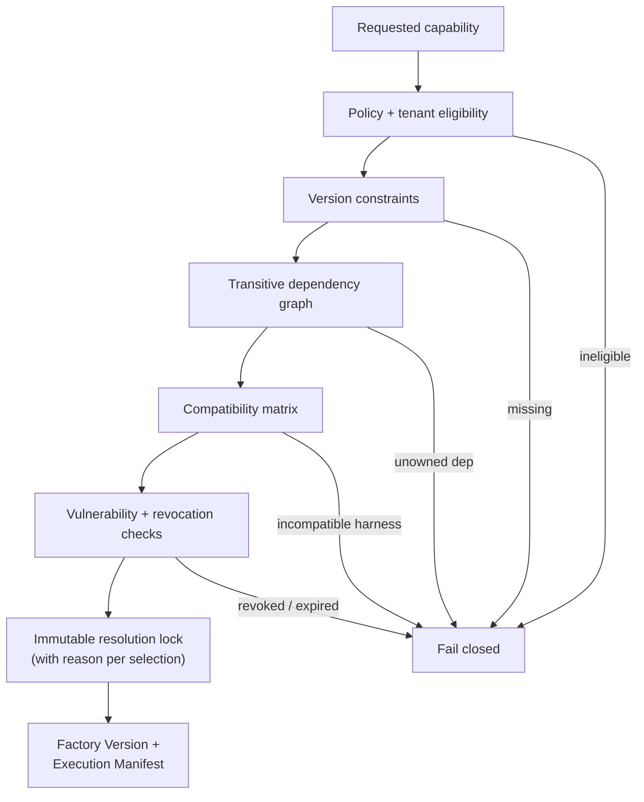
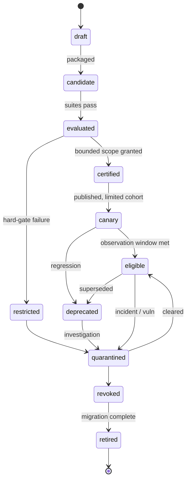
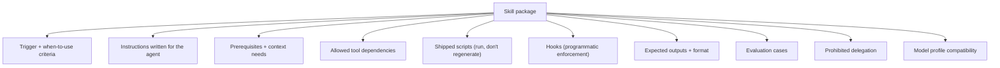

# 10. The Agent Factory: reusable capabilities

The Software Factory executes delivery work. Something has to make the parts it executes with. The **Agent Factory** creates, versions, evaluates, publishes, and governs reusable capabilities: agents, skills, tools, model profiles, configurations, and evaluation assets. This chapter is about that supply chain, from a skill someone wrote on a Tuesday to a certified, resolvable, revocable component that a Factory Version can bind to and an operator can trace back from any Attempt. After reading it you should be able to define the capability envelope, write a complete tool or skill contract, design a resolver that fails closed, and run a lifecycle in which certification expires and revocation propagates.

## The problem

Most organizations manage agent capabilities as loose prompt files, copied scripts, tool connections in someone's config, and undocumented model settings. The same agent name resolves to different instructions, permissions, tools, and evaluation results in different repositories. When an incident happens, nobody can say which version ran, who owns it, what it was allowed to access, whether it was compatible with the current harness, or how to turn it off.

Two failure classes follow. Teams duplicate behavior and learn the same lesson repeatedly. And a convenient capability quietly becomes production infrastructure without any of the controls applied to code, packages, identities, or deployment artifacts.

Dru Knox of Tessl describes the ladder most teams climb: individual engineers collect skills; then someone starts doing **harness engineering**, building the loops that automate and improve agent work; then the team realizes that everyone has become an internal tool builder and the thing they are building is a software factory. At every rung the same question appears: where do the skills live, who owns them, which version is running, and how do we know they still work? His answer, and this chapter's, is that a skills registry with publication controls, security and quality review, and versioning is part of the control plane, not an afterthought. David Andre's open-sourced skills repository, used across Codex, Claude Code, Pi, and Hermes, shows the same pressure from the individual side: forty-two skills is already a supply chain, and without discipline it degrades into forty-two ways to be surprised.

## How it works

### Two factories, one boundary

The Agent Factory and the Software Factory are separate for a reason. The Agent Factory authors, packages, evaluates, certifies, and publishes. The Software Factory resolves exact approved versions and executes authorized delivery work with them. Publication never authorizes delivery; a certified skill is eligible to be used, not permitted to do anything in particular. Authority for work comes from a WorkOrder and a policy decision (see [Chapter 7](../02-design/07-governance-policy-and-risk-proportional-approval.md)), never from the capability itself.

The analogy is an aircraft parts supplier and an airline. The supplier manufactures, tests, certifies, and serial-numbers each part. The airline installs exact serial-numbered parts, records which aircraft carries which, and grounds every aircraft carrying a part when the supplier issues a recall. The supplier does not decide where the aircraft flies. That is the shape of the relationship.

<!-- infographic: capability-supply-chain -->
> **Infographic — Capability supply chain.** *(Jay's graphic goes here.)* Until then, the diagram below carries the same concept.



### What counts as a capability

The Agent Factory manages several capability types that share one envelope and keep type-specific contracts:

- **Agent definitions**: versioned descriptions of an agent's role, instructions, capabilities, policies, goals, permissions, tool access, model configuration, autonomy level, escalation rules, and success criteria. An agent definition composes several other capabilities.
- **Skills**: reusable instructions and capabilities for a specific task. Coding, testing, debugging, deployment, security, repository, organization-specific, and workflow skills are the common families. A skill may compose tools (**tool composition**), carries decision criteria and examples, and is found by **skill discovery**, the process of determining which skill a task should use.
- **Tools**: APIs and capabilities agents call to act, commonly exposed through MCP. A tool needs executable schemas and side-effect declarations.
- **Prompts**: parameterized instruction fragments with parameter and output contracts.
- **Model profiles**: which models and configurations are appropriate for a capability (see [Chapter 17](./17-models-routing-and-capability-selection.md)).
- **Evaluators**, **context packages**, and **workflow recipes**.

### The capability envelope

Every registered capability, whatever its type, carries the same identity model:

- a stable identity, type, owner, source, license, and support tier;
- an immutable version and digest;
- declared inputs, outputs, side effects, permissions, and data classifications;
- dependencies on tools, protocols, models, runtimes, policies, and other capabilities;
- evaluation suites, results, limitations, and known failure modes;
- compatibility ranges and qualified environment combinations;
- a lifecycle state; and
- provenance from source revision through package and signature.

One universal schema is tempting and would flatten real differences between a tool and an agent. Use the shared envelope plus type-specific manifests, and avoid a single quality score: eligibility is multidimensional and risk-specific.

### Catalog versus registry

A searchable list is a **catalog**. It is optimized for people and agents to find things, using natural language, tags, domains, and examples. A **registry** is optimized for authoritative resolution: it owns canonical identity, immutable versions, provenance, dependencies, eligibility, lifecycle status, and policy-enforced resolution. The word "registry" gets applied too early. If it cannot tell you the exact digest that will run, whether it is still certified, and who can revoke it, it is a catalog.

In practice the registry is several type-specific registries behind one publication contract. The **Skill Registry** holds reusable, evaluated task methods with their versions, dependencies, required tools, compatibility, ownership, and lifecycle; publication there does not grant permission to use a skill for a particular WorkOrder. The **Prompt Registry** holds parameterized prompt and instruction artifacts, including source, immutable versions, variables, expected outputs, dependencies, evaluation, and promotion status, so that runtime composition remains attributable to exact versions. The **Evaluator Registry** holds deterministic checks, human rubrics, model graders, datasets, calibration evidence, eligible claims, and lifecycle, with one standing rule: a registered evaluator cannot certify its own reliability.

A central registry improves consistency and revocation and can become a bottleneck. Federated authoring with centrally enforced publication contracts usually preserves team autonomy while keeping common controls. Small organizations can begin with signed manifests in source control, provided runtime resolution and lifecycle state remain authoritative; a shared Git repository of skills, which is where both Dru Knox and David Andre started, is a fine catalog and becomes a registry only when it gains those properties.

### Packaging and the manifest

A **capability package** is the smallest independently governed unit. It contains a manifest, source or content, schemas, tests, evaluation references, provenance, and a signature. It is immutable after publication; a correction creates a new version. The manifest separates six contracts:

- **identity**: canonical name, type, owner, source, digest;
- **behavioral contract**: purpose, inputs, outputs, side effects, failure modes;
- **operating contract**: runtime, harness, model, environment, network, storage;
- **authority requirements**: scopes, credentials, approvals, data classes;
- **quality contract**: required tests, evaluations, thresholds, limitations; and
- **lifecycle contract**: support window, deprecation, migration, revocation.

Bundling everything into one artifact improves reproducibility and creates large release units; fine-grained packages increase reuse and dependency complexity. Choose package boundaries aligned to ownership, evaluation, and rollback.

### Versioning on behavior, not filenames

An agent run is not reproducible when its "version" identifies only a prompt or a model name. Behavior depends on instructions, tool schemas, skill content, context policy, harness features, runtime image, model route, permissions, and evaluator. Reproducibility is a graph property: pinning the model while leaving tools, prompt fragments, skills, or runtime images mutable produces a precise-looking identifier for an imprecise system.

Version on material behavior. A **major** change breaks consumers or widens authority. A **minor** change adds backward-compatible behavior or eligibility. A **patch** corrects behavior without changing the declared contract. Because prompts and models are behavioral dependencies, a seemingly small text or provider change may require new evaluation and a new digest. Input widening may be compatible; changed defaults, permissions, side effects, destinations, or error meaning are breaking changes even when the JSON schema is unchanged. Semantic versioning is useful only when compatibility is tested.

### Resolution before execution

**Resolution** converts ranges, aliases, policies, and environment constraints into an immutable graph called a **resolution lock**. Execution receives the lock; it does not discover a materially different graph mid-Attempt. "Latest" is not a reproducible execution binding.



The resolver evaluates the whole dependency graph and fails closed. It rejects missing versions, revoked transitive dependencies, incompatible harness features, unapproved data access, expired certification, and ambiguous ownership. The lock records transitive dependencies and the reason each version was selected, and its digest connects the registry to runtime telemetry and evidence. Strict locks reduce drift but slow emergency provider substitution; prequalify bounded fallback graphs and record when a fallback changes the execution identity. Broad version ranges ease upgrades and increase the chance the same workflow behaves differently over time.

Compatibility is relational. A tool can be valid alone and unsafe with a particular agent's permission set. A model may support tool calling and still fail one workflow's structured-output or context requirements. So test combinations, not labels: a **conformance suite** exercises tool discovery, schema validation, permission denial, cancellation, timeout, streaming, artifact capture, structured completion, and teardown against the exact combination. A compatibility declaration without a passing suite is an assertion, not evidence.

### The lifecycle

<!-- infographic: capability-lifecycle -->
> **Infographic — Capability lifecycle.** *(Jay's graphic goes here.)* Until then, the diagram below carries the same concept.



The states, in order: **draft**, **candidate** (packaged), **evaluated**, **certified**, **canary**, **generally eligible** (published and active), with side exits to **restricted**, **deprecated**, **quarantined**, **revoked**, and **retired**. Every transition names its authority, scope, evidence, conditions, expiration, and rollback.

The four retirement states mean different things. **Deprecation** warns and provides migration. **Quarantine** stops use while facts are investigated. **Revocation** blocks new resolution immediately and may cancel or isolate active work according to risk. **Retirement** removes discoverability after migration while preserving historical resolution and evidence, so that an Attempt from last year still explains what it ran.

### Evaluation, certification, promotion

These are three different decisions that lightweight systems compress into one "enabled" flag. **Evaluation** measures behavior under defined conditions. **Certification** converts evidence into eligibility for a bounded scope. **Promotion** changes which users or workflows may resolve the capability.

Evaluation covers four dimensions:

1. **Functional**: task success, correctness, structured outputs, recovery, determinism where required.
2. **Operational**: latency, cost, rate limits, cancellation, observability, failure containment, resource cleanup.
3. **Security and policy**: least privilege, prompt and tool abuse, data handling, provenance, dependency risk.
4. **Human factors**: understandable plans, useful progress, actionable escalation, review burden, accessibility.

Results attach to exact package and environment digests, and aggregate scores must not hide hard-gate failures.

Certification is not a trophy attached to an agent. It is a temporary, scoped statement that a particular capability graph has sufficient evidence for particular use under particular controls. It names eligible task classes, risk levels, repositories or domains, environments, model and harness combinations, data classifications, and required human gates. A capability may be certified for read-only repository analysis and remain ineligible for code modification.

Certification expires, because capabilities have several clocks: source age, evaluation age, dependency age, policy age, threat intelligence, and observed production performance. Use risk-based expiration plus event-triggered reevaluation when a dependency, model, permission, policy, or threat changes. Frequent recertification improves freshness and consumes evaluation capacity, so tie frequency to risk.

Promotion is progressive: canary cohorts, observation windows, explicit stop conditions, and comparison against a frozen baseline using accepted outcomes rather than model-judge scores alone. Automatic demotion contains harm quickly; automatic promotion risks scaling a biased result. Keep promotion human-authorized for material scope increases.

### What a good skill is

<!-- infographic: skill-anatomy -->
> **Infographic — Skill anatomy.** *(Jay's graphic goes here.)* Until then, the diagram below carries the same concept.



The taxonomy says a skill is reusable instructions and capabilities for a specific task. The contract reference says a skill additionally declares instructions, prerequisites, allowed tool dependencies, context needs, model profile compatibility, expected outputs, evaluation cases, and prohibited delegation. The practitioners fill in what that looks like when it works.

David Andre's lessons from running one skill set across four harnesses are concrete. Skills are written for agents, not for humans; they should be human-readable, but the agent is the primary user, and a strong model can review a skill for whether it is written well for agents. A skill loads only when the task is relevant, which is the point: it keeps the main system prompt small and the context window clean. Length is not quality; two of his most-used skills are the shortest in the repository, one being a single paragraph that asks the agent to list only the decisions it is unsure about, because reviewing decisions scales where reviewing thousands of lines does not. Ship scripts with the skill so the agent runs a tested script instead of regenerating it every time, which saves tokens and makes behavior predictable; his anti-sleep skill is a shell script plus instructions on how to verify it is running. When the skill guides a multi-step process, have it restate the remaining steps on every turn so a question about step three does not lose steps four through nine. And the lesson that matters most for governance: guardrails belong in a pre-tool-call hook that blocks dangerous patterns programmatically, with explicit lists of what must be blocked and what must be allowed, because putting them in the prompt and hoping is not strong enough.

Dru Knox adds the organizational side. A skill should codify a workflow, so that any repeated task (the weekly flaky-test hunt, the playbook for adding a command to the CLI) can be turned into a skill, published to the registry, and launched as an automated workflow in a sandbox with the right permissions. The registry scans each published workflow for security and quality and measures how much it actually improves agent output. The meta loop then feeds mistakes back into skills: the agent made this error, update the playbook so it does not happen again. Skills are where the factory's learning is stored, which is why they need the lifecycle above (see [Chapter 33](../06-improve/33-governed-learning-and-compounding-engineering.md)).

### Tools, integrations, and the complete contract

A tool schema describes data shape. A complete capability contract also defines authority, side effects, failure, cost, evidence, and lifecycle. The capability owner defines purpose, interface, security, side effects, service behavior, evidence, compatibility, and lifecycle. The registry owns identity and discoverability. The gateway enforces runtime policy. The orchestrator composes calls. The capability cannot approve its own use, expand its scope, or declare workflow acceptance.

A complete contract, for a tool that publishes a pull request:

```yaml
capability:
  id: tool:pull-request-publish
  version: 6.1.0
  kind: tool
  owner: team:developer-platform
  lifecycle: certified
  purpose: "Publish a review request for an existing branch"
  non_purpose: [merge, deploy, change-branch-content]
  input_schema: schema:publish-pr-input@3
  output_schema: schema:publish-pr-result@2
  error_schema: schema:capability-error@4
  authn: workload-identity
  authz: policy:repository-publication@5
  resource_scope: [repository, branch]
  tenant_scope: caller-tenant
  data_classes: [internal, confidential]
  destinations: [approved-source-provider]
  side_effect: publication
  reversible_by: tool:pull-request-close@2
  idempotency: caller-key-required
  timeout: PT20S
  retry: reconcile-before-retry
  rate_limit: 30/minute/installation
  concurrency_key: repository
  audit: full-request-metadata-redacted-body
  evidence: external-object-receipt
  availability_slo: 99.9%
  cost_profile: external-api
  certification_suite: suite:publish-pr@8
  deprecation_notice: P90D
  revocation_handle: capability-version
```

**Integrations** (capabilities backed by an external provider) additionally declare provider ownership, tenancy mapping, credential exchange, data-use terms, residency, incident notification, rate behavior, a reconciliation API, and an exit procedure.

Prefer narrow, atomic primitives with explicit receipts. A broad integration reduces call count and hides policy and partial effects; atomic tools improve composition and evidence and add orchestration overhead. Use atomic effects for consequential work and curated skills for reusable decision procedures.

### Side effects and reversibility

Classify every capability by its highest-consequence effect, and split mixed-purpose capabilities when that improves policy or recovery.

| Class | Meaning | Minimum control |
|---|---|---|
| Read only | Observes without intended mutation | Scoped identity, classification, audit |
| Reversible mutation | Changes state with tested compensation | Idempotency, precondition, receipt, rollback test |
| Publication | Makes information visible or starts external review | Named destination, content digest, human/policy gate |
| Deployment | Changes an executing environment | Exact artifact, progressive rollout, rollback, production verification |
| Destructive mutation | Deletes or irreversibly transforms state | Explicit exception, dual control, backup or accepted irreversibility |
| Privileged administration | Changes identity, policy, secrets, access, or platform control | Strong identity, least privilege, dual control, emergency revocation |
| External communication | Sends content to a person or third party | Approved recipient, privacy and disclosure check, message receipt |

### The invocation contract

The caller proposes a call with capability and version, subject, input digest, resource, tenant, purpose, expected side effect, idempotency key, deadline, and grant. The gateway validates discovery status, certification, schema, authorization, data class, destination, budget, concurrency, and revocation. The result carries status, exact output, effect receipt, dependency version, duration, usage and cost, retry classification, redactions, and an audit reference.

A timeout means the result is unknown unless the contract guarantees no effect after timeout. Reconcile through the provider using the idempotency key or external receipt before retrying.

Errors are `invalid_input`, `unauthorized`, `policy_denied`, `conflict`, `rate_limited`, `transient_unavailable`, `unknown_result`, `permanent_failure`, and `revoked`. Each declares retryability, minimum delay, safe retry condition, and whether compensation or human action is required. Backoff is bounded and jittered. Circuit breaking is per dependency and operation class. Safety and containment calls receive reserved capacity so a saturated dependency cannot block a shutdown (the reliability vocabulary is in [Chapter 12](./12-durable-execution.md)).

### Observability, evidence, and privacy

Record caller and workload identity, grant and policy decision, capability version, sanitized inputs and outputs or their digests, resource, tenant, side-effect class, external receipt, latency, cost, error, retry, and correlation. Never place secrets or unrestricted content in metrics or ordinary logs. Evidence requires provenance, subject binding, independence where applicable, and tamper protection; an invocation log alone is telemetry, not evidence ([Chapter 21](../04-prove/21-quality-and-evidence-architecture.md)).

### Performance and compatibility declarations

Declare latency percentiles, throughput, concurrency, payload limits, availability, dependency and region constraints, and cost units. These are part of the operating contract and are tested by the certification suite, not asserted.

## How to build it

### Stand up the registry

1. Adopt the shared envelope for every capability type, with type-specific manifests for agent definitions, skills, tools, prompts, model profiles, evaluators, context packages, and workflow recipes.
2. Start with signed manifests in a shared repository if you must, but make lifecycle state and runtime resolution authoritative from day one. A catalog that cannot answer "what exact digest runs, is it still certified, who revokes it" is not yet a registry.
3. Build the resolver to fail closed on missing versions, revoked transitive dependencies, incompatible harness features, unapproved data access, expired certification, and ambiguous ownership.
4. Emit a resolution lock per Attempt, with reasons, and bind its digest into the Factory Version and Execution Manifest ([Chapter 5](../02-design/05-authoritative-records.md)).
5. Maintain an active-use inventory: which Factory Versions resolve which capability versions. Revocation is useless without it.

### Package and version a capability

1. Put manifest, content, schemas, tests, evaluation references, provenance, and signature in one immutable package.
2. Fill all six manifest contracts: identity, behavioral, operating, authority, quality, lifecycle.
3. Decide the version bump by material behavior, and treat prompt text and model route as behavioral dependencies.
4. Run the conformance suite against the combinations you claim compatibility with, and record results against exact digests.

### Certify, promote, retire

The certification suite for a tool tests schemas, authorization negatives, tenant isolation, side effects, idempotency, timeouts, unknown results, rate limits, concurrency, cost, redaction, observability, dependency outage, rollback, and revocation. Material changes produce a new version and reevaluation. Revocation immediately blocks new resolution and triggers affected-run and evidence analysis.

1. Evaluate on all four dimensions against frozen digests.
2. Issue a certification object naming scope, conditions, expiry, and rollback.
3. Promote through a canary cohort with stop conditions and a frozen baseline; require human authorization for material scope increases.
4. Schedule recertification by risk and trigger it on dependency, model, permission, policy, or threat change.
5. Retire in order: deprecate with migration, quarantine on doubt, revoke on confirmed risk, retire after migration, never delete history.

### Write a skill

1. Name the trigger: when this skill applies and when it does not.
2. Write instructions for the agent; keep it human-readable; have a strong model review it as an agent would read it.
3. Declare prerequisites, context needs, allowed tools, model profile compatibility, and prohibited delegation.
4. Ship scripts for anything the agent would otherwise regenerate.
5. Enforce hard limits with hooks, not prose.
6. Define expected outputs and, for multi-step guidance, the rule that remaining steps are restated every turn.
7. Attach evaluation cases and a baseline before publication.
8. Register it, version it, and route its improvements through the meta loop, never by editing in place.

### Review checklist

- Can an operator traverse from any Attempt to the resolved graph, source, owner, policy, evaluations, vulnerabilities, compatibility results, and later revocations?
- Do agents discover only capabilities eligible for their scope?
- Does a revoked component block new resolution and name every active Factory Version needing remediation?
- Is every certification scoped, dated, and expiring?
- Does every consequential tool have an idempotency key, a receipt, a reversibility declaration, and a tested rollback?
- Are guardrails enforced programmatically?

## Failure modes

**The name that resolves to anything.** "The review agent" means different instructions in different repositories. Detect it by asking for the digest; if there is none, you have a catalog. Fix it with the envelope, immutable versions, and resolution locks.

**Latest as a binding.** A workflow's behavior changes overnight because a dependency moved. Detect it when two Attempts with the same Factory Version behave differently. Fix by resolving before execution and locking transitive dependencies.

**The precise-looking identifier.** The model is pinned, the skill text is not. Detect it by diffing the resolved graph across runs, not just the model route. Fix by versioning every behavioral dependency.

**Compatibility by assertion.** The manifest says the tool works with the harness; nobody ran the suite. Detect it at the first cancellation, streaming, or teardown bug. Fix with conformance suites bound to digests.

**The single enabled flag.** Evaluation, certification, and promotion are collapsed into one toggle, so a capability certified for read-only analysis is used to modify code. Detect it by asking what scope a certification names. Fix with a certification object and scoped eligibility.

**Certification that never expires.** A capability passed once, then repositories, models, dependencies, policies, and threats changed. Detect it with certification-age reporting. Fix with risk-based expiry and event-triggered reevaluation.

**Automatic promotion of a biased result.** A canary looks good on model-judge scores and scales. Detect it by comparing against accepted outcomes on a frozen baseline. Fix by keeping material scope increases human-authorized.

**The transitive zombie.** A deprecated tool stays active because a skill depends on it. Detect it with the active-use inventory and transitive resolution checks. Fix by propagating revocation through the graph and blocking new resolution.

**Retirement by deletion.** The skill file is removed; last year's Attempts can no longer explain what they ran. Detect it when an audit fails to reconstruct an Attempt. Fix by retiring without erasing: remove discoverability, preserve resolution and evidence.

**Guardrails in the prompt.** The agent is told never to force-push and does. Detect it in the tool-call log. Fix with a pre-tool-call hook with explicit block and allow lists.

**The unknown-result retry.** A publish call times out after the side effect happened; the retry publishes twice. Detect it in duplicate receipts. Fix with idempotency keys and reconcile-before-retry.

**The broad integration.** One call does five things and fails after the third. Detect it when compensation is impossible. Fix by splitting into atomic effects with receipts.

**The skill nobody can find or everybody must load.** Either discovery is so weak that skills are unused, or every skill is loaded into every prompt. Detect it in context size and skill-use telemetry. Fix with trigger criteria in the skill and relevance-based loading.

## In Mission Control

At study commit [`d902fae`](https://github.com/jaydubya818/MissionControl/tree/d902fae7032c0696b531c44ae88829c652516fc6), Mission Control contains versioned agent records, skill discovery and linting, model routes, context packages, harness manifests, sandbox profiles, evaluation mechanisms, canaries, policy gates, promotion and demotion concepts, model-route lifecycle, and Factory Version bindings that freeze many material bindings in Factory Versions and Execution Manifests. Those are real components of an Agent Factory: **implemented**.

It does not yet demonstrate one canonical registry boundary with unified publication, dependency resolution, compatibility qualification, deprecation, quarantine, and revocation across every capability type; a single package format; a complete transitive lock; a universal compatibility suite; a migration mechanism spanning agents, skills, prompts, tools, and evaluators; a uniform certification object; or end-to-end revocation propagation. Exact skill-version binding and a complete promotion path are **partial**. Runtime substitutions therefore need explicit scrutiny rather than an assumption of parity.

The intended direction is a registry that continuously calculates certification freshness and affected-use inventory; that turns vulnerabilities, policy changes, drift, and incidents into bounded reevaluation or quarantine events; that lets operators preview blast radius, approve migrations, canary a new graph, and roll back instantly to the prior one; and that lets any Attempt be traversed to its full resolved graph. Promotion to "implemented" requires registry APIs, signed immutable manifests, policy tests, dependency-resolution tests, revocation propagation, tenant isolation, and evidence from live resolution and rollback drills: **future**. This chapter defines the operating contract; it does not claim the full registry exists in production, and it does not certify any particular tool, protocol server, supplier, or registry product.

## Retain this

- The Agent Factory creates, versions, evaluates, publishes, and governs reusable capabilities; the Software Factory resolves exact approved versions and executes. Publication never authorizes delivery work.
- A registry is an authority surface, not a directory. If it cannot name the digest, the certification state, and the revoker, it is a catalog.
- A capability is a versioned dependency graph, not a name. Version on material behavior; prompts and models are behavioral dependencies.
- Resolve before execution into an immutable lock with reasons, and fail closed. "Latest" is not a binding.
- Compatibility is relational and proven by conformance suites bound to digests, never by declaration.
- Evaluation measures, certification grants bounded and expiring eligibility, promotion widens scope progressively with human authorization for material increases.
- Deprecate with migration, quarantine on doubt, revoke to block resolution, retire without erasing history.
- A tool schema describes shape; a complete contract adds authority, side effects, failure, cost, evidence, and lifecycle. Classify by highest-consequence effect; prefer atomic primitives with receipts.
- Skills are written for agents, load only when relevant, ship their scripts, enforce hard limits with hooks, and are where the factory's learning is stored.

## Go deeper

- [Chapter 2. The factory in one view](../01-understand/02-the-factory-in-one-view.md) for where the Agent Factory sits in the stack.
- [Chapter 5. Authoritative records](../02-design/05-authoritative-records.md) for Factory Versions and Execution Manifests.
- [Chapter 7. Governance, policy, and risk-proportional approval](../02-design/07-governance-policy-and-risk-proportional-approval.md).
- [Chapter 12. Durable execution](./12-durable-execution.md) for retries, backoff, and circuit breakers.
- [Chapter 13. Coding harnesses and agent protocols](./13-coding-harnesses-and-agent-protocols.md) for the harness features a capability declares compatibility with.
- [Chapter 15. Agent architecture](./15-agent-architecture.md) for MCP and tool calling.
- [Chapter 17. Models: routing, profiles, and capability selection](./17-models-routing-and-capability-selection.md).
- [Chapter 23. Evaluation engineering](../04-prove/23-evaluation-engineering.md) for trace replay and run comparison.
- [Chapter 26. Security](../04-prove/26-security.md) for supply-chain provenance and attestation.
- [Chapter 33. Governed learning and compounding engineering](../06-improve/33-governed-learning-and-compounding-engineering.md) for how skills absorb the meta loop.
- [Appendix B, Lab 3: Capability certification and revocation](../appendix/labs/03-capability-certification-and-revocation-lab.md) and [Lab 13: External capability intake and recertification](../appendix/labs/13-external-capability-intake-and-recertification-lab.md). A passing Lab 13 demonstrates negative authorization, duplicate invocation, timeout after a side effect, reconciliation, revocation, dependency change, recertification, and independent reconstruction of the resulting evidence.
- [Glossary](../appendix/glossary.md).
- Dru Knox (Tessl), AI Engineer SF talk on harness engineering as the discipline that ladders up to a software factory, and the skills registry as part of the control plane.
- David Andre, walkthrough of his open-sourced agent skills repository across Codex, Claude Code, Pi, and Hermes.
- Jay West, "Key terms and definitions" capability taxonomy: Agent Definitions, Skills Framework, and Agent Harness tool terms.
- [NIST Secure Software Development Framework](https://csrc.nist.gov/projects/ssdf); [SLSA specification](https://slsa.dev/spec/); [OCI Image Format](https://github.com/opencontainers/image-spec); [NIST AI Risk Management Framework resources](https://airc.nist.gov/).
