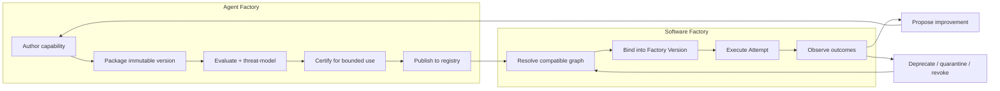
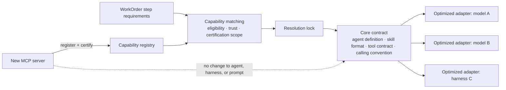
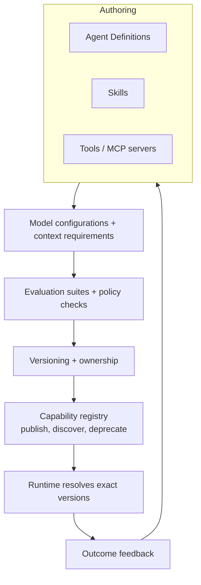
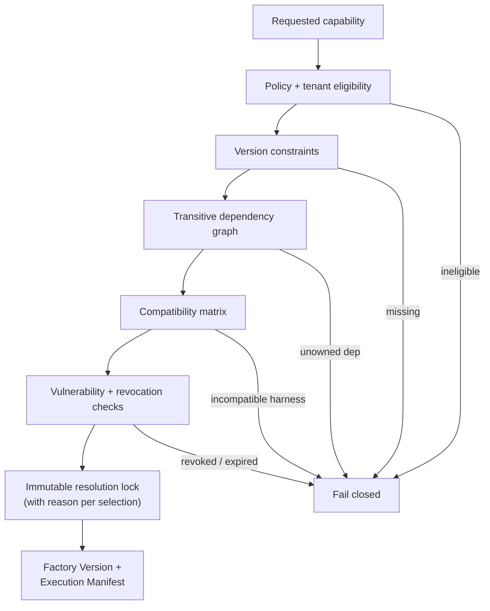
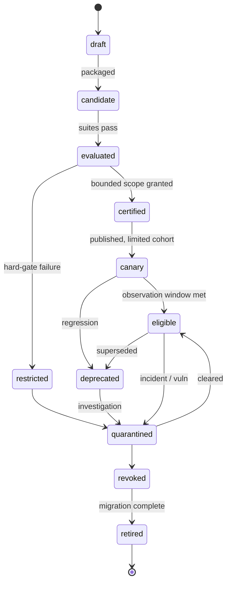
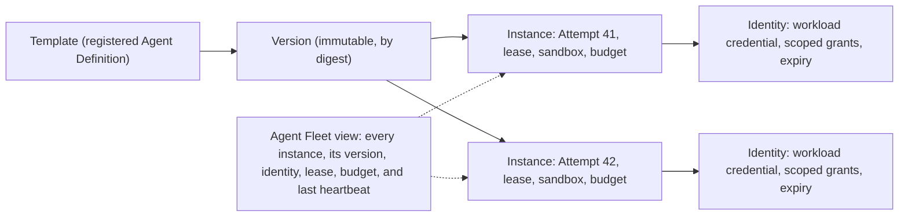

# 11. The Agent Factory

The Software Factory executes delivery work; the Agent Factory supplies the governed capabilities it executes with. This chapter defines that supply chain: identity, packaging, resolution, compatibility, certification, promotion, revocation, and runtime binding. After reading it you should be able to design a registry that fails closed and trace any Attempt back to the exact capability versions it used.

## The problem

Most organizations manage agent capabilities as loose prompt files, copied scripts, tool connections in someone's config, and undocumented model settings. The same agent name resolves to different instructions, permissions, tools, and evaluation results in different repositories. When an incident happens, nobody can say which version ran, who owns it, what it was allowed to access, whether it was compatible with the current harness, or how to turn it off.

Two failure classes follow. Teams duplicate behavior and learn the same lesson repeatedly. And a convenient capability quietly becomes production infrastructure without any of the controls applied to code, packages, identities, or deployment artifacts.

One developer-tooling founder, in a public practitioner talk, describes the ladder most teams climb: individual engineers collect skills; then someone starts doing **harness engineering**, building the loops that automate and improve agent work; then the team realizes that everyone has become an internal tool builder and the thing they are building is a software factory. At every rung the same question appears: where do the skills live, who owns them, which version is running, and how do we know they still work? His answer, and this chapter's, is that a skills registry with publication controls, security and quality review, and versioning is part of the control plane, not an afterthought. David Andre's open-sourced skills repository, used across Codex, Claude Code, and two smaller open-source harnesses, shows the same pressure from the individual side: forty-two skills is already a supply chain, and without discipline it degrades into forty-two ways to be surprised.

## How it works

### Two factories, one boundary

The Agent Factory and the Software Factory are separate for a reason. The Agent Factory authors, packages, evaluates, certifies, and publishes. The Software Factory resolves exact approved versions and executes authorized delivery work with them. Publication never authorizes delivery; a certified skill is eligible to be used, not permitted to do anything in particular. Authority for work comes from a WorkOrder and a policy decision (see [Chapter 7](../02-design/07-governance-policy-and-risk-proportional-approval.md)), never from the capability itself.

The analogy is an aircraft parts supplier and an airline. The supplier manufactures, tests, certifies, and serial-numbers each part. The airline installs exact serial-numbered parts, records which aircraft carries which, and grounds every aircraft carrying a part when the supplier issues a recall. The supplier does not decide where the aircraft flies. That is the shape of the relationship.

<!-- infographic: capability-supply-chain -->
> **Infographic — Capability supply chain.** *(Jay's graphic goes here.)* Until then, the diagram below carries the same concept.



### What counts as a capability

The Agent Factory manages several capability types that share one envelope and keep type-specific contracts:

- **Agent definitions**: versioned descriptions of an agent's role, instructions, capabilities, policies, goals, permissions, tool access, model configuration, autonomy level, escalation rules, and success criteria. An agent definition composes several other capabilities; the next subsection treats it in full.
- **Skills**: reusable instructions and capabilities for a specific task. Coding, testing, debugging, deployment, security, repository, organization-specific, and workflow skills are the common families. A skill may compose tools (**tool composition**), carries decision criteria and examples, and is found by **skill discovery**, the process of determining which skill a task should use.
- **Tools**: APIs and capabilities agents call to act, commonly exposed through MCP. A tool needs executable schemas and side-effect declarations.
- **Prompts**: parameterized instruction fragments with parameter and output contracts.
- **Model profiles**: which models and configurations are appropriate for a capability (see [Chapter 21](./21-models-and-capability-selection.md)).
- **Evaluators**, **context packages**, and **workflow recipes**.

### The capability envelope

Every registered capability, whatever its type, carries the same identity model:

- a stable identity, type, owner, source, license, and support tier;
- an immutable version and digest;
- declared inputs, outputs, side effects, permissions, and data classifications;
- dependencies on tools, protocols, models, runtimes, policies, and other capabilities;
- evaluation suites, results, limitations, and known failure modes;
- compatibility ranges and qualified environment combinations;
- a lifecycle state and a trust level; and
- provenance from source revision through package and signature.

Three of those fields deserve names because operators ask about them constantly. **Compatibility metadata** is the declared set of harness versions, model profiles, runtimes, and peer capabilities a version has been tested with, and it is only as good as the conformance suite behind it. **Version lineage** is the recorded chain from one version to its predecessors and successors, with the reason each was cut, so that an operator can see what changed between the version that ran last month and the one that runs today. **Trust level** is the standing the capability has earned (internal and certified, external and reviewed, or external and unreviewed, for instance), and it sets a ceiling on the risk classes and autonomy levels in which the capability may be resolved.

One universal schema is tempting and would flatten real differences between a tool and an agent. Use the shared envelope plus type-specific manifests, and avoid a single quality score: eligibility is multidimensional and risk-specific.

### The Agent Definition is a contract, not a prompt

Most teams' first "agent" is a system prompt plus a model name. That is enough for a demo and not enough for anything an enterprise has to operate, because neither half tells you what the agent is for, what it may touch, when it must stop, or how you would know it had regressed. An **Agent Definition** is a versioned capability contract. The model may change underneath it; the contract stays stable, which is what lets you swap a provider without renegotiating what the agent is allowed to do.

*An enterprise agent needs a contract, not just a prompt.*

The full field list:

| Field | What it fixes |
|---|---|
| Purpose and supported task classes | What the agent is for, and what it is not for |
| Model capability requirements | The reasoning, coding, context, and tool-use level needed, never a vendor name ([Chapter 21](./21-models-and-capability-selection.md)) |
| Instructions | The behavioral guidance, versioned like code |
| Available skills | Which reusable behaviors it may invoke |
| Allowed tools | What it may act with, and therefore what authority it can ever exercise |
| Context requirements | What it needs to see, and from where |
| Data and security eligibility | Which classifications and boundaries it is approved for |
| Budgets and stopping conditions | Tokens, spend, tool calls, time, retries, and the objective conditions that end a run |
| Evaluation suite | How its behavior is measured and regression-tested |
| Observability requirements | What must be traced for the run to be debuggable |
| Owner and version | Who answers for it, and which exact revision ran |

Read the table against the capability envelope above and you will see that the Agent Definition is simply the envelope filled in for the agent type, with instructions and skills as its distinctive content. What matters is that every row is explicit. An agent whose allowed tools are "whatever the harness exposes" has no contract; an agent whose stopping conditions are "until the model thinks it is done" has no budget.

### Agent, skill, tool, model, harness, factory

Six words get used interchangeably and mean different things. The distinction is worth pinning because each one is owned, versioned, and governed differently.

| Term | What it does | Owned by |
|---|---|---|
| **Model** | Provides reasoning and generation | Model layer, behind the gateway and router |
| **Agent** | Combines reasoning with an objective, instructions, context, tools, skills, policy, and evaluation | Agent Factory, as a versioned Agent Definition |
| **Skill** | Packages reusable behavior or expertise that an agent invokes | Agent Factory, as a versioned package |
| **Tool** | Performs an action or retrieves information | Tool registry and gateway |
| **Harness** | Controls execution: the loop, state, budgets, permissions, recovery ([Chapter 15](./15-coding-harnesses-and-agent-protocols.md)) | Runtime |
| **Factory** | Governs how all of the above compose into trusted work | Control plane |

*The model thinks. The tool acts. The skill packages reusable behavior. The harness controls execution.* And the factory decides what any of them is permitted to do.

### Where behavior belongs: rules, knowledge, and disposition

Before authoring anything, decide where a behavior should live, because the Agent Factory offers three places to put it and they are not interchangeable. The governing rule is that *repository- or domain-specific behavior does not belong inside the model*. A model that has been taught one team's conventions is a model that cannot be swapped, cannot be shared with the next team, and cannot be told the convention changed last week. The three-way rule that follows:

| Kind of behavior | Where it lives | Why |
|---|---|---|
| Known rules ("never force-push", "every endpoint has a contract test", "this path needs a security reviewer") | **Deterministic systems**: linters, policy engines, rules engines, pre-tool-call hooks, tests | A rule the organization can state is a rule software can check; spending inference on it adds cost and variance and removes proof |
| Dynamic knowledge (this repository's architecture, last quarter's incidents, the current API, the reviewer's recent comments) | **Retrieval and skills**: context packages, the retrieval pipeline of [Chapter 19](./19-data-knowledge-and-semantic-engineering.md), versioned skills | It changes faster than any training cycle and must carry provenance and permissions |
| Stable behavior (house style of explanation, a consistently preferred refactoring shape, tone and structure of findings that have not changed in a year) | **Fine-tuning** or preference optimization, last and rarely | Only behavior that is stable, measured, and general enough to survive the next model change earns a place in weights |

*Deterministic systems for known rules, retrieval and skills for dynamic knowledge, fine-tuning for stable behavior.* Read from the top down: reach for the model's weights only when the first two rows have been tried and the behavior has been shown stable enough to freeze ([Chapter 40](../06-improve/40-governed-learning.md) covers when training is warranted at all). The maturity lifecycle later in this chapter is the same rule applied over time: behavior migrates *down* the table toward determinism as it stabilizes, never up toward the model.

One consequence is that a great deal of work should never reach a model at all. **Deterministic preprocessing** runs before any agent is invoked: static analysis, linting, type checking, security scanning, the existing test suite, policy checks, a rules engine over the change, change classification, and dependency analysis. Their outputs are facts with zero variance, and they do two jobs: they settle what software can settle, and they shape what remains into a smaller, better-classified task for whichever capability handles the residue. The router in [Chapter 21](./21-models-and-capability-selection.md) formalizes the sequence as an escalation ladder from deterministic automation through cheap, specialized, and frontier models; the Agent Factory's part is to package the deterministic steps as first-class capabilities with the same envelope, versioning, and certification as any skill, so that "run the linter first" is a resolved, recorded dependency rather than a habit.

### Capability matching, adapters, and extensibility

Three mechanisms connect a task to the capabilities in the registry, and each is a contract of its own.

**Capability matching** is the step that turns a task's requirements into a set of eligible capabilities. A WorkOrder step declares what it needs: task class, risk tier, repository and data classification, required tool effects, model capability level, and the evidence it must produce. The registry answers with the capabilities whose declared purpose, eligibility, trust level, and certification scope cover those requirements; the resolver then locks exact versions. Matching is recorded with the reason each capability was chosen and each near-miss rejected, so that an operator can later answer why the migration skill ran and the refactoring skill did not. Matching never widens authority: a capability that matches is eligible, and the WorkOrder's policy decision still governs whether it may act.

**Tool extensibility** is how the set of things an agent can do grows without touching the agent. A new tool is a new contract registered behind the gateway, usually as an MCP server with executable schemas and side-effect declarations, certified for a bounded scope, and made discoverable to the agents whose scope it fits. The Agent Definition does not change, the harness does not change, and no prompt is edited to mention the tool by name. Extension happens at the registry and the gateway, which is the only arrangement in which adding a tool is a governed release rather than a surprise, and removing one is a revocation rather than a search.

**Model adapters** are the third mechanism, and they answer a question that grows louder as the factory serves more models: how much should be standardized, and how much tuned per model? The rule is *standardize the core contract; optimize adapters at the edge.* The core contract is one: one Agent Definition format, one skill package format, one tool invocation contract, one calling convention for messages, tools, structured output, and cancellation. Every workflow, skill, and evaluator is written against it. Then, at the edge where the contract meets a specific model or harness, an **optimized adapter** absorbs the differences that matter for quality: the instruction phrasing one model follows better, the tool-schema fidelity another needs coaxing on, structured-output repair for a profile that returns loose JSON, the `CLAUDE.md` versus `AGENTS.md` instruction-file split, prompt-cache placement, and reasoning-effort defaults. Adapters are versioned, evaluated, and owned like any capability, and they are measured by one question: does the same skill on this model, through this adapter, meet the workload quality floor? If a behavior can only be achieved by editing the skill for one model, the adapter is missing; if an adapter has grown its own instructions and tools, the contract has leaked to the edge.



Three skill families deserve names because they recur in every factory and are governed slightly differently. **Code-review skills** package one class of review judgment (a security pattern, a migration safety check, an API-compatibility rule) scoped to a glob of files, with a rubric, examples, and evaluation cases; the **specialized reviewers** of [Chapter 39](../06-improve/39-production-feedback-review-and-the-agentic-merge-queue.md) are compositions of them, and the verifiers of [Chapter 15](./15-coding-harnesses-and-agent-protocols.md) are their smallest form. **Policy skills** encode an organizational rule as a checkable procedure with the hard limit enforced by a hook rather than by prose, so the skill explains and the hook refuses. And the wider class of **reusable artifacts** is everything the factory can hand from one team to another with a version and an owner: skills, agent definitions, context packages, evaluators, workflow recipes, adapters, and the deterministic preprocessing steps above. The contribution model later in this chapter is about who authors each; the point here is that all of them share the envelope, which is what lets a review skill written for one product be matched, resolved, and certified for another.

### The Agent Factory's generic architecture

Strip away product names and every Agent Factory has the same shape. Authors produce agent definitions, skills, and tools. Those are bound to model configurations, evaluated against suites and checked against policy, assigned explicit versions, published to a capability registry that supports discovery and deprecation, and consumed by a runtime that resolves exact versions before it executes. Feedback from the runtime flows back to the authors.

<!-- infographic: agent-factory-architecture -->
> **Infographic — The Agent Factory's architecture.** *(Jay's graphic goes here.)* Until then, the diagram below carries the same concept.



The registry in the middle is the authority surface, and the rest of this chapter is about making each arrow a contract rather than a convention.

### Catalog versus registry

A searchable list is a **catalog**. It is optimized for people and agents to find things, using natural language, tags, domains, and examples. A **registry** is optimized for authoritative resolution: it owns canonical identity, immutable versions, provenance, dependencies, eligibility, lifecycle status, and policy-enforced resolution. The word "registry" gets applied too early. If it cannot tell you the exact digest that will run, whether it is still certified, and who can revoke it, it is a catalog.

In practice the registry is several type-specific registries behind one publication contract. The **Skill Registry** holds reusable, evaluated task methods with their versions, dependencies, required tools, compatibility, ownership, and lifecycle; publication there does not grant permission to use a skill for a particular WorkOrder. The **Prompt Registry** holds parameterized prompt and instruction artifacts, including source, immutable versions, variables, expected outputs, dependencies, evaluation, and promotion status, so that runtime composition remains attributable to exact versions. The **Evaluator Registry** holds deterministic checks, human rubrics, model graders, datasets, calibration evidence, eligible claims, and lifecycle, with one standing rule: a registered evaluator cannot certify its own reliability.

A central registry improves consistency and revocation and can become a bottleneck. Federated authoring with centrally enforced publication contracts usually preserves team autonomy while keeping common controls; the contribution model under "How to build it" says which side of the line each responsibility falls on. Small organizations can begin with signed manifests in source control, provided runtime resolution and lifecycle state remain authoritative; a shared Git repository of skills, which is where that founder's team and David Andre both started, is a fine catalog and becomes a registry only when it gains those properties.

### Packaging and the manifest

A **capability package** is the smallest independently governed unit. It contains a manifest, source or content, schemas, tests, evaluation references, provenance, and a signature. It is immutable after publication; a correction creates a new version. The manifest separates six contracts:

- **identity**: canonical name, type, owner, source, digest;
- **behavioral contract**: purpose, inputs, outputs, side effects, failure modes;
- **operating contract**: runtime, harness, model, environment, network, storage;
- **authority requirements**: scopes, credentials, approvals, data classes;
- **quality contract**: required tests, evaluations, thresholds, limitations; and
- **lifecycle contract**: support window, deprecation, migration, revocation.

Bundling everything into one artifact improves reproducibility and creates large release units; fine-grained packages increase reuse and dependency complexity. Choose package boundaries aligned to ownership, evaluation, and rollback.

### Versioning on behavior, not filenames

An agent run is not reproducible when its "version" identifies only a prompt or a model name. Behavior depends on instructions, tool schemas, skill content, context policy, harness features, runtime image, model route, permissions, and evaluator. Reproducibility is a graph property: pinning the model while leaving tools, prompt fragments, skills, or runtime images mutable produces a precise-looking identifier for an imprecise system.

The pieces that change independently, and therefore each need an explicit version, are the Agent Definition, the skill, the model configuration, the tool contract, the evaluation set, the context policy, and the runtime itself. None of them may mutate silently. The reason goes beyond reproducibility: a factory is a learning system, and it improves by proposing changes to exactly these pieces. *You can't operate a learning system safely if you can't reconstruct which version learned what.*

Version on material behavior. A **major** change breaks consumers or widens authority. A **minor** change adds backward-compatible behavior or eligibility. A **patch** corrects behavior without changing the declared contract. Because prompts and models are behavioral dependencies, a seemingly small text or provider change may require new evaluation and a new digest. Input widening may be compatible; changed defaults, permissions, side effects, destinations, or error meaning are breaking changes even when the JSON schema is unchanged. Semantic versioning is useful only when compatibility is tested.

### Resolution before execution

**Resolution** converts ranges, aliases, policies, and environment constraints into an immutable graph called a **resolution lock**. Execution receives the lock; it does not discover a materially different graph mid-Attempt. "Latest" is not a reproducible execution binding.



The resolver evaluates the whole dependency graph and fails closed. It rejects missing versions, revoked transitive dependencies, incompatible harness features, unapproved data access, expired certification, and ambiguous ownership. The lock records transitive dependencies and the reason each version was selected, and its digest connects the registry to runtime telemetry and evidence. Strict locks reduce drift but slow emergency provider substitution; prequalify bounded fallback graphs and record when a fallback changes the execution identity. Broad version ranges ease upgrades and increase the chance the same workflow behaves differently over time.

Compatibility is relational. A tool can be valid alone and unsafe with a particular agent's permission set. A model may support tool calling and still fail one workflow's structured-output or context requirements. So test combinations, not labels: a **conformance suite** exercises tool discovery, schema validation, permission denial, cancellation, timeout, streaming, artifact capture, structured completion, and teardown against the exact combination. A compatibility declaration without a passing suite is an assertion, not evidence.

### The lifecycle

<!-- infographic: capability-lifecycle -->
> **Infographic — Capability lifecycle.** *(Jay's graphic goes here.)* Until then, the diagram below carries the same concept.



The states, in order: **draft**, **candidate** (packaged), **evaluated**, **certified**, **canary**, **generally eligible** (published and active), with side exits to **restricted**, **deprecated**, **quarantined**, **revoked**, and **retired**. Read as verbs, the whole lifecycle is: author, package, test, certify, publish, discover, activate, upgrade, deprecate, revoke. Two of those verbs happen on the consuming side rather than in the registry. To **activate** a capability is for a workspace or Factory Version to bind a specific certified version into its resolved graph, which is when publication becomes permission to run; to **upgrade** is to rebind to a newer version, which is a new resolution with its own compatibility check and, for a major version, its own approval. Every transition names its authority, scope, evidence, conditions, expiration, and rollback.

The four retirement states mean different things. **Deprecation** warns and provides migration. **Quarantine** stops use while facts are investigated. **Revocation** blocks new resolution immediately and may cancel or isolate active work according to risk. **Retirement** removes discoverability after migration while preserving historical resolution and evidence, so that an Attempt from last year still explains what it ran.

### Agent Runtime Management: templates, versions, instances, identities

The lifecycle above governs the *definition* of an agent. Something still has to govern the agents that are actually running, and the two are different objects the way a class and its instances are. **Agent Runtime Management (ARM)** is the layer that keeps them apart and keeps each one accountable. It manages four things:

| Object | What it is | What it answers |
| --- | --- | --- |
| Template | A registered Agent Definition eligible to be instantiated: role, instructions, skills, tools, model requirements, budgets, stopping conditions | What kinds of agent may exist here? |
| Version | An immutable revision of a template, by digest | Which exact definition is this instance running? |
| Instance | One running agent, bound to a version, an Attempt, a lease, a sandbox, and a budget | What is running right now, on whose authority, and for how long? |
| Identity | The workload identity the instance authenticates as, with its short-lived credentials and scoped grants | Which principal did this call come from, and what was it allowed? |

<!-- infographic: agent-runtime-management -->
> **Infographic — Agent Runtime Management.** *(Jay's graphic goes here.)* Until then, the diagram below carries the same concept.



The rule ARM enforces is that an instance is never more than its version and its identity allow. An instance cannot upgrade itself to a newer version mid-run (that is a new Attempt), cannot acquire an identity broader than the one issued for its lease, and cannot outlive its lease or its budget. When a version is quarantined or revoked in the registry, ARM is the component that can answer "which instances are running it now?" and stop them, which is the runtime half of the revocation propagation the registry promises.

The operator's window onto ARM is the **Agent Fleet** view: every running instance with its template, version, identity, Attempt, lease state, budget consumed, last heartbeat, and the action available on it (pause, drain, kill). It is the fleet-management surface that every team running more than a handful of agents ends up building, and building it on ARM's four objects rather than on a list of processes is what makes it say something true when a process has died and its lease has not yet expired. ARM is the harness-engineering surface's operational half; the definitional half is the registry above.

### Evaluation, certification, promotion

These are three different decisions that lightweight systems compress into one "enabled" flag. **Evaluation** measures behavior under defined conditions. **Certification** converts evidence into eligibility for a bounded scope. **Promotion** changes which users or workflows may resolve the capability.

Evaluation covers four dimensions:

1. **Functional**: task success, correctness, structured outputs, recovery, determinism where required.
2. **Operational**: latency, cost, rate limits, cancellation, observability, failure containment, resource cleanup.
3. **Security and policy**: least privilege, prompt and tool abuse, data handling, provenance, dependency risk.
4. **Human factors**: understandable plans, useful progress, actionable escalation, review burden, accessibility.

Results attach to exact package and environment digests, and aggregate scores must not hide hard-gate failures.

Certification is not a trophy attached to an agent. It is a temporary, scoped statement that a particular capability graph has sufficient evidence for particular use under particular controls. It names eligible task classes, risk levels, repositories or domains, environments, model and harness combinations, data classifications, and required human gates. A capability may be certified for read-only repository analysis and remain ineligible for code modification.

Certification expires, because capabilities have several clocks: source age, evaluation age, dependency age, policy age, threat intelligence, and observed production performance. Use risk-based expiration plus event-triggered reevaluation when a dependency, model, permission, policy, or threat changes. Frequent recertification improves freshness and consumes evaluation capacity, so tie frequency to risk.

Promotion is progressive: canary cohorts, observation windows, explicit stop conditions, and comparison against a frozen baseline using accepted outcomes rather than model-judge scores alone. Automatic demotion contains harm quickly; automatic promotion risks scaling a biased result. Keep promotion human-authorized for material scope increases.

### Tools, integrations, and the complete contract

A tool schema describes data shape. A complete capability contract also defines authority, side effects, failure, cost, evidence, and lifecycle. The capability owner defines purpose, interface, security, side effects, service behavior, evidence, compatibility, and lifecycle. The registry owns identity and discoverability. The gateway enforces runtime policy. The orchestrator composes calls. The capability cannot approve its own use, expand its scope, or declare workflow acceptance.

A complete contract, for a tool that publishes a pull request:

```yaml
capability:
  id: tool:pull-request-publish
  version: 6.1.0
  kind: tool
  owner: team:developer-platform
  lifecycle: certified
  purpose: "Publish a review request for an existing branch"
  non_purpose: [merge, deploy, change-branch-content]
  input_schema: schema:publish-pr-input@3
  output_schema: schema:publish-pr-result@2
  error_schema: schema:capability-error@4
  authn: workload-identity
  authz: policy:repository-publication@5
  resource_scope: [repository, branch]
  tenant_scope: caller-tenant
  data_classes: [internal, confidential]
  destinations: [approved-source-provider]
  side_effect: publication
  reversible_by: tool:pull-request-close@2
  idempotency: caller-key-required
  timeout: PT20S
  retry: reconcile-before-retry
  rate_limit: 30/minute/installation
  concurrency_key: repository
  audit: full-request-metadata-redacted-body
  evidence: external-object-receipt
  availability_slo: 99.9%
  cost_profile: external-api
  certification_suite: suite:publish-pr@8
  deprecation_notice: P90D
  revocation_handle: capability-version
```

**Integrations** (capabilities backed by an external provider) additionally declare provider ownership, tenancy mapping, credential exchange, data-use terms, residency, incident notification, rate behavior, a reconciliation API, and an exit procedure.

Prefer narrow, atomic primitives with explicit receipts. A broad integration reduces call count and hides policy and partial effects; atomic tools improve composition and evidence and add orchestration overhead. Use atomic effects for consequential work and curated skills for reusable decision procedures.

### Side effects and reversibility

Classify every capability by its highest-consequence effect, and split mixed-purpose capabilities when that improves policy or recovery.

| Class | Meaning | Minimum control |
|---|---|---|
| Read only | Observes without intended mutation | Scoped identity, classification, audit |
| Reversible mutation | Changes state with tested compensation | Idempotency, precondition, receipt, rollback test |
| Publication | Makes information visible or starts external review | Named destination, content digest, human/policy gate |
| Deployment | Changes an executing environment | Exact artifact, progressive rollout, rollback, production verification |
| Destructive mutation | Deletes or irreversibly transforms state | Explicit exception, dual control, backup or accepted irreversibility |
| Privileged administration | Changes identity, policy, secrets, access, or platform control | Strong identity, least privilege, dual control, emergency revocation |
| External communication | Sends content to a person or third party | Approved recipient, privacy and disclosure check, message receipt |

### The invocation contract

The caller proposes a call with capability and version, subject, input digest, resource, tenant, purpose, expected side effect, idempotency key, deadline, and grant. The gateway validates discovery status, certification, schema, authorization, data class, destination, budget, concurrency, and revocation. The result carries status, exact output, effect receipt, dependency version, duration, usage and cost, retry classification, redactions, and an audit reference.

A timeout means the result is unknown unless the contract guarantees no effect after timeout. Reconcile through the provider using the idempotency key or external receipt before retrying.

Errors are `invalid_input`, `unauthorized`, `policy_denied`, `conflict`, `rate_limited`, `transient_unavailable`, `unknown_result`, `permanent_failure`, and `revoked`. Each declares retryability, minimum delay, safe retry condition, and whether compensation or human action is required. Backoff is bounded and jittered. Circuit breaking is per dependency and operation class. Safety and containment calls receive reserved capacity so a saturated dependency cannot block a shutdown (the reliability vocabulary is in [Chapter 14](./14-durable-execution.md)).

### Observability, evidence, and privacy

Record caller and workload identity, grant and policy decision, capability version, sanitized inputs and outputs or their digests, resource, tenant, side-effect class, external receipt, latency, cost, error, retry, and correlation. Never place secrets or unrestricted content in metrics or ordinary logs. Evidence requires provenance, subject binding, independence where applicable, and tamper protection; an invocation log alone is telemetry, not evidence ([Chapter 27](../04-prove/27-quality-and-evidence-architecture.md)).

### Performance and compatibility declarations

Declare latency percentiles, throughput, concurrency, payload limits, availability, dependency and region constraints, and cost units. These are part of the operating contract and are tested by the certification suite, not asserted.

## How to build it

### Stand up the registry

1. Adopt the shared envelope for every capability type, with type-specific manifests for agent definitions, skills, tools, prompts, model profiles, evaluators, context packages, and workflow recipes.
2. Start with signed manifests in a shared repository if you must, but make lifecycle state and runtime resolution authoritative from day one. A catalog that cannot answer "what exact digest runs, is it still certified, who revokes it" is not yet a registry.
3. Build the resolver to fail closed on missing versions, revoked transitive dependencies, incompatible harness features, unapproved data access, expired certification, and ambiguous ownership.
4. Emit a resolution lock per Attempt, with reasons, and bind its digest into the Factory Version and Execution Manifest ([Chapter 5](../02-design/05-authoritative-records.md)).
5. Maintain an active-use inventory: which Factory Versions resolve which capability versions. Revocation is useless without it.

### Package and version a capability

1. Put manifest, content, schemas, tests, evaluation references, provenance, and signature in one immutable package.
2. Fill all six manifest contracts: identity, behavioral, operating, authority, quality, lifecycle.
3. Decide the version bump by material behavior, and treat prompt text and model route as behavioral dependencies.
4. Run the conformance suite against the combinations you claim compatibility with, and record results against exact digests.

### Certify, promote, retire

The certification suite for a tool tests schemas, authorization negatives, tenant isolation, side effects, idempotency, timeouts, unknown results, rate limits, concurrency, cost, redaction, observability, dependency outage, rollback, and revocation. Material changes produce a new version and reevaluation. Revocation immediately blocks new resolution and triggers affected-run and evidence analysis.

1. Evaluate on all four dimensions against frozen digests.
2. Issue a certification object naming scope, conditions, expiry, and rollback.
3. Promote through a canary cohort with stop conditions and a frozen baseline; require human authorization for material scope increases.
4. Schedule recertification by risk and trigger it on dependency, model, permission, policy, or threat change.
5. Retire in order: deprecate with migration, quarantine on doubt, revoke on confirmed risk, retire after migration, never delete history.

### Review checklist

- Can an operator traverse from any Attempt to the resolved graph, source, owner, policy, evaluations, vulnerabilities, compatibility results, and later revocations?
- Do agents discover only capabilities eligible for their scope?
- Does a revoked component block new resolution and name every active Factory Version needing remediation?
- Is every certification scoped, dated, and expiring?
- Does every consequential tool have an idempotency key, a receipt, a reversibility declaration, and a tested rollback?
- Are guardrails enforced programmatically?
- Does every Agent Definition fill in all eleven contract fields, with stopping conditions and allowed tools stated rather than inherited?
- Is each of the seven independently changing pieces (definition, skill, model configuration, tool contract, evaluation set, context policy, runtime) versioned explicitly?
- Can a product team publish a domain skill without a platform-team ticket, and can the platform team revoke it without a product-team ticket?

## Failure modes

**The name that resolves to anything.** "The review agent" means different instructions in different repositories. Detect it by asking for the digest; if there is none, you have a catalog. Fix it with the envelope, immutable versions, and resolution locks.

**Latest as a binding.** A workflow's behavior changes overnight because a dependency moved. Detect it when two Attempts with the same Factory Version behave differently. Fix by resolving before execution and locking transitive dependencies.

**The precise-looking identifier.** The model is pinned, the skill text is not. Detect it by diffing the resolved graph across runs, not just the model route. Fix by versioning every behavioral dependency.

**Compatibility by assertion.** The manifest says the tool works with the harness; nobody ran the suite. Detect it at the first cancellation, streaming, or teardown bug. Fix with conformance suites bound to digests.

**The single enabled flag.** Evaluation, certification, and promotion are collapsed into one toggle, so a capability certified for read-only analysis is used to modify code. Detect it by asking what scope a certification names. Fix with a certification object and scoped eligibility.

**Certification that never expires.** A capability passed once, then repositories, models, dependencies, policies, and threats changed. Detect it with certification-age reporting. Fix with risk-based expiry and event-triggered reevaluation.

**Automatic promotion of a biased result.** A canary looks good on model-judge scores and scales. Detect it by comparing against accepted outcomes on a frozen baseline. Fix by keeping material scope increases human-authorized.

**The transitive zombie.** A deprecated tool stays active because a skill depends on it. Detect it with the active-use inventory and transitive resolution checks. Fix by propagating revocation through the graph and blocking new resolution.

**Retirement by deletion.** The skill file is removed; last year's Attempts can no longer explain what they ran. Detect it when an audit fails to reconstruct an Attempt. Fix by retiring without erasing: remove discoverability, preserve resolution and evidence.

**Guardrails in the prompt.** The agent is told never to force-push and does. Detect it in the tool-call log. Fix with a pre-tool-call hook with explicit block and allow lists.

**The unknown-result retry.** A publish call times out after the side effect happened; the retry publishes twice. Detect it in duplicate receipts. Fix with idempotency keys and reconcile-before-retry.

**The broad integration.** One call does five things and fails after the third. Detect it when compensation is impossible. Fix by splitting into atomic effects with receipts.

**The skill nobody can find or everybody must load.** Either discovery is so weak that skills are unused, or every skill is loaded into every prompt. Detect it in context size and skill-use telemetry. Fix with trigger criteria in the skill and relevance-based loading.

**The prompt that calls itself an agent.** A system prompt and a model name are registered as an "agent" with no stated task classes, tool list, budget, stopping conditions, or evaluation suite. Detect it by asking what the agent may not do. Fix by filling in the Agent Definition contract before publication.

**Reasoning that never retires.** A pattern the organization has solved a hundred times is still solved by a strong model from scratch every run, at full cost and full variance. Detect it in evaluation history that shows stable behavior alongside stable spend. Fix by capturing the pattern as a skill and moving its deterministic parts into scripts.

**The platform team that owns every skill.** Every domain capability waits on the central team, and the registry becomes a queue. Detect it in skill-publication lead time. Fix with the contribution model: central contracts, federated content.

**Skill drift across copies.** The same skill was pasted into twelve repositories; three have since been edited, and a bug fixed in one persists in the other eleven. Detect it with the skill inventory's duplicate and drift report. Fix by publishing one package to the registry and installing it by version everywhere, so a fix is a release, not a search.

**The unscored skill.** A skill is published because it exists, and nobody asked whether an agent can act on it. Detect it in skills that are installed but never loaded, or loaded and then ignored. Fix with a reviewer plugin and a quality threshold in CI before the skill enters evaluation.

**Install from anywhere.** An engineer installs a public skill from an unknown source because it looked useful, and it carries instructions the agent follows. Detect it in the install audit and the inventory's third-party classification. Fix with an install policy: source allowlist, severity threshold, minimum release age ([Chapter 33](../04-prove/33-security.md)).

**Behavior trained into the model.** A team's conventions are fine-tuned into a model, and the model can no longer be swapped, shared, or told the convention changed. Detect it when a rule change requires a training run. Fix with the three-way rule: deterministic systems for known rules, retrieval and skills for dynamic knowledge, fine-tuning only for stable behavior.

**Extension by prompt.** A new tool is added by editing the agent's instructions to mention it, so the tool has no contract, no certification, and no revocation handle. Detect it by listing the tools an agent uses that the registry does not know. Fix by registering the tool behind the gateway and letting matching expose it.

**The adapter that became the agent.** Model-specific tweaks accumulate instructions and tools of their own until the "adapter" is a second agent definition nobody versions. Detect it by diffing adapter content against the core contract. Fix by standardizing the core and confining adapters to phrasing, schema fidelity, output repair, and defaults.

**Inference spent on the deterministic.** Linting, type errors, and policy violations are discovered by the model rather than by the tools that already exist for them. Detect it in model findings that a static check would have produced. Fix with deterministic preprocessing packaged as certified capabilities that run before any agent.

**Skill without verifier.** A skill is certified on its own report of success and reaches high autonomy because it is well written. Detect it by asking what independently checks the skill's output; if the answer is the skill, nothing does. Fix by certifying skill → verifier pairs and setting autonomy by verification confidence.

**Six descriptions of one standard.** The coding agent, the reviewer, the CI job, the maintenance loop, the migration agent, and the IDE each carry their own text for the same rule, and each drifts alone. Detect it in the context inventory's duplicate and conflicting findings. Fix with skill-centric architecture: one package consumed from every point in the lifecycle.

**Registry mistaken for inventory.** The registry says version 3.2 is current; forty repositories run 2.7 and nobody knows. Detect it by scanning the fleet and diffing against the registry. Fix by running both, reconciling them, and treating every mismatch as skill drift with an owner.

**Upgrade without regression.** A newer skill version is installed everywhere because it is newer, and a repository whose conventions it no longer fits starts failing review. Detect it in acceptance rate by repository after the upgrade. Fix by regression-evaluating each upgrade against the skill's eval suite before installation.

**The eval nobody owns.** An evaluation written eighteen months ago is still the gate, and passing it no longer predicts an accepted outcome. Detect it in the eval registry: no owner, no last-validated date, no production correlation. Fix by treating evals as governed assets with expiry and review dates.

**A workflow per repository.** Every codebase has its own review workflow, written from scratch, and a fix to the review process is a hundred thousand edits. Detect it by counting workflows that share no canonical ancestor. Fix with canonical workflows specialised by layer: canonical, organisation, product, repository, task.

**Standards that live in one reviewer.** The same correction is made by hand on every third pull request and never becomes a skill, an eval, or a verifier. Detect it in review comments that repeat. Fix by mining history: extract the standard, codify the skill, generate the eval, generate the verifier, assign the reviewer as owner.

**Instances without versions.** Agents are running, and nobody can say which definition revision each one is on, so a revoked version cannot be stopped because it cannot be found. Detect it by asking the fleet view for the version digest of every running instance; fix by making every instance bind an immutable version and an issued identity, and by making the Agent Fleet view read from those bindings rather than from process lists.

## In Mission Control

At study commit [`d902fae`](https://github.com/jaydubya818/MissionControl/tree/d902fae7032c0696b531c44ae88829c652516fc6), Mission Control contains versioned agent records, skill discovery and linting, model routes, context packages, harness manifests, sandbox profiles, evaluation mechanisms, canaries, policy gates, promotion and demotion concepts, model-route lifecycle, and Factory Version bindings that freeze many material bindings in Factory Versions and Execution Manifests. Those are real components of an Agent Factory: **implemented**.

It does not yet demonstrate one canonical registry boundary with unified publication, dependency resolution, compatibility qualification, deprecation, quarantine, and revocation across every capability type; a single package format; a complete transitive lock; a universal compatibility suite; a migration mechanism spanning agents, skills, prompts, tools, and evaluators; a uniform certification object; or end-to-end revocation propagation. Exact skill-version binding and a complete promotion path are **partial**. Runtime substitutions therefore need explicit scrutiny rather than an assumption of parity.

The repository glossary and lexicon reviewed 2026-09-02 name Agent Runtime Management (templates, versions, instances, identities) and its Agent Fleet operator view, inside a harness-engineering surface that also carries change review, merge gates, mutation testing, and a seven-step code-review wizard. Those are named surfaces and contract vocabulary at the review date; `packages/agent-runtime/` holds agent lifecycle and heartbeat behaviour at the pinned commits, and the fleet view's evidence is whatever [Chapter 42](../06-improve/42-mission-control-as-a-living-case-study.md) pins, not a claim this chapter makes.

The intended boundary between the two systems is the one this chapter describes: the Agent Factory creates and manages reusable agents, skills, tools, model configurations, and evaluations, and plugs into Mission Control as a capability source, while Mission Control owns the Mission, Plan, WorkOrders, execution authority, verification, evidence, acceptance, and delivery. In Jay's words, the Agent Factory creates reusable intelligence; Mission Control governs how that intelligence becomes production work. That division is the design intent, not a claim that the two are separately deployed today.

The intended direction is a registry that continuously calculates certification freshness and affected-use inventory; that turns vulnerabilities, policy changes, drift, and incidents into bounded reevaluation or quarantine events; that lets operators preview blast radius, approve migrations, canary a new graph, and roll back instantly to the prior one; and that lets any Attempt be traversed to its full resolved graph. Promotion to "implemented" requires registry APIs, signed immutable manifests, policy tests, dependency-resolution tests, revocation propagation, tenant isolation, and evidence from live resolution and rollback drills: **future**. This chapter defines the operating contract; it does not claim the full registry exists in production, and it does not certify any particular tool, protocol server, supplier, or registry product.

## Retain this

- The Agent Factory creates and governs reusable capabilities; the Software Factory binds qualified versions to delivery work.
- A capability envelope covers identity, interface, dependencies, provenance, compatibility, risk, evidence, lifecycle, and revocation—not just prompt text.
- Catalog is discovery; registry is authority. Resolution must produce an exact immutable version before execution.
- Certification expires, promotion is evidence-backed, and revocation must propagate to future resolution.
- Capability does not grant permission: the WorkOrder, policy, and runtime still decide what may execute.

## Go deeper

- [Chapter 2. The factory in one view](../01-understand/02-the-factory-in-one-view.md) for where the Agent Factory sits in the stack.
- [Chapter 5. Authoritative records](../02-design/05-authoritative-records.md) for Factory Versions and Execution Manifests.
- [Chapter 7. Governance, policy, and risk-proportional approval](../02-design/07-governance-policy-and-risk-proportional-approval.md).
- [Chapter 14. Durable execution](./14-durable-execution.md) for retries, backoff, and circuit breakers.
- [Chapter 15. Coding harnesses and agent protocols](./15-coding-harnesses-and-agent-protocols.md) for the harness features a capability declares compatibility with.
- [Chapter 18. Agent architecture](./18-agent-architecture.md) for MCP and tool calling.
- [Chapter 21. Models: routing, profiles, and capability selection](./21-models-and-capability-selection.md).
- [Chapter 29. Evaluation engineering](../04-prove/29-evaluation-engineering.md) for trace replay and run comparison.
- [Chapter 33. Security](../04-prove/33-security.md) for supply-chain provenance and attestation.
- [Chapter 40. Governed learning and compounding engineering](../06-improve/40-governed-learning.md) for how skills absorb the meta loop.
- The acceptance bar for an external capability, in one line: it must demonstrate negative authorization, duplicate invocation, timeout after a side effect, reconciliation, revocation, dependency change, recertification, and independent reconstruction of the resulting evidence before it is admitted.
- [Glossary](../appendix/glossary.md).
- Public practitioner talks, 2026: harness engineering as the discipline that ladders up to a software factory, and the skills registry as part of the control plane.
- Public practitioner talks, 2026: the skill as an executable unit of organisational knowledge, skill registry versus skill inventory, skill drift and its chain, skill-centric architecture, the skill → verifier pair and verification-driven autonomy, factory opinions, canonical workflows and workflow specialisation, the factory asset lifecycle, the eval registry, and historical behaviour mining.
- David Andre, walkthrough of his open-sourced agent skills repository across Codex, Claude Code, and two smaller open-source harnesses.
- Mission Control repository glossary and lexicon, reviewed 2026-09-02: Agent Runtime Management (templates, versions, instances, identities) and the Agent Fleet operator view.
- Tessl documentation (docs.tessl.io), 2026: skill packages, manifests and workspaces, registry install and update mechanics, typed skill schemas, the organization inventory, and reviewer plugins with score thresholds. The Agent Skills specification (agentskills.io) defines the skill folder format.
- Jay West, "Key terms and definitions" capability taxonomy: Agent Definitions, Skills Framework, and Agent Harness tool terms.
- Jay West, factory architecture notes: the Agent Definition contract, the agent/skill/tool/model/harness/factory distinction, the skill maturity lifecycle, versioning, the contribution model, the three-way rule for where behavior belongs, deterministic preprocessing, capability matching, tool extensibility, and model adapters at the edge.
- [Chapter 38. Enterprise adoption and the infrastructure landscape](../05-operate/38-enterprise-adoption-and-the-infrastructure-landscape.md) for the gravity-well adoption path and forward-deployed engineering.
- [NIST Secure Software Development Framework](https://csrc.nist.gov/pubs/sp/800/218/final); [SLSA specification](https://slsa.dev/spec/); [OCI Image Format](https://github.com/opencontainers/image-spec); [NIST AI Risk Management Framework resources](https://airc.nist.gov/).
