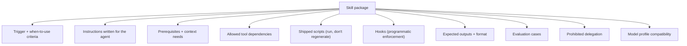
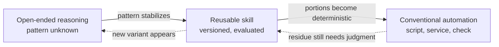
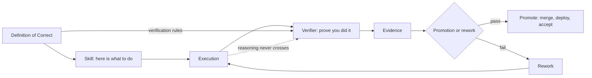
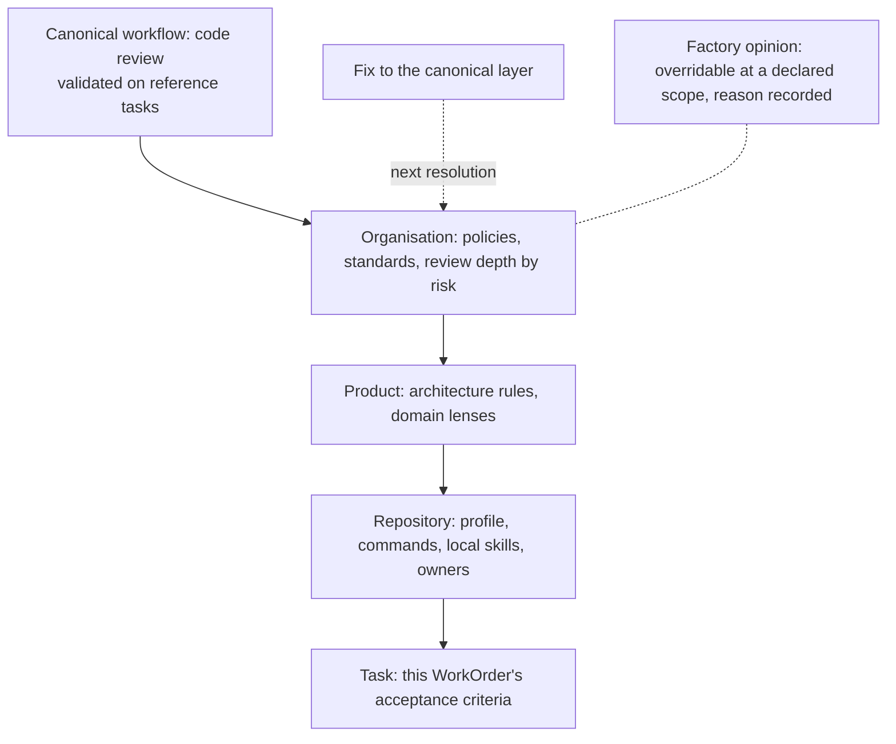
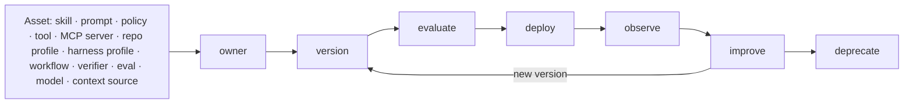

# 12. Skills as packages

A skill is useful only when it is more than copied prompt text. This chapter treats skills as versioned packages with owners, manifests, examples, evaluation, compatibility, promotion, and retirement—and pairs every consequential skill with the verifier that proves its behavior.

## The problem

Teams accumulate instructions faster than they can establish whether those instructions are current, safe, compatible, or useful. Without packaging and evaluation, a shared skill library becomes a larger context window full of conflicting advice. The corrective model is a capability lifecycle: reason first, package repeated behavior, and automate only when the steps stop varying.

## How it works

### What a good skill is

<!-- infographic: skill-anatomy -->
> **Infographic — Skill anatomy.** *(Jay's graphic goes here.)* Until then, the diagram below carries the same concept.

The taxonomy says a skill is reusable instructions and capabilities for a specific task. The contract reference says a skill additionally declares instructions, prerequisites, allowed tool dependencies, context needs, model profile compatibility, expected outputs, evaluation cases, and prohibited delegation. The practitioners fill in what that looks like when it works.

Put more plainly, a skill is a versioned reusable capability, not a prompt file. The package contains its purpose, instructions, required context, allowed tools, inputs and outputs, examples, policy, validation, an evaluation suite, an owner, and a version. The difference shows up the first time something goes wrong. Take a repository-migration skill: it has an owner who answers for it, a version that ran, known inputs and outputs, an explicit list of tools it may use, an evaluation history that shows how it has behaved across releases, and measurable behavior that can be compared against that history. A prompt file called `migrate.md` in someone's home directory has none of those, and when it drifts nobody finds out until a migration fails.

*A skill is a versioned capability, not just a prompt.*

Said at the level of the organisation rather than the package, a skill is *an executable unit of organisational knowledge, not merely a prompt*: a reusable, versioned definition of how work is performed or of what good looks like. Nine things get encoded in one, and a skill missing several of them is a note, not a skill: the workflow instructions (the steps, in order, with what to do when a step fails); the standards the output must meet; the policies it must not violate; the domain knowledge the agent would otherwise have to rediscover; the review criteria a reviewer will apply; the tools and MCP servers it may use; the hooks that enforce its hard limits; the expected outputs and their format; and the acceptance criteria that say when the work is done. Read against the skill anatomy above, the nine are what the boxes contain. Read against [Chapter 19](./19-data-knowledge-and-semantic-engineering.md), the standards, policies, review criteria, and acceptance criteria together are the skill's slice of the Definition of Correct, which is why a skill and its verifier can be built from the same source.

### The maturity lifecycle: reason, package, automate

Skills are also where reasoning gets progressively retired. When a team first meets a problem, the right tool is open-ended reasoning: nobody yet knows the pattern, so a strong model explores. As the pattern stabilizes, it gets captured as a reusable skill, so the next agent does not rediscover it. And once parts of the behavior become deterministic, those parts move out of the model entirely into conventional automation: a script, a service, a check. The skill shrinks to the residue that still needs judgment.

*Reason where reasoning creates value. Automate where behavior becomes deterministic.*

<!-- infographic: skill-maturity-lifecycle -->
> **Infographic — The maturity lifecycle of a capability.** *(Jay's graphic goes here.)* Until then, the diagram below carries the same concept.

This is the opposite of what most teams expect from an AI platform. A mature skills framework does not maximize how much the model does; it progressively reduces unnecessary reasoning. The best factory is not the one with the most AI in it. It is the one that keeps removing uncertainty from work that no longer needs it, and spends its reasoning budget where uncertainty remains. The maturity lifecycle also explains why the Agent Factory and the routing layer are so tightly coupled ([Chapter 21](./21-models-and-capability-selection.md)): one valid routing answer for a task is "no model at all, run the skill's script."

David Andre's lessons from running one skill set across four harnesses are concrete. Skills are written for agents, not for humans; they should be human-readable, but the agent is the primary user, and a strong model can review a skill for whether it is written well for agents. A skill loads only when the task is relevant, which is the point: it keeps the main system prompt small and the context window clean. Length is not quality; two of his most-used skills are the shortest in the repository, one being a single paragraph that asks the agent to list only the decisions it is unsure about, because reviewing decisions scales where reviewing thousands of lines does not. Ship scripts with the skill so the agent runs a tested script instead of regenerating it every time, which saves tokens and makes behavior predictable; his anti-sleep skill is a shell script plus instructions on how to verify it is running. When the skill guides a multi-step process, have it restate the remaining steps on every turn so a question about step three does not lose steps four through nine. And the lesson that matters most for governance: guardrails belong in a pre-tool-call hook that blocks dangerous patterns programmatically, with explicit lists of what must be blocked and what must be allowed, because putting them in the prompt and hoping is not strong enough.

The same practitioner talk adds the organizational side. A skill should codify a workflow, so that any repeated task (the weekly flaky-test hunt, the playbook for adding a command to the CLI) can be turned into a skill, published to the registry, and launched as an automated workflow in a sandbox with the right permissions. The registry scans each published workflow for security and quality and measures how much it actually improves agent output. The meta loop then feeds mistakes back into skills: the agent made this error, update the playbook so it does not happen again. Skills are where the factory's learning is stored, which is why they need the lifecycle above (see [Chapter 40](../06-improve/40-governed-learning.md)).

### Skill-centric architecture and the skill → verifier pair

The maturity lifecycle says what happens to a skill over time. A second question is how many places consume it, and the answer decides whether the factory has skills or silos. In a **skill-centric architecture** the skill is the reusable artifact and every loop is an execution mechanism around it. The same security-review skill is loaded by the developer's coding agent while it writes, by the code-review agent at the pull request, by the CI job that gates the merge, by the nightly maintenance loop that sweeps existing code, by the migration agent that rewrites a module, and by the engineer's IDE assistant. One package, one version, one owner, six consumers. The alternative, which most organisations reach by accident, is six separately written descriptions of the same standard, each drifting on its own schedule, each right about something the others are wrong about. Consuming one skill from every point in the lifecycle is also what makes context shift-left ([Chapter 19](./19-data-knowledge-and-semantic-engineering.md)) cheap: the standard reaches the producer for free because the producer loads the same skill the reviewer does.

A skill says "here is what to do." It does not prove that it was done, and a factory that trusts a skill's own report of its success has a self-grading agent. So every skill that matters is paired with a **verifier**: a focused mechanism that independently determines whether an execution or its output satisfies a correctness criterion. Verifiers come in several kinds, and the kind is chosen by the claim: deterministic (a script that checks a property), rule-based, test-based, static-analysis, policy-based, model-as-judge, or hybrid. They inspect actions, logs, artifacts, code, tests, and output; they do not inspect the producer's reasoning, which is the context firewall of [Chapter 19](./19-data-knowledge-and-semantic-engineering.md). The smallest verifiers are the one-invariant lint rules of [Chapter 26](./26-autonomous-engineering-workflows.md); the largest are the independent validation of [Chapter 27](../04-prove/27-quality-and-evidence-architecture.md). The **skill → verifier pair** is the unit of trust: the skill says what to do, the verifier says prove you did it, and the chain that connects them runs from definition to decision.

<!-- infographic: skill-verifier-chain -->
> **Infographic — From Definition of Correct to promotion.** *(Jay's graphic goes here.)* Until then, the diagram below carries the same concept.

The pair also settles how much autonomy a skill may earn. **Verification-driven autonomy** turns the usual question around: instead of asking how capable the agent is, ask *what can we independently verify well enough to safely automate?* A strong verifier permits high autonomy for the skill it verifies; a weak or absent verifier means the skill's output goes to a human, however good the skill is. That is the mechanism behind the risk-proportional levels of [Chapter 7](../02-design/07-governance-policy-and-risk-proportional-approval.md), and it is why the Agent Factory certifies pairs rather than skills. A skill certified without its verifier has been certified to produce, not to be trusted.

### Factory opinions, canonical workflows, and workflow specialisation

Between a rigid workflow that cannot handle a variant and a blank agent that reinvents the procedure every run sits the thing that makes a factory feel opinionated. **Factory opinions** are reusable, evidence-backed default workflows and choices, encoded so that they apply unless overridden: how a review is done here, how a security review differs from it, how a migration is staged, how an incident is investigated. Each opinion is a capability in the registry with the envelope above, and each is overridable at a declared scope with a recorded reason, which is what separates an opinion from a rule. The workflow recipes listed among the capability types earlier are opinions in package form.

The opinions that recur across every organisation become **canonical workflows**: reusable, empirically validated patterns for a recurring class of work, such as code review, incident investigation, dependency upgrade, migration, or feature delivery. They are validated on reference tasks, not adopted because they read well ([Chapter 40](../06-improve/40-governed-learning.md) covers discovering them from traces). A canonical workflow is then specialised by layer rather than by copy: canonical → organisation → product → repository → task. The organisation layer adds its policies and standards; the product layer adds its architecture and domain rules; the repository layer adds its profile, commands, and local skills; the task layer adds this WorkOrder's acceptance criteria. The result is shared patterns with layered specialisation instead of a hundred thousand unrelated workflows, and it is the same four-level hierarchy [Chapter 19](./19-data-knowledge-and-semantic-engineering.md) uses for context, applied to procedure. A fix to the canonical layer reaches every specialisation on the next resolution, which is the compounding the contribution model promises.

<!-- infographic: workflow-specialisation -->
> **Infographic — Workflow specialisation by layer.** *(Jay's graphic goes here.)* Until then, the diagram below carries the same concept.

### The factory asset lifecycle

The capability lifecycle earlier in this chapter is drawn for the registry's state machine. Stated as verbs it applies to every asset the factory runs on, and the list is longer than most teams' registry admits. Twelve asset types: skills, prompts, policies, tools, MCP servers, repository profiles, harness profiles, workflows, verifiers, evals, models, and context sources. Each one has an owner, is versioned, is evaluated, is deployed, is observed, is improved, and is deprecated: owner → version → evaluate → deploy → observe → improve → deprecate. An asset that is missing any of the seven is running on the factory without being governed by it, and the ones most often missing are the last five in the list. Repository profiles are edited in place; harness profiles live in a config file; verifiers are copied between repositories; evals are written once and never retired; models are swapped without a deprecation notice; context sources are added and never measured.

<!-- infographic: factory-asset-lifecycle -->
> **Infographic — The factory asset lifecycle.** *(Jay's graphic goes here.)* Until then, the diagram below carries the same concept.

Evals are the asset that most needs this treatment, because an eval that nobody owns silently becomes the definition of success. An **eval registry** holds each evaluation as a governed asset with these fields: name, purpose, workload class, dataset, rubric, owner, baseline, current score, model and harness compatibility, last validated, production correlation, and expiry or review date. The last three are the ones a spreadsheet of evals never has. Production correlation says whether passing this eval still predicts an accepted outcome; last validated says when anyone checked; expiry says when it must be re-examined or retired, because evals drift from what the organisation means by success and saturate as they are optimised against. The Evaluator Registry named under "Catalog versus registry" is where these records live; the mechanics of building, running, and validating the evals themselves are in [Chapter 29](../04-prove/29-evaluation-engineering.md).

## How to build it

### Write a skill

1. Name the trigger: when this skill applies and when it does not.
2. Write instructions for the agent; keep it human-readable; have a strong model review it as an agent would read it.
3. Declare prerequisites, context needs, allowed tools, model profile compatibility, and prohibited delegation.
4. Ship scripts for anything the agent would otherwise regenerate.
5. Enforce hard limits with hooks, not prose.
6. Define expected outputs and, for multi-step guidance, the rule that remaining steps are restated every turn.
7. Attach evaluation cases and a baseline before publication.
8. Register it, version it, and route its improvements through the meta loop, never by editing in place.

### Skills as packages: manifest, registry, and lifecycle

The capability envelope and the lifecycle above are abstract on purpose. The concrete tooling that has grown up around agent skills makes them tangible, and it is worth seeing how the two line up, because the shape is the one package managers settled on a generation ago. Tessl's public documentation is one example of this layer applied to skills; the patterns below are general.

Start with a distinction the guide has so far treated loosely. A **rule** is mandatory steering that is always pushed into the agent's context: coding conventions, prohibited actions, house style. Call that **eager push**. A **skill** is a folder of instructions, scripts, and resources the agent loads only when it judges the task relevant: procedural knowledge on demand, or **lazy push**. Rules are cheap to enforce and expensive in context; skills are cheap in context and depend on discovery working. The two are packaged together but governed differently, and knowing which one a piece of guidance should be is the first design decision (the routing consequences are in [Chapter 18](./18-agent-architecture.md)). Both are **context as code**: versioned artifacts with owners, releases, and a lifecycle, not text somebody pasted into a config.

The unit of distribution is the **skill package** (also called a plugin): a versioned, agent-agnostic bundle of skills, rules, commands, and hooks, installed the way npm or pip packages are installed. The analogy is exact enough to use. A project carries a **manifest** that lists which packages it depends on and at what version range, and a **lockfile** that records the exact versions installed; the lockfile is the registry's resolution lock from earlier in this chapter, written to disk. Packages live in a **registry**, a searchable index that supports discovery, install, versioning, and rollback across public and private sources; a **workspace** scopes visibility and install permission, private by default, so a skill is addressed as `workspace/skill`. Installation can target every detected coding agent or a single one, from the registry, from a Git source, or from a local path.

Versioning follows semver with the meaning this chapter already gave it. Cut patch, minor, and major releases on material behavior. An "outdated" report distinguishes the current version, the newest compatible version, and the latest version; a routine update moves only within the compatible range, and crossing a major boundary is an explicit, forced act with its own review. Rollback is a reinstall of the previous exact version, which is only possible because versions are immutable. The publish flow is short: import an existing skill file into package form, publish to a workspace at 0.1.0, dry-run first, make public only deliberately. For iteration, a local watch mode reinstalls the package on every edit so an author can test a change in a live agent before cutting a version.

Two additions turn a skill from a document into a component. First, a skill can declare typed **input and output schemas** in its frontmatter (inline, by local reference, or by URL); inputs are validated before launch and a structured result comes back. A skill with schemas is a **launchable function**: the harness, a CI job, or another skill can invoke it headlessly with arguments and consume its result without reading its prose. That is the guide's tool contract applied to a skill, and it is what lets the maturity lifecycle's "package" stage feed directly into "automate." Second, a project link in the manifest anchors evaluation runs to a stable home, so a skill's eval history accumulates against something that persists across branches.

In the guide's vocabulary: the manifest and lockfile are the capability envelope and resolution lock for the skill type; the registry and workspace are the Skill Registry with tenant scoping; compatible-only updates are the resolver's compatibility check applied to upgrades; and the publish flow is the transition from draft to candidate.

### The skill inventory

An organization that has been using agents for a year has skills in places nobody can list. The **skill inventory** is a scan of every repository in a source-control organization for skill files and agent configuration, producing a ranked list of what exists. The scan classifies each skill as **first-party** (authored inside the organization) or **third-party** (imported), which matters because the two carry different supply-chain risk ([Chapter 33](../04-prove/33-security.md)). It then detects **duplicates**, the same skill copied into several repositories, and **drift**, copies that started identical and have diverged, so that a fix applied to one copy never reaches the others. Each finding carries a severity and the report is ordered by it.

The inventory is the active-use inventory from "Stand up the registry," taken from the consuming side rather than the registry's records, and the two should agree. Where they disagree, a skill is running that the registry never certified, or a certified skill has been forked in place. Both are findings, not curiosities.

The distinction between the two is worth stating as a pair, because teams that build one assume they have the other. The **skill registry** is what officially exists: each skill's versions, ownership, provenance, security assessment, compatibility, quality score, usage, dependencies, recommended versions, deprecation status, and distribution. It is a package manager for capabilities. The **skill inventory** is what is actually deployed and consumed: which repositories and agents have which version installed, whether the copy matches the published hash, and whether it is loaded at all. It is the software inventory. A package repository tells you which versions of a library were published; only a scan of the fleet tells you which version is running in production, and the same is true of skills.

The gap between them has a name and a chain. **Skill drift** is a deployed skill becoming stale relative to its source, its dependencies, the policies it encodes, or the environment it runs in, and it accumulates through a predictable sequence: skill version → deployment → usage → drift detection → upgrade → regression evaluation. A version is published; it is installed somewhere; it is used; the source moves on, or a tool it depends on changes its contract, or a policy it encodes is revised; detection notices the installed version is behind or its assumptions no longer hold; an upgrade is proposed; and the upgrade is regression-evaluated against the skill's eval suite before it is installed, because a newer version is not automatically a better one for this repository. The regression step is where most organisations skip, and it is what separates an upgrade from a surprise. Copy drift (the same file diverging across repositories) is one cause; the inventory catches it. Source drift (the world moving away from a correctly installed skill) is the other, and it is the context drift of [Chapter 19](./19-data-knowledge-and-semantic-engineering.md) seen from the skill's side.

### Skill quality as a scored gate

The guide argued above against a single quality score for eligibility, because eligibility is multidimensional and risk-specific. That argument stands. A narrower use of a score is defensible: a quality gate on the authoring side, applied before a skill enters evaluation, that asks whether the skill is well written for an agent at all. David Andre's advice to have a strong model review the skill "as an agent would read it" is this check done by hand; the tooling version is a **reviewer plugin**.

A reviewer plugin is a configuration of weighted **judges**, each with a **rubric** file, the weights summing to one. A default rubric splits into two families. Description judges score specificity, completeness, trigger quality (does the description cause the skill to load when it should and not otherwise), and distinctiveness from neighboring skills. Content judges score conciseness, actionability, workflow clarity, and progressive disclosure (is the essential guidance up front, with detail available but not forced into context). Fork a public reviewer and tune the weights rather than writing rubrics from nothing. The result is a **skill quality score** from 0 to 100, and a **threshold** turns it into a gate: below the threshold, the review command exits non-zero, and in CI that fails the build. A fix command iterates on the skill against the same rubric until it clears the bar, which is the reviewer loop from [Chapter 29](../04-prove/29-evaluation-engineering.md) turned inward on the skill itself. Set the threshold explicitly and pass it consistently; a gate that defaults differently in CI and on a laptop is not a gate.

Mapped to this chapter's lifecycle, the quality score is an entry condition for the candidate state: a skill that reads badly for agents is not worth evaluating for behavior. Certification still requires the with-and-without evaluation in [Chapter 29](../04-prove/29-evaluation-engineering.md), and the security scan in [Chapter 33](../04-prove/33-security.md), which no rubric replaces.

### Mine history for skills, evals, and verifiers

The hardest part of writing a skill is knowing what the organisation's standards actually are, because most of them were never written down; they were said in review comments. **Historical behaviour mining** extracts implicit standards from where they already live: pull-request history, review comments, tickets, incidents, production failures, accepted fixes, recorded decisions, and architecture reviews. A comment that appears on every third pull request touching the payments module ("never call the ledger from a request handler") is a standard, and it has been enforced by one reviewer's attention for two years. The pipeline runs history → extract standards → codify skill → generate eval → generate verifier. The extracted standard becomes a clause in the Definition of Correct; the skill tells the producing agent about it; the eval contains the historical cases where it was violated and the accepted fixes as expected outputs; and the verifier checks new changes for the same violation. Each of the four outputs enters the lifecycle above as a draft, with an owner, and nothing is promoted because it was mined; the reviewer whose comments were mined is the natural owner and the first evaluator. The historical review patterns that [Chapter 19](./19-data-knowledge-and-semantic-engineering.md) retrieves at the change level are the raw material; mining is what turns them from context into capability.

### The contribution model

An Agent Factory serving one team can be run by that team. One serving an engineering organization needs a rule for who owns what, or it becomes either a bottleneck (everything goes through the platform team) or a bazaar (every team rebuilds identity, evaluation, and tool governance its own way). The rule that holds is that the central team owns the contracts and the paved road, and product organizations contribute domain intelligence inside those boundaries.

*Centralize undifferentiated complexity. Federate differentiated expertise.*

Centralize:

- identity and authorization;
- the model gateway and routing;
- the harness and runtime;
- tool governance;
- the skills framework (the format, the lifecycle, the publication contract, not every skill);
- evaluation infrastructure;
- observability;
- cost attribution;
- evidence interfaces; and
- security controls.

Federate:

- domain skills;
- product knowledge and context sources;
- specialized agents;
- product-specific acceptance criteria; and
- differentiated workflows.

The test for each item is whether every team would otherwise rebuild it, badly and differently. Identity, evaluation plumbing, and tool governance are expensive, risky, and undifferentiated; nobody's product is better because their team wrote its own authorization layer. A migration skill for one product's data model is the opposite: the platform team could not write it well, and the product team should not need permission to.

This is the same move that shared build and delivery infrastructure made a decade ago. Developers still build and test locally, but once organizations scaled, one pipeline improvement benefited everyone who used the pipeline. The Agent Factory does the same for agentic work: when one team discovers a better skill, context strategy, evaluation method, or execution pattern, the factory turns it into a reusable capability for every other builder. *Improve once, benefit everyone.* That compounding is the strategic value of the platform. Models change constantly; the durable asset is the system around them.

Two practical corollaries. First, teams with existing agents should be pulled in by gravity, not migration mandate: adopt the model gateway first, then common evaluation, then observability, then governed tools, then more of the runtime, each step because it is better than what the team had. Second, forward-deployed engineers who help teams onboard are the right early investment, provided their discoveries flow back into the platform; the same integration solved three times is a missing platform capability, not a consulting opportunity ([Chapter 38](../05-operate/38-enterprise-adoption-and-the-infrastructure-landscape.md)).

## Failure modes

| Failure | Detection | Response |
| --- | --- | --- |
| Prompt file called a package | No manifest, owner, version, or compatibility declaration | Add the full package contract before publication |
| Skill without a verifier | Behavior is asserted from examples alone | Add with/without evaluation and an independent verifier |
| Generic mega-skill | Unrelated tasks load the same large instruction set | Split by one narrow job and retrieve only what the task needs |
| Copy-based specialization | Teams fork nearly identical packages | Use shared layers and explicit specialization points |
| Stable procedure remains probabilistic | Every run repeats the same unvarying reasoning | Promote the procedure to deterministic automation |

## In Mission Control

Mission Control contains versioned capability, skill, context-package, installation, and evaluation records at different maturity levels. The enduring boundary is that publication makes a skill resolvable; it does not authorize its use or certify a delivery outcome.

## Retain this

- A skill is a versioned, evaluated method for one class of task, not a loose prompt.
- Every skill package needs a manifest, owner, boundaries, examples, dependencies, compatibility, and failure behavior.
- Pair the skill with a verifier and measure its marginal value with and without the package.
- Reason first, package repeated behavior, and automate when the steps stop varying.
- Repeated corrections are candidate skills only after provenance, scope, evaluation, and governed promotion.

## Go deeper

- [11. The Agent Factory](./11-the-agent-factory.md) for the foundation this chapter builds on.
- [Canonical glossary](../appendix/glossary.md) for the terms and boundaries used here.
- Return to the [book map](../README.md) for the complete reading sequence.
