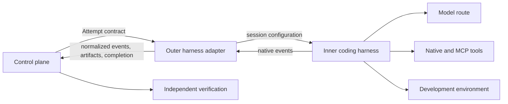
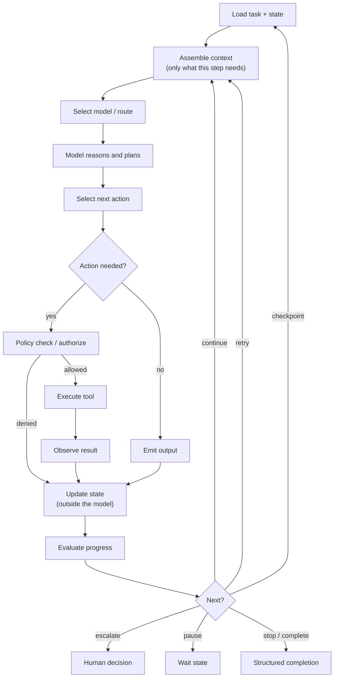
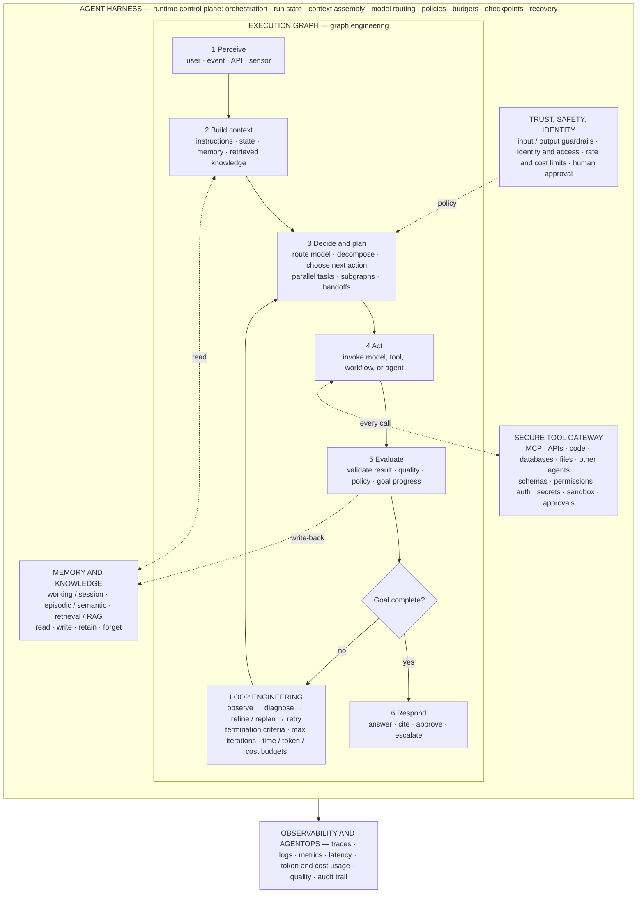
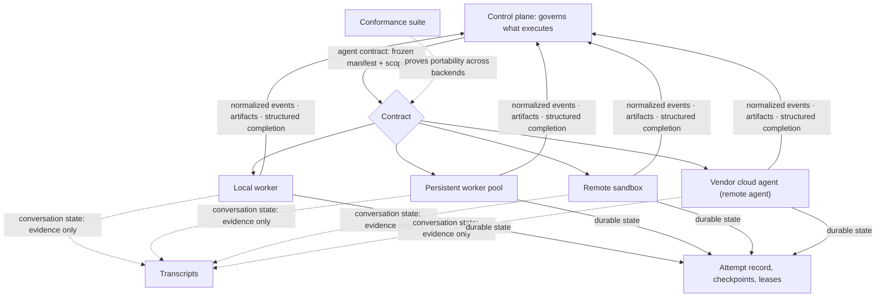
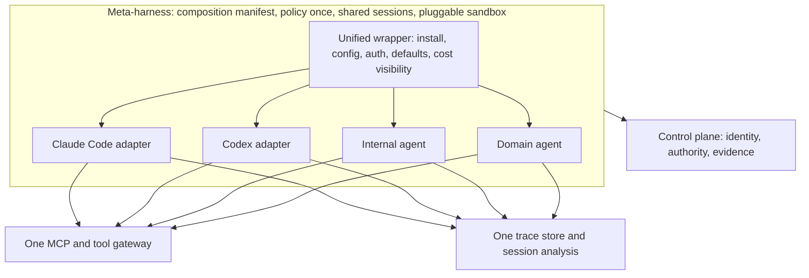
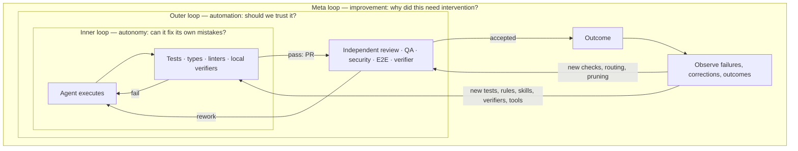
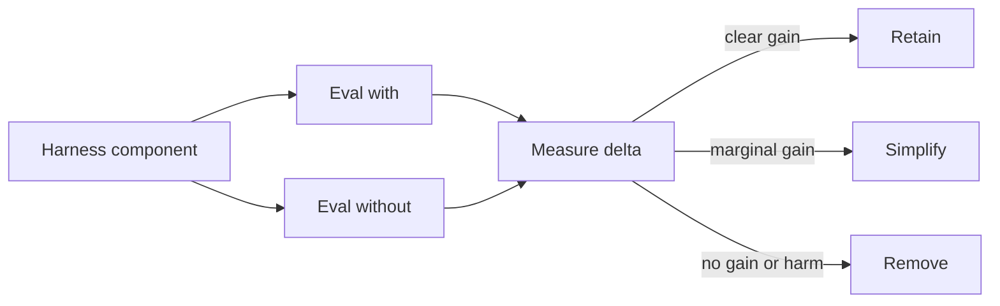
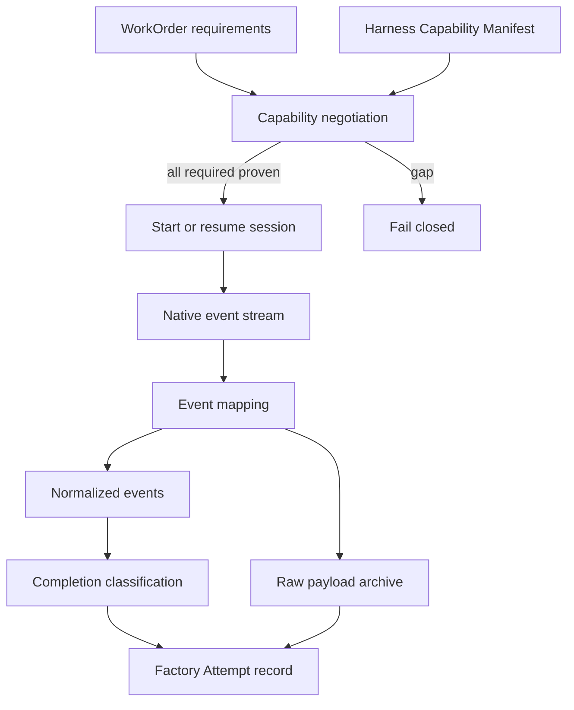
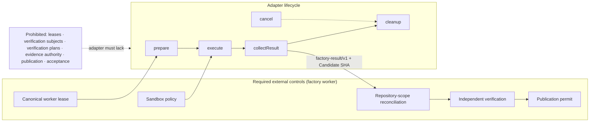
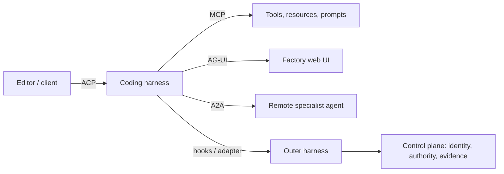

# 13. Coding harnesses and agent protocols

The control plane from the previous two chapters can dispatch an Attempt, but something still has to run the model-and-tools loop that writes code. That something is a **coding harness**: Claude Code, Codex, OpenCode, Amp, Devin, Factory, or one you build. This chapter explains how to make a harness operable inside a factory without depending on its terminal output, how to keep your own controls outside it, and which of the competing protocols (MCP, ACP, AG-UI, A2A) solves which problem. After reading it you should be able to specify an adapter contract, argue for or against wrapping a vendor harness, and explain why "the hook fired" is never the same as "the policy held."

## The problem

Interactive coding tools were designed to collaborate with a person sitting in front of them. A human reads the terminal, approves a prompt, notices that a session has gone quiet, fixes an expired login, and decides whether the agent's "done" is credible. A factory has none of those affordances. Its workers start hundreds of times, run concurrently, outlive an HTTP request, and get destroyed after one Attempt. Every judgment the human used to make must become a structured, machine-verifiable equivalent.

Harnesses also differ from each other in almost every dimension that matters: tools, permission models, session formats, hooks, subagents, context behavior, output events, sandboxes, and completion semantics. A factory that shells out to a CLI may look provider-neutral while silently depending on an undocumented transcript file, a line of terminal text, or one product's lifecycle quirks. Swap the CLI and the factory breaks in ways nobody can name.

Protocols promise to fix this and partly do, but each one standardizes a single boundary. No protocol connects models, tools, editors, user interfaces, remote agents, development environments, and factory governance at once. And harness products change monthly, so any feature matrix baked into the architecture is stale before it ships. The durable design object is a **capability contract** plus a **conformance suite**, not a ranking of products.

## How it works

### Two harnesses around one loop

Two terms need pinning down before the split. An **AI Coding Harness** is an agent harness specialized for repository work: code search, file edits, commands, tests, Git operations, and development feedback. What it enables is **Autonomous Coding**, bounded software-engineering work that the agent may pursue across several tool-use steps without continuous human input. That phrase describes execution autonomy only; it never means autonomous approval, merge, or release, and a product integration that claims the label must still identify which inner- and outer-harness responsibilities it implements.

The word "harness" hides two different jobs. The **inner harness** owns one model-tool loop. It prepares model input, manages context, exposes tools, executes tool calls under its own permission model, streams observations, compacts or resumes the session, and decides when the loop stops. That is what Claude Code or Codex does when you type a prompt.

The **outer harness** makes that loop operable inside the factory. It validates the frozen manifest, provisions the environment, starts or resumes the inner harness, converts native events into the factory's schema, enforces budgets and timeouts, requests policy decisions, captures artifacts, classifies completion, and tears down resources. It is the thing HumanLayer's Dexter calls the outer harness and the thing many teams have quietly built as a pile of shell scripts.

An analogy that holds: the inner harness is a skilled temp worker who arrives with their own toolbox and habits. The outer harness is the site foreman who signs them in, hands them one work order, watches the clock, keeps them out of areas they are not cleared for, collects the timesheet and the finished part, and walks them out. The foreman does not tell the worker how to hold a drill. The worker does not decide what gets shipped.

Neither harness owns Mission approval, WorkOrder acceptance, independent verification, publication authority, merge, or release. Those stay in the control plane and the verification path described in [Chapter 11](./11-control-plane-orchestrator-and-execution-plane.md) and [Chapter 21](../04-prove/21-quality-and-evidence-architecture.md).

<!-- infographic: inner-outer-harness -->
> **Infographic — Inner and outer harness.** *(Jay's graphic goes here.)* Until then, the diagram below
> carries the same concept.

### What the harness owns

Inner and outer together, the harness is where probabilistic reasoning meets deterministic control. The model reasons about the task. The harness controls which model runs, what context it receives, which tools it can invoke, what state persists, how much budget remains, how many retries are left, which execution environment it stands in, when it must stop, and what evidence gets recorded. That is not a loop around an LLM. It is the execution boundary that turns an LLM into an operable enterprise capability.

*The model reasons. The harness controls.*

The full list of harness responsibilities, with the side of the seam each usually lands on:

| Responsibility | Typically owned by |
|---|---|
| Model invocation | Inner |
| Agent lifecycle (start, resume, pause, cancel, terminate) | Outer, driving the inner |
| Context assembly | Inner, from a package the outer freezes |
| State (what persists between steps and across crashes) | Outer, in the durable state machine ([Chapter 12](./12-durable-execution.md)) |
| Tool discovery | Inner, from a registry the outer scopes |
| Tool execution | Inner, behind a gateway the outer authorizes |
| Permissions | Outer, through the control plane; the inner harness's own permission model is a convenience, not the boundary |
| The execution loop | Inner runs it; outer bounds it |
| Budget and timeouts | Outer |
| Checkpoints | Outer records; inner may create |
| Recovery | Outer |
| Observability | Both; the outer normalizes what the inner emits |
| Evaluation hooks | Outer |
| Human intervention | Outer, surfacing structured decision requests |

Where a vendor harness already covers a row, the outer harness's job is to verify that it does so truthfully and to keep an independent record. Where it does not, the outer harness supplies it. Either way the rows that touch authority (permissions, budget, stopping, evidence) belong outside the model and outside any component the model can talk into changing.

*The harness turns probabilistic intelligence into bounded execution.*

### The execution loop

Every harness runs the same loop underneath its product surface. Making it explicit is the fastest way to see where control lives.

<!-- infographic: execution-loop -->
> **Infographic — The execution loop.** *(Jay's graphic goes here.)* Until then, the diagram below carries the same concept.

Read it as the heartbeat of the agent. Each beat loads the task and its current state, assembles only the context this step needs, selects a model, lets the model reason and propose an action, and then does the thing that separates a harness from a chat client: a policy check before any tool runs. The tool executes, its result is observed, and state is updated outside the model, in the durable record, not in the transcript. Then the runtime evaluates progress and picks one of continue, retry, checkpoint, escalate, pause, stop, or complete.

Two properties of the loop carry the whole design. The model proposes the next action; the runtime decides whether that action is permitted and whether the loop continues. And every input to the next beat comes from persisted state, so a beat that starts on a different worker after a crash sees the same world.

### The harness as runtime control plane: one diagram for every production agent

Strip any production agent — a coding agent, a support agent, an on-call triage agent — down to what survives a framework change, and the same diagram appears. It has one outer boundary, three disciplines inside it, three services beside it, and one floor beneath it. Learn the diagram once and every vendor's architecture page becomes a labelled instance of it.

<!-- infographic: harness-control-plane -->
> **Infographic — The agent harness as runtime control plane.** *(Jay's graphic goes here.)* Until then, the diagram below carries the same concept.

**The outer boundary is the harness.** Everything inside the frame is what the harness owns as a **runtime control plane**: orchestration, run state, context assembly, model routing, policies, budgets, checkpoints, and recovery. The model is invoked from inside this frame; it never owns the frame. That is the same claim as the responsibility table above, drawn as a picture.

**The execution graph is the middle.** Six typed nodes, in order, are the anatomy of one turn of any agent:

| Node | What it does | What it must not do |
|---|---|---|
| 1 Perceive | Take in the trigger: a user message, an event, an API call, a sensor reading. Attach identity and scope. | Act on the input before it has been classified and guarded. |
| 2 Build context | Assemble instructions, current state, memory, and retrieved knowledge into the context for this step only. | Load everything that exists; context is selected, not accumulated. |
| 3 Decide and plan | Route to a model, decompose the task, choose the next action; fan out parallel tasks, subgraphs, or handoffs where the plan calls for them. | Widen its own authority or invent tools that were not exposed. |
| 4 Act | Invoke a model, a tool, a workflow, or another agent — through the gateway, never around it. | Touch a system the gateway did not authorize. |
| 5 Evaluate | Validate the result against quality criteria, policy, and goal progress; write back what was learned. | Accept the model's own report of success as evidence. |
| 6 Respond | Answer, cite, approve, or escalate — the structured completion of the turn. | Complete silently; every response is a record. |

The edges are the discipline of **graph engineering**: typed nodes, stateful edges, conditional routing, parallel branches, subgraphs, checkpoints, and resumability. A conditional edge after Decide reads state and names the next node; a checkpoint after each node is what makes pause, replay, and human review possible; a subgraph is how a specialist agent is invoked without giving it the parent's authority. [Chapter 18](./18-agent-and-loop-engineering.md) builds the graph in detail.

**The loop is the feedback path.** When Evaluate answers "goal not complete", control does not return blindly to Decide; it passes through **loop engineering**: observe what actually happened, diagnose why it fell short, refine the plan or replan, then retry. The loop is bounded by termination criteria — maximum iterations, time, token, and cost budgets — set by the harness, not chosen by the model. Without the diagnose step a retry is just the same mistake with a higher bill; without the bound the loop is an outage.

**Three services stand beside the graph, and the graph never bypasses them.**

- *Memory and knowledge* — working or session memory, episodic and semantic memory, and knowledge retrieval — is read by Build context and written by Evaluate (the write-back). Read, write, retain, forget are explicit operations with policy; nothing enters long-term memory because a model happened to say it.
- *The secure tool gateway* is the only door from Act to the world: MCP servers, APIs, code execution, databases, files, and other agents, all behind schemas, permissions, authentication, secrets handling, sandboxing, and approvals. A tool the gateway does not expose does not exist for the agent, which is exactly the point.
- *Trust, safety, and identity* is the rail on the left: input and output guardrails on Perceive and Respond, identity and access on every call, rate and cost limits on the loop, and human approval as a first-class node that Decide can route to. Policy enters the graph at Decide, not after the fact.

**Observability and AgentOps is the floor.** Traces, logs, metrics, latency, token and cost usage, quality signals, and the audit trail are emitted by every node and every service, and they are the only thing an operator ever sees of a run. They explain; they do not decide ([Chapter 28](../05-operate/28-observability-telemetry-and-forensics.md)).

*Frameworks change. The harness, the graph, and the feedback loops remain.*

The diagram also gives a fast diagnosis when an agent underperforms. Wrong or missing input handling: Perceive and the guardrails. Hallucination or stale facts: Build context and the memory service. Wrong action chosen: Decide and the routing policy. Action refused or unsafe: the gateway. Confident wrong answers: Evaluate is trusting the model. Runaway cost: the loop's termination criteria. Nobody can explain what happened: the floor. Fixing the prompt is the right answer for none of these.

### A harness is not a software factory

It is tempting to look at the loop above, note that it already has budgets and policy checks and checkpoints, and conclude that the harness is the factory. It is not. A harness executes an agent; a software factory governs the work. The harness knows about one run: its task, its state, its tools, its budget. The factory knows about intent, plans, WorkOrders, acceptance criteria, independent verification, evidence, review, delivery, and what to learn afterwards, none of which a run can see or decide. The harness's structured completion is the factory's input, not its conclusion. That is why the harness does not own approval, verification, merge, or release, and why the control plane in [Chapter 11](./11-control-plane-orchestrator-and-execution-plane.md) sits above it rather than inside it.

*The harness is how agents execute. The control plane is how the organization governs what they execute.*

### The agent contract: adopt the loop, own the contract

The loop above is now a commodity. Every serious harness runs it, the open-source ones run it well, and a team that writes its own gains little except maintenance. The first design decision about the harness is therefore not how to build the loop but which part of the harness to own. The answer this guide gives is: adopt commodity agent-loop mechanics, and own the **agent contract**.

The agent contract is the durable interface between the control plane and any component that executes an agent. It says what an execution receives, what it must return, what state it may keep, and what it may never widen. Written down, it has five parts:

| Part | What it fixes |
|---|---|
| Input | The frozen Execution Manifest: WorkOrder, acceptance criteria, resolved capability graph, model route, context package digest, budgets, and the **frozen scope** |
| Output | Normalized events, artifacts with digests, and a structured completion that can say "stopped, incomplete" |
| State semantics | What is **conversation state** and what is **durable state**, and which of the two the factory relies on |
| Authority | Which decisions the execution may make on its own and which must come back as structured requests |
| Lifecycle | Start, resume, pause, cancel, drain, terminate, and what each guarantees about side effects |

**Frozen scope** is the part most often left implicit. At dispatch, the repositories, paths, tools, credentials, network destinations, and budgets an execution may touch are fixed, and the agent cannot widen them by asking, by discovering a new tool, or by spawning a subagent with more permissions than its parent. A scope the model can renegotiate mid-run is not a scope; it is a suggestion.

The state distinction is the second thing the contract must be explicit about. **Conversation state** is the transcript and the model's working context: what the harness has said and seen, subject to compaction and lost on a crash. **Durable state** is the Attempt record, its checkpoints, its lease, and its recorded tool effects, held outside the model in the durable state machine of [Chapter 12](./12-durable-execution.md). The factory may read conversation state as evidence; it may only *depend* on durable state. A step that exists only in the transcript has not happened as far as recovery is concerned.

Once the contract is owned, the thing that runs the loop becomes a replaceable **execution backend**: a local worker process, a persistent worker pool, a remote sandbox, or a vendor-managed cloud agent. **Delegated execution** is the control plane handing a frozen manifest to a backend it does not host; **remote execution** is the case where that backend is on infrastructure the factory does not control; a **remote agent** is the execution running there, authenticated as a principal, scoped by the manifest, and trusted exactly as far as its evidence can be traced back to one authorized Attempt. The contract is the same for every backend, which is what makes delegation safe: the remote agent gets the same frozen scope, returns the same normalized stream, and cannot acquire authority from its location.

<!-- infographic: agent-contract -->
> **Infographic — One agent contract, many execution backends.** *(Jay's graphic goes here.)* Until then, the diagram below carries the same concept.

**Portability** is the property the contract buys: the same WorkOrder can run through a second harness or a second backend with behavior the factory can prove equivalent for that workload. It is not asserted by the contract; it is demonstrated by the [adapter conformance suite](#adapter-conformance-suite) below, which is why the suite tests behavior rather than product names. A contract without a suite is a document; a suite without a contract is a pile of tests against one vendor.

The analogy is a shipping container. Nobody who ships goods builds their own crane; the crane, the ship, and the truck are commodity mechanics. What the shipper owns is the container standard: the dimensions, the corner fittings, the seal, the manifest on the door. Because the standard is fixed, any port can handle any box, and the shipper can change carriers without repacking. The agent loop is the crane. The agent contract is the container.

### The meta-harness: one governance layer across many harnesses

Nobody runs one harness. A working team has Claude Code on some desks, Codex on others, an internal agent for the company's own systems, and a few specialized domain agents, each with its own tools, sessions, policies, permission model, and execution environment. Wrap each one with a thin adapter and you have five operable harnesses and five silos: five places policy is configured, five session formats nobody else can resume, five sandboxes with five isolation stories. The layer that closes that gap is the **meta-harness**, the governance layer *across* harnesses, and it is the outermost of the four nested layers that [Chapter 15](./15-agent-architecture.md) describes (meta-harness, then harness, then graph, then loop, then the model).

A meta-harness supplies four things. **Composition**: a manifest declares which agents exist and who may delegate to whom, so the delegation graph is written down rather than discovered in a transcript. **Policy**: token caps, file rules, and permission defaults are enforced once and applied to every harness, instead of re-implemented in each product's settings hierarchy. **Collaboration**: sessions are shared and resumable across people, devices, and agents, so a run started in one harness by one engineer can be picked up elsewhere. **Sandbox**: isolation is pluggable, so the provider can be swapped while the policy stays constant. Omnigent is one open-source implementation of this layer; the vocabulary is the useful part, whichever implementation you choose or build.

The practical form of a meta-harness inside a large engineering organization is a **unified wrapper**. Uber's engineering team, which runs every interactive coding harness its engineers use through one such wrapper, describes it as owning installation, configuration, authentication, and cost visibility across all of them, and as the place where the standard defaults live: compaction at a fixed token threshold, a medium reasoning effort, a cheaper default model for subagents, prompt-cache lifetimes matched to how people actually pause, and a live cost counter in the status line of whichever harness is running. Because every session passes through it, the wrapper can also collect every trace into one session-analysis dashboard, flag anti-patterns with their cost, and route all MCP traffic through one gateway. None of that changes what any single harness does; it changes what all of them share.

<!-- infographic: meta-harness -->
> **Infographic — The meta-harness across harnesses.** *(Jay's graphic goes here.)* Until then, the diagram below
> carries the same concept.

In this guide's terms the meta-harness is the control plane's harness-facing half ([Chapter 11](./11-control-plane-orchestrator-and-execution-plane.md)) together with the Agent Factory's governance across agent definitions ([Chapter 10](./10-the-agent-factory.md)). The composition manifest is the agent registry and its delegation rules; policy-once is the policy engine the outer harness already routes through; shared resumable sessions are the durable Attempt record with native session identity attached; the pluggable sandbox is the environment layer of [Chapter 14](./14-development-environments-sandboxes-and-compute.md). The adapter contract and conformance suite later in this chapter are how a harness earns a seat inside the meta-harness. What the meta-harness adds to a single outer harness is that the rules are written once and the evidence lands in one place, which is the only arrangement in which a second harness is cheap to add and a first one is cheap to leave.

### Where the seam sits: thin or thick

You choose where to put the seam between the two. Buy a rich inner harness that ships with a browser, testing, subagents, and compaction, and your outer harness can be thin, little more than the skills you inject and the loop that drives it. Or take a thin, configurable inner harness such as OpenCode or one of the smaller build-your-own harnesses, where you set up every behavior yourself, and build a thick outer harness around it. Dexter's framing on the HumanLayer and BAML livestream is that Claude Code is "bring it and it's good," while a thin harness "comes with control but you have to build more." Both are legitimate; they are different bets on where your team's effort goes.

The same tradeoff shows up in the adapter itself. A **thin adapter** preserves native features and exposes the control plane to provider differences. A **thick adapter** normalizes behavior across providers but may erase useful capabilities or invent a false lowest-common-denominator abstraction. The practical answer is to translate only the events and commands the factory contracts require, and to preserve the native payloads as diagnostic artifacts alongside the normalized stream. Think of a travel power adapter: it converts the plug shape so the factory can connect, but it does not pretend every appliance behaves the same.

### Harness engineering

Everything above describes a harness as a thing. **Harness engineering** is the discipline of building it on purpose: designing the execution environment, feedback mechanisms, checks, tools, context, and improvement loops that let agents complete increasingly complex work with less intervention at equal or better quality. The sentence to keep is the one practitioners use to explain it to their own teams: *engineer the system in which agents engineer the software.* The engineer's product is no longer the code; it is the place the code gets made.

That system has a fixed scope, and each item on it is a chapter of this book: context (what good looks like, [Chapter 16](./16-data-knowledge-semantic-and-context-engineering.md)); skills ([Chapter 10](./10-the-agent-factory.md)); tools and the gateway ([Chapter 15](./15-agent-architecture.md)); the environment ([Chapter 14](./14-development-environments-sandboxes-and-compute.md)); tests and verifiers ([Chapter 21](../04-prove/21-quality-and-evidence-architecture.md)); evals ([Chapter 23](../04-prove/23-evaluation-engineering.md)); feedback and observability ([Chapter 28](../05-operate/28-observability-telemetry-and-forensics.md)); and the improvement loops ([Chapter 33](../06-improve/33-governed-learning-and-compounding-engineering.md)). The harness is the machine; the loops below are what you run through it. Practitioners at Tessl are candid about why the discipline is hard: the field changes weekly, the work is fundamentally unplanned and competes with shipping, and the signals you need are hidden in local logs or in someone's head until you move the workflow onto legible surfaces.

### Inner loop, outer loop, meta loop

The "inner" and "outer" of the harness split above describe two pieces of software. Practitioners also use "inner" and "outer" for a different but complementary idea, three loops that run *through* the harness, and it is worth holding both in your head. Each loop has its own examples, answers its own question, and serves a different objective.

| Loop | What runs in it | The question it answers | Objective |
|---|---|---|---|
| **Inner loop** | Fast, cheap feedback during execution: unit tests, types, the compiler, linters, static analysis, architecture rules, policy checks, local verifiers, CLI tools, test-first development; plugins and skills the agent iterates against before a pull request exists | *Can the agent detect and correct its own mistakes before handoff?* | **Autonomy** |
| **Outer loop** | Deeper, independent verification after or around the work: independent review agents, security review, integration and end-to-end tests, agentic QA that drives the product, browser verification and screenshot inspection, architecture review, mutation testing, acceptance validation, risk assessment, an independent verifier | *Should we trust what it gave us?* | **Automation** |
| **Meta loop** | Observation of executions, failures, reviews, corrections, and outcomes, feeding back proposals: detect recurring failures, generate tests and lint rules, improve skills, context, and playbooks, propose verifiers, find missing tools, find automatable work, optimize routing, detect unnecessary harness components, detect context drift, improve readiness | *Why did this need intervention, and what do we change so the next agent doesn't?* | **Improvement** |

The objectives are the reason to keep the loops apart. Inner-loop improvements drive autonomy: fewer human corrections per task, because the agent fixed it before anyone looked. Outer-loop improvements drive automation: less human review before acceptance, because independent verification established the trust a reviewer used to supply. The meta loop, which [Chapter 33](../06-improve/33-governed-learning-and-compounding-engineering.md) treats in depth, drives improvement, and it is the loop with the most leverage, because a fix to it changes every future run so that the same mistake is made only once. A team that pours effort into the inner loop and none into the outer gets a hundred correct pull requests each waiting for a human to inspect them; a team that builds the outer loop without the inner gets expensive verification of work the agent could have fixed itself.

<!-- infographic: three-loops -->
> **Infographic — Inner, outer, and meta loops.** *(Jay's graphic goes here.)* Until then, the diagram below carries the same concept.

### Harness–model co-design and harness profiles

A harness that treats every model the same is leaving performance on the table, and a harness that is built around one model is a lock-in with extra steps. The way through is a distinction: **model-agnostic is not model-uniform**. Model-agnostic means the factory is not structurally dependent on one provider: the contracts, the evidence, the state, and the verification are the same whichever model runs. Model-uniform would mean identical prompts, tool schemas, and workflows for every model family, and that is a different, worse thing, because model families differ in how they use tools, how they edit files, how they respond to prompt structure, and how their reasoning is best configured. **Harness–model co-design** optimizes the harness around each model's behaviour, tool-use patterns, and reasoning style while preserving the common contracts.

The mechanism is a layering: **canonical agent contract → harness profile → model**. The agent contract above stays fixed. A **harness profile** is the model-specific configuration of how the common harness interacts with one model family, and its fields are:

| Harness profile field | What it sets |
|---|---|
| Tool schemas | How tools are described and shaped for this family |
| Edit mechanism | Whole-file rewrite, search-and-replace, patch, or structured edit |
| Prompt structure | Where instructions, context, and examples go, and in what form |
| Context strategy | What is loaded per step, in what order, at what size |
| Compaction | When and how the session is summarized |
| Reasoning configuration | Effort, thinking budget, or equivalent settings |
| Subagent behaviour | Whether, when, and on what model subagents are spawned |
| Retry policy | What is retried, how often, and what counts as a changed attempt |
| Tool descriptions | The wording that makes this family select the right tool |
| Escalation | When the profile hands off to a human or a stronger route |

The profile is versioned and evaluated like any other factory asset; the contract beneath it does not change when the profile does. That is also what makes the profile safe to specialize: a profile can be as opinionated as the model family needs, because nothing above it depends on the opinions.

The reason to invest here is a performance equation worth writing on the wall: **P = f(model, harness, workflow, context, tools, feedback, verification)**. Never attribute everything to the model. When an agent underperforms, the model is one of seven terms, and it is usually not the cheapest one to change. The way to find out which term is at fault is **harness effectiveness evaluation**: a **model × harness matrix**. Run model X with harness A, X with B, Y with A, and Y with B on the same reference tasks, and compare success, quality, intervention count, latency, tokens, cost, and verification outcomes. If X beats Y under both harnesses, the model matters; if A beats B under both models, the harness does; if the results cross, the workflow or the profile is the term to look at. Without the matrix, every regression is blamed on whichever component changed most recently.

The matrix is the evidence for a claim this guide makes throughout: the harness is an **intelligence multiplier**. There are three levels of capability, and they are not the same number. **Model capability** is what the weights can reason about and generate. **Agent capability** is what the model can do with tools, context, state, and a loop around it. **Factory capability** is what an organization can reliably delegate, with workflows, governance, verification, economics, and learning wrapped around the agent. A better model raises the first; only harness engineering raises the second; only the factory raises the third. *Model capability ≠ agent capability ≠ factory capability.*

The multiplier has a cost curve, and it goes the wrong way if nobody watches it. **Harness debt** is the accumulated prompts, skills, rules, checks, adapters, and orchestration that once compensated for an agent limitation and no longer justify their cost, because the model improved, the workflow changed, or the check was never load-bearing. Much of it is **compensatory**: built to work around a temporary model weakness, then kept out of habit after the weakness was gone, unlike the institutional knowledge (architecture, policies, conventions) that no model will ever know on its own and that stays load-bearing. **Harness pruning** is the routine that pays it down, and it is the same shape as every other evaluation in this book: take one component → eval with it → eval without it → measure the delta → retain, simplify, or remove. A component that cannot show a delta is debt, however sensible it looked when it was added.

<!-- infographic: harness-pruning -->
> **Infographic — Harness pruning.** *(Jay's graphic goes here.)* Until then, the diagram below carries the same concept.

### Headless execution and the structured event stream

The first concrete decision is how the outer harness talks to the inner one. Every serious harness offers a **headless** or non-interactive mode that emits typed events or a stable structured stream, usually JSON Lines. BAML's team, for example, runs Claude Code and Codex headless with a streaming JSON output, and reads the JSONL transcript the harness writes: either tailing the file as it grows or scooping it up when the session ends. Both work. What does not work is parsing the pretty terminal rendering, which changes with every release and encodes no completion semantics.

The analogy is a flight data recorder versus listening through the cockpit door. Terminal text may remain a diagnostic artifact, but the authoritative completion contract must be the structured stream. And process exit zero never means the engineering task is complete; it means the process stopped.

For every session the factory should retain:

- adapter version and native session identity;
- harness configuration, model route, instructions, and tool grants;
- context digest and environment digest;
- the ordered event stream and its ordering guarantees;
- exit state and structured completion, including unresolved work; and
- references to raw artifacts (native transcript, logs, diffs).

### Lifecycle, sessions, checkpoints, and compaction

A harness session is a stateful thing that the factory needs to drive from outside. A portable **harness lifecycle** covers capability discovery and version negotiation; preflight and configuration validation; start, attach, resume, pause, cancel, drain, and terminate; user input and structured human-decision requests; model, tool, file, command, subagent, progress, warning, and cost events; permission and policy-decision callbacks; checkpoints, compaction, and session identity; structured terminal completion and unresolved-work reporting; artifact and receipt export; classification of timeout, crash, malformed output, and unavailable provider; secret redaction and content-retention controls; and environment teardown and reconciliation.

Two items deserve emphasis. **Session resume** means the outer harness can reattach to a session after a worker crash or lease expiry and continue, which only works if the native session identity was recorded before the first tool call and the environment still exists. **Compaction** is the inner harness summarizing its own context to stay under the window; the factory must know when it happened, because evidence gathered before a compaction may no longer be in the model's view, and a checkpoint taken across a compaction boundary is a different object from one taken within it. Dexter lists compaction and testing among the choices the inner harness makes for you when you buy it and that you make yourself when you build it.

### Hooks are integration points, not authority

Most harnesses expose **lifecycle hooks**: callbacks on session start, tool calls, file changes, subagent spawn, permission requests, stop, and completion. They are useful for logging, policy callbacks, credential injection, validation, notifications, and cleanup. HumanLayer uses a stack of them.

But a native hook is not automatically trustworthy. Before relying on one for anything consequential, the factory must know whether it is synchronous or fire-and-forget, bypassable by a flag or a config edit, ordered relative to other hooks, retryable, authenticated, and covered by the harness's own configuration hierarchy (user, project, enterprise). A hook in a user-editable settings file is a smoke detector wired to your phone: valuable, and not the fire code. Consequential policy belongs in an external authoritative control path or a qualified enforcement point, per [Chapter 7](../02-design/07-governance-policy-and-risk-proportional-approval.md).

Hooks are also where cross-harness portability dies. Claude Code and Codex do not have the same hooks. The thin configurable harnesses differ again. OpenCode has a plugin system in which hooks are a separate concept entirely. Dexter's diagnosis is that every harness is, underneath, its own bespoke UI, and the hook model is part of that UI. Even the instruction file is contested: Claude Code reads `CLAUDE.md` while most other tools converged on `AGENTS.md`, and the vendors have not agreed to share. Expect to maintain both.

### Driving to completion with bounded loops

The outer harness is also where "keep going until it is actually done" lives. BAML's practice is instructive because it is so plain: a hard-coded while loop that reruns the agent against CodeRabbit review comments until the PR is mergeable, with a maximum of three iterations, after which the loop boots the work out to a human. That number is the **maximum review iterations** parameter: an outer-loop setting, owned by the harness rather than the model, that caps how many review-and-fix cycles a single Attempt may consume before the work is escalated. Nobody is notified until either the reviewer bot is satisfied or the budget is spent. A second loop, which they were adding at the time, babysits an approved PR against a moving main branch until it merges: an **agentic merge queue**, covered in [Chapter 32](../06-improve/32-production-feedback-review-and-the-agentic-merge-queue.md). The pattern to retain is: bounded iterations, a deterministic exit condition, and a human handoff when the bound is hit. An unbounded "fix until green" loop is a spend incident waiting to happen.

### The adapter contract and the capability manifest

The outer harness talks to a specific inner harness through an **adapter**. Each adapter publishes a **Harness Capability Manifest** that declares, truthfully, which lifecycle behaviors it supports and which it does not. Unsupported behavior must be visible, not silently absent, and adapters should fail closed: if a WorkOrder requires a capability the harness cannot prove (say, cancellation mid-tool-call, or verified session resume), the adapter refuses the work rather than pretending.

<!-- infographic: harness-adapter-contract -->
> **Infographic — The harness adapter contract.** *(Jay's graphic goes here.)* Until then, the diagram below
> carries the same concept.

Substitutability is never global. Two adapters are substitutable only for a specified workload and policy set. One may be eligible for read-only repository analysis and ineligible for code mutation or long-running recovery. The manifest plus the conformance results (below) are what let the orchestrator make that call per WorkOrder.

### Adapter admission: prohibited authorities and required external controls

The capability manifest says what an adapter can do. **Admission** is the control plane's decision that a specific adapter version may be selected for governed work, and it is made against a harness contract that is the same for every engine, whether the engine is a single-session coding harness or a larger epic-delivery engine that plans, splits work into stories, and runs its own gates. [Chapter 11](./11-control-plane-orchestrator-and-execution-plane.md) gives the authority table and the two admission lists from the control plane's side; this section is the adapter mechanics that make those lists checkable.

<!-- infographic: adapter-admission -->
> **Infographic — What an adapter runs, and what runs around it.** *(Jay's graphic goes here.)* Until then, the diagram below carries the same concept.

**The lifecycle is five operations.** `prepare` receives the frozen manifest and the executor snapshot, provisions the engine's environment inside the Attempt's worktree or sandbox, and records the engine's own identity for this Attempt before any work starts. `execute` starts the engine and streams its native status. `collectResult` gathers the engine's terminal output into the shared structured result. `cancel` is the control plane's stop, called from a control-plane cancel command and never from the engine's side. `cleanup` releases the engine's resources and records what it could and could not remove. Every operation is idempotent against its Attempt, because the worker may call it twice after a crash.

**The result is a shared contract.** Every adapter returns the same **structured result contract**, `factory-result/v1`: the outcome class, the candidate SHA if one exists, the engine's phase at termination, the artifacts and their digests, the gate outcomes the engine observed, unresolved work, and the native payload reference. The control plane reads only this. A result without a candidate SHA is a result the control plane cannot verify, and the WorkOrder goes to BLOCKED rather than forward. The **harness capability manifest** (v1) sits beside the result contract and declares, per adapter version, what the engine supports for models, filesystem, git, sandbox, cancellation, and admission, and what its known limitations are; a required capability the manifest does not claim fails admission closed.

**Selection is the only engine-specific step.** The factory's own Attempt worker selects the adapter from the executor snapshot, then runs the five required external controls itself: it holds the canonical lease, applies the sandbox policy, reconciles changed files and the head SHA against the frozen code scope, dispatches independent verification, and publishes through the permit-gated GitHub App. There is no engine-specific worker path. An engine that wants its own lease, its own publication, or its own verifier has asked for one of the six prohibited authorities, and the answer is no.

**Events are mapped, not trusted.** The adapter polls or receives engine status and maps it onto the factory's canonical run events, each with the idempotency key `{workOrderId}:{runId}:{engineId}:{eventType}:{sequence}` so that a re-poll after a crash cannot double-count. The canonical event types are `run.created`, `worktree.created`, `plan.generated`, `step.started`, `step.completed`, `artifact.produced`, `approval.required`, `verification.executed`, `failure.encountered`, `retry.attempted`, `pr.updated`, `run.completed`, and `learning.candidate.proposed`. Native events that have no canonical equivalent are archived as raw payloads, not invented as new types.

**Engine phases map to tendencies, never to transitions.** An epic-delivery engine moves through phases such as planning, planned, approved, implementation or in progress, gate, finalizing, done, failed, rejected, and stopped. Each phase tells the control plane which WorkOrder state the work is *tending toward*, and the Execution Run Inspector may show it; none of them moves the WorkOrder. Done tends toward AWAITING_VERIFICATION and reaches it only when a candidate SHA exists. Failed, rejected, and stopped tend toward BLOCKED or the Attempt's terminal states. An engine's nested units of work (stories, with their own pending, running, done, failed, or blocked states) live in engine-owned nested worktrees beneath the epic worktree; the Attempt records the epic worktree and the adapter records the story tree as artifacts, so the factory can see the engine's decomposition without adopting its state machine.

**Cancellation has one direction.** A control-plane cancel calls the adapter's `cancel`, which stops the engine. Cancellation wins over any late success until terminal success has been durably reported; a stop that fails still leaves the Attempt canceled, with the cleanup outcome recorded and the worktree preserved for inspection. The engine never cancels the WorkOrder.

**CI proves the adapter, operators prove the engine.** Continuous integration runs the adapter against a **deterministic fake-engine fixture**: a stub that returns a fixed epic id, a fixed status sequence as JSON, and a fixed candidate SHA, so the lifecycle, result mapping, idempotency keys, cancellation, and cleanup can be exercised on every commit with no model in the loop. Live engine runs are operator evidence, retained against an exact revision, and are never a CI gate; a CI job that needs a real engine to pass is a job that fails for reasons unrelated to the code.

**Unattended mode is not admitted.** Most engines offer a "full-auto" mode that approves its own plan and proceeds without a human. That mode is not admitted in a first version. The admitted posture is manual approve-then-run: a human approves the plan in the control plane, the control plane attests that approval, and only then does the adapter start the engine. An experimental adapter is additionally flag-gated, off by default, and excluded from remote sandbox execution until it has passed the same conformance and live evidence bar as the production adapter.

### Protocols and their boundaries

Four protocols come up constantly, and they are not competitors. Each standardizes messages at one boundary.

| Protocol | Primary boundary | Useful for | Does not establish |
| --- | --- | --- | --- |
| **MCP** (Model Context Protocol) | Agent or host to tools, resources, prompts, and extensions | Tool discovery and invocation | Business authority, trustworthy tools, or acceptance |
| **ACP** (Agent Client Protocol) | Coding agent to editor or client | Portable agent/editor sessions and interaction | Factory workflow, environment qualification, or release governance |
| **AG-UI** | Agent backend to user-facing application | Bidirectional event streaming, state, tool, and user interaction | Durable domain authority or independent verification |
| **A2A** (Agent2Agent) | Independent agent application to agent application | Capability discovery, delegation, messaging, remote task coordination | Permission to delegate factory authority or trust a remote agent |

A plumbing analogy: a pipe-thread standard guarantees the pipes join. It says nothing about whether the water is safe to drink. MCP created what Dexter calls an ecosystem explosion precisely because it fixed one narrow join, letting agent builders, harness builders, and integration builders mix and match. It did not make any tool trustworthy.

The acronym ACP is ambiguous in the wider ecosystem; this guide uses it for the Agent Client Protocol associated with editor-agent interoperability (Zed's), and any design that depends on its behavior must pin the specification or implementation version. On the livestream, Dexter's assessment is that ACP is the right idea for the control-plane-to-harness seam but quite narrow, and that a thicker, wider interface is needed for a coding harness to talk to a UI, an editor, or a web app. AG-UI is good at broadcasting UI events. Neither supports hooks, which is exactly what an outer harness needs: the ability to lifecycle a harness and react to its events.

Vaibhav's counterpoint is that a good abstraction here may not be possible yet, because harnesses differ by design and the abstraction "by design can't be that good." His hopeful analogy is React: the web looked unabstractable until someone noticed that state is all you need and the rest falls out. Nobody has found the equivalent primitive for harnesses. Until they do, expect to wrap each one.

Protocols coexist. An editor talks to a coding agent through ACP; that agent reaches tools through MCP; a factory UI receives events through AG-UI; a remote specialist is contacted through A2A. In every case the control plane still authenticates principals, scopes authority, freezes contracts, reconciles state, and evaluates evidence. Protocol identity is never authority.

<!-- infographic: protocol-boundaries -->
> **Infographic — Where each protocol lives.** *(Jay's graphic goes here.)* Until then, the diagram below
> carries the same concept.

### The dated landscape, and the bet on owning it

Product names belong in dated case studies; contract vocabulary belongs in the canon. As of this writing (verified 2026-08-30), Codex and Claude Code are the two most useful case studies: both offer a CLI, an SDK or programmatic mode, hooks, tool and permission models, session persistence, and automation features, each on a different model, local/cloud split, and lifecycle. OpenCode and the thinner configurable harnesses are the build-your-own end. Amp, Devin, Factory, Gemini's agent, and vendor "cloud agents" such as Cursor's and Cognition's bundle harness, environment, and orchestration together. That is the line between a **vertically integrated stack**, where one vendor supplies model, harness, environment, and orchestration as a single product, and a **composable stack**, where each layer is a separately chosen component behind an interface you own; the first is faster to adopt, the second is easier to leave. The same line separates **managed execution**, where the vendor runs the harness on its own fleet, from a **self-hosted harness** that you run on your own workers with your own identity and network boundaries. Every one of these must be verified against current official documentation and a pinned runtime before use. The product name describes a suite of experiences; the factory integrates with one exact harness and version.

Why are there so many? Because, as Dexter puts it, a lot of people are betting that owning the harness is worth a lot of money, the way owning the browser and owning mobile turned out to be. That bet is why vendors keep their hooks and instruction files different, and why you should assume APIs will keep breaking. The vendors' incentive is not your portability.

For the factory that means a build-versus-buy decision made deliberately, not by drift. Wrapping a mature harness gives rapid capability and creates adapter work each time native behavior changes. Building an inner harness gives control and demands sustained investment in tool execution, context management, model integration, permissions, user experience, and safety. Tessl's experience with off-the-shelf orchestrators applies to harnesses too: great for getting from zero to half, then a black box owning your SDLC grates. Their answer, and HumanLayer's, is a swappable harness behind an interface you own.

**Lock-in and exit** should be part of the design from day one. **Provider lock-in** is the condition in which switching harness or model vendor would cost more than the switch is worth, because transcripts, instructions, skills, and evidence exist only in one vendor's shape. An **exit strategy** is the documented, rehearsed path out: what you keep in your own format, which adapter you would qualify next, and how long it would take. Keep native transcripts and normalized events both. Keep skills and instructions in the repository in a form more than one harness can read. Keep the adapter conformance suite so that a second adapter can be qualified when needed. The exit is not "we could switch"; it is "we ran the same workload through two adapters last quarter and here are the traces."

## How to build it

### Steps

1. Write the outer-harness lifecycle as a contract first, harness-agnostic, using the lifecycle list above. Mark each item required, optional, or unsupported for your first workloads.
2. Pick one inner harness and pin an exact version. Read its headless mode, event schema, transcript format, hook model, and configuration hierarchy from official documentation, not from memory.
3. Build a thin adapter that translates only the required events and commands, archives raw payloads, and records native session identity before the first tool call.
4. Publish the adapter's capability manifest. Every "no" must be explicit.
5. Run the conformance suite (below) and keep the results next to the manifest.
6. Add the outer-harness loops: budgets, timeouts, bounded fix-until-green with a human exit, and completion classification.
7. Route policy through the control plane, using hooks only as observation and callback points.
8. Only then consider a second adapter, and qualify it against the same suite for the same workload.

### Adapter conformance suite

Test behavior, never product names. A driving test checks that the driver stops at the light; it does not ask what brand the car is. The suite should cover:

- capability truthfulness, including unsupported features failing closed;
- event ordering, duplication, loss, and redaction;
- cancellation before, during, and after tool effects;
- timeout and process-crash recovery;
- permission denial and human-decision waits;
- context compaction and session resume;
- out-of-scope filesystem and network attempts;
- output-schema violations and false completion;
- model or provider fallback visibility;
- teardown and orphan detection; and
- exact lineage from native session to factory Attempt.

Promotion of a new adapter or version additionally requires negative tests, version-upgrade tests, cancellation races, content-redaction tests, and live canaries.

### What each adapter ships with

- pinned manifest and compatibility range;
- conformance results;
- security review;
- event mapping, with known loss of fidelity written down; and
- rollback path.

### Harness-engineering practices that transfer

These are drawn from teams running factories today and apply to whichever harness you choose.

- Outlaw local configuration. Tessl checks every skill, hook, and workflow into the repository so an improvement improves everyone and the compounding loop actually compounds.
- Make every touchpoint legible. Work starts as an issue, runs through a headless agent in a sandbox, lands as a PR, and feedback lives on the PR, so the meta loop has durable surfaces to read.
- Separate fast inner-loop checks from expensive outer-loop checks; run the expensive ones once at the PR boundary and let the agent iterate on their results.
- Add **verifiers**: small, cheap, deterministic-in-practice LLM lint rules scoped by glob to catch every mistake you have ever seen an agent make, so the general review is not a laundry list.
- Bound every autonomous loop with a max-iteration count and a human handoff.
- Track manual takeovers and human PR comments as the metrics for autonomy, and PRs initiated without human input as the metric for automation, holding quality constant.
- Budget harness-engineering time explicitly; it is unplanned work that competes with shipping and never happens by accident.

## Failure modes

**Terminal scraping masquerading as integration.** Symptom: the adapter breaks on a harness update and nobody knows why. Detect by grepping the adapter for regexes over stdout. Fix by moving to the structured stream and treating text as diagnostics.

**Exit zero treated as done.** The process ended; the task did not. Detect with completion classification that reads the structured terminal event and unresolved-work report. Every Attempt should be able to end in "stopped, incomplete."

**Hook as policy.** A user-editable settings file is the only thing stopping a destructive command. Detect by asking, for each consequential control, where it is enforced if the hook is deleted. Fix by moving enforcement to the control plane or a qualified enforcement point.

**Silent capability gaps.** The manifest says "supports cancel," and cancel during a tool call leaves a half-applied migration. Detect with the conformance suite's cancellation races. Fix by narrowing the manifest and failing closed.

**Lowest-common-denominator adapter.** The thick adapter erased subagents and compaction events, so the factory cannot see why context vanished. Detect by diffing native and normalized traces for the same run. Fix by archiving raw payloads and adding native-extension envelopes.

**Unbounded fix loop.** Fix-until-green never converged and burned the budget overnight. Detect by cost events per iteration. Fix with max iterations and a human exit.

**Lost lineage.** A native session cannot be tied to a factory Attempt after a crash. Detect by resume tests. Fix by recording native session identity before the first tool call and treating it as part of the Attempt record.

**Protocol identity mistaken for authority.** An A2A peer or an MCP tool is trusted because it speaks the protocol. Detect by tracing any UI event, editor session, remote delegation, tool call, or native event back to one authorized Attempt; if the trace fails, so does the trust.

**State updated inside the model.** The only place "step three is done" exists is the model's context; a compaction or crash loses it and the loop repeats step three. Detect by asking where the loop reads state from at the start of each beat. Fix by updating state outside the model and loading it back in.

**Tool before policy.** The inner harness executes a tool call and the policy check happens, if at all, in a log review afterwards. Detect by tracing one consequential tool call and looking for the authorization decision that preceded it. Fix by putting the policy check between action selection and tool execution, in the outer harness or gateway.

**The harness that thinks it is the factory.** Budgets and checkpoints inside the loop are mistaken for governance, and the harness's "complete" flows straight to merge. Detect by asking who verified the result independently of the process that produced it. Fix by treating structured completion as an input to the control plane.

**Vendor drift.** Hooks, instruction files, or event schemas change under you. Detect with version-upgrade tests in the suite. Mitigate with pinned versions, dual instruction files, and a second qualified adapter.

**Contract written in the vendor's shape.** The "agent contract" is the first harness's event schema with the logo removed, so a second backend can never satisfy it. Detect it by asking which fields of the contract only one harness can produce. Fix by contracting for the factory's needs (frozen scope, normalized events, durable state, structured completion) and mapping each harness to them.

**Scope widened mid-run.** A subagent is spawned with broader tool grants than its parent, or a newly discovered MCP server is used because it was reachable. Detect by diffing effective permissions at each tool call against the frozen scope in the manifest. Fix by making scope immutable after dispatch and failing any widening request closed.

**Remote agent trusted by location.** A vendor-hosted or remote execution is treated as more trustworthy because it runs on managed infrastructure, and its output flows further with less verification. Detect by asking whether the remote agent's events trace to one authorized Attempt under the same contract. Fix by treating every backend, local or remote, as an execution behind the same contract and the same verification.

**Phase written as state.** The adapter maps the engine's "done" phase straight onto the WorkOrder, or its "failed" phase straight onto the Task, and the factory's state machines are now driven by a vendor's enum. Detect it by finding any WorkOrder or Task transition whose actor is an adapter; fix it by mapping phases to tendencies shown in the run inspector and leaving transitions to control-plane commands with evidence.

**Duplicate events after a re-poll.** The adapter crashed mid-poll, restarted, and re-emitted the engine's status history, doubling step counts and re-triggering downstream handlers. Detect it in event tables with repeated `{workOrderId, runId, engineId, eventType, sequence}` tuples; fix it with the idempotency key on every mapped event.

**Live engine as a CI gate.** The adapter's test suite calls a real engine, so the build fails on provider outages, model drift, and login expiry. Detect it in flaky CI history correlated with provider status; fix it with the deterministic fake-engine fixture in CI and live runs retained as operator evidence.

**Unattended mode admitted by default.** The engine's full-auto flag was left on because it made the demo faster, so plans are approved by the engine's own prompt and the control plane's approval record is decorative. Detect it by asking who attested the plan approval on the last ten Attempts; fix by admitting only approve-then-run with control-plane-attested approval.

## In Mission Control

At study commit [`d902fae`](https://github.com/jaydubya818/MissionControl/tree/d902fae7032c0696b531c44ae88829c652516fc6), Mission Control defines a provider-neutral harness lifecycle, exact capability manifests, structured results, Execution Manifest bindings, persistent-worker and remote-sandbox backends, and a `codex/v1` adapter. It separates executing harnesses from independent verification and publication authority. That is implemented as architecture and contract.

Partial or unproven: the studied Codex and DeepSeek capability manifests declared MCP unsupported, and no first-class production MCP gateway was verified. There is no evidence of an ACP, AG-UI, or A2A bridge, no cross-harness conformance suite, and no complete proof of session resume or of behaviorally equivalent substitution between adapters. Generic harness architecture was present while production execution remained unconfigured.

Future: one canonical harness contract with explicit optional capabilities and native-extension envelopes; each adapter shipping with pinned manifest, compatibility range, conformance results, security review, event mapping, known loss of fidelity, and rollback path; protocol bridges terminating at a policy-aware gateway so any event can be traced to one authorized Attempt.

The repository glossary and lexicon reviewed 2026-09-02 describe the admission mechanics in this chapter (the five-operation lifecycle, `factory-result/v1`, the capability manifest v1, the canonical event types with their idempotency key, phase-to-tendency mapping, the fake-engine CI fixture, and the approve-then-run posture) as the contract under which a pluggable execution engine is composed as a harness adapter. That adapter is experimental: flag-gated, off by default, and not admitted to remote sandbox execution. The contract and its CI fixture are what the lexicon states; live runs through it are operator evidence to be pinned in [Chapter 34](../06-improve/34-mission-control-as-a-living-case-study.md), not a claim this chapter makes.

## Retain this

- The model reasons; the harness controls. The inner harness runs one model-tool loop; the outer harness makes it leasable, observable, cancellable, and accountable — neither approves, verifies, merges, or releases. The loop is the heartbeat: load state, assemble context, route, reason, propose, policy-check, execute, observe, update state outside the model, evaluate, then continue, retry, checkpoint, escalate, pause, or stop.
- A harness executes an agent; a software factory governs the work. Integrate through the structured event stream and the JSONL transcript, never the terminal rendering — exit zero is not completion — and record native session identity, model route, tool grants, and digests for every session. Hooks are observation and callback points; consequential policy lives in the control plane.
- Several harnesses without a common layer are several silos. The meta-harness governs across them: a composition manifest, policy enforced once, shared resumable sessions, and a pluggable sandbox, typically a unified wrapper owning install, configuration, authentication, defaults, and cost visibility for every harness.
- Decide which part of the harness to own: adopt commodity agent-loop mechanics, own the agent contract, which fixes input (frozen manifest and scope), output, state semantics, authority, and lifecycle. Local workers, remote sandboxes, and vendor cloud agents become interchangeable execution backends, substitutable only for a named workload and policy set, proven by a conformance suite that tests behavior, not brands.
- An adapter runs prepare → execute → collectResult → cancel → cleanup, returns `factory-result/v1` with a candidate SHA, publishes a capability manifest, and is admitted only when it lacks the prohibited authorities and the factory worker supplies the required external controls. Engine phases are tendencies, never transitions; unattended mode is not admitted.
- MCP joins agents to tools, ACP joins agents to editors, AG-UI joins agents to UIs, A2A joins agents to agents — none confers authority or trust. Vendors are betting on owning the harness; keep your exit with dual instruction files, archived raw traces, and a second qualified adapter.
- Harness engineering is engineering the system in which agents engineer the software: three loops run through it — inner (can it fix its own mistakes?), outer (should we trust it?), meta (why did this need intervention?) — and never attribute everything to the model: P = f(model, harness, workflow, context, tools, feedback, verification). Harness debt is the multiplier decaying; prune it with eval-with, eval-without, measure the delta.

## Go deeper

- *One architecture diagram that explains every production AI agent* (Brij Kishore Pandey, public diagram, 2026) — the harness, graph engineering, loop engineering framing reproduced in "The harness as runtime control plane".
- [Chapter 11. Control plane, orchestrator, and execution plane](./11-control-plane-orchestrator-and-execution-plane.md) — where the Attempt contract that the outer harness receives is defined.
- [Chapter 12. Durable execution](./12-durable-execution.md) — leases, heartbeats, and the recovery semantics session resume must honor.
- [Chapter 14. Development environments, sandboxes, and compute](./14-development-environments-sandboxes-and-compute.md) — the layer beneath the harness.
- [Chapter 15. Agent architecture: loop, MCP, tools, context, and memory](./15-agent-architecture.md) — what happens inside the inner harness.
- [Chapter 18. Agent and loop engineering](./18-agent-and-loop-engineering.md) — the attempt loop and loop engineering as a discipline.
- [Chapter 23. Evaluation engineering](../04-prove/23-evaluation-engineering.md) — the with-and-without evaluation that harness pruning and the model × harness matrix depend on.
- [Chapter 32. Production feedback, automated review, and the agentic merge queue](../06-improve/32-production-feedback-review-and-the-agentic-merge-queue.md) — the CodeRabbit loop and merge queue in context.
- [Chapter 7. Governance, policy, and risk-proportional approval](../02-design/07-governance-policy-and-risk-proportional-approval.md) — why enforcement cannot live in a hook.
- [Glossary](../appendix/glossary.md) — inner harness, outer harness, adapter, capability manifest, ACP, AG-UI, A2A, MCP.
- [Mission Control capability, workflow, and admission map](../appendix/mission-control/03-capability-workflow-and-admission-map.md), assessed at `d902fae`.
- Source transcripts: HumanLayer × BAML livestream, "Software factory design patterns" (Dexter and Vaibhav) — inner/outer harness, headless JSONL, bounded CodeRabbit loop, ACP/AG-UI/hooks, the harness bet; Tessl, AI Engineer SF conversation and talk on harness engineering — inner/outer/meta loops, verifiers, legible surfaces; public practitioner talks (2026) — harness engineering as a named discipline and its scope, the three-loops table with the question and objective each serves, harness–model co-design, model-agnostic versus model-uniform, the harness profile fields, the performance equation, the model × harness matrix, the three levels of capability, harness debt and harness pruning; Jay West, factory architecture notes — what the harness owns, the execution loop, harness versus factory, the agent contract, execution backends and delegated execution, frozen scope, conversation versus durable state, portability; Mission Control repository glossary and lexicon, reviewed 2026-09-02 — the adapter lifecycle, `factory-result/v1`, the capability manifest, canonical event types and idempotency key, phase-to-tendency mapping, the fake-engine fixture, and the approve-then-run admission posture.
- Public sources: *The 4 Layers of an Agent System Explained* (public post, 2026) — the meta-harness layer (composition, policy, collaboration, sandbox) and Omnigent as one implementation; Uber Engineering, *Running a Software Factory Efficiently at Uber Scale* (2026) — the unified wrapper across interactive harnesses, its standard defaults, cost visibility, and the single MCP gateway.
- Primary references: [Model Context Protocol specification](https://modelcontextprotocol.io/specification/2026-07-28), version 2026-07-28; [Zed: Agent Client Protocol](https://zed.dev/acp), accessed 2026-08-30; [AG-UI protocol overview](https://docs.ag-ui.com/), accessed 2026-08-30; [A2A Protocol specification](https://a2a-protocol.org/dev/specification/), accessed 2026-08-30; [OpenAI: Unrolling the Codex Agent Loop](https://openai.com/index/unrolling-the-codex-agent-loop/), accessed 2026-08-30; [Claude Code: programmatic execution](https://code.claude.com/docs/en/headless) and [hooks](https://code.claude.com/docs/en/hooks), accessed 2026-08-30.
