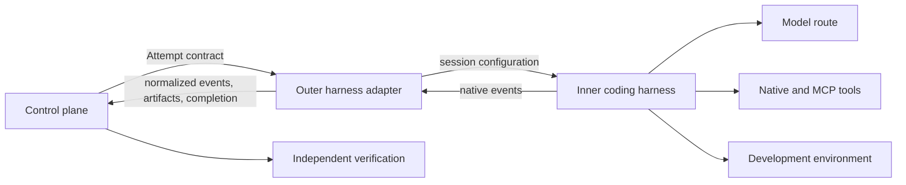
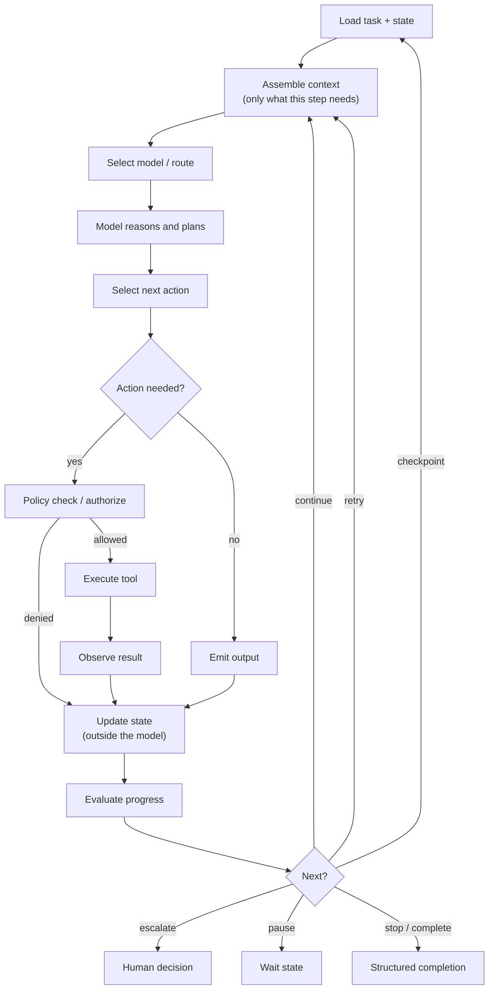
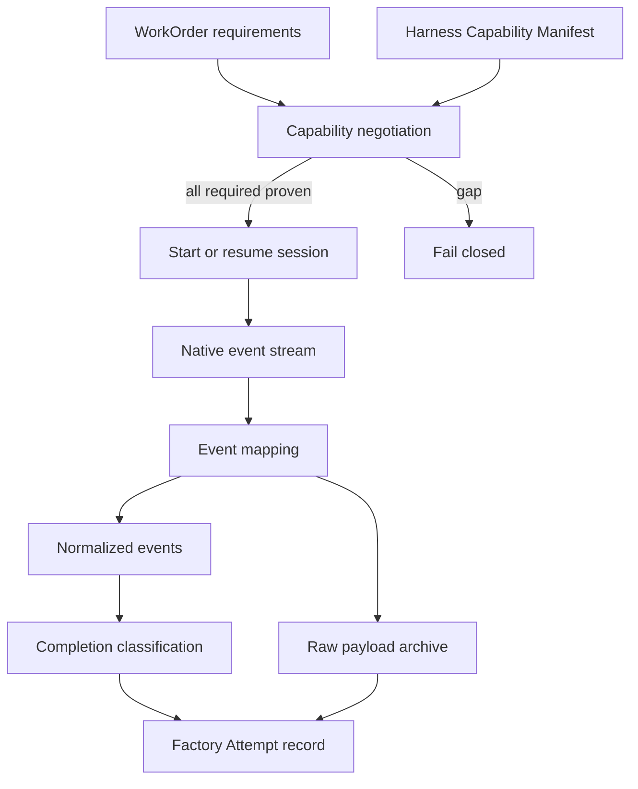
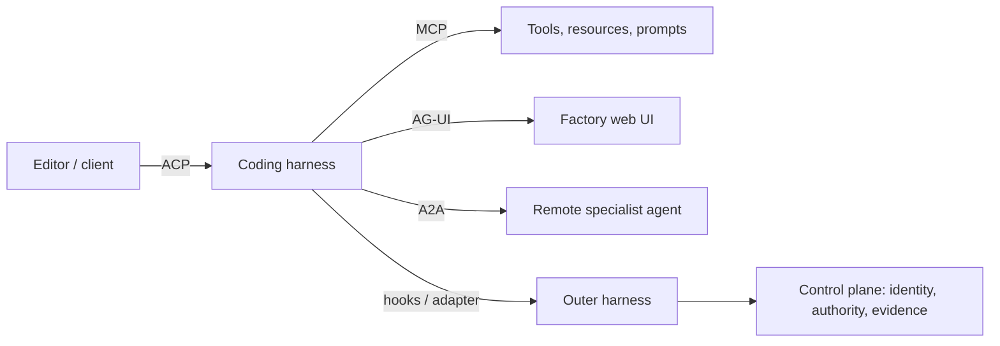

# 13. Coding harnesses and agent protocols

The control plane from the previous two chapters can dispatch an Attempt, but something still has to run the model-and-tools loop that writes code. That something is a **coding harness**: Claude Code, Codex, Pi, OpenCode, Amp, Devin, Factory, or one you build. This chapter explains how to make a harness operable inside a factory without depending on its terminal output, how to keep your own controls outside it, and which of the competing protocols (MCP, ACP, AG-UI, A2A) solves which problem. After reading it you should be able to specify an adapter contract, argue for or against wrapping a vendor harness, and explain why "the hook fired" is never the same as "the policy held."

## The problem

Interactive coding tools were designed to collaborate with a person sitting in front of them. A human reads the terminal, approves a prompt, notices that a session has gone quiet, fixes an expired login, and decides whether the agent's "done" is credible. A factory has none of those affordances. Its workers start hundreds of times, run concurrently, outlive an HTTP request, and get destroyed after one Attempt. Every judgment the human used to make must become a structured, machine-verifiable equivalent.

Harnesses also differ from each other in almost every dimension that matters: tools, permission models, session formats, hooks, subagents, context behavior, output events, sandboxes, and completion semantics. A factory that shells out to a CLI may look provider-neutral while silently depending on an undocumented transcript file, a line of terminal text, or one product's lifecycle quirks. Swap the CLI and the factory breaks in ways nobody can name.

Protocols promise to fix this and partly do, but each one standardizes a single boundary. No protocol connects models, tools, editors, user interfaces, remote agents, development environments, and factory governance at once. And harness products change monthly, so any feature matrix baked into the architecture is stale before it ships. The durable design object is a **capability contract** plus a **conformance suite**, not a ranking of products.

## How it works

### Two harnesses around one loop

Two terms need pinning down before the split. An **AI Coding Harness** is an agent harness specialized for repository work: code search, file edits, commands, tests, Git operations, and development feedback. What it enables is **Autonomous Coding**, bounded software-engineering work that the agent may pursue across several tool-use steps without continuous human input. That phrase describes execution autonomy only; it never means autonomous approval, merge, or release, and a product integration that claims the label must still identify which inner- and outer-harness responsibilities it implements.

The word "harness" hides two different jobs. The **inner harness** owns one model-tool loop. It prepares model input, manages context, exposes tools, executes tool calls under its own permission model, streams observations, compacts or resumes the session, and decides when the loop stops. That is what Claude Code or Codex does when you type a prompt.

The **outer harness** makes that loop operable inside the factory. It validates the frozen manifest, provisions the environment, starts or resumes the inner harness, converts native events into the factory's schema, enforces budgets and timeouts, requests policy decisions, captures artifacts, classifies completion, and tears down resources. It is the thing HumanLayer's Dexter calls the outer harness and the thing many teams have quietly built as a pile of shell scripts.

An analogy that holds: the inner harness is a skilled temp worker who arrives with their own toolbox and habits. The outer harness is the site foreman who signs them in, hands them one work order, watches the clock, keeps them out of areas they are not cleared for, collects the timesheet and the finished part, and walks them out. The foreman does not tell the worker how to hold a drill. The worker does not decide what gets shipped.

Neither harness owns Mission approval, WorkOrder acceptance, independent verification, publication authority, merge, or release. Those stay in the control plane and the verification path described in [Chapter 11](./11-control-plane-orchestrator-and-execution-plane.md) and [Chapter 21](../04-prove/21-quality-and-evidence-architecture.md).

<!-- infographic: inner-outer-harness -->
> **Infographic — Inner and outer harness.** *(Jay's graphic goes here.)* Until then, the diagram below
> carries the same concept.

### What the harness owns

Inner and outer together, the harness is where probabilistic reasoning meets deterministic control. The model reasons about the task. The harness controls which model runs, what context it receives, which tools it can invoke, what state persists, how much budget remains, how many retries are left, which execution environment it stands in, when it must stop, and what evidence gets recorded. That is not a loop around an LLM. It is the execution boundary that turns an LLM into an operable enterprise capability.

*The model reasons. The harness controls.*

The full list of harness responsibilities, with the side of the seam each usually lands on:

| Responsibility | Typically owned by |
|---|---|
| Model invocation | Inner |
| Agent lifecycle (start, resume, pause, cancel, terminate) | Outer, driving the inner |
| Context assembly | Inner, from a package the outer freezes |
| State (what persists between steps and across crashes) | Outer, in the durable state machine ([Chapter 12](./12-durable-execution.md)) |
| Tool discovery | Inner, from a registry the outer scopes |
| Tool execution | Inner, behind a gateway the outer authorizes |
| Permissions | Outer, through the control plane; the inner harness's own permission model is a convenience, not the boundary |
| The execution loop | Inner runs it; outer bounds it |
| Budget and timeouts | Outer |
| Checkpoints | Outer records; inner may create |
| Recovery | Outer |
| Observability | Both; the outer normalizes what the inner emits |
| Evaluation hooks | Outer |
| Human intervention | Outer, surfacing structured decision requests |

Where a vendor harness already covers a row, the outer harness's job is to verify that it does so truthfully and to keep an independent record. Where it does not, the outer harness supplies it. Either way the rows that touch authority (permissions, budget, stopping, evidence) belong outside the model and outside any component the model can talk into changing.

*The harness turns probabilistic intelligence into bounded execution.*

### The execution loop

Every harness runs the same loop underneath its product surface. Making it explicit is the fastest way to see where control lives.

<!-- infographic: execution-loop -->
> **Infographic — The execution loop.** *(Jay's graphic goes here.)* Until then, the diagram below carries the same concept.

Read it as the heartbeat of the agent. Each beat loads the task and its current state, assembles only the context this step needs, selects a model, lets the model reason and propose an action, and then does the thing that separates a harness from a chat client: a policy check before any tool runs. The tool executes, its result is observed, and state is updated outside the model, in the durable record, not in the transcript. Then the runtime evaluates progress and picks one of continue, retry, checkpoint, escalate, pause, stop, or complete.

Two properties of the loop carry the whole design. The model proposes the next action; the runtime decides whether that action is permitted and whether the loop continues. And every input to the next beat comes from persisted state, so a beat that starts on a different worker after a crash sees the same world.

### A harness is not a software factory

It is tempting to look at the loop above, note that it already has budgets and policy checks and checkpoints, and conclude that the harness is the factory. It is not. A harness executes an agent; a software factory governs the work. The harness knows about one run: its task, its state, its tools, its budget. The factory knows about intent, plans, WorkOrders, acceptance criteria, independent verification, evidence, review, delivery, and what to learn afterwards, none of which a run can see or decide. The harness's structured completion is the factory's input, not its conclusion. That is why the harness does not own approval, verification, merge, or release, and why the control plane in [Chapter 11](./11-control-plane-orchestrator-and-execution-plane.md) sits above it rather than inside it.

### Where the seam sits: thin or thick

You choose where to put the seam between the two. Buy a rich inner harness that ships with a browser, testing, subagents, and compaction, and your outer harness can be thin, little more than the skills you inject and the loop that drives it. Or take a thin, configurable inner harness such as Pi or OpenCode, where you set up every behavior yourself, and build a thick outer harness around it. Dexter's framing on the HumanLayer and BAML livestream is that Claude Code is "bring it and it's good," while Pi "comes with control but you have to build more." Both are legitimate; they are different bets on where your team's effort goes.

The same tradeoff shows up in the adapter itself. A **thin adapter** preserves native features and exposes the control plane to provider differences. A **thick adapter** normalizes behavior across providers but may erase useful capabilities or invent a false lowest-common-denominator abstraction. The practical answer is to translate only the events and commands the factory contracts require, and to preserve the native payloads as diagnostic artifacts alongside the normalized stream. Think of a travel power adapter: it converts the plug shape so the factory can connect, but it does not pretend every appliance behaves the same.

### Loops inside loops: harness engineering as a discipline

Dru Knox at Tessl uses "inner" and "outer" for a different but complementary idea, and it is worth holding both in your head. His **inner loop** is everything the agent iterates on before a pull request exists: plugins, skills, the test suite, the fast, cheap checks the agent runs constantly. His **outer loop** runs at the PR boundary: slower, more expensive checks that replace human review time, such as agentic QA that drives the product, deeper code review, mutation testing, and targeted verifiers. His **meta loop** sits around both, watching logs, PRs, the issue tracker, and user feedback for mistakes that slipped through, then feeding a fix back into the inner or outer loop so the same mistake is made only once.

The two vocabularies reconcile cleanly. The harness is the machine; the loops are what you run through it. Inner-loop improvements drive autonomy (fewer human corrections). Outer-loop improvements drive automation (less human review before acceptance). The meta loop, which [Chapter 33](../06-improve/33-governed-learning-and-compounding-engineering.md) treats in depth, drives quality. Knox's name for the practice of building all three is **harness engineering**, and he is candid about why it is hard: the field changes weekly, the work is fundamentally unplanned and competes with shipping, and the signals you need are hidden in local logs or in someone's head until you move the workflow onto legible surfaces.

### Headless execution and the structured event stream

The first concrete decision is how the outer harness talks to the inner one. Every serious harness offers a **headless** or non-interactive mode that emits typed events or a stable structured stream, usually JSON Lines. BAML's team, for example, runs Claude Code and Codex headless with a streaming JSON output, and reads the JSONL transcript the harness writes: either tailing the file as it grows or scooping it up when the session ends. Both work. What does not work is parsing the pretty terminal rendering, which changes with every release and encodes no completion semantics.

The analogy is a flight data recorder versus listening through the cockpit door. Terminal text may remain a diagnostic artifact, but the authoritative completion contract must be the structured stream. And process exit zero never means the engineering task is complete; it means the process stopped.

For every session the factory should retain:

- adapter version and native session identity;
- harness configuration, model route, instructions, and tool grants;
- context digest and environment digest;
- the ordered event stream and its ordering guarantees;
- exit state and structured completion, including unresolved work; and
- references to raw artifacts (native transcript, logs, diffs).

### Lifecycle, sessions, checkpoints, and compaction

A harness session is a stateful thing that the factory needs to drive from outside. A portable **harness lifecycle** covers capability discovery and version negotiation; preflight and configuration validation; start, attach, resume, pause, cancel, drain, and terminate; user input and structured human-decision requests; model, tool, file, command, subagent, progress, warning, and cost events; permission and policy-decision callbacks; checkpoints, compaction, and session identity; structured terminal completion and unresolved-work reporting; artifact and receipt export; classification of timeout, crash, malformed output, and unavailable provider; secret redaction and content-retention controls; and environment teardown and reconciliation.

Two items deserve emphasis. **Session resume** means the outer harness can reattach to a session after a worker crash or lease expiry and continue, which only works if the native session identity was recorded before the first tool call and the environment still exists. **Compaction** is the inner harness summarizing its own context to stay under the window; the factory must know when it happened, because evidence gathered before a compaction may no longer be in the model's view, and a checkpoint taken across a compaction boundary is a different object from one taken within it. Dexter lists compaction and testing among the choices the inner harness makes for you when you buy it and that you make yourself when you build it.

### Hooks are integration points, not authority

Most harnesses expose **lifecycle hooks**: callbacks on session start, tool calls, file changes, subagent spawn, permission requests, stop, and completion. They are useful for logging, policy callbacks, credential injection, validation, notifications, and cleanup. HumanLayer uses a stack of them.

But a native hook is not automatically trustworthy. Before relying on one for anything consequential, the factory must know whether it is synchronous or fire-and-forget, bypassable by a flag or a config edit, ordered relative to other hooks, retryable, authenticated, and covered by the harness's own configuration hierarchy (user, project, enterprise). A hook in a user-editable settings file is a smoke detector wired to your phone: valuable, and not the fire code. Consequential policy belongs in an external authoritative control path or a qualified enforcement point, per [Chapter 7](../02-design/07-governance-policy-and-risk-proportional-approval.md).

Hooks are also where cross-harness portability dies. Claude Code and Codex do not have the same hooks. Pi's are different again. OpenCode has a plugin system in which hooks are a separate concept entirely. Dexter's diagnosis is that every harness is, underneath, its own bespoke UI, and the hook model is part of that UI. Even the instruction file is contested: Claude Code reads `CLAUDE.md` while most other tools converged on `AGENTS.md`, and the vendors have not agreed to share. Expect to maintain both.

### Driving to completion with bounded loops

The outer harness is also where "keep going until it is actually done" lives. BAML's practice is instructive because it is so plain: a hard-coded while loop that reruns the agent against CodeRabbit review comments until the PR is mergeable, with a maximum of three iterations, after which the loop boots the work out to a human. That number is the **maximum review iterations** parameter: an outer-loop setting, owned by the harness rather than the model, that caps how many review-and-fix cycles a single Attempt may consume before the work is escalated. Nobody is notified until either the reviewer bot is satisfied or the budget is spent. A second loop, which they were adding at the time, babysits an approved PR against a moving main branch until it merges: an **agentic merge queue**, covered in [Chapter 32](../06-improve/32-production-feedback-review-and-the-agentic-merge-queue.md). The pattern to retain is: bounded iterations, a deterministic exit condition, and a human handoff when the bound is hit. An unbounded "fix until green" loop is a spend incident waiting to happen.

### The adapter contract and the capability manifest

The outer harness talks to a specific inner harness through an **adapter**. Each adapter publishes a **Harness Capability Manifest** that declares, truthfully, which lifecycle behaviors it supports and which it does not. Unsupported behavior must be visible, not silently absent, and adapters should fail closed: if a WorkOrder requires a capability the harness cannot prove (say, cancellation mid-tool-call, or verified session resume), the adapter refuses the work rather than pretending.

<!-- infographic: harness-adapter-contract -->
> **Infographic — The harness adapter contract.** *(Jay's graphic goes here.)* Until then, the diagram below
> carries the same concept.

Substitutability is never global. Two adapters are substitutable only for a specified workload and policy set. One may be eligible for read-only repository analysis and ineligible for code mutation or long-running recovery. The manifest plus the conformance results (below) are what let the orchestrator make that call per WorkOrder.

### Protocols and their boundaries

Four protocols come up constantly, and they are not competitors. Each standardizes messages at one boundary.

| Protocol | Primary boundary | Useful for | Does not establish |
| --- | --- | --- | --- |
| **MCP** (Model Context Protocol) | Agent or host to tools, resources, prompts, and extensions | Tool discovery and invocation | Business authority, trustworthy tools, or acceptance |
| **ACP** (Agent Client Protocol) | Coding agent to editor or client | Portable agent/editor sessions and interaction | Factory workflow, environment qualification, or release governance |
| **AG-UI** | Agent backend to user-facing application | Bidirectional event streaming, state, tool, and user interaction | Durable domain authority or independent verification |
| **A2A** (Agent2Agent) | Independent agent application to agent application | Capability discovery, delegation, messaging, remote task coordination | Permission to delegate factory authority or trust a remote agent |

A plumbing analogy: a pipe-thread standard guarantees the pipes join. It says nothing about whether the water is safe to drink. MCP created what Dexter calls an ecosystem explosion precisely because it fixed one narrow join, letting agent builders, harness builders, and integration builders mix and match. It did not make any tool trustworthy.

The acronym ACP is ambiguous in the wider ecosystem; this guide uses it for the Agent Client Protocol associated with editor-agent interoperability (Zed's), and any design that depends on its behavior must pin the specification or implementation version. On the livestream, Dexter's assessment is that ACP is the right idea for the control-plane-to-harness seam but quite narrow, and that a thicker, wider interface is needed for a coding harness to talk to a UI, an editor, or a web app. AG-UI is good at broadcasting UI events. Neither supports hooks, which is exactly what an outer harness needs: the ability to lifecycle a harness and react to its events.

Vaibhav's counterpoint is that a good abstraction here may not be possible yet, because harnesses differ by design and the abstraction "by design can't be that good." His hopeful analogy is React: the web looked unabstractable until someone noticed that state is all you need and the rest falls out. Nobody has found the equivalent primitive for harnesses. Until they do, expect to wrap each one.

Protocols coexist. An editor talks to a coding agent through ACP; that agent reaches tools through MCP; a factory UI receives events through AG-UI; a remote specialist is contacted through A2A. In every case the control plane still authenticates principals, scopes authority, freezes contracts, reconciles state, and evaluates evidence. Protocol identity is never authority.

<!-- infographic: protocol-boundaries -->
> **Infographic — Where each protocol lives.** *(Jay's graphic goes here.)* Until then, the diagram below
> carries the same concept.

### The dated landscape, and the bet on owning it

Product names belong in dated case studies; contract vocabulary belongs in the canon. As of this writing (verified 2026-08-30), Codex and Claude Code are the two most useful case studies: both offer a CLI, an SDK or programmatic mode, hooks, tool and permission models, session persistence, and automation features, each on a different model, local/cloud split, and lifecycle. Pi and OpenCode are the configurable, build-your-own end. Amp, Devin, Factory, Gemini's agent, and vendor "cloud agents" such as Cursor's and Cognition's bundle harness, environment, and orchestration together. That is the line between a **vertically integrated stack**, where one vendor supplies model, harness, environment, and orchestration as a single product, and a **composable stack**, where each layer is a separately chosen component behind an interface you own; the first is faster to adopt, the second is easier to leave. The same line separates **managed execution**, where the vendor runs the harness on its own fleet, from a **self-hosted harness** that you run on your own workers with your own identity and network boundaries. Every one of these must be verified against current official documentation and a pinned runtime before use. The product name describes a suite of experiences; the factory integrates with one exact harness and version.

Why are there so many? Because, as Dexter puts it, a lot of people are betting that owning the harness is worth a lot of money, the way owning the browser and owning mobile turned out to be. That bet is why vendors keep their hooks and instruction files different, and why you should assume APIs will keep breaking. The vendors' incentive is not your portability.

For the factory that means a build-versus-buy decision made deliberately, not by drift. Wrapping a mature harness gives rapid capability and creates adapter work each time native behavior changes. Building an inner harness gives control and demands sustained investment in tool execution, context management, model integration, permissions, user experience, and safety. Tessl's experience with off-the-shelf orchestrators applies to harnesses too: great for getting from zero to half, then a black box owning your SDLC grates. Their answer, and HumanLayer's, is a swappable harness behind an interface you own.

**Lock-in and exit** should be part of the design from day one. **Provider lock-in** is the condition in which switching harness or model vendor would cost more than the switch is worth, because transcripts, instructions, skills, and evidence exist only in one vendor's shape. An **exit strategy** is the documented, rehearsed path out: what you keep in your own format, which adapter you would qualify next, and how long it would take. Keep native transcripts and normalized events both. Keep skills and instructions in the repository in a form more than one harness can read. Keep the adapter conformance suite so that a second adapter can be qualified when needed. The exit is not "we could switch"; it is "we ran the same workload through two adapters last quarter and here are the traces."

## How to build it

### Steps

1. Write the outer-harness lifecycle as a contract first, harness-agnostic, using the lifecycle list above. Mark each item required, optional, or unsupported for your first workloads.
2. Pick one inner harness and pin an exact version. Read its headless mode, event schema, transcript format, hook model, and configuration hierarchy from official documentation, not from memory.
3. Build a thin adapter that translates only the required events and commands, archives raw payloads, and records native session identity before the first tool call.
4. Publish the adapter's capability manifest. Every "no" must be explicit.
5. Run the conformance suite (below) and keep the results next to the manifest.
6. Add the outer-harness loops: budgets, timeouts, bounded fix-until-green with a human exit, and completion classification.
7. Route policy through the control plane, using hooks only as observation and callback points.
8. Only then consider a second adapter, and qualify it against the same suite for the same workload.

### Adapter conformance suite

Test behavior, never product names. A driving test checks that the driver stops at the light; it does not ask what brand the car is. The suite should cover:

- capability truthfulness, including unsupported features failing closed;
- event ordering, duplication, loss, and redaction;
- cancellation before, during, and after tool effects;
- timeout and process-crash recovery;
- permission denial and human-decision waits;
- context compaction and session resume;
- out-of-scope filesystem and network attempts;
- output-schema violations and false completion;
- model or provider fallback visibility;
- teardown and orphan detection; and
- exact lineage from native session to factory Attempt.

Promotion of a new adapter or version additionally requires negative tests, version-upgrade tests, cancellation races, content-redaction tests, and live canaries.

### What each adapter ships with

- pinned manifest and compatibility range;
- conformance results;
- security review;
- event mapping, with known loss of fidelity written down; and
- rollback path.

### Harness-engineering practices that transfer

These are drawn from teams running factories today and apply to whichever harness you choose.

- Outlaw local configuration. Tessl checks every skill, hook, and workflow into the repository so an improvement improves everyone and the compounding loop actually compounds.
- Make every touchpoint legible. Work starts as an issue, runs through a headless agent in a sandbox, lands as a PR, and feedback lives on the PR, so the meta loop has durable surfaces to read.
- Separate fast inner-loop checks from expensive outer-loop checks; run the expensive ones once at the PR boundary and let the agent iterate on their results.
- Add **verifiers**: small, cheap, deterministic-in-practice LLM lint rules scoped by glob to catch every mistake you have ever seen an agent make, so the general review is not a laundry list.
- Bound every autonomous loop with a max-iteration count and a human handoff.
- Track manual takeovers and human PR comments as the metrics for autonomy, and PRs initiated without human input as the metric for automation, holding quality constant.
- Budget harness-engineering time explicitly; it is unplanned work that competes with shipping and never happens by accident.

## Failure modes

**Terminal scraping masquerading as integration.** Symptom: the adapter breaks on a harness update and nobody knows why. Detect by grepping the adapter for regexes over stdout. Fix by moving to the structured stream and treating text as diagnostics.

**Exit zero treated as done.** The process ended; the task did not. Detect with completion classification that reads the structured terminal event and unresolved-work report. Every Attempt should be able to end in "stopped, incomplete."

**Hook as policy.** A user-editable settings file is the only thing stopping a destructive command. Detect by asking, for each consequential control, where it is enforced if the hook is deleted. Fix by moving enforcement to the control plane or a qualified enforcement point.

**Silent capability gaps.** The manifest says "supports cancel," and cancel during a tool call leaves a half-applied migration. Detect with the conformance suite's cancellation races. Fix by narrowing the manifest and failing closed.

**Lowest-common-denominator adapter.** The thick adapter erased subagents and compaction events, so the factory cannot see why context vanished. Detect by diffing native and normalized traces for the same run. Fix by archiving raw payloads and adding native-extension envelopes.

**Unbounded fix loop.** Fix-until-green never converged and burned the budget overnight. Detect by cost events per iteration. Fix with max iterations and a human exit.

**Lost lineage.** A native session cannot be tied to a factory Attempt after a crash. Detect by resume tests. Fix by recording native session identity before the first tool call and treating it as part of the Attempt record.

**Protocol identity mistaken for authority.** An A2A peer or an MCP tool is trusted because it speaks the protocol. Detect by tracing any UI event, editor session, remote delegation, tool call, or native event back to one authorized Attempt; if the trace fails, so does the trust.

**State updated inside the model.** The only place "step three is done" exists is the model's context; a compaction or crash loses it and the loop repeats step three. Detect by asking where the loop reads state from at the start of each beat. Fix by updating state outside the model and loading it back in.

**Tool before policy.** The inner harness executes a tool call and the policy check happens, if at all, in a log review afterwards. Detect by tracing one consequential tool call and looking for the authorization decision that preceded it. Fix by putting the policy check between action selection and tool execution, in the outer harness or gateway.

**The harness that thinks it is the factory.** Budgets and checkpoints inside the loop are mistaken for governance, and the harness's "complete" flows straight to merge. Detect by asking who verified the result independently of the process that produced it. Fix by treating structured completion as an input to the control plane.

**Vendor drift.** Hooks, instruction files, or event schemas change under you. Detect with version-upgrade tests in the suite. Mitigate with pinned versions, dual instruction files, and a second qualified adapter.

## In Mission Control

At study commit [`d902fae`](https://github.com/jaydubya818/MissionControl/tree/d902fae7032c0696b531c44ae88829c652516fc6), Mission Control defines a provider-neutral harness lifecycle, exact capability manifests, structured results, Execution Manifest bindings, persistent-worker and remote-sandbox backends, and a `codex/v1` adapter. It separates executing harnesses from independent verification and publication authority. That is implemented as architecture and contract.

Partial or unproven: the studied Codex and DeepSeek capability manifests declared MCP unsupported, and no first-class production MCP gateway was verified. There is no evidence of an ACP, AG-UI, or A2A bridge, no cross-harness conformance suite, and no complete proof of session resume or of behaviorally equivalent substitution between adapters. Generic harness architecture was present while production execution remained unconfigured.

Future: one canonical harness contract with explicit optional capabilities and native-extension envelopes; each adapter shipping with pinned manifest, compatibility range, conformance results, security review, event mapping, known loss of fidelity, and rollback path; protocol bridges terminating at a policy-aware gateway so any event can be traced to one authorized Attempt.

## Retain this

- The inner harness runs one model-tool loop; the outer harness makes it leasable, observable, cancellable, and accountable. Neither approves, verifies, merges, or releases.
- Integrate through the structured event stream and the JSONL transcript, never the terminal rendering. Exit zero is not completion.
- Record native session identity, model route, tool grants, context and environment digests, and the ordered event stream for every session.
- Hooks are observation and callback points. Consequential policy lives in the control plane.
- A harness is only substitutable for a named workload and policy set, proven by a conformance suite that tests behavior, not brands.
- MCP joins agents to tools, ACP joins agents to editors, AG-UI joins agents to UIs, A2A joins agents to agents. None confers authority or trust.
- Bound every autonomous loop; hand off to a human when the bound is hit.
- Vendors are betting on owning the harness. Keep your exit: dual instruction files, archived raw traces, and a second qualified adapter.
- The model reasons; the harness controls. The harness owns model invocation, lifecycle, context assembly, state, tool discovery and execution, permissions, the loop, budget, timeouts, checkpoints, recovery, observability, evaluation hooks, and human intervention.
- The loop is the heartbeat: load state, assemble context, route, reason, propose, policy-check, execute, observe, update state outside the model, evaluate, then continue, retry, checkpoint, escalate, pause, or stop. The model proposes; the runtime permits.
- The harness turns probabilistic intelligence into bounded execution. A harness executes an agent; a software factory governs the work.

## Go deeper

- [Chapter 11. Control plane, orchestrator, and execution plane](./11-control-plane-orchestrator-and-execution-plane.md) — where the Attempt contract that the outer harness receives is defined.
- [Chapter 12. Durable execution](./12-durable-execution.md) — leases, heartbeats, and the recovery semantics session resume must honor.
- [Chapter 14. Development environments, sandboxes, and compute](./14-development-environments-sandboxes-and-compute.md) — the layer beneath the harness.
- [Chapter 15. Agent architecture: loop, MCP, tools, context, and memory](./15-agent-architecture.md) — what happens inside the inner harness.
- [Chapter 18. Agent and loop engineering](./18-agent-and-loop-engineering.md) — inner, outer, and meta loops in full.
- [Chapter 32. Production feedback, automated review, and the agentic merge queue](../06-improve/32-production-feedback-review-and-the-agentic-merge-queue.md) — the CodeRabbit loop and merge queue in context.
- [Chapter 7. Governance, policy, and risk-proportional approval](../02-design/07-governance-policy-and-risk-proportional-approval.md) — why enforcement cannot live in a hook.
- [Glossary](../appendix/glossary.md) — inner harness, outer harness, adapter, capability manifest, ACP, AG-UI, A2A, MCP.
- [Mission Control capability, workflow, and admission map](../appendix/mission-control/03-capability-workflow-and-admission-map.md), assessed at `d902fae`.
- Source transcripts: HumanLayer × BAML livestream, "Software factory design patterns" (Dexter and Vaibhav) — inner/outer harness, headless JSONL, bounded CodeRabbit loop, ACP/AG-UI/hooks, the harness bet; Dru Knox (Tessl), AI Engineer SF conversation and talk on harness engineering — inner/outer/meta loops, verifiers, legible surfaces; Jay West, factory architecture notes — what the harness owns, the execution loop, harness versus factory.
- Primary references: [Model Context Protocol specification](https://modelcontextprotocol.io/specification/2026-07-28), version 2026-07-28; [Zed: Agent Client Protocol](https://zed.dev/acp), accessed 2026-08-30; [AG-UI protocol overview](https://docs.ag-ui.com/), accessed 2026-08-30; [A2A Protocol specification](https://a2a-protocol.org/dev/specification/), accessed 2026-08-30; [OpenAI: Unrolling the Codex Agent Loop](https://openai.com/index/unrolling-the-codex-agent-loop/), accessed 2026-08-30; [Claude Code: programmatic execution](https://code.claude.com/docs/en/headless) and [hooks](https://code.claude.com/docs/en/hooks), accessed 2026-08-30.
