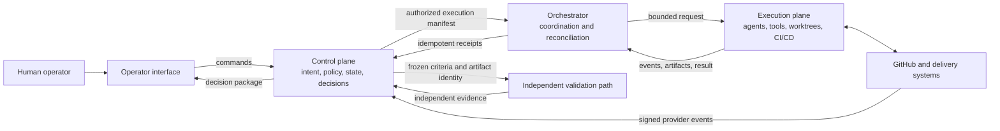
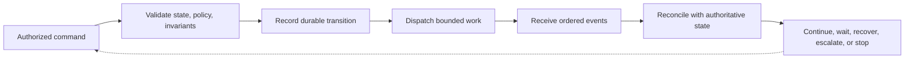
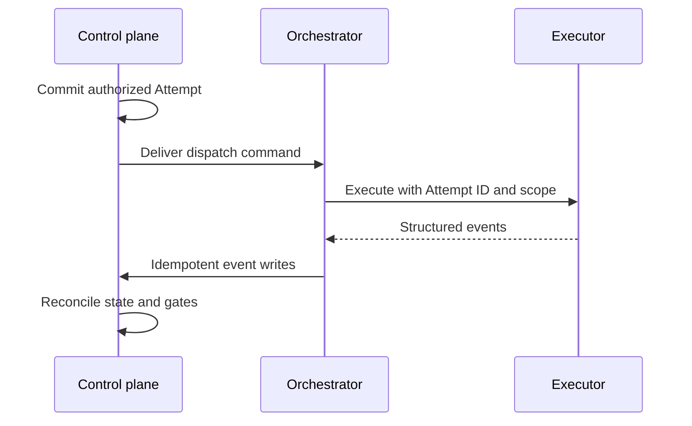
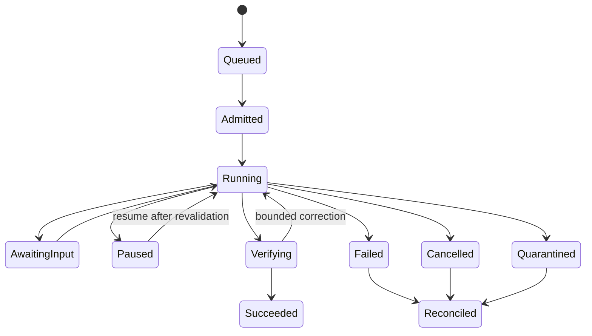
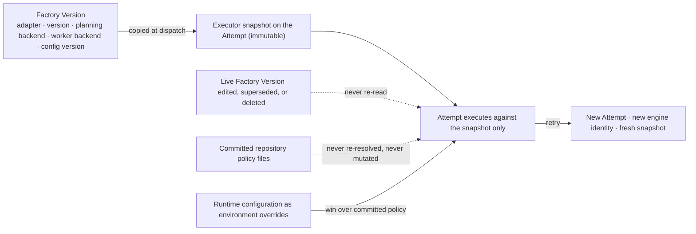

# 13. Control plane, orchestrator, and execution plane

A factory has to do two things that want very different machinery: decide what work is allowed, and actually do the work. Deciding needs consistency, durability, and an audit trail. Doing needs long-running processes, subprocesses, worktrees, model streams, and tolerance for crashes. This chapter separates the two into a **control plane** and an **execution plane**, puts an **orchestrator** at the boundary between them, and then names every component and contract that makes the arrangement hold under real failure. After reading it you should be able to place any responsibility in the correct plane, trace one command and one event across the boundary, and explain why an executor's "done" is never the same thing as the factory's "accepted".

## The problem

Approving a WorkOrder does not execute it. Between authorization and a review-ready pull request lies a distributed process that may run for minutes or hours, cross process and provider boundaries, survive restarts, wait for human decisions, and receive duplicated or delayed events. An agent conversation is not a sufficient runtime for that process. If the conversation ends, the work must still have an authoritative state, an owner, a budget, and a recovery path.

When one process owns both decisions and effects, execution quietly becomes authority. A worker widens its own scope, marks itself successful, retries without a budget, or keeps going after its approval expired. Push everything the other way, into the workers, and the organization loses any reliable answer to the question "why was this action permitted?"

The opposite design fails too. A database-oriented backend should not be responsible for every model stream, subprocess, worktree, compiler, browser, and deployment connection. Those workloads have different time limits, resource needs, security boundaries, and recovery behavior, and a backend with short function limits will strangle them.

This is harder than a traditional pipeline because agentic workflows make decisions *during* execution. A worker inspects the repository, forms a hypothesis, picks tools, revises its approach, and produces artifacts nobody predicted when the workflow began. That flexibility is the point, and it is exactly why the authority envelope around the worker matters. Meanwhile execution crosses unreliable boundaries the whole time: processes crash, hosts restart, networks partition, webhooks arrive twice or out of order, leases expire, credentials get revoked, a branch advances after evidence was recorded, and models return plausible but unsupported claims. None of these are edge cases. They are the normal weather of a long-running distributed workflow, and a row of mutable status labels cannot describe them.

## How it works

### The control plane decides; the execution plane performs

Think of an air-traffic control tower and the aircraft it directs. The tower owns the plan, the clearances, and the record of who was allowed to do what and when. The aircraft fly. A pilot reports position and requests clearance; the pilot does not issue clearance. If the radio drops, the tower's record still stands and the tower decides what happens next. That is the relationship between the two planes.

The **control plane** owns governed intent and the rules for changing authoritative state. The **execution plane** consumes a bounded grant of authority, performs effects, and returns observations. Execution results may inform a decision, but they never approve themselves.

<!-- infographic: control-vs-execution-plane -->
> **Infographic — Control plane versus execution plane.** *(Jay's graphic goes here.)* Until then, the diagram below carries the same concept.



The orchestrator sits at the boundary. It sequences work and reconciles events, but it does not own the authority it coordinates. If it can approve its own plan, change policy, widen repository scope, or accept its own evidence, the separation has failed.

The control plane owns:

- human and service identity;
- Company, Workspace, Repository, and environment scope;
- versioned Factory Configuration;
- Mission, Plan, WorkOrder, and acceptance contracts;
- policy evaluation and risk classification;
- approvals, exceptions, budgets, and autonomy ceilings;
- dispatch eligibility and idempotency;
- leases, lifecycle state, cancellation, and retry authority;
- evidence requirements, freshness, waivers, and acceptance;
- immutable audit history; and
- the operator's required decision and safe options.

It may calculate projections and recommendations. It should not perform repository mutation simply because it stores the WorkOrder.

The execution plane owns:

- model and agent runtime processes;
- repository checkout and attempt-specific worktrees;
- tool invocation and subprocess management;
- implementation, tests, builds, and browser operations;
- ephemeral runtime context;
- ordered execution events;
- output artifacts and hashes;
- heartbeats, local cancellation, and health signals; and
- interaction with authorized CI/CD or deployment systems.

It may report completion. It may not convert that report into acceptance or grant itself another attempt.

### Ownership, not topology, defines the plane

Teams often confuse where something runs with what it is responsible for. A React application may display control-plane data, but the browser cannot be the authority boundary; a disabled button is not a policy. A Node server may coordinate work while some of its code belongs logically to control and some to execution. A database may store execution events without performing the execution. The plane is determined by what a component *owns*, not where it is deployed. The practical consequence is that a prototype running everything on one laptop should still keep the logical boundary in its interfaces and state ownership, so that the pieces can be separated later without rewriting the authority model.

The table below is the reference for who owns what.

| State | Authoritative owner | Why |
| --- | --- | --- |
| Intent and acceptance criteria | Control plane | They express human-governed purpose |
| Approval and policy decision | Control plane | Execution cannot grant itself authority |
| WorkOrder and Attempt lifecycle | Control plane | Durable recovery requires one shared truth |
| Process-local progress | Execution plane | The running worker observes it first |
| Durable execution event | Control plane after validated ingestion | Operators need replayable history |
| Working files in an active worktree | Execution plane | They are transient effects of the Attempt |
| Commit, PR, and CI facts | Source provider, referenced by control plane | GitHub remains authoritative for GitHub state |
| Evidence acceptance | Control plane | A receipt is an input to governance, not the decision itself |

Note the two rows that are neither plane. External systems remain authoritative for their own facts. The factory owns the governance decision *about* those facts, never the facts themselves.

### The interface is an execution contract

The control plane dispatches an immutable **execution manifest**: a frozen description of exactly what the worker may do. At minimum it identifies:

- Mission, Plan, WorkOrder, Task, and Attempt;
- exact repository, base commit, branch, and worktree;
- Factory Configuration, workflow, executor, model, and policy versions;
- allowed tools, paths, network access, secrets, and environment;
- acceptance criteria and required evidence;
- cost, time, token, concurrency, and retry budgets;
- lease, heartbeat, cancellation, and expiry rules; and
- idempotency and correlation identifiers.

A worker should reject a manifest it cannot satisfy. It must never silently weaken isolation or substitute an unauthorized environment. Executors become replaceable precisely because they all consume one stable manifest and emit one stable event contract.

Coming back the other way, execution returns ordered events and artifacts. Each event carries an Attempt identity, sequence number, timestamp, producer, correlation identifier, and bounded metadata. The control plane treats delivery as **at-least-once** unless the transport proves otherwise, which means idempotency and reconciliation are part of correctness, not optional hardening.

A more general form of the same idea is the **runtime contract envelope**, which every command crossing a component boundary should wear:

```json
{
  "contractVersion": "1.0",
  "correlationId": "mission-184",
  "commandId": "cmd-991",
  "idempotencyKey": "attempt-7:tool-4",
  "actor": {"identity": "workload://worker/42", "grant": "grant-83"},
  "subject": {"type": "attempt", "id": "attempt-7", "version": 12},
  "tenant": "tenant-a",
  "classification": "confidential",
  "deadline": "2026-08-30T18:30:00Z",
  "budget": {"toolCalls": 20, "tokens": 90000, "costUsd": 8.0},
  "payload": {},
  "policyDecision": "decision-51",
  "traceContext": "00-...",
  "replyContract": "tool-result@2"
}
```

A consumer authenticates the sender, validates scope and schema, compares the expected state version, reserves capacity, persists acceptance, and only then dispatches. It returns a durable acknowledgement that is distinct from completion. Results bind the exact input digest, environment, dependency versions, outputs, costs, errors, side-effect receipt, and any unresolved uncertainty.

### The questions orchestration has to answer

Orchestration does not matter while work is one prompt and one answer. It starts to matter the moment work modifies repositories, calls services, waits on dependencies, runs tasks in parallel, retries, and has to coordinate the results. At that point five questions decide whether the workflow is sound, and none of them is a reasoning question:

1. What runs in parallel?
2. What must wait, and on what?
3. What shares mutable state?
4. What happens when one branch fails?
5. What requires a human checkpoint?

These are distributed-systems and workflow-engineering questions. Two agents modifying the same repository is a coordination problem, not a reasoning problem, and no amount of model quality makes it one. The design consequence is to separate the intelligence that does the reasoning from the orchestration that controls the workflow. The model can propose a plan and propose each next action; the platform decides what runs, in what order, under what authority, and what happens when something breaks.

*The control plane manages the work. Workers execute the work.*

*The model doesn't own the workflow. The platform does.*

The point is easy to nod at and easy to violate. A workflow that lives inside a single long model conversation, where the model "remembers" which tasks are done and decides for itself when to try again, has put orchestration inside the component least able to hold it: one that has no durable state, no notion of a lease, no idempotency, and no way to answer the five questions after a crash. Answer them in the orchestrator, in records, before the first token is generated.

### Commands request; events report; state is derived under rules

The orchestrator connects the two planes without becoming a second source of truth. Its working vocabulary has three words. A **command** expresses intent: dispatch, pause, resume, cancel, retry, approve. A command may be rejected. An **event** reports an observed fact: process started, command completed, artifact produced, validation failed. Events do not automatically grant authority for the next action. **State** is derived from commands and events under explicit rules, and only the state owner performs transitions. Events may request or inform a transition, but they never mutate the projection directly.

<!-- infographic: dispatch-loop -->
> **Infographic — The dispatch loop.** *(Jay's graphic goes here.)* Until then, the diagram below carries the same concept.



The loop is **event-driven**: something arrives (a command from a human, an event from a worker, a signed webhook from a provider, a timer), the orchestrator validates it against the current authoritative state, records a durable transition, and decides the next bounded step. It never advances on the strength of an assumption about what a worker probably did.

State machines define the legal transitions and their guards. The runtime invariants worth writing on the wall are:

- no execution before an approved, current contract;
- at most one active Attempt for a Task unless parallelism is explicit;
- terminal records do not silently reopen;
- completion cannot bypass required validation or acceptance;
- cancellation prevents new work even if late success arrives;
- every external side effect has a stable idempotency key;
- retries create new history rather than rewriting failed history; and
- every transition identifies actor, reason, time, governing version, and evidence.

### Persist before crossing an unreliable boundary

The safe pattern is to record the command before dispatch, attach a stable identity, and reconcile the eventual result. This is what prevents an HTTP timeout from turning into uncertainty about whether work was ever authorized.



Exactly-once delivery is generally unavailable across process and provider boundaries. Aim instead for at-least-once delivery with **effectively-once effects**: stable keys, atomic claims, conditional writes, and reconciliation against provider truth. [Chapter 14](./14-durable-execution.md) works through leases, fencing, and idempotency keys in detail.

### The lifecycle exists at several levels

Mission, WorkOrder, Task, Attempt, workflow step, tool call, pull request, and release each have their own state machine. A lower-level terminal state never implies a higher-level decision. An Attempt may complete while its Task awaits review; a Task may finish while its WorkOrder still lacks acceptance evidence. Collapsing these levels is how "the agent said it's done" becomes "it shipped".

The workflow-and-attempt machine below names every state a run can be in.

<!-- infographic: orchestration-state-machine -->
> **Infographic — The orchestration state machine.** *(Jay's graphic goes here.)* Until then, the diagram below carries the same concept.



Three points deserve emphasis. **Queued** and **Admitted** differ: admission is where budgets, concurrency, and capacity are reserved, so a queue never creates an invisible promise. **Verifying** is a real state, not a flag on completion; the transition back to Running is a *bounded correction*, and Succeeded is reached only when an independent quality contract passes. And every unhappy terminal state (Failed, Cancelled, Quarantined) leads to **Reconciled**, because the factory does not know that a failed run left nothing behind until it has checked.

Waiting is a real state too. Paused, blocked, awaiting approval, and awaiting evidence are not failures; they identify what prevents progress and who or what can resolve it. Each wait state carries a reason, an owner, a deadline, the required action, and its automatic resume behavior. Resume is never a plain "continue": it revalidates the manifest, source versions, policy, grants, leases, capability qualification, budgets, and environment. If any governing input has changed materially, create a new Attempt or an explicit replan rather than pretending continuity.

### Reconciliation is part of orchestration

The control plane must periodically compare its records with executor, repository, CI, and delivery-provider facts. **Reconciliation** handles lost responses, late events, expired leases, stale approvals, and provider actions that happened outside the factory. It repairs projections or escalates ambiguity without erasing history. Expect the execution plane to fail: workers crash, hang, duplicate events, lose connectivity, and produce incorrect output. The control plane answers with leases, timeouts, bounded retry, cancellation, stale-evidence rules, and explicit reconciliation. A retry is a new Attempt with a recorded reason and a new hypothesis. Resume is valid only when the executor can prove deterministic checkpoint semantics. An expired lease prevents new effects but does not erase late events; the control plane retains and classifies them without letting them overwrite the authoritative outcome.

### Independent validation is a separate execution path

Validation belongs to the governance model, but it runs through an execution path separate from implementation. The control plane freezes the criteria and the artifact identity. The validator receives no authority to alter the implementation it evaluates. It emits independent evidence, and the control plane decides whether that evidence satisfies policy. Different people or models can strengthen independence, but the technical separation is what is essential: separate execution identity, a clean environment, independent commands, fresh evidence, and immutable receipts. [Chapter 27](../04-prove/27-quality-and-evidence-architecture.md) and [Chapter 31](../04-prove/31-quality-contracts-proof-packages-and-certificates.md) build on this.

### Pluggable execution engines: who decides what

The execution plane's most capable component is usually not something the factory wrote. It is an **execution engine**: a coding harness, an epic-delivery engine, or any product that can take a task and produce a change, composed into the factory as a harness adapter ([Chapter 15](./15-coding-harnesses-and-agent-protocols.md)). Engines are good at deciding *how* to plan and implement, and every one of them arrives with opinions about planning, gates, stories, worktrees, and what "done" means. The control plane's job is to accept the first and refuse the rest. The authority split is short enough to memorise:

<!-- infographic: engine-authority-split -->
> **Infographic — Control plane, engine, human: who decides what.** *(Jay's graphic goes here.)* Until then, the table below carries the same concept.

| Question | Decided by | Never decided by |
| --- | --- | --- |
| Whether anything executes, and what (which WorkOrder, which scope, under which manifest) | Control plane | The engine, however confident its plan |
| How it is planned and implemented (decomposition, order of work, tool choice inside the frozen scope) | The engine | The control plane, which does not micromanage a turn |
| Whether the result is verified (frozen Verification Plan, exact Candidate, separate verifier) | Control plane | The engine's own gates |
| Whether a pull request exists (published through the factory's own GitHub App, from a permitted Candidate) | Control plane | The engine; its workers never push, and their allowed remotes are empty |
| Whether the WorkOrder is accepted (`workOrders.accept` or its equivalent, the single acceptance command) | Control plane, on a human decision | Anything else, including a green engine gate |
| Whether the change merges | A human, on the source provider | Every automated actor in a first version |

Two consequences follow from the table and are worth stating as rules, because every engine integration is tempted to break them.

*A completed engine run is not an accepted WorkOrder.* When the engine reports done, the control plane records an event, collects the Candidate, and starts verification. Engine "done" is necessary and never sufficient, and engine "done" without a candidate SHA is not even that: it moves the WorkOrder to BLOCKED, because there is nothing to verify.

*Engine-produced gates are evidence, not verdicts.* An engine that runs its own command and test gates is producing something the factory is glad to have and will store as evidence. A failed engine gate makes the Attempt FAILED and the WorkOrder BLOCKED; it never makes anything DONE, and a passed engine gate never substitutes for the factory's independent verification, because the process being checked cannot be the process doing the checking.

Cancellation follows the same direction of authority. A control-plane cancel command calls the adapter's cancel operation, which stops the engine; cancellation wins over any late success until terminal success has been durably reported, and a stop that itself fails still leaves the Attempt canceled with the cleanup outcome recorded rather than the engine quietly continuing. The engine never cancels the WorkOrder; it only stops working on it.

### The executor snapshot

Executors change. Adapters get new versions, planning and worker backends get swapped, the Factory Version gets edited, superseded, or deleted, and repository policy files get committed over. None of that may change what a historical Attempt meant, or what a running Attempt is allowed to do. The record that guarantees this is the **executor snapshot**: at dispatch, the control plane copies the complete executor configuration onto the Attempt itself, and the Attempt reads only that copy for the rest of its life.

<!-- infographic: executor-snapshot -->
> **Infographic — The executor snapshot.** *(Jay's graphic goes here.)* Until then, the diagram below carries the same concept.



The snapshot names the adapter, the adapter version, the planning backend, the worker backend, and the configuration version. Four rules make it worth having.

*The Attempt never re-resolves.* It does not re-read the repository's policy files, and it does not look up the live Factory Version. If the Factory Version is edited, superseded, or deleted an hour into the run, the running Attempt is unaffected and the historical Attempt's semantics are unchanged; the edit applies to the next dispatch.

*Retry is a new Attempt with a new engine identity.* A retry copies a fresh snapshot from the then-current Factory Version, and the engine's own identifier for the work (its epic, session, or run id) is new too. Reusing the engine identity would let a retry inherit the failed try's state, and it would make two Attempts share one lineage in the engine's records.

*Backends are frozen as a pair on the Factory Version.* The planning backend and the worker backend are selected together and versioned together, because an engine qualified with one pair has not been qualified with another. Where the backends authenticate through the operator's existing local CLI login rather than API keys, the snapshot records which login identity the pair was admitted under and the factory holds no long-lived engine credentials of its own.

*Environment overrides win, and committed policy is never mutated.* Runtime configuration reaches the engine as environment overrides that take precedence over whatever policy the repository has committed, so that the factory can bound an engine per Attempt without editing files in the worktree. The committed repository policy is never rewritten per Attempt; if it were, the diff the engine produces would carry the factory's configuration into the Candidate.

### Admission: what an engine adapter may never hold

The control plane admits an adapter, not an engine. **Admission** is the decision that a particular adapter version may be selected for governed work, and it has three parts: the adapter's maturity, evidenced by its conformance results; the **required external controls** the control plane must supply around it; and the **prohibited authorities** the adapter must demonstrably lack. The mechanics of the adapter (its lifecycle, result contract, capability manifest, and event mapping) are in [Chapter 15](./15-coding-harnesses-and-agent-protocols.md). The control plane's side is the two lists.

An adapter is prohibited from holding six authorities, and the prohibition is checked, not declared: **worker leases** (it cannot claim or renew ownership of an Attempt), **verification subjects** (it cannot create the record that names what will be verified), **verification plans** (it cannot decide which checks run), **evidence authority** (nothing it emits is a receipt), **GitHub publication** (it cannot open, update, or push to a pull request), and **acceptance** (it cannot advance a WorkOrder). An adapter that can do any of these is not an adapter; it is a second control plane.

Five controls must exist outside the adapter before it is admitted: the **canonical worker lease** held by the factory's own worker runtime; the **sandbox policy** that bounds filesystem, network, and process for the Attempt; **repository-scope reconciliation**, which compares changed files, commits, and head SHA against the frozen code scope before anything is review-ready; **independent verification** through a separate verifier Attempt; and the **publication permit** that gates the GitHub App. The factory's worker selects the adapter and then runs those five itself, so that switching engines changes the adapter and nothing else; there is no engine-specific worker path.

Two admission rules are about posture rather than mechanism. An experimental adapter is flag-gated, off by default, and not admitted to remote sandbox execution until it has cleared the same evidence bar as the production adapter. And an engine's unattended or "full-auto" mode is not admitted at all in a first version: the admitted posture is manual approve-then-run, with the approval attested by the control plane rather than by the engine's own prompt.

### Policy hooks and the grains of authority

The control plane enforces policy at named points rather than by inspecting everything all the time. A **policy hook** is one of those points: a place in the lifecycle where the orchestrator stops, hands the current state and the proposed next effect to the policy engine, and proceeds only with an allow, a deny, or a condition. The hooks that every factory needs are the same short list: before dispatch (is this manifest still authorized?), before each tool call with a side effect, before publication, before merge, before release, before a learning candidate is promoted, and on every resume. Each hook records the policy version it consulted and the decision it received, which is what makes the control plane's audit trail more than a log of things that happened: it is a record of why each thing was permitted.

The reason hooks are separate points, and not one big "is this allowed?" check, is that authority comes in grains, and the grains are held by different people. The two most often fused are these. **Merge authority** is the grant to move a reviewed candidate into the trunk; it belongs to the repository's owners and is exercised, in this guide, by a human on a decision packet. **Release authority** is the grant to expose a merged change to users; it belongs to whoever owns the service's availability and risk, and it is often a different person, a different policy, and a different hook. A change can be mergeable and not releasable (a feature behind a flag awaiting a launch decision), or releasable in one environment and not another. Treating the two as one grant is how a merged pull request quietly becomes a deployment nobody decided on. The same argument separates plan approval from dispatch, and dispatch from acceptance: every grain is a distinct grant with a distinct hook and a distinct approver, and the control plane records which grain each decision spent.

Between merge and release sits **controlled rollout**: exposure widened in steps (a canary cohort, a percentage, a region) with health gates and a rollback path between steps, so that release authority is exercised over a bounded blast radius rather than all at once ([Chapter 32](../04-prove/32-cicd-progressive-delivery-and-production-verification.md)). The control plane's job is not to run the rollout, which existing delivery tooling does well, but to hold the decision record for each widening and to refuse the next step when its gate has not passed.

The factory applies the same discipline to itself. **Governed promotion** is the rule that a change to the factory's own configuration (a prompt, a skill version, a routing weight, a policy) becomes active only through a promotion hook, with evidence, an approver proportional to the change's blast radius, and a rollback. **Regression gates** are the evidence that hook demands: the candidate, compared with the current baseline on the frozen evaluation set, may not fall below the declared thresholds on any protected measure, and no aggregate improvement excuses a failed hard gate ([Chapter 29](../04-prove/29-evaluation-engineering.md)). The pull-quote that governs the learning side of the book, *learning can be autonomous; promotion should be governed*, is developed in [Chapter 40](../06-improve/40-governed-learning.md); its control-plane meaning is simply that the promotion hook is a hook like any other, and that discovery, however automated, never gets to skip it.

What ties the grains together is **traceability**: from any effect in the world (a commit, a deployment, a configuration change) back through the hook that allowed it, the decision recorded there, the policy version consulted, the evidence presented, the manifest it ran under, and the intent it served. The correlation spine of [Chapter 35](../05-operate/35-observability-telemetry-and-forensics.md) carries the identifiers; the hooks are where the decisions get written down. A control plane whose hooks do not record their decisions has authority without traceability, which is the auditor's definition of no authority at all.

### The component model

A model call is not a runtime. Production orchestration must route intent, freeze context and capability versions, manage durable state, authorize every side effect, withstand duplicates and outages, stop nonconverging work, produce independent evidence, and support human intervention. When those responsibilities live implicitly inside an agent loop, failure becomes unreproducible and authority becomes ambiguous. The component catalog names the families that carry them. These are responsibilities and interfaces, not deployment units; a small first version can implement several in one modular application.

| Family | Responsibility | Authoritative input | Owned output | Explicit non-responsibility |
|---|---|---|---|---|
| Intent and capability router | Classify request and choose an eligible workflow family | Intent, actor, inventory, risk, catalog | Routing decision with confidence and fallback | Changing intent or granting authority |
| Workflow and agent controller | Advance durable graph, dispatch, join, pause, cancel, reconcile | Approved plan, manifest, events | Workflow state and commands | Performing arbitrary tool effects |
| Prompt and context compiler | Assemble instruction hierarchy and immutable context | Task, policy, source selections, budgets | Prompt/context package with lineage | Treating retrieved text as authority |
| Model gateway and router | Select approved model profile and mediate inference | Task profile, policy, availability, cost | Model response, usage, version, finish state | Accepting task completion |
| Retrieval coordinator | Generate, filter, rank, and attribute candidates | Retrieval request and identity | Candidate and context-selection records | Altering source permissions |
| Tool and function manager | Validate, authorize, invoke, deduplicate, reconcile | Tool call proposal, grant, schema | Result, side-effect receipt, error | Broad workflow planning or approval |
| Session, state, and memory manager | Maintain scoped working state and governed durable memory | Events, policy, retention | Versioned state snapshots and memory proposals | Promoting observations to authority |
| Policy and authorization enforcer | Decide action eligibility and issue scoped grants | Identity, subject, action, resource, context | Allow/deny/condition decision and grant | Business acceptance |
| Guardrails and validation | Validate inputs, outputs, plans, actions, and artifacts | Exact subject and quality/policy contract | Findings, scores, eligibility inputs | Producer self-certification |
| Reliability controller | Apply timeout, retry, backoff, circuit break, fallback, compensation | Error taxonomy, operation contract, state | Recovery command and reconciled result | Retrying unknown side effects blindly |
| Observability, audit, evidence, and forensics | Correlate runtime facts and convert eligible proof | Events, traces, artifacts, evaluator results | Telemetry, audit, proof references, forensic bundle | Reconstructing authority from logs |
| Budget, rate, capacity, and concurrency controller | Admit and constrain resource use fairly | Priority, quota, costs, capacity, deadline | Reservation, limit, charge attribution | Overriding safety stop conditions for throughput |

The last column is the one to read first. Each family is defined as much by what it may *not* do as by what it does, and the pattern is always the same: no single dependency (a model, a retrieved document, a tool result, a log) is allowed to become the source of truth for the whole run. The model gateway, retrieval coordinator, prompt compiler, and memory manager get their own treatment in [Chapters 18](./18-agent-architecture.md) through [21](./21-models-and-capability-selection.md); the reliability controller is the subject of [Chapter 14](./14-durable-execution.md).

### What a control plane is for, in practice

Strip away the formal vocabulary and the practitioners building factories today describe the same surface. In the HumanLayer and BAML "software factory design patterns" conversation, the control plane is called the most interesting and underserved layer of the stack, and its job list is concrete: dispatch new work; look at session traces; look at the plans and architecture docs being produced; schedule things to run every night, on a cron, or in response to webhooks; review and iterate on the code itself in a PR-shaped way that does not necessarily have to happen in GitHub; manage permissions and audit, who can talk to what and who can see which services; manage spend and budgeting; and, on top of all that, the compounding-engineering memory that turns "every engineer on the team is telling the agent the same thing" into an improvement in the outer harness ([Chapter 40](../06-improve/40-governed-learning.md)).

Their physical description of the piece is also instructive. Each developer machine runs a small web server exposing a REST API; a hosted web application listens to Linear, Slack, GitHub, and everything else, receives their webhooks, keeps the database, and talks to the per-machine servers. They call that hosted piece the **dispatcher**, and it is the orchestration layer. It is the same shape as the diagram at the top of this chapter with the names changed.

Jay's own framing of Mission Control makes the same list from the governance side. The coding agent performs tasks; the control plane determines what work should happen, which agent should perform it, what tools it may use, what evidence is required, which human must approve, whether the outcome is safe, what it cost, what happened in production, and what the system should learn. That is the difference between "another coding-agent product" and the operating platform for autonomous engineering.

Why, then, is there no widely adopted open-source control plane? The same conversation offers a candid answer. Nobody wants someone else's control plane unless it already carries all their integrations, and code is now cheap enough that teams write their own. Everyone building one wants to sell it. And every company's working style has different definitions, starting with what counts as an issue: the "input control plane" that decides whether untrusted feedback from another user's agent becomes real work is specific to each team. Interface layers will standardize first, as MCP did for tools; an open control plane arrives only after enough factories have been watched succeed and fail. The lesson for a builder is to own the interfaces and state ownership in this chapter even if you buy or borrow every component around them.

### The factory control plane's responsibility list

Once a factory runs many loops rather than one governed corridor, the control plane's job list widens, and it is worth reconciling the widened list with the ownership list at the top of this chapter so that nothing is assumed to live somewhere else. Practitioners who run loop-based factories describe the **factory control plane** as owning sixteen things: loop inventory, scheduling, triggers, permissions, identity, model configuration, context deployment, skill versions, policy, budgets, observability, logs, evals, verification, dashboards, and promotion. Grouped, and mapped to this chapter:

| Responsibility | Where this chapter already places it | What widens when loops multiply |
| --- | --- | --- |
| Loop inventory | Factory Configuration; the system inventory of [Chapter 5](../02-design/05-authoritative-records.md) | Every recurring loop is a registered, owned system, not a cron entry |
| Scheduling and triggers | Dispatch eligibility; webhook and scheduled runs above | Triggers become a governed input class: which event may start which loop |
| Permissions and identity | Human and service identity; grants | Loops act as principals with ceilings of their own |
| Model configuration | Model gateway and router | Routing rules are versioned factory state, not per-agent settings |
| Context deployment | Prompt and context compiler | Which context version is live in which loop ([Chapter 19](./19-data-knowledge-and-semantic-engineering.md)) |
| Skill versions | Execution manifest bindings | Skill deployment and drift detection ([Chapter 11](./11-the-agent-factory.md)) |
| Policy | Policy evaluation; enforcer | Unchanged in kind; applied to loops as well as Missions |
| Budgets | Budgets and ceilings; budget controller | Per-loop and per-period budgets beside per-Mission ones |
| Observability and logs | Observability, audit, evidence, forensics | Loop-level dashboards beside Attempt-level traces |
| Evals | Guardrails and validation | The eval registry and its cadence ([Chapter 29](../04-prove/29-evaluation-engineering.md)) |
| Verification | Evidence requirements; independent validation path | Verifier inventory and verifier quality |
| Dashboards | Operator's required decision and safe options | The four-dimension dashboard of [Chapter 8](../02-design/08-economics-metrics-and-human-attention.md) |
| Promotion | Autonomy ceilings; versioned configuration | Governed promotion of skills, context, routing, and loops themselves |

The rule that comes with the list is the one this chapter has been arguing from the start, said from the buyer's side: *don't build every runtime; own the control plane.* Runtimes, harnesses, sandboxes, and models are the commodity layer ([Chapter 38](../05-operate/38-enterprise-adoption-and-the-infrastructure-landscape.md)); the control plane is where an organisation's definition of correct, its permissions, its budgets, and its evidence live, and it is the one layer nobody else can supply.

### The universal meta-harness and outcome-driven execution

[Chapter 15](./15-coding-harnesses-and-agent-protocols.md#the-meta-harness-one-governance-layer-across-many-harnesses) introduces the meta-harness as the governance layer across many harnesses. Seen from the control plane, it has a second job that the governance framing does not name. A **universal meta-harness** constructs or selects the workflow needed for an outcome rather than executing a predetermined one: given a goal, its constraints, and a verification contract, it decides the decomposition, the workers, the skills, the strategy, and the verification. That is **outcome-driven execution**, execution governed by verifiable outcomes rather than prescribed steps, and its instruction has one shape: *produce X subject to Y and prove A through F before completion.* X is the outcome; Y is the constraints, budget, and scope; A through F are the claims in the verification contract ([Chapter 27](../04-prove/27-quality-and-evidence-architecture.md#the-verification-contract)).

Nothing in that changes who owns authority. The meta-harness chooses *how*; the control plane still froze *what*, *within which bounds*, and *what counts as proof* before the meta-harness ran, and it still receives the evidence and makes the decision afterwards. Outcome-driven execution is what the frozen execution manifest permits when the WorkOrder is well specified and the verification contract is complete; it is not an exemption from either. The more completely an outcome can be specified and independently verified, the more of the workflow the meta-harness may be allowed to choose.

### Factory ownership

The build, buy, or bring decisions of [Chapter 2](../01-understand/02-the-factory-in-one-view.md) reduce, for the control plane, to one sentence: *owning your factory means owning what correct means and controlling how work is produced and verified.* Everything else can be adopted. Concretely:

| Own | Adopt |
| --- | --- |
| Intent and its records | Models |
| Standards and the Definition of Correct | Runtime components and harnesses |
| Context and its lifecycle | Sandboxes and execution environments |
| Skills and their registry | Infrastructure and compute |
| Policies, budgets, and ceilings | Commodity tooling |
| Evals and verifiers | |
| Outcomes and their measurement | |

The left column is the factory's identity; the right column is its plumbing. A vendor can replace anything on the right without the factory changing what it produces or how it proves it. A vendor that owns anything on the left has become the factory, and the organisation has become its customer.

## How to build it

### Trade-offs you will make

Separation adds infrastructure and latency. The factory needs service identity, command signing, event ingestion, idempotency, health checks, and reconciliation. A control-plane-only architecture is operationally simple but becomes fragile when database functions have short execution limits or when work needs persistent streams, subprocesses, local repositories, and long-lived leases. A fully distributed execution architecture scales and isolates workloads but multiplies partial failures and makes exactly-once effects harder to prove; durable commands plus idempotent reconciliation are more realistic than assuming reliable delivery.

Centralized orchestration makes policy and sequencing easy to understand but can become a bottleneck or a single failure domain. Distributed orchestrators improve availability only if they share one authoritative control-plane state and cannot create competing ownership.

On state storage: a database-driven orchestrator is simple and observable but creates polling load and contention. A queue improves delivery and backpressure but adds an operational system. A workflow engine offers durable timers and retries but can duplicate domain state if it becomes the business source of truth. Event sourcing provides excellent history but increases projection and schema complexity. Durable records plus append-only event streams is a pragmatic middle ground. The important choice is never the brand of queue or engine; it is the location of authority and the invariants around transition. A general workflow engine supplies durable execution but not factory-specific authority, evidence, or capability semantics; a custom loop is simple but quickly accumulates hidden state and recovery debt. Start with deterministic graphs and isolated probabilistic steps.

Parallelism reduces lead time but increases conflicts, cost, and coordination. Bound concurrency by dependency graphs, repository isolation, budget, and merge strategy rather than maximizing it by default. And the control plane may govern an existing deployment system rather than replace it, which preserves delivery investments but requires a precise mapping between factory decisions and provider state.

### Build sequence

1. Define the authoritative records (Mission, Plan, WorkOrder, Task, Attempt) and their state machines in the control plane before writing any executor. See [Chapter 5](../02-design/05-authoritative-records.md).
2. Write the execution manifest schema with every field listed above. Hash it and store the digest on the Attempt.
3. Write the event contract: Attempt identity, sequence, timestamp, producer, correlation identifier, bounded metadata, idempotency key.
4. Implement the orchestrator loop: validate, record, dispatch, ingest, reconcile, decide. Persist before every unreliable boundary.
5. Implement the executor adapter interface: capability discovery, configuration validation, estimates, ordered events, cancellation, optional resume, health. Have each adapter declare what it does *not* support.
6. Add independent validation as a separate path with its own execution identity and a clean environment.
7. Add periodic reconciliation against executor, repository, CI, and provider facts.
8. Wrap every cross-component command in the runtime contract envelope; version it.

### Stop conditions

Every loop needs measurable acceptance, budgets, stop conditions, and a recovery path. Safety limits are hard boundaries: a model cannot negotiate extra attempts, authority, or budget. Budget extension is a new human or policy decision.

| Condition | Detection | Terminal or intervention state | Required evidence |
|---|---|---|---|
| Acceptance satisfied | Independent quality contract passes | Verifying to Succeeded | Eligible proof package |
| Maximum attempts | Durable attempt count | Failed or escalate | Attempt summaries and last findings |
| Maximum tool calls | Gateway counter | Pause or Failed | Tool-call ledger |
| Elapsed-time budget | Monotonic deadline | Cancel or escalate | Deadline and control event |
| Token or monetary budget | Reserved plus actual usage | Pause before overrun | Usage and reservation ledger |
| No measurable improvement | Evaluator delta below threshold for N iterations | Stop correction; escalate or accept known gap by policy | Run comparison |
| Repeated equivalent failure | Normalized error fingerprint | Circuit open and escalate | Failure cluster |
| Human escalation requested | Decision event | AwaitingInput | Request, owner, deadline |
| Policy denial | Authorization decision | Blocked or Quarantined | Policy version and denial reason |
| Cancellation | Authorized command | Cancelled then Reconciled | Command and acknowledgements |
| Dependency unavailable | Health, timeout, circuit state | Retry, fallback, pause, or fail by contract | Dependency and fallback events |
| Irrecoverable system failure | Reconciliation cannot establish safe state | Quarantined | State snapshot and incident reference |

### Error and recovery taxonomy

Classify every failure before responding to it. The production orchestrator should recognize authorization, configuration, capacity, provider, executor, validation, repository, and internal-system failures, each with a permitted response:

- **Business rejection:** correct the plan or output; do not retry unchanged.
- **Deterministic contract error:** fail fast; fix schema or configuration.
- **Transient infrastructure error:** retry only idempotent work, with bounded exponential backoff and jitter.
- **Unknown external result:** reconcile using the idempotency key or a provider query before any retry.
- **Capacity or rate denial:** queue, shed, or route under policy; preserve fairness and deadlines.
- **Security or policy failure:** fail closed, preserve evidence, and contain.
- **Quality nonconvergence:** stop after the measured limit and escalate with the best artifact plus unresolved findings.

Fallbacks are prequalified substitutions, not improvisation. A fallback declares its semantic equivalence, its changed cost, latency, and quality, and any lower autonomy ceiling it imposes.

### Human intervention points

Humans approve material plans, exceptions, authority promotion, destructive or privileged actions, consequential release, disputed evidence, and learning promotion. Operators may pause, cancel, quarantine, reroute to an approved fallback, request evidence, or start reconciliation. The interface must show current state, pending effect, authority, evidence, uncertainty, alternatives, deadline, and recovery implication. The operator should see control-plane truth: current authority, actual execution, missing or conflicting evidence, safe recovery actions, and the decision required. Raw agent activity is drill-down detail, not the headline.

### Observability, capacity, and versioning contracts

All component families emit correlated spans, structured events, logs, metrics, and cost records using stable internal semantics. The minimum field set is workflow, task, attempt, actor, capability/model/tool/evaluator versions, state before and after, policy decision, environment, duration, usage, result class, and error fingerprint. High-cardinality identifiers belong in traces and events, not in unbounded metric labels. Evidence eligibility additionally requires exact subject binding, provenance, independence, freshness, and tamper protection ([Chapter 35](../05-operate/35-observability-telemetry-and-forensics.md)).

Define SLOs separately for admission, dispatch, model and tool latency, state commit, control actions, verification, and reconciliation. Reserve capacity for cancellation and containment so that stopping work is always possible. Use concurrency keys for repositories, environments, and privileged resources. Backpressure propagates to admission; queues never create invisible promises beyond the declared deadline or budget.

Contracts carry explicit versions and a producer/consumer support window. Additive fields require tolerant readers. Changed meaning or changed state semantics require a new major version, dual-read/write migration, replay tests, and rollback. Capability or policy revocation supersedes ordinary compatibility. Retain decoders for evidence and audit records for their full retention period ([Chapter 37](../05-operate/37-control-surfaces-event-contracts-and-storage.md)).

### Three release clocks

The versioning rule above is strict because the control plane's contracts are the slowest-moving thing in the factory. Not everything should move that slowly. A factory that ships models, skills, and runtime APIs on one release train either freezes its model routing to the pace of an API migration or exposes its durable contracts to the churn of a prompt tweak. Run three clocks instead.

<!-- infographic: release-clocks -->
> **Infographic — Three release clocks.** *(Jay's graphic goes here.)* Until then, the table below carries the same concept.

| Clock | What moves on it | Pace | Gate |
|---|---|---|---|
| Configuration | Models, prompts, routing weights, retrieval parameters | Fast, often daily | Evaluation against a frozen baseline; instantly reversible |
| Artifact | Skills and Agent Definitions | Slower artifact lifecycle ([Chapter 11](./11-the-agent-factory.md)) | Certification, canary, promotion with human authorization for scope increases |
| Contract | Runtime, APIs, execution manifest, event schema, durable records | Slowest | Compatibility discipline: support windows, tolerant readers, dual-read/write migration, replay tests |

The fast clock is safe precisely because the slow clock is stable: a routing change can be evaluated and rolled back in an afternoon only if the manifest, the event contract, and the state machine it runs on have not changed underneath it. Conversely, the contract clock can afford compatibility ceremony because it turns rarely. Mixing them is how a prompt change ends up blocked behind a schema migration, or a schema change gets waved through as "just config."

## Failure modes

**Split brain.** Two components each believe they own the WorkOrder or Attempt lifecycle, typically a coordinator that keeps its own status table alongside the database. Detect it by asking, for every state, which single record is authoritative; if the answer is "both, usually in sync", the design is broken. Fix it by making one plane own lifecycle and the other hold only a cache.

**Execution becomes authority.** A worker marks its own Task complete, widens its allowed paths, or retries past its budget. Detect it by looking for any write from execution identity into an authority field. Fix it by making completion an event that the control plane interprets, never a mutation the worker performs.

**The UI is the policy.** A control is disabled in the browser and everyone assumes the action is prevented. Detect it by calling the mutation directly. Fix it by enforcing in server-owned mutations and treating the client as a projection.

**Duplicate dispatch.** The same command is delivered twice and two workers start. Detect it through missing idempotency keys on dispatch. Fix with an atomic claim and stable command identity; the second delivery must return the recorded first result.

**Late success after cancellation or lease expiry.** A subprocess keeps running after its heartbeat is lost and reports success later. The invariant is that cancellation and expiry prevent new *authority*, not that late events vanish. Retain the event, classify it, refuse to let it reopen a terminal record, and reconcile any provider side effects it may have caused.

**Stale evidence.** Validation passes for an old head SHA, then the branch advances. Detect by binding evidence to exact artifact identity and comparing it at acceptance time. Fix by treating evidence freshness as a gate, not a suggestion.

**Crash between effect and record.** The orchestrator restarts after GitHub accepts a PR-creation request but before the response is recorded. Detect via reconciliation against provider truth using the operation's idempotency key. Fix by persisting intent before the call and querying the provider before any retry.

**The conversation is the workflow.** A multi-step delivery lives inside one long model session; the model tracks what is done, decides when to retry, and coordinates parallel work by remembering it. Detect it by asking, after a crash, which record says what completed. If the answer is "the transcript", orchestration has moved into the model. Fix by answering the five orchestration questions in durable records and letting the model propose only the next action.

**One release train.** A prompt change waits behind an API migration, or an event-schema change ships as configuration. Detect it by asking what gate a routing tweak passed through last week and whether the manifest schema has a support window. Fix with the three release clocks.

**Merge is release.** A merged pull request is deployed by the pipeline with no separate decision, so the person who approved a diff has unknowingly approved an exposure. Detect it by asking who holds release authority for the service and which hook recorded their decision for last week's deployments; if the answer is "the merge", the grains are fused. Fix by separating the merge hook from the release hook, with controlled rollout between them.

**Hooks without a record.** Policy is consulted, but the decision and the policy version are not written to the Attempt, so traceability stops at "it was allowed". Detect it by picking one production change and walking back to the policy decision that permitted it; if you reach a log line rather than a decision record, the hook is decorative. Fix by making every hook persist actor, policy version, decision, and evidence reference before the effect proceeds.

**Adapter exists, therefore the factory works.** Architecture diagrams collapse "we have an executor adapter" into "the end-to-end path is proven". Detect it by asking for the browser or runtime evidence of normal execution, policy rejection, cancellation, lost lease, duplicate event, validator failure, corrective Attempt, and exact GitHub lineage. Until all of those exist, the capability is a design, not a fact.

**Engine done treated as accepted.** The engine reports its terminal phase and a WorkOrder moves to DONE, sometimes without a candidate SHA. Detect it by looking for any WorkOrder transition whose actor is an adapter; fix it by mapping engine phases to tendencies only and routing acceptance through the single acceptance command on a human decision.

**Engine gate treated as verification.** The engine's own test gate passed, so the factory skipped its verifier. Detect it wherever a Quality Gate decision cites evidence produced by the same execution identity that produced the Candidate; fix it by classifying engine gates as evidence and requiring a separate verifier Attempt.

**Live configuration read mid-Attempt.** An Attempt re-reads the Factory Version or the repository's policy files during execution, so an edit made during the run changes what the run was allowed to do, and the historical record can no longer say what governed it. Detect it by editing a Factory Version during a canary Attempt and diffing behaviour; fix it with the executor snapshot and a retry-creates-new-Attempt rule.

**Engine-specific worker path.** A second engine arrived with its own worker, its own lease, and its own publication code, so the five required external controls now exist twice with different semantics. Detect it by asking how many places can push to the source provider; fix it by making the canonical worker select an adapter and run the same controls around it.

## In Mission Control

This section reflects Mission Control at commit [`8014d5a`](https://github.com/jaydubya818/MissionControl/tree/8014d5af427b43ff5c5a63cfdf82ec92742c208c) (studied 2026-08-08) and [`b31e275`](https://github.com/jaydubya818/MissionControl/tree/b31e27564deb1c03c167e61b5ee094567c2ba7b1) (studied 2026-08-09). The working tree contained unrelated in-progress changes at both points, so all claims refer to the pinned commits.

**Implemented.** The React operator interface connects to Convex through `ConvexReactClient` (Clerk optionally supplies user identity); it renders commands, state, approvals, exceptions, and evidence, but Convex mutations are the server authority. Convex is the durable source of truth for the domain hierarchy, Factory Configuration versions, WorkflowRuns, approvals, evidence, events, artifacts, GitHub integration records, and audit data. Governed WorkOrder dispatch evaluates the active Factory version, readiness assessment, configuration digest, repository and GitHub state, workflow, executor, policy, verifiers, host, budget, recovery controls, worktree, and concurrent mutation, and records the selected versions on the WorkflowRun. WorkOrder acceptance is a separate step, blocked by active execution, missing completed runs, failed criteria, stale evidence, or unsatisfied approvals. A standalone Hono service under `apps/orchestration-server` (the ADR originally said `packages/server`; the decision that Hono coordinates while Convex remains authoritative outlived the path) exposes authenticated routes for governed dispatch, already-dispatched execution, approval and receipt handling, Mission handoffs, validation results, acceptance, revisions, run events, and artifacts; production fails closed without an orchestration token, while development permits tokenless access that is not production evidence. `apps/workflow-executor` is a long-lived process that polls Convex for WorkflowRuns and executes steps through `@mission-control/workflow-engine`, with graceful shutdown and an optional health endpoint. The executor adapter interface defines capability discovery, configuration validation, estimates, execution events, cancellation, optional resume, and health. `CodexV1ExecutorAdapter` (`codex/v1`, the V1 executor) launches an ephemeral Codex CLI process, requires absolute and contained repository and working-directory paths, rejects upward traversal, requires a prompt, bounds timeouts, supports read-only and workspace-write isolation, ordered events, cancellation, bounded output, and basic credential redaction, and does not claim resume. Workflow definitions compile into linear or DAG graphs whose validation covers duplicate IDs, unknown dependencies, self-dependencies, cycles, conditions, output contracts, and bounded concurrency. WorkflowRuns retain a snapshot, steps, current step, status, retry counts, timestamps, and links to WorkOrders and Tasks. Run events carry sequence numbers and stable types for starts, steps, tools, commands, files, artifacts, checkpoints, retries, human intervention, pause, resume, failure, and completion; events and artifacts accept idempotency keys, and terminal failure or cancellation reconciles unfinished steps into failed, blocked, or skipped. GitHub webhook deliveries are recorded for replay and idempotency, head-SHA-specific PR and CI evidence is ingested, merge facts are retained, and GitHub stays authoritative for repository state.

**Partial.** Signed service commands: the orchestration service creates an HMAC envelope over service identity, capability, project, repository, command identity, time window, and payload digest, but only WorkOrder dispatch and receipt ingestion use it; there is no universal envelope across routes. The Attempt-specific worktree boundary is contracted and partially enforced; exact post-run changed-file enforcement is a stated gap that belongs to dispatch and the golden path before PR creation. Event reconciliation under duplicate, late, or lost delivery has idempotency records and sequencing but no comprehensive failure proof. The independent validator path exists in the domain and selected workflows, but end-to-end proof through the browser golden path was not completed. The generic coordinator still contains older task-decomposition behavior.

**Future.** The complete leased worker that turns a Factory-dispatched Attempt into an isolated worktree, Codex execution, GitHub branch, exact-lineage PR, and restart-safe completion was uncommitted todo-024 work at the studied commits; the retained golden-path lab stopped before execution. Autonomous deployment (Level 4 authority) is outside the first proof. The target is one explicit execution-manifest contract for every executor, hashed into the Attempt record with worker attestation; scoped workload identity, short-lived credentials, capability authorization, replay protection, and expiry on every control-to-execution command; validated, idempotent, ordered, lease-aware ingestion of every execution-to-control event; changed-file, commit, and head-SHA comparison against authorized scope before a PR is review-ready; clean-environment independent validation; one canonical command envelope, one atomic Attempt claim, explicit lease and heartbeat semantics, durable timers, bounded queues, and deterministic reconciliation. Promotion to proven capability requires restart tests, duplicate and out-of-order event tests, cancellation races, provider reconciliation, budget stops, exact source provenance, and a browser-operated PR from a clean commit without direct database repair.

| Capability | Status at studied commits |
| --- | --- |
| React-to-Convex operator path | Implemented |
| Durable control-plane state | Implemented |
| Versioned governed dispatch | Implemented mechanism |
| Standalone Hono orchestration | Implemented |
| Signed service commands | Partial |
| Executor adapter contract | Implemented |
| Attempt-specific worktree boundary | Contracted, partially enforced |
| Independent validator path | Domain and selected workflows; end-to-end proof incomplete |
| Event reconciliation under duplicate, late, or lost delivery | Partial |
| Leased, restart-safe worker to GitHub | Future (todo-024) |
| Autonomous deployment | Outside first proof |

No fresh browser journey or live executor run was performed for these assessments; they are source-backed architecture reviews, not proof that the complete Mission-to-pull-request path works.

The repository glossary and lexicon reviewed on 2026-09-02 state the authority split, executor snapshot, and admission rules in this chapter as the contract for composing a pluggable execution engine as a harness adapter: `workOrders.accept` remains the only acceptance command, the engine never creates the pull request and its workers hold no remotes, the snapshot is copied onto the Attempt at dispatch, and the six prohibited authorities and five required external controls are the admission checklist. That contract describes a flag-gated experimental adapter that is off by default and not admitted to remote sandbox execution; [Chapter 42](../06-improve/42-mission-control-as-a-living-case-study.md) pins what has and has not been demonstrated.

## Retain this

- The plane is defined by who owns authority and state, not by where code runs or what the UI shows. External systems (GitHub, CI) stay authoritative for their own facts; the control plane owns only the governance decision about them.
- Commands request, events report, and only the state owner derives state under explicit rules. Persist intent before crossing any unreliable boundary and expect at-least-once delivery — an immutable manifest going out and an idempotent event contract coming back are what make executors replaceable.
- Lifecycles are layered: an Attempt completing says nothing about Task review or WorkOrder acceptance. Waiting, reconciliation, and hard stop conditions are first-class states, not edge cases, and safety limits are never negotiable by a model.
- Orchestration answers five questions (parallel, wait, shared state, branch failure, human checkpoint) in durable records, never inside a model conversation: the control plane manages the work, workers execute it, and the platform owns the workflow.
- Policy is enforced at named hooks, each recording its policy version and decision. Authority comes in grains — merge and release are distinct grants with distinct approvers — and traceability is the walk from any effect back through its hook to the intent it served.
- With a pluggable execution engine, the control plane decides whether and what executes and the engine decides how: a completed run is not an accepted WorkOrder, engine gates are evidence rather than verification, and the executor snapshot frozen at dispatch means a live configuration edit never changes a running Attempt.
- Own what defines correctness — intent, standards, context, skills, policies, evals, outcomes — and adopt everything else. Don't build every runtime; own the control plane.

## Go deeper

- Next: [Chapter 14, Durable execution](./14-durable-execution.md) for Tasks, Attempts, leases, fencing, idempotency keys, and the reliability vocabulary.
- Related: [Chapter 5, Authoritative records](../02-design/05-authoritative-records.md); [Chapter 7, Governance and risk-proportional approval](../02-design/07-governance-policy-and-risk-proportional-approval.md); [Chapter 15, Coding harnesses and agent protocols](./15-coding-harnesses-and-agent-protocols.md); [Chapter 17, Development environments and sandboxes](./17-development-environments-sandboxes-and-compute.md); [Chapter 23, Agent and loop engineering](./23-agent-and-loop-engineering.md); [Chapter 25, The 12-layer stack](./25-the-12-layer-production-ai-agent-stack.md); [Chapter 32, CI/CD, progressive delivery, and production verification](../04-prove/32-cicd-progressive-delivery-and-production-verification.md) for controlled rollout under release authority; [Chapter 36, Resilience and the control tower](../05-operate/36-resilience-incidents-and-the-control-tower.md); [Chapter 40, Governed learning and compounding engineering](../06-improve/40-governed-learning.md) for the promotion hook applied to the factory's own learning; [Chapter 42, Mission Control as a living case study](../06-improve/42-mission-control-as-a-living-case-study.md).
- Glossary: [Appendix A](../appendix/glossary.md).
- Sources: HumanLayer × BAML livestream, "Software factory design patterns" (control-plane job list, the dispatcher, why no open-source control plane exists yet); Jay West, AI Software Factory mission notes ("Mission Control determines"); Jay West, factory architecture notes (the orchestration questions, the platform owning the workflow, release clocks, policy hooks and the grains of authority); the 12-layer production AI agent stack notes (Infrastructure and Loop Engineering); Mission Control repository glossary and lexicon, reviewed 2026-09-02 (the authority split for pluggable execution engines, the executor snapshot, prohibited authorities, required external controls, and cancellation semantics); public practitioner talks, 2026 (the factory control plane's responsibility list, the universal meta-harness and outcome-driven execution, factory ownership).
- Mission Control at `8014d5a`: [North Star](https://github.com/jaydubya818/MissionControl/blob/8014d5af427b43ff5c5a63cfdf82ec92742c208c/docs/product/mission-control-north-star.md), [V1 product strategy](https://github.com/jaydubya818/MissionControl/blob/8014d5af427b43ff5c5a63cfdf82ec92742c208c/docs/product/mission-control-v1-product-strategy.md), [ADR-001 orchestration architecture](https://github.com/jaydubya818/MissionControl/blob/8014d5af427b43ff5c5a63cfdf82ec92742c208c/docs/decisions/001-orchestration-architecture.md), [executor adapter contract](https://github.com/jaydubya818/MissionControl/blob/8014d5af427b43ff5c5a63cfdf82ec92742c208c/docs/architecture/executor-adapter-contract.md), [React entry point](https://github.com/jaydubya818/MissionControl/blob/8014d5af427b43ff5c5a63cfdf82ec92742c208c/apps/mission-control-ui/src/main.tsx), [Convex schema](https://github.com/jaydubya818/MissionControl/blob/8014d5af427b43ff5c5a63cfdf82ec92742c208c/convex/schema.ts), [governed WorkOrder commands](https://github.com/jaydubya818/MissionControl/blob/8014d5af427b43ff5c5a63cfdf82ec92742c208c/convex/workOrders.ts), [factory dispatch preflight](https://github.com/jaydubya818/MissionControl/blob/8014d5af427b43ff5c5a63cfdf82ec92742c208c/convex/lib/factoryDispatch.ts), [Hono service](https://github.com/jaydubya818/MissionControl/blob/8014d5af427b43ff5c5a63cfdf82ec92742c208c/apps/orchestration-server/src/index.ts), [signed service-command client](https://github.com/jaydubya818/MissionControl/blob/8014d5af427b43ff5c5a63cfdf82ec92742c208c/apps/orchestration-server/src/serviceCommandClient.ts), [executor adapter interface](https://github.com/jaydubya818/MissionControl/blob/8014d5af427b43ff5c5a63cfdf82ec92742c208c/packages/workflow-engine/src/executorAdapter.ts), [Codex V1 adapter](https://github.com/jaydubya818/MissionControl/blob/8014d5af427b43ff5c5a63cfdf82ec92742c208c/apps/orchestration-server/src/codexExecutorAdapter.ts), [workflow executor process](https://github.com/jaydubya818/MissionControl/blob/8014d5af427b43ff5c5a63cfdf82ec92742c208c/apps/workflow-executor/src/index.ts).
- Mission Control at `b31e275`: [WorkflowRuns](https://github.com/jaydubya818/MissionControl/blob/b31e27564deb1c03c167e61b5ee094567c2ba7b1/convex/workflowRuns.ts), [workflow state reconciliation](https://github.com/jaydubya818/MissionControl/blob/b31e27564deb1c03c167e61b5ee094567c2ba7b1/convex/lib/workflowRunState.ts), [workflow graph](https://github.com/jaydubya818/MissionControl/blob/b31e27564deb1c03c167e61b5ee094567c2ba7b1/packages/workflow-engine/src/graph.ts), [workflow executor](https://github.com/jaydubya818/MissionControl/blob/b31e27564deb1c03c167e61b5ee094567c2ba7b1/packages/workflow-engine/src/executor.ts), and the [golden-path assessment](../appendix/mission-control/evidence/2026-08-08-golden-path/README.md).
