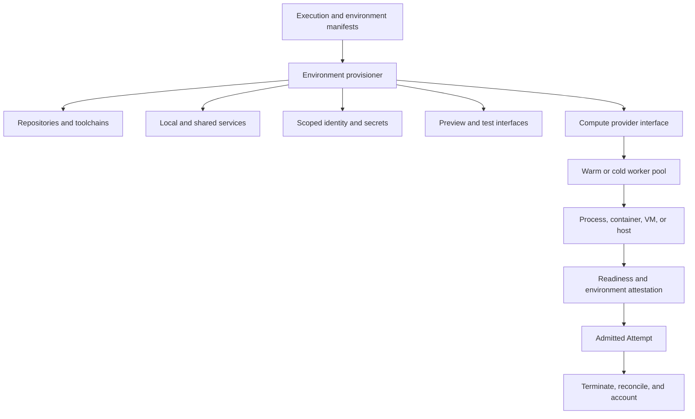
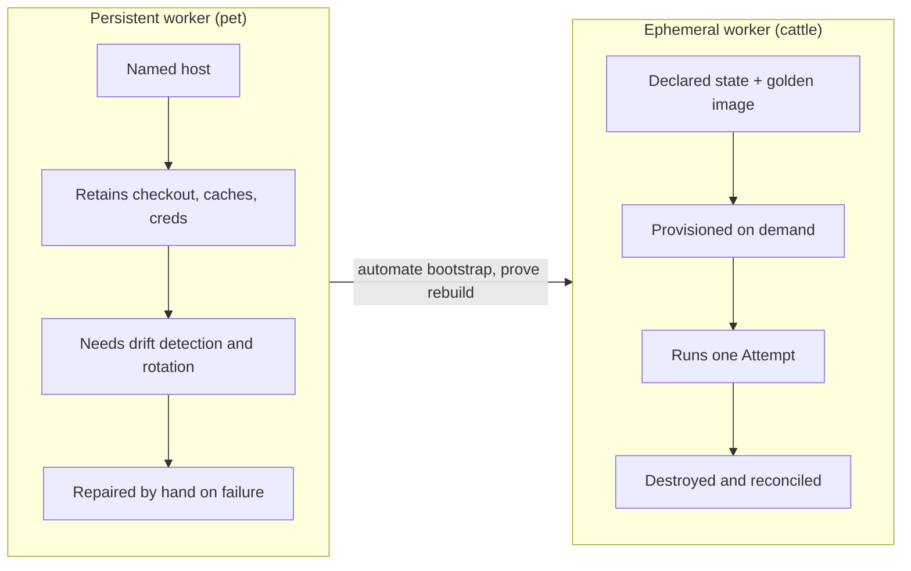
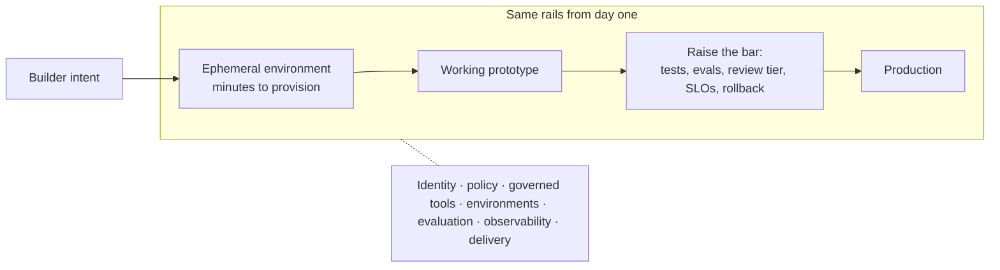
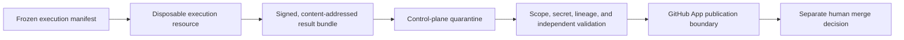

# 14. Development environments, sandboxes, and compute

A harness can only build and test software if it is standing somewhere with the right compilers, dependencies, services, identities, network paths, and preview surfaces. This chapter is about that somewhere: the **development environment** the agent works in, the **sandbox** that contains what it can do, and the **compute** the whole thing runs on. It also covers the boundary that matters most for trust, which is that the place where untrusted code runs must never be the place that publishes it. After reading it you should be able to write an environment manifest, choose between ephemeral and persistent workers on purpose, decide how much infrastructure to own, and explain why a disposable VM is not the same thing as a safe one.

## The problem

An agent cannot build or test software merely because a model and a repository are available. It needs the correct toolchain, seeded data, service endpoints, credentials, browser or device capabilities, and somewhere to put a preview. If that environment is slow to create, inconsistent between runs, overprivileged, or impossible to inspect, the factory is unreliable regardless of model quality.

Human workstations hide this. They accumulate state gradually; engineers repair missing tools, refresh logins, remember which service lives where, and interpret local failures. Autonomous workers cannot depend on that invisible maintenance. They start hundreds of times, run concurrently, outlive an API request, or are destroyed after one Attempt. Larger products make it worse: the application may depend on fifty shared services that cannot be cloned into every worker, plus private network access, service virtualization, stable test identities, and a preview URL. Moving compute to a managed provider without reconstructing those dependencies turns infrastructure convenience into integration friction.

On the containment side, an implementation agent executes untrusted generated actions against valuable source code with package managers, build scripts, model credentials, tools, and external networks in reach, any of which can be malicious or compromised. A git worktree stops branch collisions and nothing else. A disposable VM reduces persistence but does not make its output trustworthy or authorize publishing it. The worker may outlive its lease, exceed budget, edit files outside scope, expose a preview port, or leave remote resources running after it fails.

## How it works

### Three questions, three layers

It helps to keep three questions apart because they have different owners and different failure modes.

Sandboxing answers *how execution is contained*. Development-environment engineering answers *whether the work can be performed and evaluated correctly*. Compute infrastructure answers *where, and at what capacity, the environment runs*. A sandbox can be safe and unusable; an environment can be usable and unsafe; compute can be plentiful and in the wrong region. The factory needs all three properties, and conflating them is how teams end up with a locked-down container that cannot reach the database the tests need.

Think of a workshop. Compute is the land and the power supply. The development environment is the fitted-out workshop: the benches, the tools, the parts bins, the keys to the stockroom. The sandbox is the guard on each machine and the rule about what leaves the building. You would not ask the landlord to choose your lathe, and you would not let the lathe decide what ships.

<!-- infographic: environment-vs-compute -->
> **Infographic — Environment orchestration versus compute allocation.** *(Jay's graphic goes here.)* Until then, the diagram below
> carries the same concept.

The compute provider exposes allocation, start, stop, snapshot, measure, and termination. The environment provisioner makes that resource useful for one specific software system. Keeping the boundary explicit lets you use managed compute, bring-your-own compute, or an internal fleet without rewriting factory authority.

### The environment is a versioned dependency

Treat the environment exactly as you treat a library version: declared, pinned, and reproducible. A **Development Environment Contract** (some teams call it an environment manifest) should identify:

- repository set, baseline commits, checkout layout, and writable paths;
- operating system, architecture, base image, language runtimes, package managers, compilers, browsers, and tool versions;
- build, test, lint, migration, startup, readiness, and cleanup commands;
- required local and shared services, endpoints, test data, and feature flags;
- human, service, worker, and repository identities;
- secret references and credential-minting policy;
- filesystem, process, network, egress, and resource boundaries;
- preview ports, URLs, access policy, and evidence capture;
- cache inputs and invalidation rules;
- lifecycle, timeout, suspend, teardown, and orphan-recovery behavior; and
- environment attestation and qualification evidence.

The Execution Manifest from [Chapter 11](./11-control-plane-orchestrator-and-execution-plane.md) binds an exact environment version, by image digest and toolchain digest, to each Attempt. That second digest is the product of **toolchain pinning**: every compiler, runtime, package manager, linter, and browser the run can invoke is fixed to an exact version and recorded, so a build that passed on Tuesday cannot silently start failing on Thursday because a tool auto-updated underneath it. A floating "latest" image or mutable workstation state makes reproduction meaningless, because you can never again stand in the room the agent stood in.

### The execution environment is a first-class object

The contract above is long because the environment is not incidental to the run; it is one of the run's governing inputs, on the same footing as the model route and the policy version. Each run gets a bounded, reproducible environment that fixes:

- the exact repository revision;
- the approved tools;
- scoped credentials;
- filesystem boundaries;
- network policy;
- dependencies;
- resource limits;
- timeouts; and
- auditing.

Those bindings buy four properties, and it helps to name which property each control serves, because teams tend to optimize for one and forget the others.

| Property | What it means | Served mostly by |
|---|---|---|
| **Isolation** | A compromised or confused run cannot reach beyond its box | Credentials, network policy, filesystem boundaries, resource limits |
| **Reproducibility** | The same inputs can be stood up again for debugging and verification | Exact revision, pinned dependencies and toolchain, attestation |
| **Containment** | Blast radius, cost, and time are bounded before the run starts | Resource limits, timeouts, budgets, auditing |
| **Consistency with downstream delivery** | What passed here will behave the same in CI and production | Same image lineage, same dependency pins, same service contracts |

The security framing is the one to keep. Treat autonomous execution like running untrusted code, because from the platform's point of view that is what it is: generated actions against valuable source with package managers, credentials, and networks in reach. The consequence is that an autonomous run gets no ambient access to a laptop, a developer's credentials, or a broadly scoped service account. As the run becomes more autonomous, its boundaries get narrower, not wider.

*Autonomy should come with narrower execution boundaries, not broader ambient access.*

The environment also has to be fast. If provisioning a governed sandbox takes twenty minutes and running on a laptop takes twenty seconds, engineers will run on the laptop and the guardrails will be theoretical. The safe path has to be quick enough that it never feels bureaucratic, which is why startup time is treated below as a product metric. *Fast prototyping and strong guardrails aren't opposites if the guardrails are built into the environment.*

### Why this is the most controversial layer

On the HumanLayer and BAML livestream, Dexter calls the development environment the most controversial part of the stack, and the reason is that it has so many layers of its own. First, which runtimes do I need to compile and test? Second, how do I test from the outside: for a verifiable language toolchain like BAML's, tests suffice, but for a web app you need to send work to the machine *and* look at what the agent built through a preview. Third, and hardest, what does the application need that lives elsewhere? Large teams run four layers of the stack locally while the real app depends on fifty-plus **shared development services** in a shared **dev cloud**: a long-lived, centrally operated set of databases, queues, identity providers, and internal APIs that individual sandboxes reach over the network rather than running themselves. A company with a hundred repositories does not want all of them running in the sandbox.

That is where vendor sandboxes get awkward. Telling a provider "use this base image with Rust pinned at this version" is easy. Poking holes in your network so a process on someone else's compute can reach your shared services, then debugging why a build fails because the provider's lightweight kernel does not support a syscall, is friction that compounds. The general form of that problem is **private connectivity and egress control**: the sandbox needs an authenticated, private path into the dev cloud (a VPC peering, a tunnel, or a service mesh identity) and, in the other direction, an explicit allowlist of what it may reach on the public internet, so package registries work and data exfiltration does not. Dexter's thesis, which Vaibhav endorses, is that you will want to own this layer unless you are building small, self-contained apps. Most real products are in the distribution of things that hit that friction.

The two disagree about one thing worth recording: Vaibhav argues the environment is really part of the outer harness; Dexter keeps it a separate layer, and this guide follows him. His reason is the company-laptop analogy. On day one you get a machine with the software already installed; you do not want your harness to think about installation. More importantly, **identity provisioning belongs in the environment layer**, not in the harness and not in raw infrastructure. **Identity and credential provisioning** is the step, at environment creation, that mints a workload identity for the run and attaches the short-lived, scoped credentials that identity is entitled to; it is the environment's job, and it is undone at teardown. An identity attached to the environment is what grants access to internal services, API keys, and scopes. The harness then simply finds itself able to reach what it is entitled to reach.

Both point to the companies that solved this by necessity. At Google and Facebook you get a nice laptop and never code on it; you get a **cloudtop**, a **remote development workstation** (a full development machine that lives in the data center, provisioned fresh and repeatedly, and reached from the laptop as a thin client), with the code never leaving the building and every internal web service you start getting a default URL tied to your user identity that any colleague can open, but that cannot become public without an explicit escalation. Every team building a factory is, in Dexter's words, reinventing that golden stack: press a button, get an environment, do the work, reach it from anywhere, share a URL. The generic name for the cloudtop is a **Cloud Development Environment (CDE)**: a remotely hosted development environment provisioned through an API or control service. Remote hosting can improve standardization, elasticity, and isolation, and it introduces network, residency, startup, dependency-access, and provider-control tradeoffs that the local laptop never had. Not every team needs that flexibility, and a vertically integrated cloud agent may be enough if you do not.

### Ephemeral or persistent: pets and cattle

**Ephemeral environments** are created from declared state and destroyed after the work. They reduce drift and cross-run contamination at the cost of cold start, clone, dependency restore, and authentication on every run. **Persistent environments** keep checkouts, caches, and credentials across runs. They start faster and require drift detection, cleanup, credential rotation, capacity reservation, and stronger reconciliation.

The operations vocabulary for this is **pets versus cattle** (written "pets vs cattle" on most whiteboards). A pet is `prod-web-01`: a named server with a role that someone rebuilds by hand when its disk fills. Cattle are interchangeable: provisioned by a script, given a random ID, replaced rather than repaired. Web previews on pull requests are cattle. In Dexter's other analogy, AWS Lambda is cattle and an EC2 instance you own is somewhere in the middle, more pet than not.

BAML's setup is a pool of MacBooks and Mac minis with the toolchain preinstalled, chosen because there is no boot time and because they had spare hardware. Each machine runs a small web server reachable through a tunnel, and a hosted dispatcher that listens to Linear, Slack, and GitHub sends it work. Dexter's assessment is that this is a pet setup and a fine place to start: a repository and a script provision a new machine, but a person still has to fetch the hardware and run it. HumanLayer runs the same way, one EC2 or exe.dev server left up all day and re-authenticated to GitHub by hand, because they are not starting thousands of workflows. Small teams may begin with a few persistent workers. The discipline is to automate the **environment bootstrap** anyway (the scripted sequence that takes bare compute to a ready worker: base image, toolchain, checkout, service startup, readiness check) and to prove, periodically, that a replacement can be created from declared state. Dexter's college IT job is the picture to keep: turning corrupted workstations from pets into cattle meant cloning a drive and handing it over rather than diagnosing anything.

<!-- infographic: pets-vs-cattle -->
> **Infographic — Pets versus cattle for agent workers.** *(Jay's graphic goes here.)* Until then, the diagram below
> carries the same concept.

### Startup and preview are part of the product

Cold-start time is a product metric because it lands directly on validated lead time and on whether humans trust the factory to be quick. Measure the stages separately: queue wait, allocation, checkout, dependency restore, service startup, readiness, and first useful tool call. Then attack them with **golden images** (prebuilt base images with the toolchain baked in), **dependency and build caching** (**content-addressed caches** of restored packages and compiled outputs, keyed by the hash of their inputs so a cache hit is provably the same bytes a clean build would produce), partial clones, **warm pools** of pre-provisioned workers, and preflight checks, but only when each one's invalidation rule is explicit. A prebuilt image is fast and goes stale or oversized; building from source is transparent and slow. Like a pit stop, the goal is a fast, repeatable sequence, not a heroic one.

For user-facing software, a reviewable **preview** is part of the result. A **preview environment** is a running instance of the application built from the Attempt's exact commit, and a **shareable preview URL** is its address: a link a reviewer, a product manager, or a validator can open without cloning anything. It should have a stable Attempt identity, authenticated access, bounded lifetime, environment and commit labels, health state, logs, and deterministic teardown. A preview URL is not evidence of correctness; it is an interface through which humans and validators gather evidence.

### Prototype-to-production continuity

The environment layer is also where the factory decides whether prototypes are disposable or promotable. The pattern large enterprise platform teams have converged on is that a builder goes from idea to a working ephemeral environment in minutes, and that environment already sits on the platform's identity, policy, secure tools, collaboration surfaces, evaluation, observability, and deployment interfaces. Nothing about it is a toy. When the prototype proves worth keeping, productionizing it means raising the evidence and operational bar: adding the tests, the review tier, the SLOs, the rollback plan. It does not mean rebuilding it on different rails.

The failure this prevents is easy to picture. A product manager prototypes a feature in fifteen minutes on an ungoverned sandbox, and the engineering team then spends two weeks reconstructing it inside the real identity model, the real environment, and the real delivery pipeline. Nothing was accelerated; the bottleneck moved. *If a PM can prototype in fifteen minutes but engineers need two weeks to reconstruct everything, we've only moved the bottleneck.*

<!-- infographic: prototype-to-production -->
> **Infographic — Prototype-to-production continuity.** *(Jay's graphic goes here.)* Until then, the diagram below carries the same concept.

Continuity is what makes the paved road the fastest road rather than the slowest. Builders who are not developers (product managers arriving with a requirements document, QA with acceptance scenarios, designers with a prototype) have product intent but not repository boundaries, deployment risk, or architecture constraints in their heads; the environment compensates by applying context, generating acceptance criteria, surfacing risk, and enforcing guardrails automatically, so the fifteen-minute prototype is already a candidate rather than a sketch. *The prototype shouldn't need to be rewritten to become trustworthy.*

### Where it runs: local, remote, or in a box

IndyDevDan frames the same question from the practitioner's desk: where should your software factory run? Most engineers give agents a corner of their own laptop, or lean on CI/CD or a container. His argument is that a container on your device buys isolation only, while an **agent sandbox**, a full VM the agent owns, buys three things: isolation, scale, and autonomy. Isolation because the blast radius is the box, and you can strip the agent of AWS and GCP access entirely. Scale because one orchestrator can spin up five sandboxes and run five variants of the same task, a **best-of-N** pattern that lets you see several futures for a change and pick one. Autonomy because the agent is not competing with you for the machine, and you can step out of the loop and return only for planning, prompting, reviewing, and validating.

His implementation details generalize. An out-of-box orchestrator on the laptop creates sandboxes; an in-box orchestrator inside each VM only runs the workflow; the factory's agents run beneath it. Each sandbox exposes a public port for the application preview and a private, login-gated port for the factory view. Model access goes through a provisioned API key with a spend cap, deleted at teardown. Sandboxes are ephemeral by default but can be kept, and you can SSH in at any point, because a box you cannot enter is a box you cannot debug. His line to keep: if you are in the loop, you are the bottleneck, except when building the system that builds the system.

### Trusted and untrusted execution

Not every workload needs a hard sandbox, and it is worth being precise about why. Asked whether they use gVisor containers, Vaibhav says BAML does not use containers or sandboxes at all: agent sessions run directly on the MacBooks. The reason is a trust argument, not a shortcut. Raw feedback from a user is completely untrustworthy, so they never execute code from it. Their own prompts turn that feedback into a reproduction, and a repro they generated is something they trust. Because the input to execution is their artifact rather than the user's, the machine is a trusted system. Anything dependent on external data sources goes to a human. Their stated aim is a system that is ninety-five percent automatic, which is much easier than one hundred.

If your inputs are less controlled, the options form a spectrum. Containers with gVisor, a Kubernetes cluster, Daytona, E2B, Freestyle, exe.dev, or a design where the agent never gets a real filesystem and only sees tools that look like one. Local worktrees are fast and observable but share the host. Containers improve process and filesystem isolation but may share a kernel. Remote VMs strengthen host separation at higher latency, cost, provider risk, and orphan complexity. Risk-proportional policy, from [Chapter 7](../02-design/07-governance-policy-and-risk-proportional-approval.md), should choose the boundary per WorkOrder rather than one boundary for everything.

The same spectrum applies to who owns the compute, which is the **bring-your-own-compute (BYOC)** question, and its close cousin, **managed versus self-hosted execution**: whether the sandboxes run on a provider's fleet under the provider's operations, or on infrastructure your own team provisions, patches, and pays for directly. At one end, a stack of MacBooks in the office or your own EC2 or Kubernetes. In the middle, a provider such as Daytona that gives you a black-box sandbox API but runs it inside your AWS account, data center, or rack. At the other end, fully vendor-hosted execution where you send a request and everything happens in their environment. Cognition's "outposts" are a variant: you run the compute, the vendor brings the harness and tooling to it, and the two co-own the environment. Bring-your-own compute does not remove integration responsibility; it changes who owns the resource boundary.

### Isolation is layered containment

Whatever you choose, no single sandbox property proves the others. Use several independent boundaries:

- an Attempt-specific branch and worktree;
- an unprivileged process or user;
- a filesystem and path allowlist;
- a network and egress policy;
- short-lived, WorkOrder-scoped credentials;
- CPU, memory, runtime, and spend limits;
- lease, heartbeat, cancellation, and teardown;
- a quarantined result bundle; and
- independent validation before publication.

The sandbox is a resource, not an authority record. A local process, container, VM, or remote environment is attached to one Attempt. The control plane still owns policy, claim, lifecycle, evidence, acceptance, and publication. The sandbox may execute the frozen manifest and report facts; it may not change scope, validate itself, merge, deploy, or retain credentials after termination.

### Execution identity is not publication identity

This is the boundary that carries the most weight. The agent runtime should not hold GitHub write or deployment credentials. After validation, a trusted outer control-plane component mints the shortest-lived, repository-scoped credential required to push and open one pull request. Human merge remains a separate decision. Giving the sandbox publication credentials simplifies the architecture and destroys separation of duties; the outer publication step is more work and keeps untrusted code away from the durable repository write identity.

The mail-room analogy: the worker builds the package and seals it, but only the shipping desk has the postage and the customer's address. A compromised worker can produce a bad package; it cannot send it.

Sandbox output is untrusted for the same reason. Receipt spools, logs, diffs, test results, and bundles require integrity checks, redaction, scope validation, and independent verification. A compromised sandbox must not be able to forge acceptance by controlling both the artifact and the evidence about it.

<!-- infographic: sandbox-isolation-and-publication -->
> **Infographic — From frozen manifest to publication boundary.** *(Jay's graphic goes here.)* Until then, the diagram below
> carries the same concept.

### The worker fleet is a production service

The **runner fleet** is the set of machines, VMs, or containers on which Attempts execute, and a **worker pool** is a group of runners within it that share an image, capacity class, and network position so the scheduler can treat them as interchangeable. Once more than a handful of Attempts run at once, the fleet needs the same controls as any production service:

- typed queues and priority classes;
- concurrency and tenant quotas;
- admission based on required architecture, tools, network, and capacity;
- autoscaling and warm-capacity policy;
- backpressure and load shedding;
- lease, heartbeat, fencing, cancellation, and drain;
- timeout budgets and classified retry;
- exponential backoff with jitter for transient dependencies;
- circuit breakers and provider failover;
- dead-letter or quarantine handling for poison work;
- capacity, cost, utilization, and orphan accounting; and
- service-level objectives for readiness, dispatch, teardown, and recovery.

Backoff and retry never authorize another external effect. Idempotency and reconciliation, from [Chapter 12](./12-durable-execution.md), remain required whenever allocation, publication, or teardown may have succeeded before the response was lost.

### Multi-tenancy

A fleet that serves more than one team, product, or organization is multi-tenant whether or not anyone designed it to be, and the environment layer is where most of the tenancy boundaries are enforced. Four of them matter.

| Boundary | What it isolates | Mechanism |
|---|---|---|
| **Identity** | Who a run acts as | An authenticated user plus a workload identity minted per run, so every effect is attributable to both the person and the specific execution |
| **Data** | What context a run may see | Authorization applied before any content reaches the model, not after retrieval; a tenant's documents never enter another tenant's context window ([Chapter 16](./16-data-knowledge-semantic-and-context-engineering.md)) |
| **Resources** | Who gets capacity | Quotas, concurrency limits, and queue fairness so one tenant's burst does not starve another; the noisy-neighbor problem is a scheduling problem, not a model problem |
| **Memory** | What is learned, and for whom | Durable memory scoped by organization or domain, promoted to shared only deliberately, so one team's retained context does not become another's stale truth |

The design goal is a common platform with differentiated product behavior: the same identity, environment, evaluation, and delivery machinery under every tenant, with each tenant's skills, knowledge, and acceptance criteria kept its own. Cross-tenant leakage through any of the four boundaries is a security incident, and a cross-tenant isolation test belongs in the promotion evidence below.

### Compose the stack one layer at a time

Evaluate build, buy, or bring-your-own separately for each layer:

| Layer | Reasons to own | Reasons to adopt or buy |
| --- | --- | --- |
| Control and orchestration | Differentiating policy, workflow, evidence, and integrations | Commodity workflows with acceptable contracts |
| Harness | Required hooks, tools, model choice, or custom agent behavior | Mature coding loop and rapid capability improvements |
| Development environment | Complex private services, identity, data, or toolchains | Standard application stack and acceptable templates |
| Compute | Residency, utilization, accelerator, or network requirements | Elasticity, fleet operations, and reduced infrastructure burden |

Owning the environment usually yields more leverage than owning raw compute, because the environment captures organization-specific toolchains and services while compute is commodity. Owning both may still be premature for a small workload. HumanLayer's position is that their serious customers all prefer a good interface on top of compute and environments they already own; the vendor brings the orchestration and a swappable harness.

Two warnings from the livestream apply to the compute layer. First, do not wrap APIs with other APIs: a thin in-house client over a vendor SDK adds work at every new call site, and once a company is big enough it is a GCP shop or an AWS shop with a good native SDK anyway. Second, a universal compute abstraction rarely survives contact; the one attempt Dexter names ended up as a benchmark rather than an SDK.

For enterprise adoption, compare identity federation, tenant isolation, data residency, private networking, egress controls, key management, audit retention, quotas, chargeback, support, and exit procedures. For open-source or open-core components, also examine license, release cadence, maintainer health, dependency provenance, vulnerability response, upgrade compatibility, and whether you can operate without a hosted control service. [Chapter 31](../05-operate/31-enterprise-adoption-and-the-infrastructure-landscape.md) treats the landscape.

## How to build it

### Steps

1. Write the environment manifest for one repository using the contract fields above. Pin the image and toolchain by digest.
2. Prove a clean rebuild: from a fresh machine or disposable VM, provision the toolchain, check out the exact commit, start required services, run preflight, run tests, tear down. Time each stage.
3. Decide persistence. Start with a few persistent workers if the workload is small, but automate bootstrap and schedule a periodic rebuild-from-declared-state proof.
4. Put identity in the environment layer: short-lived, WorkOrder-scoped credentials minted at provisioning, revoked at teardown. No publication credential inside.
5. Choose the isolation boundary per risk class, not globally. Record the choice in policy.
6. Add the publication boundary: quarantine, validation, then a control-plane component that mints the shortest-lived repo-scoped token to push one branch and open one PR.
7. Add fleet controls as concurrency grows, starting with leases, quotas, timeouts, and orphan reconciliation.
8. Instrument the operator view: queue age, provisioning stages, cache decisions, readiness, preview state, resource usage, cost, teardown, and orphan recovery per Attempt.

### Lifecycle states and orphan recovery

Record allocation identity before creating any external resource, so a crash between "VM allocated" and "ID written" leaves a journal entry rather than a ghost. Lifecycle states should include: provisioning, ready, running, result-ready, teardown, terminated, failed, and orphaned. **Reconciliation** periodically lists what exists at the provider and compares it to what holds active factory authority; anything in the first set and not the second is an orphan. Cleanup uses exact provider IDs, never broad patterns.

### Capacity, quotas, and cost

Admission should check workload requirements, tenant, network, data residency, capacity, cost, and sandbox qualification before selecting compute. **Capacity scheduling** is the step after admission: matching each admitted Attempt to a worker pool with the right architecture, tools, and network reach, in an order that respects priority class and tenant fairness rather than arrival time alone. Quotas bound concurrency per tenant and per risk class. Autoscaling and warm-capacity policy trade idle cost against cold-start latency; make the trade explicit and measure both. Cost allocation attributes every resource, including previews and orphans, to an Attempt, a WorkOrder, and a tenant so chargeback and the economics in [Chapter 8](../02-design/08-economics-metrics-and-human-attention.md) have real inputs.

### Promotion evidence

Before a compute or environment arrangement is trusted for production Attempts, require cold-start and warm-start benchmarks, clean rebuilds, dependency-outage tests, cancellation races, credential revocation tests, cross-tenant isolation tests, provider reconciliation, and controlled failover.

## Failure modes

**Floating environment.** The image tag is `latest`; two Attempts a week apart ran in different rooms. Detect by checking that every Attempt records image and toolchain digests. Fix by pinning and attesting.

**Safe but unusable.** The sandbox is locked down and the tests cannot reach the shared database. Detect by readiness failures at service startup. Fix by putting service connectivity and identity in the environment contract, or by service virtualization for what cannot be reached.

**Usable but unsafe.** The worker has the engineer's personal GitHub token and broad egress. Tessl's early orchestrator ran on one researcher's credentials and made her the top contributor for weeks. Detect by inventorying what credentials are inside the environment. Fix with WorkOrder-scoped, short-lived identity and the outer publication boundary.

**Sandbox with postage.** The runtime can push and open PRs itself. Detect by asking what a fully compromised worker could publish. Fix by moving credential minting outside and quarantining results.

**Pet that cannot be rebuilt.** The one worker everyone depends on dies and nobody knows how it was configured. Detect with a scheduled rebuild-from-declared-state test. Fix by automating bootstrap before you need it.

**Orphaned resources.** VMs and previews run for weeks after their Attempts ended, or a worker crashed after allocation and before the journal write. Detect with provider reconciliation and cost anomalies. Fix by journaling allocation first and cleaning up by exact ID.

**Cold start eating lead time.** Every run spends twelve minutes restoring dependencies. Detect by staged startup timing. Fix with golden images, caches, warm pools, each with an explicit invalidation rule.

**Preview mistaken for proof.** A green preview URL is treated as acceptance. A preview is an evidence-gathering interface; the evidence still has to be gathered and independently validated.

**Retry as authorization.** A retried allocation or publication produced a duplicate VM or a duplicate PR. Detect by idempotency-key collisions. Fix by making every external effect idempotent and reconciled.

**Ambient access.** The autonomous run inherits the developer's laptop, shell environment, and cached credentials because that was the quickest way to make it work. Detect by listing what the run can reach that its manifest did not grant. Fix by treating autonomous execution as untrusted code: per-run workload identity, scoped credentials, explicit network policy.

**The prototype that must be rebuilt.** Prototyping happens on an ungoverned path, so every promising prototype is reconstructed from scratch on the real rails. Detect by measuring intent-to-prototype against prototype-to-accepted-PR; a large gap is the moved bottleneck. Fix by putting prototypes on the same identity, environment, and delivery rails from the first minute and raising the bar rather than rebuilding.

**Slow safe path.** The governed environment takes long enough to provision that engineers route around it. Detect by comparing sandbox usage with laptop usage for the same workflow. Fix by treating startup time as a product metric and building the guardrails into a fast environment.

**Noisy neighbor.** One tenant's burst of Attempts starves another's queue, or one team's retained memory surfaces in another's context. Detect with per-tenant queue age and cross-tenant isolation tests. Fix with quotas, queue fairness, data authorization before retrieval, and scoped memory.

**Vendor kernel surprises.** A build fails in the provider's sandbox because its lightweight kernel lacks a syscall. Detect by running the qualification suite on the provider before admission. Mitigate by owning the environment layer or choosing a BYOC provider that runs real VMs in your account.

## In Mission Control

At study commit [`d902fae`](https://github.com/jaydubya818/MissionControl/tree/d902fae7032c0696b531c44ae88829c652516fc6), Mission Control defines Sandbox Profiles, provider identity, image and toolchain digests, resource ceilings, network and secret boundaries, qualification evidence, local and remote backends, worker capability attestations, leases, budgets, cancellation, teardown, and compatibility checks. The architecture keeps sandbox capability separate from execution authority. That much is implemented as contract.

Earlier, at study commit [`9d5f8e3`](https://github.com/jaydubya818/MissionControl/tree/9d5f8e36aff45a001a8848cc0516b3dc800e29b8) on draft PR #64, an attempt-specific local worktree worker was implemented: it claims a durable lease, renews heartbeats, validates the frozen worktree and code scope, runs Codex, blocks out-of-scope changes, commits, mints an ephemeral repository-restricted GitHub App token, pushes, and creates or reuses an exact PR. Terminal reporting requires the active matching lease. Todo 024 records a real GitHub App proof: a branch and commit were created and PR #61 opened with passing checks. That proof required direct control-plane mutations because the browser Mission path could not yet carry all policy and receipt data; the browser-only golden path and complete UI state matrix remained open. GitHub `main` at that time included the `codex/v1` adapter contract and Factory host readiness, not the complete production worker.

Partial or unproven: the studied production admission packet remained blocked by operator configuration. The evidence does not establish a fleet-scale environment service with reproducible multi-repository bootstrap, shared-service connectivity, authenticated previews, warm-pool policy, autoscaling, cross-tenant load tests, or cost allocation. Remote-sandbox documents (an execution architecture, a threat model, and a provider proof) were uncommitted proposals, not product capability; the provider proof was blocked because the selected exe.dev plan had zero VM capacity and the Product Owner declined an upgrade. No repository, model, or production credential was sent to a VM. Remote backend contracts and local qualification are not equivalent to sustained production operation.

Future: compile repository manifests and environment contracts into attested, policy-qualified environments; select compute only after checking workload, tenant, network, residency, capacity, cost, and sandbox qualification; remote execution with a root-owned supervisor and unprivileged agent, hash-chained receipts, bounded egress, no publication credential, a durable allocation journal, signed result bundles, quarantine, deterministic teardown, and cost reconciliation; best-of-N cohorts publishing only one human-selected candidate through the outer GitHub boundary.

## Retain this

- Sandbox, environment, and compute answer three different questions: how execution is contained, whether the work can be done and evaluated, and where it runs. Design each on its own.
- The environment is a pinned, attested dependency bound to the Attempt by the Execution Manifest. "Latest" is not reproducible.
- Identity provisioning lives in the environment layer, scoped to the WorkOrder and short-lived.
- Pets are fine to start; automate the bootstrap and prove a rebuild before you need one.
- Startup stages and previews are product metrics and product surfaces, not plumbing.
- Isolation is layered; no single boundary proves the others, and disposable is not the same as safe.
- The sandbox never holds publication credentials. Validate in quarantine, then mint the shortest-lived token outside, then let a human merge.
- Own the environment before you own the compute; evaluate each layer's build, buy, or BYOC on its own terms and keep the exit.
- The execution environment is a first-class object binding exact revision, approved tools, scoped credentials, filesystem and network boundaries, dependencies, limits, timeouts, and auditing, for isolation, reproducibility, containment, and consistency with delivery.
- Treat autonomous execution like running untrusted code. Autonomy should come with narrower execution boundaries, not broader ambient access.
- Prototypes sit on production rails from the first minute; productionizing raises the evidence bar rather than rebuilding. A fifteen-minute prototype that takes two weeks to reconstruct has only moved the bottleneck.
- Multi-tenancy is enforced on four boundaries: identity per run, data authorization before the model, resource quotas and queue fairness, and scoped memory. Common platform, differentiated product behavior.

## Go deeper

- [Chapter 11. Control plane, orchestrator, and execution plane](./11-control-plane-orchestrator-and-execution-plane.md) — the Execution Manifest that binds an environment to an Attempt.
- [Chapter 12. Durable execution](./12-durable-execution.md) — leases, idempotency, and recovery that fleet controls depend on.
- [Chapter 13. Coding harnesses and agent protocols](./13-coding-harnesses-and-agent-protocols.md) — the layer above.
- [Chapter 26. Security](../04-prove/26-security.md) — identity, secrets, threats, and supply chain in depth.
- [Chapter 28. Observability, telemetry, and forensics](../05-operate/28-observability-telemetry-and-forensics.md) — the operator view of provisioning, cost, and orphans.
- [Chapter 31. Enterprise adoption and the infrastructure landscape](../05-operate/31-enterprise-adoption-and-the-infrastructure-landscape.md) — providers and the enterprise checklist.
- [Glossary](../appendix/glossary.md) — development environment contract, sandbox profile, golden image, warm pool, orphan, publication boundary.
- Labs: [Repository onboarding and readiness](../appendix/labs/04-repository-onboarding-and-readiness-lab.md), [Factory disaster recovery](../appendix/labs/09-factory-disaster-recovery-lab.md), [Orchestration failure recovery and cost](../appendix/labs/11-orchestration-failure-recovery-and-cost-lab.md). The v1 exercises are still the right ones: define a manifest and provision it cold and warm with a full teardown proof; trace the local Attempt worker at `9d5f8e3` through path deviation, expired lease, token expiry, duplicate PR, and cancellation, then threat-model the remote version without provisioning it.
- Mission Control sources at `9d5f8e3`: [Factory Attempt worker](https://github.com/jaydubya818/MissionControl/blob/9d5f8e36aff45a001a8848cc0516b3dc800e29b8/apps/orchestration-server/src/factoryAttemptWorker.ts), [Git worktree runtime](https://github.com/jaydubya818/MissionControl/blob/9d5f8e36aff45a001a8848cc0516b3dc800e29b8/apps/orchestration-server/src/factoryGitRuntime.ts), [Path-scope enforcement](https://github.com/jaydubya818/MissionControl/blob/9d5f8e36aff45a001a8848cc0516b3dc800e29b8/apps/orchestration-server/src/factoryPathScope.ts), [GitHub App runtime](https://github.com/jaydubya818/MissionControl/blob/9d5f8e36aff45a001a8848cc0516b3dc800e29b8/apps/orchestration-server/src/githubAppRuntime.ts), [Factory Attempt lease](https://github.com/jaydubya818/MissionControl/blob/9d5f8e36aff45a001a8848cc0516b3dc800e29b8/convex/factory/attempts.ts), [Todo 024](https://github.com/jaydubya818/MissionControl/blob/9d5f8e36aff45a001a8848cc0516b3dc800e29b8/todos/024-ready-p1-real-codex-github-pr-golden-path.md), [PR #61](https://github.com/jaydubya818/MissionControl/pull/61); [capability, workflow, and admission map](../appendix/mission-control/03-capability-workflow-and-admission-map.md) at `d902fae`. Local uncommitted documents studied 2026-08-11: `docs/architecture/remote-sandbox-execution.md` (SHA-256 `ba4891ac…36f7c`), `docs/security/remote-sandbox-threat-model.md` (SHA-256 `9facf5d5…70c8c`), `docs/validation/2026-08-10-remote-sandbox-provider-proof.md` (SHA-256 `6ab6a560…50053`).
- Source transcripts: HumanLayer × BAML livestream, "Software factory design patterns" (Dexter and Vaibhav) — MacBook pool, trusted versus untrusted execution, the dev-environment layer, cloudtop, pets versus cattle, BYOC, identity in the environment; IndyDevDan, "Where should your software factory run" — agent sandboxes for isolation, scale, and autonomy, best-of-N, provisioned keys, in-box and out-of-box orchestrators; Dru Knox (Tessl) — the credentials incident and GitHub Actions limits for long-running agents; Jay West, factory architecture notes — execution environments as first-class, prototype-to-production continuity, multi-tenancy.
- Primary references: [Devfile schema 2.3.0](https://devfile.io/docs/2.3.0/devfile-schema), accessed 2026-08-30; [Google Site Reliability Engineering books](https://sre.google/books/), accessed 2026-08-30.
