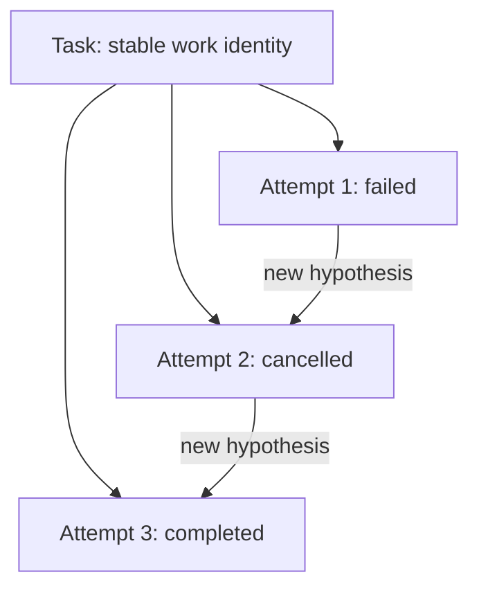
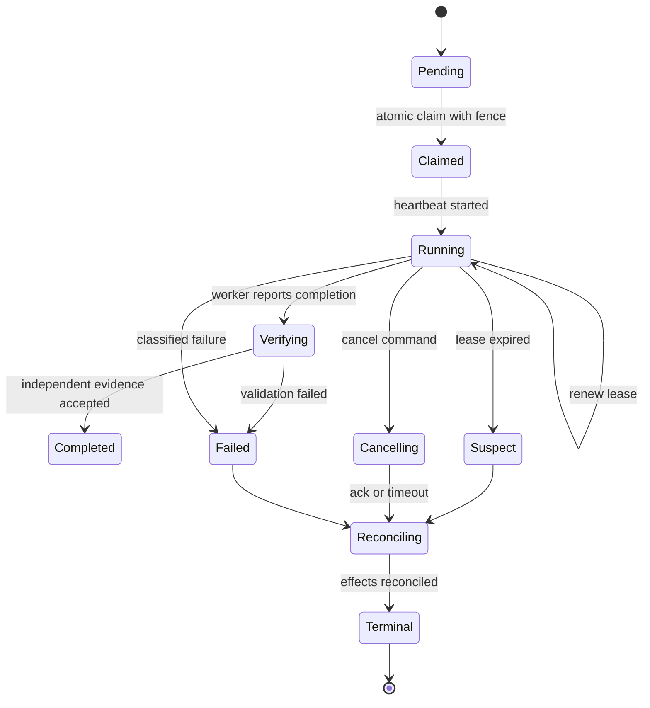
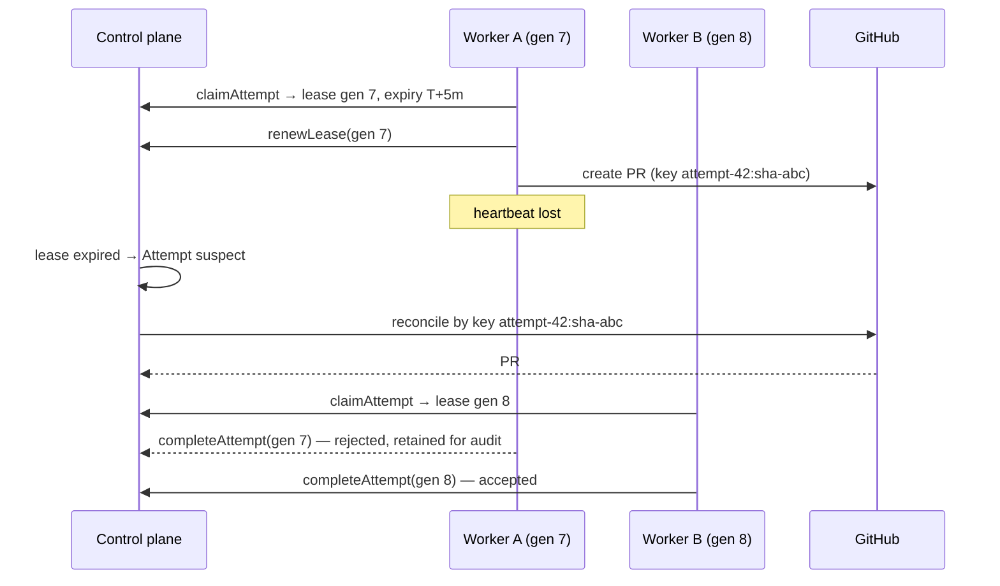
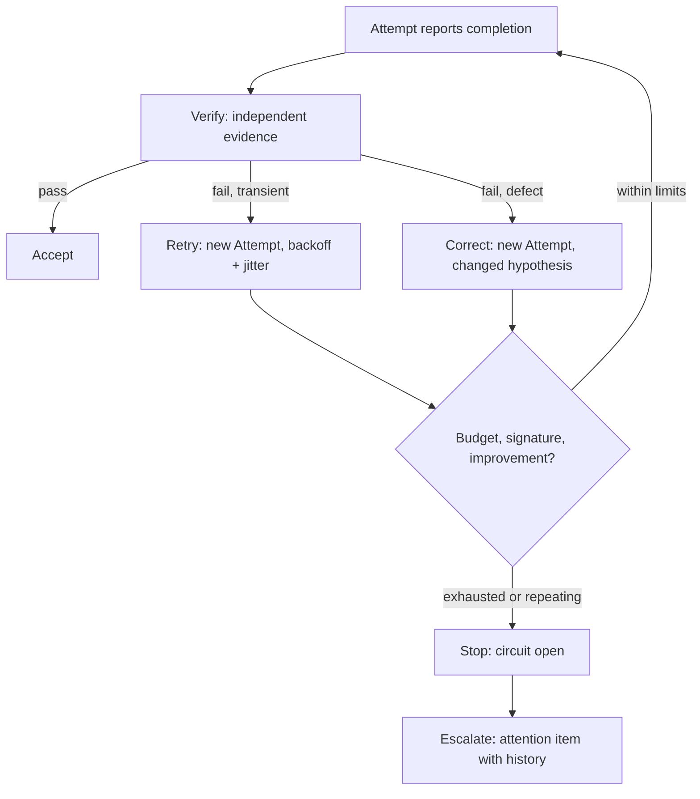
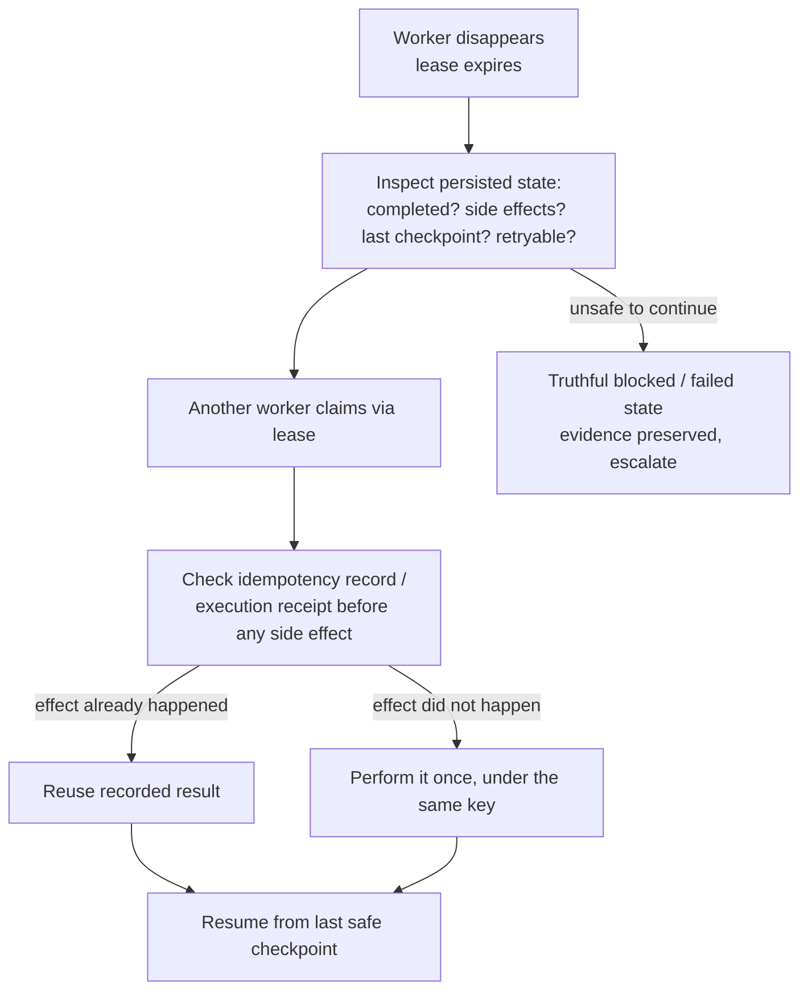

# 14. Durable execution: tasks, attempts, leases, and recovery

The previous chapter established that the control plane owns lifecycle state and the execution plane performs bounded work. This chapter is about what happens when that work goes wrong in the ordinary ways: a worker vanishes while its process keeps running, a retry duplicates a pull request, a stale worker reports success after another worker took over. The answer is a small set of mechanisms (Task versus Attempt, leases with fencing, idempotency keys, classified recovery, and a cancellation protocol) plus the reliability vocabulary that production systems have used for decades to survive unreliable dependencies. After reading it you should be able to specify an attempt lifecycle that survives crashes, explain why a retry is always a new Attempt, and place every reliability term at the point in that lifecycle where it applies.

## The problem

Agent execution fails in ambiguous ways. A worker can disappear while its subprocess continues editing files. A retry can duplicate a commit or a pull request. A worker whose ownership has lapsed can write "success" over the top of a replacement worker's real result. If a Task and an execution try are treated as the same record, recovery rewrites history and the operator can no longer determine what actually happened, what it cost, or whether a second try is safe.

The reason is structural. Ownership in a distributed system is always temporary. Messages are delivered more than once. External systems (GitHub, CI, model providers) do not participate in the factory's database transaction, so the factory can time out without knowing whether the effect landed. And model-driven workers add a new dimension: failure is often not a crash but nonconvergence, the same fix attempted six times with the same result. Recovery therefore requires explicit identity, explicit ownership time, deduplication at every side-effect boundary, and, before any retry, a changed hypothesis.

Two of the twelve layers of the production agent stack ([Chapter 25](./25-the-12-layer-production-ai-agent-stack.md)) are devoted to exactly this. **Loop Engineering** controls what happens after every attempt: verify, correct, retry, stop, or escalate. **Infrastructure Engineering** handles timeouts, unavailable dependencies, retries, backoff, fallbacks, and operational failures safely. This chapter is where those two layers meet the attempt record.

## How it works

### Preserve the Task; append Attempts

A **Task** describes bounded work: objective, scope, dependencies, and lifecycle. An **Attempt** describes one historical try to perform it. The Task is stable identity; Attempts are appended history. Each Attempt freezes the executor, model, context, policy, base SHA, worktree, budget, start time, and its recovery relationship to the Attempt before it. Failed, timed-out, and cancelled Attempts remain as immutable evidence. A retry never edits an Attempt; it creates Attempt N+1 with a recorded reason.

The value of this split is that the Task's lifecycle (Ready, In Progress, Review, Done) can be reasoned about independently of how many tries it took, while every try stays available for cost accounting, forensics, and learning. When the operator asks "what happened?", the answer is a list of Attempts, each with its own frozen inputs and its own outcome, not a status field that has been overwritten three times.

### The durable state machine

The rule behind all of this is simple to state: never let a multi-hour workflow live only in model context or process memory. A model's context window is a working buffer that will be compacted, truncated, or lost when the process dies; process memory dies with the process. Neither can answer, after a crash, what was authorized, what completed, or what side effects landed. Workflow state has to live in a **durable state machine**: a persisted record whose transitions are the only way the workflow moves.

*Model context is not durable workflow state.* And its corollary, which is the one people forget: *model context is not a transaction log.* A transcript records what the model said and saw; it does not record, authoritatively, what the platform did.

The record persists, per task:

- task state;
- inputs and outputs;
- owner (the worker holding the lease);
- attempt number;
- last checkpoint;
- retry policy;
- timeout;
- budget; and
- evidence produced so far.

Five behaviors follow from the record. Workers claim tasks through **leases**, so ownership is explicit and expires. Retries are **bounded** by the retry policy and the budget, never by the model's persistence. State transitions are **idempotent**: applying the same transition twice, because a message was delivered twice, produces the same state once. Side effects carry **replay protection**, so that the second delivery of "create the PR" finds the first one rather than creating another. And pause and cancel are **first-class transitions** with their own semantics, not flags a worker may or may not notice.

When a worker disappears, the state machine is what lets the platform answer four questions without asking the model anything: what completed? what side effects occurred? what was the last safe checkpoint? what can safely resume? An agent runtime that can answer those is distributed-systems infrastructure. One that cannot is an LLM wrapper with a database attached.

<!-- infographic: attempt-lifecycle -->
> **Infographic — The attempt lifecycle.**

The states that matter most are the ones people forget to model. **Suspect** is what an Attempt becomes when its lease expires: not failed, because the factory does not yet know whether the worker is dead or merely slow, and not running, because no new effects may be authorized. **Reconciling** is the state in which the factory finds out what the Attempt actually did to the outside world before it decides the next step. Both are passed through on the way to a terminal state; neither can be skipped.

### A lease is temporary execution ownership

Consider a hospital shift change. The patient's chart is the record; the nurse on duty holds responsibility for a bounded period; and at handover, responsibility transfers explicitly, with the incoming nurse reading the chart rather than trusting the outgoing nurse's memory. A nurse whose shift ended an hour ago does not get to write new orders. That is a lease.

A worker atomically claims a pending Attempt and receives a **lease**: a record of the lease owner, a token or **fencing generation**, an expiry, and a heartbeat obligation. **Renewal** extends ownership only when the caller still holds the current fence. **Expiry** makes the Attempt suspect, not automatically failed; reconciliation must determine whether external effects occurred before the factory decides anything.

The **fencing token** is the part that prevents the stale nurse from writing orders. Every material completion write must prove the current lease generation. A worker that lost its lease during a network partition, then reconnects and tries to record success, presents an old generation and is refused. Its event is kept for audit; its authority is gone. Without fencing, "at most one active Attempt per Task" is a hope rather than an invariant.

<!-- infographic: lease-and-recovery -->
> **Infographic — Lease, heartbeat, fence, and recovery.**

The three contracts a lease system needs are `claimAttempt` (atomic, returns a fence), `renewLease` (conditional on the current fence), and `completeAttempt` (conditional on the current fence, otherwise recorded as a late event and rejected). The tuning question is cadence. Short leases detect failure quickly but produce false expiry during long tool runs; long leases delay recovery. Heartbeat cadence, expiry, and reconciliation timing must reflect the real duration of the operations the worker performs, and a long-running tool call should renew the lease from inside the operation, not wait for it to finish.

### Idempotency identifies a logical operation

Back to the ward. A medication is not "give the patient a dose"; it is "give patient X drug Y dose Z at scheduled time T", recorded against that exact entry so that a second nurse looking at the chart cannot administer it again. The identity of the act is what prevents the duplicate.

An **idempotency key** must be stable across transport retries and unique across different logical operations. `create-pr:{attemptId}:{headSha}` is meaningful: the same Attempt creating a PR for the same head commit is the same operation, however many times the request is sent. `create-pr:{timestamp}` defeats deduplication entirely, because every retry looks like a new operation.

Idempotency belongs at every side-effect boundary: dispatch, event ingestion, commit, push, PR creation, approval, receipt, and webhook processing. On replay, the recorded result is returned rather than the operation repeated. One limit must be understood clearly: a key in the factory's database cannot by itself deduplicate a provider call. If the factory timed out after GitHub accepted the request, the database has no record of the result. Reconciliation must therefore use provider identity as well, querying GitHub for the PR that matches the key before deciding whether to retry.

Who mints the key matters as much as what it contains. The orchestration layer owns it, because the key belongs to the logical operation, and the logical operation belongs to the task, not to whichever worker happens to be attempting it. The sequence is fixed: before any externally visible operation, the orchestrator creates the key tied to that logical operation, persists it, and only then hands it through the tool boundary to the worker and on to the provider. If the operation succeeded but the worker crashed before recording completion, the next worker presents the same key and receives the existing result. If the downstream system has no idempotency support at all, substitute a **durable execution receipt** (the orchestrator records the intent to act, then the provider's returned identity) or a reconciliation query, so that a retry can find what already happened. Design retries and side effects together; a retry policy written without reference to the effects it will repeat is a duplicate-PR generator.

*Retry the intent. Don't blindly repeat the side effect.*

*Attempt identity may change. Logical-operation identity should not.*

That second line is why the key is `create-pr:{attemptId}:{headSha}` only when the Attempt is the unit that owns the operation. Where a logical operation may span a retry into a new Attempt, the key must be built from the Task and the content, so that Attempt N+1 finding Attempt N's PR is a match rather than a collision.

### Recovery requires classification and a changed hypothesis

Retry is appropriate only when the failure is transient or when a concrete input, environment, plan, or implementation has changed. Repeating the same action without new evidence wastes budget and can compound damage: a worker that failed validation because it misunderstood the spec will misunderstand it again. Policy, not the worker, controls retry by failure class.

| Failure class | Default response |
| --- | --- |
| Authorization or policy | Stop and obtain valid authority; never retry blindly |
| Invalid configuration or context | Repair versioned configuration, then create a new Attempt |
| Capacity or rate limit | Back off within budget and deadline |
| Executor crash or lost lease | Reconcile external effects, then resume only if supported or create a new Attempt |
| Validation failure | Correct the defect through a new Attempt |
| Repository conflict | Rebase or replan with exact lineage |
| Unknown or contradictory evidence | Quarantine and escalate |

This table is the operational form of **failure-domain classification**: before any response, decide which domain the failure belongs to (authorization, configuration, capacity, provider, executor, validation, repository, or internal system), because each domain has a different permitted response and a different blast radius. A capacity problem in one model provider should not be treated like a validation failure in the code, and neither should be treated like a revoked credential.

### The loop: verify, correct, retry, stop, escalate

Loop Engineering gives the attempt lifecycle its decision rule. After every attempt, exactly one of five things happens.

<!-- infographic: retry-backoff-escalate -->
> **Infographic — Verify, correct, retry, stop, escalate.**

**Verify** means independent evidence, never the worker's own claim. **Correct** means a new Attempt with a changed hypothesis: a different plan, a repaired input, a rebased branch. **Retry** is reserved for transient failures of idempotent work and is paced by backoff. **Stop** fires when a budget is exhausted, when the same failure signature repeats, or when the evaluator shows no measurable improvement across N iterations. **Escalate** turns the stop into an attention item for a human that explains what was tried, what changed between tries, and why another automatic Attempt is unsafe.

Retry budgets are multidimensional. Bound attempts, elapsed time, cost, tokens, repeated failure signatures, and human interruptions. Exhaustion of any one of them is a stop, and a model cannot negotiate its way past a stop. Extension is a new human or policy decision.

### When a worker fails mid-workflow

Put the lease, the key, and the state machine together and the recovery procedure for a vanished worker writes itself. The wrong move is to restart everything, which repeats side effects and burns budget. The right move is to inspect persisted state and resume from it.

<!-- infographic: mid-workflow-recovery -->
> **Infographic — Recovery from durable state.**

The steps, in order: read what the state machine says completed; read which side effects were recorded as started and which as finished; find the last safe checkpoint; decide whether the remaining work is retryable under policy. A replacement worker claims through the lease and resumes from durable state, checking the idempotency record or execution receipt before repeating any side effect. If continuation is unsafe (the evidence is contradictory, a side effect is half-applied with no way to tell which half), the Attempt moves to a truthful blocked or failed state with its evidence preserved, and a human is escalated to.

Nothing in that procedure asks the model what it remembers. *The platform should know.* And when it does not know enough to continue safely, *a truthful blocked state is better than a false success.*

### Cancellation is a protocol

Cancellation is not a flag. It is a sequence: first prevent new work (no new claims, no new tool grants), then signal the executor, then record acknowledgement or timeout, then reconcile external effects, then terminate the Attempt. It cannot guarantee that already-issued provider calls vanish; a PR creation that was in flight may still land. Late events remain in history, but they cannot reopen authority, and the reconciliation step exists to find anything the cancelled worker left behind.

### Reliability dimensions, and model failure versus platform failure

Agent platforms become infrastructure earlier than anyone expects. The first workflow that saves a team an afternoon becomes the workflow they schedule nightly, and from then on its outages are production outages. The dimensions to design for are the ordinary ones: durable state, retries, idempotency, timeouts, cancellation, worker recovery, backpressure, rate limiting, service-level objectives, rollback, and named production ownership. Each is defined below and pinned to its place in the lifecycle.

Before that, one distinction keeps the whole discussion honest. A **model failure** is a poor answer: wrong code, a misread spec, a hallucinated API. A **platform failure** is the factory losing track of what happened. The first is expected and is what evaluation, verification, and bounded retry exist to catch. The second is not acceptable, and the model's fallibility is no excuse for it. Whatever the model did, the platform must remain deterministic about what happened, what authority existed, what state changed, and how to recover.

*Probabilistic intelligence doesn't justify probabilistic infrastructure.*

### The production reliability vocabulary, placed in the lifecycle

The terms below are well understood in classical distributed systems and unevenly applied in agent runtimes. Each is defined once and pinned to the point in the attempt lifecycle where it applies.

**Timeout budget.** The total time an operation, and every sub-operation it fans out to, may consume before it is declared failed. It is set at *claim* and decremented as the Attempt runs; a tool call that would exceed the remaining budget is refused rather than started.

**Retry policy.** The rule, per failure class, for whether and how many times an operation may be repeated. It is evaluated at *Failed*, after classification, never before.

**Exponential backoff and jitter.** The pacing rule for retries of transient failures: each wait is longer than the last, with randomness added so that many workers recovering from the same outage do not retry in lockstep. It lives between *Failed* and the next claim.

**Rate limiting.** A cap on how often a caller may hit a dependency (a model provider, GitHub's API). It is enforced at *admission* and at the tool gateway, and a rate denial is classified as capacity, not as a defect.

**Circuit breaker.** A switch that opens after repeated failures against one dependency so that further calls fail fast instead of piling up. It is tripped by the failure fingerprint counter and checked before every dependency call in *Running*; when open, the loop goes to *Stop* or to a prequalified fallback.

**Bulkhead isolation.** Partitioning capacity so that one tenant, repository, or workflow family exhausting its share cannot starve the others. It is applied at *admission* through per-partition concurrency keys.

**Backpressure.** The signal that flows upstream when a downstream stage is saturated, slowing or refusing new admissions rather than letting a queue grow without bound. It applies at *Queued → Admitted*.

**Load shedding.** Deliberately rejecting or deferring low-priority work when capacity is exhausted, in order to protect high-priority work and the ability to cancel. It applies at *admission* and must respect deadlines and fairness.

**Dead-letter queue.** The holding area for work items that failed processing repeatedly and must not be retried automatically. In the attempt lifecycle this is *Quarantined*: the item is preserved with its history for a human to examine.

**Poison message.** A command or event that causes the consumer to fail every time it is processed, typically malformed or referring to an impossible state. Detection is a repeated failure signature on the same item; the response is dead-lettering, not another retry.

**Graceful degradation.** Continuing to deliver reduced but correct service when a dependency is impaired, for example running with a smaller model profile or skipping an optional enrichment step. It applies in *Running* and must be declared, not improvised.

**Dependency fallback.** A prequalified substitute for an unavailable dependency, with declared semantic equivalence, changed cost, latency, and quality, and any lower autonomy ceiling it imposes. It is chosen by the reliability controller when a circuit opens.

**Provider failover.** The specific case of dependency fallback in which one model or infrastructure provider is swapped for another. The Attempt record must capture the switch, because the frozen model version has changed.

**Health probe.** A cheap, periodic check that a worker or dependency is alive and able to do work, distinct from the heartbeat, which proves a specific lease is still held. Health probes gate *claim*; heartbeats gate *renewal*.

**Recovery objective.** The target for how quickly and how completely the factory returns to a known-good state after a failure, expressed as time to recover and as acceptable loss of in-flight work. It sets the lease expiry, reconciliation cadence, and checkpoint policy.

**Queue age.** How long the oldest pending item has waited. Rising queue age is the earliest signal of capacity exhaustion or a stuck consumer and should trigger backpressure before deadlines are missed.

**Capacity exhaustion.** The condition in which admitted work exceeds what workers, providers, or budgets can serve. The correct responses are backpressure, load shedding, and bulkheads; the incorrect response is letting the queue silently promise work it cannot deliver.

**Denial of wallet.** An attack or accident in which an agent loop, a retry storm, or a hostile input burns budget rather than availability. Defended by token and cost budgets at *admission*, per-Attempt spend ceilings, circuit breakers on repeated failure, and stop conditions that a model cannot override.

**Failure-domain classification.** Deciding which domain a failure belongs to before choosing a response, as described above. It is the first step at *Failed* and the precondition for every other term on this list.

## How to build it

### The Attempt record

An Attempt that can survive worker failure carries at least the following fields:

- Task identity and Attempt number, with the recovery relationship to the prior Attempt and its reason;
- claim status, worker identity, lease generation, heartbeat timestamp, and expiry;
- execution manifest digest;
- worktree identity, base SHA, and head SHA;
- frozen executor, model, context, policy, and budget versions;
- provider-side operation keys (the idempotency keys used for commit, push, PR creation, and comparable effects);
- reconciliation state and the classified failure domain, if any; and
- cost, tokens, and elapsed time consumed.

### Contracts

1. `claimAttempt(taskId, workerId)`: atomically transitions one pending Attempt to Claimed, records worker identity, issues a lease with a new fencing generation and expiry, and returns the manifest. A second caller receives a rejection, not a second lease.
2. `renewLease(attemptId, generation)`: extends expiry only if `generation` is current. A stale generation is refused and logged.
3. `completeAttempt(attemptId, generation, result)`: accepts the result only if `generation` is current; otherwise records the event as late, refuses the state change, and triggers reconciliation.
4. `cancelAttempt(attemptId, reason)`: runs the cancellation protocol in order (prevent, signal, acknowledge or time out, reconcile, terminate).
5. `reconcileAttempt(attemptId)`: for each provider-side operation key, queries the provider for the matching effect, records what exists, and produces a classified outcome the scheduler can act on.

### Build sequence

1. Separate Task and Attempt in the schema before anything else; give Attempts an immutable append-only history.
2. Define idempotency keys for every side-effect boundary using stable operation identity, never timestamps. Mint them in the orchestrator, persist before execution, propagate through the tool boundary.
3. Implement the atomic claim with fencing, then heartbeat and renewal, then expiry to Suspect.
4. Implement reconciliation against provider truth before implementing automatic retry.
5. Implement the failure classification table and bind the retry policy to it.
6. Add multidimensional budgets and the stop conditions from [Chapter 13](./13-control-plane-orchestrator-and-execution-plane.md).
7. Add the reliability controls in order of blast radius: timeout budgets, backoff with jitter, rate limits, circuit breakers, bulkheads, backpressure and load shedding, dead-lettering.
8. Surface a recovery timeline to the operator: hypotheses, actions, evidence, cost, and remaining budget per Attempt.

### Trade-offs

Resuming a process can save work but requires trustworthy checkpoints and an exactly defined context; starting a clean Attempt is simpler and more auditable. An adapter should say plainly which it supports. Automatic retry improves availability for transient failures and is dangerous for authorization errors, unknown side effects, and deterministic validation failures. And lease timing is a genuine tension between fast detection and false expiry that no single number resolves; tie it to the operations actually being run.

## Failure modes

**Task and Attempt conflated.** Retry overwrites the failed record; nobody can say how many tries were made or what each cost. Detect: a single status field that has changed from Failed back to Running. Fix: append-only Attempts.

**Stale worker writes success.** A worker that lost its lease reconnects and records completion over a replacement's work. Detect: completion writes that do not carry a lease generation. Fix: fencing on every material write.

**Timestamp idempotency keys.** Every retry looks new; the provider receives duplicate PRs. Detect: keys that differ across retries of the same operation. Fix: keys built from Attempt identity and content identity.

**Database-only deduplication.** The factory times out, has no record, and retries a PR creation that already succeeded. Detect: duplicate PRs for one head SHA. Fix: reconcile with provider identity before retry.

**Blind retry of a non-transient failure.** The same validation failure repeats until the budget is gone. Detect: identical failure fingerprints across consecutive Attempts. Fix: classification before retry; circuit open on repeated signature; escalate with history.

**Retry storm.** Many workers recover from one outage simultaneously and knock the dependency over again. Detect: synchronized retry timestamps. Fix: exponential backoff with jitter and a circuit breaker.

**Cancellation as a flag.** The cancelled worker keeps running and pushes a branch. Detect: provider effects timestamped after cancellation. Fix: the full protocol, ending in reconciliation.

**Silent queue growth.** Queue age climbs, deadlines pass, and admitted work was never going to be served. Detect: queue age against deadline. Fix: backpressure to admission and load shedding under policy.

**Budget burn.** A loop or hostile input drains tokens and money without producing anything. Detect: spend per Attempt against ceiling; cost with no evaluator improvement. Fix: hard budgets at admission and stop conditions the model cannot negotiate.

**Workflow state in the context window.** The only record of which steps completed is the model transcript; the process dies and recovery means asking a fresh model to guess. Detect: no persisted task state, checkpoint, or side-effect record independent of the transcript. Fix: the durable state machine, with model context treated as a working buffer.

**Worker-minted keys.** Each worker invents its own idempotency key at call time, so a replacement worker cannot find its predecessor's effect. Detect: keys that differ between Attempt N and Attempt N+1 for the same logical operation. Fix: orchestrator-owned keys tied to the logical operation, persisted before execution.

**Restart from scratch.** A crashed workflow is rerun from step one, repeating every side effect. Detect: duplicate provider effects after a recovery. Fix: inspect persisted state, reclaim via lease, check the idempotency record, resume from checkpoint.

**Platform failure excused as model failure.** The factory cannot say what a run did, and the explanation offered is "models are nondeterministic." Detect: any post-incident question about authority, state, or side effects answered from a transcript. Fix: deterministic records for everything that is not the model's answer.

## In Mission Control

At commit [`b31e275`](https://github.com/jaydubya818/MissionControl/tree/b31e27564deb1c03c167e61b5ee094567c2ba7b1) (studied 2026-08-09), Mission Control models Task Attempts as WorkflowRuns linked by `parentTaskId`.

**Implemented.** The governed scheduler requires an explicit canonical Child Task when one exists. It rejects foreign, cross-workspace, ungoverned, Inbox, Review, Done, and Canceled Tasks; only Ready-compatible or In Progress Tasks can run. The first dispatch is allowed only with no prior Attempt. Retry requires no active Attempt, the latest Attempt to have failed, the same Task, and a recovery reason of at least ten characters. Each successful dispatch appends a WorkflowRun with Attempt and retry numbers, and the previous failure remains. Dispatch checks idempotency before event creation, and Task transitions retain idempotency keys and audited context. Retained browser evidence for the bounded scheduler shows two Attempts under one Task, preserved failure history, persistence across reload, and no duplicate Task card. The `codex/v1` adapter declares cancel support and does not claim resume, which is the correct precision.

**Partial.** The committed baseline prevents multiple active Attempts through state inspection. That is an invariant enforced by reads, not a lease.

**Future.** There is no production lease system at this commit: no atomic leased worker with heartbeat, fencing token, stale-lease reconciliation, or restart-safe Codex-to-GitHub ownership. Those mechanisms were being developed under todo 024 and remain future until committed and verified. The intended Attempt record adds claim status, worker identity, lease generation, heartbeat, expiry, execution manifest digest, worktree identity, base and head SHAs, provider-side operation keys, and reconciliation state; late completion with a stale fence is to be rejected while its event is retained for audit. Recovery is to surface a timeline of hypotheses, actions, evidence, cost, and remaining budget, and the factory is to detect repeated failure signatures and escalate rather than exhaust budget mechanically. The scheduler is an instructive example of progressive hardening: it proves Attempt identity and reasoned retry without pretending that state inspection is a lease, and that precise language is worth more than a broader autonomy claim.

## Retain this

- The Task is stable identity; Attempts are appended, immutable history. A retry is always Attempt N+1 with a recorded reason and a changed hypothesis.
- A lease is temporary ownership with an owner, a fencing generation, an expiry, and a heartbeat. Expiry makes an Attempt suspect, not failed, and reconciliation decides; every material completion write must prove the current fence, so a stale worker's event is kept for audit but refused as authority.
- An idempotency key, minted by the orchestrator and tied to the logical operation, names that operation (`create-pr:{attemptId}:{headSha}`), never a moment in time, and belongs at every side-effect boundary. A database key alone cannot deduplicate a provider call; reconcile with provider identity. Retry the intent, not the side effect.
- Classify the failure domain before responding. Authorization failures stop; transient failures back off with jitter; validation failures get a new Attempt; unknown results get reconciled; contradictory evidence gets quarantined.
- After every attempt: verify, correct, retry, stop, or escalate. Budgets are multidimensional and not negotiable by a model.
- Model context is not durable workflow state and not a transaction log; recovery never depends on what the model remembers. A poor answer is a model failure, but losing track of what happened is a platform failure, and probabilistic intelligence doesn't justify probabilistic infrastructure.

## Go deeper

- Previous: [Chapter 13, Control plane, orchestrator, and execution plane](./13-control-plane-orchestrator-and-execution-plane.md) for the state machine, stop-condition table, and error taxonomy this chapter operationalizes.
- Related: [Chapter 5, Authoritative records](../02-design/05-authoritative-records.md); [Chapter 8, Economics, metrics, and human attention](../02-design/08-economics-metrics-and-human-attention.md) for budgets and attention items; [Chapter 23, Agent and loop engineering](./23-agent-and-loop-engineering.md); [Chapter 25, The 12-layer stack](./25-the-12-layer-production-ai-agent-stack.md); [Chapter 32, CI/CD and progressive delivery](../04-prove/32-cicd-progressive-delivery-and-production-verification.md); [Chapter 36, Resilience, incidents, and the control tower](../05-operate/36-resilience-incidents-and-the-control-tower.md); [Chapter 37, Control surfaces, event contracts, and storage](../05-operate/37-control-surfaces-event-contracts-and-storage.md).
- Glossary: [Appendix A](../appendix/glossary.md).
- Sources: the 12-layer production AI agent stack notes (Loop Engineering, Infrastructure Engineering, and the production reliability vocabulary in the coverage audit); Jay West, factory architecture notes (durable execution, retries and idempotency, mid-workflow failure, reliability dimensions).
- Mission Control at `b31e275`: [Task Attempt Scheduler architecture](https://github.com/jaydubya818/MissionControl/blob/b31e27564deb1c03c167e61b5ee094567c2ba7b1/docs/architecture/task-attempt-scheduler-pr2.md), [Task–WorkOrder linkage](https://github.com/jaydubya818/MissionControl/blob/b31e27564deb1c03c167e61b5ee094567c2ba7b1/docs/architecture/task-workorder-linkage-pr1.md), [Attempt scheduler rules](https://github.com/jaydubya818/MissionControl/blob/b31e27564deb1c03c167e61b5ee094567c2ba7b1/convex/lib/taskAttemptScheduler.ts), [Task workflow rules](https://github.com/jaydubya818/MissionControl/blob/b31e27564deb1c03c167e61b5ee094567c2ba7b1/convex/lib/taskWorkflowState.ts), [Tasks](https://github.com/jaydubya818/MissionControl/blob/b31e27564deb1c03c167e61b5ee094567c2ba7b1/convex/tasks.ts), [scheduler test results](https://github.com/jaydubya818/MissionControl/blob/b31e27564deb1c03c167e61b5ee094567c2ba7b1/docs/testing/task-attempt-scheduler-results.md).
