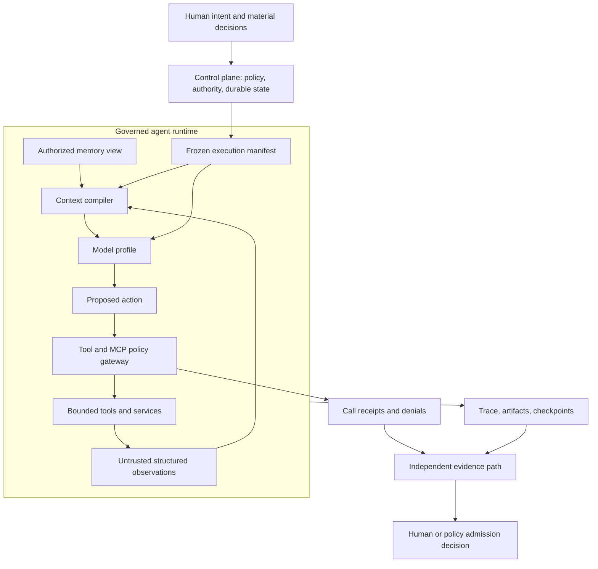
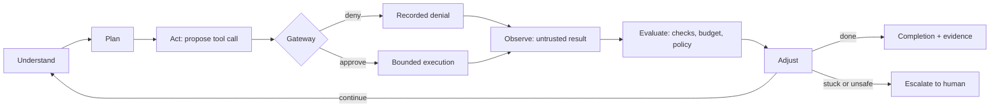
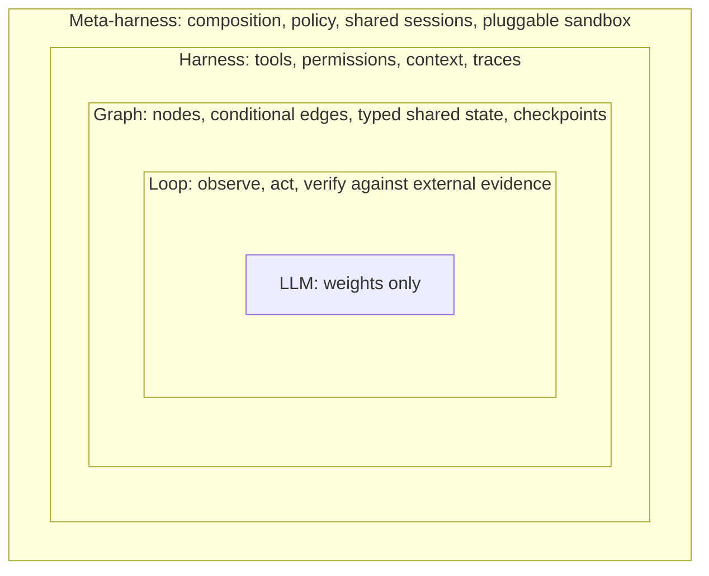
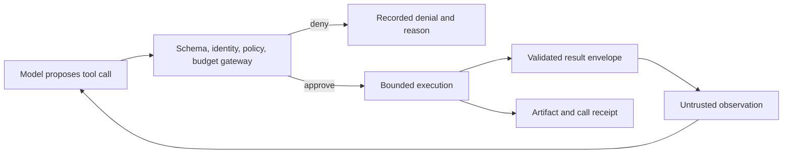
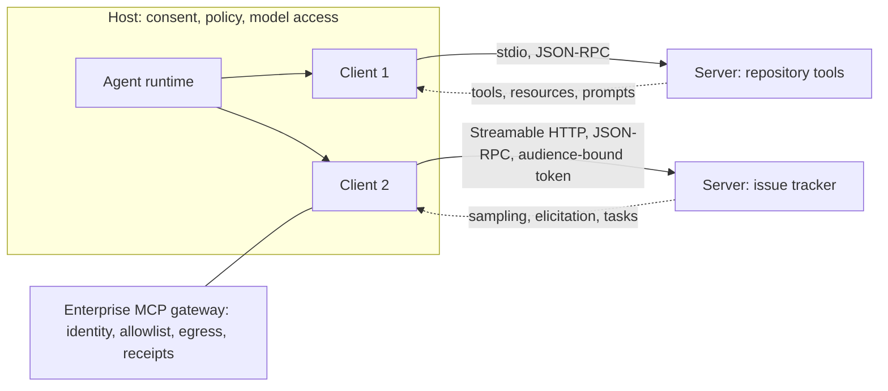
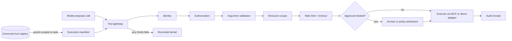
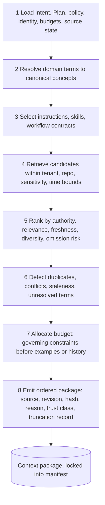
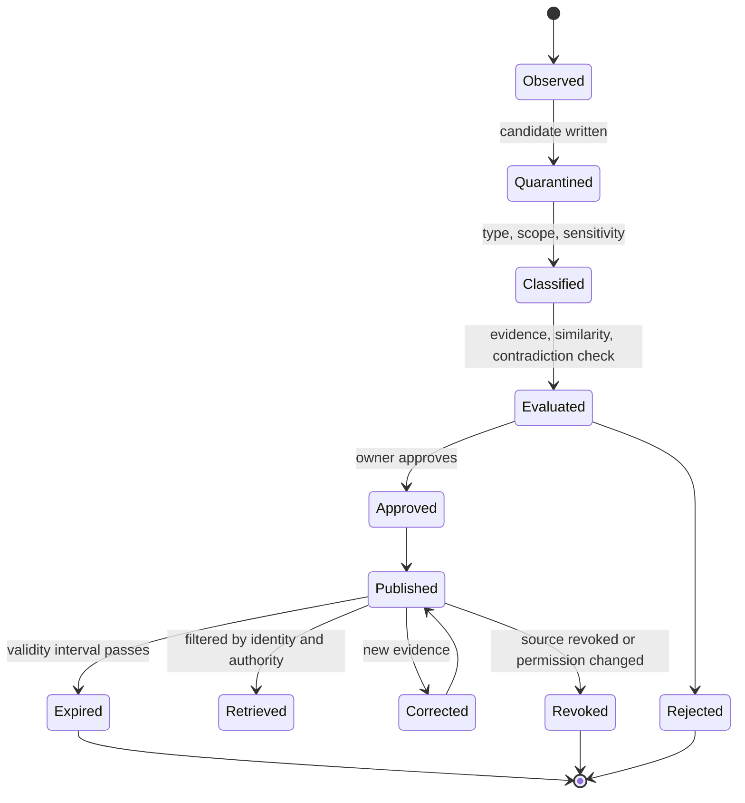

# 15. Agent architecture: loop, MCP, tools, context, and memory

The previous chapters built the harness and the environment an agent runs inside. This chapter opens the agent itself. It explains what an engineering agent actually is once you strip away the marketing, how its execution loop turns an objective into actions and observations, how the Model Context Protocol connects it to capabilities without granting it trust, what a tool must promise beyond a JSON schema, how context is compiled rather than pasted, and how memory is admitted, corrected, and revoked. After reading it you should be able to draw a complete governed agent runtime on a whiteboard and defend each box.

## The problem

A language model can read and write text. An engineering agent has to do far more: understand an authorized objective, observe the exact state of a repository, choose among tools, keep its execution state across a long task, respect policy, recover from failure, and leave evidence tied to the artifact it changed.

Teams often stuff all of those responsibilities into one prompt and call the result an agent. What they get is an opaque worker whose identity, authority, context, tools, memory, and model behavior cannot be versioned, revoked, or evaluated independently. When it produces something wrong, nobody can tell whether the model, the instructions, the retrieval, the memory, a tool adapter, the policy, the environment, or the retry loop caused the failure. The production question is therefore not "how do we write a better prompt?" It is "how do we construct a governed, observable, replaceable runtime around a fallible reasoning component?"

The problem exists for structural reasons. A model call does not by itself provide durable application state, identity, authority, or recovery; a provider may hold message history for you, but the factory still owns the authoritative state and still decides what enters each request. Context windows are finite, and everything that competes for the window (repository content, retrieved documents, MCP resources, tool descriptions, tool results, prior agent notes) can be wrong, stale, malicious, or irrelevant. The same model behaves differently when any prompt, tool schema, dependency, provider version, context item, or runtime policy changes. And adding agents adds specialization and parallelism at the price of hand-off loss, correlated error, duplicate work, cost, deadlock, and blurred accountability. A protocol can make capabilities interoperable, but it cannot decide which capability is safe for this user, this repository, this task, at this moment. All of that has to be owned by the surrounding system.

## How it works

### An agent is a governed runtime composition

Start with the plain definition. An **AI agent** is a system that can interpret a goal, reason about the work, use tools, take actions, observe results, and continue until it reaches a completion or escalation condition. An **autonomous agent** can take many such steps without a human instruction at each one, but still operates inside permissions, policies, budgets, and escalation boundaries. An **agentic workflow** is a structured sequence in which one or more agents reason, use tools, decide, and complete work toward an objective; **orchestration** coordinates which agent does which task, in what order, with what context, permissions, dependencies, and completion conditions. **Tool use** is how an agent touches external systems such as GitHub, Jira, CI/CD, databases, cloud environments, and observability platforms.

Behind those definitions sits the idea that organizes the whole chapter: an engineering agent is not a model with a long prompt. It is a versioned composition of eleven parts.

`identity + objective + instructions + model profile + tools + context + memory view + policy + budgets + state + evaluation profile`

| Component | Responsibility | What must be frozen or recorded |
|---|---|---|
| Identity | Names the agent role and the acting principal | Agent version, tenant, user or service principal |
| Objective | States the bounded outcome | WorkOrder and approved Plan references |
| Instructions | Defines trusted operating behavior | System instructions, skills, workflow versions |
| Model profile | Selects reasoning capability | Provider, model, parameters, routing policy |
| Tool grants | Defines possible actions | Tool names, versions, scopes, schema hashes |
| Context | Supplies decision-relevant knowledge | Source revisions, selection reasons, content hashes |
| Memory view | Supplies governed prior knowledge | Snapshot, query, scope, provenance, lifecycle filters |
| Policy | Limits authority | Policy bundle, risk class, required approvals |
| Budgets | Limits resource use | Time, tokens, cost, attempts, concurrency |
| State | Makes execution durable | Task, Attempt, lease, checkpoints, cancellation state |
| Evaluation profile | Defines expected behavior | Dataset, graders, thresholds, evidence requirements |

This is the same thing Jay's capability taxonomy calls an **agent definition**: the configuration that fixes an agent's purpose, instructions, tools, permissions, and behavior, with its role, capabilities, policies, goals, permissions, tool access, model configuration, autonomy level, escalation rules, and success criteria. Change any material component and you have a different worker; evidence from an earlier Attempt may no longer apply. A model name alone is never a sufficient reproducibility record.

Think of a surgeon on shift. The surgeon supplies judgment; the hospital supplies the badge, the operating list, the protocols, the checked-out instruments, the chart, the consent forms, the theatre time, and the audit trail. Nobody calls that "a surgeon with a long set of instructions." The institution around the person is what makes the judgment safe to act on.



### The execution loop

Inside the runtime the agent runs a cycle. The taxonomy names it the **execution loop**: understand → plan → act → observe → evaluate → adjust, repeated until the goal is met or an escalation condition is reached. Each step has a concrete meaning in a factory.

*Understand* means reading the frozen objective and the compiled context, not the raw repository. *Plan* means choosing the next bounded step, which may be revising the Plan the human approved but never silently widening it. *Act* means proposing a tool call. *Observe* means receiving the tool's result as an untrusted observation. *Evaluate* means checking the observation against acceptance criteria, budgets, and policy, with the deterministic checks the runtime owns rather than the model's own opinion. *Adjust* means deciding whether to continue, retry, replan, stop, or escalate. The loop decides the next action; the workflow around it, covered in [chapter 12](./12-durable-execution.md), owns durable progress and authority.

<!-- infographic: agent-loop -->
> **Infographic — The execution loop.** *(Jay's graphic goes here.)* Until then, the diagram below carries the same concept.



The taxonomy names what surrounds the loop. **Context management** supplies the right code, documents, history, state, and information at the right time; **context window management** decides what fits. **Control mechanisms** are the guardrails: permissions, approvals, policies, budgets, and human-in-the-loop checkpoints. A **guardrail** is any control that limits or redirects agent behavior; a **policy engine** evaluates rules and decides whether an action may proceed, needs approval, or must be blocked. The **execution environment** is the sandbox, container, or workspace where the agent runs commands and changes code; **sandboxing** isolates it so a mistake cannot reach what it should not. **State management** tracks progress across the loop, **error recovery** retries, repairs, or replans after failure, and **observability** traces decisions, actions, latency, failures, and cost.

### Four layers: loop, graph, harness, meta-harness

For the harness layer drawn as a single runtime control plane — execution graph, loop, memory, tool gateway, trust rail, observability floor — see [Chapter 13](./13-coding-harnesses-and-agent-protocols.md#the-harness-as-runtime-control-plane-one-diagram-for-every-production-agent).

An agent that burns tokens, declares the task complete, and then fails the tests is usually an architecture problem, not a prompting problem. The reflex is to rewrite the prompt or reach for a stronger model. Most of the time the failure came from the system around the model, and different failures have to be fixed at different layers. A public four-layer model, drawn as nested boxes, is the clearest way to see which layer is which; the outer layers each contain the inner ones, so the nesting reads meta-harness, then harness, then graph, then loop, then the model itself.

The **loop** is the smallest unit of agency. It observes what the environment actually returned rather than what the model expected, acts with one tool call and one real-world side effect per turn, and verifies against an external signal only: tests, a build exit code, a grader, CI. The part that matters is how completion is decided. Completion is a goal condition such as "the tests pass," never a step count and never the model's belief that the work looks right. Without an external verification signal an agent will confidently declare success on an incomplete task. *The model never grades its own work.* This is the execution loop above with its evaluate step made strict.

The **graph** is the workflow. Where a loop decides *whether* execution continues, a graph decides *where* it goes next. Nodes do the work: read shared state, do one thing, write the result back. Conditional edges read the state and return the name of the next node. Shared state is a typed record every node reads and writes, and it is the binding contract between them. Checkpoints snapshot the state after each node, which is what makes pause, replay, and human review possible. Branches, retries, specialist hand-offs, and fallbacks all live here. Use a graph when the path is uncertain, because it makes the route explicit, inspectable, and controllable. In this guide the graph is the task graph the orchestrator schedules ([chapter 18](./18-agent-and-loop-engineering.md)) on top of the durable workflow engine ([chapter 12](./12-durable-execution.md)).

The **harness** is the environment the model touches the world through. *The model is just weights. The harness is the agent.* Four things belong to it: the tools (the callable set, every action the model is allowed to attempt), the permissions (gates on tool calls, which actions need human approval first), the context (instruction files, loaded files, injected knowledge: what the model sees), and the traces (an immutable per-turn log of every call, input, and output). The consequence everyone underestimates is that **model capability is not agent capability**. A model may know exactly how to solve a task; if the tool, the data source, or the permission is not exposed through the harness, the agent still cannot do it. *A better prompt cannot compensate for a missing capability.* Fix capability in the harness, never in the prompt. [Chapter 13](./13-coding-harnesses-and-agent-protocols.md) and [Stage 4](../stages/04-execute-through-harness.md) cover the harness in full.

The **meta-harness** is the governance layer across harnesses. A real team runs Claude Code, Codex, an internal agent, and a few specialized domain agents side by side, and each arrives with its own tools, sessions, policies, permissions, and execution environment. Without a common layer, five harnesses are five silos. The meta-harness supplies four things: composition (a manifest that declares which agents exist and who may delegate to whom), policy (token caps and file rules enforced once and applied everywhere), collaboration (shared, resumable sessions across people, devices, and agents), and a pluggable sandbox (swap the isolation provider; the policy stays constant). Omnigent is one open-source implementation of this layer. In this guide it is the control plane and the Agent Factory's governance across harnesses ([chapter 10](./10-the-agent-factory.md), [chapter 11](./11-control-plane-orchestrator-and-execution-plane.md)).

The meta-harness has a stronger form that the four-layer model only implies. A **universal meta-harness** does not run a predetermined workflow; it constructs or selects the workflow an outcome needs. Given a goal, its constraints, and a **verification contract** (the structured list of claims that must be demonstrated before completion and how each is validated), the system decides the decomposition, the workers, the skills, the strategy, and the verification, rather than a human wiring those in advance. That is **outcome-driven execution**: work is governed by verifiable outcomes, not prescribed steps, and the instruction has the shape "produce X subject to Y and prove A through F before completion." In this guide the goal and constraints are the Mission and Plan the control plane of [chapter 11](./11-control-plane-orchestrator-and-execution-plane.md) holds, the verification contract is the quality contract the validator path checks, and the harness of [chapter 13](./13-coding-harnesses-and-agent-protocols.md) is what each chosen worker runs inside; the meta-harness's freedom is over the route, never over the authority, and a route it chooses is still frozen into the execution manifest before the first model call.

<!-- infographic: agent-layers -->
> **Infographic — Four layers around the model.** *(Jay's graphic goes here.)* Until then, the diagram below carries the same concept.



| Layer | What it owns | What it makes possible | The guide's term for it |
|---|---|---|---|
| Loop | Observe, act, verify; the completion rule | Verifiable work | The execution loop (this chapter); the attempt loop (chapter 18) |
| Graph | Nodes, conditional edges, typed shared state, checkpoints | A structured, inspectable workflow | The task graph and the workflow engine (chapters 12 and 18) |
| Harness | Tools, permissions, context, traces | An operational model | The inner and outer harness (chapter 13, Stage 4) |
| Meta-harness | Composition manifest, policy once, shared sessions, pluggable sandbox | Governable multiple agent environments | The control plane and Agent Factory governance (chapters 10 and 11) |

The diagnostic rule that follows is the one to keep. When an agent fails, ask *which layer is the failure at?* A task declared complete with red tests is a loop failure: the completion rule accepted the model's opinion. Work that took the wrong route, or retried the wrong thing, is a graph failure. A task the model understood but could not perform is a harness failure: a capability was missing. Two teams' agents that cannot share a session, or a policy that is enforced in one harness and absent in another, is a meta-harness failure. A stronger model improves reasoning; a reliable agent depends just as much on the architecture around it, and the incident question in [chapter 29](../05-operate/29-resilience-incidents-and-the-control-tower.md) is this rule applied after the fact.

### Six layers of a working agentic system

A second public model cuts the same system by production question rather than by nesting. Its premise is that the model sits inside a larger operating system, that each layer answers a different question, and that not every workflow needs every feature on day one. The table keeps the six rows and maps each to the chapter of this guide that owns it.

| # | Layer | Typical components | The question it answers | Where this guide covers it |
|---|---|---|---|---|
| 1 | Experience and trigger | Chat or application UI, inbox, schedule, event, API, file arrival, user identity | What starts the work, for whom, and where is the result delivered? | [Chapter 4](../02-design/04-the-human-agent-operating-model.md), [chapter 6](../02-design/06-intent-and-specification-engineering.md), [chapter 30](../05-operate/30-control-surfaces-event-contracts-and-storage.md) |
| 2 | Orchestration and state | Planner, workflow graph, tool routing, memory and state, loop limits, retries, fallbacks; bounded steps, approved methods, escalation paths, definition of done | What happens next, what is remembered, and how does execution stay bounded? | [Chapter 11](./11-control-plane-orchestrator-and-execution-plane.md), [chapter 12](./12-durable-execution.md), [chapter 18](./18-agent-and-loop-engineering.md) |
| 3 | Tools and deterministic logic | APIs, query services, code capabilities, rules, calculators, document generation, writeback | What can the system do, and which steps must stay deterministic? | This chapter's tool registry; [chapter 18](./18-agent-and-loop-engineering.md) on agents proposing and code disposing |
| 4 | Trusted context | Systems of record, read-only data layer, schema and semantic catalog, scoped knowledge, lineage and freshness, retrieved just in time under least privilege | Where does truth live, what does it mean, and what is the agent allowed to see? | This chapter's context compiler; [chapter 16](./16-data-knowledge-semantic-and-context-engineering.md) |
| 5 | Trust and control | Golden sets, deterministic checks, model-based review, guardrails, approvals, human escalation, audit; the agent withholds an answer when confidence drops | How do we know the result is acceptable, and what happens when it is not? | [Chapter 7](../02-design/07-governance-policy-and-risk-proportional-approval.md), [chapter 21](../04-prove/21-quality-and-evidence-architecture.md), [chapter 23](../04-prove/23-evaluation-engineering.md), [chapter 24](../04-prove/24-quality-contracts-proof-packages-and-certificates.md) |
| 6 | Runtime and operations | Hosting, identity, network, secrets, CI/CD, observability, cost controls, runbooks and lifecycle; private model instances per tenant; end-to-end traces; cost dashboards a finance leader can read; a model swap is one configuration change because no vendor is hardcoded | Can this run reliably outside a laptop and be owned as a business service? | [Chapter 14](./14-development-environments-sandboxes-and-compute.md), [chapter 17](./17-models-routing-and-capability-selection.md), [chapter 27](../05-operate/27-the-factory-as-a-platform.md), [chapter 28](../05-operate/28-observability-telemetry-and-forensics.md), [chapter 29](../05-operate/29-resilience-incidents-and-the-control-tower.md) |

Three lines from the source are worth carrying as they stand. On layer three: anything with a known right answer stays deterministic; the model reasons and explains, code does the math. On layer four: trusted context is most of an agent's success, and skipping it is how an agent ends up hallucinating. On layer five: correctness needs a number before anything ships. And the closing line is the reason this chapter treats the composition rather than the model as the thing you version: **the durable asset is the harness** (workflow knowledge, tools, context, evaluation, and controls); **models and platform services can change.**

### Reasoning is separated from authority

The single most important design rule is that the model proposes and the runtime disposes. The model can interpret intent, form hypotheses, choose among allowed options, and propose a tool call. It cannot expand its own scope. Before anything executes, the runtime validates the acting identity, the input schema, the policy, the repository and path scope, the risk class, the budget, the approval state, the idempotency strategy, and the environment. The result comes back as an observation, never as trusted instructions. And the runtime records both approved and denied calls, so a reviewer can reconstruct what the agent attempted, what actually ran, and why.



### The execution manifest is frozen before work begins

Every Attempt should resolve all of its mutable configuration into one immutable **execution manifest** before the first model call. The manifest is a contract, not a log assembled afterwards; runtime events and evidence must point back to it. A minimal manifest looks like this.

```yaml
attempt_id: attempt-123
work_order_revision: sha256:...
plan_revision: sha256:...
agent_version: agent-implementation-v4
model_profile: code-reasoning-standard-v2
instruction_bundle: sha256:...
tool_grants:
  - name: repository.read_file
    version: 3.2.0
    schema_hash: sha256:...
    scope: read
context_lock: sha256:...
memory_snapshot: sha256:...
policy_bundle: engineering-medium-risk-v5
budgets:
  wall_clock_seconds: 1800
  attempts: 3
evaluation_profile: repository-change-v7
```

### The AI concepts an architect must actually hold

The discipline this chapter belongs to is **AI Engineering**: the engineering practice that turns model capability into reliable systems through data, knowledge, semantics, context, agents, tools, structured outputs, routing, loops, evaluations, and runtime controls. Model prompting is one technique within that discipline, not the discipline itself. You do not need a history of model architectures to design a governed delivery system. You need enough model literacy to bound context, select inference profiles, evaluate behavior, control data, and plan capacity. The useful question is never "which model is smartest?" but "which qualified configuration meets this task's quality, safety, latency, availability, data, and cost contract?" The concepts that change factory decisions are these.

| Concept | Practical meaning | Factory decision it changes |
|---|---|---|
| Token | Unit a model reads and writes | Context and output budgets, cost, truncation, stop conditions |
| Context window | Maximum active input/output sequence | Retrieval, compaction, history, governing-content allocation |
| Embedding | Vector representation useful for similarity | Retrieval index, privacy, refresh, model/version compatibility |
| Structured output | Response constrained to a machine-readable schema | Validation, retry, compatibility, tool-call safety |
| Tool use | Model proposes a typed capability call | Authorization, side effects, idempotency, receipts, containment |
| Inference | Runtime generation from a fixed model version | Capacity, latency, data path, caching, cost, availability |
| Sampling | Controls variation in generation | Reproducibility, repeated trials, uncertainty, task profile |
| Multimodal input | Text plus image, audio, video, or other media | Data classification, parsing, evaluation, bandwidth, accessibility |
| Adaptation | Fine-tuning or other model-specific behavior change | Registry, data governance, evaluation, rollout, rollback |
| Retrieval | Selecting external knowledge at run time | Freshness, permission, attribution, poisoning, revocation |
| Prompting | Configuring instructions and examples at run time | Versioning, hierarchy, injection resistance, evaluation |

Keep the four improvement mechanisms distinct, because they have different owners, risks, rollback paths, and evidence. Training changes learned parameters. Adaptation specializes a model. Retrieval supplies current external information. Prompting supplies task instructions and examples. Do not call every improvement "training."

Economics follow from the same concepts. End-to-end latency is the sum of queue time, context retrieval, prompt construction, time to first token, generation, tool calls, validation, and retries; throughput depends on provider capacity, token volume, concurrency, batching, and model profile. Caching cuts cost but is only safe when identity, tenant, purpose, policy, source, and configuration versions are all in the key. Track reserved and actual tokens, model and tool calls, elapsed and queue time, evaluator cost, environment cost, and human attention per accepted outcome. A cheaper call that doubles retries is the expensive system.

Model classes (general-purpose, code-specialized, small local, reasoning-oriented, embedding, reranker, classifier, multimodal) are capability classes chosen by representative evaluation, data path, latency, cost, availability, tool and schema support, context behavior, and operational constraints; family names change faster than those decisions. Larger models help on hard tasks but raise cost, latency, and data exposure; local models improve control but add serving and capacity work; adaptation improves repeated domain behavior but raises data and rollout obligations. Choose the simplest qualified mechanism. None of this teaches training mathematics or certifies any model or provider; it is the literacy needed to make control, cost, and evidence decisions, and [chapter 17](./17-models-routing-and-capability-selection.md) turns it into a router.

### MCP is an interoperability boundary, not a trust decision

The **Model Context Protocol (MCP)** is a standard way to expose tools and contextual resources to AI systems through defined interfaces. For an executive audience the one-liner is enough: MCP gives agents a standardized way to discover and use enterprise tools and context. For an architect, the details matter, and the normative statements below are pinned to the stable `2025-11-25` specification; experimental features are labelled, and draft behavior must never silently redefine a production contract.

MCP uses a **host–client–server** architecture over JSON-RPC. The **host** is the application that coordinates model access, user consent, security policy, and context; it creates one **client** per server connection. The client negotiates the protocol version and capabilities, maintains the stateful session, and routes messages. The **server** exposes a focused set of capabilities. The session has a lifecycle: initialize with version and **capability negotiation**, operate, shut down. The stable specification defines two transports, local `stdio` and remote Streamable HTTP. A production contract must pin protocol version, transport, server identity, and negotiated capabilities; "supports MCP" is too vague to mean anything.

The analogy is a universal power socket. The standard guarantees the plug fits and the voltage matches. It says nothing about whether the appliance is safe, whether you are allowed to run it in this room, or whether it will set the curtains on fire. Capability negotiation proves both sides speak a compatible protocol. It does not prove a server is trustworthy, a tool is safe, or the current WorkOrder authorizes its use.

<!-- infographic: mcp-topology -->
> **Infographic — MCP topology.** *(Jay's graphic goes here.)* Until then, the diagram below carries the same concept.



MCP's primitives carry different control expectations, and a factory should treat each differently.

| Primitive | Purpose | Control model | Factory treatment |
|---|---|---|---|
| Tools | Perform computation or side effects | Model-controlled, with host/runtime approval | Apply schema, scope, risk, budget, and evidence policy |
| Resources | Expose addressable data or content | Application-controlled | Treat content and annotations as untrusted; retain URI, revision, provenance |
| Prompts | Reusable message templates | User-controlled | Treat server-supplied instructions as versioned content, not platform authority |
| Sampling | Server requests model generation through the client | Client-controlled, with user oversight | Constrain model access, tool loops, context, cost, and approvals |
| Elicitation | Server requests additional user input | User-controlled | Make the requesting server visible; protect sensitive-data boundaries |
| Tasks | Deferred, durable request execution | Negotiated; experimental in `2025-11-25` | Bind task state to authorization context; set TTL, cancellation, polling, audit rules |

One naming collision needs flagging. An **MCP Task** is a protocol-extension handle used to manage a long-running MCP operation, and it is not the same thing as the factory's Task: the domain Task organizes authorized WorkOrder execution and retains business and acceptance lineage, whereas the MCP Task tracks a single deferred request on one server connection. Do not let the former stand in for the latter in records or policy.

Every MCP server is three things at once: a software supply-chain dependency, an identity boundary, and a potential data-egress path. So the factory governs the connection, not only the individual call. An enterprise MCP gateway should demand a connection contract that answers ten questions.

| Control | Required decision |
|---|---|
| Server identity | Which organization, package, binary, endpoint, and version are trusted? |
| Transport | Local `stdio` or remote Streamable HTTP, and which network boundary does it cross? |
| Authentication | Which principal is connecting and how is it verified? |
| Authorization | Which resource is the token intended for, which scopes apply, and does scope increase require new consent? |
| Capability allowlist | Which tools, resources, prompts, sampling, elicitation, or task features may be negotiated? |
| Data policy | What may leave the repository or tenant, and what must be redacted? |
| Invocation policy | Which calls are read-only, reversible, consequential, or prohibited? |
| Operational bounds | Timeout, concurrency, rate, output-size, retry, and cancellation limits |
| Evidence | Which request, response, approval, denial, and artifact receipts must be retained? |
| Revocation | How can a server, capability, credential, or version be disabled immediately? |

Authorization over HTTP has its own rules. Access tokens must be **audience-bound** to the intended MCP server, requested with explicit **scopes**, and, following the specification's use of **resource indicators**, issued for that specific resource. **Token passthrough**, where a server forwards the client's token to unrelated downstream services, collapses trust boundaries and must not be treated as a shortcut. A scope increase should require fresh consent, not a silent renegotiation.

### MCP solves interoperability, not governance

Be precise about the problem MCP actually solves. Before a shared protocol, every agent host had to integrate with every capability separately: N hosts times M tools, each with its own discovery, schema, invocation, and response format. MCP collapses that **N×M integration problem** into one contract for discovery, tool schemas, invocation, and responses. That is valuable, and it is all it does. Identity, authorization, scope, argument validation, policy, and auditability stay with the factory, exactly where they were before the protocol arrived.

> *MCP standardizes connectivity. It doesn't outsource governance.*

It follows that MCP is not mandatory for every capability. Putting a service behind MCP buys reuse, discovery, consistent contracts, and portability across hosts; it costs another abstraction and another network hop. A high-throughput, stable, internal service that one runtime calls thousands of times an hour may be better served by a direct API adapter behind the same gateway. Decide per capability on reuse, interoperability, governance, latency, and operational cost, and record the decision.

| Question | Favors MCP | Favors a direct service call |
|---|---|---|
| Who else calls it? | Several hosts, harnesses, or providers | One runtime, one team |
| How stable is the contract? | Evolving; discovery and schema negotiation pay off | Frozen; a typed client is simpler |
| What does the hop cost? | Latency is tolerable for the task | High throughput or tight latency budget |
| Where is governance enforced? | At the gateway either way | At the gateway either way |
| Operational burden | Shared server, shared lifecycle | Owned adapter, owned lifecycle |

*MCP is an interoperability decision, not a religion.* Either path passes through the same registry and gateway described below.

### Tools are behavioral contracts

A tool is not safe because its arguments satisfy a JSON Schema. Its contract has to define behavior under success, failure, retry, cancellation, and partial completion.

| Contract field | Why it matters |
|---|---|
| Input and output schema | Makes validation and downstream interpretation explicit |
| Acting identity | Attributes the action to the correct user, service, and agent |
| Scope | Limits repositories, paths, records, operations, and environments |
| Side-effect class | Separates observation from reversible and from consequential mutation |
| Idempotency | Prevents retries from duplicating commits, messages, deployments, or records |
| Timeout and cancellation | Bounds abandoned or long-running work |
| Retry policy | Distinguishes safe transient recovery from repeated harmful action |
| Rate limits | Protects the downstream system and caps runaway loops |
| Approval behavior | States which calls need a human, and whether approval can be pre-granted by risk class |
| Result envelope | Separates structured data, human-readable explanation, and error state |
| Evidence receipt | Ties the call to inputs, outputs, artifacts, and policy decisions |
| Version and schema hash | Makes behavioral change detectable and evaluable |

Keep two error classes apart. A **protocol error** (malformed request, unknown method, invalid parameters) is not the same as a **tool-execution error**, where a well-formed request ran and the business operation failed. Structured failures let the model correct an input without hiding an operational or policy failure. The official tools specification covers validation, execution errors, access control, rate limiting, timeouts, and audit logging for exactly this reason. Output schemas matter as much as input schemas: a result the runtime cannot parse cannot be validated, and a result the runtime cannot validate should not become an observation the model trusts.

A tool contract is written from the platform's side. Seen from the agent's side, the same tool is an **agent affordance**: an interface or property deliberately created so that a capability is easier and safer for an agent to use than the human-facing alternative. A CLI or API where a human would use a UI; a structured query where a human would read raw logs; an environment manifest where a human would follow a setup page; a structured error where a human would read a stack trace. The result envelope and the two error classes above are affordances in this sense, and so is every field in the contract table that turns a guess into a fact the agent can act on. [Chapter 20](./20-autonomous-engineering-workflows.md) scores a repository's affordances as part of its agent readiness, and the diagnostic is the same there as here: when an agent keeps stopping at the same step, the missing piece is usually an affordance, not a prompt.

### The governed tool registry: where intelligence becomes authority

A model with no tools can only be wrong on paper. A model with a tool can be wrong in a repository, a ticket queue, or a production environment.

> *The moment a model gets a tool, intelligence becomes authority.*

That is why capabilities do not reach an agent directly, whether they arrive over MCP or a direct adapter. They sit behind a **governed tool registry** and **tool gateway**. The registry is the catalog of capabilities the factory knows about; the gateway is the enforcement point every call passes through. Registering a tool means answering eight questions before any agent can see it.

| Question | What the registry records |
|---|---|
| What capability is this? | Purpose, side-effect class, the systems it touches |
| Who can invoke it? | Eligible agent definitions, roles, and workflows |
| On whose behalf? | The acting principal the call is attributed to: user, service, or workload identity |
| Which resources? | Repositories, paths, records, environments, tenants it may reach |
| What are valid arguments? | Typed input schema and validation rules |
| What is its risk class? | Read-only, reversible, consequential, or prohibited by default |
| Is approval required? | Whether a human or policy must admit the call, and whether approval can be pre-granted by risk class |
| What is logged as evidence? | The request, response, decision, and artifact receipts retained per call |

Alongside those answers the registry carries the operational contract from the previous section: typed schema, timeout, rate limit, and audit behavior. Grants are then scoped to the task, not to the agent in general. A repository-analysis agent gets read access to one repository; it does not get deployment credentials because they happened to be available on the host. The same agent definition can hold different grants in different WorkOrders.

The controls that matter most at the tool boundary are enforced outside the model, in this order of precedence: identity, authorization, argument validation, resource scope, rate limits, timeouts, auditability, and approval requirements. None of them depends on the model's cooperation. A prompt cannot loosen a schema, and a persuasive retrieved document cannot widen a scope.



> *The model proposes the action. The platform decides whether it is allowed.*

### Context engineering is controlled compilation

**Context engineering** is the discipline of supplying an agent with the right information, instructions, tools, history, policies, and constraints at the right time. In a factory it is a compilation step, not a copy-paste. The **context compiler** selects the smallest sufficient set of trusted directives and relevant observations for one decision. More context is not automatically better: irrelevant material burns tokens, adds conflicting cues, and can bury the governing constraint. Think of it as packing a briefing folder for one meeting rather than wheeling in the whole filing cabinet.

<!-- infographic: context-assembly -->
> **Infographic — Context assembly.** *(Jay's graphic goes here.)* Until then, the diagram below carries the same concept.



Good context architecture keeps five categories visibly separate: **instructions** (trusted runtime directives), **authoritative context** (approved contracts, policy, identity, exact source state), **reference context** (documentation and retrieved knowledge), **working context** (transient hypotheses and scratch state), and **evidence** (observations tied to exact actions and artifacts). Retrieved text lives in the reference tier and can never promote itself into instructions or authority. [Chapter 16](./16-data-knowledge-semantic-and-context-engineering.md) covers the pipeline that feeds step four and the full retrieval contract.

### Four kinds of context, one governed input

The five trust categories say how much authority a piece of context carries. A second cut says where it comes from and how long it should live. Every item the compiler considers belongs to one of four types, and mixing them is how context windows fill with material nobody chose.

| Context type | What it holds | Lifetime | Who admits it |
|---|---|---|---|
| **Task/run context** | What this execution needs now: objective, acceptance criteria, scope, the files in play | The current step or Attempt | The compiler, from the manifest |
| **Working state** | Intermediate artifacts, hypotheses, tool results, scratch notes | The current Attempt; cleared or compacted at its end | The runtime, outside the model |
| **Enterprise retrieval** | Authoritative organizational knowledge: code, docs, tickets, decisions, policy | As fresh as the source and its permission | The retrieval pipeline, after permission and provenance checks |
| **Durable memory** | Knowledge intentionally retained across executions | Until corrected, expired, or revoked | An explicit promotion decision |

The goal for every step is the minimum high-quality set that is relevant, permission-aware, and attributable. A larger window is a larger budget, not an instruction to spend it.

> *Context is a governed input, not everything we can fit into the window.*

The fourth row is the one teams get wrong. Durable memory must be *deliberately promoted*: something enters it because an owner or a governed process decided it should, with provenance attached. If every previous model output silently becomes permanent truth, memory turns into one more source of stale and incorrect context, and a bad hypothesis from last month is retrieved next month as a fact. The admission flow in the next section is what "deliberate" means in practice.

### Memory is governed, typed, and revisable

**Memory** lets a system preserve useful information across steps or sessions: mission state, past decisions, user preferences, system knowledge, previous outcomes. **Retrieval-augmented generation (RAG)** combines model reasoning with retrieved enterprise knowledge such as documentation, tickets, code, and operational records. Both are valuable, and both become dangerous when they turn into a shadow system of record. Memory should improve future decisions; it must never rewrite operational records, which remain authoritative and which memory may only reference.

| Memory type | Useful for | Main risk | Required control |
|---|---|---|---|
| Session | Current Attempt state and scratch work | Treating a hypothesis as fact | Attempt scope and automatic expiry |
| Episodic | What happened in prior runs | Copying a past solution into a different case | Artifact links, outcome, time, similarity evidence |
| Semantic | Claims, entities, terminology, relationships | Stale or contradictory knowledge | Provenance, confidence, validity interval, contradiction links |
| Procedural | Skills, prompts, workflows, runbooks | Promoting an unsafe behavior | Evaluation, ownership, approval, versioning, rollback |

The table's rows have precise meanings. Session memory is **Working Memory**: the short-lived task and conversation state required for the current run, including intermediate artifacts and tool results, which should be cleared, compacted, or deliberately persisted when the run ends. **Episodic Memory** is the attributable record of past events and experiences, including when they occurred and which outcome followed; a prior episode is evidence about history, not a universal instruction. **Semantic Memory** holds durable facts, concepts, and relationships retrieved by meaning, and similarity there does not prove truth, freshness, permission, or authority. **Procedural Memory** is versioned reusable knowledge about how to perform a task, normally expressed as a skill, workflow, runbook, or instruction set, and it must be evaluated and lifecycle governed. Cutting across the semantic row is **Temporal Memory**: time-aware facts and relationships that preserve when a claim was valid and how it changed, so that a current answer does not silently combine incompatible historical states.

Procedural memory itself splits two ways, and the split decides what enters the context window on every turn. A **rule** is always-on steering that the harness pushes into context unconditionally (an eager push): the repository's conventions, the actions the agent must never take, the house style. A **skill** is loaded only when the agent judges the task relevant (a lazy push): the procedure for a class of work, with its scripts and examples. Rules cost context on every run and cannot be missed; skills cost nothing until needed and depend on discovery. Guidance that belongs in a rule but is written as a skill gets skipped; guidance that belongs in a skill but is written as a rule bloats every prompt. Both are packaged, versioned, and installed as context as code; [Chapter 10](./10-the-agent-factory.md) covers the manifest, registry, and lifecycle that make that true.

A safe memory lifecycle is a write-admission flow, and memory quality depends far more on it than on vector search quality.

<!-- infographic: memory-admission -->
> **Infographic — Memory write admission.** *(Jay's graphic goes here.)* Until then, the diagram below carries the same concept.



Every write retains source, scope, time, confidence, sensitivity, owner, lifecycle state, and the evidence that supported promotion. Retrieval filters by the current identity and authority, returns citations and a "why retrieved" reason, and exposes contradictions instead of silently picking a winner. Deletion, correction, expiry, tenant isolation, and permission changes are first-class lifecycle events: a **correction** links the old claim to the new one and to the evidence that changed it, so a reader can see the history rather than a rewritten past.

### Use multiple agents only for a measurable reason

Add another agent when independent verification, parallelism, context isolation, or specialized expertise produces a measurable gain, never to imitate an organization chart. Every hand-off needs an explicit input contract, output schema, authority, budget, termination condition, and owner. Shared durable state belongs in the runtime, not in private message history. Independent validation needs a separate evidence path, different incentives or tools where appropriate, and protection against correlated failure; a different persona name is not independence. And evaluate the complete configuration and workflow, because a model benchmark cannot show whether context selection, tool policy, memory, recovery, or coordination works. [Chapter 18](./18-agent-and-loop-engineering.md) develops the patterns. None of this diagnosis works without stable identifiers: every record — manifest, Attempt, artifact, policy decision — has to share them, or a reviewer cannot trace a failure back to its cause. That is also why a small governed agent stays easier to trust and improve than one whose tools, memory, and context keep expanding without bound; growth in composition is a cost to justify, not a default.

## How to build it

Prefer deterministic code for schema validation, parsing, hashing, routing rules, state transitions, policy enforcement, and admission gates. Use the model for ambiguous interpretation, planning, comparison, and generation. Then assemble the runtime in this order.

1. Resolve the WorkOrder and Plan into a frozen execution manifest covering identity, instructions, model profile, tool grants, MCP connections, context lock, memory view, policy, budgets, and evaluation profile, and store its digest with the Attempt.
2. Establish only approved tool and MCP connections, with least privilege, under a signed connection contract; pin protocol version, transport, server identity, and negotiated capabilities.
3. Register each tool with the full behavioral contract above, classify its side effects, and decide its approval behavior by risk class before any agent can call it.
4. Compile a provenance-rich context package with the eight-step algorithm; keep the five trust categories separate; record truncation.
5. Build the authorized memory view from a snapshot filtered by tenant, identity, scope, and lifecycle state.
6. Run the execution loop inside the policy gateway with cancellation and recovery; record every proposed call, approval, denial, result envelope, and receipt.
7. Produce artifacts, trace, checkpoints, receipts, and denials on an independent evidence path that points back to the manifest.
8. Admit delivery only through policy and human authority.
9. Route candidate memories through quarantine, classification, evaluation, approval, and publication, with correction, expiry, and revocation wired in from the first day.

Before shipping, weigh the choices that shape the composition.

| Choice | Benefit | Cost or risk | Use when |
|---|---|---|---|
| One general agent | Simple operations, fewer hand-offs | Broad context and authority; harder diagnosis | Task is bounded and tools are low risk |
| Specialized agents | Context isolation and focused expertise | Coordination cost and hand-off loss | Specialization gives a measured quality or latency gain |
| Direct tool adapters | Tight control, simple debugging | Provider-specific integration | Capability surface is small and stable |
| MCP adapters | Interoperability, reusable discovery | Extra server, session, identity, and egress boundaries | Multiple hosts or providers need a common protocol |
| Retrieval-only context | Current, targeted information | Retrieval error, missing authority | Sources are indexed, versioned, evaluable |
| Long-term memory | Continuity and compounding knowledge | Staleness, leakage, poisoning, hidden coupling | Write admission and correction lifecycle are governed |
| Knowledge graph | Relationship traversal and lineage | Ingestion and consistency complexity | Queries need graph structure and provenance |

### Tool access without context bloat

The registry and gateway above decide *whether* a call is allowed. A separate build decision is *how much of the tool catalog the model has to carry in its head to make the call at all*, and it dominates cost once the catalog is large. Standard MCP loads every tool schema into every session. Uber's engineering team, which routes more than a thousand internal and SaaS MCP servers through one gateway for central authentication and policy, published the numbers: a session with a hundred or more tools carries roughly 50–70K tokens of schema in its first prompt, re-sent on every turn. SaaS vendors make it worse by exposing everything: one workspace suite alone was 49 tools and about 22K tokens of schema, a messaging server 34 tools, a project tracker 46. Two or three vendor servers put more schema in the window than the file being edited, before the user has typed anything. These are one organization's measurements, but the mechanism is universal.

Two fixes remove the schema from the context rather than trimming it. The first is **CLI tool resolution**: the model runs a shell command; a command-line tool resolves and invokes the MCP tool against the gateway at call time. Every server is projected as a CLI command, and the schema in context drops to near zero because the model needs to know only the command, not the full contract. The second is **tool search**: the model searches the catalog and loads only the tools it needs for the task, which scales to thousands of tools without the selection-accuracy decay that a huge always-loaded catalog produces. Both keep the gateway exactly where it was: identity, allowlist, egress, and receipts still sit on the single path every call takes.

Once tools are callable from the shell, a third pattern becomes available. **Code-mode** lets the model batch many actions into one script. Chatty protocols, such as submit a query, poll its status two to five times, then fetch the result, run inside a subprocess, and only the summary returns to the context. Uber measured five identical SQL queries in one session, tool-calling versus code-mode:

| Query | Tool-calling tokens | Code-mode tokens | Saved |
|---|---|---|---|
| `SELECT 1` (1 row) | 903 | 402 | 55% |
| `COUNT(*)` | 954 | 403 | 58% |
| `GROUP BY`, 20 rows | 1,600 | 457 | 71% |
| `SHOW COLUMNS`, 175 rows | 2,200 | 900 | 59% |
| `SELECT *`, wide table, 50 rows | 1,431,594 | 900 | ~100% |

The savings come from removing the schema initialization, the multi-turn polling, and the step-by-step reasoning between calls, not from shrinking the payload; the last row is a wide result that never entered the context at all. For bulk workflows N model turns collapse into one script and more than 90% of the tokens disappear. The team ships pre-built code-mode skills for its most-used servers so that the cheap path is the default path, and routes SaaS MCPs through the same gateway, exposed as CLIs, with a code-mode skill per server for the common workflows.

The factory rule that falls out: the gateway governs every call; the catalog is resolved at call time, not preloaded; and anything that polls, pages, or loops runs in code and returns a summary. A tool the model cannot see costs nothing until it is needed, and a tool the model can see costs tokens on every turn whether it is used or not.

Finally, secure the data path. Model inputs and outputs carry source code, credentials, personal or regulated data, and proprietary context, so define allowed providers, regions, retention, training and data-use terms, redaction, encryption, and logging. Embeddings and caches inherit the sensitivity of their sources, and bias and safety evaluation must match the real users, languages, repositories, and decisions affected.

## Failure modes

The recurring anti-patterns are granting every discovered MCP tool, treating tool annotations as trusted policy, passing full conversation history to every server, retrying consequential tools without idempotency, storing every agent message as memory, and adding agents to compensate for an undefined workflow. Beneath those sit the runtime failures an architect must plan for.

| Failure | Detection | Correct response |
|---|---|---|
| Context limit hit | Compiler truncation record | Recompile with explicit allocation; never silently drop governing content |
| Invalid structured output | Schema validation | Bounded schema repair, or fail with the original response retained |
| Provider unavailable | Health probe, error class | Approved equivalent fallback or explicit pause; record the changed profile |
| Quality drift | Slice evaluation, outcome trend | Restrict the profile, route to the previous version, investigate by slice |
| Cost spike | Budget telemetry | Admission and budget control; never bypass safety validation to save tokens |
| Suspected data leakage | Egress monitor, receipt anomaly | Contain, revoke credentials, preserve evidence, notify data and security owners |
| Nonconverging loop | Attempt and improvement budget | Stop on budget and escalate |
| Injected instruction in reference context | Gateway denial, trust-class audit | Record the attempt and denial; the content never gains authority |
| Tool retry duplicates a side effect | Receipt mismatch | Idempotency key per consequential call; mark the tool non-retryable until fixed |
| Memory contradiction | Contradiction link | Surface both claims with provenance; owner resolves; never auto-merge |
| Tool grant wider than the task | Registry audit; call to a resource outside WorkOrder scope | Scope grants per WorkOrder; deny at the gateway; review the agent definition |
| Silent memory promotion | Prior outputs retrieved as fact with no promotion record | Require an explicit promotion decision with provenance; quarantine the unpromoted entries |
| MCP adopted where a direct call was cheaper | Latency and hop cost dominate a stable internal service | Re-decide on reuse, interoperability, governance, latency, and cost; keep the gateway either way |
| Prompting a capability gap | Prompt rewrites and model upgrades on a task the model describes correctly but cannot perform; no tool, data source, or permission for it in the manifest | Diagnose by layer; add the capability to the harness and the registry; a better prompt cannot compensate for a missing capability |
| Tool-schema bloat | Tens of thousands of schema tokens in the first prompt, re-billed every turn; vendor MCP servers exposing dozens of tools each | Resolve tools at call time through a CLI or tool search behind the gateway; load only what the task needs |
| Polling loop in context | Submit, poll, poll, fetch cycles each consuming a model turn; wide query results landing in the window | Run chatty protocols in code-mode inside a subprocess; return only the summary |

Catch these before production by evaluating complete configurations (model, prompt, tools, context, harness, environment, policy, evaluator) with representative cases, deterministic checks, calibrated graders, repeated trials, confidence intervals, adversarial cases, and outcome slices. A high average can hide a catastrophic failure in a critical slice; no single score establishes truth, so retain disagreements, uncertainty, and counterevidence, and promote only on predefined improvement and non-regression criteria. When something does go wrong, the incident framework in [chapter 29](../05-operate/29-resilience-incidents-and-the-control-tower.md) asks which layer failed: intent, context, model, tool, state, policy, or evaluation. The separation of components in this chapter is what makes that question answerable.

## In Mission Control

At commit [`b31e275`](https://github.com/jaydubya818/MissionControl/tree/b31e27564deb1c03c167e61b5ee094567c2ba7b1), Mission Control contains agent-platform components at different levels of maturity. This describes that pinned commit only.

**Implemented.** Agent templates, versions, instances, and identities give versioned registry records; the older agent model also stores role, allowed task types and tools, budgets, status, and heartbeats. A context router combines deterministic rules, classification, confidence, capacity, and budget to choose clarification, deferral, a single Task, or coordinator decomposition. The Context Registry supports versioned packages, semantic version ranges, repository manifests, lock files, published content hashes, installation records, verifiers, and idempotent activation receipts; executor-facing activation rejects unpublished or hash-mismatched content and links the locked package set to a WorkflowRun. That is a real example of compiling context rather than copying prompt text. Tool calls are recorded with risk policy applied, and the executor adapter freezes repository root, allowed paths, isolation, timeout, and model. Provider packages implement structured tool-call formats.

**Partial.** Memory. `packages/memory` implements session, project, and global in-memory abstractions; Convex records run episodes and execution traces and can consolidate batches into knowledge-graph nodes. The GraphRAG proposal itself lists what is missing: provenance, contradiction handling, permission-aware retrieval, ingestion checkpoints, evaluation, and a correction lifecycle. The live audit described an empty operational graph, so the proposal is not a production memory system.

**Future.** MCP is adjacent rather than a governed subsystem. Product documents and plugin guidance describe MCP integrations, but the commit does not show a first-class server registry, connection policy, capability lifecycle, or end-to-end execution through MCP. A per-Attempt manifest digest covering all eleven components is also still to be built.

## Retain this

- An agent is a versioned composition of identity, objective, instructions, model profile, tools, context, memory view, policy, budgets, state, and evaluation profile, not a model with a long prompt; change any component and evidence from an earlier Attempt may no longer apply.
- Diagnose a failure by layer: loop (completion is a goal condition, the model never grades its own work), graph (routing), harness (a missing capability, since a better prompt cannot compensate for it), meta-harness (cross-harness policy and sessions). Model capability is not agent capability.
- The model proposes; only the runtime authorizes. Every call passes a gateway (identity, authorization, validation, scope, rate limits, approval) before it executes, and the execution manifest is frozen before the first model call so every event and piece of evidence points back to it.
- MCP standardizes connectivity, not governance, and solves the N×M integration problem and nothing more. Choosing it over a direct call is an interoperability decision, not a religion.
- Context is a governed input, not everything we can fit into the window: the minimum relevant, permission-aware, attributable set for one decision. Durable memory is promoted deliberately, never silently.
- Add another agent only for a measurable gain in verification, parallelism, isolation, or expertise, and evaluate the whole configuration, never the model alone.
- Traceability depends on every record sharing stable Attempt, manifest, artifact, and policy identifiers; a small governed agent stays easier to trust and improve than one whose tools, memory, and context keep expanding.

## Go deeper

- Related chapters: [12. Durable execution](./12-durable-execution.md) for the workflow around the loop; [13. Coding harnesses and agent protocols](./13-coding-harnesses-and-agent-protocols.md) for where MCP sits beside ACP and AG-UI; [16. Data, knowledge, semantic, and context engineering](./16-data-knowledge-semantic-and-context-engineering.md) for the retrieval pipeline; [17. Models](./17-models-routing-and-capability-selection.md) for routing; [18. Agent and loop engineering](./18-agent-and-loop-engineering.md) for multi-agent patterns; [26. Security](../04-prove/26-security.md) for injection and tool poisoning; [33. Governed learning](../06-improve/33-governed-learning-and-compounding-engineering.md) for memory promotion.
- MCP `2025-11-25` baseline: [specification](https://modelcontextprotocol.io/specification/2025-11-25), [architecture](https://modelcontextprotocol.io/specification/2025-11-25/architecture), [lifecycle and capability negotiation](https://modelcontextprotocol.io/specification/2025-11-25/basic/lifecycle), [transports](https://modelcontextprotocol.io/specification/2025-11-25/basic/transports), [authorization](https://modelcontextprotocol.io/specification/2025-11-25/basic/authorization), [tools](https://modelcontextprotocol.io/specification/2025-11-25/server/tools), [resources](https://modelcontextprotocol.io/specification/2025-11-25/server/resources), [prompts](https://modelcontextprotocol.io/specification/2025-11-25/server/prompts), [sampling](https://modelcontextprotocol.io/specification/2025-11-25/client/sampling), [elicitation](https://modelcontextprotocol.io/specification/2025-11-25/client/elicitation), [tasks (experimental)](https://modelcontextprotocol.io/specification/2025-11-25/basic/utilities/tasks), [changelog](https://modelcontextprotocol.io/specification/2025-11-25/changelog).
- Mission Control at `b31e275`: [agent identities](https://github.com/jaydubya818/MissionControl/blob/b31e27564deb1c03c167e61b5ee094567c2ba7b1/convex/registry/agentIdentities.ts), [agent versions](https://github.com/jaydubya818/MissionControl/blob/b31e27564deb1c03c167e61b5ee094567c2ba7b1/convex/registry/agentVersions.ts), [context manifests](https://github.com/jaydubya818/MissionControl/blob/b31e27564deb1c03c167e61b5ee094567c2ba7b1/convex/context/manifests.ts), [context activation](https://github.com/jaydubya818/MissionControl/blob/b31e27564deb1c03c167e61b5ee094567c2ba7b1/convex/context/activation.ts), [context router](https://github.com/jaydubya818/MissionControl/blob/b31e27564deb1c03c167e61b5ee094567c2ba7b1/packages/context-router/src/router.ts), [memory lifecycle](https://github.com/jaydubya818/MissionControl/blob/b31e27564deb1c03c167e61b5ee094567c2ba7b1/convex/memoryLifecycle.ts), [graph-assisted memory proposal](https://github.com/jaydubya818/MissionControl/blob/b31e27564deb1c03c167e61b5ee094567c2ba7b1/docs/plans/memory-graphrag-architecture.md), [plugin and MCP guidance](https://github.com/jaydubya818/MissionControl/blob/b31e27564deb1c03c167e61b5ee094567c2ba7b1/docs/CREATING_PLUGINS.md).
- Sources: Jay West, "Key terms and definitions" capability taxonomy (execution loop, agent definitions, harness terms); Jay West, factory architecture notes (the four context types, the governed tool registry, MCP versus direct calls); the AI Software Factory study guide, chapter 6 terminology; the agent platform technology glossary (MCP, FastMCP, durable context patterns); the "Factory in one line" notes on harness ownership and the incident layer list.
- Public sources: *The 4 Layers of an Agent System Explained* (public post, 2026) for the loop, graph, harness, and meta-harness nesting, the completion rule, and "model capability is not agent capability"; *Six layers of a working agentic system* (public post, 2026) for the six-layer table and "the durable asset is the harness"; Uber Engineering, *Running a Software Factory Efficiently at Uber Scale* (2026) for the MCP gateway, CLI tool resolution, tool search, code-mode measurements, and SaaS MCP schema sizes.
- Public practitioner talks, 2026: the universal meta-harness, outcome-driven execution and the verification contract, and agent affordances.
- [Glossary](../appendix/glossary.md).
