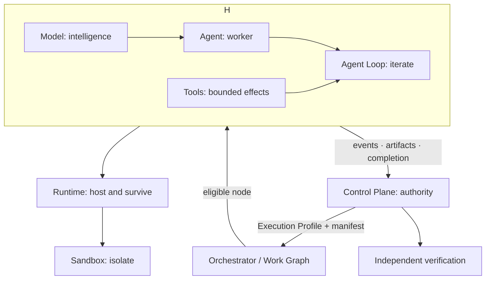
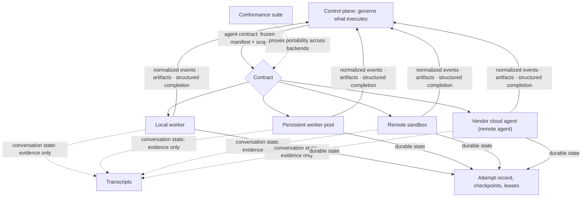
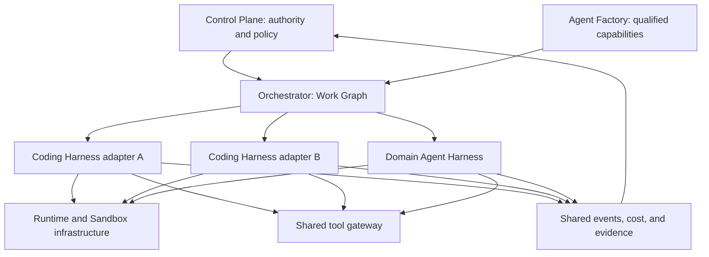
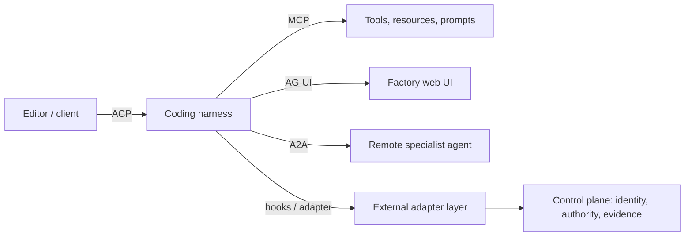

# 15. Coding harnesses and agent protocols

A factory can adopt a coding harness without surrendering its delivery contract. This chapter defines the boundary: the harness governs how one agent operates, while the factory owns identity, authority, durable workflow state, evidence requirements, and acceptance. It also places MCP, ACP, AG-UI, and A2A at the specific seams they standardize.

## The problem

Interactive coding tools were designed to collaborate with a person sitting in front of them. A human reads the terminal, approves a prompt, notices that a session has gone quiet, fixes an expired login, and decides whether the agent's "done" is credible. A factory has none of those affordances. Its workers start hundreds of times, run concurrently, outlive an HTTP request, and get destroyed after one Attempt. Every judgment the human used to make must become a structured, machine-verifiable equivalent.

Harnesses also differ from each other in almost every dimension that matters: tools, permission models, session formats, hooks, subagents, context behavior, output events, sandboxes, and completion semantics. A factory that shells out to a CLI may look provider-neutral while silently depending on an undocumented transcript file, a line of terminal text, or one product's lifecycle quirks. Swap the CLI and the factory breaks in ways nobody can name.

Protocols promise to fix this and partly do, but each one standardizes a single boundary. No protocol connects models, tools, editors, user interfaces, remote agents, development environments, and factory governance at once. And harness products change monthly, so any feature matrix baked into the architecture is stale before it ships. The durable design object is a **capability contract** plus a **conformance suite**, not a ranking of products.

## How it works

### Resolve the boundary before naming the harness

Most disagreement about “agent harness” is a boundary disagreement. Some people
mean the iteration loop inside a worker. Some mean the operating environment
around the worker. Some mean the workflow coordinating many workers. Others
include enterprise policy, identity, budgets, and emergency controls. FDLC gives
each responsibility its own term, owner, lifecycle, and qualification boundary.

| Boundary | Canonical FDLC term | Question it answers |
| --- | --- | --- |
| Intelligence | Model | What reasoning or generation is available? |
| Worker | Agent | Who is pursuing the bounded task? |
| Iteration | Agent Loop or Execution Loop | How does this worker make progress and stop? |
| Construction toolkit | Agentic SDK | Which reusable abstractions or supplied implementations are used to build it? |
| Operating envelope | Agent Harness | Under what conditions may this worker operate? |
| Work topology | Work Graph | What work can happen next? |
| Coordination | Orchestrator | Which eligible node runs next, and how does the overall run progress? |
| Execution substrate | Runtime | Where and how does execution live and survive? |
| Isolation | Sandbox | What can this execution affect? |
| Enterprise authority | Control Plane | Who may authorize, revoke, approve, and release? |

External material often calls the Agent Loop an “inner harness” and a mixture of
adapter, supervisor, Runtime, Orchestrator, and policy controls an “outer
harness.” Treat those as source-specific aliases. In canonical FDLC writing,
name the exact boundary instead.

An **Agent Loop** loads state, plans or selects, acts, observes, evaluates,
updates or replans, and repeats. It terminates on proven success, a turn, time,
token, or cost limit, stalled progress, policy escalation, or a required human
decision. Loop Engineering improves next-action choice, context sufficiency,
progress evaluation, replanning, and stopping. The loop may run inside one Work
Graph node; it is not the graph.

A **Work Graph** holds nodes, dependencies, branches, joins, gates, interrupts,
cycles, failure transitions, and terminal states. Nodes do work; edges decide
what happens next. The **Orchestrator** advances this durable graph across agents,
harness invocations, deterministic work, and human waits. Graph Engineering
designs topology. Orchestration coordinates work. Neither term means the
worker's Agent Loop.

### What the Agent Harness owns

An **Agent Harness** is the bounded operating environment governing how an Agent
interacts with models, context, tools, state, execution resources, and external
systems. It converts raw model intelligence into an operational capability.

*A harness determines how an agent is allowed to operate.*

Typical responsibilities include the task contract, instructions, context
construction and compression, conversation state and memory views, tool and
model interfaces, the Agent Loop, local permission enforcement, capability
restrictions, retries, recovery behavior, stopping conditions, resource budgets,
artifact handling, telemetry, provenance, and validation of tool results.

| Concern | Harness responsibility | External owner or dependency |
| --- | --- | --- |
| Model and tools | Expose the exact qualified interfaces | Capability Registry and Model Gateway establish eligibility |
| Context | Construct the working set from the frozen package | Context Policy and source authority define what may be supplied |
| Loop | Run iteration and enforce stopping rules | Execution Profile and policy supply the bounds |
| State | Maintain session state and emit checkpoints | Runtime and Control Plane retain durable state |
| Permissions | Enforce local scopes and approvals | Control Plane owns identity, grants, policy, and revocation |
| Recovery | Stop safely and report enough state to resume or reconcile | Runtime and Orchestrator own survival and cross-run progress |
| Evidence | Emit attributable events, receipts, artifacts, and provenance | Independent Verification determines what the evidence proves |

The harness may enforce controls. The Control Plane owns the authority behind
those controls. A local maximum-turn limit, tool allowlist, filesystem scope, or
output limit may originate in the Factory Version, Execution Profile, policy
engine, capability qualification, or accountable user decision. Keep that
authority outside the replaceable Harness wherever practical.

<!-- infographic: execution-loop -->
> **Infographic — Distinct execution boundaries.**

The diagram shows responsibility, not strict process nesting. A deployed product
may package several boxes together, but the immutable identities and authority
boundaries remain separate.

### Agentic SDK versus Harness

An **Agentic SDK** is the toolkit used to construct an agentic application. It
may provide Agent definitions, a Runner or Agent Loop, tools, handoffs,
guardrails, sessions, tracing, evaluation hooks, and integrations with
orchestration or execution infrastructure. The **Agent Harness** is the actual
machinery that operates one Agent under a bounded contract. The SDK may supply a
Harness implementation; the terms remain different.

This matters when selecting or upgrading an SDK. “Uses OpenAI Agents SDK,”
“uses Google ADK,” or “uses LangGraph” does not identify the effective execution
contract. The Factory Version must still resolve the Agent Definition, SDK and
adapter versions, Harness behavior, model route, tools, Work Graph, Runtime,
Sandbox profile, policy, and qualification evidence that apply to the Attempt.

SDK features also stop at their authority boundary. A framework guardrail may
reject an input, output, or tool call, and a framework handoff may move work to
another Agent. Neither event grants enterprise permission to run the WorkOrder,
modify a repository, spend beyond the approved budget, accept a Candidate,
publish a release, or change Production. Those decisions remain with the
Control Plane and its qualified enforcement points.

| If an SDK supplies… | Record and qualify it as… |
| --- | --- |
| Agent class or configuration | Agent Definition implementation |
| Runner or iterative tool-use loop | Agent Loop and Harness implementation |
| Handoffs or graph helpers | Work Graph or Orchestrator behavior |
| Session persistence | Harness state behavior; durable state only if the Runtime contract proves it |
| Tracing | Telemetry implementation; evidence only after provenance and completeness checks |
| Sandbox or hosted execution integration | Runtime or Sandbox implementation with its own identity and controls |
| Guardrails | Local enforcement behavior backed by external policy authority |

The same classification applies to FDLC's own implementations. Mission Control
is the Control Plane and factory coordinator. Fab is an Experimental Coding
Harness and Capability Implementation with a bounded repository-editing Agent
Loop. Fab can sit behind Mission Control's Harness adapter contract, but it has
no independent acceptance, publication, or Production authority. If Fab adopts
an Agentic SDK, pin and qualify the SDK as one input to Fab's implementation;
do not reclassify Fab or transfer Mission Control authority to the library.

### Coding and IDE Harnesses

A **Coding Harness** is an Agent Harness specialized for repository work: code
search, file edits, shell and compiler execution, tests, build and package
systems, Git operations, diffs, diagnostics, language servers, repository
instructions, checkpoints, repair loops, and artifacts. An **IDE Harness** is a
Coding Harness whose primary interaction and execution experience is integrated
into an editor. An IDE can host a Coding Harness; it is not inherently one. A
terminal-based harness remains a Coding Harness without being an IDE Harness.

The familiar classification is useful: Claude is a Model. Claude Code is a
Coding Harness or coding-agent operating environment. A hardened container is a
Runtime Artifact or Sandbox according to the boundary. A durable graph executor
is an Orchestrator. Mission Control is the Control Plane and factory
coordination. A Software Delivery Factory is the outcome-producing composition
that uses all of them. Product packaging may differ, so classify by
architectural responsibility rather than marketing terminology.

The broad phrase **AI harness** is not a canonical FDLC primitive. Translate it
to Model Harness, Agent Harness, Coding Harness, Evaluation Harness, Runtime,
Orchestrator, or Control Plane after establishing which boundary is meant.

### Harness versus Runtime and Orchestrator

The Harness answers how the Agent operates. The Runtime answers where and how
execution lives and survives: process lifecycle, compute, queues, leases,
persistence, checkpoints, resume, retry infrastructure, filesystem and network
lifecycle, credential injection, concurrency, and isolation provisioning. The
Sandbox is the isolated environment the Runtime provisions for an Attempt.

The Orchestrator answers what executes next across the Work Graph. It owns
dependencies, fan-out and fan-in, pauses, human waits, compensation, recovery,
and terminal workflow state. A Harness controls one worker's operating envelope;
an Orchestrator coordinates work across workers and time.

The full canonical map, capability implementation example, failure-diagnosis
questions, and executive explanation are in [Execution boundaries and canonical
terminology](../appendix/execution-boundaries-and-terminology.md).

### A harness is not a software factory

It is tempting to look at the loop above, note that it already has budgets and policy checks and checkpoints, and conclude that the harness is the factory. It is not. A harness executes an agent; a software factory governs the work. The harness knows about one run: its task, its state, its tools, its budget. The factory knows about intent, plans, WorkOrders, acceptance criteria, independent verification, evidence, review, delivery, and what to learn afterwards, none of which a run can see or decide. The harness's structured completion is the factory's input, not its conclusion. That is why the harness does not own approval, verification, merge, or release, and why the control plane in [Chapter 13](./13-control-plane-orchestrator-and-execution-plane.md) sits above it rather than inside it.

*The harness is how agents execute. The control plane is how the organization governs what they execute.*

### The agent contract: adopt the loop, own the contract

The loop above is now a commodity. Every serious harness runs it, the open-source ones run it well, and a team that writes its own gains little except maintenance. The first design decision about the harness is therefore not how to build the loop but which part of the harness to own. The answer this guide gives is: adopt commodity agent-loop mechanics, and own the **agent contract**.

The agent contract is the durable interface between the control plane and any component that executes an agent. It says what an execution receives, what it must return, what state it may keep, and what it may never widen. Written down, it has five parts:

| Part | What it fixes |
|---|---|
| Input | The frozen Execution Manifest: WorkOrder, acceptance criteria, resolved capability graph, model route, context package digest, budgets, and the **frozen scope** |
| Output | Normalized events, artifacts with digests, and a structured completion that can say "stopped, incomplete" |
| State semantics | What is **conversation state** and what is **durable state**, and which of the two the factory relies on |
| Authority | Which decisions the execution may make on its own and which must come back as structured requests |
| Lifecycle | Start, resume, pause, cancel, drain, terminate, and what each guarantees about side effects |

**Frozen scope** is the part most often left implicit. At dispatch, the repositories, paths, tools, credentials, network destinations, and budgets an execution may touch are fixed, and the agent cannot widen them by asking, by discovering a new tool, or by spawning a subagent with more permissions than its parent. A scope the model can renegotiate mid-run is not a scope; it is a suggestion.

The state distinction is the second thing the contract must be explicit about. **Conversation state** is the transcript and the model's working context: what the harness has said and seen, subject to compaction and lost on a crash. **Durable state** is the Attempt record, its checkpoints, its lease, and its recorded tool effects, held outside the model in the durable state machine of [Chapter 14](./14-durable-execution.md). The factory may read conversation state as evidence; it may only *depend* on durable state. A step that exists only in the transcript has not happened as far as recovery is concerned.

Once the contract is owned, the thing that runs the loop becomes a replaceable **execution backend**: a local worker process, a persistent worker pool, a remote sandbox, or a vendor-managed cloud agent. **Delegated execution** is the control plane handing a frozen manifest to a backend it does not host; **remote execution** is the case where that backend is on infrastructure the factory does not control; a **remote agent** is the execution running there, authenticated as a principal, scoped by the manifest, and trusted exactly as far as its evidence can be traced back to one authorized Attempt. The contract is the same for every backend, which is what makes delegation safe: the remote agent gets the same frozen scope, returns the same normalized stream, and cannot acquire authority from its location.

<!-- infographic: agent-contract -->
> **Infographic — One agent contract, many execution backends.**

**Portability** is the property the contract buys: the same WorkOrder can run through a second harness or a second backend with behavior the factory can prove equivalent for that workload. It is not asserted by the contract; it is demonstrated by the [adapter conformance suite](#adapter-conformance-suite) below, which is why the suite tests behavior rather than product names. A contract without a suite is a document; a suite without a contract is a pile of tests against one vendor.

The analogy is a shipping container. Nobody who ships goods builds their own crane; the crane, the ship, and the truck are commodity mechanics. What the shipper owns is the container standard: the dimensions, the corner fittings, the seal, the manifest on the door. Because the standard is fixed, any port can handle any box, and the shipper can change carriers without repacking. The agent loop is the crane. The agent contract is the container.

### One Factory Platform across many Harnesses

A working organization rarely uses one Harness. Different teams may use
terminal Coding Harnesses, IDE Harnesses, internal agents, and specialized
domain workers. Wrapping each product separately without a shared authority
layer creates policy drift, incompatible session records, inconsistent
isolation, and fragmented cost and evidence.

External sources sometimes call the layer above those Harnesses a
“meta-harness.” FDLC does not. Its responsibilities belong to explicit Factory
Platform components:

- the **Control Plane** owns identity, authority, policy, budgets, approvals,
  evidence requirements, revocation, and release authority;
- the **Agent Factory** owns reusable Agent Definitions, skills, tools, adapters,
  and their qualification lifecycle;
- the **Orchestrator** advances durable Work Graphs;
- the **Runtime** starts, persists, resumes, and terminates execution;
- Sandbox infrastructure enforces isolated execution; and
- shared gateways and telemetry normalize tool access, cost, events, and
  evidence without becoming authority themselves.

> **Diagram — Shared platform contracts across replaceable Harnesses.**

### Where the adapter seam sits

A rich Coding Harness may already supply browsers, testing, subagents,
compaction, and repair loops. A smaller harness may require the adapter and
Runtime supervisor to supply more lifecycle behavior. The adapter must state
which component owns each responsibility rather than labeling one side “inner”
and the other “outer.”

A **thin adapter** preserves native features and exposes more provider
differences. A **thick adapter** normalizes more behavior but can erase useful
capabilities or create a false lowest-common-denominator abstraction. Translate
only the commands and events the Agent Contract requires, preserve native
payloads as diagnostic artifacts, and prove compatibility with the conformance
suite.

### Protocols and their boundaries

Four protocols come up constantly, and they are not competitors. Each standardizes messages at one boundary.

| Protocol | Primary boundary | Useful for | Does not establish |
| --- | --- | --- | --- |
| **MCP** (Model Context Protocol) | Agent or host to tools, resources, prompts, and extensions | Tool discovery and invocation | Business authority, trustworthy tools, or acceptance |
| **ACP** (Agent Client Protocol) | Coding agent to editor or client | Portable agent/editor sessions and interaction | Factory workflow, environment qualification, or release governance |
| **AG-UI** | Agent backend to user-facing application | Bidirectional event streaming, state, tool, and user interaction | Durable domain authority or independent verification |
| **A2A** (Agent2Agent) | Independent agent application to agent application | Capability discovery, delegation, messaging, remote task coordination | Permission to delegate factory authority or trust a remote agent |

A plumbing analogy: a pipe-thread standard guarantees the pipes join. It says nothing about whether the water is safe to drink. MCP accelerated tool interoperability because it fixed one narrow join, letting agent builders, harness builders, and integration builders mix and match. It did not make any tool trustworthy.

The acronym ACP is ambiguous in the wider ecosystem; this guide uses it for the Agent Client Protocol associated with editor-agent interoperability, and any design that depends on its behavior must pin the specification or implementation version. ACP is intentionally narrow. A factory still needs an owned adapter for lifecycle commands and normalized events when a Coding Harness must connect to a control surface, editor, or web application. AG-UI carries user-interface events. Neither protocol establishes the Agent Contract, lifecycle guarantees, or enterprise authority.

Harnesses differ by design, so a universal abstraction may erase behavior the factory needs. The durable approach is an intentionally small Agent Contract plus capability declarations and native-extension envelopes. Expect to qualify each adapter rather than assuming protocol compatibility proves behavioral equivalence.

Protocols coexist. An editor talks to a coding agent through ACP; that agent reaches tools through MCP; a factory UI receives events through AG-UI; a remote specialist is contacted through A2A. In every case the control plane still authenticates principals, scopes authority, freezes contracts, reconciles state, and evaluates evidence. Protocol identity is never authority.

<!-- infographic: protocol-boundaries -->
> **Infographic — Where each protocol lives.**

### The dated landscape, and the bet on owning it

Product names belong in dated case studies; contract vocabulary belongs in the canon. As of this writing (verified 2026-09-07), SDKs and frameworks such as OpenAI Agents SDK, Anthropic's tool runner and managed-agent surfaces, Google ADK, and LangGraph intentionally span different combinations of Agent, Loop, Harness, Work Graph, tracing, and Runtime concerns. Coding products such as Codex and Claude Code add repository-specialized execution environments and interfaces. Vertically integrated products may package model, harness, environment, and orchestration together; composable stacks choose each layer behind an owned contract. Every option must be verified against current official documentation and a pinned version before use. A product name describes a suite of experiences; the Factory integrates with exact, separately attributable implementations.

Harness vendors have strong incentives to own the execution experience. Their hooks, instruction files, lifecycle behavior, and event formats will continue to differ and change. Plan for version drift and prove portability with contracts and conformance evidence.

For the factory that means a build-versus-buy decision made deliberately. Wrapping a mature Coding Harness gives rapid capability and creates adapter work each time native behavior changes. Building an Agent Harness gives control and demands sustained investment in tool execution, context management, model integration, permissions, user experience, and safety. Keep either choice replaceable behind an interface the factory owns.

**Lock-in and exit** should be part of the design from day one. **Provider lock-in** is the condition in which switching harness or model vendor would cost more than the switch is worth, because transcripts, instructions, skills, and evidence exist only in one vendor's shape. An **exit strategy** is the documented, rehearsed path out: what you keep in your own format, which adapter you would qualify next, and how long it would take. Keep native transcripts and normalized events both. Keep skills and instructions in the repository in a form more than one harness can read. Keep the adapter conformance suite so that a second adapter can be qualified when needed. The exit is not "we could switch"; it is "we ran the same workload through two adapters last quarter and here are the traces."

## How to build it

### Steps

1. Write the Agent Contract and lifecycle first, independent of any Harness product. Mark each operation required, optional, or unsupported for the first workloads.
2. Pick one Coding Harness and pin an exact version. Read its headless mode, event schema, transcript format, hook model, and configuration hierarchy from official documentation.
3. Build a thin adapter that translates only the required events and commands, archives raw payloads, and records native session identity before the first tool call.
4. Publish the adapter's capability manifest. Every "no" must be explicit.
5. Run the conformance suite (below) and keep the results next to the manifest.
6. Add bounded review and repair workflows: budgets, timeouts, a human exit, and completion classification. Put durable routing in the Work Graph and local iteration in the Agent Loop.
7. Route policy through the control plane, using hooks only as observation and callback points.
8. Only then consider a second adapter, and qualify it against the same suite for the same workload.

## Failure modes

**Terminal scraping masquerading as integration.** Symptom: the adapter breaks on a harness update and nobody knows why. Detect by grepping the adapter for regexes over stdout. Fix by moving to the structured stream and treating text as diagnostics.

**Exit zero treated as done.** The process ended; the task did not. Detect with completion classification that reads the structured terminal event and unresolved-work report. Every Attempt should be able to end in "stopped, incomplete."

**Hook as policy.** A user-editable settings file is the only thing stopping a destructive command. Detect by asking, for each consequential control, where it is enforced if the hook is deleted. Fix by moving enforcement to the control plane or a qualified enforcement point.

**Silent capability gaps.** The manifest says "supports cancel," and cancel during a tool call leaves a half-applied migration. Detect with the conformance suite's cancellation races. Fix by narrowing the manifest and failing closed.

**Lowest-common-denominator adapter.** The thick adapter erased subagents and compaction events, so the factory cannot see why context vanished. Detect by diffing native and normalized traces for the same run. Fix by archiving raw payloads and adding native-extension envelopes.

**Unbounded fix loop.** Fix-until-green never converged and burned the budget overnight. Detect by cost events per iteration. Fix with max iterations and a human exit.

**Lost lineage.** A native session cannot be tied to a factory Attempt after a crash. Detect by resume tests. Fix by recording native session identity before the first tool call and treating it as part of the Attempt record.

**Protocol identity mistaken for authority.** An A2A peer or an MCP tool is trusted because it speaks the protocol. Detect by tracing any UI event, editor session, remote delegation, tool call, or native event back to one authorized Attempt; if the trace fails, so does the trust.

**State updated inside the model.** The only place "step three is done" exists is the model's context; a compaction or crash loses it and the loop repeats step three. Detect by asking where the loop reads state from at the start of each beat. Fix by updating state outside the model and loading it back in.

**Tool before policy.** The Harness executes a tool call and the policy check happens, if at all, in a log review afterwards. Detect by tracing one consequential tool call and looking for the authorization decision that preceded it. Fix by putting a qualified enforcement point between action selection and tool execution, backed by Control Plane authority.

**The harness that thinks it is the factory.** Budgets and checkpoints inside the loop are mistaken for governance, and the harness's "complete" flows straight to merge. Detect by asking who verified the result independently of the process that produced it. Fix by treating structured completion as an input to the control plane.

**Vendor drift.** Hooks, instruction files, or event schemas change under you. Detect with version-upgrade tests in the suite. Mitigate with pinned versions, dual instruction files, and a second qualified adapter.

**Contract written in the vendor's shape.** The "agent contract" is the first harness's event schema with the logo removed, so a second backend can never satisfy it. Detect it by asking which fields of the contract only one harness can produce. Fix by contracting for the factory's needs (frozen scope, normalized events, durable state, structured completion) and mapping each harness to them.

**Scope widened mid-run.** A subagent is spawned with broader tool grants than its parent, or a newly discovered MCP server is used because it was reachable. Detect by diffing effective permissions at each tool call against the frozen scope in the manifest. Fix by making scope immutable after dispatch and failing any widening request closed.

**Remote agent trusted by location.** A vendor-hosted or remote execution is treated as more trustworthy because it runs on managed infrastructure, and its output flows further with less verification. Detect by asking whether the remote agent's events trace to one authorized Attempt under the same contract. Fix by treating every backend, local or remote, as an execution behind the same contract and the same verification.

**Phase written as state.** The adapter maps the engine's "done" phase straight onto the WorkOrder, or its "failed" phase straight onto the Task, and the factory's state machines are now driven by a vendor's enum. Detect it by finding any WorkOrder or Task transition whose actor is an adapter; fix it by mapping phases to tendencies shown in the run inspector and leaving transitions to control-plane commands with evidence.

**Duplicate events after a re-poll.** The adapter crashed mid-poll, restarted, and re-emitted the engine's status history, doubling step counts and re-triggering downstream handlers. Detect it in event tables with repeated `{workOrderId, runId, engineId, eventType, sequence}` tuples; fix it with the idempotency key on every mapped event.

**Live engine as a CI gate.** The adapter's test suite calls a real engine, so the build fails on provider outages, model drift, and login expiry. Detect it in flaky CI history correlated with provider status; fix it with the deterministic fake-engine fixture in CI and live runs retained as operator evidence.

**Unattended mode admitted by default.** The engine's full-auto flag was left on because it made the demo faster, so plans are approved by the engine's own prompt and the control plane's approval record is decorative. Detect it by asking who attested the plan approval on the last ten Attempts; fix by admitting only approve-then-run with control-plane-attested approval.

## In Mission Control

At study commit [`d902fae`](https://github.com/jaydubya818/MissionControl/tree/d902fae7032c0696b531c44ae88829c652516fc6), Mission Control defines a provider-neutral harness lifecycle, exact capability manifests, structured results, Execution Manifest bindings, persistent-worker and remote-sandbox backends, and a `codex/v1` adapter. It separates executing harnesses from independent verification and publication authority. That is implemented as architecture and contract.

Partial or unproven: the studied Codex and DeepSeek capability manifests declared MCP unsupported, and no first-class production MCP gateway was verified. There is no evidence of an ACP, AG-UI, or A2A bridge, no cross-harness conformance suite, and no complete proof of session resume or of behaviorally equivalent substitution between adapters. Generic harness architecture was present while production execution remained unconfigured.

Current-status update at Mission Control `ed77c46`: Phase 4 subsequently qualified one exact Context7 `query-docs` read through the canonical WorkOrder and Attempt path, an exact Tool Version and Tool Grant, brokered execution, expected-versus-observed schema checks, a durable Tool Call Receipt, and independent verification. The Codex and DeepSeek harness manifests still declare native MCP unsupported. This is a narrow governed read capability, not evidence for arbitrary servers, operations, credentials, write-capable MCP, or a general harness-native MCP platform.

Future: one canonical harness contract with explicit optional capabilities and native-extension envelopes; each adapter shipping with pinned manifest, compatibility range, conformance results, security review, event mapping, known loss of fidelity, and rollback path; protocol bridges terminating at a policy-aware gateway so any event can be traced to one authorized Attempt.

The repository glossary and lexicon reviewed 2026-09-02 describe the admission mechanics in this chapter (the five-operation lifecycle, `factory-result/v1`, the capability manifest v1, the canonical event types with their idempotency key, phase-to-tendency mapping, the fake-engine CI fixture, and the approve-then-run posture) as the contract under which a pluggable execution engine is composed as a harness adapter. That adapter is experimental: flag-gated, off by default, and not admitted to remote sandbox execution. The contract and its CI fixture are what the lexicon states; live runs through it are operator evidence to be pinned in [Chapter 42](../06-improve/42-mission-control-as-a-living-case-study.md), not a claim this chapter makes.

## Retain this

- Adopt the harness loop; own the factory contract around it.
- Treat an Agentic SDK as a toolkit and implementation source, then record which Harness, Work Graph, Runtime, and other contracts it actually supplies.
- The harness executes and reports observations; it never grants authority, accepts work, or certifies its own result.
- Protocols standardize particular seams: MCP for model-context capabilities, ACP for editor-agent interaction, AG-UI for agent-user events, and A2A for remote-agent collaboration.
- A capability contract and conformance suite are more durable than a product feature matrix.
- Keep provider-specific behavior behind an adapter so changing harnesses does not rewrite the control plane.

## Go deeper

- [Execution boundaries and canonical terminology](../appendix/execution-boundaries-and-terminology.md) — the authoritative map for Model, Agent, Loop, Harness, Graph, Runtime, Sandbox, Orchestrator, Control Plane, and Factory.
- [Chapter 13. Control plane, orchestrator, and execution plane](./13-control-plane-orchestrator-and-execution-plane.md) — where the Agent Contract is authorized and dispatched.
- [Chapter 14. Durable execution](./14-durable-execution.md) — leases, heartbeats, and the recovery semantics session resume must honor.
- [Chapter 17. Development environments, sandboxes, and compute](./17-development-environments-sandboxes-and-compute.md) — the layer beneath the harness.
- [Chapter 18. Agent architecture: loop, MCP, tools, context, and memory](./18-agent-architecture.md) — how the Model, Agent, Loop, and Harness compose.
- [Chapter 23. Agent and loop engineering](./23-agent-and-loop-engineering.md) — the attempt loop and loop engineering as a discipline.
- [Chapter 29. Evaluation engineering](../04-prove/29-evaluation-engineering.md) — the with-and-without evaluation that harness pruning and the model × harness matrix depend on.
- [Chapter 39. Production feedback, automated review, and the agentic merge queue](../06-improve/39-production-feedback-review-and-the-agentic-merge-queue.md) — the CodeRabbit loop and merge queue in context.
- [Chapter 7. Governance, policy, and risk-proportional approval](../02-design/07-governance-policy-and-risk-proportional-approval.md) — why enforcement cannot live in a hook.
- [Glossary](../appendix/glossary.md) — canonical execution terms, adapter, capability manifest, ACP, AG-UI, A2A, and MCP.
- [Mission Control capability, workflow, and admission map](../appendix/mission-control/03-capability-workflow-and-admission-map.md), assessed at `d902fae`.
- Source materials: public discussions of harness engineering, protocol boundaries, adapter lifecycles, bounded review loops, capability manifests, portability, conformance, and shared factory governance; factory architecture notes; and the Mission Control repository glossary and lexicon reviewed 2026-09-02.
- Primary references: [Model Context Protocol specification](https://modelcontextprotocol.io/specification/2026-07-28), version 2026-07-28; [Zed: Agent Client Protocol](https://zed.dev/acp), accessed 2026-08-30; [AG-UI protocol overview](https://docs.ag-ui.com/), accessed 2026-08-30; [A2A Protocol specification](https://a2a-protocol.org/dev/specification/), accessed 2026-08-30; [OpenAI: Unrolling the Codex Agent Loop](https://openai.com/index/unrolling-the-codex-agent-loop/), accessed 2026-08-30; [OpenAI Agents SDK](https://openai.github.io/openai-agents-python/agents/), [Anthropic tool runner](https://platform.claude.com/docs/en/agents-and-tools/tool-use/tool-runner), [Google ADK](https://google.github.io/adk-docs/), and [LangGraph](https://langchain-ai.github.io/langgraph/), accessed 2026-09-07; [Claude Code: programmatic execution](https://code.claude.com/docs/en/headless) and [hooks](https://code.claude.com/docs/en/hooks), accessed 2026-08-30.
