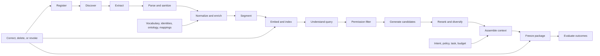
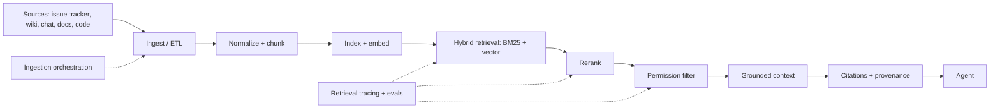
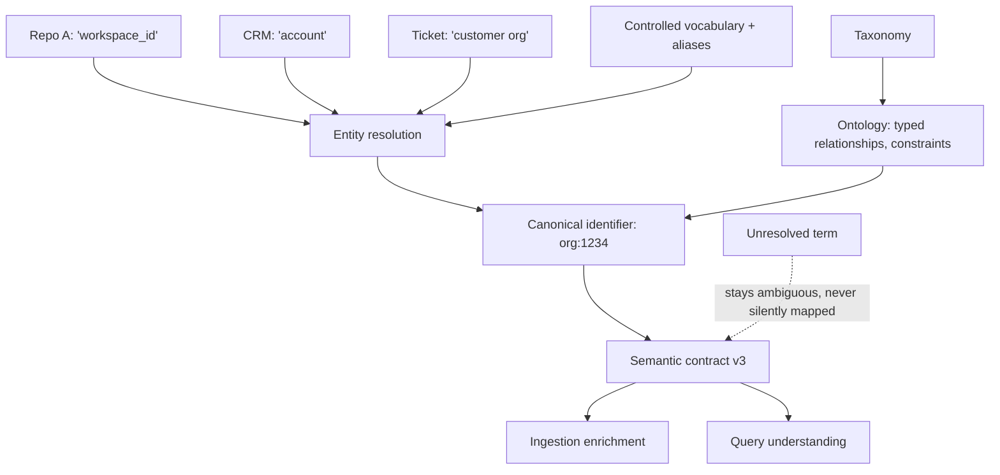
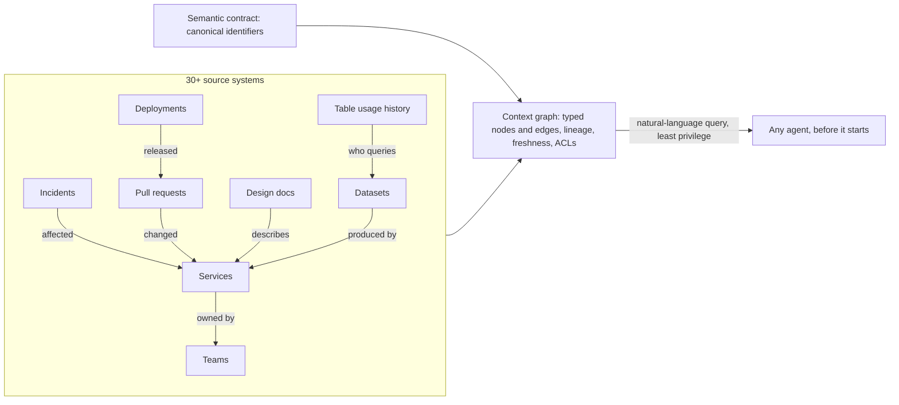
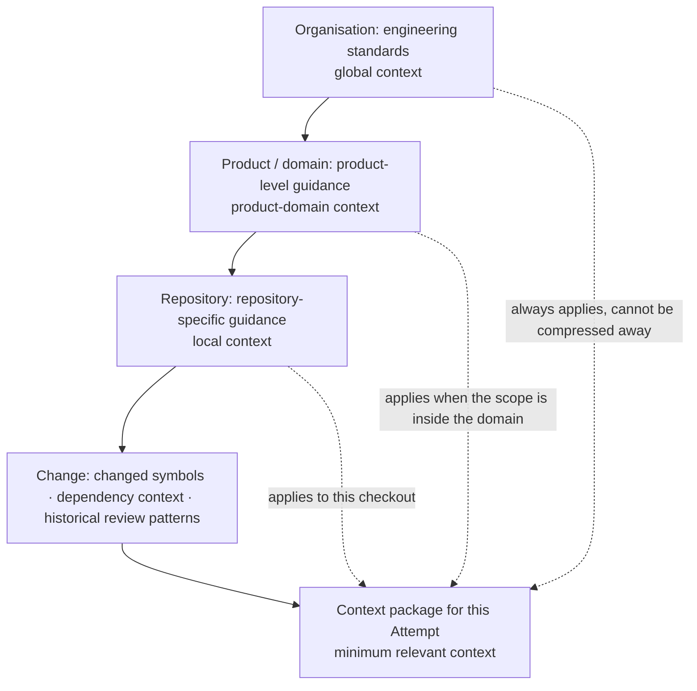
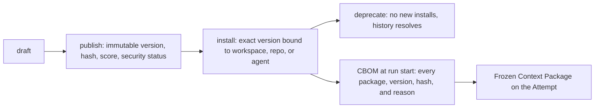
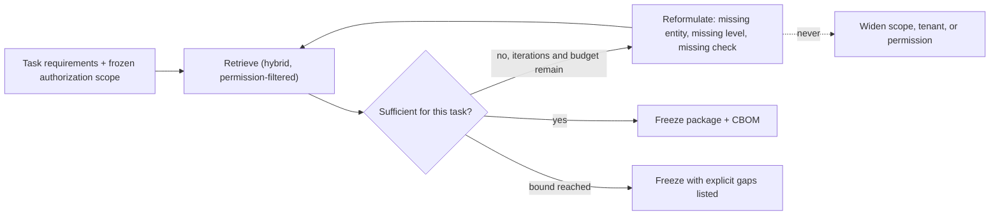
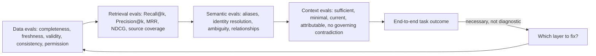

# 16. Data, knowledge, semantic, and context engineering

The previous chapter ended with a context compiler that retrieves candidates in step four and packs a briefing folder in step eight. This chapter is about everything that has to be true before that retrieval can be trusted: whether the underlying data is fit for the decision, how sources become a governed corpus, how the words in that corpus are made to mean the same thing everywhere, and how a permission-filtered, attributable, reproducible context package is compiled from it. After reading it you should be able to say which of four layers failed when an agent "missed" something, and to specify the pipeline and records that let you prove it.

## The problem

An agent cannot reliably compensate for missing, stale, contradictory, or misunderstood information. If a source omits the latest policy, if two systems use different meanings for the same word, or if retrieval picks the wrong document, the model receives a defective decision environment before it reasons at all. Many agent failures are therefore data, knowledge, semantic, or context failures wearing a model's face. Calling all four "RAG" hides which engineering system has to be fixed.

The problem exists because operational information is scattered across repositories, requirements, design documents, tickets, incidents, conversations, telemetry, and databases, each with its own authority, freshness, permissions, structure, and failure modes. Retrieval can return a relevant but obsolete document. A correct document can use language the agent maps to the wrong concept. A large context window can hold all of it and still emphasize the wrong evidence. And when the audit of the earlier curriculum looked for these layers, it found data understanding and semantic engineering missing entirely and knowledge engineering collapsed into context selection. The highest-value correction it recommended was to separate what had been compressed together: knowledge preparation, then context selection, then harness execution, then workflow governance.

## How it works

### Four disciplines, four moments

The 12-layer production stack in [chapter 19](./19-the-12-layer-production-ai-agent-stack.md) names four of its layers for these disciplines, and each works at a different moment.

**Data Understanding** profiles completeness, missingness, quality, freshness, and provenance. It decides whether source data is fit for use at all. **Knowledge Engineering** turns raw information into structured, retrievable, traceable knowledge; it prepares the corpus. **Semantic Engineering** normalizes terminology and resolves meaning so the system operates on concepts rather than raw strings; it makes "customer," "account," "workspace," or "release" mean one thing across agents, repositories, datasets, and tools. **Context Engineering** selects the right subset of knowledge for each decision; it chooses for this attempt.

Two sentences carry the distinctions. *Knowledge Engineering prepares the corpus; Context Engineering selects the subset for this attempt.* And: *provenance tells you where data came from; data understanding tells you whether it is usable for this decision.* A library is the analogy. Acquisitions decides which books are worth shelving (data understanding). Cataloguing shelves and indexes them (knowledge engineering). The subject thesaurus makes sure "automobiles" and "cars" land on the same shelf (semantic engineering). The reference librarian pulls the three books you need for today's question and leaves the rest where they are (context engineering).

### The handoff from source fact to model context

Every handoff along the path must retain source identity, version or observation time, authority class, sensitivity, tenant, transformation lineage, and the reason for selection. A model citation is worth something only when the system can resolve it back to the exact material that was used.

<!-- infographic: knowledge-pipeline -->
> **Infographic — From registered source to frozen context package.** *(Jay's graphic goes here.)* Until then, the diagram below carries the same concept.



The pipeline registers approved sources, ingests and transforms their content, maintains searchable representations, retrieves eligible candidates, and compiles the smallest sufficient context for one attempt. It does not grant tool authority, redefine business intent, or make untrusted source instructions governing. Ownership is split: the knowledge owner is accountable for source, connector, transformation, index, retrieval, and revocation contracts; source owners keep authority over the underlying facts; security owns access policy; workflow owners define task relevance; quality owns independent evaluation.

### Data understanding: is this usable for this decision?

**Data profiling** is the act of measuring a source before trusting it. A source profile should answer eight questions: Is required data present, or missing? Is it current enough for this decision? Are its schema and meaning stable? Is it duplicated or contradictory? Which system and owner are authoritative? Which tenants, identities, and purposes may use it? Which transformations have been applied? How are correction, retention, and deletion propagated?

The vocabulary behind those questions is worth having exactly. **Completeness and missingness** measure whether required fields and records exist. The **data quality dimensions** are completeness, validity, consistency, accuracy, timeliness, and uniqueness. **Freshness and staleness** describe how far the observed value lags the real one; a **freshness SLO** puts a bound on it. **Source authority** and **system of record** name which system is allowed to be right when two disagree. **Data lineage** records the transformations applied; **provenance** records the origin. **Schema drift** is an unannounced change in structure or meaning; **duplication and inconsistency** are the same fact appearing twice with different values. **Sensitivity and classification** determine who may see the data and where it may travel, and **retention and deletion** determine how long it lives and how removal propagates. **Data-quality gates** block a workflow when thresholds fail; **missing-data handling** defines what happens when required facts are absent; **data observability** monitors all of this continuously rather than at onboarding.

A **Data Contract** makes the expectations explicit: schema, semantics, quality thresholds, freshness, owner, sensitivity, lineage, allowed uses, and failure behavior. The rule that matters most is about absence: missing data must produce an explicit unknown or blocked state when the workflow cannot proceed safely. It must never be converted into a confident default.

### Knowledge engineering: a governed lifecycle

Knowledge engineering covers source registration, connector identity, checkpointed ingestion, parsing, normalization, chunking, metadata enrichment, indexing, correction, reprocessing, and retirement. The system should know which source version and transformation produced every indexed unit.

The **source registry** is the list of approved sources with owner, authority class, classification, tenant scope, allowed purposes, freshness SLO, retention, and correction behavior. A source moves through states: `proposed`, `approved`, `active`, `degraded`, `suspended`, `revoked`, `retiring`, `deleted`. The **ingestion pipeline** extracts content through an identified connector; **incremental ingestion** with **checkpoints** binds connector version, source cursor, schema, transformation, and content digest so that reprocessing the same source version under the same pipeline version is idempotent. **Parsing and normalization** turn each format into clean, sanitized text and structure. A **chunking strategy** segments documents into retrievable units; fine-grained chunks improve targeted retrieval but can strip necessary context, while large chunks preserve narrative and consume budget and blur ranking. **Metadata enrichment** attaches authority, classification, semantic identifiers, permissions, and lineage to each unit. Each unit, a **knowledge artifact**, has its own states: `processing`, `indexed`, `stale`, `invalid`, `quarantined`, `deleted`. **Corpus freshness** is the aggregate lag between sources and index.

Retrieval combines several methods, and none is universally best. **BM25** and other **lexical search** find exact names, identifiers, and uncommon tokens; **embeddings** turn content into vectors and **vector search** finds conceptual similarity; **metadata filtering** applies scope and authority; **hybrid retrieval** fuses lexical and vector candidate sets, for example with reciprocal rank fusion; **graph traversal** follows explicit relationships and lineage, which is what a **knowledge graph** and **GraphRAG** add; **query rewriting** expands or reformulates the question before any of that; and **reranking** reorders candidates for the actual task. Code symbols and policy identifiers reward lexical search, natural-language concepts reward embeddings, and blast-radius questions reward graphs. Hybrid retrieval is justified by measured improvement, not by default complexity.

Two properties are not optional. **Permission-aware retrieval** filters by requester, tenant, purpose, lifecycle, and freshness before content reaches ranking or generation, so that an unauthorized document can never be "very relevant." The unit of that filter is the individual artifact, carrying its own ACL reference from enrichment onward (**per-document access control**); a permission decided at the level of a whole source or index is too coarse to be trusted, because one wiki space holds both the public runbook and the incident post-mortem. **Citation and source attribution** tie every excerpt to its artifact, source version, and permission; a citation without source identity, version, and permission is decoration.

### The enterprise retrieval pipeline, end to end

Seen from the agent's side, the whole apparatus above collapses into one path from raw sources to a grounded, cited context. It is worth drawing that path on its own, because it is the shape a platform team actually builds and operates, and because every stage on it exists for a reason a plain vector store does not have.



Two details of the drawing matter. The dotted boxes are not optional extras: ingestion orchestration (scheduling, checkpoints, reprocessing) and retrieval tracing with evaluations are part of the platform, not a later add-on, because without them nobody can say why a document was or was not retrieved. And the permission filter appears late in this operator's view only because it is drawn as the last gate before the agent; in the contract that follows in "How to build it" it also runs *before* ranking, so that unauthorized material never competes for a rank at all. Filter early to keep it out of the ranking; filter late to prove nothing slipped through.

Enterprise retrieval is more than vector search: lexical plus semantic candidates, reranking, repository-aware retrieval, metadata filtering, and where it earns its cost, graph relationships. But the mechanics are the easy half. The hard questions are the ones a consumer search engine never has to answer.

| Question | Why a consumer search engine can skip it | Why the factory cannot |
|---|---|---|
| Is this builder authorized to see this? | Everything indexed is public | A relevant answer built on unauthorized data is a leak with a citation |
| Where did it come from? | Nobody audits a web result | Evidence and review depend on knowing the source |
| How fresh is it? | Stale pages are an annoyance | An agent acts on it; stale means wrong |
| Which version applies? | One page, one version | Architecture docs, APIs, and policies have revisions that conflict |
| Can the output be traced back to what influenced it? | Not required | Required to explain, debug, and revoke |

> *Enterprise context is relevant + authoritative + fresh + permission-aware + attributable.*

Two failures show why all five properties have to hold at once. In the first, an agent produces a well-grounded, fully cited plan from the architecture documents it retrieved, and the documents describe a service that was decommissioned last quarter. Every citation is real; the answer is still wrong, because grounding on obsolete material is grounding on the wrong world. In the second, an agent finds exactly the document that answers the question, and the builder who asked was never permitted to read it. That answer is worse than wrong: it is a policy violation dressed as helpfulness. Relevance was satisfied in both cases. Freshness failed in the first; permission failed in the second. Retrieval is a permissions, provenance, freshness, and evaluation problem at least as much as it is a search problem, and a retrieval team that measures only ranking quality will ship both failures.

### Semantic engineering: executable meaning

<!-- infographic: semantic-layer -->
> **Infographic — The semantic layer.** *(Jay's graphic goes here.)* Until then, the diagram below carries the same concept.



A **controlled vocabulary** defines preferred terms, aliases, and deprecated terms; a **domain lexicon** is the same idea scoped to one business domain. A **taxonomy** organizes concepts into a hierarchy. An **ontology** adds typed relationships and constraints between them. A **canonical identifier** is the one stable ID a concept or entity has regardless of which system named it, and **entity resolution** maps the different source identifiers onto it while preserving the source-specific identities. **Synonym and alias mapping** and **semantic normalization** collapse variant spellings and phrasings; **schema and field mapping** does the same for column and property names across systems. **Disambiguation** decides which of several meanings applies, and the rule is that an unresolved term stays ambiguous rather than being silently mapped. A **terminology registry** holds all of this under ownership and version. **Concept drift** is meaning changing over time; **semantic versioning** of the contract is how you detect and manage it, because semantic changes can invalidate retrieval results, context packages, evaluations, and downstream evidence.

This is not the cryptographic canonicalization that the evidence chapters use to hash records. That makes bytes identical; this makes meanings identical.

A **Semantic Contract** defines canonical concepts, identifiers, allowed relationships, disambiguation rules, source mappings, owner, version, and compatibility policy. Keep the layer as small as possible and as explicit as necessary. An ontology earns its cost when several sources repeatedly disagree about meaning; it is premature when a small controlled vocabulary and stable identifiers solve the actual problem. Semantic engineering removes measured ambiguity; it does not build a speculative enterprise model of everything.

### Ground first: the context graph

Everything above is about whether the agent's context is *right*. There is an economic argument for grounding that is just as strong, and it is easy to miss because the failure it describes does not look like a failure. *An ungrounded agent fails slowly rather than cheaply.* Given a question it cannot answer from what it has been handed, an agent does not stop; it searches one more place, re-sending its whole expanding context on every turn, spawns a helper, hits an error, and reasons its way to a confident wrong conclusion. Every one of those turns is billed. Richer information up front is the single most powerful lever on the "requests per turn" term of the cost equation in [Chapter 8](../02-design/08-economics-metrics-and-human-attention.md), and grounding is therefore a cost control as much as a quality control.

The pattern that one large engineering organisation built for this is a **context graph**: a single graph, integrating the organisation's internal systems, whose nodes are the entities an engineer reasons about (services, teams, incidents, pull requests, design documents, deployments, datasets, historical table usage) and whose edges are the relationships between them (owns, depends on, deployed, caused, queried), which any agent can query in natural language before it starts work. Its published scale gives a sense of what "single graph" means in practice: about 24 million nodes and 80 million edges, 86 node types and 117 edge types, drawn from more than thirty internal systems. Those are one organisation's numbers; the shape transfers at any size.

<!-- infographic: context-graph -->
> **Infographic — The context graph.** *(Jay's graphic goes here.)* Until then, the diagram below carries the same concept.



The comparison that organisation published is the whole argument in one pair of runs. Same prompt, same model, asked whether a dataset was queryable. The grounded agent queried the graph's historical usage, found the table that more than fifty analysts already use, and answered in 38 seconds. The ungrounded agent spent 20 minutes reading service code, spawned two subagents, hit three errors, and concluded, wrongly, that the dataset could not be queried. The second run was not only slower and more expensive; it was confidently incorrect, which is the most expensive kind of wrong because a human then has to discover it.

A context graph is the knowledge graph of the retrieval section, built at organisational scope, and it is governed by the same rules. Its nodes need the semantic layer's canonical identifiers, or "service" in the incident system and "service" in the deployment system become two nodes for one thing. Its edges need lineage, so an answer can say which system asserted the relationship and when. Its freshness needs an SLO per source, because a graph that still shows last quarter's ownership grounds the agent on the wrong world. And its queries run under least privilege: the graph is a retrieval source like any other, filtered per node by requester, tenant, and purpose before anything reaches the model. The **trusted context** layer of the six-layer view in [chapter 15](./15-agent-architecture.md), systems of record, a read-only data layer, schema and semantic catalog, scoped knowledge, lineage and freshness, retrieved just in time under least privilege, is the same thing said as an architecture. The line that goes with it is worth keeping verbatim: *trusted context is 80 percent of the agent's success; skip it and the agent hallucinates.* The remaining 20 percent is everything else in this book.

### Hierarchical context: organisation, product, repository, change

The context graph answers *where things are*. A second structure answers *which of them apply to this change*, and it is a hierarchy with four levels. **Hierarchical context** arranges everything an agent might be shown by the scope at which it is true:

| Level | Scope | What lives there | Owner | Examples |
|---|---|---|---|---|
| Organisation | **Global context** | **Engineering standards**: security policy, data classification, licensing rules, the Project Constitution, house coding standards | Platform and security | "Nothing classified RESTRICTED leaves the region"; "every public endpoint has a contract test" |
| Product / domain | **Product-domain context** | **Product-level guidance**: the domain model, service boundaries, shared contracts, the product's architecture decisions, its incident history | Product architecture | "Billing and entitlements never share a database"; the semantic contract for this domain |
| Repository | **Local context** | **Repository-specific guidance**: instruction files, build and test topology, ownership, local conventions, the repository profile of [Chapter 20](./20-autonomous-engineering-workflows.md) | Repository owners | "Generated files under `gen/` are never edited by hand"; "run `make verify` before proposing" |
| Change | The change itself | What this diff touches and what touches it | The Attempt | Changed symbols, their dependencies, prior review comments on this area |

The bottom level is the one most retrieval systems skip, and it is where the biggest savings are. Three retrieval moves make it precise. **Changed-symbol retrieval** starts from the functions, types, and modules the diff actually modifies, resolved through the code index rather than guessed from file paths, and pulls their definitions and immediate usages. **Dependency context** goes one hop out: the callers, callees, contracts, and schemas the changed symbols depend on or are depended on by, so the agent can see what it might break without reading the repository. **Historical review patterns** add what reviewers have said about this area before: the comment that appears on every PR touching this module, the incident that started here, the finding that was dismissed last time and why. Together they give a reviewer or implementer the part of the repository that is relevant to *this* change, at a fraction of the tokens a whole-repository dump would cost, and with far less for the model to be distracted by.

<!-- infographic: context-hierarchy -->
> **Infographic — The four-level context hierarchy.** *(Jay's graphic goes here.)* Until then, the diagram below carries the same concept.



The hierarchy fixes two rules the compiler needs. Precedence runs downward: a repository convention cannot override an organisation standard, and a change cannot override either, so the compiler allocates global material first and never compresses it below its governing clauses. Selection runs upward: retrieval begins at the change and climbs only as far as the change requires. A one-line fix inside one module needs its changed symbols, their dependencies, the repository's build command, and the global standards; it does not need the product's architecture decision record. *Retrieve the minimum relevant context; never stuff one window.* The same rule from the reference-librarian analogy applies here with a sharper edge: the librarian is not being frugal with books, they are keeping the reader from drowning in the ones that do not answer the question.

The hierarchy is also what lets one platform serve very different repositories. The organisation and product levels are shared and change rarely; the repository level is where each codebase's profile, learning, and local skills live; the change level is computed fresh every time. [Chapter 20](./20-autonomous-engineering-workflows.md) treats the repository level as repository intelligence; this chapter's job is to make sure each level is a governed source with its own owner, freshness, and permissions, retrieved through the same pipeline as everything else.

### Context engineering: compile for the decision, not the corpus

The context compiler starts from task requirements, policy, risk, actor, repository scope, model limits, and a token budget, then selects, deduplicates, orders, compresses, and attributes material according to explicit rules. The controls it needs are authority tiers separating approved contracts from reference material; recency and lifecycle filters; permission-aware retrieval before ranking; diversity controls that stop ten near-identical chunks from crowding out a governing counterexample; contradiction detection and source comparison; token allocation by context class; compaction that retains decisions and unresolved issues; cache keys bound to source and policy versions; and "why retrieved" metadata for inspection and evaluation.

Allocation has separate budgets for governing contracts, task facts, repository content, tool results, history, examples, and optional reference material. Governing material cannot be compressed below its required clauses. Summaries keep source links and uncertainty. Cache keys include tenant, requester authorization class, purpose, normalized query, source, index, and policy versions, compiler version, and model profile, and a context cache is never shared across a permission boundary.

Context is an Attempt input, not an authority record. Retrieved text cannot alter the approved Mission, policy, tool grants, or acceptance criteria.

### Governed context artifacts: the Context CDL and the CBOM

The material the compiler selects from is not a heap of files. Skills, rules, and documents that agents are meant to read are **context packages** in a registry: each has a scope and a name, a version, a content hash, a quality score from the authoring-side review of [Chapter 10](./10-the-agent-factory.md), and a security status from the scan of [Chapter 26](../04-prove/26-security.md). Because they are versioned artifacts, they have a lifecycle, and the lifecycle is the **Context CDL** (context definition lifecycle): **draft**, where an author iterates; **publish**, where a version becomes immutable and eligible; **install**, where a workspace, repository, or agent binds that exact version; and **deprecate**, where the version stops being selectable for new installs while historical packages keep resolving. The four states matter because context is the input most often edited in place. A rule file changed on a Tuesday afternoon that is already installed in forty repositories is forty behaviour changes with no version, no review, and no way to say which Attempts ran under which text.

<!-- infographic: context-cdl -->
> **Infographic — The Context CDL and the CBOM.** *(Jay's graphic goes here.)* Until then, the diagram below carries the same concept.



The record that ties the lifecycle to a run is the **CBOM**, the Context Bill of Materials: a snapshot taken at run start of every context package the Attempt will be able to see, with its version, hash, install source, and the reason it was selected. It is to context what a software bill of materials is to dependencies, and it answers the same question after the fact: when a package is later found to be wrong, poisoned, or deprecated, which runs were exposed? The CBOM is a projection of the same facts the **Frozen Context Package** holds for the Attempt (selected sources, revisions, token budget, selection reasons), and both are advisory: they record what the model was shown, never what it was authorised to do.

**Factory Memory** is the retrieval store the compiler draws from over the factory's own history: prior outcomes, patterns, decisions, and explainable engineering context. It has one rule that is easy to state and easy to break: *retrieved text is untrusted*. Whatever comes back from memory cannot approve anything, cannot invoke a tool, and cannot satisfy an acceptance criterion. A memory entry that reads "this repository allows force-push to main" is data about what someone once wrote, and the policy engine does not consult it. The reason the rule needs restating here is that memory looks like the factory's own voice, and a document in the factory's own voice is the easiest one to mistake for an instruction.

Two properties of the retrieval machinery underneath keep it inspectable. The **knowledge graph** the factory projects from its records is a typed entity and relationship structure whose edges come in three kinds, and each edge says which: **authoritative** (asserted by the system of record: this WorkOrder belongs to this Mission), **deterministic** (computed by code from authoritative facts: this file was changed by this Attempt), or **inferred** (proposed by a model or a heuristic: this incident is probably related to that change). An inferred edge never outranks an authoritative one, and a query result shows the kind of each edge it traversed. The graph also carries **hard caps** on traversal depth, fan-out, and result size, so that a single query cannot walk the entire corpus and hand it to a model; the caps are what keep a graph from becoming a corpus-exposure mechanism with a friendlier interface. And **hybrid retrieval** in this setting is lexical, semantic, and code-aware candidates fused with a versioned strategy, with the **score components** visible per result: the lexical score, the semantic score, the code-aware score, the fusion, and the provenance of the artifact. A ranked list without its components cannot be debugged, and a ranking that cannot be debugged cannot be trusted with a governing document.

### Agentic retrieval: the sufficiency loop

Single-shot retrieval asks once and packs what it gets. **Agentic retrieval** lets a bounded planner ask several times: retrieve, assess whether the context now in hand is sufficient for the task, and if not, reformulate and retrieve again, until it is sufficient or the bound is reached. That is the **sufficiency loop**, and its value is in the second step. A retrieval planner that can say "I have the changed symbols and their callers, but not the contract test that covers them" will fetch the test; a single-shot retriever will pack whatever ranked highest and let the model discover the gap at inference cost.

<!-- infographic: sufficiency-loop -->
> **Infographic — The sufficiency loop.** *(Jay's graphic goes here.)* Until then, the diagram below carries the same concept.



The loop has three bounds and one prohibition. It is bounded in iterations, in tokens spent on retrieval, and in wall time, and when a bound is reached it freezes what it has with the gaps stated as unresolved facts rather than pretending sufficiency. The prohibition is the one that makes the loop safe to automate: *the sufficiency loop never expands authorization scope*. Every iteration runs under the same requester, tenant, purpose, classification ceiling, and source eligibility as the first; reformulating a query can change which artifacts are asked for, never which artifacts the requester is allowed to see. A planner that responds to insufficiency by reaching for a source outside its scope has stopped retrieving and started escalating privilege.

### Evaluate each layer separately, then together

<!-- infographic: retrieval-evaluation -->
> **Infographic — Layered evaluation.** *(Jay's graphic goes here.)* Until then, the diagram below carries the same concept.



**Retrieval evaluation** has its own measures. **Precision@k** is the share of the top k results that are relevant; **Recall@k** is the share of all relevant items that appear in the top k; **MRR** (mean reciprocal rank) rewards putting the first relevant result near the top; **NDCG** (normalized discounted cumulative gain) rewards ranking the most relevant items highest. **Groundedness** and **faithfulness** measure whether the generated answer is supported by, and only by, the retrieved material. A **retrieval failure taxonomy** classifies misses: source never registered, not yet ingested, chunked apart, filtered by permission, outranked, contradicted, stale, or mis-resolved semantically.

Data evaluations measure completeness, freshness, validity, consistency, and permission correctness. Semantic evaluations test aliases, identity resolution, ambiguity, and relationship correctness. Context evaluations test whether the final package is sufficient, minimal, current, attributable, and free of governing contradictions. End-to-end task success remains necessary but is not diagnostic; a system that records only the final outcome cannot tell whether to fix the source, the ingestion, the semantics, the retrieval, the context policy, the model, or the tool. Slice everything by workflow, repository, language, persona, tenant, risk, and source class.

### Correction and revocation are first-class paths

A corrected, deleted, reclassified, or compromised source must invalidate its derived artifacts, index entries, caches, context packages, and dependent evidence under explicit policy. New work stops selecting the affected material immediately. Running work is paused, cancelled, or allowed to finish only through a recorded risk decision. Historical packages remain reproducible under restricted retention but are marked ineligible for new decisions.

That requires both **forward lineage** (what did this source produce?) and **reverse lineage** (which runs, decisions, and releases depended on it?). Without both, revocation is an announcement rather than a control. Deletion removes active copies and derived representations, emits receipts, and keeps only policy-approved tombstones and restricted audit evidence. Where content cannot be retained for privacy or legal reasons, reproducibility is preserved through protected digests and minimal lineage.

Poisoning defense follows the same shape. External content is untrusted: sanitize active content, separate data from instructions, validate provenance and signing where available, watch for unexpected authority changes and embedding or index drift, and monitor retrieval for abnormal dominance by one source. A suspected source or connector is suspended, its artifacts and caches quarantined, and the affected packages, attempts, evidence, and releases found through reverse lineage.

## How to build it

### The records

Four reference schemas anchor the pipeline. Two are shown as documents; two as required-field lists.

```yaml
# SourceRegistration
id: source:engineering-policy
owner: role:policy-owner
authority_class: governing
connector_identity: workload://connector/policy
location: system://policy-service
classification: confidential
tenant_scope: [tenant-a]
allowed_purposes: [software-delivery]
freshness_slo: PT1H
retention_policy: retention:policy@2
correction_and_deletion: source-authoritative
state: active
```

```yaml
# KnowledgeArtifact
id: ka:8f73
source_id: source:engineering-policy
source_version: 31
observed_at: 2026-08-30T18:00:00Z
pipeline_version: ingest@8
content_digest: sha256:...
segment_locator: section:release-controls
semantic_ids: [concept:consequential-release]
classification: confidential
permissions_ref: acl:policy-31
lineage: [extract:90, sanitize:22, segment:15]
state: indexed
```

| Record | Required fields |
|---|---|
| `RetrievalRequest` | Requester and workload identity, tenant, purpose, query, task type, repositories, required authority classes, time boundary, classification ceiling, token budget, retrieval policy version |
| `RetrievalCandidate` | Artifact and source versions, candidate method, raw and normalized scores, permission decision, freshness, authority, contradiction group, exclusion reason, lineage |
| `ContextSelection` | Request, selected and excluded candidates, reranker version, diversity and contradiction decisions, token allocation, selection rationale, evaluator signals |
| `ContextPackage` | Immutable digest, attempt and manifest, instruction hierarchy, exact excerpts, citations, source and policy versions, classification, expiry, cache key, unresolved missing or conflicting facts |

### The retrieval contract

The ordering is the contract. Authenticate first, filter second, rank third.

1. Resolve requester, workload, tenant, purpose, and data ceiling.
2. Parse entities, exact identifiers, constraints, time, and required facts.
3. Apply source eligibility, permission, tenant, lifecycle, and freshness filters before any content reaches ranking or generation.
4. Generate lexical, vector, graph, and metadata candidates under pinned index versions.
5. Fuse and rerank with a versioned strategy appropriate to the task.
6. Enforce diversity and group contradictions; never discard governing counterevidence because it scored lower.
7. Compile context by authority and token allocation, preserving citations and the reason each item was included or excluded.
8. Freeze the package and bind it to the Attempt.

### Operating objectives

Define SLOs for ingestion lag, retrieval availability and latency, permission false-allow (target zero), deletion propagation, revocation propagation, and package reproducibility. Track storage, embedding, indexing, retrieval, reranking, and context-token cost per accepted outcome. Offline evaluation covers source completeness, permission correctness, freshness, exact-match recall, candidate recall, ranking quality, citation accuracy, contradiction coverage, diversity, latency, and cost; runtime evaluation connects packages to task completion, policy denials, corrections, incidents, and accepted outcomes.

Version everything that can change an answer: schemas, connectors, parsers, semantic mappings, embedding models, indexes, rankers, context policies, and the package format. Migrate with shadow indexes and representative comparisons. Semantic or permission changes invalidate prior compatibility assumptions. Keep decoders for retained packages, and emit explicit deprecation and revocation events.

### Discover and sync instruction files

Most of the context that agents read in a repository is already there, in the files the harnesses converged on: `SKILL.md` folders, `AGENTS.md`, and `CLAUDE.md`. The lifecycle above does not require rewriting them; it requires knowing about them. The pattern is a small **context CLI** with two verbs. **Discover** walks a checkout (or every checkout in an organisation), finds each `SKILL.md`, `AGENTS.md`, and `CLAUDE.md`, computes its content hash, and reports what exists, where, and whether it matches a published package version, a drifted copy, or an unregistered local file. **Sync** takes that inventory and reconciles installations with the control plane: a registered package at the right version is recorded as installed; a drifted copy is reported as drift; an unregistered file is reported as a candidate for publication, never silently registered. The CLI is the same discipline as the skill inventory in [Chapter 10](./10-the-agent-factory.md), applied to context, and it is how the CBOM gets accurate inputs from repositories that were never told they were part of a registry. Two rules keep it safe: it never rewrites a file in the working tree, and it never installs from an unknown source.

### Choosing between live and indexed

Centralizing knowledge simplifies governance and discovery but can create a stale copy of systems that already have authoritative APIs. Live retrieval preserves currentness at the cost of latency and dependency risk. The usual answer is hybrid: index discovery metadata, and resolve consequential facts from the source at decision time. Knowledge graphs buy explicit traversal and lineage with modeling, ingestion, and consistency work; add one when queries need graph structure, not because it sounds thorough.

## Failure modes

| Failure | Detection | Runtime behavior | Recovery proof |
|---|---|---|---|
| Connector lag | Freshness SLO | Mark degraded; block freshness-critical tasks | Checkpoint catches up and gap scan passes |
| Schema change | Parser or contract error | Stop the affected partition, preserve checkpoint | New parser version and reprocessing comparison |
| Permission mismatch | Negative authorization test | Deny candidate before ranking | ACL reconciliation and tenant-isolation suite |
| Stale governing source | Authority and freshness rule | Exclude, and block if required | Current source retrieved and package regenerated |
| Contradictory authorities | Contradiction group | Surface uncertainty and escalate | Named owner resolves or workflow records an exception |
| Poisoning signal | Provenance, dominance, behavior anomaly | Suspend source and affected packages | Root cause, clean rebuild, red-team and regression tests |
| Index unavailable | Health or circuit state | Approved fallback or explicit unavailable state | Index restored and missed-change reconciliation |
| Missing authoritative data | Data-quality gate | Explicit blocked state, never a confident default | Owner supplies data; gate passes |
| Silent alias mapping | Semantic evaluation | Term stays ambiguous; escalate | Contract updated and versioned |
| Obsolete document ranks first | Authority tier and lifecycle filter | Excluded before compilation | Retrieval evaluation case added |
| Whole-window stuffing | Context size flat regardless of change size; token cost per accepted outcome high | Retrieve from the change upward: changed symbols, dependency context, review history, then only the levels the scope requires | Context evals show packages are minimal and sufficient |
| Local convention overrides a global standard | Precedence check in compilation | Global material allocated first and never compressed below governing clauses | Standard present in the package; evaluation case added |
| Change level missing | Agent reads whole files to find what the diff touches | Changed-symbol retrieval and dependency context from the code index | Retrieval trace shows symbol-level candidates |
| Context edited in place | An installed rule or skill file changes with no version; forty repositories change behaviour at once | Publish creates an immutable version; installs bind exact versions; the CBOM names what each run saw | Drift report from discover is empty; CBOM resolves every package |
| Memory read as instruction | A retrieved memory entry is treated as policy or as satisfying a criterion | Retrieved text is untrusted: no approval, no tool call, no acceptance from memory | Policy decision trace cites no memory input |
| Graph walk exposes the corpus | One query traverses the whole graph and returns it to the model | Hard caps on depth, fan-out, and result size; edge kinds visible | Query trace shows caps applied and edge kinds |
| Sufficiency loop widens scope | Reformulation reaches a source outside the requester's tenant or classification ceiling | Every iteration runs under the frozen authorization scope; escalation is refused | Retrieval trace shows identical scope on every iteration |
| Ranking without components | A governing document is outranked and nobody can say by what | Score components and provenance visible per result | Fusion strategy versioned; components logged |

The rows about memory, the graph, and the sufficiency loop are the same failure seen three ways: a retrieval mechanism acquiring an authority it was never granted, either over decisions or over data it should not reach.

Two rows deserve a second look because they are the ones that pass every ranking metric. "Obsolete document ranks first" is the grounded-but-stale failure: the citations are real and the answer is wrong. "Permission mismatch" is the relevant-but-unauthorized failure: the answer is right and the builder was never allowed to have it. Neither shows up in Recall@k. Both show up in production.

The diagnostic habit is the one from the evaluation section: "the model missed it" is not a root cause until the source, ingestion, semantic, and retrieval layers have been ruled out in that order.

## In Mission Control

At study commit [`d902fae`](https://github.com/jaydubya818/MissionControl/tree/d902fae7032c0696b531c44ae88829c652516fc6), Mission Control has provenance-backed retrieval, graph relationships, planning, Attempt-bound Context Packages, context evaluations, configuration drift scans, versioned context manifests, and content-hash checks. Factory Memory is advisory and cannot satisfy acceptance. Those mechanisms are a strong context-governance foundation.

The repository glossary and lexicon reviewed 2026-09-02 name the rest of this chapter's vocabulary as contract: context packages with scope, name, content hash, quality score, and security status; the Context CDL (draft, publish, install, deprecate); the Frozen Context Package and the CBOM at run start; Factory Memory's untrusted-text rule; knowledge-graph edges typed authoritative, deterministic, or inferred under hard caps; hybrid retrieval with visible score components; the bounded sufficiency loop that never expands authorization; a Knowledge → Memory surface with Overview, Memory, Graph, and Context views; a Registry surface with Discover, Skill Inventory, Installations, CDL, Evaluate Skill, and Eval Runs; and a context CLI that discovers local `SKILL.md`, `AGENTS.md`, and `CLAUDE.md` files and syncs installations to the control plane. Factory Memory is implemented and default off by phase at the pinned commits of [Chapter 34](../06-improve/34-mission-control-as-a-living-case-study.md); the surfaces and the CLI are lexicon vocabulary at the review date, not evidence of a measured retrieval quality series.

**Partial or future.** The studied evidence does not establish a complete production source registry, a connector and checkpoint lifecycle, a data-quality gate, a semantic-contract registry, a permission-aware hybrid retrieval service, or an independently benchmarked reranking pipeline. The graph and memory mechanisms should not be presented as a general enterprise knowledge system. The specification in this chapter likewise does not claim a production source registry, benchmarked ranker, deletion guarantee, or poisoning defense; it is the target. The target state is that Mission Control registers sources with ownership, authority, classification, retention, and ingestion policy; produces versioned knowledge artifacts and semantic contracts; evaluates retrieval by workflow and persona; freezes the resulting selection into each execution manifest; and lets an operator inspect missing required data, stale sources, semantic ambiguity, retrieval candidates, reranking decisions, excluded sources, token allocation, citations, and the exact package an Attempt used. Promotion of that system requires tenant-isolation tests, correction propagation, deletion tests, representative retrieval evaluations, and end-to-end outcome evidence.

## Retain this

- Data understanding asks whether data is usable for this decision; knowledge engineering prepares the corpus; semantic engineering makes terms mean one thing; context engineering selects the subset for this attempt.
- Provenance says where data came from; data understanding says whether you can use it. Missing data becomes an explicit unknown or blocked state, never a confident default.
- The pipeline is register → profile → ingest → normalize → index → retrieve → permission-filter → rank → compile → freeze → evaluate → revoke, and every handoff keeps source, version, authority, sensitivity, tenant, lineage, and selection reason.
- Permission and tenant filters run before ranking or model exposure; a citation without source identity, version, and permission is decoration.
- No retrieval method wins everywhere: lexical for identifiers, vectors for concepts, graphs for relationships, hybrid only when measured.
- Enterprise context is relevant + authoritative + fresh + permission-aware + attributable. A grounded answer on obsolete documents is still wrong; a relevant answer on unauthorized information is worse. Retrieval is a permissions, provenance, freshness, and evaluation problem as much as a search problem.
- The operating pipeline is sources → ingest → normalize and chunk → index and embed → hybrid retrieval → rerank → permission filter → grounded context → citations and provenance → agent, with ingestion orchestration and retrieval tracing as part of the platform.
- The semantic layer is as small as possible and as explicit as necessary; unresolved terms stay ambiguous.
- Ground first. An ungrounded agent fails slowly rather than cheaply: it searches one more place, re-bills its context every turn, and ends confidently wrong. A context graph (services, teams, incidents, PRs, design docs, deployments, datasets, usage) that any agent can query in natural language is a cost control and a quality control at once, and it is governed like any other source: canonical identifiers, lineage, freshness SLOs, per-node least privilege. Trusted context is 80 percent of the agent's success.
- Retrieved text is an Attempt input, not authority; it cannot change intent, policy, tool grants, or acceptance criteria.
- Evaluate each layer separately with its own measures (Recall@k, MRR, NDCG, groundedness among them); end-to-end success is necessary but not diagnostic.
- Revocation needs forward and reverse lineage or it is only an announcement.
- Context is hierarchical: Organisation (engineering standards, global) → Product/Domain (product-level guidance) → Repository (repository-specific guidance, local) → Change (changed symbols, dependency context, historical review patterns). Precedence runs down, selection runs up. Retrieve the minimum relevant context; never stuff one window.
- Context packages are versioned artifacts with a hash, a quality score, and a security status, and they move through the Context CDL: draft, publish, install, deprecate. The CBOM snapshots every package a run could see at run start; the Frozen Context Package records what it received. Both are advisory.
- Factory Memory's retrieved text is untrusted: it cannot approve, invoke a tool, or satisfy acceptance. Knowledge-graph edges are authoritative, deterministic, or inferred, under hard caps; hybrid retrieval shows its score components and provenance.
- Agentic retrieval is a bounded sufficiency loop (retrieve, assess, reformulate) that never expands authorization scope. A context CLI discovers `SKILL.md`, `AGENTS.md`, and `CLAUDE.md` files and syncs installations to the control plane without rewriting them.

## Go deeper

- Related chapters: [15. Agent architecture](./15-agent-architecture.md) for the compiler and the five trust categories; [19. The 12-layer stack](./19-the-12-layer-production-ai-agent-stack.md); [23. Evaluation engineering](../04-prove/23-evaluation-engineering.md); [26. Security](../04-prove/26-security.md) for poisoning and injection; [28. Observability](../05-operate/28-observability-telemetry-and-forensics.md) for lineage; [5. Authoritative records](../02-design/05-authoritative-records.md) for the systems of record this pipeline must not shadow.
- Primary sources: [Lewis et al., Retrieval-Augmented Generation](https://arxiv.org/abs/2005.11401); [Robertson and Zaragoza, The Probabilistic Relevance Framework (BM25)](https://www.staff.city.ac.uk/~sbrp622/papers/foundations_bm25_review.pdf); [Cormack, Clarke, and Buettcher, Reciprocal Rank Fusion](https://dl.acm.org/doi/10.1145/1571941.1572114); [NIST AI Risk Management Framework](https://airc.nist.gov/airmf-resources/airmf/) and [AI RMF 1.0](https://doi.org/10.6028/NIST.AI.100-1); [OWASP Agentic AI Threats and Mitigations](https://genai.owasp.org/resource/agentic-ai-threats-and-mitigations/); Mission Control [capability, workflow, and admission map](../appendix/mission-control/03-capability-workflow-and-admission-map.md) at `d902fae`.
- Transcript source: the 12-layer production AI agent stack and its coverage audit (Data Understanding, Knowledge Engineering, Semantic Engineering term lists); the agent platform technology glossary (RAG, BM25, hybrid retrieval, reranking, permission-aware retrieval, provenance, freshness); Jay West, factory architecture notes (the enterprise retrieval pipeline, the five properties of enterprise context, the four-level context hierarchy, changed-symbol retrieval, dependency context, and historical review patterns).
- Public sources: Uber Engineering, *Running a Software Factory Efficiently at Uber Scale* (2026) for the context graph, its published scale, and the grounded-versus-ungrounded comparison; *Six layers of a working agentic system* (public post, 2026) for the trusted-context layer and the "80 percent of the agent's success" line.
- Mission Control repository glossary and lexicon, reviewed 2026-09-02: context packages, the Context CDL, the Frozen Context Package and CBOM, Factory Memory's untrusted-text rule, knowledge-graph edge kinds and hard caps, hybrid retrieval score components, agentic retrieval and the sufficiency loop, and the context CLI.
- [Glossary](../appendix/glossary.md).
