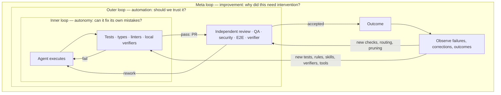
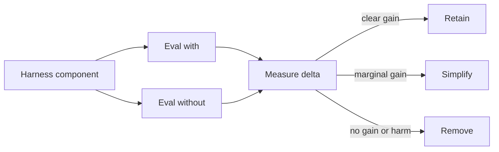
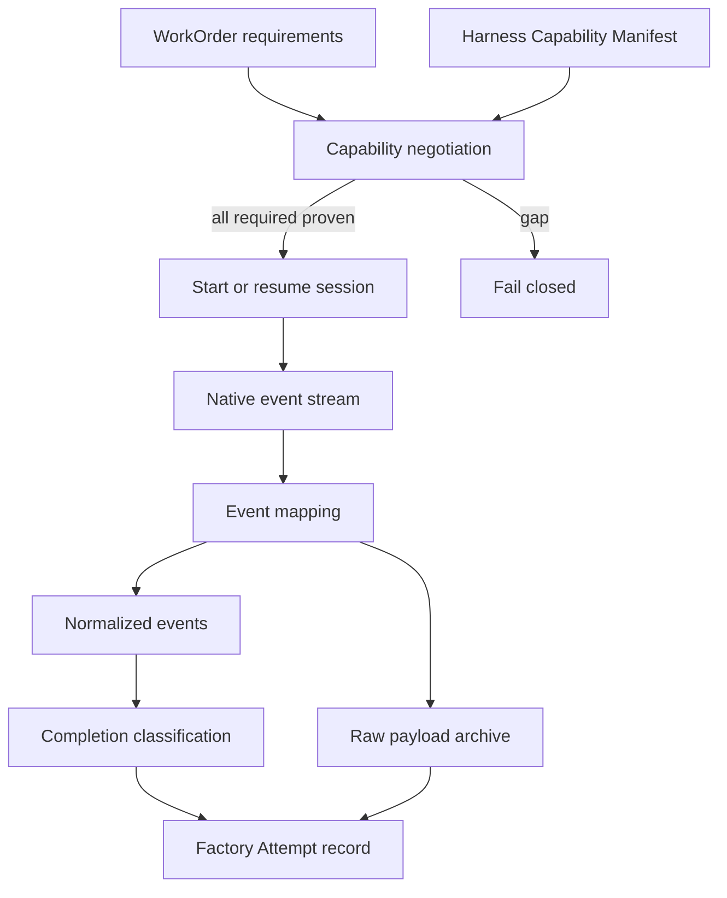
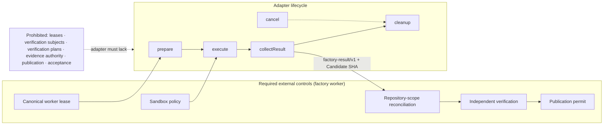

# 16. Harness engineering

Harness engineering is the discipline of making agent execution reproducible, observable, bounded, and replaceable. It designs the inner, outer, and meta loops; the event stream; lifecycle and checkpoints; adapter admission; and the conformance evidence required before a harness can execute governed work.

## The problem

Interactive coding agents assume a person can watch a terminal, answer prompts, detect stalls, and judge completion. Production workers cannot rely on that human glue. The harness boundary therefore needs structured events, explicit control actions, recoverable sessions, and external authority that survives product and model changes.

## How it works

### Harness engineering

Everything above describes a harness as a thing. **Harness engineering** is the discipline of building it on purpose: designing the execution environment, feedback mechanisms, checks, tools, context, and improvement loops that let agents complete increasingly complex work with less intervention at equal or better quality. The sentence to keep is the one practitioners use to explain it to their own teams: *engineer the system in which agents engineer the software.* The engineer's product is no longer the code; it is the place the code gets made.

That system has a fixed scope, and each item on it is a chapter of this book: context (what good looks like, [Chapter 19](./19-data-knowledge-and-semantic-engineering.md)); skills ([Chapter 11](./11-the-agent-factory.md)); tools and the gateway ([Chapter 18](./18-agent-architecture.md)); the environment ([Chapter 17](./17-development-environments-sandboxes-and-compute.md)); tests and verifiers ([Chapter 27](../04-prove/27-quality-and-evidence-architecture.md)); evals ([Chapter 29](../04-prove/29-evaluation-engineering.md)); feedback and observability ([Chapter 35](../05-operate/35-observability-telemetry-and-forensics.md)); and the improvement loops ([Chapter 40](../06-improve/40-governed-learning.md)). The harness is the machine; the loops below are what you run through it. Practitioners at Tessl are candid about why the discipline is hard: the field changes weekly, the work is fundamentally unplanned and competes with shipping, and the signals you need are hidden in local logs or in someone's head until you move the workflow onto legible surfaces.

### Inner loop, outer loop, meta loop

The "inner" and "outer" of the harness split above describe two pieces of software. Practitioners also use "inner" and "outer" for a different but complementary idea, three loops that run *through* the harness, and it is worth holding both in your head. Each loop has its own examples, answers its own question, and serves a different objective.

| Loop | What runs in it | The question it answers | Objective |
|---|---|---|---|
| **Inner loop** | Fast, cheap feedback during execution: unit tests, types, the compiler, linters, static analysis, architecture rules, policy checks, local verifiers, CLI tools, test-first development; plugins and skills the agent iterates against before a pull request exists | *Can the agent detect and correct its own mistakes before handoff?* | **Autonomy** |
| **Outer loop** | Deeper, independent verification after or around the work: independent review agents, security review, integration and end-to-end tests, agentic QA that drives the product, browser verification and screenshot inspection, architecture review, mutation testing, acceptance validation, risk assessment, an independent verifier | *Should we trust what it gave us?* | **Automation** |
| **Meta loop** | Observation of executions, failures, reviews, corrections, and outcomes, feeding back proposals: detect recurring failures, generate tests and lint rules, improve skills, context, and playbooks, propose verifiers, find missing tools, find automatable work, optimize routing, detect unnecessary harness components, detect context drift, improve readiness | *Why did this need intervention, and what do we change so the next agent doesn't?* | **Improvement** |

The objectives are the reason to keep the loops apart. Inner-loop improvements drive autonomy: fewer human corrections per task, because the agent fixed it before anyone looked. Outer-loop improvements drive automation: less human review before acceptance, because independent verification established the trust a reviewer used to supply. The meta loop, which [Chapter 40](../06-improve/40-governed-learning.md) treats in depth, drives improvement, and it is the loop with the most leverage, because a fix to it changes every future run so that the same mistake is made only once. A team that pours effort into the inner loop and none into the outer gets a hundred correct pull requests each waiting for a human to inspect them; a team that builds the outer loop without the inner gets expensive verification of work the agent could have fixed itself.

<!-- infographic: three-loops -->
> **Infographic — Inner, outer, and meta loops.**

### Harness–model co-design and harness profiles

A harness that treats every model the same is leaving performance on the table, and a harness that is built around one model is a lock-in with extra steps. The way through is a distinction: **model-agnostic is not model-uniform**. Model-agnostic means the factory is not structurally dependent on one provider: the contracts, the evidence, the state, and the verification are the same whichever model runs. Model-uniform would mean identical prompts, tool schemas, and workflows for every model family, and that is a different, worse thing, because model families differ in how they use tools, how they edit files, how they respond to prompt structure, and how their reasoning is best configured. **Harness–model co-design** optimizes the harness around each model's behaviour, tool-use patterns, and reasoning style while preserving the common contracts.

The mechanism is a layering: **canonical agent contract → harness profile → model**. The agent contract above stays fixed. A **harness profile** is the model-specific configuration of how the common harness interacts with one model family, and its fields are:

| Harness profile field | What it sets |
|---|---|
| Tool schemas | How tools are described and shaped for this family |
| Edit mechanism | Whole-file rewrite, search-and-replace, patch, or structured edit |
| Prompt structure | Where instructions, context, and examples go, and in what form |
| Context strategy | What is loaded per step, in what order, at what size |
| Compaction | When and how the session is summarized |
| Reasoning configuration | Effort, thinking budget, or equivalent settings |
| Subagent behaviour | Whether, when, and on what model subagents are spawned |
| Retry policy | What is retried, how often, and what counts as a changed attempt |
| Tool descriptions | The wording that makes this family select the right tool |
| Escalation | When the profile hands off to a human or a stronger route |

The profile is versioned and evaluated like any other factory asset; the contract beneath it does not change when the profile does. That is also what makes the profile safe to specialize: a profile can be as opinionated as the model family needs, because nothing above it depends on the opinions.

The reason to invest here is a performance equation worth writing on the wall: **P = f(model, harness, workflow, context, tools, feedback, verification)**. Never attribute everything to the model. When an agent underperforms, the model is one of seven terms, and it is usually not the cheapest one to change. The way to find out which term is at fault is **harness effectiveness evaluation**: a **model × harness matrix**. Run model X with harness A, X with B, Y with A, and Y with B on the same reference tasks, and compare success, quality, intervention count, latency, tokens, cost, and verification outcomes. If X beats Y under both harnesses, the model matters; if A beats B under both models, the harness does; if the results cross, the workflow or the profile is the term to look at. Without the matrix, every regression is blamed on whichever component changed most recently.

The matrix is the evidence for a claim this guide makes throughout: the harness is an **intelligence multiplier**. There are three levels of capability, and they are not the same number. **Model capability** is what the weights can reason about and generate. **Agent capability** is what the model can do with tools, context, state, and a loop around it. **Factory capability** is what an organization can reliably delegate, with workflows, governance, verification, economics, and learning wrapped around the agent. A better model raises the first; only harness engineering raises the second; only the factory raises the third. *Model capability ≠ agent capability ≠ factory capability.*

The multiplier has a cost curve, and it goes the wrong way if nobody watches it. **Harness debt** is the accumulated prompts, skills, rules, checks, adapters, and orchestration that once compensated for an agent limitation and no longer justify their cost, because the model improved, the workflow changed, or the check was never load-bearing. Much of it is **compensatory**: built to work around a temporary model weakness, then kept out of habit after the weakness was gone, unlike the institutional knowledge (architecture, policies, conventions) that no model will ever know on its own and that stays load-bearing. **Harness pruning** is the routine that pays it down, and it is the same shape as every other evaluation in this book: take one component → eval with it → eval without it → measure the delta → retain, simplify, or remove. A component that cannot show a delta is debt, however sensible it looked when it was added.

<!-- infographic: harness-pruning -->
> **Infographic — Harness pruning.**

### Headless execution and the structured event stream

The first concrete decision is how the outer harness talks to the inner one. Every serious harness offers a **headless** or non-interactive mode that emits typed events or a stable structured stream, usually JSON Lines. BAML's team, for example, runs Claude Code and Codex headless with a streaming JSON output, and reads the JSONL transcript the harness writes: either tailing the file as it grows or scooping it up when the session ends. Both work. What does not work is parsing the pretty terminal rendering, which changes with every release and encodes no completion semantics.

The analogy is a flight data recorder versus listening through the cockpit door. Terminal text may remain a diagnostic artifact, but the authoritative completion contract must be the structured stream. And process exit zero never means the engineering task is complete; it means the process stopped.

For every session the factory should retain:

- adapter version and native session identity;
- harness configuration, model route, instructions, and tool grants;
- context digest and environment digest;
- the ordered event stream and its ordering guarantees;
- exit state and structured completion, including unresolved work; and
- references to raw artifacts (native transcript, logs, diffs).

### Lifecycle, sessions, checkpoints, and compaction

A harness session is a stateful thing that the factory needs to drive from outside. A portable **harness lifecycle** covers capability discovery and version negotiation; preflight and configuration validation; start, attach, resume, pause, cancel, drain, and terminate; user input and structured human-decision requests; model, tool, file, command, subagent, progress, warning, and cost events; permission and policy-decision callbacks; checkpoints, compaction, and session identity; structured terminal completion and unresolved-work reporting; artifact and receipt export; classification of timeout, crash, malformed output, and unavailable provider; secret redaction and content-retention controls; and environment teardown and reconciliation.

Two items deserve emphasis. **Session resume** means the outer harness can reattach to a session after a worker crash or lease expiry and continue, which only works if the native session identity was recorded before the first tool call and the environment still exists. **Compaction** is the inner harness summarizing its own context to stay under the window; the factory must know when it happened, because evidence gathered before a compaction may no longer be in the model's view, and a checkpoint taken across a compaction boundary is a different object from one taken within it. Dexter lists compaction and testing among the choices the inner harness makes for you when you buy it and that you make yourself when you build it.

### Hooks are integration points, not authority

Most harnesses expose **lifecycle hooks**: callbacks on session start, tool calls, file changes, subagent spawn, permission requests, stop, and completion. They are useful for logging, policy callbacks, credential injection, validation, notifications, and cleanup. HumanLayer uses a stack of them.

But a native hook is not automatically trustworthy. Before relying on one for anything consequential, the factory must know whether it is synchronous or fire-and-forget, bypassable by a flag or a config edit, ordered relative to other hooks, retryable, authenticated, and covered by the harness's own configuration hierarchy (user, project, enterprise). A hook in a user-editable settings file is a smoke detector wired to your phone: valuable, and not the fire code. Consequential policy belongs in an external authoritative control path or a qualified enforcement point, per [Chapter 7](../02-design/07-governance-policy-and-risk-proportional-approval.md).

Hooks are also where cross-harness portability dies. Claude Code and Codex do not have the same hooks. The thin configurable harnesses differ again. OpenCode has a plugin system in which hooks are a separate concept entirely. Dexter's diagnosis is that every harness is, underneath, its own bespoke UI, and the hook model is part of that UI. Even the instruction file is contested: Claude Code reads `CLAUDE.md` while most other tools converged on `AGENTS.md`, and the vendors have not agreed to share. Expect to maintain both.

### Driving to completion with bounded loops

The outer harness is also where "keep going until it is actually done" lives. BAML's practice is instructive because it is so plain: a hard-coded while loop that reruns the agent against CodeRabbit review comments until the PR is mergeable, with a maximum of three iterations, after which the loop boots the work out to a human. That number is the **maximum review iterations** parameter: an outer-loop setting, owned by the harness rather than the model, that caps how many review-and-fix cycles a single Attempt may consume before the work is escalated. Nobody is notified until either the reviewer bot is satisfied or the budget is spent. A second loop, which they were adding at the time, babysits an approved PR against a moving main branch until it merges: an **agentic merge queue**, covered in [Chapter 39](../06-improve/39-production-feedback-review-and-the-agentic-merge-queue.md). The pattern to retain is: bounded iterations, a deterministic exit condition, and a human handoff when the bound is hit. An unbounded "fix until green" loop is a spend incident waiting to happen.

### The adapter contract and the capability manifest

The outer harness talks to a specific inner harness through an **adapter**. Each adapter publishes a **Harness Capability Manifest** that declares, truthfully, which lifecycle behaviors it supports and which it does not. Unsupported behavior must be visible, not silently absent, and adapters should fail closed: if a WorkOrder requires a capability the harness cannot prove (say, cancellation mid-tool-call, or verified session resume), the adapter refuses the work rather than pretending.

<!-- infographic: harness-adapter-contract -->
> **Infographic — The harness adapter contract.**

Substitutability is never global. Two adapters are substitutable only for a specified workload and policy set. One may be eligible for read-only repository analysis and ineligible for code mutation or long-running recovery. The manifest plus the conformance results (below) are what let the orchestrator make that call per WorkOrder.

### Adapter admission: prohibited authorities and required external controls

The capability manifest says what an adapter can do. **Admission** is the control plane's decision that a specific adapter version may be selected for governed work, and it is made against a harness contract that is the same for every engine, whether the engine is a single-session coding harness or a larger epic-delivery engine that plans, splits work into stories, and runs its own gates. [Chapter 13](./13-control-plane-orchestrator-and-execution-plane.md) gives the authority table and the two admission lists from the control plane's side; this section is the adapter mechanics that make those lists checkable.

<!-- infographic: adapter-admission -->
> **Infographic — What an adapter runs, and what runs around it.**

**The lifecycle is five operations.** `prepare` receives the frozen manifest and the executor snapshot, provisions the engine's environment inside the Attempt's worktree or sandbox, and records the engine's own identity for this Attempt before any work starts. `execute` starts the engine and streams its native status. `collectResult` gathers the engine's terminal output into the shared structured result. `cancel` is the control plane's stop, called from a control-plane cancel command and never from the engine's side. `cleanup` releases the engine's resources and records what it could and could not remove. Every operation is idempotent against its Attempt, because the worker may call it twice after a crash.

**The result is a shared contract.** Every adapter returns the same **structured result contract**, `factory-result/v1`: the outcome class, the candidate SHA if one exists, the engine's phase at termination, the artifacts and their digests, the gate outcomes the engine observed, unresolved work, and the native payload reference. The control plane reads only this. A result without a candidate SHA is a result the control plane cannot verify, and the WorkOrder goes to BLOCKED rather than forward. The **harness capability manifest** (v1) sits beside the result contract and declares, per adapter version, what the engine supports for models, filesystem, git, sandbox, cancellation, and admission, and what its known limitations are; a required capability the manifest does not claim fails admission closed.

**Selection is the only engine-specific step.** The factory's own Attempt worker selects the adapter from the executor snapshot, then runs the five required external controls itself: it holds the canonical lease, applies the sandbox policy, reconciles changed files and the head SHA against the frozen code scope, dispatches independent verification, and publishes through the permit-gated GitHub App. There is no engine-specific worker path. An engine that wants its own lease, its own publication, or its own verifier has asked for one of the six prohibited authorities, and the answer is no.

**Events are mapped, not trusted.** The adapter polls or receives engine status and maps it onto the factory's canonical run events, each with the idempotency key `{workOrderId}:{runId}:{engineId}:{eventType}:{sequence}` so that a re-poll after a crash cannot double-count. The canonical event types are `run.created`, `worktree.created`, `plan.generated`, `step.started`, `step.completed`, `artifact.produced`, `approval.required`, `verification.executed`, `failure.encountered`, `retry.attempted`, `pr.updated`, `run.completed`, and `learning.candidate.proposed`. Native events that have no canonical equivalent are archived as raw payloads, not invented as new types.

**Engine phases map to tendencies, never to transitions.** An epic-delivery engine moves through phases such as planning, planned, approved, implementation or in progress, gate, finalizing, done, failed, rejected, and stopped. Each phase tells the control plane which WorkOrder state the work is *tending toward*, and the Execution Run Inspector may show it; none of them moves the WorkOrder. Done tends toward AWAITING_VERIFICATION and reaches it only when a candidate SHA exists. Failed, rejected, and stopped tend toward BLOCKED or the Attempt's terminal states. An engine's nested units of work (stories, with their own pending, running, done, failed, or blocked states) live in engine-owned nested worktrees beneath the epic worktree; the Attempt records the epic worktree and the adapter records the story tree as artifacts, so the factory can see the engine's decomposition without adopting its state machine.

**Cancellation has one direction.** A control-plane cancel calls the adapter's `cancel`, which stops the engine. Cancellation wins over any late success until terminal success has been durably reported; a stop that fails still leaves the Attempt canceled, with the cleanup outcome recorded and the worktree preserved for inspection. The engine never cancels the WorkOrder.

**CI proves the adapter, operators prove the engine.** Continuous integration runs the adapter against a **deterministic fake-engine fixture**: a stub that returns a fixed epic id, a fixed status sequence as JSON, and a fixed candidate SHA, so the lifecycle, result mapping, idempotency keys, cancellation, and cleanup can be exercised on every commit with no model in the loop. Live engine runs are operator evidence, retained against an exact revision, and are never a CI gate; a CI job that needs a real engine to pass is a job that fails for reasons unrelated to the code.

**Unattended mode is not admitted.** Most engines offer a "full-auto" mode that approves its own plan and proceeds without a human. That mode is not admitted in a first version. The admitted posture is manual approve-then-run: a human approves the plan in the control plane, the control plane attests that approval, and only then does the adapter start the engine. An experimental adapter is additionally flag-gated, off by default, and excluded from remote sandbox execution until it has passed the same conformance and live evidence bar as the production adapter.

## How to build it

### Adapter conformance suite

Test behavior, never product names. A driving test checks that the driver stops at the light; it does not ask what brand the car is. The suite should cover:

- capability truthfulness, including unsupported features failing closed;
- event ordering, duplication, loss, and redaction;
- cancellation before, during, and after tool effects;
- timeout and process-crash recovery;
- permission denial and human-decision waits;
- context compaction and session resume;
- out-of-scope filesystem and network attempts;
- output-schema violations and false completion;
- model or provider fallback visibility;
- teardown and orphan detection; and
- exact lineage from native session to factory Attempt.

Promotion of a new adapter or version additionally requires negative tests, version-upgrade tests, cancellation races, content-redaction tests, and live canaries.

### What each adapter ships with

- pinned manifest and compatibility range;
- conformance results;
- security review;
- event mapping, with known loss of fidelity written down; and
- rollback path.

### Harness-engineering practices that transfer

These are drawn from teams running factories today and apply to whichever harness you choose.

- Outlaw local configuration. Tessl checks every skill, hook, and workflow into the repository so an improvement improves everyone and the compounding loop actually compounds.
- Make every touchpoint legible. Work starts as an issue, runs through a headless agent in a sandbox, lands as a PR, and feedback lives on the PR, so the meta loop has durable surfaces to read.
- Separate fast inner-loop checks from expensive outer-loop checks; run the expensive ones once at the PR boundary and let the agent iterate on their results.
- Add **verifiers**: small, cheap, deterministic-in-practice LLM lint rules scoped by glob to catch every mistake you have ever seen an agent make, so the general review is not a laundry list.
- Bound every autonomous loop with a max-iteration count and a human handoff.
- Track manual takeovers and human PR comments as the metrics for autonomy, and PRs initiated without human input as the metric for automation, holding quality constant.
- Budget harness-engineering time explicitly; it is unplanned work that competes with shipping and never happens by accident.

## Failure modes

| Failure | Detection | Response |
| --- | --- | --- |
| Terminal text is the API | Parser breaks when wording changes | Require versioned structured events |
| Hook treated as enforcement | A disabled or skipped hook bypasses policy | Keep authorization in the external gateway |
| Resume means replay | Side effects repeat after recovery | Checkpoint durable state and require idempotent operations |
| Model grades its own completion | “Done” advances delivery without evidence | Treat completion as an observation and verify externally |
| Adapter gains factory authority | Harness can accept, promote, or waive | Reject it at adapter admission |

## In Mission Control

Mission Control demonstrates parts of this boundary through frozen executor configuration, durable Attempts, tool-call records, and controlled worker lifecycle. Harness interchangeability remains a contract-and-conformance claim wherever equivalent end-to-end adapters have not been proven on the same workload.

## Retain this

- Harness engineering controls complete sessions through events, state, checkpoints, budgets, tools, and termination.
- Inner loops improve autonomy, outer loops establish trust, and meta loops improve the system without self-authorizing.
- Completion is a goal condition evaluated outside the model, not a phrase in terminal output.
- Hooks are integration points; policy remains in an external, independently testable enforcement path.
- An adapter is admitted only after conformance tests prove lifecycle, recovery, evidence, and prohibited-authority boundaries.

## Go deeper

- [15. Coding harnesses and agent protocols](./15-coding-harnesses-and-agent-protocols.md) for the foundation this chapter builds on.
- [Canonical glossary](../appendix/glossary.md) for the terms and boundaries used here.
- Return to the [book map](../README.md) for the complete reading sequence.
